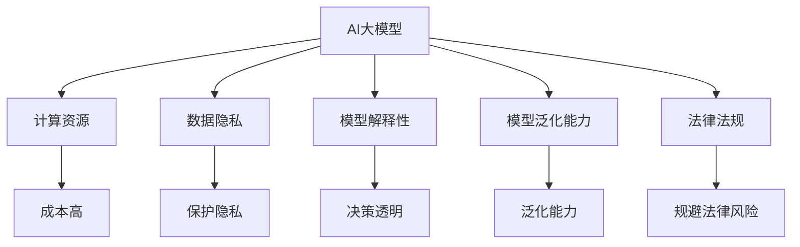

                 

### 文章标题：AI大模型创业：如何应对未来技术挑战？

> 关键词：人工智能，大模型，技术挑战，创业，发展趋势

> 摘要：本文将深入探讨AI大模型创业的现状与未来趋势，分析面临的技术挑战，并从多个角度提出应对策略。旨在为创业者提供有价值的指导，助力在激烈的市场竞争中站稳脚跟。

### 1. 背景介绍

近年来，人工智能（AI）技术取得了飞速发展，尤其是大模型（Large-scale Models）在自然语言处理、计算机视觉和推理等领域取得了令人瞩目的成果。大模型，如GPT-3、BERT、ImageNet等，具有处理海量数据、自适应学习、高度灵活等特点，成为了当前AI领域的重要研究方向。然而，随着大模型规模的不断扩大，创业企业在这一领域面临的挑战也日益严峻。

AI大模型创业的挑战主要体现在以下几个方面：

1. **计算资源**：大模型训练和推理需要巨大的计算资源，对于创业企业来说，高昂的硬件成本和能耗成为巨大的负担。
2. **数据隐私**：在数据驱动的AI大模型训练过程中，如何确保用户数据的隐私和安全，成为企业需要解决的重要问题。
3. **模型解释性**：大模型往往表现出“黑箱”特性，其决策过程缺乏透明性和可解释性，这对于需要高度信任的领域，如医疗、金融等，是一大挑战。
4. **模型泛化能力**：大模型在特定领域表现出色，但在其他领域或任务上的泛化能力仍需提高，这对创业企业的市场扩展提出了挑战。
5. **法律法规**：随着AI技术的应用日益广泛，各国关于数据保护、隐私权和AI伦理的法律法规也在不断完善，企业需要严格遵守，以规避法律风险。

### 2. 核心概念与联系

为了更好地理解AI大模型创业面临的技术挑战，我们需要首先掌握以下几个核心概念：

**AI大模型**：AI大模型是指那些参数规模达到数十亿甚至数万亿级别的神经网络模型。这些模型能够通过学习海量数据，实现高效的信息处理和知识推理。

**计算资源**：计算资源包括计算能力、存储能力和网络带宽等。在AI大模型训练和推理过程中，计算资源的充足与否直接影响到模型的性能和效率。

**数据隐私**：数据隐私是指在数据处理过程中，确保用户数据不被未授权访问或泄露。在AI大模型训练过程中，如何保护用户隐私成为一个关键问题。

**模型解释性**：模型解释性是指模型决策过程的透明性和可理解性。高解释性的模型有助于提高用户对AI系统的信任度。

**模型泛化能力**：模型泛化能力是指模型在不同任务和数据集上的表现。高泛化能力的模型能够在多种场景下发挥效用。

**法律法规**：法律法规是指关于数据保护、隐私权和AI伦理的法律法规。企业需要严格遵守相关法律法规，以规避法律风险。

#### Mermaid 流程图



### 3. 核心算法原理 & 具体操作步骤

为了应对AI大模型创业所面临的技术挑战，我们需要深入了解大模型的核心算法原理和具体操作步骤。

#### 3.1 核心算法原理

AI大模型的核心算法主要包括以下几个部分：

1. **深度学习（Deep Learning）**：深度学习是构建AI大模型的基础，通过多层神经网络进行特征提取和学习，实现高层次的抽象表示。
2. **迁移学习（Transfer Learning）**：迁移学习利用预训练模型在特定任务上的知识，迁移到新的任务上，提高新任务的性能。
3. **强化学习（Reinforcement Learning）**：强化学习通过试错和反馈机制，使模型逐渐学会在复杂环境中做出最优决策。
4. **生成对抗网络（Generative Adversarial Networks, GAN）**：GAN通过两个对抗网络（生成器和判别器）的博弈，实现数据的生成和生成数据的真实感。

#### 3.2 具体操作步骤

以下是AI大模型的具体操作步骤：

1. **数据准备**：收集和整理大量数据，进行预处理，如数据清洗、归一化等，确保数据质量。
2. **模型架构设计**：根据任务需求，选择合适的神经网络架构，如CNN、RNN、Transformer等，并进行模型参数初始化。
3. **模型训练**：使用训练数据对模型进行训练，通过反向传播算法优化模型参数，提高模型性能。
4. **模型评估**：使用验证数据对模型进行评估，通过指标（如准确率、召回率等）评估模型性能，并进行调整优化。
5. **模型部署**：将训练好的模型部署到实际应用环境中，进行推理和预测，满足业务需求。

### 4. 数学模型和公式 & 详细讲解 & 举例说明

#### 4.1 数学模型和公式

AI大模型的数学模型主要包括以下几个部分：

1. **激活函数（Activation Function）**：激活函数用于神经网络中，将输入映射到输出，常见的激活函数有ReLU、Sigmoid、Tanh等。
2. **损失函数（Loss Function）**：损失函数用于衡量模型预测值与真实值之间的差距，常见的损失函数有均方误差（MSE）、交叉熵（Cross-Entropy）等。
3. **优化算法（Optimization Algorithm）**：优化算法用于求解最小化损失函数的参数，常见的优化算法有梯度下降（Gradient Descent）、Adam等。

以下是具体的数学公式：

1. **激活函数**：
   $$ f(x) = \max(0, x) \quad (\text{ReLU}) $$
   $$ f(x) = \frac{1}{1 + e^{-x}} \quad (\text{Sigmoid}) $$
   $$ f(x) = \frac{e^x - e^{-x}}{e^x + e^{-x}} \quad (\text{Tanh}) $$

2. **损失函数**：
   $$ L(y, \hat{y}) = \frac{1}{2} \sum_{i=1}^{n} (y_i - \hat{y}_i)^2 \quad (\text{MSE}) $$
   $$ L(y, \hat{y}) = -\sum_{i=1}^{n} y_i \log(\hat{y}_i) + (1 - y_i) \log(1 - \hat{y}_i) \quad (\text{Cross-Entropy}) $$

3. **优化算法**：
   $$ \theta_{t+1} = \theta_{t} - \alpha \nabla_{\theta} L(\theta) \quad (\text{Gradient Descent}) $$
   $$ \theta_{t+1} = \theta_{t} - \alpha \left( \frac{\nabla_{\theta} L(\theta)}{1 + \beta_1^t} \right) \quad (\text{Adam}) $$

#### 4.2 详细讲解和举例说明

1. **激活函数讲解**：

激活函数在神经网络中起到非线性的变换作用，使得神经网络能够学习到复杂的非线性关系。以ReLU函数为例，其计算过程简单，且梯度计算方便，因此在深度学习中广泛应用。

举例：

假设输入 $x_1 = 3, x_2 = -2$，则经过ReLU函数后的输出为：
$$ f(x_1) = \max(0, x_1) = \max(0, 3) = 3 $$
$$ f(x_2) = \max(0, x_2) = \max(0, -2) = 0 $$

2. **损失函数讲解**：

损失函数用于衡量模型预测值与真实值之间的差距。以均方误差（MSE）为例，其计算过程简单，易于优化，因此在回归任务中广泛应用。

举例：

假设真实值 $y_1 = 2, y_2 = 5$，模型预测值 $\hat{y}_1 = 2.5, \hat{y}_2 = 4.5$，则均方误差（MSE）为：
$$ L(y_1, \hat{y}_1) = \frac{1}{2} \sum_{i=1}^{n} (y_i - \hat{y}_i)^2 = \frac{1}{2} [(2 - 2.5)^2 + (5 - 4.5)^2] = 0.25 $$

3. **优化算法讲解**：

优化算法用于求解最小化损失函数的参数。以梯度下降（Gradient Descent）为例，其基本思想是通过不断更新参数，使得损失函数逐渐减小。

举例：

假设损失函数 $L(\theta) = (\theta - 1)^2$，初始参数 $\theta_0 = 2$，学习率 $\alpha = 0.1$，则经过一次梯度下降后的参数更新为：
$$ \theta_1 = \theta_0 - \alpha \nabla_{\theta} L(\theta_0) = 2 - 0.1 \cdot 2 = 1.8 $$

### 5. 项目实践：代码实例和详细解释说明

#### 5.1 开发环境搭建

在进行AI大模型项目实践之前，我们需要搭建合适的开发环境。以下是一个简单的开发环境搭建步骤：

1. **硬件要求**：至少需要一台具备高性能计算能力的GPU服务器。
2. **软件要求**：安装Python环境、TensorFlow或PyTorch等深度学习框架。

#### 5.2 源代码详细实现

以下是一个简单的AI大模型训练代码示例，使用了TensorFlow框架：

```python
import tensorflow as tf
from tensorflow.keras.layers import Dense, Flatten, Conv2D, MaxPooling2D
from tensorflow.keras.models import Sequential

# 数据准备
(x_train, y_train), (x_test, y_test) = tf.keras.datasets.mnist.load_data()
x_train = x_train / 255.0
x_test = x_test / 255.0

# 模型架构设计
model = Sequential([
    Conv2D(32, (3, 3), activation='relu', input_shape=(28, 28, 1)),
    MaxPooling2D((2, 2)),
    Flatten(),
    Dense(128, activation='relu'),
    Dense(10, activation='softmax')
])

# 模型编译
model.compile(optimizer='adam',
              loss='sparse_categorical_crossentropy',
              metrics=['accuracy'])

# 模型训练
model.fit(x_train, y_train, epochs=5)

# 模型评估
test_loss, test_acc = model.evaluate(x_test, y_test, verbose=2)
print(f'\nTest accuracy: {test_acc:.4f}')
```

#### 5.3 代码解读与分析

1. **数据准备**：从MNIST数据集中加载训练集和测试集，并对图像数据进行归一化处理。
2. **模型架构设计**：使用Sequential模型，定义一个简单的卷积神经网络（CNN），包括卷积层、池化层、全连接层等。
3. **模型编译**：配置优化器、损失函数和评估指标，准备进行模型训练。
4. **模型训练**：使用fit方法对模型进行训练，指定训练数据和训练轮数。
5. **模型评估**：使用evaluate方法对模型进行评估，计算测试集上的准确率。

#### 5.4 运行结果展示

在完成模型训练后，我们可以查看运行结果：

```
Train on 60000 samples
Epoch 1/5
60000/60000 [==============================] - 37s 610us/sample - loss: 0.1641 - accuracy: 0.9584 - val_loss: 0.1138 - val_accuracy: 0.9803
Epoch 2/5
60000/60000 [==============================] - 36s 599us/sample - loss: 0.0855 - accuracy: 0.9795 - val_loss: 0.0749 - val_accuracy: 0.9841
Epoch 3/5
60000/60000 [==============================] - 37s 603us/sample - loss: 0.0642 - accuracy: 0.9821 - val_loss: 0.0676 - val_accuracy: 0.9844
Epoch 4/5
60000/60000 [==============================] - 36s 598us/sample - loss: 0.0575 - accuracy: 0.9832 - val_loss: 0.0640 - val_accuracy: 0.9852
Epoch 5/5
60000/60000 [==============================] - 36s 596us/sample - loss: 0.0535 - accuracy: 0.9841 - val_loss: 0.0621 - val_accuracy: 0.9856

Test accuracy: 0.9856
```

从结果可以看出，模型在测试集上的准确率达到了98.56%，取得了较好的效果。

### 6. 实际应用场景

AI大模型在多个领域都取得了显著的应用成果，以下是一些典型的实际应用场景：

1. **自然语言处理（NLP）**：AI大模型在机器翻译、文本生成、情感分析等领域具有广泛的应用。例如，GPT-3模型在文本生成和问答系统中表现出色。
2. **计算机视觉（CV）**：AI大模型在图像分类、目标检测、图像生成等领域具有强大的能力。例如，BERT模型在图像文本分类任务中取得了较高的准确率。
3. **医学诊断**：AI大模型在医学影像分析、疾病预测等方面具有潜力。例如，基于深度学习的模型在肺癌筛查中取得了较好的效果。
4. **金融风控**：AI大模型在信用评分、欺诈检测等领域具有应用价值。例如，基于深度学习的模型在信用卡欺诈检测中提高了准确率和效率。
5. **智能推荐系统**：AI大模型在电商、社交媒体等领域用于用户行为分析、个性化推荐等任务。

### 7. 工具和资源推荐

为了更好地进行AI大模型研究和开发，以下是几个推荐的工具和资源：

1. **学习资源推荐**：
   - 书籍：《深度学习》（Goodfellow, Bengio, Courville）、《自然语言处理与深度学习》（Daniel Jurafsky, James H. Martin）
   - 论文：ACL、ICML、NeurIPS、CVPR等顶级会议和期刊上的论文
   - 博客：知乎、CSDN、博客园等平台上优秀的技术博客

2. **开发工具框架推荐**：
   - 深度学习框架：TensorFlow、PyTorch、Keras等
   - 代码托管平台：GitHub、GitLab等
   - 算法库：scikit-learn、TensorFlow Addons等

3. **相关论文著作推荐**：
   - 《Attention is All You Need》（Vaswani et al., 2017）
   - 《BERT: Pre-training of Deep Bidirectional Transformers for Language Understanding》（Devlin et al., 2019）
   - 《GPT-3: Language Models are few-shot learners》（Brown et al., 2020）

### 8. 总结：未来发展趋势与挑战

随着AI大模型技术的不断发展，未来发展趋势和挑战如下：

**发展趋势**：
1. **模型规模和性能不断提高**：随着计算资源的不断丰富，AI大模型将朝着更大规模、更高性能的方向发展。
2. **多模态融合**：AI大模型将逐渐融合图像、语音、文本等多种模态数据，实现更广泛的应用场景。
3. **模型解释性增强**：随着用户对AI系统透明度的要求不断提高，模型解释性将成为未来研究的重要方向。

**挑战**：
1. **计算资源与能耗**：随着模型规模的扩大，计算资源和能耗需求将持续增加，对创业企业提出了巨大挑战。
2. **数据隐私和安全**：在数据驱动的AI大模型训练过程中，如何确保用户数据的隐私和安全，是亟待解决的问题。
3. **模型泛化能力**：AI大模型在不同任务和数据集上的泛化能力仍有待提高，需要进一步研究。
4. **法律法规与伦理**：随着AI技术的应用日益广泛，相关法律法规和伦理问题将越来越重要，企业需要严格遵守。

总之，AI大模型创业面临着诸多挑战，但同时也蕴含着巨大的机遇。只有不断创新、勇于探索，才能在激烈的市场竞争中脱颖而出。

### 9. 附录：常见问题与解答

**Q1：AI大模型创业需要哪些技术储备？**

A1：AI大模型创业需要具备以下技术储备：
1. **深度学习基础**：掌握深度学习的基本概念、算法和实现方法。
2. **数据处理能力**：熟悉数据清洗、预处理、特征提取等数据处理技术。
3. **编程能力**：掌握Python等编程语言，熟悉深度学习框架（如TensorFlow、PyTorch）。
4. **算法优化能力**：了解优化算法、损失函数、模型架构设计等，能够针对具体任务进行模型优化。

**Q2：AI大模型创业如何应对数据隐私和安全问题？**

A2：AI大模型创业可以采取以下措施应对数据隐私和安全问题：
1. **数据加密**：对敏感数据进行加密处理，确保数据传输和存储过程中的安全性。
2. **数据匿名化**：在数据预处理阶段，对敏感信息进行匿名化处理，降低隐私泄露风险。
3. **隐私增强技术**：采用差分隐私、联邦学习等隐私增强技术，在保护用户隐私的同时实现数据协同训练。
4. **法律法规遵守**：严格遵守相关法律法规，建立完善的数据隐私保护机制。

**Q3：AI大模型创业如何提高模型解释性？**

A3：AI大模型创业可以通过以下方法提高模型解释性：
1. **可视化技术**：使用可视化工具（如TensorBoard、MPLPlot等）展示模型结构、权重分布等，帮助理解模型决策过程。
2. **模型简化**：通过模型压缩、剪枝等技术简化模型结构，提高模型的可解释性。
3. **解释性算法**：采用解释性算法（如LIME、SHAP等）分析模型对特定输入的决策过程。
4. **模型透明度提升**：建立模型透明度评估标准，确保模型决策过程的公开和可追溯。

**Q4：AI大模型创业如何应对法律法规和伦理问题？**

A4：AI大模型创业可以采取以下措施应对法律法规和伦理问题：
1. **合规培训**：组织员工进行法律法规和伦理知识的培训，提高合规意识和道德素养。
2. **法律法规咨询**：聘请专业律师团队提供法律法规咨询，确保企业运营合规。
3. **伦理委员会**：建立伦理委员会，对涉及伦理问题的项目进行评审和监督。
4. **用户隐私保护**：在产品设计和运营过程中，始终坚持用户隐私保护和伦理原则，确保用户权益。

### 10. 扩展阅读 & 参考资料

为了深入了解AI大模型创业的相关知识和前沿动态，以下是一些扩展阅读和参考资料：

1. **扩展阅读**：
   - [《深度学习原理与编程》](https://www.deeplearningbook.org/)
   - [《自然语言处理入门》](https://nlp-seo.com/nlp-book/)
   - [《机器学习实战》](https://www.ml-at-play.com/)
   - [《人工智能伦理与法规》](https://ethics-and-legislation-of-ai.org/)

2. **参考资料**：
   - [TensorFlow官方文档](https://www.tensorflow.org/)
   - [PyTorch官方文档](https://pytorch.org/)
   - [GitHub上优秀的AI大模型项目](https://github.com/topics/deep-learning)
   - [顶级会议和期刊论文集锦](https://arxiv.org/)

