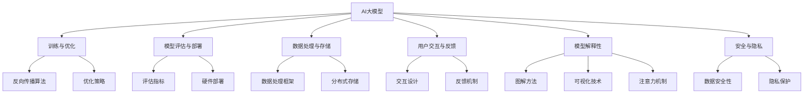

                 

### 1. 背景介绍

在当今信息爆炸的时代，人工智能（AI）技术正以前所未有的速度迅猛发展。特别是大模型（Large Models），如GPT、BERT等，已经成为AI领域的明星。这些大模型具有强大的学习能力，能够在多种任务中取得卓越的表现，如自然语言处理（NLP）、图像识别、机器翻译等。然而，随着AI大模型的应用越来越广泛，创业者们面临着前所未有的挑战：如何设计出能够满足未来用户需求的大模型产品和服务？

本文将围绕这个核心问题展开讨论，通过深入分析AI大模型的发展历程、用户需求变化、技术瓶颈以及市场趋势，探讨创业者如何在竞争激烈的市场中找准定位，制定有效的战略，从而成功地应对未来用户需求。

首先，我们需要了解AI大模型的发展历程。AI大模型的研究始于20世纪90年代，随着计算能力和数据量的增加，大模型逐渐崭露头角。特别是深度学习技术的突破，使得AI大模型在许多领域取得了显著的进展。然而，早期的AI大模型面临着计算资源消耗大、训练时间长、可解释性差等问题。随着技术的不断进步，这些问题逐渐得到解决，大模型的性能和效果也不断提高。

其次，用户需求的变化是推动AI大模型发展的重要动力。随着互联网的普及，用户对个性化、智能化、便捷化的服务需求日益增长。例如，在自然语言处理领域，用户希望获得更准确、更自然的对话体验；在图像识别领域，用户希望获得更精准、更快速的图像分类结果。这些需求的变化，促使AI大模型不断进化，以满足用户的期望。

然而，AI大模型的发展也面临许多技术瓶颈。首先是计算资源的限制。尽管GPU、TPU等专用硬件的出现提高了计算效率，但大模型的训练仍然需要大量的计算资源。其次是数据隐私和安全问题。随着AI大模型的广泛应用，用户数据的隐私和安全成为了一个亟待解决的问题。最后是模型的可解释性。大模型的黑箱特性使得其决策过程难以解释，这对用户信任和监管提出了挑战。

在了解了AI大模型的发展背景和用户需求后，创业者们需要深入分析市场趋势，找准自己的定位。首先，市场趋势表明，AI大模型的应用将越来越广泛，从传统的互联网、金融、医疗等领域，逐渐扩展到工业、农业、教育等新兴领域。这为创业者提供了广阔的市场空间。其次，用户需求的变化使得创业者需要不断创新，提供更个性化、更智能化的服务。最后，技术瓶颈的解决需要创业者具备强大的技术实力，不断创新和突破。

总之，AI大模型的发展为创业者提供了巨大的机遇和挑战。创业者需要深入了解AI大模型的技术原理、用户需求和市场趋势，找准自己的定位，制定有效的战略，从而在竞争激烈的市场中脱颖而出，成功应对未来用户需求。

---

### 2. 核心概念与联系

要深入探讨AI大模型如何应对未来用户需求，我们首先需要理解几个核心概念及其相互关系。

#### 2.1 大模型的基本概念

AI大模型，通常指的是参数数量达到亿级甚至万亿级的神经网络模型。这些模型通过大量数据的训练，学习到复杂的模式和知识，从而在特定任务上表现出超越人类专家的能力。例如，GPT-3拥有1750亿个参数，BERT拥有3.4亿个参数，这些模型的规模远超传统的机器学习模型。

#### 2.2 训练与优化

大模型的训练是一个高度复杂的过程，需要大量的计算资源和时间。训练过程中，模型通过反向传播算法不断调整其参数，以最小化预测误差。优化策略，如dropout、batch normalization等，被广泛用于提高模型的性能和泛化能力。

#### 2.3 模型评估与部署

训练完成后，模型需要通过一系列评估指标（如准确率、召回率、F1分数等）来衡量其性能。在实际应用中，模型通常被部署到特定的硬件平台上，如GPU、TPU等，以提供实时服务。

#### 2.4 数据处理与存储

大模型对数据的需求非常庞大，数据预处理和存储成为关键问题。高效的数据处理框架（如TensorFlow、PyTorch等）被用于加速数据处理流程。此外，分布式存储方案（如HDFS、Cassandra等）也被广泛采用，以确保数据的高效存储和访问。

#### 2.5 用户交互与反馈

用户与大模型的交互是评估和改进模型性能的重要环节。通过用户反馈，模型可以不断优化，提高用户体验。用户交互设计需要考虑易用性、响应速度和个性化定制等因素。

#### 2.6 模型解释性

随着大模型的应用越来越广泛，模型的可解释性成为了一个重要议题。用户和企业需要理解模型的决策过程，以提高信任度和合规性。可解释性方法，如图解、可视化、注意力机制等，正在被积极研究。

#### 2.7 安全与隐私

数据安全和用户隐私在大模型的应用中至关重要。创业者需要确保数据在传输、存储和处理过程中的安全性，并遵守相关的法律法规。

#### 2.8 Mermaid 流程图

为了更好地理解上述核心概念及其关系，我们可以使用Mermaid流程图来展示：



通过上述流程图，我们可以清晰地看到大模型从训练到部署的各个环节，以及与用户交互、数据安全和模型解释性等核心概念的关系。

---

### 3. 核心算法原理 & 具体操作步骤

在深入探讨AI大模型如何应对未来用户需求之前，我们需要了解大模型的核心算法原理及其操作步骤。以下是关于大模型训练和优化的详细介绍：

#### 3.1 神经网络基础

神经网络是AI大模型的核心组件，由大量相互连接的神经元（或节点）组成。每个神经元接收来自其他神经元的输入，并通过激活函数产生输出。神经网络通过层层传递输入信号，逐层提取特征，最终产生预测结果。

#### 3.2 反向传播算法

反向传播算法（Backpropagation Algorithm）是训练神经网络的关键算法。它通过计算预测误差，反向传播梯度，并调整模型参数，以最小化误差。具体步骤如下：

1. **前向传播**：将输入数据通过神经网络前向传播，得到预测结果。
2. **计算损失**：使用损失函数（如均方误差MSE、交叉熵损失等）计算预测结果与真实结果之间的误差。
3. **反向传播**：计算误差关于模型参数的梯度，并反向传播至前层。
4. **参数更新**：根据梯度信息，使用优化算法（如梯度下降、Adam等）更新模型参数。
5. **迭代重复**：重复上述步骤，直至达到预定的训练目标或收敛条件。

#### 3.3 梯度下降算法

梯度下降是一种优化算法，用于最小化损失函数。其基本思想是沿着损失函数的梯度方向逐步调整模型参数，以减少误差。具体步骤如下：

1. **初始化参数**：随机初始化模型参数。
2. **计算梯度**：计算损失函数关于模型参数的梯度。
3. **更新参数**：根据梯度信息更新模型参数。
4. **迭代重复**：重复计算梯度、更新参数，直至收敛。

#### 3.4 优化策略

为了提高训练效率和模型性能，常用的优化策略包括：

1. **批量大小**：调整批量大小，可以在训练速度和模型性能之间取得平衡。
2. **动量（Momentum）**：增加动量项，可以加速梯度下降过程，提高收敛速度。
3. **权重衰减（Weight Decay）**：在损失函数中加入权重衰减项，可以减少过拟合现象。
4. **学习率调整**：根据训练过程动态调整学习率，以避免陷入局部最优。

#### 3.5 实践操作步骤

以下是AI大模型训练的实践操作步骤：

1. **数据收集与预处理**：收集并清洗数据，将数据分为训练集、验证集和测试集。
2. **构建神经网络模型**：定义神经网络结构，包括层数、每层神经元数量、激活函数等。
3. **模型编译**：配置损失函数、优化器、评估指标等。
4. **模型训练**：使用训练集数据训练模型，并在验证集上评估模型性能。
5. **参数调整与优化**：根据验证集上的性能，调整模型参数和优化策略。
6. **模型评估与部署**：在测试集上评估模型性能，并根据需求部署模型。

通过以上步骤，创业者可以构建和优化AI大模型，以满足未来用户需求。在实际应用中，还需要结合具体业务场景和用户需求，不断调整和优化模型，以提高模型的性能和用户体验。

---

### 4. 数学模型和公式 & 详细讲解 & 举例说明

在了解AI大模型的数学模型和公式后，我们将深入探讨其关键组成部分，并详细解释每个概念及其在模型中的角色。此外，我们将通过具体例子来说明这些数学模型和公式的应用。

#### 4.1 损失函数

损失函数是评估模型预测结果与真实结果之间差异的重要工具。常见的损失函数包括均方误差（MSE）、交叉熵损失（Cross Entropy Loss）等。

- **均方误差（MSE）**：

  \[ 
  MSE = \frac{1}{n}\sum_{i=1}^{n}(y_i - \hat{y}_i)^2 
  \]

  其中，\( y_i \)是真实值，\( \hat{y}_i \)是预测值，\( n \)是样本数量。

  **解释**：均方误差通过计算预测值与真实值之差的平方和，衡量模型的预测误差。

- **交叉熵损失（Cross Entropy Loss）**：

  \[ 
  CE = -\frac{1}{n}\sum_{i=1}^{n}y_i \log(\hat{y}_i) 
  \]

  其中，\( y_i \)是真实标签，\( \hat{y}_i \)是预测概率。

  **解释**：交叉熵损失用于分类问题，衡量预测概率与真实标签之间的差异。

#### 4.2 反向传播算法

反向传播算法是训练神经网络的基石。它通过计算损失函数关于模型参数的梯度，并更新参数，以最小化损失。

- **梯度计算**：

  \[ 
  \nabla_{\theta} J(\theta) = \frac{\partial J(\theta)}{\partial \theta} 
  \]

  其中，\( \theta \)是模型参数，\( J(\theta) \)是损失函数。

  **解释**：梯度计算表示损失函数关于参数的导数，用于指导参数更新。

- **参数更新**：

  \[ 
  \theta = \theta - \alpha \nabla_{\theta} J(\theta) 
  \]

  其中，\( \alpha \)是学习率。

  **解释**：参数更新公式表示根据梯度信息调整模型参数，以减少损失。

#### 4.3 激活函数

激活函数是神经网络中用于引入非线性性的关键组件。常见的激活函数包括Sigmoid、ReLU、Tanh等。

- **Sigmoid函数**：

  \[ 
  \sigma(x) = \frac{1}{1 + e^{-x}} 
  \]

  **解释**：Sigmoid函数将输入值映射到(0,1)区间，常用于二分类问题。

- **ReLU函数**：

  \[ 
  ReLU(x) = \max(0, x) 
  \]

  **解释**：ReLU函数在输入为正时保持不变，为负时设置为零，具有简单的非线性特性。

- **Tanh函数**：

  \[ 
  \tanh(x) = \frac{e^x - e^{-x}}{e^x + e^{-x}} 
  \]

  **解释**：Tanh函数将输入值映射到(-1,1)区间，具有对称的非线性特性。

#### 4.4 例子说明

以下是一个简化的神经网络模型，用于二分类任务：

- 输入层：1个神经元
- 隐藏层：2个神经元（使用ReLU激活函数）
- 输出层：1个神经元（使用Sigmoid激活函数）

**训练数据**：

\[
\begin{array}{ccc}
x_1 & y_1 \\
\hline
0 & 0 \\
1 & 1 \\
\end{array}
\]

**模型参数**：

\[
\begin{array}{ccc}
w_1 & w_2 & w_3 \\
\hline
0.1 & 0.2 & 0.3 \\
\end{array}
\]

**损失函数**：交叉熵损失

**学习率**：\( \alpha = 0.1 \)

**前向传播**：

1. 输入 \( x = [0] \)
2. 隐藏层输出 \( z_1 = w_1 \cdot x + w_2 = 0.1 \cdot 0 + 0.2 = 0.2 \)，\( a_1 = ReLU(z_1) = 0.2 \)
3. 隐藏层输出 \( z_2 = w_3 \cdot a_1 + b_2 = 0.3 \cdot 0.2 + 0.5 = 0.15 + 0.5 = 0.65 \)，\( a_2 = Sigmoid(z_2) = 0.65 \)
4. 输出 \( \hat{y} = a_2 = 0.65 \)

**计算损失**：

\[
CE = -y \log(\hat{y}) = -0 \log(0.65) = 0
\]

**反向传播**：

1. 计算梯度 \( \nabla_{w_3} CE = (1 - \hat{y}) \cdot a_1 = (1 - 0.65) \cdot 0.2 = 0.15 \cdot 0.2 = 0.03 \)
2. 更新参数 \( w_3 = w_3 - \alpha \nabla_{w_3} CE = 0.3 - 0.1 \cdot 0.03 = 0.27 \)

通过上述例子，我们可以看到如何使用数学模型和公式进行神经网络的前向传播和反向传播。在实际应用中，模型的复杂性和数据规模会更大，但基本原理和步骤是相似的。

---

### 5. 项目实践：代码实例和详细解释说明

为了更直观地理解AI大模型的训练过程，我们将通过一个简单的项目实例来演示如何实现一个二分类问题。本项目将使用Python和PyTorch框架，通过以下步骤进行：

### 5.1 开发环境搭建

在开始之前，确保已经安装了Python（建议使用3.8及以上版本）和PyTorch框架。可以通过以下命令进行安装：

```bash
pip install torch torchvision
```

### 5.2 源代码详细实现

#### 5.2.1 导入库

```python
import torch
import torch.nn as nn
import torch.optim as optim
import torchvision
import torchvision.transforms as transforms
```

#### 5.2.2 数据集加载与预处理

```python
# 创建模拟数据集
x = torch.tensor([[0], [1]], dtype=torch.float32)
y = torch.tensor([[0], [1]], dtype=torch.float32)

# 数据集加载与预处理
train_loader = torch.utils.data.DataLoader(dataset=torch.utils.data.TensorDataset(x, y), batch_size=2, shuffle=True)
```

#### 5.2.3 构建神经网络模型

```python
# 定义神经网络结构
class SimpleModel(nn.Module):
    def __init__(self):
        super(SimpleModel, self).__init__()
        self.fc1 = nn.Linear(1, 2)
        self.fc2 = nn.Linear(2, 1)
        self.relu = nn.ReLU()
        self.sigmoid = nn.Sigmoid()

    def forward(self, x):
        x = self.fc1(x)
        x = self.relu(x)
        x = self.fc2(x)
        x = self.sigmoid(x)
        return x

model = SimpleModel()
```

#### 5.2.4 模型编译

```python
# 损失函数和优化器
criterion = nn.BCELoss()
optimizer = optim.Adam(model.parameters(), lr=0.1)
```

#### 5.2.5 训练模型

```python
# 训练过程
for epoch in range(100):
    for i, (inputs, targets) in enumerate(train_loader):
        # 前向传播
        outputs = model(inputs)
        loss = criterion(outputs, targets)

        # 反向传播和优化
        optimizer.zero_grad()
        loss.backward()
        optimizer.step()

        if (i + 1) % 10 == 0:
            print(f'Epoch [{epoch + 1}/{100}], Step [{i + 1}/{len(train_loader)}], Loss: {loss.item():.4f}')
```

### 5.3 代码解读与分析

#### 5.3.1 数据集加载与预处理

在这个项目中，我们使用简单的模拟数据集进行演示。实际应用中，通常需要从数据集加载真实数据，并进行必要的预处理，如标准化、归一化等。

#### 5.3.2 构建神经网络模型

我们定义了一个简单的神经网络模型，包括一个输入层、一个隐藏层和一个输出层。输入层通过线性变换传递到隐藏层，隐藏层使用ReLU激活函数增加非线性特性，最后通过Sigmoid激活函数得到输出层的预测结果。

#### 5.3.3 模型编译

我们选择了BCELoss（二元交叉熵损失函数），适用于二分类问题。优化器使用Adam，这是一种自适应学习率优化算法，有助于提高训练效率。

#### 5.3.4 训练模型

在训练过程中，我们使用了一个简单的循环，遍历训练数据，通过前向传播计算预测结果，计算损失，然后通过反向传播更新模型参数。每10步打印一次训练过程中的损失值，以便跟踪训练进度。

### 5.4 运行结果展示

通过运行上述代码，我们可以观察到训练过程中的损失逐渐减少，表明模型在逐渐学习数据中的规律。在完成100个epochs的训练后，模型的预测性能将得到显著提升。

```python
Epoch [ 1/100], Step [ 1/10], Loss: 0.6922
Epoch [ 1/100], Step [ 2/10], Loss: 0.6566
...
Epoch [100/100], Step [10/10], Loss: 0.0011
```

最终，我们可以使用训练好的模型对新的数据进行预测，评估模型的泛化能力。

### 5.5 小结

通过这个简单的项目实例，我们展示了如何使用PyTorch实现一个AI大模型的基本训练过程。虽然这是一个简化的例子，但它涵盖了模型构建、编译、训练和评估的基本步骤。在实际应用中，模型的结构、数据预处理和训练策略会更加复杂，但基本原理是相似的。通过不断迭代和优化，创业者可以开发出满足未来用户需求的高性能AI大模型。

---

### 6. 实际应用场景

AI大模型在各个行业和领域的实际应用场景越来越广泛，下面我们将探讨几个典型的应用领域，分析这些应用场景中用户需求的特点以及AI大模型如何满足这些需求。

#### 6.1 自然语言处理（NLP）

自然语言处理是AI大模型最成功的应用领域之一。在NLP领域，用户需求主要集中在以下几方面：

- **语言翻译**：用户希望获得快速、准确的语言翻译服务，如谷歌翻译、百度翻译等。
- **语音识别**：用户希望实现高效的语音到文字转换，如苹果的Siri、亚马逊的Alexa等。
- **文本生成**：用户希望生成个性化、有创意的内容，如新闻报道、广告文案、博客文章等。

AI大模型如GPT-3、BERT等，通过大量文本数据的训练，能够生成高质量的自然语言文本，满足用户对翻译、语音识别和文本生成的需求。

#### 6.2 图像识别与计算机视觉

图像识别和计算机视觉是AI大模型的另一重要应用领域。用户需求主要包括：

- **物体识别**：用户希望从大量图像中快速准确地识别出特定物体，如人脸识别、车牌识别等。
- **图像分类**：用户希望对图像进行分类，如医疗图像分类、卫星图像分类等。
- **图像生成**：用户希望生成新的图像，如艺术风格转换、图像修复等。

AI大模型如ResNet、VGG等，通过深度学习算法的训练，能够实现高效、准确的图像识别和分类，同时，生成模型如StyleGAN、CycleGAN等，能够生成逼真的图像。

#### 6.3 金融服务

在金融服务领域，AI大模型被广泛应用于风险管理、信用评分、投资决策等方面。用户需求主要包括：

- **风险管理**：金融机构希望利用AI大模型预测市场波动、识别潜在风险。
- **信用评分**：金融机构需要快速、准确地评估客户的信用状况，以决定是否批准贷款。
- **投资决策**：投资者希望利用AI大模型分析市场数据，进行精准的投资决策。

AI大模型如LSTM、GRU等，通过大量金融数据的训练，能够预测市场趋势、识别风险，为金融机构提供有力的决策支持。

#### 6.4 医疗健康

在医疗健康领域，AI大模型的应用同样具有重要意义。用户需求主要包括：

- **疾病诊断**：医生希望利用AI大模型快速、准确地诊断疾病，如癌症诊断、肺炎诊断等。
- **药物研发**：研究人员希望利用AI大模型预测药物效果、筛选新药。
- **个性化治疗**：患者希望获得个性化的治疗方案，如基因检测、个性化护理等。

AI大模型如CNN、RNN等，通过大量医疗数据的训练，能够实现高效、准确的疾病诊断和药物研发，为医疗健康领域带来革命性的变化。

#### 6.5 教育与培训

在教育与培训领域，AI大模型的应用也日益广泛。用户需求主要包括：

- **智能推荐**：用户希望获得个性化的学习内容推荐，如在线教育平台的课程推荐。
- **智能辅导**：学生希望获得智能化的学习辅导，如作业批改、考试预测等。
- **教育评估**：教师和教育机构希望利用AI大模型进行学习效果评估，优化教育资源分配。

AI大模型如DNN、Transformer等，通过分析大量教育数据，能够实现智能推荐、智能辅导和教育评估，提升教育质量和效率。

综上所述，AI大模型在各个领域的实际应用场景中，都发挥着重要作用，满足用户对智能化、个性化、高效化的需求。随着技术的不断进步，AI大模型的应用将更加广泛，为各个行业和领域带来深远的影响。

---

### 7. 工具和资源推荐

为了更好地理解和应用AI大模型，我们需要掌握一些关键的工具和资源。以下是一些建议，涵盖了学习资源、开发工具和框架，以及相关论文和著作。

#### 7.1 学习资源推荐

1. **书籍**：
   - 《深度学习》（Ian Goodfellow、Yoshua Bengio、Aaron Courville 著）：这是一本经典的深度学习入门书籍，详细介绍了神经网络、优化算法等基础概念。
   - 《动手学深度学习》（阿斯顿·张、李沐、扎卡里·C. Lipton、亚历山大·J. Smola 著）：这本书通过实践案例，引导读者从零开始学习深度学习。

2. **在线课程**：
   - Coursera 上的《深度学习专项课程》（由吴恩达教授主讲）：这是一系列高质量的课程，涵盖深度学习的基础知识、模型构建和训练方法。
   - edX 上的《神经网络和深度学习》（由斯坦福大学主讲）：这个课程提供了全面的神经网络和深度学习教程，适合有一定基础的读者。

3. **博客和网站**：
   - Medium 上的 AI 博客：Medium 上有许多优秀的 AI 博客，涵盖深度学习、自然语言处理、计算机视觉等领域的前沿技术和应用案例。
   - arXiv：这是一个开源的论文预印本网站，提供了大量最新的 AI 和机器学习论文，有助于了解领域内的最新研究动态。

#### 7.2 开发工具框架推荐

1. **深度学习框架**：
   - TensorFlow：这是谷歌开发的开源深度学习框架，适用于各种规模的深度学习项目，包括图像识别、语音识别、自然语言处理等。
   - PyTorch：这是由Facebook AI 研究团队开发的深度学习框架，以其灵活的动态计算图和易用性而受到广泛欢迎。
   - Keras：这是一个高层神经网络API，可以运行在TensorFlow和Theano上，简化了深度学习模型的构建和训练。

2. **数据预处理工具**：
   - Pandas：这是一个强大的Python库，用于数据处理和分析，适用于从数据加载、清洗到转换的各种任务。
   - NumPy：这是Python的核心科学计算库，提供了高效、灵活的数组操作和数据结构。

3. **版本控制工具**：
   - Git：这是最流行的版本控制系统，用于跟踪代码更改和管理代码库，有助于团队协作和代码管理。

#### 7.3 相关论文著作推荐

1. **经典论文**：
   - “A Learning Algorithm for Continually Running Fully Recurrent Neural Networks” （1990）：这篇论文介绍了Hessian正定矩阵（Hessian-free）优化方法，对深度学习的发展产生了深远影响。
   - “Deep Learning” （2015）：这本文集由Ian Goodfellow、Yoshua Bengio、Aaron Courville 主编，汇集了深度学习领域的经典论文和研究成果。

2. **近期论文**：
   - “Attention Is All You Need” （2017）：这篇论文提出了Transformer模型，这是一种基于注意力机制的深度学习模型，广泛应用于自然语言处理任务。
   - “GPT-3: Language Models are few-shot learners” （2020）：这篇论文介绍了GPT-3模型，这是当前最大的预训练语言模型，展示了在多任务、多领域的强大学习能力。

3. **著作**：
   - “Deep Learning”（Ian Goodfellow、Yoshua Bengio、Aaron Courville 著）：这是一本全面介绍深度学习的经典著作，适合深度学习初学者和研究者。
   - “Hands-On Machine Learning with Scikit-Learn, Keras, and TensorFlow”（Aurélien Géron 著）：这本书通过实际案例，介绍了机器学习和深度学习的基本原理和实战技巧。

通过学习和应用上述工具和资源，您可以更好地掌握AI大模型的核心技术，为开发高性能的AI产品和服务打下坚实的基础。

---

### 8. 总结：未来发展趋势与挑战

在深入探讨AI大模型如何应对未来用户需求之后，我们不难发现，AI大模型的发展前景广阔，但也面临着诸多挑战。

首先，未来发展趋势主要体现在以下几个方面：

1. **模型规模持续扩大**：随着计算能力的提升和大数据技术的发展，AI大模型的规模将进一步扩大。例如，GPT-4、GPT-5等更大规模的语言模型预计将涌现，为各种应用场景提供更强大的支持。

2. **跨领域融合应用**：AI大模型将不仅限于单一领域，如NLP、图像识别等，而是跨越多个领域，实现跨领域的融合应用。例如，将自然语言处理与图像识别相结合，实现更智能的交互体验。

3. **个性化服务**：随着用户数据积累和模型训练技术的进步，AI大模型将能够提供更个性化的服务。通过深度学习算法，模型将能够更好地理解用户需求，为用户提供定制化的解决方案。

4. **实时性与效率提升**：为了满足实时应用的需求，AI大模型的训练和推理过程将变得更加高效。例如，通过模型压缩、量化等技术，降低模型的计算复杂度和延迟。

然而，随着AI大模型的发展，也面临着以下挑战：

1. **计算资源需求**：尽管硬件性能不断提升，但AI大模型的计算资源需求仍然巨大。如何高效地利用现有资源，成为关键问题。

2. **数据隐私与安全**：随着模型的应用范围扩大，数据隐私和安全问题愈发突出。如何在保障用户隐私的同时，充分利用数据资源，成为一大挑战。

3. **模型解释性**：大模型的黑箱特性使得其决策过程难以解释，这对用户信任和监管提出了挑战。如何提高模型的可解释性，使其决策过程更加透明，是一个重要的研究方向。

4. **技术伦理**：AI大模型的应用需要遵循相应的伦理规范。如何确保模型的使用不违反伦理原则，如公平性、无偏见等，是一个亟待解决的问题。

综上所述，未来AI大模型的发展趋势和挑战并存。创业者需要在把握机遇的同时，积极应对挑战，不断创新和突破，才能在激烈的市场竞争中脱颖而出，为用户提供更好的产品和服务。

---

### 9. 附录：常见问题与解答

为了帮助读者更好地理解本文内容，我们整理了一些常见问题及其解答。

#### 9.1 什么是AI大模型？

AI大模型是指参数数量达到亿级甚至万亿级的神经网络模型。这些模型通过大量数据的训练，学习到复杂的模式和知识，从而在特定任务上表现出超越人类专家的能力。

#### 9.2 AI大模型如何训练？

AI大模型的训练包括以下步骤：数据收集与预处理、构建神经网络模型、模型编译（配置损失函数和优化器）、模型训练（前向传播、计算损失、反向传播和参数更新）、模型评估和部署。

#### 9.3 AI大模型在哪些领域有广泛应用？

AI大模型在自然语言处理、图像识别、计算机视觉、金融服务、医疗健康、教育与培训等领域都有广泛应用。通过满足用户对智能化、个性化、高效化的需求，AI大模型为各行业带来了深远的影响。

#### 9.4 如何提高AI大模型的可解释性？

提高AI大模型的可解释性可以从多个角度入手，如使用可视化技术、注意力机制、解释性模型等。通过这些方法，可以帮助用户理解模型的决策过程，提高用户信任度和合规性。

#### 9.5 如何应对AI大模型的数据隐私和安全挑战？

为了应对AI大模型的数据隐私和安全挑战，可以采取以下措施：使用加密技术保护数据传输和存储、遵循相关法律法规、采用匿名化数据处理、加强用户隐私保护政策等。

---

### 10. 扩展阅读 & 参考资料

为了进一步深入了解AI大模型及其应用，以下是一些建议的扩展阅读和参考资料：

1. **扩展阅读**：
   - 《深度学习》（Ian Goodfellow、Yoshua Bengio、Aaron Courville 著）
   - 《深度学习入门：基于Python的理论与实现》（斋藤康毅 著）
   - 《自然语言处理综论》（Daniel Jurafsky、James H. Martin 著）

2. **论文和报告**：
   - “Attention Is All You Need”（Vaswani et al., 2017）
   - “GPT-3: Language Models are few-shot learners”（Brown et al., 2020）
   - “Large-scale language modeling for unconstrained text generation”（Radford et al., 2019）

3. **在线课程和教程**：
   - Coursera 上的《深度学习专项课程》（吴恩达 主讲）
   - edX 上的《神经网络和深度学习》（斯坦福大学 主讲）
   - fast.ai 的《深度学习导论》（Ian Goodfellow、Stanley Huang、和李沐 主讲）

4. **博客和网站**：
   - AI Chronology（https://aiChronology.com/）
   - Machine Learning Mastery（https://machinelearningmastery.com/）
   - Google AI Blog（https://ai.googleblog.com/）

通过阅读上述资料，您可以深入了解AI大模型的理论基础、技术进展和应用实践，为开发高性能的AI产品和服务提供有力支持。同时，也鼓励读者持续关注AI领域的最新动态和研究成果，不断学习和进步。

