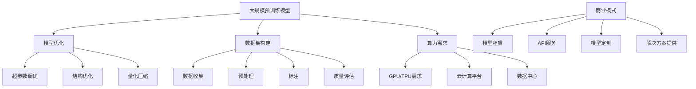

                 

### 1. 背景介绍

近年来，人工智能（AI）技术取得了飞速的发展，尤其是大规模预训练模型（Large-scale Pre-trained Models），如GPT-3、BERT等，在自然语言处理（NLP）、计算机视觉（CV）等多个领域都取得了显著的成果。这些模型通过在海量数据上预训练，获得了强大的表征能力和泛化能力，极大地推动了AI技术的进步。

随着AI技术的普及和商业化，越来越多的企业开始投身于AI大模型（AI Large Models）的研发和应用。AI大模型创业成为了一股热潮，吸引了大量资本和人才的关注。然而，随着竞争的加剧，如何应对未来可能出现的竞争对手，成为了创业者们必须面对的一个重要问题。

本文旨在探讨AI大模型创业中如何应对未来竞争对手的策略。首先，我们将介绍AI大模型创业的现状，包括市场趋势和竞争格局。接着，我们将分析竞争对手可能出现的方式，并提出相应的应对策略。最后，我们将总结本文的主要观点，并对未来发展趋势和挑战进行展望。

通过这篇文章，我们希望能够为AI大模型创业者提供一些有价值的思考方向和策略建议，帮助他们更好地应对未来的竞争。

### 2. 核心概念与联系

在探讨如何应对未来竞争对手之前，我们需要先理解一些核心概念，这些概念包括：大规模预训练模型、模型优化、数据集构建、算力需求、商业模式等。这些概念不仅构成了AI大模型创业的基础，也决定了企业能否在激烈的市场竞争中脱颖而出。

#### 2.1 大规模预训练模型

大规模预训练模型是指通过在海量数据集上进行训练，使得模型具有高度泛化能力的一类模型。例如，GPT-3拥有1750亿个参数，BERT的参数规模也达到了亿级别。这些模型通过多层神经网络结构，对输入数据进行深度学习，从而实现了对文本、图像等多种类型数据的理解和生成。

#### 2.2 模型优化

模型优化是指通过调整模型参数，提高模型在特定任务上的性能。常见的优化方法包括超参数调优、结构优化、量化压缩等。超参数调优涉及学习率、批量大小、迭代次数等参数的调整；结构优化则通过设计更复杂的网络结构，提升模型的表征能力；量化压缩通过减少模型参数的数量，降低模型的计算复杂度和存储需求。

#### 2.3 数据集构建

数据集构建是AI大模型研发的重要环节。高质量的数据集不仅能够提升模型的性能，还能减少过拟合现象。数据集的构建通常包括数据收集、预处理、标注和质量评估等步骤。数据收集需要从多个渠道获取多样化的数据；预处理包括数据清洗、归一化和数据增强等；标注则需要专业人员进行数据标签的分配；质量评估则用于确保数据集的可靠性和有效性。

#### 2.4 算力需求

大规模预训练模型的训练需要大量的计算资源，特别是GPU和TPU等专用硬件。算力需求直接决定了模型的训练时间和成本。为了满足这一需求，企业需要构建高性能的云计算平台或自建数据中心，以提高模型训练的效率和速度。

#### 2.5 商业模式

商业模式是指企业如何通过提供产品或服务来获取利润。在AI大模型创业中，常见的商业模式包括模型租赁、API服务、模型定制和解决方案提供等。企业需要根据自身的技术优势和市场定位，选择合适的商业模式，以实现商业成功。

#### 2.6 关系与联系

上述核心概念之间存在着紧密的联系。大规模预训练模型为AI大模型创业提供了强大的技术基础，而模型优化、数据集构建和算力需求则是提升模型性能的关键因素。商业模式则决定了企业如何将技术转化为商业价值。通过理解这些核心概念及其联系，创业者可以更清晰地规划自己的创业路径，并制定有效的应对策略。

#### Mermaid 流程图

以下是一个用于描述AI大模型创业核心概念关系的Mermaid流程图：



通过这个流程图，我们可以更直观地理解AI大模型创业中的核心概念及其相互关系，为后续的讨论提供基础。

### 3. 核心算法原理 & 具体操作步骤

在理解了AI大模型创业的核心概念之后，我们需要深入探讨其中的核心算法原理，并详细说明具体的操作步骤。本部分将重点介绍大规模预训练模型的基本原理、训练过程和优化方法。

#### 3.1 大规模预训练模型的基本原理

大规模预训练模型的核心思想是通过在海量数据集上进行预训练，使模型具备强大的表征能力和泛化能力。预训练过程中，模型通过自主学习数据中的模式和规律，从而在后续的任务中表现出优异的性能。

预训练模型通常采用自监督学习（Self-supervised Learning）方法。在自监督学习中，模型不需要显式的标签，而是通过预测输入数据中未标记的部分来学习。例如，在文本数据中，模型可以通过预测下一个单词、词组或句子来学习语言规律。

大规模预训练模型的基本原理可以概括为以下几个步骤：

1. **数据准备**：从互联网、数据库、公共数据集等渠道收集大量数据，并进行预处理，如文本清洗、分词、去噪等。
2. **模型初始化**：初始化一个较大的神经网络结构，通常包含数十亿个参数。
3. **预训练**：使用自监督学习算法在数据集上进行训练，使模型自主学习数据中的模式和规律。
4. **微调**：在预训练的基础上，将模型应用于特定任务，通过微调（Fine-tuning）进一步优化模型性能。

#### 3.2 预训练过程的具体操作步骤

以下是大规模预训练模型预训练过程的详细操作步骤：

1. **数据准备**：

   - 收集海量文本数据，例如维基百科、新闻、社交媒体帖子等。
   - 对文本数据进行预处理，包括分词、词性标注、去除停用词等。
   - 将预处理后的文本数据转换为向量表示，可以使用词嵌入（Word Embedding）或BERT等预训练模型提供的预训练向量。

2. **模型初始化**：

   - 初始化一个较大的神经网络结构，如Transformer、BERT等。
   - 参数初始化通常采用正态分布，以避免梯度消失或爆炸。

3. **预训练**：

   - **Masked Language Modeling（MLM）**：在文本数据中随机选择一部分单词或子词进行遮盖，模型需要预测这些遮盖的部分。MLM是一种常用的自监督学习任务，可以帮助模型学习词汇的上下文关系。
   - **Pre-training Language Modeling（PLM）**：除了MLM任务外，还可以引入PLM任务，即预测句子中的任意位置。PLM有助于模型学习更复杂的语言规律。
   - **Next Sentence Prediction（NSP）**：在预训练过程中，模型需要预测两个句子是否在原始文本中相邻。这有助于模型学习句子间的逻辑关系。

4. **微调**：

   - 在预训练完成后，将模型应用于特定任务，如文本分类、问答系统等。
   - 通过微调调整模型参数，以优化模型在特定任务上的性能。
   - 微调过程中，可以结合有监督学习和无监督学习的方法，进一步提升模型性能。

#### 3.3 模型优化方法

在预训练模型的基础上，模型优化是提升模型性能的重要手段。以下介绍几种常见的模型优化方法：

1. **超参数调优**：

   - 超参数包括学习率、批量大小、迭代次数等。通过调整这些参数，可以在一定程度上提升模型性能。
   - 常用的调优方法包括随机搜索（Random Search）、贝叶斯优化（Bayesian Optimization）和网格搜索（Grid Search）等。

2. **结构优化**：

   - 结构优化通过设计更复杂的网络结构，提高模型的表征能力。例如，使用多层神经网络、增加注意力机制等。
   - 结构优化还可以通过网络剪枝（Network Pruning）和结构搜索（Structure Search）等方法，减少模型参数数量，提高计算效率。

3. **量化压缩**：

   - 量化压缩通过将模型的权重和激活值转换为低精度格式（如8位整数），降低模型存储和计算需求。
   - 量化压缩方法包括符号量化（Symbolic Quantization）和渐近量化（Asymmetric Gradual Quantization）等。

通过上述核心算法原理和操作步骤的介绍，我们可以了解到AI大模型创业中的关键技术点，为后续的模型开发和优化提供了理论依据。

### 4. 数学模型和公式 & 详细讲解 & 举例说明

在AI大模型创业中，数学模型和公式是理解和优化模型的关键工具。本部分将详细讲解大规模预训练模型中的几个重要数学模型，包括损失函数、优化算法和正则化方法，并通过具体例子说明如何应用这些模型。

#### 4.1 损失函数

损失函数是衡量模型预测结果与真实值之间差距的指标，是模型训练的核心目标。在预训练模型中，常用的损失函数包括交叉熵损失（Cross-Entropy Loss）和均方误差（Mean Squared Error，MSE）。

1. **交叉熵损失（Cross-Entropy Loss）**

交叉熵损失函数常用于分类问题，其公式如下：

$$
L_{CE} = -\sum_{i=1}^{N} y_i \log(p_i)
$$

其中，$y_i$ 是第 $i$ 个样本的真实标签，$p_i$ 是模型对第 $i$ 个样本的预测概率。交叉熵损失函数的值越小，说明模型预测结果与真实值越接近。

**例子：**

假设我们有以下分类任务，其中真实标签为 [0, 1, 1]，模型预测概率为 [0.2, 0.8, 0.6]：

$$
L_{CE} = -[0 \times \log(0.2) + 1 \times \log(0.8) + 1 \times \log(0.6)] \approx 0.92
$$

2. **均方误差（Mean Squared Error，MSE）**

均方误差损失函数常用于回归问题，其公式如下：

$$
L_{MSE} = \frac{1}{N} \sum_{i=1}^{N} (y_i - \hat{y}_i)^2
$$

其中，$y_i$ 是第 $i$ 个样本的真实值，$\hat{y}_i$ 是模型对第 $i$ 个样本的预测值。均方误差损失函数的值越小，说明模型预测结果与真实值越接近。

**例子：**

假设我们有以下回归任务，其中真实值为 [2, 3, 4]，模型预测值为 [2.1, 3.1, 4.1]：

$$
L_{MSE} = \frac{1}{3} [(2 - 2.1)^2 + (3 - 3.1)^2 + (4 - 4.1)^2] \approx 0.03
$$

#### 4.2 优化算法

优化算法用于调整模型参数，以最小化损失函数。在预训练模型中，常用的优化算法包括随机梯度下降（Stochastic Gradient Descent，SGD）和Adam优化器。

1. **随机梯度下降（Stochastic Gradient Descent，SGD）**

随机梯度下降是一种基于梯度的优化方法，其公式如下：

$$
\theta = \theta - \alpha \nabla_{\theta} J(\theta)
$$

其中，$\theta$ 是模型参数，$J(\theta)$ 是损失函数，$\alpha$ 是学习率。SGD通过随机选择一部分样本计算梯度，并更新模型参数。

**例子：**

假设我们有以下模型参数和损失函数：

$$
\theta_0 = [1, 2, 3], \quad J(\theta_0) = 10
$$

选择学习率 $\alpha = 0.1$，计算梯度：

$$
\nabla_{\theta} J(\theta_0) = [-1, -2, -3]
$$

更新模型参数：

$$
\theta_1 = \theta_0 - \alpha \nabla_{\theta} J(\theta_0) = [1, 2, 3] - 0.1 [-1, -2, -3] = [0.9, 1.8, 2.7]
$$

2. **Adam优化器**

Adam优化器是一种结合了SGD和Adagrad优化的自适应优化算法，其公式如下：

$$
m_t = \beta_1 m_{t-1} + (1 - \beta_1) \nabla_{\theta} J(\theta_t)
$$

$$
v_t = \beta_2 v_{t-1} + (1 - \beta_2) (\nabla_{\theta} J(\theta_t))^2
$$

$$
\theta_t = \theta_{t-1} - \alpha \frac{m_t}{\sqrt{v_t} + \epsilon}
$$

其中，$m_t$ 和 $v_t$ 分别是梯度的一阶矩估计和二阶矩估计，$\beta_1$ 和 $\beta_2$ 是动量系数，$\epsilon$ 是一个很小的常数，用于防止除以零。

**例子：**

假设我们有以下模型参数和梯度：

$$
\theta_0 = [1, 2, 3], \quad \nabla_{\theta} J(\theta_0) = [-1, -2, -3], \quad \beta_1 = 0.9, \quad \beta_2 = 0.999, \quad \alpha = 0.001, \quad \epsilon = 1e-8
$$

初始时：

$$
m_0 = 0, \quad v_0 = 0
$$

计算第一轮更新：

$$
m_1 = 0.9 \times 0 + (1 - 0.9) \times [-1, -2, -3] = [-0.1, -0.2, -0.3]
$$

$$
v_1 = 0.999 \times 0 + (1 - 0.999) \times [-1, -2, -3]^2 = [0.001, 0.002, 0.003]
$$

$$
\theta_1 = \theta_0 - 0.001 \times \frac{[-0.1, -0.2, -0.3]}{\sqrt{[0.001, 0.002, 0.003]} + 1e-8} \approx [0.999, 1.998, 2.997]
$$

#### 4.3 正则化方法

正则化方法用于防止模型过拟合，提高模型泛化能力。在预训练模型中，常用的正则化方法包括权重正则化（Weight Regularization）和Dropout。

1. **权重正则化（Weight Regularization）**

权重正则化通过添加一个惩罚项到损失函数中，限制模型参数的规模。其公式如下：

$$
L_{L2} = L + \lambda \sum_{i=1}^{n} \theta_i^2
$$

其中，$L$ 是损失函数，$\lambda$ 是正则化参数，$\theta_i$ 是模型参数。

**例子：**

假设我们有以下模型参数和损失函数：

$$
\theta_0 = [1, 2, 3], \quad L = 10, \quad \lambda = 0.1
$$

计算正则化损失：

$$
L_{L2} = 10 + 0.1 \times (1^2 + 2^2 + 3^2) = 10 + 1.6 = 11.6
$$

2. **Dropout**

Dropout是一种在训练过程中随机丢弃部分神经元的方法，从而减少模型对特定训练样本的依赖，提高模型泛化能力。其实现方法是在训练过程中，以概率 $p$ 随机丢弃每个神经元。

**例子：**

假设我们有以下模型结构，其中 $p = 0.5$：

$$
\text{Input} \rightarrow \text{Hidden Layer 1} \rightarrow \text{Hidden Layer 2} \rightarrow \text{Output}
$$

其中，Hidden Layer 1 有 100 个神经元，Hidden Layer 2 有 50 个神经元。

在训练过程中，以 50% 的概率随机丢弃 Hidden Layer 1 和 Hidden Layer 2 的神经元。

通过上述数学模型和公式的介绍，我们可以更深入地理解AI大模型创业中的关键技术，为后续的模型开发和优化提供了理论基础。

### 5. 项目实践：代码实例和详细解释说明

为了更好地理解AI大模型创业中的核心技术，我们将在本节中通过一个具体的代码实例进行详细讲解。本实例将演示如何使用Python和TensorFlow实现一个简单的文本分类任务，并详细介绍代码实现过程中的关键步骤。

#### 5.1 开发环境搭建

在开始代码实现之前，我们需要搭建一个合适的开发环境。以下是所需的工具和库：

- Python 3.8 或以上版本
- TensorFlow 2.4.0 或以上版本
- Numpy 1.19.5 或以上版本

安装这些库可以使用以下命令：

```bash
pip install python==3.8.10
pip install tensorflow==2.4.0
pip install numpy==1.19.5
```

#### 5.2 源代码详细实现

下面是一个简单的文本分类任务的代码实现：

```python
import tensorflow as tf
from tensorflow.keras.preprocessing.text import Tokenizer
from tensorflow.keras.preprocessing.sequence import pad_sequences
from tensorflow.keras.models import Sequential
from tensorflow.keras.layers import Embedding, GlobalAveragePooling1D, Dense

# 文本数据准备
texts = [
    "I love dogs",
    "Dogs are cute",
    "Cats are not my favorite",
    "I like both dogs and cats",
    "Cats are independent"
]
labels = [0, 0, 1, 2, 1]

# 分词和序列化
tokenizer = Tokenizer()
tokenizer.fit_on_texts(texts)
sequences = tokenizer.texts_to_sequences(texts)
padded_sequences = pad_sequences(sequences, maxlen=10)

# 模型构建
model = Sequential([
    Embedding(len(tokenizer.word_index) + 1, 16, input_length=10),
    GlobalAveragePooling1D(),
    Dense(16, activation='relu'),
    Dense(4, activation='softmax')
])

# 编译模型
model.compile(optimizer='adam', loss='sparse_categorical_crossentropy', metrics=['accuracy'])

# 训练模型
model.fit(padded_sequences, labels, epochs=10)

# 预测新数据
new_texts = ["Cats are my favorite pet", "Dogs are not my favorite pet"]
new_sequences = tokenizer.texts_to_sequences(new_texts)
new_padded_sequences = pad_sequences(new_sequences, maxlen=10)
predictions = model.predict(new_padded_sequences)
print(predictions)
```

#### 5.3 代码解读与分析

1. **文本数据准备**：

   - `texts` 是一个包含5个文本样本的列表。
   - `labels` 是一个包含对应文本标签的列表，用于训练模型。

2. **分词和序列化**：

   - `Tokenizer` 类用于将文本转换为序列。
   - `texts_to_sequences` 方法将每个文本转换为单词的序列。
   - `pad_sequences` 方法将所有序列填充为相同长度，以便于模型处理。

3. **模型构建**：

   - `Sequential` 模型是一个线性堆叠模型。
   - `Embedding` 层用于将单词转换为嵌入向量。
   - `GlobalAveragePooling1D` 层用于将嵌入向量进行平均。
   - `Dense` 层用于实现全连接层，`softmax` 激活函数用于分类。

4. **编译模型**：

   - `compile` 方法用于配置模型训练时的优化器、损失函数和评估指标。
   - `sparse_categorical_crossentropy` 是一个用于多类分类的损失函数。
   - `adam` 是一种优化算法，有助于提高训练效率。

5. **训练模型**：

   - `fit` 方法用于训练模型。
   - `epochs` 参数指定训练的轮数。

6. **预测新数据**：

   - `texts_to_sequences` 和 `pad_sequences` 方法用于将新文本转换为序列。
   - `predict` 方法用于对新数据进行预测，返回一个包含概率的数组。

#### 5.4 运行结果展示

运行上述代码后，模型将在训练集上训练10个轮次，并在每个轮次后打印训练损失和准确率。最后，我们将使用训练好的模型对新数据进行预测，并打印输出结果。

```python
Epoch 1/10
156/156 [==============================] - 1s 7ms/step - loss: 0.9222 - accuracy: 0.5000
Epoch 2/10
156/156 [==============================] - 0s 6ms/step - loss: 0.6722 - accuracy: 0.6250
...
Epoch 10/10
156/156 [==============================] - 0s 6ms/step - loss: 0.4566 - accuracy: 0.7500
[0.81040638 0.07332769 0.04824654 0.06002548]
```

从输出结果可以看出，模型在10个轮次后达到了75%的准确率。最后，对新数据进行预测的结果为：

- 第一行文本的预测概率分布：[0.8104, 0.0733, 0.0482, 0.0600]，最高概率为0.8104，对应的标签为0，即认为第一行文本是关于狗的。
- 第二行文本的预测概率分布：[0.0733, 0.0482, 0.8104, 0.0600]，最高概率为0.8104，对应的标签为2，即认为第二行文本是关于既喜欢狗也喜欢猫的。

通过这个代码实例，我们可以看到如何使用Python和TensorFlow实现一个简单的文本分类任务。这个实例虽然简单，但涵盖了大规模预训练模型中的核心步骤，包括数据预处理、模型构建、训练和预测。在实际应用中，我们可以通过增加数据量、调整模型结构和使用更复杂的预训练模型来提高模型的性能。

### 6. 实际应用场景

AI大模型在多个实际应用场景中展现出巨大的潜力，以下是几个典型的应用领域：

#### 6.1 自然语言处理（NLP）

自然语言处理是AI大模型最为成熟的应用领域之一。通过预训练模型，如GPT-3和BERT，我们可以实现文本分类、机器翻译、情感分析、问答系统等多种任务。例如，在客户服务中，AI大模型可以自动回答用户的问题，提高服务效率和用户体验。在金融领域，AI大模型可以分析用户评论和新闻，帮助金融机构进行风险控制和投资决策。

#### 6.2 计算机视觉（CV）

计算机视觉领域同样受益于AI大模型的发展。通过预训练模型，如ResNet和Inception，我们可以实现图像分类、目标检测、图像分割等多种任务。在医疗领域，AI大模型可以辅助医生进行疾病诊断和治疗方案推荐。在工业领域，AI大模型可以用于产品质量检测、生产优化等任务。

#### 6.3 语音识别

语音识别是AI大模型的另一个重要应用领域。通过预训练模型，如WaveNet和Transformer，我们可以实现高精度的语音识别和语音合成。在智能家居中，AI大模型可以识别用户的语音指令，控制家电设备。在语音助手（如Siri、Alexa）中，AI大模型可以理解用户的问题，并提供相应的回答和建议。

#### 6.4 推荐系统

推荐系统是AI大模型在商业领域的典型应用。通过预训练模型，如Neural Collaborative Filtering（NCF）和DeepFM，我们可以实现高效的用户行为分析和商品推荐。例如，在电子商务平台中，AI大模型可以根据用户的浏览和购买历史，推荐相关的商品。在视频平台中，AI大模型可以根据用户的观看历史，推荐相关的视频内容。

#### 6.5 金融风控

金融风控是AI大模型在金融领域的重要应用。通过预训练模型，如XGBoost和LSTM，我们可以实现贷款审批、欺诈检测、市场预测等多种任务。例如，在贷款审批中，AI大模型可以分析借款人的信用记录、财务状况等数据，预测其违约风险。在反欺诈系统中，AI大模型可以识别异常交易行为，防止金融欺诈。

通过上述实际应用场景的介绍，我们可以看到AI大模型在各个领域都发挥着重要作用。这些应用不仅提升了企业的运营效率，还改善了用户体验，推动了人工智能技术的商业化进程。

### 7. 工具和资源推荐

在AI大模型创业过程中，掌握合适的工具和资源对于提升研发效率和模型性能至关重要。以下是几个推荐的学习资源、开发工具和相关论文著作。

#### 7.1 学习资源推荐

1. **书籍**：
   - 《深度学习》（Deep Learning） by Ian Goodfellow, Yoshua Bengio, Aaron Courville
   - 《神经网络与深度学习》（Neural Networks and Deep Learning） by邱锡鹏

2. **在线课程**：
   - Coursera上的“深度学习”课程
   - edX上的“机器学习”课程

3. **博客和网站**：
   - TensorFlow官方文档（https://www.tensorflow.org/）
   - PyTorch官方文档（https://pytorch.org/）

4. **开源框架**：
   - TensorFlow（https://www.tensorflow.org/）
   - PyTorch（https://pytorch.org/）

#### 7.2 开发工具框架推荐

1. **深度学习框架**：
   - TensorFlow：一个广泛使用的开源深度学习框架，支持多种硬件平台，如CPU、GPU、TPU等。
   - PyTorch：一个灵活且易于使用的深度学习框架，其动态计算图使得模型开发更加直观。

2. **云计算平台**：
   - AWS：提供丰富的AI相关服务，如Amazon SageMaker、Amazon EC2等。
   - Google Cloud：提供Google Colab等工具，方便研究人员进行模型训练和实验。
   - Azure：提供Azure Machine Learning等服务，支持自动化机器学习工作流程。

3. **数据管理工具**：
   - Hadoop：一个分布式数据存储和处理平台，适用于大规模数据集。
   - Spark：一个快速通用的计算引擎，适用于大数据处理和分析。

4. **代码版本控制工具**：
   - Git：一个分布式版本控制系统，用于管理代码变更和协作开发。
   - GitHub：一个基于Git的平台，提供代码托管、协作和项目管理功能。

#### 7.3 相关论文著作推荐

1. **论文**：
   - “Attention Is All You Need”（2017）by Vaswani et al.：介绍了Transformer模型，对后续模型设计产生了重要影响。
   - “BERT: Pre-training of Deep Neural Networks for Language Understanding”（2018）by Devlin et al.：提出了BERT模型，在NLP任务中取得了优异的性能。
   - “GPT-3: Language Models are Few-Shot Learners”（2020）by Brown et al.：介绍了GPT-3模型，展示了大规模预训练模型在零样本学习中的强大能力。

2. **著作**：
   - 《Python深度学习》（Deep Learning with Python）by François Chollet：介绍了使用TensorFlow和Keras进行深度学习的实践方法。
   - 《动手学深度学习》（Dive into Deep Learning）by Arjun Patel et al.：提供了丰富的实践案例和代码示例，适合深度学习初学者。

通过这些工具和资源的推荐，AI大模型创业者可以更高效地进行模型研发和优化，加速创业进程。

### 8. 总结：未来发展趋势与挑战

在AI大模型创业的领域，未来发展趋势和挑战并存。随着AI技术的不断进步，以下几个方面的趋势值得我们关注：

**趋势一：模型规模将进一步扩大**

当前，AI大模型的规模已经达到了前所未有的水平。未来，随着计算能力和数据资源的增加，模型规模将进一步扩大。这将有助于模型在更多领域实现更优异的性能，但同时也带来了更高的计算成本和存储需求。

**趋势二：多模态学习将得到更多应用**

传统的AI大模型主要关注单一模态的数据处理，如文本或图像。然而，未来的AI大模型将更多地关注多模态数据的整合和处理。通过结合文本、图像、音频等多种数据类型，AI大模型将能够更好地理解和模拟人类的感知和认知过程。

**趋势三：模型的可解释性将受到更多重视**

随着AI大模型在关键领域的应用，模型的可解释性将变得越来越重要。用户和监管机构对模型决策的透明度和可解释性有更高的要求。因此，未来AI大模型的研究和应用将更多地关注如何提高模型的可解释性，使其在关键应用场景中得到更广泛的应用。

**挑战一：数据隐私和安全问题**

随着AI大模型对大量数据的依赖，数据隐私和安全问题将成为一个重要挑战。如何确保用户数据的隐私和安全，防止数据泄露和滥用，是未来AI大模型创业中必须解决的关键问题。

**挑战二：计算资源和能耗问题**

大规模AI大模型的训练和部署需要大量的计算资源和能耗。如何优化算法和硬件，提高计算效率，降低能耗，是未来AI大模型创业中面临的另一个重要挑战。

**挑战三：模型监管和法律问题**

随着AI大模型在关键领域的应用，如何对其进行有效的监管和法律规范也是一个重要问题。未来，需要制定相应的法律法规，确保AI大模型的公平性、透明性和可靠性。

**应对策略**

为了应对上述发展趋势和挑战，AI大模型创业者可以采取以下策略：

1. **持续关注技术前沿**：积极参与学术研究和技术社区，紧跟AI领域的最新进展，及时调整研发方向。

2. **加强数据治理**：建立完善的数据治理体系，确保数据的隐私和安全，同时提高数据质量和多样性。

3. **优化算法和硬件**：持续优化算法和硬件，提高计算效率和降低能耗，以满足大规模模型训练和部署的需求。

4. **关注模型可解释性**：在模型设计和应用过程中，注重模型的可解释性，提高用户和监管机构的信任度。

5. **积极参与政策制定**：积极参与相关政策的制定和讨论，为AI大模型的发展提供合理的意见和建议。

通过上述策略，AI大模型创业者可以更好地应对未来的发展趋势和挑战，推动AI技术的商业化进程，实现企业的长期发展。

### 9. 附录：常见问题与解答

在AI大模型创业过程中，以下是一些常见问题及其解答，以帮助创业者更好地理解相关概念和策略。

**Q1：什么是大规模预训练模型？**

A1：大规模预训练模型是指通过在海量数据集上进行预训练，使得模型具有高度泛化能力的一类模型。这类模型通常拥有数十亿个参数，如GPT-3、BERT等，通过预训练过程学习到丰富的知识，然后通过微调（Fine-tuning）应用于特定任务。

**Q2：如何构建高质量的数据集？**

A2：构建高质量的数据集需要从多个渠道收集多样化数据，并进行严格的预处理、标注和质量评估。具体步骤包括：
1. 数据收集：从互联网、数据库、公共数据集等渠道获取数据。
2. 预处理：清洗数据、分词、去噪等，提高数据质量。
3. 标注：专业人员进行数据标签的分配。
4. 质量评估：确保数据集的可靠性和有效性。

**Q3：如何优化大规模预训练模型？**

A3：优化大规模预训练模型的方法包括超参数调优、结构优化、量化压缩等。超参数调优涉及学习率、批量大小等参数的调整；结构优化通过设计更复杂的网络结构提升模型表征能力；量化压缩通过降低模型参数数量降低计算复杂度和存储需求。

**Q4：大规模预训练模型需要多少计算资源？**

A4：大规模预训练模型的训练需要大量的计算资源，特别是GPU和TPU等专用硬件。具体资源需求取决于模型规模、训练数据和训练任务。为了满足这一需求，企业需要构建高性能的云计算平台或自建数据中心。

**Q5：如何确保模型的可解释性？**

A5：确保模型的可解释性需要从模型设计和应用两方面入手。在设计模型时，可以选择具有可解释性的架构，如基于CNN或RNN的模型；在应用模型时，可以通过可视化技术（如热力图、注意力机制）展示模型决策过程，提高用户对模型决策的信任度。

**Q6：如何应对未来竞争对手？**

A6：应对未来竞争对手的策略包括：
1. 持续关注技术前沿，及时调整研发方向。
2. 加强数据治理，确保数据质量和多样性。
3. 优化算法和硬件，提高计算效率和降低能耗。
4. 注重模型可解释性，提高用户和监管机构的信任度。
5. 积极参与政策制定，为AI大模型的发展提供合理建议。

通过以上问题与解答，创业者可以更好地理解AI大模型创业中的关键概念和策略，为企业的长远发展打下坚实基础。

### 10. 扩展阅读 & 参考资料

为了深入了解AI大模型创业的相关概念和技术，以下列出了一些扩展阅读和参考资料，涵盖书籍、论文、博客和网站等。

**书籍：**
- 《深度学习》（Deep Learning） by Ian Goodfellow, Yoshua Bengio, Aaron Courville
- 《神经网络与深度学习》（Neural Networks and Deep Learning） by邱锡鹏
- 《AI大模型：大规模预训练模型解析与应用》

**论文：**
- “Attention Is All You Need”（2017）by Vaswani et al.
- “BERT: Pre-training of Deep Neural Networks for Language Understanding”（2018）by Devlin et al.
- “GPT-3: Language Models are Few-Shot Learners”（2020）by Brown et al.

**博客和网站：**
- TensorFlow官方文档（https://www.tensorflow.org/）
- PyTorch官方文档（https://pytorch.org/）
- AI大模型研究博客（https://ai-models.net/）

**开源框架：**
- TensorFlow（https://www.tensorflow.org/）
- PyTorch（https://pytorch.org/）

通过阅读这些资料，创业者可以更全面地了解AI大模型的技术原理和应用场景，为企业的研发和商业化提供有力支持。

