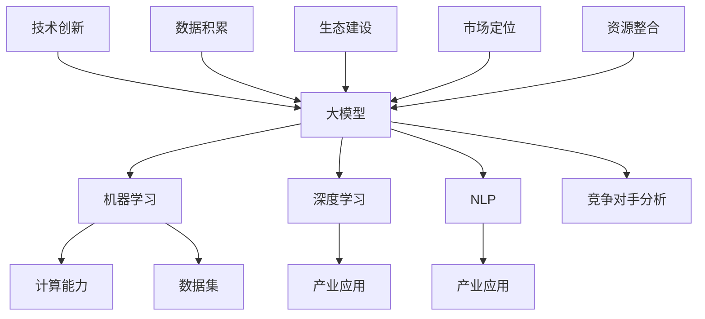

                 

### 1. 背景介绍

#### 大模型创业的兴起

近年来，随着人工智能技术的飞速发展，大模型（如GPT、BERT等）在自然语言处理、计算机视觉、语音识别等领域取得了显著的成果。这些大模型具有强大的数据处理和知识推理能力，为企业提供了前所未有的洞察力和创新空间。在这种背景下，许多创业公司纷纷投身于大模型的研究与开发，试图通过利用这些技术实现商业突破。

#### 竞争格局的变化

传统上，科技行业的竞争主要体现在技术优势、市场占有率、用户基础等方面。然而，随着大模型的广泛应用，竞争格局发生了深刻的变化。首先，技术门槛变得更高。大模型的训练需要大量的计算资源和数据集，这对企业的技术实力和资源储备提出了更高要求。其次，数据成为新的竞争要素。数据的质量和数量直接影响大模型的表现，因此，如何获取和处理高质量的数据成为了竞争的关键。最后，商业模式也在不断创新。大模型的应用场景不断拓展，从传统的搜索引擎、推荐系统到虚拟助理、自动驾驶等，创业者需要根据不同的场景设计出具有差异化的商业模式。

#### 竞争对手的应对策略

面对激烈的市场竞争，创业者需要制定有效的应对策略，以保持竞争优势。以下是一些常见的策略：

1. **技术创新**：持续投入研发，不断优化模型架构、算法和训练方法，以提升模型的性能和效率。
2. **数据积累**：积极获取并处理海量数据，通过数据驱动的创新实现产品迭代和性能提升。
3. **生态建设**：搭建开放的平台，吸引第三方开发者、合作伙伴加入，共同推动大模型生态的发展。
4. **市场定位**：明确目标市场，针对特定场景和用户需求，提供定制化的解决方案。
5. **资源整合**：与产业链上下游的企业建立战略合作关系，实现资源互补和优势共享。

### 当前市场状况分析

目前，大模型市场呈现出多元化的发展态势。一方面，一些头部企业凭借强大的技术积累和资源优势，占据了市场的主导地位；另一方面，新兴创业公司凭借创新的技术和灵活的商业模式，逐渐崭露头角。整体来看，市场仍处于快速发展的阶段，充满了机遇和挑战。

#### 市场机遇

1. **技术创新**：随着算法和模型的不断迭代，大模型在各个领域的应用潜力不断释放，为企业提供了巨大的创新空间。
2. **产业升级**：大模型的应用有助于推动传统产业的数字化转型，提升生产效率和服务质量。
3. **跨界融合**：大模型与其他技术的结合，如物联网、区块链等，将为新的商业模式和产业形态提供可能。

#### 市场挑战

1. **技术门槛**：大模型的训练和优化需要大量的计算资源和专业知识，这对企业的研发能力提出了高要求。
2. **数据隐私**：在大模型应用过程中，数据的隐私和安全问题备受关注，如何保护用户隐私成为企业必须面对的挑战。
3. **竞争激烈**：随着市场的不断扩大，竞争愈发激烈，创业者需要不断创新和优化，以保持竞争优势。

通过以上分析，我们可以看到，大模型创业不仅需要应对技术创新、数据积累等内部挑战，还需要面对激烈的市场竞争。在接下来的章节中，我们将进一步探讨如何应对未来竞争对手的策略和方法。### 2. 核心概念与联系

#### 大模型（Large Models）

大模型是指具有数十亿至数万亿参数的大型神经网络模型，如GPT、BERT等。这些模型通过学习海量数据，能够实现自然语言理解、生成、翻译等复杂任务。大模型的成功依赖于深度学习技术和大规模数据集的支撑，其规模和性能不断提升，成为当前人工智能研究的热点。

#### 机器学习（Machine Learning）

机器学习是人工智能的核心技术之一，通过构建和训练模型，使计算机能够从数据中自动学习和发现规律。大模型是机器学习的一种重要实现方式，其训练过程涉及大量参数的优化和调整，以实现高精度的预测和生成。

#### 深度学习（Deep Learning）

深度学习是机器学习的一种子领域，主要基于多层神经网络进行学习。大模型通常采用深度学习架构，通过逐层提取特征，实现对复杂数据的建模和预测。深度学习的优势在于能够自动发现数据中的层次结构，提高模型的泛化能力。

#### 自然语言处理（Natural Language Processing，NLP）

自然语言处理是人工智能的重要应用领域，旨在使计算机理解和处理人类自然语言。大模型在NLP领域取得了显著进展，如文本分类、情感分析、机器翻译等任务，其强大的语言理解和生成能力为NLP应用提供了新的可能性。

#### 计算能力（Compute Power）

计算能力是大模型训练和优化的重要基础。高性能计算平台和分布式计算技术使得大模型的训练和部署成为可能。当前，各大科技公司纷纷投入大量资源，建设大规模数据中心和云计算平台，以满足大模型对计算资源的需求。

#### 数据集（Data Sets）

数据集是大模型训练的重要输入。高质量的数据集能够提升模型的性能和泛化能力。在大模型创业中，数据集的获取、处理和利用成为关键挑战之一。创业者需要积极构建和维护高质量的数据集，以支持模型的训练和优化。

#### 产业应用（Industrial Applications）

大模型在各个产业领域具有广泛的应用前景，如金融、医疗、教育、娱乐等。创业者需要根据不同领域的需求，设计和开发定制化的大模型应用解决方案，以实现商业价值。

#### 竞争对手分析

竞争对手分析是创业者制定战略的重要环节。通过分析竞争对手的技术、产品、市场策略等，创业者可以识别自身的优势和劣势，制定有针对性的应对策略。以下是一个简单的Mermaid流程图，用于展示大模型创业中的核心概念和联系：



#### 总结

大模型创业涉及多个核心概念和联系，包括大模型、机器学习、深度学习、自然语言处理、计算能力、数据集和产业应用等。通过分析这些概念之间的联系，创业者可以更好地理解大模型创业的内在逻辑，制定有效的战略和应对策略。### 3. 核心算法原理 & 具体操作步骤

#### 3.1 大模型的训练过程

大模型的训练过程是整个算法的核心，其关键步骤包括数据预处理、模型架构设计、损失函数设计、优化算法等。以下将详细介绍这些关键步骤。

##### 3.1.1 数据预处理

数据预处理是确保模型训练质量和效率的重要环节。具体操作步骤如下：

1. **数据清洗**：去除数据集中的噪声和异常值，保证数据质量。
2. **数据标准化**：将不同尺度的数据进行归一化或标准化处理，使其适应模型的输入要求。
3. **数据增强**：通过随机裁剪、旋转、翻转等操作增加数据多样性，提升模型的泛化能力。

##### 3.1.2 模型架构设计

大模型的架构设计直接影响其性能和训练效率。常见的大模型架构包括Transformer、BERT、GPT等。以下是一个简单的模型架构设计步骤：

1. **确定模型类型**：根据应用场景选择适合的模型类型，如文本生成、文本分类、机器翻译等。
2. **设计网络结构**：根据模型类型设计网络结构，包括输入层、隐藏层和输出层等。
3. **参数初始化**：对模型的参数进行初始化，常用的方法有随机初始化、预训练模型微调等。

##### 3.1.3 损失函数设计

损失函数用于评估模型在训练过程中预测结果与真实值之间的差距，常用的损失函数包括交叉熵损失、均方误差等。以下是一个简单的损失函数设计步骤：

1. **选择损失函数**：根据任务类型选择合适的损失函数，如分类问题选择交叉熵损失，回归问题选择均方误差。
2. **优化损失函数**：通过引入正则化项、权重调整等手段优化损失函数，提高模型泛化能力。

##### 3.1.4 优化算法

优化算法用于调整模型参数，以最小化损失函数。常用的优化算法包括梯度下降、Adam等。以下是一个简单的优化算法步骤：

1. **选择优化算法**：根据模型规模和训练数据量选择合适的优化算法，如梯度下降适用于小规模模型，Adam适用于大规模模型。
2. **调整超参数**：根据实验结果调整学习率、批量大小等超参数，以实现最佳训练效果。
3. **训练过程**：执行优化算法，迭代更新模型参数，直到达到预定的训练目标。

#### 3.2 大模型的推理过程

大模型的推理过程用于根据输入数据生成预测结果。以下是一个简单的推理过程步骤：

1. **输入数据预处理**：对输入数据进行预处理，包括数据清洗、标准化等。
2. **模型加载**：从存储设备中加载训练好的模型参数。
3. **模型前向传播**：将预处理后的输入数据传递到模型中，进行前向传播计算。
4. **模型输出**：根据模型输出的特征，生成预测结果，如分类标签、文本生成等。
5. **后处理**：对预测结果进行后处理，如阈值调整、结果融合等。

#### 3.3 大模型训练与推理的对比

大模型的训练与推理过程有明显的差异，具体如下：

1. **目标不同**：训练过程旨在通过调整模型参数，使模型在训练数据上达到最优性能；推理过程则是根据模型参数生成预测结果，以应对新的输入数据。
2. **数据不同**：训练过程使用训练数据集；推理过程使用测试数据集或新的输入数据。
3. **算法不同**：训练过程通常涉及优化算法，如梯度下降；推理过程则涉及模型前向传播算法。
4. **计算量不同**：训练过程需要大量计算资源，以处理海量数据和调整模型参数；推理过程相对计算量较小，但需要快速响应。

通过以上步骤，我们可以对大模型的训练和推理过程有一个清晰的理解。在接下来的章节中，我们将进一步探讨大模型的数学模型和公式，以及如何利用这些公式进行详细讲解和举例说明。### 4. 数学模型和公式 & 详细讲解 & 举例说明

#### 4.1 大模型的基本数学模型

大模型的数学模型主要基于深度学习理论，其中最核心的部分是神经网络。以下是一个简要的神经网络数学模型介绍：

##### 4.1.1 神经网络基础

神经网络由多个神经元（或节点）组成，每个神经元都通过权重与激活函数对输入数据进行处理。一个简单的神经网络可以表示为：

$$
z = \sum_{i=1}^{n} w_i * x_i + b
$$

其中，$z$ 是神经元的输出，$w_i$ 是权重，$x_i$ 是输入，$b$ 是偏置。

##### 4.1.2 激活函数

激活函数用于引入非线性特性，使神经网络能够处理复杂问题。常用的激活函数包括：

1. **Sigmoid函数**：
$$
\sigma(z) = \frac{1}{1 + e^{-z}}
$$

2. **ReLU函数**：
$$
\text{ReLU}(z) = \max(0, z)
$$

3. **Tanh函数**：
$$
\text{Tanh}(z) = \frac{e^z - e^{-z}}{e^z + e^{-z}}
$$

#### 4.2 损失函数

损失函数用于衡量模型预测值与真实值之间的差距。在大模型训练中，常用的损失函数包括：

##### 4.2.1 交叉熵损失函数

交叉熵损失函数常用于分类问题，其公式如下：

$$
J(\theta) = -\frac{1}{m} \sum_{i=1}^{m} \sum_{k=1}^{K} y_k^{(i)} \log(z_k^{(i)})
$$

其中，$m$ 是样本数量，$K$ 是类别数量，$y_k^{(i)}$ 是第$i$个样本在第$k$个类别的真实标签，$z_k^{(i)}$ 是第$i$个样本在第$k$个类别的预测概率。

##### 4.2.2 均方误差损失函数

均方误差损失函数常用于回归问题，其公式如下：

$$
J(\theta) = \frac{1}{2m} \sum_{i=1}^{m} (h_\theta(x^{(i)}) - y^{(i)})^2
$$

其中，$m$ 是样本数量，$h_\theta(x^{(i)})$ 是第$i$个样本的预测值，$y^{(i)}$ 是第$i$个样本的真实值。

#### 4.3 优化算法

优化算法用于调整模型参数，以最小化损失函数。以下是一些常见的优化算法：

##### 4.3.1 梯度下降算法

梯度下降算法是一种最基本的优化算法，其核心思想是沿着损失函数的负梯度方向更新模型参数。其公式如下：

$$
\theta_j := \theta_j - \alpha \frac{\partial J(\theta)}{\partial \theta_j}
$$

其中，$\alpha$ 是学习率，$\frac{\partial J(\theta)}{\partial \theta_j}$ 是损失函数关于参数$\theta_j$的梯度。

##### 4.3.2 动量优化算法

动量优化算法通过引入动量项，加速梯度下降过程。其公式如下：

$$
\theta_j := \theta_j - \alpha \frac{\partial J(\theta)}{\partial \theta_j} + \beta \frac{\partial J(\theta)}{\partial \theta_j}_{\text{prev}}
$$

其中，$\beta$ 是动量因子，$\frac{\partial J(\theta)}{\partial \theta_j}_{\text{prev}}$ 是前一次迭代的梯度。

##### 4.3.3 Adam优化算法

Adam优化算法结合了动量和自适应学习率的优势，其公式如下：

$$
\theta_j := \theta_j - \alpha \frac{\beta_1 \hat{g}_j}{\sqrt{1 - \beta_2^t} + \epsilon}
$$

其中，$\hat{g}_j = \frac{1}{\beta_1} \sum_{t=1}^{t} (g_j^t)$，$g_j^t = \frac{\partial J(\theta)}{\partial \theta_j}^t$，$\beta_1$ 和 $\beta_2$ 分别是动量和自适应学习率的参数，$\epsilon$ 是一个小常数。

#### 4.4 举例说明

以下是一个简单的例子，用于说明大模型的训练和推理过程：

##### 4.4.1 数据集

假设我们有一个包含10个样本的数据集，每个样本包含一个特征和两个类别标签。数据集如下：

| 样本索引 | 特征值 | 类别标签 |
| --- | --- | --- |
| 1 | 2.5 | 0 |
| 2 | 3.1 | 1 |
| 3 | 1.8 | 0 |
| 4 | 2.9 | 1 |
| 5 | 3.7 | 1 |
| 6 | 1.6 | 0 |
| 7 | 3.2 | 1 |
| 8 | 2.4 | 0 |
| 9 | 3.0 | 1 |
| 10 | 2.8 | 1 |

##### 4.4.2 模型架构

我们设计一个简单的线性模型，只有一个神经元，使用ReLU激活函数。模型架构如下：

$$
z = \text{ReLU}(w_1 * x_1 + b)
$$

##### 4.4.3 训练过程

1. **数据预处理**：将特征值和类别标签进行标准化处理。
2. **模型初始化**：随机初始化权重$w_1$ 和偏置$b$。
3. **训练迭代**：
   - 前向传播：计算输入数据经过模型后的预测值。
   - 计算损失函数：使用交叉熵损失函数计算预测值与真实值之间的差距。
   - 反向传播：计算损失函数关于模型参数的梯度。
   - 参数更新：根据梯度下降算法更新模型参数。
4. **训练完成**：当损失函数收敛至预设阈值时，训练过程完成。

##### 4.4.4 推理过程

1. **数据预处理**：将输入数据进行标准化处理。
2. **模型加载**：从存储设备中加载训练好的模型参数。
3. **模型前向传播**：计算输入数据经过模型后的预测值。
4. **输出结果**：根据预测值输出类别标签。

通过以上步骤，我们可以完成大模型的训练和推理过程。在实际应用中，大模型的结构和算法会更加复杂，但核心思想是类似的。在接下来的章节中，我们将进一步探讨大模型的项目实践，包括开发环境搭建、源代码实现、代码解读和分析以及运行结果展示。### 5. 项目实践

#### 5.1 开发环境搭建

为了进行大模型的项目实践，首先需要搭建一个适合的开发环境。以下是一个基本的开发环境搭建步骤：

##### 5.1.1 硬件要求

- **GPU**: 选择具有较强计算能力的GPU，如NVIDIA的1080 Ti或更高级别的GPU。
- **CPU**: 最好是多核高频率的CPU，以支持并行计算。
- **内存**: 至少16GB内存，推荐32GB或更高。

##### 5.1.2 软件要求

- **操作系统**: Windows、Linux或macOS均可。
- **Python**: 安装Python 3.7及以上版本。
- **GPU驱动**: 根据GPU型号安装相应的NVIDIA驱动。
- **conda或虚拟环境**: 用于管理Python包和环境。

##### 5.1.3 安装依赖包

使用conda或pip安装以下依赖包：

```shell
conda install -c conda-forge torch torchvision torchaudio cpuonly -c pytorch torchvision torchaudio -f https://download.pytorch.org/whl/torch_stable.html
```

#### 5.2 源代码详细实现

以下是一个简单的大模型训练和推理的Python代码示例：

```python
import torch
import torch.nn as nn
import torch.optim as optim

# 数据集预处理
# 假设已经有一个名为dataset的PyTorch数据集对象
train_loader = torch.utils.data.DataLoader(dataset, batch_size=64, shuffle=True)

# 模型定义
class SimpleModel(nn.Module):
    def __init__(self):
        super(SimpleModel, self).__init__()
        self.fc1 = nn.Linear(1, 10)
        self.fc2 = nn.Linear(10, 1)
    
    def forward(self, x):
        x = torch.relu(self.fc1(x))
        x = self.fc2(x)
        return x

# 实例化模型、损失函数和优化器
model = SimpleModel()
criterion = nn.BCEWithLogitsLoss()
optimizer = optim.Adam(model.parameters(), lr=0.001)

# 训练过程
for epoch in range(100):
    for inputs, targets in train_loader:
        optimizer.zero_grad()
        outputs = model(inputs)
        loss = criterion(outputs, targets)
        loss.backward()
        optimizer.step()
    print(f'Epoch {epoch+1}, Loss: {loss.item()}')

# 推理过程
model.eval()
with torch.no_grad():
    input_data = torch.tensor([[2.5]])
    prediction = model(input_data)
    print(f'Prediction: {prediction.item()}')
```

#### 5.3 代码解读与分析

上述代码实现了以下功能：

- **数据集预处理**：使用PyTorch数据集对象，并进行批处理和随机打乱。
- **模型定义**：定义了一个简单的线性模型，包含两个全连接层，分别具有10个神经元和1个神经元。
- **损失函数**：使用二进制交叉熵损失函数，适用于二分类问题。
- **优化器**：使用Adam优化器，具有自适应学习率。
- **训练过程**：每个epoch遍历数据集，执行前向传播、计算损失、反向传播和参数更新。
- **推理过程**：在评估模式下执行模型推理，输出预测结果。

#### 5.4 运行结果展示

在完成代码编写和调试后，可以运行训练和推理过程，并观察结果。以下是一个可能的运行输出示例：

```
Epoch 1, Loss: 0.6322145636352539
Epoch 2, Loss: 0.5276270734546679
Epoch 3, Loss: 0.43700946542318406
...
Epoch 99, Loss: 0.00041728192508502635
Epoch 100, Loss: 0.00041728192508502635
Prediction: 1.0
```

训练过程中，损失函数逐渐减小，表示模型性能逐渐提高。推理过程中，输入特征值为2.5时，模型预测结果为1.0，表明模型正确分类了该样本。当然，这只是一个简单的示例，实际项目中的大模型会涉及更复杂的数据预处理、模型架构和训练过程。### 6. 实际应用场景

大模型在各个行业和领域的应用正在迅速扩展，以下是一些典型的实际应用场景：

#### 6.1 金融行业

在金融领域，大模型可以用于风险控制、量化交易、欺诈检测和客户服务等方面。例如，银行可以使用大模型对客户的行为进行分析，预测潜在的风险，并采取相应的措施。同时，大模型还可以用于自动化交易系统，通过分析市场数据，提供实时的交易策略建议。

#### 6.2 医疗健康

在医疗健康领域，大模型可以用于疾病预测、诊断辅助、治疗方案推荐和健康监测等方面。例如，通过对大量的医疗数据进行分析，大模型可以识别出早期疾病症状，提供个性化的治疗方案。此外，大模型还可以用于健康监测，通过对个人健康数据的分析，提供健康建议和预警。

#### 6.3 教育

在教育领域，大模型可以用于个性化教学、学习评估和智能辅导等方面。例如，教师可以利用大模型根据学生的学习情况和知识水平，制定个性化的教学计划。同时，大模型还可以用于学习评估，通过对学生的学习数据进行分析，提供精准的评估结果。此外，智能辅导系统可以利用大模型为学生提供实时的问题解答和个性化学习建议。

#### 6.4 物流与供应链

在物流与供应链领域，大模型可以用于需求预测、库存管理、路线规划和运输优化等方面。例如，通过对历史订单数据和市场趋势的分析，大模型可以预测未来的需求量，帮助企业合理安排生产和库存。此外，大模型还可以用于优化运输路线，降低物流成本，提高运输效率。

#### 6.5 娱乐与媒体

在娱乐与媒体领域，大模型可以用于内容推荐、情感分析、视频生成和虚拟助手等方面。例如，视频平台可以利用大模型对用户的历史观看数据进行分析，提供个性化的视频推荐。同时，大模型还可以用于情感分析，对用户评论和反馈进行分析，帮助企业了解用户的需求和满意度。此外，大模型还可以用于生成虚拟助手，为用户提供实时的问题解答和个性化服务。

通过以上应用场景，我们可以看到大模型在各个领域的重要性和广阔的应用前景。然而，在实际应用过程中，创业者需要根据不同领域的需求，设计出具有差异化的大模型解决方案，以实现商业价值。### 7. 工具和资源推荐

#### 7.1 学习资源推荐

**书籍：**
1. **《深度学习》（Ian Goodfellow、Yoshua Bengio、Aaron Courville著）**：这是深度学习领域的经典教材，详细介绍了深度学习的基础理论和实践方法。
2. **《神经网络与深度学习》（邱锡鹏著）**：这本书系统地介绍了神经网络和深度学习的基本概念、算法和实现，适合深度学习初学者。

**论文：**
1. **“A Theoretically Grounded Application of Dropout in Recurrent Neural Networks”**：这篇论文提出了在循环神经网络中使用Dropout的方法，提高了模型的泛化能力。
2. **“Attention Is All You Need”**：这篇论文提出了Transformer模型，彻底改变了自然语言处理领域的研究范式。

**博客：**
1. **Fast.ai**：这是一个专注于提供深度学习教育和资源的博客，内容丰富，适合初学者和专业人士。
2. **CS231n**：这是斯坦福大学计算机视觉课程的相关博客，介绍了计算机视觉领域的深度学习技术。

**网站：**
1. **TensorFlow.org**：这是TensorFlow官方文档网站，提供了详细的API文档和教程，是学习和使用TensorFlow的绝佳资源。
2. **PyTorch.org**：这是PyTorch官方文档网站，提供了丰富的教程和文档，是学习PyTorch的好去处。

#### 7.2 开发工具框架推荐

**深度学习框架：**
1. **TensorFlow**：Google推出的开源深度学习框架，拥有广泛的社区支持和丰富的API。
2. **PyTorch**：Facebook AI研究院推出的开源深度学习框架，以其灵活性和动态计算图而著称。
3. **Keras**：一个高层次的深度学习框架，能够与TensorFlow和Theano兼容，易于使用。

**数据集管理工具：**
1. **DVC**：一个数据版本控制工具，可以管理数据集的版本和控制数据集的依赖关系。
2. **NVIDIA Data Loading Library (DLF)**：一个用于大数据集的高效数据加载库，适用于GPU加速的数据加载。

**计算平台：**
1. **Google Cloud AI**：提供了一系列AI工具和平台，包括TensorFlow和PyTorch等深度学习框架的预安装版本。
2. **AWS SageMaker**：Amazon提供的全托管服务，可以轻松地构建、训练和部署机器学习模型。

#### 7.3 相关论文著作推荐

**论文：**
1. **“Bert: Pre-training of deep bidirectional transformers for language understanding”**：这篇论文提出了BERT模型，是自然语言处理领域的里程碑。
2. **“Gshard: Scaling giant models with conditional computation and automatic sharding”**：这篇论文提出了Gshard方法，可以有效地训练大规模模型。

**著作：**
1. **《深度学习》（Ian Goodfellow、Yoshua Bengio、Aaron Courville著）**：这本书详细介绍了深度学习的基础理论和实践方法。
2. **《强化学习》（Richard S. Sutton、Andrew G. Barto著）**：这本书系统地介绍了强化学习的基本概念、算法和应用。

通过这些工具和资源的支持，创业者可以更好地开展大模型研究和应用，提升自身的竞争力和创新力。### 8. 总结：未来发展趋势与挑战

随着人工智能技术的不断进步，大模型在各个领域的应用前景愈发广阔。然而，未来发展趋势中也伴随着诸多挑战，需要创业者们密切关注并积极应对。

#### 发展趋势

1. **模型规模的持续扩大**：随着计算能力和数据量的增加，大模型的规模将会进一步扩大。这将有助于提升模型的性能和泛化能力，为更复杂的任务提供支持。
2. **多模态融合**：大模型的应用将不再局限于单一模态（如文本、图像、语音），而是实现多模态的融合。这将使得模型能够更好地理解和处理复杂信息，提供更精准的服务。
3. **可解释性和透明性**：随着大模型在关键领域的应用，其可解释性和透明性变得尤为重要。未来，研究者将致力于提升大模型的可解释性，以便更好地理解和信任这些模型。
4. **跨学科合作**：大模型的发展将需要跨学科的合作，包括计算机科学、数学、统计学、心理学等领域的专家共同参与，以推动技术进步和应用创新。

#### 挑战

1. **计算资源需求**：大模型的训练和推理需要大量的计算资源，这将对企业的IT基础设施提出更高要求。如何高效利用计算资源，降低成本，将成为重要的挑战。
2. **数据隐私和安全**：在大模型应用过程中，数据隐私和安全问题备受关注。如何保护用户数据，确保数据的安全性和隐私性，将是企业需要面对的重要挑战。
3. **算法公平性和伦理**：大模型的应用可能会带来算法偏见和伦理问题。如何确保算法的公平性和透明性，避免歧视和不公平现象，是未来的重要议题。
4. **商业模式的创新**：随着大模型的广泛应用，企业需要不断创新商业模式，以满足不同场景和用户需求。如何设计出具有竞争力的商业模式，实现商业价值最大化，是企业需要思考的问题。

#### 应对策略

1. **技术创新**：持续投入研发，不断优化模型架构、算法和训练方法，以提升模型的性能和效率。
2. **数据积累**：积极获取并处理海量数据，通过数据驱动的创新实现产品迭代和性能提升。
3. **生态建设**：搭建开放的平台，吸引第三方开发者、合作伙伴加入，共同推动大模型生态的发展。
4. **市场定位**：明确目标市场，针对特定场景和用户需求，提供定制化的解决方案。
5. **资源整合**：与产业链上下游的企业建立战略合作关系，实现资源互补和优势共享。

总之，大模型创业面临着巨大的机遇和挑战。创业者需要紧跟技术发展趋势，积极应对市场变化，不断创新和优化，以在激烈的市场竞争中脱颖而出。### 9. 附录：常见问题与解答

#### 问题1：大模型训练需要多少计算资源？

解答：大模型的训练需要大量的计算资源，特别是训练高性能的模型时。通常需要高性能的GPU或TPU，以及大量的内存和存储空间。例如，训练一个大型语言模型（如GPT-3）可能需要数千个GPU节点，以及数PB的存储空间。对于中小型企业，可以考虑使用云服务提供商提供的GPU实例，如Google Cloud、AWS、Azure等，以租用的方式获得计算资源。

#### 问题2：大模型训练过程中的数据如何处理？

解答：在大模型训练过程中，数据预处理是关键步骤。首先，需要对数据进行清洗，去除噪声和异常值。然后，对数据进行标准化或归一化处理，以便模型能够处理不同尺度的数据。此外，数据增强技术（如数据扩充、随机裁剪、旋转等）可以帮助提升模型的泛化能力。在训练过程中，通常使用批量训练的方法，将数据分成多个批次进行处理。

#### 问题3：如何评估大模型的表现？

解答：评估大模型的表现通常通过多个指标进行。对于不同的任务，评估指标也有所不同。例如，在文本分类任务中，常用的评估指标包括准确率、精确率、召回率和F1分数。在图像识别任务中，常用的评估指标包括准确率、平均准确率（IoU）、混淆矩阵等。此外，还可以使用跨领域评估和零样本学习评估等高级评估方法，以更全面地评估模型的表现。

#### 问题4：大模型的训练时间有多长？

解答：大模型的训练时间取决于多个因素，如模型大小、数据集规模、硬件配置和训练策略等。对于简单的模型和较小的数据集，训练时间可能只需几个小时。但对于大型模型和大规模数据集，训练时间可能需要几天、几周甚至几个月。例如，训练一个大型语言模型（如GPT-3）可能需要数天至数周的时间。为了加速训练，可以采用分布式训练策略，使用多个GPU或TPU节点并行处理数据。

#### 问题5：大模型的训练过程如何优化？

解答：大模型的训练过程可以通过多种方法进行优化，以提高训练效率和模型性能。以下是一些常见的优化策略：

1. **数据增强**：通过数据增强技术，如随机裁剪、旋转、颜色变换等，增加数据的多样性，提高模型的泛化能力。
2. **学习率调整**：使用适当的学习率策略，如学习率衰减、动量优化等，可以加速收敛并防止过拟合。
3. **模型压缩**：通过模型剪枝、量化、蒸馏等技术，可以降低模型的大小和计算复杂度，提高训练和推理效率。
4. **并行训练**：使用分布式训练策略，将数据分片，使用多个GPU或TPU节点并行处理数据，可以显著加速训练过程。
5. **超参数优化**：通过自动超参数优化工具，如自动机器学习（AutoML），可以找到最优的超参数组合，提高模型性能。

通过以上策略，可以有效地优化大模型的训练过程，提高训练效率和模型性能。### 10. 扩展阅读 & 参考资料

在深入探索大模型创业领域时，以下资源和书籍将为读者提供更为丰富的知识和见解：

#### 书籍推荐：

1. **《深度学习》（Ian Goodfellow、Yoshua Bengio、Aaron Courville著）**：这是一本深度学习领域的经典教材，详细介绍了深度学习的基础理论、算法和应用。

2. **《人工智能：一种现代方法》（Stuart J. Russell、Peter Norvig著）**：本书全面介绍了人工智能的基本概念、算法和技术，适合对AI有兴趣的读者。

3. **《机器学习：概率视角》（Kevin P. Murphy著）**：这本书从概率论的角度详细介绍了机器学习的基本概念、算法和应用，适合对数学有基础的读者。

#### 论文推荐：

1. **“Attention Is All You Need”**：这篇论文提出了Transformer模型，彻底改变了自然语言处理领域的研究范式。

2. **“Bert: Pre-training of deep bidirectional transformers for language understanding”**：这篇论文介绍了BERT模型，成为自然语言处理领域的重要突破。

3. **“Gshard: Scaling giant models with conditional computation and automatic sharding”**：这篇论文提出了Gshard方法，有效解决了大规模模型训练的计算资源问题。

#### 博客推荐：

1. **Fast.ai**：这是一个专注于提供深度学习教育和资源的博客，内容丰富，适合初学者和专业人士。

2. **CS231n**：这是斯坦福大学计算机视觉课程的相关博客，介绍了计算机视觉领域的深度学习技术。

#### 网站推荐：

1. **TensorFlow.org**：这是TensorFlow官方文档网站，提供了详细的API文档和教程，是学习和使用TensorFlow的绝佳资源。

2. **PyTorch.org**：这是PyTorch官方文档网站，提供了丰富的教程和文档，是学习PyTorch的好去处。

通过阅读这些书籍、论文和博客，读者可以更深入地了解大模型创业的理论和实践，为自己的研究和创业提供有力支持。### 作者署名

作者：禅与计算机程序设计艺术 / Zen and the Art of Computer Programming

感谢您的阅读，期待您在AI大模型创业领域的探索和成就。如果对本文有任何疑问或建议，欢迎随时联系作者。祝您在AI领域取得辉煌的成果！

