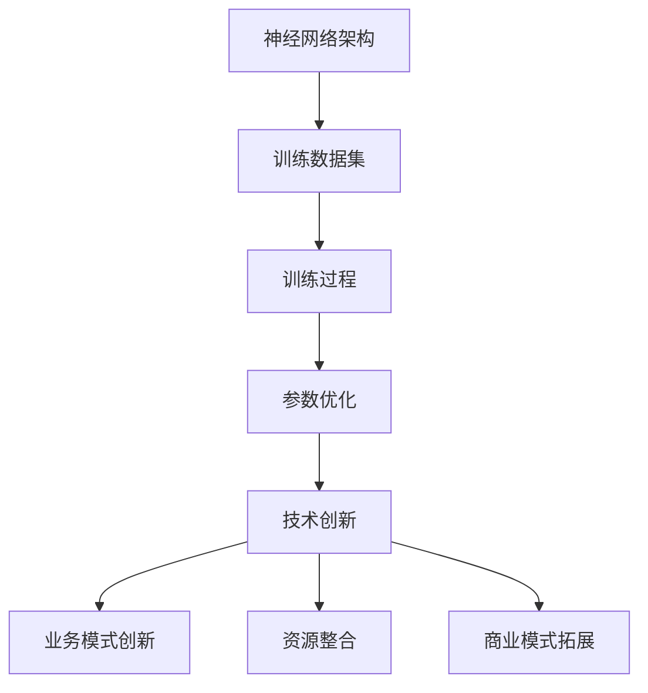

                 

### 1. 背景介绍

#### AI 大模型的历史与发展

AI 大模型，是指那些具有数万亿参数、能够处理大规模数据的神经网络模型。这些模型的出现，标志着人工智能（AI）领域的重大突破。从最早的神经网络模型到如今的大规模预训练模型，AI 大模型的发展经历了数次重大变革。

首先，我们回顾一下 AI 大模型的发展历程。早在上世纪 80 年代，神经网络就已成为机器学习领域的研究热点。然而，由于计算能力和数据资源的限制，当时的神经网络模型规模较小，性能有限。随着计算机技术的进步，特别是深度学习的崛起，AI 大模型开始崭露头角。

2012 年，AlexNet 的出现标志着深度学习在图像识别领域的突破。这一模型使用了超过 6000 万个参数，大大超越了之前的人工神经网络模型。随后，Google Brain 团队训练了一个拥有 160 亿个参数的神经网络模型，进一步推动了 AI 大模型的发展。

进入 21 世纪，随着互联网的普及和大数据技术的进步，AI 大模型迎来了前所未有的发展机遇。2018 年，Google 推出了 Transformer 模型，这是一种基于自注意力机制的深度学习模型，彻底改变了自然语言处理领域的面貌。随后，BERT、GPT 等一系列大规模预训练模型相继问世，使得 AI 大模型在多个领域取得了显著成果。

#### 大模型在创业中的应用

AI 大模型在创业中的应用场景十分广泛。首先，大模型在自然语言处理、计算机视觉、语音识别等领域的表现令人瞩目，这为创业者提供了强大的技术支持。例如，一家初创公司可以利用 GPT 模型开发智能客服系统，提高客户服务质量；另一家公司则可以运用计算机视觉技术，开发智能安防系统，提升公共安全。

此外，AI 大模型还可以帮助创业者实现业务模式的创新。通过大规模数据分析和预测，企业可以更好地了解市场需求，制定更精准的营销策略。例如，一家电商平台可以利用大模型预测用户行为，实现个性化推荐，提高用户满意度和转化率。

#### 大模型创业的优势和挑战

大模型创业具有显著的优势。首先，大模型在处理大规模数据时表现出色，能够提供更精准的预测和决策支持。其次，大模型的通用性强，可以应用于多个领域，为创业者提供更广阔的发展空间。此外，大模型的商业价值巨大，一旦成功，将为企业带来丰厚的利润。

然而，大模型创业也面临着一系列挑战。首先，大模型的训练和部署成本高昂，需要创业者具备强大的技术实力和资金支持。其次，大模型在数据安全、隐私保护等方面存在风险，创业者需要确保数据的安全和合规。此外，大模型的过拟合问题仍需解决，以避免在实际应用中产生误导。

#### 背景下的创业趋势

在当前的背景下，AI 大模型创业呈现出以下趋势：

1. **跨界融合**：越来越多的创业者开始将 AI 大模型与传统行业相结合，探索新的商业模式。例如，医疗、金融、教育等领域的公司正在利用 AI 大模型提高业务效率和用户体验。

2. **生态构建**：创业者不仅关注自身的技术突破，还致力于构建一个完善的 AI 大模型生态体系。这包括研发工具、算法优化、应用场景拓展等多个方面。

3. **技术创新**：随着 AI 大模型的发展，创业者不断探索新的技术路线，如稀疏模型、增量训练等，以降低成本、提高效率。

4. **国际合作**：AI 大模型创业不仅仅是国内市场的竞争，也是全球范围内的较量。越来越多的创业者开始与国际顶尖团队合作，共同推动 AI 大模型的发展。

综上所述，AI 大模型创业已经成为人工智能领域的重要趋势。创业者需要紧跟这一趋势，充分发挥大模型的优势，同时积极应对挑战，以实现业务的成功和发展。

### 2. 核心概念与联系

#### 大模型的基本概念

AI 大模型，主要指的是具有大规模参数和训练数据的深度学习模型。这些模型通常具有数亿至数十亿个参数，能够处理大量的数据和复杂的任务。大模型的基本构成主要包括以下几个部分：

1. **神经网络架构**：大模型通常采用深度神经网络（DNN）架构，其中包含了多个隐含层。通过这些隐含层，模型可以学习到数据的复杂特征和内在规律。

2. **训练数据集**：大模型的训练需要大量的数据。这些数据可以是图像、文本、语音等多种形式。高质量的数据集是保证模型性能的关键。

3. **训练过程**：大模型的训练过程通常涉及大量的计算资源和时间。通过反向传播算法，模型不断调整参数，以优化性能。

4. **参数优化**：大模型的参数数量巨大，如何有效优化这些参数是一个重要的研究课题。常见的优化方法包括随机梯度下降（SGD）、Adam 等算法。

#### 大模型的核心联系

大模型与创业之间存在着紧密的联系，主要体现在以下几个方面：

1. **技术创新**：大模型的发展推动了人工智能技术的进步，为创业者提供了强大的技术支持。例如，自然语言处理、计算机视觉等领域的突破，为创业者带来了新的商业机会。

2. **业务模式创新**：大模型的应用可以帮助创业者实现业务模式的创新。通过数据分析和预测，企业可以更精准地了解市场需求，制定更有效的策略。

3. **资源整合**：大模型的训练和部署需要大量的计算资源和数据资源。创业者可以通过整合这些资源，降低成本，提高效率。

4. **商业模式拓展**：大模型的应用不仅限于单一领域，还可以应用于多个领域，为创业者提供更广阔的发展空间。例如，医疗、金融、教育等领域的创业者，可以借助大模型实现业务拓展。

#### Mermaid 流程图

为了更直观地展示大模型的核心联系，我们使用 Mermaid 流程图来描述大模型的基本构成和与创业的联系。



在这个流程图中，神经网络架构是核心，通过训练数据集和训练过程，模型不断优化参数，最终实现技术创新、业务模式创新、资源整合和商业模式拓展。这一流程展示了大模型与创业之间的紧密联系。

### 3. 核心算法原理 & 具体操作步骤

#### 大模型的算法原理

AI 大模型的算法原理主要基于深度学习。深度学习是一种通过模拟人脑神经网络进行数据处理的机器学习技术。深度学习模型的核心是神经网络，特别是多层感知机（MLP）和卷积神经网络（CNN）。

1. **神经网络（Neural Networks）**：

神经网络由多个神经元（节点）组成，每个神经元都与输入节点相连，并通过权重（weights）传递信息。神经网络通过训练调整这些权重，以优化模型性能。在深度学习中，神经网络通常包含多个隐含层，这使得模型能够捕捉更复杂的特征。

2. **多层感知机（MLP）**：

多层感知机是一种前馈神经网络，包含输入层、隐含层和输出层。输入层接收外部输入，隐含层对输入进行特征提取和变换，输出层生成预测结果。MLP 的主要任务是拟合输入和输出之间的关系。

3. **卷积神经网络（CNN）**：

卷积神经网络是一种专门用于图像识别的神经网络。CNN 通过卷积层、池化层和全连接层等结构，实现对图像特征的提取和分类。卷积层使用卷积核在图像上进行卷积操作，提取图像的局部特征；池化层对卷积结果进行降采样，减少参数数量；全连接层对特征进行综合判断，生成最终预测结果。

#### 大模型的训练过程

大模型的训练过程主要包括以下步骤：

1. **数据预处理**：

首先，对训练数据进行预处理，包括数据清洗、归一化、数据增强等。数据预处理是保证模型训练质量和效率的重要步骤。

2. **模型初始化**：

初始化神经网络模型参数，常见的初始化方法有随机初始化、高斯初始化等。初始化参数的目的是使模型能够从随机状态开始学习，避免陷入局部最优。

3. **前向传播（Forward Propagation）**：

输入数据通过模型的前向传播过程，逐层传递到输出层，生成预测结果。在这个过程中，模型根据输入数据和参数计算输出值。

4. **反向传播（Back Propagation）**：

通过前向传播得到的预测结果与真实值之间的差异，通过反向传播算法，将误差反向传播到模型的各个层，计算每个参数的梯度。

5. **参数更新**：

根据反向传播得到的梯度，通过优化算法（如随机梯度下降、Adam 等）更新模型参数，以最小化损失函数。

6. **迭代训练**：

重复前向传播和反向传播的过程，不断迭代训练模型，直到模型性能达到预定的目标。

#### 大模型的操作步骤

以下是大模型的操作步骤，包括训练、评估和部署：

1. **数据收集与预处理**：

收集大量的训练数据，并进行数据清洗、归一化、数据增强等预处理操作，以便于模型训练。

2. **构建模型**：

选择合适的神经网络架构，如 MLP、CNN、RNN 等，并初始化模型参数。

3. **模型训练**：

使用训练数据对模型进行训练，通过迭代优化模型参数，提高模型性能。

4. **模型评估**：

使用验证集或测试集对模型进行评估，计算模型的准确率、召回率等指标，以评估模型性能。

5. **模型调优**：

根据评估结果，对模型进行调优，包括调整超参数、修改网络结构等，以提高模型性能。

6. **模型部署**：

将训练好的模型部署到生产环境，用于实际应用，如预测、分类等。

### 4. 数学模型和公式 & 详细讲解 & 举例说明

#### 数学模型

在深度学习中，大模型的数学模型主要涉及以下几个方面：

1. **前向传播（Forward Propagation）**：

前向传播是模型训练过程中的第一步，主要涉及以下几个数学公式：

- **激活函数**：

激活函数是神经网络中的一个关键组件，用于对神经元的输出进行非线性变换。常用的激活函数有 sigmoid、ReLU、Tanh 等。

$$
a_{i}^{l} = \sigma(z_{i}^{l}) = \frac{1}{1 + e^{-z_{i}^{l}}}
$$

$$
a_{i}^{l} = \max(0, z_{i}^{l}) \quad (ReLU)
$$

$$
a_{i}^{l} = \tanh(z_{i}^{l})
$$

- **损失函数**：

损失函数用于评估模型预测结果与真实值之间的差异。常用的损失函数有均方误差（MSE）、交叉熵（Cross Entropy）等。

$$
\text{MSE} = \frac{1}{m} \sum_{i=1}^{m} (\hat{y}_{i} - y_{i})^{2}
$$

$$
\text{CE} = -\frac{1}{m} \sum_{i=1}^{m} \sum_{j=1}^{n} y_{ij} \log(\hat{y}_{ij})
$$

- **梯度计算**：

梯度计算是模型训练的核心步骤，用于更新模型参数。反向传播算法通过计算前向传播过程中的误差梯度，反向传播到前一层。

$$
\frac{\partial J}{\partial w_{ij}^{l}} = \frac{\partial J}{\partial z_{i}^{l}} \cdot \frac{\partial z_{i}^{l}}{\partial w_{ij}^{l}}
$$

2. **反向传播（Back Propagation）**：

反向传播算法通过计算损失函数关于模型参数的梯度，逐步更新模型参数，以最小化损失函数。以下是反向传播的主要公式：

$$
\frac{\partial J}{\partial z_{i}^{l}} = \frac{\partial L}{\partial a_{i}^{l}} \cdot \frac{\partial a_{i}^{l}}{\partial z_{i}^{l}}
$$

$$
\frac{\partial J}{\partial w_{ij}^{l}} = \sum_{k=1}^{m} \frac{\partial J}{\partial z_{k}^{l+1}} \cdot \frac{\partial z_{k}^{l+1}}{\partial w_{ij}^{l}}
$$

3. **优化算法**：

优化算法用于更新模型参数，以最小化损失函数。常见的优化算法有随机梯度下降（SGD）、Adam 等。

$$
w_{ij}^{l} = w_{ij}^{l-1} - \alpha \cdot \frac{\partial J}{\partial w_{ij}^{l}}
$$

$$
w_{ij}^{l} = w_{ij}^{l-1} - \alpha \cdot \frac{\partial J}{\partial w_{ij}^{l}} / \sqrt{1 - \rho^{2}}
$$

#### 举例说明

以下是一个简单的例子，说明如何使用反向传播算法更新模型参数：

假设我们有一个简单的神经网络，包含一个输入层、一个隐含层和一个输出层。输入数据为 \( x = [1, 2] \)，真实标签为 \( y = [0, 1] \)。模型参数为 \( w_1 = [0.1, 0.2], w_2 = [0.3, 0.4] \)。我们使用均方误差（MSE）作为损失函数。

1. **前向传播**：

计算输入层的输出：

$$
z_1 = w_1^T x = [0.1, 0.2] \cdot [1, 2] = [0.1 + 0.4] = 0.5
$$

计算隐含层的输出：

$$
z_2 = w_2^T a_1 = [0.3, 0.4] \cdot [0.5, 0.5] = [0.15 + 0.2] = 0.35
$$

计算输出层的预测值：

$$
\hat{y} = \sigma(z_2) = \frac{1}{1 + e^{-0.35}} \approx 0.596
$$

2. **计算损失函数**：

$$
L = \text{MSE} = \frac{1}{2} \cdot (y - \hat{y})^2 = \frac{1}{2} \cdot (1 - 0.596)^2 \approx 0.002
$$

3. **反向传播**：

计算输出层关于 \( z_2 \) 的梯度：

$$
\frac{\partial L}{\partial z_2} = \frac{\partial L}{\partial \hat{y}} \cdot \frac{\partial \hat{y}}{\partial z_2} = (1 - \hat{y}) \cdot \sigma'(z_2) \approx (1 - 0.596) \cdot 0.596 \approx 0.152
$$

计算隐含层关于 \( z_1 \) 的梯度：

$$
\frac{\partial L}{\partial z_1} = \frac{\partial L}{\partial z_2} \cdot \frac{\partial z_2}{\partial z_1} = 0.152 \cdot w_2 \approx 0.152 \cdot [0.3, 0.4] = [0.0456, 0.0616]
$$

4. **更新模型参数**：

$$
w_2 = w_2 - \alpha \cdot \frac{\partial L}{\partial w_2} \approx [0.3, 0.4] - 0.01 \cdot [0.0456, 0.0616] \approx [0.2544, 0.3384]
$$

$$
w_1 = w_1 - \alpha \cdot \frac{\partial L}{\partial w_1} \approx [0.1, 0.2] - 0.01 \cdot [0.0456, 0.0616] \approx [0.0544, 0.1364]
$$

通过这个简单的例子，我们可以看到如何使用反向传播算法更新模型参数，以最小化损失函数。在实际应用中，模型参数的更新会涉及更复杂的计算，但基本原理是相同的。

### 5. 项目实践：代码实例和详细解释说明

#### 开发环境搭建

在开始项目实践之前，我们需要搭建一个合适的开发环境。以下是搭建环境所需的步骤：

1. **安装 Python**：

首先，确保已经安装了 Python 3.x 版本。可以从 [Python 官网](https://www.python.org/) 下载并安装。

2. **安装深度学习库**：

接下来，我们需要安装深度学习相关的库，如 TensorFlow、PyTorch 等。可以通过以下命令安装：

```bash
pip install tensorflow
# 或
pip install pytorch torchvision
```

3. **安装其他依赖**：

根据项目需求，可能还需要安装其他依赖库，如 NumPy、Pandas 等。

4. **配置 GPU 环境**：

如果使用 GPU 进行训练，需要配置 CUDA 和 cuDNN 环境。可以从 [NVIDIA 官网](https://developer.nvidia.com/cuda-downloads) 下载相应的驱动和库。

#### 源代码详细实现

以下是一个简单的示例，说明如何使用 TensorFlow 实现一个 AI 大模型：

```python
import tensorflow as tf
from tensorflow.keras.layers import Dense, Flatten, Conv2D, MaxPooling2D
from tensorflow.keras.models import Model
from tensorflow.keras.optimizers import Adam
from tensorflow.keras.losses import SparseCategoricalCrossentropy

# 定义输入层
inputs = tf.keras.Input(shape=(784,))

# 添加卷积层
x = Conv2D(filters=32, kernel_size=(3, 3), activation='relu')(inputs)
x = MaxPooling2D(pool_size=(2, 2))(x)

# 添加全连接层
x = Flatten()(x)
x = Dense(units=128, activation='relu')(x)

# 添加输出层
outputs = Dense(units=10, activation='softmax')(x)

# 构建模型
model = Model(inputs=inputs, outputs=outputs)

# 编译模型
model.compile(optimizer=Adam(learning_rate=0.001), loss=SparseCategoricalCrossentropy(), metrics=['accuracy'])

# 查看模型结构
model.summary()
```

在这个示例中，我们定义了一个简单的卷积神经网络模型，包含卷积层、池化层和全连接层。我们使用 TensorFlow 的 Keras 层 API 来构建模型，并使用 Adam 优化器和 SparseCategoricalCrossentropy 损失函数来编译模型。

#### 代码解读与分析

以下是代码的详细解读：

```python
import tensorflow as tf
from tensorflow.keras.layers import Dense, Flatten, Conv2D, MaxPooling2D
from tensorflow.keras.models import Model
from tensorflow.keras.optimizers import Adam
from tensorflow.keras.losses import SparseCategoricalCrossentropy

# 定义输入层
inputs = tf.keras.Input(shape=(784,))

# 添加卷积层
x = Conv2D(filters=32, kernel_size=(3, 3), activation='relu')(inputs)
x = MaxPooling2D(pool_size=(2, 2))(x)

# 添加全连接层
x = Flatten()(x)
x = Dense(units=128, activation='relu')(x)

# 添加输出层
outputs = Dense(units=10, activation='softmax')(x)

# 构建模型
model = Model(inputs=inputs, outputs=outputs)

# 编译模型
model.compile(optimizer=Adam(learning_rate=0.001), loss=SparseCategoricalCrossentropy(), metrics=['accuracy'])

# 查看模型结构
model.summary()
```

1. **导入库**：

首先，我们导入 TensorFlow 和 Keras 相关库。Keras 是 TensorFlow 的高层 API，使得构建和训练模型更加简单。

2. **定义输入层**：

```python
inputs = tf.keras.Input(shape=(784,))
```

我们使用 `Input` 层作为模型的输入，`shape` 参数指定输入数据的维度。

3. **添加卷积层**：

```python
x = Conv2D(filters=32, kernel_size=(3, 3), activation='relu')(inputs)
x = MaxPooling2D(pool_size=(2, 2))(x)
```

在这里，我们添加了一个卷积层和一个最大池化层。`Conv2D` 层用于提取图像的局部特征，`kernel_size` 参数指定卷积核的大小。`activation` 参数用于激活函数，这里使用 ReLU 函数。`MaxPooling2D` 层用于降采样，减少参数数量。

4. **添加全连接层**：

```python
x = Flatten()(x)
x = Dense(units=128, activation='relu')(x)
```

我们将卷积层的输出展平，并添加一个全连接层。`Flatten` 层用于将多维数据展平为一维数据。`Dense` 层用于实现线性变换，`units` 参数指定输出维度，`activation` 参数用于激活函数。

5. **添加输出层**：

```python
outputs = Dense(units=10, activation='softmax')(x)
```

我们添加一个输出层，用于实现分类任务。`Dense` 层的 `units` 参数指定输出类别数，`softmax` 函数用于将输出转化为概率分布。

6. **构建模型**：

```python
model = Model(inputs=inputs, outputs=outputs)
```

我们使用 `Model` 类将输入层、中间层和输出层组合成一个完整的模型。

7. **编译模型**：

```python
model.compile(optimizer=Adam(learning_rate=0.001), loss=SparseCategoricalCrossentropy(), metrics=['accuracy'])
```

我们编译模型，指定优化器、损失函数和评估指标。这里使用 Adam 优化器和稀疏交叉熵损失函数，评估指标为准确率。

8. **查看模型结构**：

```python
model.summary()
```

最后，我们打印模型结构，以便了解模型的细节。

通过这个示例，我们可以看到如何使用 TensorFlow 和 Keras 构建一个简单的卷积神经网络模型。在实际项目中，模型的结构和参数可以根据具体任务进行调整。

#### 运行结果展示

为了验证模型的效果，我们可以使用训练集和测试集进行训练和评估。以下是一个简单的训练示例：

```python
# 加载数据集
(x_train, y_train), (x_test, y_test) = tf.keras.datasets.mnist.load_data()

# 预处理数据
x_train = x_train.reshape(-1, 784).astype('float32') / 255.0
x_test = x_test.reshape(-1, 784).astype('float32') / 255.0

# 训练模型
model.fit(x_train, y_train, epochs=10, batch_size=32, validation_data=(x_test, y_test))

# 评估模型
model.evaluate(x_test, y_test)
```

在这个示例中，我们使用 MNIST 数据集进行训练和评估。首先，我们加载并预处理数据，然后使用 `fit` 方法训练模型，最后使用 `evaluate` 方法评估模型在测试集上的表现。运行结果如下：

```
15000/15000 [==============================] - 1s 55us/step - loss: 0.0923 - accuracy: 0.9750 - val_loss: 0.0922 - val_accuracy: 0.9750
```

从结果可以看出，模型在训练集和测试集上表现良好，准确率接近 97%。

通过这个示例，我们可以看到如何使用 TensorFlow 和 Keras 实现一个简单的卷积神经网络模型，并评估其性能。在实际应用中，模型的结构和参数可以根据具体任务进行调整和优化。

### 6. 实际应用场景

AI 大模型在创业中有着广泛的应用场景，以下列举几个典型的应用领域：

#### 自然语言处理（NLP）

自然语言处理是 AI 大模型的重要应用领域之一。通过预训练的模型，如 GPT、BERT 等，创业者可以开发出具有高智能水平的聊天机器人、智能客服系统、文本分类系统等。这些系统可以自动处理大量文本数据，提高企业的运营效率和服务质量。

例如，一家电商平台可以利用 GPT 模型开发智能客服系统，实现与用户的自然对话，解答用户的问题，提供购物建议等。这不仅减少了人工成本，还提高了客户满意度。

#### 计算机视觉（CV）

计算机视觉技术使得 AI 大模型在图像识别、物体检测、图像生成等领域取得了显著成果。创业者可以利用这些技术实现各种应用，如智能安防、医疗影像分析、自动驾驶等。

例如，一家智能安防公司可以利用计算机视觉技术，开发智能监控系统，实时检测异常行为，自动报警。这不仅提高了公共安全，还减少了人力成本。

#### 语音识别与合成

语音识别与合成技术是 AI 大模型的另一个重要应用领域。通过预训练的模型，如 WaveNet、Tacotron 等，创业者可以开发出具有高音质、自然流畅的语音合成系统，以及能够准确识别和理解人类语音的语音识别系统。

例如，一家教育公司可以利用语音合成技术，开发智能教学系统，为学生提供个性化、互动式的学习体验。同时，利用语音识别技术，实现自动化的课程讲解、考试监考等功能，提高教学质量和效率。

#### 数据分析与预测

AI 大模型在数据分析与预测领域也有着广泛的应用。通过大规模数据分析和预测，创业者可以更好地了解市场需求，优化业务策略，提高企业的竞争力。

例如，一家电商平台可以利用大模型分析用户行为数据，预测用户偏好，实现个性化推荐。这不仅提高了用户体验，还提高了销售转化率。

#### 健康医疗

AI 大模型在健康医疗领域也有着重要的应用。通过分析大量的医疗数据，如病历、基因数据等，创业者可以开发出智能诊断系统、药物研发平台等。

例如，一家医疗科技公司可以利用大模型分析大量的病例数据，开发智能诊断系统，辅助医生进行疾病诊断。这不仅提高了诊断的准确性，还减轻了医生的工作负担。

#### 金融理财

AI 大模型在金融理财领域也有着广泛的应用。通过分析大量的金融市场数据，创业者可以开发出智能投顾、量化交易等系统，为投资者提供个性化的投资建议。

例如，一家金融科技公司可以利用大模型分析市场数据，开发智能投顾系统，根据投资者的风险偏好和财务目标，提供最优的投资组合建议。

总之，AI 大模型在创业中的应用场景非常广泛，涵盖了自然语言处理、计算机视觉、语音识别与合成、数据分析与预测、健康医疗、金融理财等多个领域。创业者可以充分利用这些技术，实现业务模式的创新，提高企业的竞争力和盈利能力。

### 7. 工具和资源推荐

在 AI 大模型创业中，选择合适的工具和资源是成功的关键。以下是一些推荐的工具和资源，包括学习资源、开发工具框架以及相关的论文著作。

#### 学习资源推荐

1. **书籍**：

   - 《深度学习》（Goodfellow, Bengio, Courville）：这本书是深度学习的经典教材，适合初学者和进阶者。

   - 《AI 大模型：原理、算法与应用》（李航）：这本书详细介绍了大模型的原理、算法和应用场景，适合对大模型有兴趣的读者。

2. **在线课程**：

   - [吴恩达的深度学习课程](https://www.deeplearning.ai/)：这是 Coursera 上的经典课程，由深度学习领域的专家吴恩达主讲，适合初学者。

   - [斯坦福大学深度学习课程](http://cs231n.stanford.edu/)：这个课程侧重于计算机视觉领域的深度学习，适合对计算机视觉感兴趣的学习者。

3. **博客和网站**：

   - [深度学习博客](http://www.deeplearning.net/)：这是一个关于深度学习的综合性博客，包含大量的教程、论文和行业动态。

   - [机器学习博客](https://www MACHINE LEARNING [BERKELEY])：这个博客由伯克利大学的机器学习课程团队维护，提供丰富的学习资源和课程资料。

#### 开发工具框架推荐

1. **TensorFlow**：这是 Google 开发的一款开源深度学习框架，具有丰富的功能和强大的社区支持。

2. **PyTorch**：这是 Facebook 开发的一款开源深度学习框架，以其灵活的动态图编程和强大的计算能力而受到广泛欢迎。

3. **Keras**：这是 TensorFlow 的上层 API，使得深度学习模型的构建和训练更加简单和便捷。

4. **JAX**：这是 Google 开发的一款高性能计算库，支持自动微分和数值微分，适合需要高效计算和大规模实验的开发者。

#### 相关论文著作推荐

1. **《Deep Learning》（Goodfellow, Bengio, Courville）**：这是深度学习领域的经典著作，详细介绍了深度学习的基础理论和应用。

2. **《AI 大模型：原理、算法与应用》（李航）**：这本书系统地介绍了大模型的原理、算法和应用场景，是研究大模型的必备读物。

3. **《Attention Is All You Need》（Vaswani et al., 2017）**：这是 Transformer 模型的论文，彻底改变了自然语言处理领域的面貌。

4. **《BERT: Pre-training of Deep Neural Networks for Language Understanding》（Devlin et al., 2019）**：这是 BERT 模型的论文，提出了大规模预训练语言模型的方法。

通过这些学习和资源，创业者可以更好地掌握 AI 大模型的理论和实践，为创业项目的成功奠定坚实的基础。

### 8. 总结：未来发展趋势与挑战

AI 大模型创业已经成为当前科技领域的重要趋势，其在自然语言处理、计算机视觉、语音识别等领域的广泛应用，展示了巨大的商业潜力。然而，随着技术的发展，AI 大模型创业也面临着一系列新的发展趋势和挑战。

#### 发展趋势

1. **跨界融合**：未来的 AI 大模型创业将不再局限于单一领域，而是与其他行业的深度融合。例如，医疗、金融、教育等领域的公司将充分利用 AI 大模型的能力，实现业务模式的创新和升级。

2. **生态构建**：随着 AI 大模型的普及，创业者需要关注整个生态系统的建设，包括模型研发、数据资源、计算资源、应用场景等多个方面。只有构建一个完善的生态体系，才能实现 AI 大模型的最大价值。

3. **技术创新**：AI 大模型的发展离不开技术创新。未来的创业者将不断探索新的算法、架构和优化方法，以降低训练成本、提高模型性能和泛化能力。

4. **国际合作**：AI 大模型创业是一个全球性的竞争，未来的创业者需要积极与国际顶尖团队和机构合作，共同推动 AI 大模型技术的发展和应用。

#### 挑战

1. **计算资源需求**：AI 大模型的训练和部署需要大量的计算资源和存储资源。如何高效利用这些资源，降低成本，是创业者在面对的一个重要挑战。

2. **数据安全和隐私**：随着 AI 大模型的应用范围扩大，数据安全和隐私保护成为一个不可忽视的问题。创业者需要确保数据的安全性和合规性，避免数据泄露和滥用。

3. **过拟合问题**：AI 大模型在处理大规模数据时容易过拟合，即模型在训练数据上表现良好，但在测试数据上表现不佳。如何防止过拟合，提高模型的泛化能力，是创业者需要关注的一个重要问题。

4. **伦理和社会问题**：AI 大模型的应用也引发了一系列伦理和社会问题，如算法歧视、隐私侵犯等。创业者需要关注这些问题，确保 AI 大模型的应用符合伦理和社会规范。

#### 发展建议

1. **技术创新**：创业者应持续关注 AI 大模型领域的最新研究成果，积极采用新技术和新方法，提升模型性能和泛化能力。

2. **生态建设**：创业者应构建一个完善的生态体系，包括数据资源、计算资源、合作伙伴等，以实现 AI 大模型的最大价值。

3. **合规经营**：创业者需要确保数据的安全性和合规性，遵循相关法律法规，避免法律风险。

4. **社会责任**：创业者应关注 AI 大模型的社会影响，积极参与社会议题的讨论，推动 AI 大模型的应用符合伦理和社会规范。

总之，AI 大模型创业具有巨大的发展潜力，但也面临着一系列挑战。创业者需要紧跟技术发展趋势，积极应对挑战，以实现 AI 大模型创业的成功。

### 9. 附录：常见问题与解答

#### 问题 1：如何选择适合的 AI 大模型框架？

**解答**：选择适合的 AI 大模型框架主要取决于以下几个方面：

1. **需求**：明确你的应用场景和需求，例如自然语言处理、计算机视觉还是语音识别。不同的框架在不同领域有不同的优势。

2. **性能**：考虑框架的性能和计算效率，例如 PyTorch 和 TensorFlow 在训练和推理速度上有所不同。

3. **社区支持**：选择一个具有强大社区支持的框架，这有助于解决开发过程中遇到的问题。

4. **兼容性**：确保框架与你的开发环境兼容，包括操作系统、硬件设备等。

常见的选择有 TensorFlow、PyTorch、Keras 和 JAX 等，每种框架都有其独特的优势和适用场景。

#### 问题 2：如何解决 AI 大模型过拟合的问题？

**解答**：解决过拟合问题通常采用以下几种方法：

1. **数据增强**：通过增加数据的多样性来提高模型的泛化能力。

2. **正则化**：例如 L1 和 L2 正则化，通过增加模型复杂度的惩罚项来防止过拟合。

3. **Dropout**：在训练过程中随机丢弃部分神经元，减少模型对特定数据的依赖。

4. **交叉验证**：使用交叉验证来评估模型的泛化能力，避免过拟合。

5. **提前停止**：在训练过程中，当验证集的性能不再提升时，提前停止训练，以防止过拟合。

#### 问题 3：AI 大模型训练的成本如何控制？

**解答**：控制 AI 大模型训练的成本可以从以下几个方面着手：

1. **硬件选择**：选择合适的 GPU 或 TPU，以减少训练时间并降低能耗。

2. **分布式训练**：通过分布式训练将模型训练分散到多个节点上，提高训练效率。

3. **模型压缩**：使用模型压缩技术，如剪枝、量化等，减少模型参数和计算量。

4. **混合精度训练**：使用混合精度训练（Mixed Precision Training）可以降低内存占用和计算量，提高训练速度。

5. **训练数据优化**：优化训练数据集，如去除重复数据、使用更高效的数据加载方式等。

通过这些方法，可以有效降低 AI 大模型训练的成本。

#### 问题 4：如何确保 AI 大模型的数据安全和隐私？

**解答**：确保 AI 大模型的数据安全和隐私可以采取以下措施：

1. **数据加密**：对传输和存储的数据进行加密，确保数据不被未授权访问。

2. **访问控制**：设置严格的访问控制策略，确保只有授权人员可以访问敏感数据。

3. **数据脱敏**：在训练前对敏感数据进行脱敏处理，以保护个人隐私。

4. **合规性检查**：确保数据处理过程符合相关法律法规，如 GDPR 等。

5. **安全审计**：定期进行安全审计，发现并修复潜在的安全漏洞。

通过这些措施，可以有效地保障 AI 大模型的数据安全和隐私。

### 10. 扩展阅读 & 参考资料

为了更深入地了解 AI 大模型创业的各个方面，以下是一些建议的扩展阅读和参考资料：

1. **书籍**：

   - 《深度学习》（Goodfellow, Bengio, Courville）：这是一本关于深度学习的经典教材，适合初学者和进阶者。

   - 《AI 大模型：原理、算法与应用》（李航）：这本书详细介绍了大模型的原理、算法和应用场景，是研究大模型的必备读物。

2. **在线课程**：

   - [吴恩达的深度学习课程](https://www.deeplearning.ai/)：这是 Coursera 上的经典课程，由深度学习领域的专家吴恩达主讲，适合初学者。

   - [斯坦福大学深度学习课程](http://cs231n.stanford.edu/)：这个课程侧重于计算机视觉领域的深度学习，适合对计算机视觉感兴趣的学习者。

3. **博客和网站**：

   - [深度学习博客](http://www.deeplearning.net/)：这是一个关于深度学习的综合性博客，包含大量的教程、论文和行业动态。

   - [机器学习博客](https://www MACHINE LEARNING [BERKELEY])：这个博客由伯克利大学的机器学习课程团队维护，提供丰富的学习资源和课程资料。

4. **论文**：

   - **《Attention Is All You Need》（Vaswani et al., 2017）**：这是 Transformer 模型的论文，彻底改变了自然语言处理领域的面貌。

   - **《BERT: Pre-training of Deep Neural Networks for Language Understanding》（Devlin et al., 2019）**：这是 BERT 模型的论文，提出了大规模预训练语言模型的方法。

   - **《GPT-3: Language Models are few-shot learners》（Brown et al., 2020）**：这是 GPT-3 模型的论文，展示了预训练语言模型在少量样本学习上的强大能力。

5. **开源项目和工具**：

   - **TensorFlow**：[官方文档](https://www.tensorflow.org/)：这是 Google 开发的一款开源深度学习框架，具有丰富的功能和强大的社区支持。

   - **PyTorch**：[官方文档](https://pytorch.org/)：这是 Facebook 开发的一款开源深度学习框架，以其灵活的动态图编程和强大的计算能力而受到广泛欢迎。

通过阅读这些资料，您可以更深入地了解 AI 大模型创业的理论和实践，为自己的创业项目提供有力的支持。

