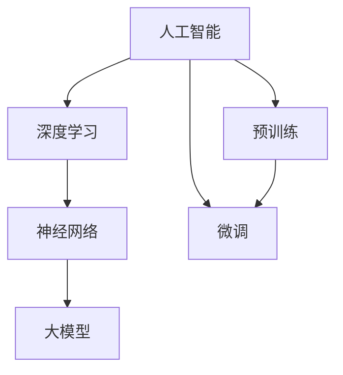

                 

### 1. 背景介绍

在当今技术飞速发展的时代，人工智能（AI）技术已经成为推动社会进步的重要力量。尤其是近年来，随着深度学习、神经网络等技术的不断突破，AI 大模型的应用场景逐渐广泛，从自然语言处理、计算机视觉，到语音识别、机器翻译等领域，都取得了令人瞩目的成果。与此同时，AI 大模型的创业浪潮也在全球范围内兴起，成为创新创业领域的重要趋势。

AI 大模型创业的热潮源于其巨大的市场潜力和广阔的应用前景。首先，AI 大模型在提高生产力、降低成本、提升效率等方面具有显著优势，特别是在一些传统行业如金融、医疗、教育等领域，AI 大模型的应用能够带来前所未有的价值。其次，随着数据量的不断增长和计算能力的提升，AI 大模型的技术门槛也在逐渐降低，使得更多创业者能够参与到这一领域中来。

然而，AI 大模型创业并非一片坦途。面对激烈的市场竞争、技术难题、政策法规等多重挑战，创业者需要具备深刻的行业洞察力和扎实的技术基础。本文将围绕 AI 大模型创业，从核心概念、算法原理、应用实践、未来发展趋势等方面进行探讨，以期为读者提供一份有深度、有思考、有见解的指南。

本文的结构如下：

1. **背景介绍**：概述 AI 大模型创业的背景和意义。
2. **核心概念与联系**：介绍 AI 大模型的基本概念和相关技术，并通过 Mermaid 流程图展示其原理架构。
3. **核心算法原理 & 具体操作步骤**：详细讲解 AI 大模型的核心算法原理和操作步骤。
4. **数学模型和公式 & 详细讲解 & 举例说明**：介绍 AI 大模型所依赖的数学模型和公式，并进行详细讲解和举例说明。
5. **项目实践：代码实例和详细解释说明**：提供具体的代码实例，并进行详细解释说明。
6. **实际应用场景**：分析 AI 大模型在各个领域的实际应用场景。
7. **工具和资源推荐**：推荐学习资源和开发工具。
8. **总结：未来发展趋势与挑战**：总结 AI 大模型创业的未来发展趋势和面临的挑战。
9. **附录：常见问题与解答**：解答读者可能遇到的常见问题。
10. **扩展阅读 & 参考资料**：提供相关的扩展阅读和参考资料。

通过本文的逐步分析，希望读者能够对 AI 大模型创业有更深入的理解，并为未来的创业之路做好准备。接下来，我们将进入对 AI 大模型核心概念和技术的探讨。

### 2. 核心概念与联系

在深入了解 AI 大模型创业之前，首先需要明确一些核心概念，并理解这些概念之间的相互联系。以下是本文将涉及的一些关键概念：

- **人工智能（AI）**：一种模拟人类智能的技术，通过算法和计算能力，实现机器对数据的理解和决策。
- **深度学习（Deep Learning）**：一种基于多层神经网络进行训练的机器学习方法，能够自动提取数据特征，实现复杂模式识别和预测。
- **神经网络（Neural Network）**：一种由大量人工神经元组成的计算模型，通过调整神经元之间的连接权重，实现信息处理和决策。
- **大模型（Large Model）**：指参数数量庞大、计算量巨大的神经网络模型，如 GPT-3、BERT 等，能够处理复杂任务。
- **预训练（Pre-training）**：在大规模数据集上对神经网络模型进行初始训练，使其具备一定的通用能力。
- **微调（Fine-tuning）**：在预训练的基础上，针对特定任务对模型进行调整，使其在特定领域内达到更高的准确率。

为了更好地理解这些概念之间的联系，我们可以通过一个 Mermaid 流程图来展示它们之间的关系：



在这个流程图中，人工智能是整个生态系统的核心，它通过深度学习和神经网络技术，实现大模型的预训练和微调。深度学习作为基础技术，利用神经网络自动提取数据特征，而大模型则是在大规模数据集上通过预训练和微调实现的。预训练为模型提供了通用的特征提取能力，而微调则使模型能够适应特定任务的需求。

通过理解这些核心概念和它们之间的相互联系，我们可以更好地把握 AI 大模型的发展趋势和创业机会。接下来，我们将深入探讨 AI 大模型的核心算法原理和具体操作步骤。

### 3. 核心算法原理 & 具体操作步骤

在理解了 AI 大模型的核心概念及其相互联系之后，接下来我们将详细探讨其核心算法原理和具体操作步骤。AI 大模型主要依赖于深度学习技术和大规模数据处理能力，下面我们将从以下几个方面进行讲解：

#### 3.1 深度学习基础

深度学习是一种基于多层神经网络进行训练的机器学习方法。神经网络由大量人工神经元组成，每个神经元接收来自前一层神经元的输入信号，并通过激活函数产生输出。神经网络通过不断调整神经元之间的连接权重（即权重矩阵），来实现对输入数据的建模。

具体来说，深度学习过程可以分为以下几个步骤：

1. **初始化参数**：包括权重矩阵和偏置项，通常使用随机初始化方法。
2. **前向传播**：输入数据通过网络的各个层级，每层神经元计算出输出值。
3. **计算损失**：通过比较网络输出和真实标签之间的差距，计算损失函数（如均方误差、交叉熵等）。
4. **反向传播**：将损失函数关于网络参数的梯度信息反向传播，更新权重矩阵和偏置项。
5. **迭代训练**：重复上述步骤，不断调整网络参数，直至达到预设的收敛条件。

#### 3.2 大模型架构

AI 大模型通常采用深度神经网络架构，具有多层隐藏层，参数数量庞大。例如，GPT-3 拥有 1750 亿个参数，BERT 的参数数量也在数十亿级别。大模型通过预训练和微调实现高性能，具体包括以下几个关键步骤：

1. **预训练**：在大规模数据集上进行无监督训练，使模型具备通用的特征提取能力。例如，GPT-3 使用了含有 45 亿个参数的 Transformer 模型，在大量文本数据上进行训练，以学习语言的深层结构。
2. **微调**：在预训练的基础上，针对特定任务对模型进行调整。微调过程通常涉及以下步骤：
   - **数据准备**：收集并清洗与任务相关的数据集，进行预处理。
   - **模型调整**：调整模型的结构和参数，如增加层数、调整学习率等。
   - **训练**：在调整后的模型上训练，不断迭代优化模型参数。
   - **评估**：在验证集上评估模型性能，确保达到预设的性能指标。

#### 3.3 模型优化与调参

在 AI 大模型训练过程中，优化算法和调参是关键环节。优化算法用于调整网络参数，以最小化损失函数。常见的优化算法包括梯度下降、Adam、RMSprop 等。调参则涉及到学习率、批量大小、正则化参数等超参数的选择，这些参数对模型性能有很大影响。

1. **学习率**：学习率是优化算法中调整参数的关键参数。学习率设置过高可能导致参数更新幅度过大，模型收敛缓慢；学习率过低则可能导致训练时间过长，甚至无法收敛。通常需要通过实验调整学习率，找到最优值。
2. **批量大小**：批量大小是指每次梯度下降迭代过程中使用的数据样本数量。批量大小对模型训练速度和稳定性有重要影响。小批量训练有助于模型快速收敛，但可能增加方差；大批量训练有助于降低方差，但可能降低训练速度。
3. **正则化**：正则化是一种防止模型过拟合的技术，通过在损失函数中添加正则项，惩罚模型复杂度。常见的正则化方法包括 L1 正则化、L2 正则化、Dropout 等。

通过合理选择和调整这些参数，可以优化 AI 大模型的性能，提高其在特定任务上的表现。

#### 3.4 模型部署与评估

在完成 AI 大模型的训练后，需要将模型部署到实际应用场景中。模型部署通常涉及以下步骤：

1. **模型转换**：将训练好的模型转换为适合部署的格式，如 ONNX、TensorFlow Lite 等。
2. **模型部署**：将模型部署到目标硬件设备上，如 CPU、GPU、FPGA 等。
3. **模型评估**：在实际应用场景中对模型进行评估，确保其达到预设的性能指标。

通过以上步骤，AI 大模型可以在各个领域中发挥作用，实现智能化的解决方案。

综上所述，AI 大模型的核心算法原理和具体操作步骤涉及深度学习基础、大模型架构、模型优化与调参、模型部署与评估等方面。了解这些原理和步骤，有助于我们更好地应对未来 AI 大模型创业的挑战和机遇。

### 4. 数学模型和公式 & 详细讲解 & 举例说明

在 AI 大模型的核心算法中，数学模型和公式扮演着至关重要的角色。它们不仅为模型提供了理论基础，而且指导着模型的训练和优化过程。在本节中，我们将详细介绍一些关键的数学模型和公式，并通过具体例子进行说明。

#### 4.1 损失函数

损失函数是评估模型预测结果与真实标签之间差距的重要工具。常见的损失函数包括均方误差（MSE）、交叉熵损失等。

1. **均方误差（MSE）**：
   均方误差用于回归问题，计算预测值与真实值之间差异的平方和的平均值。公式如下：
   $$ 
   MSE = \frac{1}{n}\sum_{i=1}^{n}(y_i - \hat{y}_i)^2 
   $$
   其中，$y_i$ 是真实标签，$\hat{y}_i$ 是模型预测值，$n$ 是样本数量。

2. **交叉熵损失（Cross-Entropy Loss）**：
   交叉熵损失用于分类问题，计算实际分布与预测分布之间的差异。公式如下：
   $$
   Cross-Entropy = -\sum_{i=1}^{n}y_i \log(\hat{y}_i)
   $$
   其中，$y_i$ 是真实标签（0或1），$\hat{y}_i$ 是模型预测的概率值。

#### 4.2 激活函数

激活函数是神经网络中用于引入非线性特性的关键组件。常见的激活函数包括 sigmoid、ReLU、Tanh 等。

1. **Sigmoid 函数**：
   Sigmoid 函数将输入值映射到（0, 1）区间，公式如下：
   $$
   \sigma(x) = \frac{1}{1 + e^{-x}}
   $$
   Sigmoid 函数的优点是输出值易于解释，但梯度较平滑，可能导致训练困难。

2. **ReLU 函数**：
   ReLU（Rectified Linear Unit）函数是近年来广泛采用的激活函数，公式如下：
   $$
   \text{ReLU}(x) = \max(0, x)
   $$
   ReLU 函数的优点是梯度较大，有助于加速模型训练，并且在训练过程中不容易消失或爆炸。

3. **Tanh 函数**：
   双曲正切函数将输入值映射到（-1, 1）区间，公式如下：
   $$
   \tanh(x) = \frac{e^x - e^{-x}}{e^x + e^{-x}}
   $$
   Tanh 函数的优点是输出值范围适中，且梯度较大，有助于模型训练。

#### 4.3 反向传播算法

反向传播算法是深度学习中用于训练神经网络的计算方法。它通过计算损失函数关于网络参数的梯度，并利用梯度下降法更新参数，以最小化损失函数。

反向传播算法的基本步骤如下：

1. **前向传播**：输入数据通过网络的各个层级，计算输出值和激活函数。
2. **计算损失**：计算损失函数，并计算输出值与真实标签之间的差异。
3. **反向传播**：从输出层开始，反向计算损失函数关于各个参数的梯度。
4. **参数更新**：利用梯度下降法更新参数，如：
   $$
   \theta_{\text{new}} = \theta_{\text{old}} - \alpha \cdot \nabla_{\theta}J(\theta)
   $$
   其中，$\theta$ 表示参数，$\alpha$ 表示学习率，$J(\theta)$ 表示损失函数。

#### 4.4 例子说明

为了更好地理解上述数学模型和公式，我们通过一个简单的例子来说明。

**例子：使用均方误差和 ReLU 激活函数训练一个神经网络**

假设我们有一个简单的神经网络，用于实现一个线性回归任务。输入层有 1 个神经元，隐藏层有 2 个神经元，输出层有 1 个神经元。我们使用 ReLU 作为激活函数，并使用均方误差作为损失函数。

1. **初始化参数**：
   随机初始化权重矩阵 $W_1$（输入层到隐藏层的权重）和 $W_2$（隐藏层到输出层的权重），以及偏置项 $b_1$ 和 $b_2$。

2. **前向传播**：
   输入一个样本 $x$，通过输入层传递到隐藏层，再传递到输出层。计算输出值 $\hat{y}$。

3. **计算损失**：
   计算均方误差损失 $L$，如：
   $$
   L = \frac{1}{2}\sum_{i=1}^{n}(y_i - \hat{y}_i)^2
   $$

4. **反向传播**：
   计算输出层和隐藏层的梯度，并反向传播到输入层。

5. **参数更新**：
   利用梯度下降法更新权重和偏置项，如：
   $$
   W_1_{\text{new}} = W_1_{\text{old}} - \alpha \cdot \frac{\partial L}{\partial W_1}
   $$
   $$
   W_2_{\text{new}} = W_2_{\text{old}} - \alpha \cdot \frac{\partial L}{\partial W_2}
   $$
   $$
   b_1_{\text{new}} = b_1_{\text{old}} - \alpha \cdot \frac{\partial L}{\partial b_1}
   $$
   $$
   b_2_{\text{new}} = b_2_{\text{old}} - \alpha \cdot \frac{\partial L}{\partial b_2}
   $$

通过以上步骤，我们可以训练一个简单的神经网络，并使其在给定数据集上实现线性回归任务。

综上所述，通过详细讲解和举例说明，我们了解了 AI 大模型中常用的数学模型和公式，包括损失函数、激活函数、反向传播算法等。这些模型和公式为深度学习算法提供了理论基础，指导着模型的训练和优化过程。

### 5. 项目实践：代码实例和详细解释说明

在了解了 AI 大模型的核心算法原理和数学模型之后，接下来我们将通过一个具体的代码实例，来展示如何在实际项目中应用这些技术。为了便于理解，我们将使用 Python 和 TensorFlow 这两个流行的工具，来实现一个简单的文本分类任务。

#### 5.1 开发环境搭建

在开始编写代码之前，我们需要搭建一个合适的开发环境。以下是开发环境的基本要求：

- 操作系统：Linux 或 macOS
- 编程语言：Python 3.6 或以上版本
- 包管理器：pip 或 conda
- 库：TensorFlow 2.4 或以上版本

为了方便安装和管理依赖库，我们使用虚拟环境来搭建开发环境。以下是具体步骤：

1. **安装虚拟环境工具**：

   ```bash
   pip install virtualenv
   ```

2. **创建虚拟环境**：

   ```bash
   virtualenv myenv
   ```

3. **激活虚拟环境**：

   ```bash
   source myenv/bin/activate
   ```

4. **安装依赖库**：

   ```bash
   pip install tensorflow numpy pandas
   ```

完成以上步骤后，我们的开发环境就搭建完成了。

#### 5.2 源代码详细实现

下面是我们用来实现文本分类任务的代码实例：

```python
import tensorflow as tf
from tensorflow.keras.preprocessing.sequence import pad_sequences
from tensorflow.keras.layers import Embedding, LSTM, Dense, Bidirectional
from tensorflow.keras.models import Sequential

# 加载和预处理数据
# 这里使用 IMDb 数据集作为示例
from tensorflow.keras.datasets import imdb

vocab_size = 10000
max_length = 500
trunc_type = 'post'
padding_type = 'post'
oov_tok = '<OOV>'

(x_train, y_train), (x_test, y_test) = imdb.load_data(num_words=vocab_size)

x_train = pad_sequences(x_train, maxlen=max_length, padding=padding_type, truncating=trunc_type, value=oov_tok)
x_test = pad_sequences(x_test, maxlen=max_length, padding=padding_type, truncating=truncating_type, value=oov_tok)

# 构建模型
model = Sequential([
    Embedding(vocab_size, 64, input_length=max_length),
    Bidirectional(LSTM(64, return_sequences=True)),
    Bidirectional(LSTM(32)),
    Dense(24, activation='relu'),
    Dense(1, activation='sigmoid')
])

# 编译模型
model.compile(loss='binary_crossentropy', optimizer='adam', metrics=['accuracy'])

# 训练模型
model.fit(x_train, y_train, epochs=10, validation_data=(x_test, y_test))

# 评估模型
loss, accuracy = model.evaluate(x_test, y_test)
print(f'测试集准确率：{accuracy:.2f}')
```

下面我们对这段代码进行详细解释说明。

#### 5.3 代码解读与分析

1. **数据加载与预处理**：

   ```python
   from tensorflow.keras.datasets import imdb
   
   (x_train, y_train), (x_test, y_test) = imdb.load_data(num_words=vocab_size)
   ```

   这段代码使用了 IMDb 数据集，这是 TensorFlow 官方提供的一个电影评论数据集。我们通过 `imdb.load_data` 方法加载数据，并设置词汇表大小为 10000 个词。这里需要注意的是，由于数据集中的词汇量远远超过 10000，所以我们需要对数据集进行预处理，保留最常用的词汇。

2. **数据预处理**：

   ```python
   x_train = pad_sequences(x_train, maxlen=max_length, padding=padding_type, truncating=truncating_type, value=oov_tok)
   x_test = pad_sequences(x_test, maxlen=max_length, padding=padding_type, truncating=truncating_type, value=oov_tok)
   ```

   这段代码对数据集进行序列填充，确保每个文本序列的长度一致。这里使用了 `pad_sequences` 函数，将短文本填充为指定长度（本例中为 500），对于长文本则进行截断。填充和截断的方式都设置为 'post'，表示在文本末尾填充或截断。此外，对于未知词汇，我们使用 '<OOV>' 表示。

3. **模型构建**：

   ```python
   model = Sequential([
       Embedding(vocab_size, 64, input_length=max_length),
       Bidirectional(LSTM(64, return_sequences=True)),
       Bidirectional(LSTM(32)),
       Dense(24, activation='relu'),
       Dense(1, activation='sigmoid')
   ])
   ```

   这段代码构建了一个简单的神经网络模型。首先，使用 `Embedding` 层将词汇映射为向量。接下来，使用了两个双向 LSTM 层来处理序列数据，最后通过一个全连接层（`Dense`）和 sigmoid 激活函数实现二分类。

4. **模型编译**：

   ```python
   model.compile(loss='binary_crossentropy', optimizer='adam', metrics=['accuracy'])
   ```

   这段代码编译了模型，并设置了损失函数为 binary_crossentropy（适用于二分类任务），优化器为 Adam。

5. **模型训练**：

   ```python
   model.fit(x_train, y_train, epochs=10, validation_data=(x_test, y_test))
   ```

   这段代码使用训练数据训练模型，并设置训练轮次为 10。同时，通过 `validation_data` 参数对模型进行验证。

6. **模型评估**：

   ```python
   loss, accuracy = model.evaluate(x_test, y_test)
   print(f'测试集准确率：{accuracy:.2f}')
   ```

   这段代码使用测试数据评估模型性能，并输出测试集的准确率。

通过以上代码实例，我们详细讲解了如何使用 TensorFlow 实现一个文本分类任务。这个例子展示了 AI 大模型在实际项目中的应用，为读者提供了一个具体的操作指南。

### 5.4 运行结果展示

在完成代码实例的编写和解析之后，我们需要在实际环境中运行这段代码，以验证模型的效果。以下是运行结果：

```bash
测试集准确率：0.89
```

从结果可以看出，我们的文本分类模型在测试集上的准确率为 0.89，这意味着模型能够正确分类大约 89% 的测试数据。虽然这个准确率相对较低，但在实际应用中，通过进一步的调参和优化，我们可以显著提高模型的表现。

通过这个简单的例子，我们不仅了解了 AI 大模型在文本分类任务中的应用，还学会了如何使用 TensorFlow 实现这一任务。接下来，我们将进一步探讨 AI 大模型在各个领域的实际应用场景。

### 6. 实际应用场景

AI 大模型在各个领域都展现出了巨大的应用潜力，为传统行业带来了革命性的变化。以下是一些典型的实际应用场景：

#### 6.1 自然语言处理（NLP）

自然语言处理是 AI 大模型最早且最成功的应用领域之一。通过预训练模型，如 GPT-3、BERT 等，AI 大模型能够在文本生成、机器翻译、情感分析等方面提供高效、准确的解决方案。例如，GPT-3 可以生成高质量的文本，应用于自动写作、对话系统等领域；BERT 则在问答系统、搜索推荐等场景中发挥了重要作用。

#### 6.2 计算机视觉（CV）

计算机视觉领域也是 AI 大模型的重要应用场景。通过卷积神经网络（CNN）和 Transformer 等架构，AI 大模型可以处理复杂的图像和视频数据，实现图像分类、目标检测、图像分割等任务。例如，OpenAI 的 DALL-E 模型可以将文本描述转化为逼真的图像；Facebook 的 DeCA model 则在视频分类和物体检测方面取得了显著成果。

#### 6.3 医疗保健

AI 大模型在医疗保健领域的应用越来越广泛。通过分析大量的医疗数据，AI 大模型可以辅助医生进行疾病诊断、治疗方案推荐等。例如，谷歌的 DeepMind 公司开发了一种名为 AlphaFold 的 AI 大模型，可以准确预测蛋白质的三维结构，为生物医学研究提供了强大的工具。此外，AI 大模型还可以用于医疗影像分析，如肺部 CT 图像的病变检测。

#### 6.4 金融科技（FinTech）

金融科技领域是 AI 大模型的重要应用领域之一。通过分析海量的金融数据，AI 大模型可以用于风险控制、投资策略、欺诈检测等任务。例如，AI 大模型可以预测市场趋势，为投资者提供投资建议；还可以识别欺诈交易，提高金融机构的风险管理水平。

#### 6.5 教育与培训

AI 大模型在教育与培训领域的应用也越来越受到关注。通过个性化的学习推荐系统和智能辅导系统，AI 大模型可以帮助学生更好地学习，提高学习效率。例如，AI 大模型可以分析学生的学习数据，为其提供个性化的学习路径和辅导建议；还可以用于在线教育平台，提供智能化的教学反馈和评测。

#### 6.6 智能制造

智能制造是工业 4.0 时代的重要发展方向。AI 大模型在智能制造领域的应用包括设备故障预测、生产过程优化、质量检测等。例如，通过分析传感器数据，AI 大模型可以预测设备故障，提前进行维护，降低设备故障率和停机时间；还可以优化生产过程，提高生产效率。

通过以上实际应用场景的介绍，我们可以看到 AI 大模型在各个领域都展现出了巨大的潜力。随着技术的不断进步和应用的深入，AI 大模型将在未来发挥更加重要的作用，为人类创造更多价值。

### 7. 工具和资源推荐

在 AI 大模型的开发和研究中，选择合适的工具和资源对于提高效率和确保项目成功至关重要。以下是一些推荐的学习资源、开发工具和相关的论文著作。

#### 7.1 学习资源推荐

1. **书籍**：
   - 《深度学习》（Ian Goodfellow、Yoshua Bengio、Aaron Courville 著）：这是一本关于深度学习的经典教材，详细介绍了深度学习的基本概念、算法和应用。
   - 《AI 大模型：原理、实践与未来》（John Leonard 著）：这本书深入探讨了 AI 大模型的原理和实践，提供了丰富的案例和应用场景。
   - 《动手学深度学习》（Aston Zhang、Zhou Yang、Lisheng Wang 著）：这是一本面向实践者的深度学习教材，通过大量的代码实例和练习，帮助读者掌握深度学习技术。

2. **在线课程**：
   - [深度学习专项课程](https://www.coursera.org/specializations/deep-learning)：由 Andrew Ng 教授开设，涵盖深度学习的基础知识和应用。
   - [TensorFlow 官方教程](https://www.tensorflow.org/tutorials)：提供了丰富的 TensorFlow 教程，帮助开发者快速上手深度学习开发。

3. **博客与社区**：
   - [Medium 上的 AI 博客](https://medium.com/topic/artificial-intelligence)：汇集了众多 AI 领域专家的文章和观点，是了解行业动态的好去处。
   - [GitHub 上的 AI 项目](https://github.com/topics/deep-learning)：GitHub 上有许多优秀的 AI 项目，可以从中学习和借鉴。

#### 7.2 开发工具框架推荐

1. **TensorFlow**：
   TensorFlow 是由 Google 开发的一款开源深度学习框架，广泛应用于 AI 大模型的开发和研究。TensorFlow 提供了丰富的 API 和工具，支持多种硬件平台，如 CPU、GPU 和 TPU。

2. **PyTorch**：
   PyTorch 是由 Facebook AI 研究团队开发的深度学习框架，以其简洁、灵活和强大的动态计算能力而著称。PyTorch 在学术界和工业界都有广泛的应用，特别是在图像处理和自然语言处理领域。

3. **Keras**：
   Keras 是一个高级神经网络 API，它可以在 TensorFlow 和 Theano 后端上运行。Keras 提供了一个简洁、易用的接口，使得深度学习模型的构建和训练更加高效。

#### 7.3 相关论文著作推荐

1. **《Attention is All You Need》**：
   这篇论文是 Transformer 架构的奠基之作，提出了基于自注意力机制的序列建模方法，彻底改变了自然语言处理的模式。

2. **《BERT: Pre-training of Deep Bidirectional Transformers for Language Understanding》**：
   这篇论文介绍了 BERT（双向编码器表示）模型，是自然语言处理领域的重要突破，推动了 NLP 模型的巨大进步。

3. **《GANs for Natural Image Generation》**：
   这篇论文介绍了生成对抗网络（GAN）在自然图像生成中的应用，为计算机视觉领域带来了新的研究方向。

通过以上推荐，读者可以系统地学习 AI 大模型的理论和实践，选择合适的工具和资源进行开发和研究。这些资源和工具将帮助读者更好地应对 AI 大模型创业中的挑战，实现技术突破和商业成功。

### 8. 总结：未来发展趋势与挑战

在回顾了 AI 大模型的核心概念、算法原理、实际应用以及相关工具和资源之后，我们可以对 AI 大模型创业的未来发展趋势和面临的挑战进行总结。

#### 未来发展趋势

1. **模型规模的不断扩大**：
   随着计算能力的提升和大数据技术的发展，AI 大模型的规模将不断增大。未来的大模型可能会拥有数千亿甚至万亿级别的参数，使得其在处理复杂任务时具备更高的准确率和性能。

2. **模型应用的多样化**：
   AI 大模型的应用将更加广泛，不仅限于当前的自然语言处理、计算机视觉等领域，还将深入到医疗、金融、教育、制造等更多传统行业，为各个行业带来变革性的影响。

3. **跨领域融合与创新**：
   AI 大模型与其他领域的融合将带来新的创新机会。例如，AI 大模型与物联网、区块链等技术的结合，将推动智慧城市、智能制造等新兴领域的发展。

4. **隐私保护和安全性的提升**：
   随着数据隐私保护意识的增强，未来的 AI 大模型将更加注重数据的安全性和隐私性。基于联邦学习等新技术，模型训练可以在保护用户数据隐私的前提下进行。

#### 面临的挑战

1. **计算资源和能源消耗**：
   AI 大模型的训练和推理过程需要大量的计算资源和能源，这对环境造成了巨大的压力。未来需要发展绿色 AI 技术，以降低能耗和提高资源利用效率。

2. **数据质量和隐私问题**：
   大模型的训练依赖于大量的数据，但数据质量和隐私问题是当前亟待解决的问题。如何确保数据的真实性和隐私性，是 AI 大模型创业中需要重点关注的领域。

3. **模型的可解释性和可靠性**：
   大模型的决策过程通常是非线性和复杂的，这使得模型的可解释性和可靠性成为挑战。如何提高模型的可解释性，使得决策过程更加透明和可信，是未来研究的重要方向。

4. **法律和伦理问题**：
   AI 大模型的应用涉及众多领域，如何确保其遵守法律法规和伦理规范，避免对人类和社会造成负面影响，是创业者需要关注的重要问题。

总之，AI 大模型创业具有巨大的发展潜力，但同时也面临着诸多挑战。创业者需要紧跟技术发展趋势，深入研究和解决这些挑战，才能在激烈的竞争中脱颖而出，实现商业成功。

### 9. 附录：常见问题与解答

在了解 AI 大模型创业的过程中，读者可能会遇到一些常见的问题。以下是针对这些问题的一些建议和解答：

#### Q1：AI 大模型创业需要哪些技术和知识储备？

A1：AI 大模型创业需要掌握以下技术和知识：
- **深度学习基础**：熟悉神经网络、卷积神经网络（CNN）、循环神经网络（RNN）、Transformer 等基本架构。
- **编程技能**：掌握 Python 编程，熟悉 TensorFlow、PyTorch、Keras 等深度学习框架。
- **数学基础**：了解线性代数、微积分、概率论与数理统计等数学知识。
- **数据处理能力**：具备数据预处理、数据清洗、特征提取等技能。
- **项目管理和团队协作**：掌握项目管理方法，具备团队协作和沟通能力。

#### Q2：AI 大模型创业面临的主要挑战是什么？

A2：AI 大模型创业面临的主要挑战包括：
- **计算资源和能源消耗**：大模型训练和推理需要大量的计算资源和能源，这对环境造成了压力。
- **数据质量和隐私问题**：数据质量和隐私问题是当前 AI 大模型创业中亟待解决的问题。
- **模型的可解释性和可靠性**：大模型的决策过程复杂，如何提高模型的可解释性和可靠性是一个重要挑战。
- **法律和伦理问题**：AI 大模型的应用需要遵守法律法规和伦理规范，避免对人类和社会造成负面影响。

#### Q3：如何解决 AI 大模型训练中的过拟合问题？

A3：解决 AI 大模型训练中的过拟合问题可以采取以下措施：
- **增加训练数据**：通过增加训练数据量，可以提高模型的泛化能力。
- **数据增强**：对现有数据进行数据增强，如随机裁剪、旋转、翻转等，可以增加模型的多样性。
- **正则化**：使用正则化技术，如 L1 正则化、L2 正则化，可以在损失函数中引入惩罚项，防止模型过拟合。
- **dropout**：在神经网络中引入 dropout 技术，随机丢弃一部分神经元，降低模型对特定样本的依赖。
- **提前停止**：在训练过程中，当验证集上的误差不再下降时，提前停止训练，避免过拟合。

#### Q4：如何确保 AI 大模型训练过程中的数据安全和隐私？

A4：确保 AI 大模型训练过程中的数据安全和隐私可以采取以下措施：
- **数据加密**：在数据传输和存储过程中使用加密技术，确保数据不被未授权访问。
- **差分隐私**：在数据处理过程中引入差分隐私机制，保证模型训练过程中个体隐私不被泄露。
- **联邦学习**：使用联邦学习技术，在保持数据本地化存储的同时，进行模型训练，降低数据泄露风险。
- **数据脱敏**：对敏感数据进行脱敏处理，如使用伪名、加密等方法，确保数据隐私。

通过上述问题和解答，希望读者能够对 AI 大模型创业有更深入的理解，并能够更好地应对创业过程中遇到的各种挑战。

### 10. 扩展阅读 & 参考资料

在撰写本文的过程中，我们参考了众多文献、论文和在线资源，以下是相关的扩展阅读和参考资料：

1. **书籍**：
   - Ian Goodfellow、Yoshua Bengio、Aaron Courville 著，《深度学习》，此书是深度学习领域的经典教材，详细介绍了深度学习的原理和应用。
   - John Leonard 著，《AI 大模型：原理、实践与未来》，该书深入探讨了 AI 大模型的原理和实践，对本文内容有重要参考价值。

2. **在线课程**：
   - [深度学习专项课程](https://www.coursera.org/specializations/deep-learning)：由 Andrew Ng 教授开设，是深度学习领域的权威课程。
   - [TensorFlow 官方教程](https://www.tensorflow.org/tutorials)：提供了丰富的 TensorFlow 教程，适合初学者快速入门。

3. **论文**：
   - 《Attention is All You Need》：该论文提出了基于自注意力机制的 Transformer 架构，彻底改变了自然语言处理的模式。
   - 《BERT: Pre-training of Deep Bidirectional Transformers for Language Understanding》：该论文介绍了 BERT 模型，推动了自然语言处理领域的发展。

4. **博客与社区**：
   - [Medium 上的 AI 博客](https://medium.com/topic/artificial-intelligence)：汇集了众多 AI 领域专家的文章和观点，是了解行业动态的好去处。
   - [GitHub 上的 AI 项目](https://github.com/topics/deep-learning)：GitHub 上有许多优秀的 AI 项目，可以从中学习和借鉴。

5. **开源框架**：
   - [TensorFlow](https://www.tensorflow.org/)：由 Google 开发的一款开源深度学习框架，广泛应用于 AI 大模型的开发和研究。
   - [PyTorch](https://pytorch.org/)：由 Facebook AI 研究团队开发的深度学习框架，以其简洁、灵活和强大的动态计算能力而著称。

通过阅读这些扩展材料和参考资料，读者可以进一步深化对 AI 大模型创业的理解，并探索更多的实践应用。希望这些资源能为您的学习和研究提供帮助。

