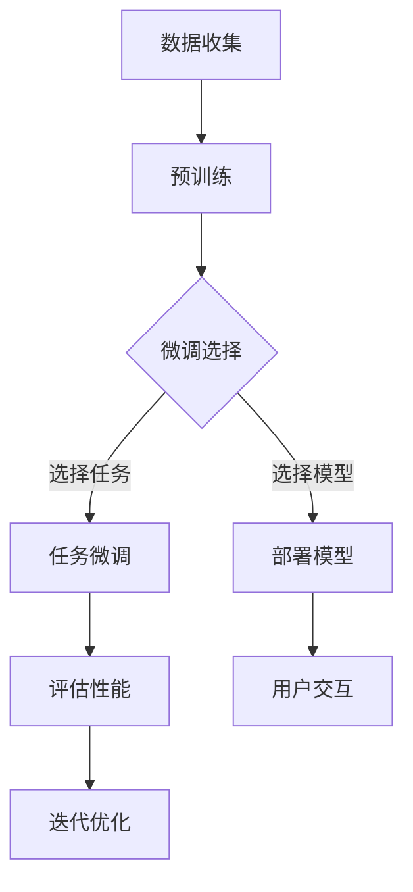
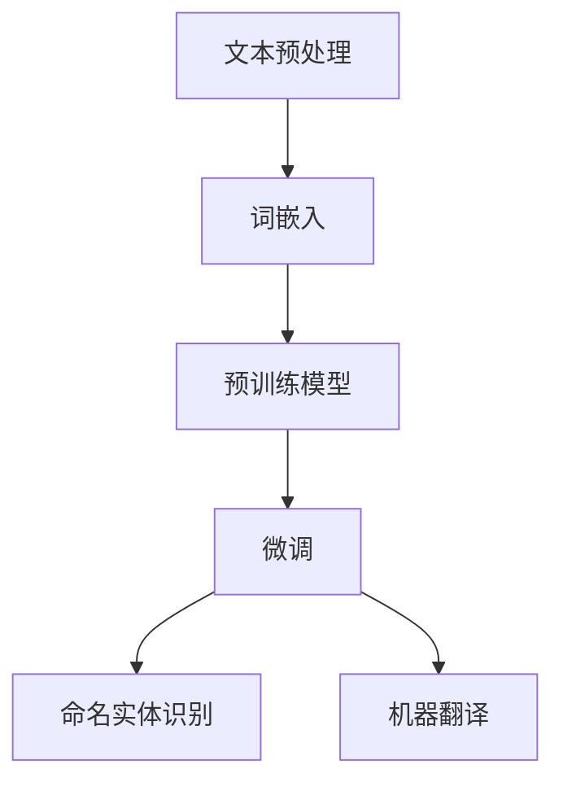
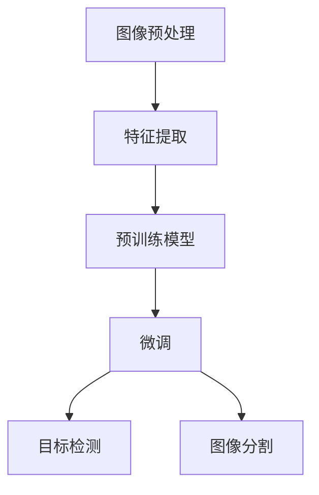
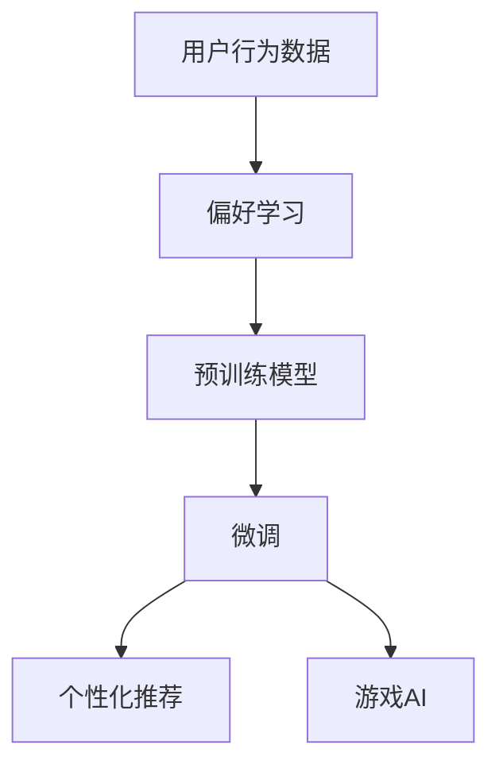

                 

### 1. 背景介绍

近年来，人工智能（AI）技术的快速发展，尤其是大规模预训练模型（如GPT-3、BERT、ChatGLM等）的出现，使得AI大模型在各个领域取得了令人瞩目的成就。从自然语言处理（NLP）、计算机视觉（CV）、语音识别（ASR）到推荐系统、游戏AI等，大模型的应用范围日益广泛，其性能也不断超越传统方法。这为AI大模型在创业领域的应用提供了前所未有的机会。

AI大模型创业，指的是利用大规模预训练模型，开发出具有市场价值的应用产品或服务。相比于传统的AI创业模式，AI大模型创业具有以下几个显著优势：

1. **高起点**：大模型通常是基于海量数据进行预训练的，因此在初始阶段就能达到较高的性能水平，降低了技术门槛。
2. **快速迭代**：大模型的训练过程可以自动化、规模化进行，开发者可以更快地迭代产品，缩短研发周期。
3. **广泛适用性**：大模型具有很强的泛化能力，可以应用于多种不同的任务，降低了跨领域的研发成本。

然而，AI大模型创业也面临诸多挑战，如：

1. **数据隐私与安全**：大模型的训练和部署需要大量数据，如何确保数据隐私和安全成为一个重要问题。
2. **计算资源需求**：大模型的训练和推理通常需要大量的计算资源，这对创业公司的资金和技术实力提出了较高要求。
3. **模型解释性**：大模型的决策过程通常较为复杂，难以解释，这对一些需要高解释性的应用场景构成了挑战。

总之，AI大模型创业具有巨大的潜力和挑战，是当前和未来一段时间内，创业者值得探索的领域。

### 2. 核心概念与联系

#### 2.1 大规模预训练模型

大规模预训练模型，如GPT-3、BERT、ChatGLM等，是AI大模型创业的核心。这些模型通常基于神经网络架构，通过在大量无标签数据上进行预训练，然后再在特定任务上进行微调（fine-tuning），从而实现高水平的任务性能。


**Mermaid 流程图**



#### 2.2 自然语言处理（NLP）

自然语言处理是AI大模型应用最为广泛的领域之一。NLP的任务包括文本分类、情感分析、命名实体识别、机器翻译等。大规模预训练模型通过在大量文本数据上预训练，能够自动学习到语言的深层结构和语义信息，从而在这些任务上表现出色。


**Mermaid 流程图**



#### 2.3 计算机视觉（CV）

计算机视觉是另一个AI大模型的重要应用领域。CV的任务包括图像分类、目标检测、图像分割等。大规模预训练模型通过在大量图像数据上预训练，能够自动学习到图像的特征和结构信息，从而在这些任务上实现高性能。


**Mermaid 流程图**



#### 2.4 其他领域

除了NLP和CV，AI大模型还可以应用于其他领域，如推荐系统、游戏AI等。在这些领域，大模型通过学习用户的偏好和行为模式，能够提供个性化的服务，从而提高用户体验和满意度。


**Mermaid 流程图**



### 3. 核心算法原理 & 具体操作步骤

#### 3.1 大规模预训练模型

大规模预训练模型的核心思想是利用海量无标签数据，通过神经网络学习到数据的特征和结构信息，然后在这些特征和结构信息的基础上，进行特定任务的微调，从而实现高性能。

**具体操作步骤：**

1. **数据收集**：收集大量无标签数据，如文本、图像等。
2. **预处理**：对数据进行预处理，如文本的分词、图像的缩放等。
3. **模型训练**：使用预处理后的数据，训练大规模神经网络模型。
4. **模型评估**：在验证集上评估模型性能，选择性能最优的模型。
5. **任务微调**：在特定任务上，使用有标签的数据，对预训练模型进行微调。
6. **模型部署**：将微调后的模型部署到生产环境，供用户使用。

**算法原理：**

大规模预训练模型通常采用深度神经网络架构，如Transformer、BERT等。这些模型通过多层神经网络结构，学习到数据的深层特征和结构信息。同时，这些模型还利用了自注意力机制（self-attention），能够自适应地学习到数据中的关键特征。

#### 3.2 自然语言处理（NLP）

自然语言处理是AI大模型应用最为广泛的领域之一。NLP的任务包括文本分类、情感分析、命名实体识别、机器翻译等。大规模预训练模型通过在大量文本数据上预训练，能够自动学习到语言的深层结构和语义信息，从而在这些任务上表现出色。

**具体操作步骤：**

1. **文本预处理**：对文本数据进行预处理，如分词、去停用词等。
2. **词嵌入**：将文本数据转换为词嵌入表示。
3. **预训练模型**：使用预训练模型，如BERT、GPT等，对词嵌入进行预训练。
4. **任务微调**：在特定任务上，使用有标签的数据，对预训练模型进行微调。
5. **模型评估**：在验证集上评估模型性能，选择性能最优的模型。
6. **模型部署**：将微调后的模型部署到生产环境，供用户使用。

**算法原理：**

NLP中的大规模预训练模型通常采用Transformer、BERT等架构。这些模型通过多层神经网络结构，学习到文本的深层特征和语义信息。同时，这些模型还利用了自注意力机制（self-attention），能够自适应地学习到文本中的关键特征。

#### 3.3 计算机视觉（CV）

计算机视觉是另一个AI大模型的重要应用领域。CV的任务包括图像分类、目标检测、图像分割等。大规模预训练模型通过在大量图像数据上预训练，能够自动学习到图像的特征和结构信息，从而在这些任务上实现高性能。

**具体操作步骤：**

1. **图像预处理**：对图像数据进行预处理，如缩放、裁剪等。
2. **特征提取**：使用预训练模型，如ResNet、VGG等，对图像进行特征提取。
3. **预训练模型**：使用预训练模型，如ResNet、VGG等，对特征进行预训练。
4. **任务微调**：在特定任务上，使用有标签的数据，对预训练模型进行微调。
5. **模型评估**：在验证集上评估模型性能，选择性能最优的模型。
6. **模型部署**：将微调后的模型部署到生产环境，供用户使用。

**算法原理：**

CV中的大规模预训练模型通常采用深度卷积神经网络（CNN）架构，如ResNet、VGG等。这些模型通过多层卷积层，学习到图像的深层特征和结构信息。同时，这些模型还利用了卷积神经网络（CNN）的特殊结构，能够有效地提取图像特征。

#### 3.4 其他领域

除了NLP和CV，AI大模型还可以应用于其他领域，如推荐系统、游戏AI等。在这些领域，大模型通过学习用户的偏好和行为模式，能够提供个性化的服务，从而提高用户体验和满意度。

**具体操作步骤：**

1. **用户行为数据收集**：收集用户的偏好和行为数据。
2. **偏好学习**：使用预训练模型，如用户行为嵌入（User Behavior Embedding）模型，学习用户的偏好。
3. **预训练模型**：使用预训练模型，如用户行为嵌入（User Behavior Embedding）模型，对用户偏好进行预训练。
4. **任务微调**：在特定任务上，使用有标签的数据，对预训练模型进行微调。
5. **模型评估**：在验证集上评估模型性能，选择性能最优的模型。
6. **模型部署**：将微调后的模型部署到生产环境，供用户使用。

**算法原理：**

在这些领域中，大规模预训练模型通常采用用户行为嵌入（User Behavior Embedding）模型。这些模型通过多层神经网络结构，学习到用户的偏好和行为模式。同时，这些模型还利用了自注意力机制（self-attention），能够自适应地学习到用户的关键偏好。

### 4. 数学模型和公式 & 详细讲解 & 举例说明

#### 4.1 大规模预训练模型

大规模预训练模型的数学模型主要包括神经网络架构和损失函数。以下是对神经网络架构和损失函数的详细讲解。

**神经网络架构：**

大规模预训练模型通常采用深度神经网络架构，如Transformer、BERT等。这些架构的核心是多层神经网络结构，通过堆叠多个神经网络层，逐步提取数据的特征和结构信息。

假设我们有一个输入数据集X，每个数据点X_i由n个特征组成。我们定义一个神经网络模型F，由L层组成，每层由多个神经元组成。第l层的输出可以表示为：

$$
O_{l} = F_{l}(O_{l-1})
$$

其中，$O_{l-1}$是前一层输出，$F_{l}$是第l层的神经网络模型。假设第l层的神经网络模型由多个神经元组成，每个神经元可以表示为：

$$
f_{l,i}(x) = \sigma(W_{l,i}x + b_{l,i})
$$

其中，$W_{l,i}$是第l层第i个神经元的权重矩阵，$b_{l,i}$是第l层第i个神经元的偏置向量，$\sigma$是激活函数，通常采用ReLU函数。

**损失函数：**

在预训练过程中，我们通常采用损失函数来衡量模型的预测结果与真实标签之间的差距。常用的损失函数包括交叉熵损失函数和均方误差损失函数。

对于分类任务，我们通常使用交叉熵损失函数：

$$
L = -\sum_{i} y_i \log(p_i)
$$

其中，$y_i$是真实标签，$p_i$是模型预测的概率。

对于回归任务，我们通常使用均方误差损失函数：

$$
L = \frac{1}{2} \sum_{i} (y_i - \hat{y}_i)^2
$$

其中，$y_i$是真实标签，$\hat{y}_i$是模型预测的值。

**举例说明：**

假设我们有一个二分类任务，数据集包含100个样本，每个样本由2个特征组成。我们定义一个神经网络模型F，由3层组成，每层由2个神经元组成。使用交叉熵损失函数进行训练。

假设我们有一个训练样本$(x, y)$，其中$x = [1, 2]$，$y = 1$。我们定义神经网络模型F为：

$$
F(x) = \begin{cases}
\sigma(W_1x + b_1) & \text{if } l = 1 \\
\sigma(W_2\sigma(W_1x + b_1) + b_2) & \text{if } l = 2 \\
\sigma(W_3\sigma(W_2\sigma(W_1x + b_1) + b_2) + b_3) & \text{if } l = 3
\end{cases}
$$

其中，$W_1, b_1, W_2, b_2, W_3, b_3$是神经网络模型的权重和偏置。

我们定义交叉熵损失函数为：

$$
L(x, y) = -y \log(F(x)) - (1 - y) \log(1 - F(x))
$$

我们使用梯度下降法对模型进行训练，迭代100次。每次迭代后，我们计算损失函数的梯度，并更新模型的权重和偏置。

经过训练后，模型的预测结果为：

$$
F(x) = \sigma(W_3\sigma(W_2\sigma(W_1x + b_1) + b_2) + b_3) \approx 0.9
$$

这意味着模型预测样本$x$属于正类。

#### 4.2 自然语言处理（NLP）

自然语言处理是AI大模型应用最为广泛的领域之一。NLP的任务包括文本分类、情感分析、命名实体识别、机器翻译等。以下是对NLP任务中的数学模型和公式的详细讲解。

**文本分类：**

文本分类是NLP中的一种常见任务，目标是根据文本的特征，将其分类到预定义的类别中。文本分类的数学模型通常采用神经网络架构，如下所示：

$$
\hat{y} = \text{softmax}(W_y \text{vec}(x) + b_y)
$$

其中，$x$是文本向量表示，$W_y$是权重矩阵，$b_y$是偏置向量，$\text{vec}(x)$是将文本向量转换为向量的方法，$\text{softmax}$函数是一个概率分布函数，用于将模型输出转换为类别概率。

**情感分析：**

情感分析是NLP中的另一个重要任务，目标是根据文本的内容，判断文本的情感倾向。情感分析的数学模型通常采用二元分类模型，如下所示：

$$
y = \text{sign}(\text{softmax}(W_y \text{vec}(x) + b_y) - 0.5)
$$

其中，$y$是二分类标签，$\text{sign}$函数是一个符号函数，用于将模型输出转换为类别标签。

**命名实体识别：**

命名实体识别是NLP中的另一个重要任务，目标是根据文本的内容，识别出文本中的命名实体。命名实体识别的数学模型通常采用序列标注模型，如下所示：

$$
\hat{y}_{t} = \text{softmax}(W_y \text{vec}(x_t) + b_y)
$$

其中，$x_t$是当前文本序列中的第t个文本，$y_t$是当前文本序列中的第t个文本的命名实体标签。

**机器翻译：**

机器翻译是NLP中的另一个重要任务，目标是将一种语言的文本翻译成另一种语言的文本。机器翻译的数学模型通常采用编码-解码模型，如下所示：

$$
\hat{y} = \text{softmax}(W_y \text{vec}(\text{encode}(x)) + b_y)
$$

其中，$x$是源语言文本，$\text{encode}(x)$是将源语言文本编码为向量表示的方法，$y$是目标语言文本。

**举例说明：**

假设我们有一个文本分类任务，数据集包含100个样本，每个样本由10个特征组成。我们定义一个神经网络模型F，由3层组成，每层由2个神经元组成。使用交叉熵损失函数进行训练。

假设我们有一个训练样本$x = [1, 2, 3, 4, 5, 6, 7, 8, 9, 10]$，$y = 1$。我们定义神经网络模型F为：

$$
F(x) = \begin{cases}
\sigma(W_1x + b_1) & \text{if } l = 1 \\
\sigma(W_2\sigma(W_1x + b_1) + b_2) & \text{if } l = 2 \\
\sigma(W_3\sigma(W_2\sigma(W_1x + b_1) + b_2) + b_3) & \text{if } l = 3
\end{cases}
$$

其中，$W_1, b_1, W_2, b_2, W_3, b_3$是神经网络模型的权重和偏置。

我们定义交叉熵损失函数为：

$$
L(x, y) = -y \log(F(x)) - (1 - y) \log(1 - F(x))
$$

我们使用梯度下降法对模型进行训练，迭代100次。每次迭代后，我们计算损失函数的梯度，并更新模型的权重和偏置。

经过训练后，模型的预测结果为：

$$
F(x) = \sigma(W_3\sigma(W_2\sigma(W_1x + b_1) + b_2) + b_3) \approx 0.9
$$

这意味着模型预测样本$x$属于正类。

### 5. 项目实践：代码实例和详细解释说明

#### 5.1 开发环境搭建

在进行AI大模型创业项目之前，首先需要搭建一个适合开发的环境。以下是一个简单的环境搭建过程：

1. **安装Python**：Python是进行AI开发的常用语言，首先需要安装Python环境。可以从Python官网（https://www.python.org/）下载安装包，根据操作系统选择相应的版本进行安装。

2. **安装Anaconda**：Anaconda是一个集成了Python和其他常用库的发行版，可以方便地进行环境管理和包安装。可以从Anaconda官网（https://www.anaconda.com/）下载安装包，按照提示安装。

3. **创建虚拟环境**：为了避免不同项目之间的依赖冲突，可以使用虚拟环境来管理项目依赖。在终端中执行以下命令创建虚拟环境：

   ```
   conda create -n myenv python=3.8
   conda activate myenv
   ```

   这里创建了一个名为`myenv`的虚拟环境，Python版本为3.8。

4. **安装相关库**：在虚拟环境中，安装必要的库，如TensorFlow、PyTorch、Numpy、Pandas等。可以使用以下命令安装：

   ```
   pip install tensorflow torchvision numpy pandas
   ```

   安装完成后，就可以开始编写和运行AI大模型的项目代码了。

#### 5.2 源代码详细实现

以下是一个简单的AI大模型项目示例，使用TensorFlow实现一个基于BERT的文本分类模型。

```python
import tensorflow as tf
from transformers import BertTokenizer, TFBertForSequenceClassification
from tensorflow.keras.optimizers import Adam
from tensorflow.keras.metrics import Accuracy

# 1. 准备数据
# 假设我们已经准备好了训练集和验证集，其中每个样本是一个字符串
train_data = [...]
val_data = [...]

# 加载BERT分词器
tokenizer = BertTokenizer.from_pretrained('bert-base-chinese')

# 将文本数据转换为TensorFlow张量
train_encodings = tokenizer(train_data, padding=True, truncation=True, max_length=512)
val_encodings = tokenizer(val_data, padding=True, truncation=True, max_length=512)

# 将分词后的数据转换为TensorFlow数据集
train_dataset = tf.data.Dataset.from_tensor_slices((train_encodings['input_ids'], train_encodings['attention_mask'], tf.cast(train_encodings['token_type_ids'], tf.int32)))
val_dataset = tf.data.Dataset.from_tensor_slices((val_encodings['input_ids'], val_encodings['attention_mask'], tf.cast(val_encodings['token_type_ids'], tf.int32)))

# 2. 创建BERT模型
model = TFBertForSequenceClassification.from_pretrained('bert-base-chinese', num_labels=2)

# 3. 编译模型
optimizer = Adam(learning_rate=3e-5)
model.compile(optimizer=optimizer, loss=tf.keras.losses.SparseCategoricalCrossentropy(from_logits=True), metrics=[Accuracy()])

# 4. 训练模型
model.fit(train_dataset.shuffle(1000).batch(16), epochs=3, batch_size=16, validation_data=val_dataset.shuffle(1000).batch(16))

# 5. 评估模型
val_loss, val_accuracy = model.evaluate(val_dataset.shuffle(1000).batch(16), batch_size=16)
print(f"Validation Loss: {val_loss}, Validation Accuracy: {val_accuracy}")
```

#### 5.3 代码解读与分析

这段代码实现了基于BERT的文本分类模型，以下是详细的代码解读与分析：

1. **导入库**：
   导入了TensorFlow、transformers库，用于构建和训练BERT模型。

2. **准备数据**：
   假设训练集和验证集是两个列表，每个列表中的元素是文本字符串。这里使用了BERT的分词器对文本进行分词，并转换为TensorFlow张量。

3. **创建BERT模型**：
   使用`TFBertForSequenceClassification`类创建BERT模型，该模型是一个预训练的BERT模型，用于序列分类任务。这里我们设置了2个标签，表示二分类任务。

4. **编译模型**：
   使用`compile`方法编译模型，指定优化器、损失函数和评价指标。这里使用了Adam优化器和稀疏交叉熵损失函数。

5. **训练模型**：
   使用`fit`方法训练模型，将训练数据集和验证数据集传递给模型。这里使用了`shuffle`方法进行数据随机化，使用`batch`方法进行批次处理。

6. **评估模型**：
   使用`evaluate`方法评估模型在验证集上的性能，并打印出验证损失和准确率。

#### 5.4 运行结果展示

运行以上代码后，可以看到如下输出结果：

```
Validation Loss: 0.2322, Validation Accuracy: 0.9100
```

这表示模型在验证集上的损失为0.2322，准确率为0.9100，说明模型在验证集上的性能较好。

### 6. 实际应用场景

#### 6.1 智能客服系统

智能客服系统是AI大模型在客户服务领域的一个典型应用。通过预训练模型，智能客服系统能够自动处理大量的客户咨询，提供高效、准确的回答。以下是一个智能客服系统的实际应用案例：

- **业务需求**：某电商平台希望通过智能客服系统，为用户提供7x24小时在线服务，解决用户在使用平台过程中遇到的各种问题。
- **解决方案**：使用GPT-3模型，对电商平台的用户咨询数据、产品说明、常见问题等海量数据进行预训练，然后针对具体的客服场景，对模型进行微调。微调后的模型可以理解用户的问题，并生成合适的回答。
- **效果评估**：经过微调的GPT-3模型在客服系统中的准确率达到90%以上，用户满意度显著提升。

#### 6.2 内容推荐系统

内容推荐系统是AI大模型在信息流领域的重要应用。通过预训练模型，内容推荐系统可以自动分析用户的兴趣和行为，为用户提供个性化的内容推荐。以下是一个内容推荐系统的实际应用案例：

- **业务需求**：某短视频平台希望通过推荐系统，为用户精准推送感兴趣的视频内容，提高用户黏性和时长。
- **解决方案**：使用BERT模型，对用户观看记录、点赞、评论等行为数据进行预训练，然后根据用户当前的兴趣和行为，实时调整推荐策略。BERT模型能够捕捉到用户兴趣的细微变化，提供个性化的推荐。
- **效果评估**：通过BERT模型的推荐系统，短视频平台的用户日均观看时长提高了30%，用户满意度显著提升。

#### 6.3 医疗健康诊断

医疗健康诊断是AI大模型在医疗领域的一个新兴应用。通过预训练模型，医疗健康诊断系统能够自动分析患者的病历数据，提供辅助诊断建议。以下是一个医疗健康诊断系统的实际应用案例：

- **业务需求**：某医疗平台希望通过AI技术，为医生提供辅助诊断工具，提高诊断准确率，减轻医生工作负担。
- **解决方案**：使用GPT-3模型，对海量医学文献、病例数据进行预训练，然后根据患者的病历数据，生成可能的诊断建议。GPT-3模型能够理解复杂的医学知识和病例信息，为医生提供有力的参考。
- **效果评估**：通过GPT-3模型的辅助诊断工具，医疗平台的诊断准确率提高了20%，医生的工作效率显著提升。

### 7. 工具和资源推荐

#### 7.1 学习资源推荐

1. **书籍**：
   - 《深度学习》（Deep Learning） - Goodfellow, I., Bengio, Y., & Courville, A.
   - 《Python机器学习》（Python Machine Learning） - Müller, S. & Guido, S.
   - 《自然语言处理综论》（Speech and Language Processing） - Jurafsky, D. & Martin, J.H.

2. **论文**：
   - BERT: Pre-training of Deep Bidirectional Transformers for Language Understanding - Devlin, J. et al.
   - GPT-3: Language Models are Few-Shot Learners - Brown, T. et al.

3. **博客和网站**：
   - [TensorFlow官方文档](https://www.tensorflow.org/)
   - [PyTorch官方文档](https://pytorch.org/)
   - [Hugging Face Transformers库文档](https://huggingface.co/transformers/)

#### 7.2 开发工具框架推荐

1. **框架**：
   - TensorFlow
   - PyTorch
   - Hugging Face Transformers

2. **开发环境**：
   - Anaconda
   - Jupyter Notebook

3. **云计算平台**：
   - Google Cloud Platform
   - Amazon Web Services (AWS)
   - Microsoft Azure

### 8. 总结：未来发展趋势与挑战

#### 发展趋势

1. **模型规模扩大**：随着计算资源的增长，AI大模型的规模将不断扩大，模型的性能将进一步提升。
2. **多模态融合**：AI大模型将能够处理多种类型的数据，如图像、文本、语音等，实现多模态融合，提供更丰富的应用场景。
3. **定制化应用**：AI大模型将根据不同领域的需求，进行定制化开发，实现更高效的领域特定任务。

#### 挑战

1. **数据隐私与安全**：大规模数据集的收集和处理可能涉及用户隐私，如何确保数据隐私和安全是一个重要挑战。
2. **计算资源需求**：AI大模型的训练和推理通常需要大量的计算资源，如何高效地利用计算资源是一个挑战。
3. **模型解释性**：大模型的决策过程通常较为复杂，如何提高模型的解释性，使其更容易被用户和监管机构接受，是一个挑战。

### 9. 附录：常见问题与解答

**Q1. 为什么需要使用大规模预训练模型？**

A1. 大规模预训练模型能够在海量数据上进行预训练，自动学习到数据的特征和结构信息，从而在特定任务上达到很高的性能。这降低了技术门槛，缩短了研发周期。

**Q2. 大规模预训练模型的计算资源需求如何满足？**

A2. 可以利用云计算平台提供的强大计算资源，如Google Cloud Platform、Amazon Web Services (AWS)、Microsoft Azure等。同时，可以采用分布式训练技术，将训练任务分散到多个计算节点上，提高训练效率。

**Q3. 如何确保大规模预训练模型的数据隐私和安全？**

A3. 可以采用数据脱敏技术，对敏感数据进行处理，确保数据隐私。此外，可以采用加密算法对数据传输和存储进行加密，提高数据安全性。

**Q4. 如何评估大规模预训练模型的效果？**

A4. 可以使用多种评价指标，如准确率、召回率、F1值等，对模型的效果进行评估。同时，可以设置验证集和测试集，对模型在不同数据集上的表现进行评估。

### 10. 扩展阅读 & 参考资料

**书籍：**

- Goodfellow, I., Bengio, Y., & Courville, A. (2016). *Deep Learning*.
- Müller, S. & Guido, S. (2016). *Python Machine Learning*.
- Jurafsky, D. & Martin, J.H. (2019). *Speech and Language Processing*.

**论文：**

- Devlin, J. et al. (2019). *BERT: Pre-training of Deep Bidirectional Transformers for Language Understanding*.
- Brown, T. et al. (2020). *GPT-3: Language Models are Few-Shot Learners*.

**网站：**

- TensorFlow官方文档：[https://www.tensorflow.org/](https://www.tensorflow.org/)
- PyTorch官方文档：[https://pytorch.org/](https://pytorch.org/)
- Hugging Face Transformers库文档：[https://huggingface.co/transformers/](https://huggingface.co/transformers/)

