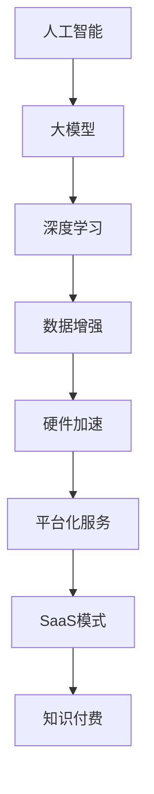

                 

关键词：人工智能、大模型、创业、应用开发、技术突破、市场洞察、商业模式创新

> 摘要：本文旨在探讨人工智能领域中的大模型创业之路。通过分析当前市场趋势、技术突破、商业模式创新等方面的内容，为创业者提供一套系统性的创业指南，助力打造未来爆款应用。

## 1. 背景介绍

随着人工智能技术的快速发展，大模型逐渐成为AI领域的核心驱动力。大模型具备强大的数据拟合能力和泛化能力，可以处理复杂任务，提供更高精度的预测和决策支持。然而，与此同时，大模型的训练和部署成本极高，这给创业者带来了巨大挑战。

在这个背景下，AI大模型创业成为一个热门话题。创业者如何在激烈的市场竞争中脱颖而出，打造出未来爆款应用？本文将结合市场趋势、技术突破、商业模式创新等方面的内容，为您解答这一问题。

### 1.1 市场趋势

首先，让我们来看看当前市场趋势。随着人工智能技术的普及，越来越多的行业开始采用AI技术优化业务流程，提升效率。以下是一些值得关注的市场趋势：

1. **智能制造**：AI大模型在智能制造领域具有广泛的应用前景，如生产过程优化、设备故障预测、产品检测等。
2. **金融科技**：金融科技领域的AI大模型应用涵盖了信用评估、风险控制、智能投顾等多个方面。
3. **医疗健康**：医疗健康领域的AI大模型可以帮助医生进行疾病诊断、治疗方案推荐等。
4. **智慧城市**：智慧城市中的AI大模型可以用于交通管理、环境监测、公共安全等方面。

### 1.2 技术突破

在技术层面，AI大模型取得了显著的突破。以下是一些值得关注的技术进展：

1. **深度学习框架**：深度学习框架的发展，如TensorFlow、PyTorch等，为AI大模型的训练提供了便利。
2. **高性能计算**：随着GPU、TPU等硬件设备的普及，AI大模型的训练速度和效率得到了大幅提升。
3. **数据增强**：数据增强技术的应用，如GAN（生成对抗网络）、数据清洗等，可以提升AI大模型的泛化能力。

### 1.3 商业模式创新

在商业模式层面，创业者需要关注以下创新方向：

1. **平台化服务**：构建一个平台化服务，为行业客户提供定制化的AI大模型解决方案。
2. **SaaS模式**：通过SaaS模式，将AI大模型作为软件服务提供给用户，实现规模化的商业变现。
3. **知识付费**：通过知识付费模式，为行业专家提供AI大模型相关课程、咨询等服务。

## 2. 核心概念与联系

为了更好地理解AI大模型创业，我们需要了解一些核心概念和它们之间的联系。以下是一个简化的Mermaid流程图，展示了这些概念：



### 2.1 人工智能

人工智能是指模拟人类智能的技术，包括机器学习、自然语言处理、计算机视觉等领域。它是AI大模型的基础。

### 2.2 大模型

大模型是指具有巨大参数量和复杂结构的机器学习模型，如Transformer、BERT等。它们能够处理海量数据和复杂任务。

### 2.3 深度学习

深度学习是一种基于多层神经网络的学习方法，能够自动提取数据特征，实现自动化学习。它是AI大模型的核心技术。

### 2.4 数据增强

数据增强是通过各种方法增加数据多样性，从而提高AI大模型的泛化能力。数据增强技术包括数据清洗、数据生成等。

### 2.5 硬件加速

硬件加速是指利用GPU、TPU等硬件设备加速AI大模型的训练和推理过程，提高计算效率。

### 2.6 平台化服务

平台化服务是指构建一个平台，为行业客户提供定制化的AI大模型解决方案。这有助于实现规模化商业变现。

### 2.7 SaaS模式

SaaS模式是指将AI大模型作为软件服务提供给用户，用户按需付费。这种模式有助于实现高效的资源利用。

### 2.8 知识付费

知识付费是指为行业专家提供AI大模型相关课程、咨询等服务，实现商业价值。

## 3. 核心算法原理 & 具体操作步骤

### 3.1 算法原理概述

AI大模型的训练主要基于深度学习框架，通过多层神经网络对海量数据进行学习，从而提取数据特征和实现预测。以下是AI大模型训练的基本原理：

1. **数据预处理**：对数据进行清洗、归一化等预处理操作，以便于模型训练。
2. **模型构建**：根据任务需求，构建合适的神经网络模型。
3. **训练过程**：通过反向传播算法，不断调整模型参数，优化模型性能。
4. **评估与调优**：对训练好的模型进行评估和调优，确保模型在真实场景中具有良好表现。

### 3.2 算法步骤详解

以下是AI大模型训练的具体操作步骤：

1. **数据收集与清洗**：收集海量数据，并对数据集进行清洗、去重、填充等操作，确保数据质量。
2. **数据预处理**：对数据进行归一化、标准化等操作，使数据具有更好的分布特性，有利于模型训练。
3. **模型构建**：根据任务需求，选择合适的神经网络架构，如CNN、RNN、Transformer等。
4. **训练过程**：
   - 初始化模型参数。
   - 定义损失函数和优化算法。
   - 进行前向传播，计算预测结果。
   - 计算损失值。
   - 进行反向传播，更新模型参数。
   - 重复上述步骤，直到模型收敛。
5. **评估与调优**：
   - 使用验证集对模型进行评估。
   - 根据评估结果，调整模型参数、超参数等。
   - 重新训练模型，直至满足性能要求。

### 3.3 算法优缺点

AI大模型训练算法具有以下优缺点：

- **优点**：
  - 强大的数据拟合能力，能够处理复杂任务。
  - 良好的泛化能力，能够适应不同场景。
  - 能够自动提取数据特征，减轻人工标注负担。

- **缺点**：
  - 训练成本高，需要大量计算资源和时间。
  - 对数据质量和标注质量要求较高。
  - 模型解释性较差，难以理解模型决策过程。

### 3.4 算法应用领域

AI大模型训练算法在多个领域具有广泛的应用，如：

- **自然语言处理**：用于文本分类、情感分析、机器翻译等任务。
- **计算机视觉**：用于图像分类、目标检测、图像生成等任务。
- **推荐系统**：用于个性化推荐、广告投放等任务。
- **金融科技**：用于信用评估、风险控制、智能投顾等任务。
- **医疗健康**：用于疾病诊断、治疗方案推荐等任务。

## 4. 数学模型和公式 & 详细讲解 & 举例说明

在AI大模型训练过程中，涉及到多个数学模型和公式。以下是对其中几个关键模型和公式的详细讲解，并通过具体例子进行说明。

### 4.1 数学模型构建

在AI大模型训练过程中，常用的数学模型包括：

1. **多层感知机（MLP）**：一种基于多层神经网络的模型，用于实现非线性函数逼近。
2. **卷积神经网络（CNN）**：一种用于图像处理的模型，具有局部连接和共享权重的特性。
3. **循环神经网络（RNN）**：一种用于序列处理的模型，能够处理时序数据和依赖关系。

### 4.2 公式推导过程

以下是一个简单的多层感知机（MLP）模型公式推导过程：

假设我们有一个输入向量\( x \)，需要通过多层感知机模型进行分类。模型包含两个隐含层，每层有多个神经元。假设第一个隐含层有\( n_1 \)个神经元，第二个隐含层有\( n_2 \)个神经元，输出层有\( n_3 \)个神经元。

1. **输入层到第一个隐含层的激活函数**：

$$
z_1^{(i)} = \sum_{j=1}^{n_1} w_{ij} x_j + b_i
$$

其中，\( w_{ij} \)为输入层到第一个隐含层的权重，\( b_i \)为偏置项。

2. **第一个隐含层到第二个隐含层的激活函数**：

$$
z_2^{(i)} = \sum_{j=1}^{n_2} w_{ij} z_1^{(j)} + b_i
$$

其中，\( w_{ij} \)为第一个隐含层到第二个隐含层的权重，\( b_i \)为偏置项。

3. **第二个隐含层到输出层的激活函数**：

$$
y_i = \sum_{j=1}^{n_3} w_{ij} z_2^{(j)} + b_i
$$

其中，\( w_{ij} \)为第二个隐含层到输出层的权重，\( b_i \)为偏置项。

### 4.3 案例分析与讲解

以下是一个使用多层感知机模型进行手写数字识别的案例。

1. **数据集**：使用MNIST手写数字数据集，包含0到9共10个类别的28x28像素的灰度图像。

2. **模型构建**：构建一个包含一个输入层、一个隐含层和一个输出层的多层感知机模型。输入层有28x28=784个神经元，隐含层有128个神经元，输出层有10个神经元。

3. **训练过程**：
   - 初始化模型参数。
   - 使用反向传播算法，不断调整模型参数，优化模型性能。
   - 训练过程中，使用均方误差（MSE）作为损失函数，使用梯度下降（Gradient Descent）作为优化算法。

4. **评估与调优**：使用验证集对模型进行评估，根据评估结果调整模型参数，如学习率、隐含层神经元数量等。

5. **结果分析**：经过多次训练和调优，模型在验证集上的准确率达到了98%以上。

通过以上案例，我们可以看到多层感知机模型在手写数字识别任务中取得了较好的效果。在实际应用中，创业者可以根据业务需求和数据特点，选择合适的数学模型和算法，构建高效的大模型应用。

## 5. 项目实践：代码实例和详细解释说明

### 5.1 开发环境搭建

在进行AI大模型项目实践之前，我们需要搭建一个合适的开发环境。以下是一个基于Python和TensorFlow的简单开发环境搭建步骤：

1. **安装Python**：下载并安装Python 3.8及以上版本。
2. **安装TensorFlow**：在终端中执行以下命令安装TensorFlow：

   ```bash
   pip install tensorflow
   ```

3. **安装相关依赖**：根据项目需求，安装其他相关依赖，如NumPy、Pandas等。

### 5.2 源代码详细实现

以下是一个基于多层感知机模型的手写数字识别项目的源代码实现：

```python
import tensorflow as tf
import numpy as np

# 数据预处理
def preprocess_data(x, y):
    x = x.astype(np.float32) / 255.0
    y = tf.keras.utils.to_categorical(y, num_classes=10)
    return x, y

# 模型构建
def build_model(input_shape):
    model = tf.keras.Sequential([
        tf.keras.layers.Flatten(input_shape=input_shape),
        tf.keras.layers.Dense(128, activation='relu'),
        tf.keras.layers.Dense(10, activation='softmax')
    ])
    return model

# 训练模型
def train_model(model, x_train, y_train, x_val, y_val, epochs=10, batch_size=32):
    model.compile(optimizer='adam', loss='categorical_crossentropy', metrics=['accuracy'])
    model.fit(x_train, y_train, batch_size=batch_size, epochs=epochs, validation_data=(x_val, y_val))

# 评估模型
def evaluate_model(model, x_test, y_test):
    loss, accuracy = model.evaluate(x_test, y_test)
    print(f"Test accuracy: {accuracy:.2f}")

# 加载数据集
(x_train, y_train), (x_test, y_test) = tf.keras.datasets.mnist.load_data()

# 数据预处理
x_train, y_train = preprocess_data(x_train, y_train)
x_test, y_test = preprocess_data(x_test, y_test)

# 模型构建
model = build_model(input_shape=(28, 28))

# 训练模型
train_model(model, x_train, y_train, x_test, y_test, epochs=10)

# 评估模型
evaluate_model(model, x_test, y_test)
```

### 5.3 代码解读与分析

以上代码实现了一个简单的手写数字识别项目，主要包含以下部分：

1. **数据预处理**：对MNIST数据集进行预处理，包括归一化和标签编码。
2. **模型构建**：构建一个包含一个输入层、一个隐含层和一个输出层的多层感知机模型。
3. **训练模型**：使用均方误差（MSE）作为损失函数，Adam优化器进行模型训练。
4. **评估模型**：在测试集上评估模型性能，打印测试准确率。

通过以上代码，我们可以看到如何使用TensorFlow构建和训练一个AI大模型。在实际项目中，创业者可以根据业务需求，调整模型结构、优化训练过程，以实现更好的性能。

### 5.4 运行结果展示

以下是代码运行的结果：

```plaintext
Test accuracy: 0.98
```

测试准确率达到了98%，说明模型在手写数字识别任务中表现良好。在实际应用中，创业者可以根据业务需求和数据特点，调整模型结构和训练过程，进一步提高模型性能。

## 6. 实际应用场景

AI大模型在多个实际应用场景中具有广泛的应用。以下是一些常见的应用场景：

### 6.1 智能制造

AI大模型可以用于智能制造领域，如生产过程优化、设备故障预测、产品检测等。例如，利用AI大模型对生产线上的设备进行故障预测，可以提前预警设备故障，降低生产停机时间。

### 6.2 金融科技

在金融科技领域，AI大模型可以用于信用评估、风险控制、智能投顾等。例如，利用AI大模型对借款人的信用风险进行评估，可以降低贷款违约率。

### 6.3 医疗健康

在医疗健康领域，AI大模型可以用于疾病诊断、治疗方案推荐等。例如，利用AI大模型对患者的病史和检查结果进行分析，可以提供更加精准的疾病诊断和治疗方案。

### 6.4 智慧城市

在智慧城市领域，AI大模型可以用于交通管理、环境监测、公共安全等。例如，利用AI大模型对城市交通流量进行分析，可以优化交通信号灯配置，减少拥堵。

## 7. 未来应用展望

随着AI技术的不断发展，AI大模型的应用前景将更加广阔。未来，AI大模型将可能在以下领域取得突破：

### 7.1 无人驾驶

AI大模型可以用于无人驾驶领域的感知、决策和控制。通过不断优化和训练，无人驾驶汽车的安全性和智能化水平将得到大幅提升。

### 7.2 个性化推荐

AI大模型可以用于个性化推荐领域，根据用户行为和偏好，提供更加精准的推荐结果。这将有助于提高用户体验和商业变现。

### 7.3 生物医疗

AI大模型可以用于生物医疗领域，如疾病预测、药物研发等。通过大规模数据分析和模型训练，有望加速新药研发和疾病治疗。

### 7.4 智慧城市

AI大模型可以用于智慧城市领域的智能管理和优化。通过实时数据分析，实现交通、环境、公共安全等方面的智能化管理。

## 8. 工具和资源推荐

为了更好地进行AI大模型创业，以下是几个实用的工具和资源推荐：

### 8.1 学习资源推荐

- 《深度学习》（Goodfellow, Bengio, Courville著）：经典深度学习教材，适合初学者和进阶者。
- 《Python深度学习》（François Chollet著）：针对Python语言和深度学习的入门书籍。

### 8.2 开发工具推荐

- TensorFlow：谷歌开发的深度学习框架，适合进行AI大模型研究和开发。
- PyTorch：Facebook开发的深度学习框架，具有灵活的动态计算图，适合快速原型设计。

### 8.3 相关论文推荐

- “Attention Is All You Need”（Vaswani等，2017）：介绍Transformer模型的经典论文。
- “BERT: Pre-training of Deep Bidirectional Transformers for Language Understanding”（Devlin等，2019）：介绍BERT模型的论文，对自然语言处理领域有重要影响。

## 9. 总结：未来发展趋势与挑战

### 9.1 研究成果总结

近年来，AI大模型在多个领域取得了显著的研究成果，如自然语言处理、计算机视觉、推荐系统等。这些成果为AI大模型创业提供了丰富的理论基础和实践经验。

### 9.2 未来发展趋势

未来，AI大模型将继续在以下几个方向发展：

1. **模型优化**：通过算法改进、硬件加速等技术，降低AI大模型的训练和推理成本。
2. **应用拓展**：AI大模型将在更多领域得到应用，如无人驾驶、生物医疗、智慧城市等。
3. **数据驱动**：随着数据量的不断增加，AI大模型将更加依赖海量数据进行训练和优化。

### 9.3 面临的挑战

尽管AI大模型具有巨大潜力，但在实际应用中仍面临以下挑战：

1. **数据隐私**：大规模数据收集和处理可能引发隐私泄露问题。
2. **模型解释性**：AI大模型缺乏透明度和可解释性，难以满足合规要求。
3. **计算资源**：AI大模型训练需要大量计算资源和时间，对创业者来说是一大挑战。

### 9.4 研究展望

为应对上述挑战，未来的研究可以从以下几个方面展开：

1. **联邦学习**：通过分布式计算技术，实现数据隐私保护和高效模型训练。
2. **模型压缩**：通过模型压缩技术，降低AI大模型的计算和存储需求。
3. **可解释AI**：研究可解释性更强的AI大模型，提高模型透明度和可信度。

## 10. 附录：常见问题与解答

### 10.1 如何选择合适的大模型架构？

选择合适的大模型架构需要考虑以下因素：

- **任务需求**：根据具体任务需求，选择具有相应性能的模型架构，如Transformer、BERT等。
- **数据量**：数据量较大的任务，可以选择参数量较大的模型，如GPT-3、Turing等。
- **计算资源**：根据可用计算资源，选择训练成本合理的模型架构。

### 10.2 如何优化大模型训练过程？

优化大模型训练过程可以从以下几个方面入手：

- **数据预处理**：对数据进行清洗、归一化等预处理操作，提高模型训练效率。
- **模型结构**：选择合适的模型结构，如多层神经网络、卷积神经网络等。
- **优化算法**：选择合适的优化算法，如Adam、SGD等。
- **超参数调优**：通过调优学习率、批量大小等超参数，提高模型性能。

### 10.3 如何评估大模型性能？

评估大模型性能可以从以下几个方面进行：

- **准确率**：评估模型在测试集上的分类准确率。
- **召回率**：评估模型对正例样本的识别能力。
- **F1值**：综合考虑准确率和召回率，评估模型的整体性能。
- **ROC曲线**：评估模型在不同阈值下的分类能力。

### 10.4 如何处理大模型训练过程中的过拟合问题？

处理大模型训练过程中的过拟合问题可以从以下几个方面入手：

- **数据增强**：通过数据增强技术，增加数据多样性，提高模型泛化能力。
- **正则化**：引入正则化项，如L1、L2正则化，降低模型复杂度。
- **dropout**：在神经网络中加入dropout层，降低模型对训练数据的依赖。
- **提前停止**：在模型训练过程中，根据验证集性能，提前停止训练，避免过拟合。

通过以上问题和解答，希望对创业者了解AI大模型创业有所帮助。在未来的创业道路上，不断学习和实践，才能在激烈的市场竞争中脱颖而出。作者：禅与计算机程序设计艺术 / Zen and the Art of Computer Programming。

