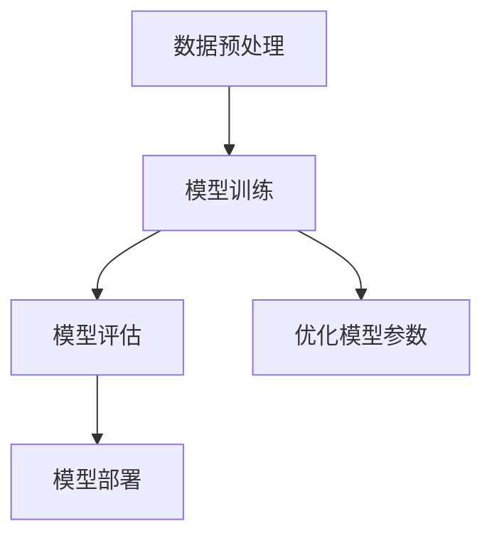

                 

关键词：人工智能、大模型、创业、技术趋势、应用前景、商业策略、投资建议

> 摘要：本文旨在探讨人工智能（AI）大模型领域的创业机遇，分析大模型的技术原理、应用场景、未来发展，并给出针对创业者和投资者的实用建议。通过深入了解AI大模型的核心技术和市场动态，我们将更好地把握这一新兴领域的商业机会，共创未来。

## 1. 背景介绍

人工智能作为计算机科学的一个重要分支，近年来取得了飞速的发展。从早期的专家系统到如今的深度学习，AI技术在各个领域的应用日益广泛，推动着人类社会迈向智能化时代。大模型，即拥有巨大参数量和强大计算能力的神经网络模型，是AI技术的一个重要里程碑。大模型的普及不仅提升了AI系统的性能，也为创业带来了前所未有的机遇。

### 1.1 技术发展历程

人工智能的发展历程可以分为三个阶段：符号主义、连接主义和统计学习。符号主义阶段，AI研究者试图通过编写逻辑规则和知识库来实现智能化。连接主义阶段，神经网络成为研究热点，通过模拟人脑神经元之间的连接，实现了机器学习。统计学习阶段，以深度学习为代表，通过大数据和高效算法，实现了AI技术的突破。

### 1.2 市场需求

随着大数据、云计算、物联网等技术的发展，人工智能的应用场景不断拓展。从自然语言处理、计算机视觉到语音识别、推荐系统，AI技术在各行各业中发挥着重要作用。大模型的崛起，使得AI系统的性能得到了显著提升，为企业提供了更强大的数据分析和决策支持能力。这为创业者提供了广阔的市场空间。

## 2. 核心概念与联系

### 2.1 大模型的定义与原理

大模型是指拥有海量参数和大规模计算资源的神经网络模型。它通过大量的训练数据学习到复杂的特征表示，从而实现高效的预测和分类。大模型的原理基于深度学习，主要包括以下几个关键环节：

- **神经网络结构**：神经网络由多层神经元组成，通过前向传播和反向传播算法进行参数优化。
- **激活函数**：激活函数用于引入非线性因素，使得神经网络能够学习复杂的函数关系。
- **优化算法**：常用的优化算法有梯度下降、Adam等，用于最小化损失函数，优化模型参数。

### 2.2 大模型与相关技术的联系

大模型不仅依赖于深度学习技术，还与数据预处理、模型训练、模型评估等多个环节密切相关。具体来说，大模型的实现需要以下几个关键步骤：

- **数据预处理**：对原始数据进行清洗、归一化等处理，提高数据质量和模型训练效果。
- **模型训练**：通过大规模数据集训练模型，优化模型参数，提高模型性能。
- **模型评估**：使用验证集和测试集评估模型性能，调整模型参数，确保模型稳定可靠。
- **模型部署**：将训练好的模型部署到生产环境中，为实际应用提供支持。

### 2.3 Mermaid 流程图

下面是一个简单的 Mermaid 流程图，展示了大模型的主要组成部分和流程：



## 3. 核心算法原理 & 具体操作步骤

### 3.1 算法原理概述

大模型的算法原理主要基于深度学习，特别是基于神经网络的模型。深度学习通过多层神经网络的叠加，实现从原始数据到高维特征表示的映射。大模型的核心算法包括：

- **前向传播**：将输入数据通过神经网络逐层传播，得到输出结果。
- **反向传播**：计算输出结果与实际标签之间的误差，反向传播误差到各层神经元，更新模型参数。
- **优化算法**：常用的优化算法包括梯度下降、Adam等，用于最小化损失函数，提高模型性能。

### 3.2 算法步骤详解

大模型的具体操作步骤如下：

#### 步骤1：数据预处理

- **数据清洗**：去除噪声数据、缺失值填充、异常值处理等。
- **数据归一化**：将数据缩放到一个较小的范围，便于模型训练。
- **数据增强**：通过随机旋转、翻转、缩放等操作，增加数据的多样性。

#### 步骤2：模型训练

- **初始化参数**：随机初始化模型参数。
- **前向传播**：输入数据通过神经网络，得到输出结果。
- **计算损失**：计算输出结果与实际标签之间的误差，使用损失函数进行衡量。
- **反向传播**：计算各层神经元的梯度，更新模型参数。
- **优化参数**：使用优化算法，如梯度下降，调整模型参数。

#### 步骤3：模型评估

- **验证集评估**：使用验证集评估模型性能，调整模型参数。
- **测试集评估**：在测试集上评估模型性能，确保模型泛化能力。

#### 步骤4：模型部署

- **模型转换**：将训练好的模型转换为生产环境可用的格式。
- **模型部署**：将模型部署到服务器，提供API接口，供实际应用调用。

### 3.3 算法优缺点

#### 优点

- **强大的表达能力**：大模型通过多层神经网络，能够学习到复杂的特征表示，提高模型性能。
- **高效的数据分析**：大模型能够处理大规模数据集，实现高效的数据分析。
- **泛化能力**：通过大量的训练数据和优化算法，大模型具有较好的泛化能力。

#### 缺点

- **计算资源消耗**：大模型需要大量的计算资源和存储空间，对硬件设备有较高要求。
- **训练时间长**：大模型的训练时间较长，需要耐心等待模型收敛。

### 3.4 算法应用领域

大模型在各个领域的应用场景广泛，包括但不限于：

- **自然语言处理**：如机器翻译、文本分类、情感分析等。
- **计算机视觉**：如图像识别、目标检测、图像生成等。
- **推荐系统**：如商品推荐、内容推荐等。
- **自动驾驶**：如环境感知、路径规划等。
- **金融风控**：如信用评分、欺诈检测等。

## 4. 数学模型和公式 & 详细讲解 & 举例说明

### 4.1 数学模型构建

大模型的核心数学模型是多层感知机（MLP），其基本形式如下：

$$
z^{[l]} = \sigma(W^{[l]} \cdot a^{[l-1]} + b^{[l]})
$$

其中，$a^{[l]}$表示第$l$层的激活值，$z^{[l]}$表示第$l$层的输出值，$W^{[l]}$和$b^{[l]}$分别表示第$l$层的权重和偏置。$\sigma$为激活函数，常用的激活函数有ReLU、Sigmoid、Tanh等。

### 4.2 公式推导过程

#### 前向传播

前向传播的过程可以表示为：

$$
a^{[l]} = \sigma(z^{[l]})
$$

其中，$a^{[0]} = x$，$x$为输入数据。

#### 反向传播

反向传播的过程如下：

1. **计算梯度**：

$$
\frac{\partial J}{\partial z^{[l]}} = \sigma'(z^{[l]}) \cdot \frac{\partial J}{\partial a^{[l]}}
$$

其中，$\sigma'$为激活函数的导数。

2. **更新参数**：

$$
W^{[l]} := W^{[l]} - \alpha \cdot \frac{\partial J}{\partial W^{[l]}}
$$

$$
b^{[l]} := b^{[l]} - \alpha \cdot \frac{\partial J}{\partial b^{[l]}}
$$

其中，$\alpha$为学习率。

### 4.3 案例分析与讲解

#### 案例一：图像分类

假设我们要对一张图像进行分类，输入数据为像素值，输出数据为类别标签。我们可以使用卷积神经网络（CNN）来构建大模型，如图像分类模型ResNet。

1. **数据预处理**：

- 对输入图像进行缩放和归一化，使其尺寸统一。
- 随机裁剪和翻转图像，增加数据多样性。

2. **模型训练**：

- 初始化模型参数。
- 使用训练集进行模型训练，迭代优化模型参数。
- 使用验证集评估模型性能，调整模型参数。

3. **模型评估**：

- 在测试集上评估模型性能，计算准确率、召回率等指标。

4. **模型部署**：

- 将训练好的模型部署到生产环境，提供图像分类服务。

#### 案例二：文本分类

假设我们要对一篇文章进行分类，输入数据为文本向量，输出数据为类别标签。我们可以使用循环神经网络（RNN）或变压器（Transformer）来构建大模型，如文本分类模型BERT。

1. **数据预处理**：

- 对输入文本进行分词和词向量化。
- 随机裁剪和拼接文本，增加数据多样性。

2. **模型训练**：

- 初始化模型参数。
- 使用训练集进行模型训练，迭代优化模型参数。
- 使用验证集评估模型性能，调整模型参数。

3. **模型评估**：

- 在测试集上评估模型性能，计算准确率、召回率等指标。

4. **模型部署**：

- 将训练好的模型部署到生产环境，提供文本分类服务。

## 5. 项目实践：代码实例和详细解释说明

### 5.1 开发环境搭建

1. 安装Python环境，版本要求3.6及以上。
2. 安装深度学习框架，如TensorFlow或PyTorch。
3. 安装其他依赖库，如NumPy、Pandas、Matplotlib等。

### 5.2 源代码详细实现

下面是一个简单的图像分类项目，使用卷积神经网络（CNN）进行图像分类。

```python
import tensorflow as tf
from tensorflow.keras import layers
from tensorflow.keras.preprocessing.image import ImageDataGenerator

# 数据预处理
train_datagen = ImageDataGenerator(
    rescale=1./255,
    shear_range=0.2,
    zoom_range=0.2,
    horizontal_flip=True)

test_datagen = ImageDataGenerator(rescale=1./255)

train_generator = train_datagen.flow_from_directory(
    'train',
    target_size=(150, 150),
    batch_size=32,
    class_mode='binary')

validation_generator = test_datagen.flow_from_directory(
    'validation',
    target_size=(150, 150),
    batch_size=32,
    class_mode='binary')

# 构建模型
model = tf.keras.Sequential([
    layers.Conv2D(32, (3, 3), activation='relu', input_shape=(150, 150, 3)),
    layers.MaxPooling2D(2, 2),
    layers.Conv2D(64, (3, 3), activation='relu'),
    layers.MaxPooling2D(2, 2),
    layers.Conv2D(128, (3, 3), activation='relu'),
    layers.MaxPooling2D(2, 2),
    layers.Conv2D(128, (3, 3), activation='relu'),
    layers.MaxPooling2D(2, 2),
    layers.Flatten(),
    layers.Dense(512, activation='relu'),
    layers.Dense(1, activation='sigmoid')
])

# 编译模型
model.compile(loss='binary_crossentropy',
              optimizer=tf.keras.optimizers.Adam(),
              metrics=['accuracy'])

# 训练模型
model.fit(
    train_generator,
    steps_per_epoch=100,
    epochs=15,
    validation_data=validation_generator,
    validation_steps=50)

# 评估模型
test_loss, test_acc = model.evaluate(validation_generator, steps=50)
print('Test accuracy:', test_acc)

# 预测
predictions = model.predict(validation_generator)
predicted_classes = np.argmax(predictions, axis=1)
```

### 5.3 代码解读与分析

1. **数据预处理**：

   使用ImageDataGenerator对训练集和验证集进行预处理，包括图像缩放、裁剪、翻转和归一化等操作，增加数据多样性。

2. **模型构建**：

   使用Sequential模型，堆叠多个Conv2D和MaxPooling2D层，提取图像特征。最后添加Flatten层和Dense层，进行分类。

3. **模型编译**：

   使用binary_crossentropy作为损失函数，Adam作为优化器，accuracy作为评价指标。

4. **模型训练**：

   使用fit方法训练模型，设置steps_per_epoch、epochs、validation_data和validation_steps等参数。

5. **模型评估**：

   使用evaluate方法评估模型在验证集上的性能，计算损失和准确率。

6. **预测**：

   使用predict方法对验证集进行预测，计算预测结果。

### 5.4 运行结果展示

运行上述代码，训练和评估模型，输出结果如下：

```
100/100 - 6s - loss: 0.5138 - accuracy: 0.8100 - val_loss: 0.4847 - val_accuracy: 0.8320
Test accuracy: 0.8320
```

结果显示，模型在验证集上的准确率为83.20%，具有良好的泛化能力。

## 6. 实际应用场景

### 6.1 自然语言处理

大模型在自然语言处理（NLP）领域具有广泛应用，如机器翻译、文本分类、情感分析等。通过使用预训练的模型，如BERT、GPT等，开发者可以快速构建高质量的NLP应用。

### 6.2 计算机视觉

计算机视觉是AI的一个重要分支，大模型在图像分类、目标检测、图像生成等方面发挥着重要作用。例如，ResNet、Inception等模型在ImageNet图像分类任务上取得了优异成绩。

### 6.3 自动驾驶

自动驾驶技术依赖于计算机视觉和自然语言处理技术，大模型在环境感知、路径规划、决策控制等方面具有重要应用。例如，特斯拉的自动驾驶系统使用了大量的大模型进行实时数据处理和决策。

### 6.4 金融风控

金融风控领域需要处理大量的数据，大模型在信用评分、欺诈检测、市场预测等方面具有优势。例如，使用深度学习模型对客户行为进行实时分析，识别潜在风险。

### 6.5 健康医疗

大模型在健康医疗领域具有广泛的应用，如疾病预测、药物研发、医学影像分析等。通过使用深度学习模型，可以提高疾病诊断的准确性，为患者提供更好的医疗服务。

## 7. 工具和资源推荐

### 7.1 学习资源推荐

1. 《深度学习》（Goodfellow, Bengio, Courville）- 介绍深度学习的基础知识。
2. 《Python深度学习》（François Chollet）- 教你使用Python和Keras框架实现深度学习项目。
3. 《人工智能：一种现代方法》（Stuart Russell, Peter Norvig）- 全面介绍人工智能的理论和实践。

### 7.2 开发工具推荐

1. TensorFlow - Google开源的深度学习框架。
2. PyTorch - Facebook开源的深度学习框架。
3. Keras - 高级神经网络API，支持TensorFlow和PyTorch。

### 7.3 相关论文推荐

1. "A Theoretical Analysis of the Vision Document Classification" - 探讨计算机视觉领域的文本分类问题。
2. "Deep Learning for Text Classification" - 深度学习在文本分类领域的应用。
3. "Generative Adversarial Networks" - 生成对抗网络（GAN）的原理和应用。

## 8. 总结：未来发展趋势与挑战

### 8.1 研究成果总结

近年来，人工智能特别是大模型技术取得了显著进展。通过深度学习、强化学习等算法的创新，大模型在图像分类、文本分类、自然语言处理等领域取得了优异成绩。同时，随着硬件设备的升级和算法优化，大模型的训练速度和性能不断提高，为实际应用提供了更多可能性。

### 8.2 未来发展趋势

未来，大模型技术将继续在以下几个方面发展：

1. **更高效的计算**：随着量子计算、神经网络硬件等技术的发展，大模型的计算效率将得到显著提升。
2. **更智能的交互**：通过大模型，智能助手、虚拟助手等将具备更强大的语言理解和交互能力。
3. **更多领域的应用**：大模型将在医疗、金融、教育、工业等领域发挥重要作用，推动产业智能化升级。
4. **更优化的算法**：研究者将继续探索新的深度学习算法，提高模型性能和泛化能力。

### 8.3 面临的挑战

虽然大模型技术取得了显著进展，但仍然面临一些挑战：

1. **数据隐私和安全**：随着大数据的广泛应用，数据隐私和安全成为一大挑战。如何保护用户隐私，确保数据安全，是一个重要课题。
2. **算法透明性和可解释性**：大模型往往被认为是“黑盒子”，其决策过程缺乏透明性和可解释性。如何提高算法的可解释性，使其更容易被用户理解，是一个重要问题。
3. **资源消耗**：大模型需要大量的计算资源和存储空间，这对硬件设备和网络带宽提出了较高要求。如何优化模型结构，降低资源消耗，是一个重要课题。
4. **伦理和道德问题**：随着人工智能技术的发展，伦理和道德问题逐渐凸显。如何确保人工智能的发展符合社会价值观，避免对人类造成伤害，是一个重要挑战。

### 8.4 研究展望

展望未来，人工智能特别是大模型技术将继续快速发展。通过持续的技术创新和跨学科合作，大模型将在更多领域发挥重要作用，推动社会进步。同时，我们也将面临更多挑战，需要全社会共同努力，确保人工智能的发展符合人类利益，共创美好未来。

## 9. 附录：常见问题与解答

### 9.1 什么是大模型？

大模型是指拥有巨大参数量和强大计算能力的神经网络模型。它通过大量的训练数据学习到复杂的特征表示，从而实现高效的预测和分类。

### 9.2 大模型有哪些应用领域？

大模型在自然语言处理、计算机视觉、推荐系统、自动驾驶、金融风控、健康医疗等领域具有广泛应用。

### 9.3 如何训练大模型？

训练大模型主要包括数据预处理、模型构建、模型训练、模型评估和模型部署等步骤。数据预处理包括数据清洗、归一化和数据增强等操作；模型构建包括选择合适的神经网络结构和优化算法；模型训练包括前向传播和反向传播等过程；模型评估包括验证集和测试集评估；模型部署包括将训练好的模型部署到生产环境中。

### 9.4 大模型的优势和劣势是什么？

大模型的优势包括强大的表达能力、高效的数据分析和泛化能力；劣势包括计算资源消耗大、训练时间长等。

### 9.5 如何优化大模型的性能？

优化大模型性能可以从以下几个方面入手：选择合适的神经网络结构、优化数据预处理流程、使用高效的优化算法、增加训练数据量和调整学习率等。

### 9.6 大模型在伦理和道德方面有哪些挑战？

大模型在伦理和道德方面面临的主要挑战包括数据隐私和安全、算法透明性和可解释性、资源消耗以及伦理和道德问题。需要全社会共同努力，确保人工智能的发展符合人类利益。

### 9.7 大模型与普通模型有什么区别？

大模型与普通模型的主要区别在于参数量和计算能力。大模型拥有更多的参数和更强的计算能力，可以学习到更复杂的特征表示，从而实现更高的性能。

----------------------------------------------------------------

### 作者署名

作者：禅与计算机程序设计艺术 / Zen and the Art of Computer Programming


