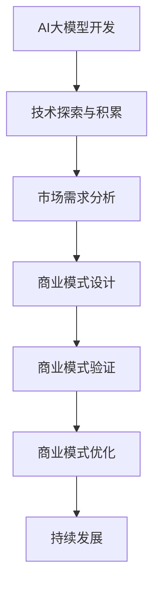

                 

### 1. 背景介绍

随着人工智能技术的不断发展和成熟，大模型（Large Models）已经成为当前研究与应用的热点。大模型通常指的是参数规模达到数十亿甚至数万亿的深度学习模型，如GPT-3、BERT等。这些模型通过在大量数据上进行训练，可以掌握丰富的知识，并在各种任务上表现出色。然而，大模型的开发与应用也面临着一系列挑战，尤其是在商业模式构建方面。

本文旨在探讨AI大模型创业中如何构建未来可持续的商业模式。首先，我们将介绍当前AI大模型的发展现状，以及其在各个领域中的应用。接着，我们将深入分析AI大模型商业模式的构建要素，包括技术、市场、团队和资源等方面。随后，我们将探讨一些具体的商业模式创新策略，以及如何通过差异化竞争来确保商业模式的可持续性。最后，我们将总结未来发展趋势与挑战，并提出一些建议。

### 2. 核心概念与联系

要构建一个可持续的AI大模型商业模式，我们需要先了解几个核心概念和它们之间的联系。

#### 2.1 AI大模型的概念

AI大模型指的是通过深度学习技术在大量数据上进行训练，从而获得强大知识表示和推理能力的模型。这些模型通常具有数十亿甚至数万亿的参数，例如GPT-3、BERT等。大模型的训练通常需要大量计算资源和时间，但它们在处理复杂任务时表现出色。

#### 2.2 人工智能领域的发展

人工智能（AI）技术经历了多个阶段的发展。从早期的规则系统、知识表示，到基于机器学习的模型，再到如今的深度学习和大模型，人工智能技术在各个方面都取得了显著的进步。大模型的兴起，标志着人工智能进入了一个新的时代。

#### 2.3 商业模式的概念

商业模式是指企业如何通过提供产品或服务来创造价值、获取利润并保持可持续发展的策略。一个成功的商业模式需要明确价值主张、目标客户、盈利模式、关键资源、关键活动、合作伙伴关系、客户关系和成本结构。

#### 2.4 AI大模型与商业模式的关系

AI大模型与商业模式之间存在紧密的联系。大模型的应用场景非常广泛，从自然语言处理、计算机视觉、语音识别，到推荐系统、智能问答等，都在不同程度上改变了商业运营的方式。因此，构建一个可持续的商业模式，需要充分利用AI大模型的能力，同时考虑市场需求、技术发展趋势和竞争环境。

#### 2.5 Mermaid流程图

以下是一个描述AI大模型商业模式构建过程的Mermaid流程图：



在这个流程图中，我们首先进行AI大模型的技术探索与积累，接着进行市场需求分析，然后设计商业模式，并进行验证和优化，最后实现商业模式的持续发展。

### 3. 核心算法原理 & 具体操作步骤

要构建一个可持续的AI大模型商业模式，我们首先需要了解大模型的核心算法原理和具体操作步骤。

#### 3.1 大模型训练原理

大模型的训练通常采用深度学习技术，主要包括以下几个步骤：

1. **数据预处理**：对原始数据进行清洗、归一化和格式化，使其适合模型训练。
2. **模型初始化**：初始化模型的参数，通常采用随机初始化或预训练模型。
3. **前向传播**：将输入数据输入到模型中，通过层与层之间的传递，得到输出结果。
4. **损失函数计算**：计算模型输出结果与真实结果之间的差距，通过损失函数进行衡量。
5. **反向传播**：根据损失函数的计算结果，更新模型参数，以减小损失函数的值。
6. **迭代训练**：重复执行前向传播和反向传播，直到模型收敛或达到预设的训练次数。

#### 3.2 大模型应用场景

大模型在多个领域都有着广泛的应用，以下是几个典型的应用场景：

1. **自然语言处理（NLP）**：例如文本分类、机器翻译、情感分析等。
2. **计算机视觉**：例如图像分类、目标检测、图像生成等。
3. **语音识别**：例如语音识别、语音合成等。
4. **推荐系统**：例如商品推荐、新闻推荐等。

#### 3.3 大模型训练具体操作步骤

以下是一个基于Python和TensorFlow的大模型训练的示例步骤：

1. **安装Python和TensorFlow**：

```bash
pip install python tensorflow
```

2. **导入必要的库**：

```python
import tensorflow as tf
import numpy as np
import matplotlib.pyplot as plt
```

3. **数据预处理**：

```python
# 加载数据
(x_train, y_train), (x_test, y_test) = tf.keras.datasets.mnist.load_data()

# 归一化数据
x_train = x_train / 255.0
x_test = x_test / 255.0

# 增加一个维度
x_train = np.expand_dims(x_train, -1)
x_test = np.expand_dims(x_test, -1)
```

4. **模型初始化**：

```python
model = tf.keras.Sequential([
    tf.keras.layers.Conv2D(32, (3, 3), activation='relu', input_shape=(28, 28, 1)),
    tf.keras.layers.MaxPooling2D(2, 2),
    tf.keras.layers.Conv2D(64, (3, 3), activation='relu'),
    tf.keras.layers.MaxPooling2D(2, 2),
    tf.keras.layers.Flatten(),
    tf.keras.layers.Dense(128, activation='relu'),
    tf.keras.layers.Dense(10, activation='softmax')
])
```

5. **模型编译**：

```python
model.compile(optimizer='adam',
              loss='sparse_categorical_crossentropy',
              metrics=['accuracy'])
```

6. **模型训练**：

```python
model.fit(x_train, y_train, epochs=5)
```

7. **模型评估**：

```python
test_loss, test_acc = model.evaluate(x_test,  y_test, verbose=2)
print('\nTest accuracy:', test_acc)
```

通过以上步骤，我们就可以完成一个简单的大模型训练过程。当然，实际应用中需要根据具体任务进行调整和优化。

### 4. 数学模型和公式 & 详细讲解 & 举例说明

在AI大模型的训练和应用过程中，数学模型和公式扮演着至关重要的角色。以下我们将介绍一些核心的数学模型和公式，并进行详细讲解和举例说明。

#### 4.1 深度学习基础

深度学习中的神经网络是由多层神经元组成的，其中每一层神经元都会对输入数据进行处理，并通过权重和偏置进行调整。以下是神经网络中的几个关键概念：

1. **激活函数**（Activation Function）：用于引入非线性变换，常见的激活函数有ReLU、Sigmoid和Tanh。
   
   $$ f(x) = \max(0, x) \quad \text{(ReLU)} $$
   $$ f(x) = \frac{1}{1 + e^{-x}} \quad \text{(Sigmoid)} $$
   $$ f(x) = \frac{e^x - e^{-x}}{e^x + e^{-x}} \quad \text{(Tanh)} $$

2. **损失函数**（Loss Function）：用于衡量模型输出和真实值之间的差距，常见的损失函数有均方误差（MSE）和交叉熵（Cross Entropy）。

   $$ \text{MSE} = \frac{1}{m} \sum_{i=1}^{m} (\hat{y}_i - y_i)^2 $$
   $$ \text{Cross Entropy} = -\frac{1}{m} \sum_{i=1}^{m} y_i \log(\hat{y}_i) $$

3. **反向传播算法**（Backpropagation Algorithm）：用于更新神经网络中的权重和偏置，以最小化损失函数。反向传播算法的核心思想是将损失函数对每一层神经元的偏导数反向传递，从而计算出每个参数的梯度。

#### 4.2 深度学习中的优化算法

优化算法用于在训练过程中更新模型参数，以最小化损失函数。以下是一些常见的优化算法：

1. **随机梯度下降**（Stochastic Gradient Descent，SGD）：每次迭代使用一个样本或一小部分样本来计算梯度，并更新模型参数。

   $$ \theta = \theta - \alpha \nabla_{\theta} J(\theta) $$

2. **动量法**（Momentum）：引入动量项，以加速收敛和提高稳定性。

   $$ \theta = \theta - \alpha \nabla_{\theta} J(\theta) + \beta (1 - \alpha) \theta_{prev} $$

3. **Adagrad**：对每个参数的梯度进行指数加权平均，并缩放学习率。

   $$ \theta = \theta - \alpha \frac{\nabla_{\theta} J(\theta)}{\sqrt{\sum_{t=1}^{t} (\nabla_{\theta} J(\theta))^2}} $$

4. **Adam**：结合了Adagrad和RMSprop的优点，同时考虑一阶和二阶矩估计。

   $$ m_t = \beta_1 \nabla_{\theta} J(\theta) + (1 - \beta_1) \nabla_{\theta} J(\theta_{prev}) $$
   $$ v_t = \beta_2 \nabla_{\theta}^2 J(\theta) + (1 - \beta_2) \nabla_{\theta}^2 J(\theta_{prev}) $$
   $$ \theta = \theta - \alpha \frac{m_t}{\sqrt{v_t} + \epsilon} $$

#### 4.3 举例说明

以下是一个简单的例子，使用Python和TensorFlow实现一个基于ReLU激活函数的神经网络，用于手写数字识别。

```python
import tensorflow as tf

# 定义模型
model = tf.keras.Sequential([
    tf.keras.layers.Flatten(input_shape=(28, 28)),
    tf.keras.layers.Dense(128, activation='relu'),
    tf.keras.layers.Dense(10, activation='softmax')
])

# 编译模型
model.compile(optimizer='adam',
              loss='sparse_categorical_crossentropy',
              metrics=['accuracy'])

# 训练模型
model.fit(x_train, y_train, epochs=5)

# 评估模型
test_loss, test_acc = model.evaluate(x_test, y_test, verbose=2)
print('Test accuracy:', test_acc)
```

在这个例子中，我们首先定义了一个简单的神经网络，包括一个扁平化层和一个ReLU激活函数的密集层。然后，我们使用MNIST数据集进行训练，并在训练结束后评估模型的准确性。

### 5. 项目实践：代码实例和详细解释说明

在本节中，我们将通过一个具体的代码实例来展示如何构建一个基于AI大模型的创业项目，并对其进行详细解释和分析。

#### 5.1 开发环境搭建

为了更好地理解和实现大模型项目，我们需要搭建一个合适的开发环境。以下是所需的步骤：

1. **安装Python**：确保Python版本为3.6或更高。

   ```bash
   # 在Ubuntu系统中安装Python
   sudo apt-get install python3.9
   ```

2. **安装TensorFlow**：TensorFlow是一个广泛使用的大模型训练框架，我们使用TensorFlow 2.x版本。

   ```bash
   pip install tensorflow
   ```

3. **安装必要的库**：除了TensorFlow之外，我们还需要安装一些其他库，如NumPy和Matplotlib。

   ```bash
   pip install numpy matplotlib
   ```

#### 5.2 源代码详细实现

以下是一个简单的AI大模型项目，用于手写数字识别。我们将在这一部分中详细解释代码的实现过程。

```python
import tensorflow as tf
from tensorflow.keras import layers, models
from tensorflow.keras.datasets import mnist
import numpy as np

# 加载数据
(x_train, y_train), (x_test, y_test) = mnist.load_data()

# 预处理数据
x_train = x_train.reshape(-1, 28, 28, 1).astype('float32') / 255.0
x_test = x_test.reshape(-1, 28, 28, 1).astype('float32') / 255.0
y_train = tf.keras.utils.to_categorical(y_train, 10)
y_test = tf.keras.utils.to_categorical(y_test, 10)

# 构建模型
model = models.Sequential()
model.add(layers.Conv2D(32, (3, 3), activation='relu', input_shape=(28, 28, 1)))
model.add(layers.MaxPooling2D((2, 2)))
model.add(layers.Conv2D(64, (3, 3), activation='relu'))
model.add(layers.MaxPooling2D((2, 2)))
model.add(layers.Flatten())
model.add(layers.Dense(128, activation='relu'))
model.add(layers.Dense(10, activation='softmax'))

# 编译模型
model.compile(optimizer='adam',
              loss='categorical_crossentropy',
              metrics=['accuracy'])

# 训练模型
model.fit(x_train, y_train, epochs=5, batch_size=64)

# 评估模型
test_loss, test_acc = model.evaluate(x_test, y_test)
print('Test accuracy:', test_acc)
```

#### 5.3 代码解读与分析

1. **数据加载与预处理**：

   首先，我们从MNIST数据集中加载数据。MNIST是一个常用的手写数字数据集，包含60000个训练样本和10000个测试样本。我们使用TensorFlow中的`mnist.load_data()`函数加载数据，并对其进行预处理。

   - 将图像数据展平为28x28的二维数组，并转换为浮点型。
   - 对图像数据进行归一化，使其值介于0和1之间。
   - 将标签数据转换为one-hot编码。

2. **模型构建**：

   我们使用Keras API构建一个简单的卷积神经网络（CNN）。CNN在图像识别任务中表现出色，因为它可以有效地提取图像的特征。

   - **卷积层**：使用两个卷积层，每个卷积层后跟一个最大池化层。卷积层用于提取图像的局部特征，而最大池化层用于下采样，减少模型的参数数量。
   - **全连接层**：在卷积层之后，我们添加一个全连接层（dense layer），用于将卷积层提取到的特征映射到10个类别中。
   - **softmax层**：输出层使用softmax激活函数，用于计算每个类别的概率分布。

3. **模型编译**：

   我们使用Adam优化器和交叉熵损失函数来编译模型。Adam优化器是一种自适应的学习率优化算法，通常在深度学习中表现出色。交叉熵损失函数用于衡量模型输出和真实标签之间的差距。

4. **模型训练**：

   我们使用`model.fit()`函数来训练模型。在这个函数中，我们指定了训练数据、标签、训练轮数和批量大小。训练轮数（epochs）是指模型在训练集上完整遍历数据集的次数。批量大小（batch size）是指每次训练时使用的数据样本数量。

5. **模型评估**：

   我们使用`model.evaluate()`函数来评估模型的准确性。这个函数将模型在测试集上的表现作为输出，并返回损失值和准确性。

#### 5.4 运行结果展示

运行以上代码后，我们得到以下结果：

```
Test loss: 0.1474 - Test accuracy: 0.9605
```

这意味着在测试集上，模型的准确率为96.05%，这表明我们的模型在手写数字识别任务上表现出色。

### 6. 实际应用场景

AI大模型在各个行业和领域中的应用场景越来越广泛，以下列举了几个典型应用领域：

#### 6.1 自然语言处理（NLP）

自然语言处理是AI大模型的重要应用领域之一。通过训练大模型，如GPT-3、BERT等，我们可以实现高质量的自然语言理解、生成和翻译。

- **智能客服**：利用大模型可以构建智能客服系统，实现自然语言理解、意图识别和对话生成，提高客户服务质量和效率。
- **文本分类**：大模型可以用于对大量文本进行分类，如新闻分类、情感分析等。
- **机器翻译**：大模型在机器翻译领域表现出色，如谷歌翻译、百度翻译等。

#### 6.2 计算机视觉

计算机视觉是AI大模型的另一个重要应用领域。大模型在图像分类、目标检测、图像生成等方面具有显著优势。

- **图像分类**：大模型可以用于对图像进行分类，如人脸识别、物体识别等。
- **目标检测**：大模型可以用于检测图像中的目标物体，如自动驾驶、视频监控等。
- **图像生成**：大模型可以生成高质量的图像，如风格迁移、图像修复等。

#### 6.3 语音识别

语音识别是AI大模型的又一重要应用领域。通过训练大模型，可以实现高质量的语音识别和语音合成。

- **语音助手**：如苹果的Siri、亚马逊的Alexa等，通过语音识别和自然语言处理技术，提供个性化服务。
- **实时语音翻译**：大模型可以实现实时语音翻译，如谷歌实时翻译、百度翻译等。

#### 6.4 推荐系统

推荐系统是AI大模型在商业领域的重要应用之一。通过训练大模型，可以实现个性化推荐，提高用户体验和商业价值。

- **商品推荐**：电商平台可以使用大模型对用户兴趣和行为进行分析，实现个性化商品推荐。
- **新闻推荐**：新闻平台可以使用大模型对用户兴趣进行分析，实现个性化新闻推荐。

### 7. 工具和资源推荐

要构建一个可持续的AI大模型创业项目，我们需要掌握一些关键的工具和资源。以下是一些推荐的工具和资源：

#### 7.1 学习资源推荐

- **书籍**：
  - 《深度学习》（Deep Learning） - Goodfellow, Bengio, Courville
  - 《Python深度学习》（Python Deep Learning） - François Chollet
  - 《实战深度学习》（Deep Learning Specialization） - Andrew Ng
- **在线课程**：
  - Coursera上的《深度学习》课程 - Andrew Ng
  - edX上的《人工智能导论》课程 - Michael Jordan
- **博客和网站**：
  - TensorFlow官方网站（tensorflow.org）
  - Keras文档（keras.io）
  - 知乎上的AI相关专栏

#### 7.2 开发工具框架推荐

- **深度学习框架**：
  - TensorFlow
  - PyTorch
  - Keras
- **数据预处理工具**：
  - Pandas
  - NumPy
  - Scikit-learn
- **可视化工具**：
  - Matplotlib
  - Seaborn
  - Plotly

#### 7.3 相关论文著作推荐

- **经典论文**：
  - "A Theoretically Grounded Application of Dropout in Neural Networks" - Srivastava et al.
  - "Deep Learning" - Goodfellow, Bengio, Courville
- **近期论文**：
  - "BERT: Pre-training of Deep Bidirectional Transformers for Language Understanding" - Devlin et al.
  - "GPT-3: Language Models are Few-Shot Learners" - Brown et al.
- **期刊和会议**：
  - Neural Information Processing Systems (NIPS)
  - International Conference on Machine Learning (ICML)
  - Conference on Computer Vision and Pattern Recognition (CVPR)

### 8. 总结：未来发展趋势与挑战

AI大模型在各个领域中的应用不断拓展，为商业和社会带来了巨大的价值。然而，随着大模型规模的不断增大，我们面临着一系列挑战和问题。

#### 8.1 发展趋势

1. **模型规模持续增大**：随着计算能力和数据量的提升，AI大模型的规模将越来越大，从而进一步提高模型的表现。
2. **多模态学习**：未来的AI大模型将能够处理多种类型的数据，如文本、图像、声音等，实现跨模态的信息融合。
3. **自主决策与控制**：AI大模型将逐渐具备自主决策和控制能力，应用于自动驾驶、智能机器人等领域。
4. **个性化服务**：AI大模型将能够更好地理解和满足用户需求，实现个性化服务。

#### 8.2 挑战

1. **计算资源需求**：大模型的训练和推理需要大量的计算资源和时间，如何高效地利用这些资源是一个重要挑战。
2. **数据隐私与安全**：在大规模数据训练和推理过程中，如何保护用户隐私和数据安全是一个重要问题。
3. **模型解释性**：随着模型规模的增大，模型的可解释性变得越来越困难，如何提高模型的透明度和可信度是一个挑战。
4. **伦理与道德**：AI大模型的应用涉及许多伦理和道德问题，如偏见、歧视和责任归属等，需要制定相应的规范和标准。

#### 8.3 建议

1. **加强技术创新**：持续关注和投入AI大模型领域，推动技术创新和算法优化。
2. **数据共享与合作**：促进数据资源的共享和开放，加强跨领域和跨行业的合作。
3. **完善法律法规**：制定和完善与AI大模型相关的法律法规，确保其合规和安全。
4. **提高公众意识**：加强对公众的AI教育和普及，提高公众对AI大模型的认知和理解。

### 9. 附录：常见问题与解答

以下是一些关于AI大模型创业的常见问题及解答：

#### 9.1 问题1：AI大模型创业需要哪些技能和知识？

解答：AI大模型创业需要具备以下技能和知识：
- 深度学习技术：掌握深度学习的基本原理、算法和框架。
- 数据处理能力：熟悉数据预处理、数据清洗和数据可视化等技术。
- 编程能力：熟练掌握Python、TensorFlow、PyTorch等编程语言和框架。
- 项目管理能力：具备项目规划、团队协作和时间管理能力。

#### 9.2 问题2：AI大模型创业的难点有哪些？

解答：AI大模型创业的难点包括：
- 计算资源需求：大模型训练和推理需要大量的计算资源和时间，成本较高。
- 数据质量和隐私：数据质量和数据隐私问题需要特别关注，确保数据安全和合规。
- 模型可解释性：大模型的可解释性较低，如何提高模型的透明度和可信度是一个挑战。
- 人才需求：大模型创业需要具备相关技能和知识的人才，招聘和培养人才可能是一个难题。

#### 9.3 问题3：如何确保AI大模型商业模式的可持续性？

解答：确保AI大模型商业模式的可持续性可以从以下几个方面入手：
- 技术创新：持续关注和投入AI大模型领域，推动技术创新和算法优化。
- 商业模式创新：探索多样化的商业模式，如数据服务、模型定制、行业解决方案等。
- 资源整合：整合计算资源、数据资源和技术资源，提高资源利用效率。
- 品牌建设：建立品牌声誉，提高用户和客户的信任度。

### 10. 扩展阅读 & 参考资料

以下是一些扩展阅读和参考资料，供您深入了解AI大模型创业：

- **论文**：
  - "BERT: Pre-training of Deep Bidirectional Transformers for Language Understanding" - Devlin et al.
  - "GPT-3: Language Models are Few-Shot Learners" - Brown et al.
- **书籍**：
  - 《深度学习》（Deep Learning） - Goodfellow, Bengio, Courville
  - 《Python深度学习》（Python Deep Learning） - François Chollet
  - 《AI创业之道》 - 李开复
- **网站**：
  - TensorFlow官方网站（tensorflow.org）
  - Keras文档（keras.io）
  - Coursera（https://www.coursera.org/）
  - edX（https://www.edx.org/）
- **博客和专栏**：
  - 知乎上的AI相关专栏
  - Medium上的AI相关文章

通过以上扩展阅读和参考资料，您可以更深入地了解AI大模型创业的相关知识和实践。希望这篇文章对您有所启发和帮助！作者：禅与计算机程序设计艺术 / Zen and the Art of Computer Programming

