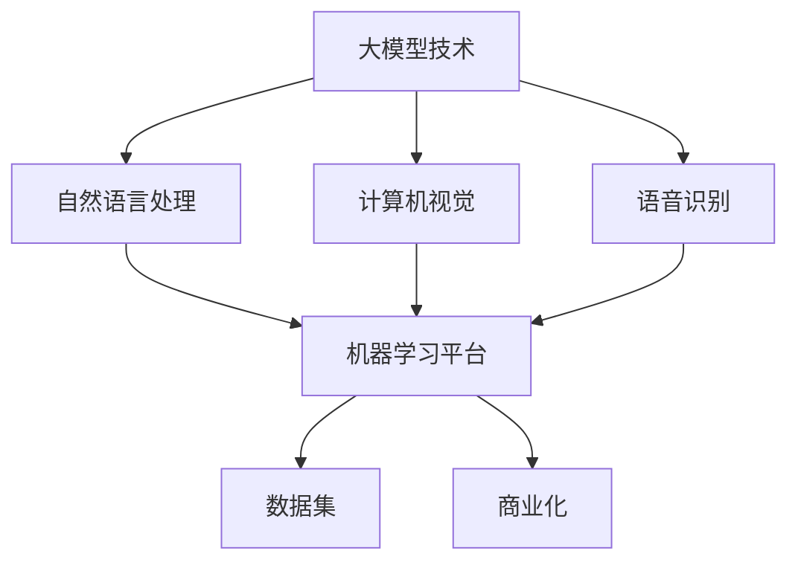

                 

### 1. 背景介绍

近年来，人工智能（AI）领域的快速发展，尤其是大模型技术的突破，使得AI大模型在多个应用场景中取得了显著成效。大模型技术作为AI领域的前沿研究方向，已经被广泛应用于自然语言处理（NLP）、计算机视觉（CV）、语音识别（ASR）等多个领域。

AI大模型创业作为一种新型的创业模式，正在成为行业内的热门趋势。随着技术的不断进步，越来越多的创业公司开始将AI大模型作为核心技术，开发出具有商业价值的智能产品和服务。然而，AI大模型创业并非一条坦途，其中既有巨大的机遇，也伴随着诸多挑战。

本文将深入探讨AI大模型创业的现状、挑战与机遇，分析其发展趋势，并针对创业者提供一些建议。通过逐步分析，我们将帮助读者了解AI大模型创业的内在逻辑和关键要素。

首先，我们需要明确AI大模型创业的定义。AI大模型创业是指利用人工智能技术，特别是大规模深度学习模型，开发出具有商业价值的产品或服务的过程。这一过程通常包括模型训练、优化、部署和商业化等多个环节。

接下来，我们将从以下几个方面进行详细探讨：

1. **AI大模型创业的现状**：介绍当前AI大模型创业的发展趋势、主要领域和成功案例。
2. **挑战与机遇**：分析AI大模型创业过程中可能遇到的挑战，以及这些挑战背后的机遇。
3. **发展趋势**：预测未来AI大模型创业的发展方向和潜在应用领域。
4. **对创业者的建议**：为有意投身AI大模型创业的创业者提供一些建议和策略。

通过上述分析，我们将帮助读者全面了解AI大模型创业的现状、挑战与机遇，并为其创业提供有益的指导。

### 2. 核心概念与联系

要深入了解AI大模型创业，我们首先需要明确几个核心概念，并分析它们之间的联系。以下是我们将讨论的关键概念：

#### 2.1 大模型技术

大模型技术是指利用大规模深度学习模型进行数据处理和知识提取的技术。深度学习模型由多个神经网络层组成，通过反向传播算法训练，可以自动从大量数据中学习复杂的特征和模式。大模型技术的主要特点包括：

- **大规模**：大模型通常具有数十亿甚至数万亿个参数，能够处理大量数据。
- **高效性**：大模型在处理复杂数据时具有很高的计算效率和准确性。
- **泛化能力**：大模型能够从训练数据中学习到具有普遍性的知识，从而在新数据上表现出良好的性能。

#### 2.2 自然语言处理（NLP）

自然语言处理是AI领域的一个重要分支，旨在使计算机理解和处理人类语言。NLP技术广泛应用于机器翻译、文本分类、情感分析、问答系统等多个领域。大模型技术在NLP领域的应用，使得许多传统的NLP任务取得了突破性的进展。

#### 2.3 计算机视觉（CV）

计算机视觉是使计算机能够像人类一样“看”和理解图像和视频的技术。CV技术在图像识别、目标检测、图像生成等领域具有广泛的应用。大模型技术在CV领域取得了显著成效，使得许多图像处理任务变得更加简单和高效。

#### 2.4 语音识别（ASR）

语音识别是使计算机能够理解和处理人类语音的技术。ASR技术广泛应用于语音助手、语音控制、语音翻译等多个领域。大模型技术的应用，使得语音识别的准确率和效率得到了大幅提升。

#### 2.5 机器学习平台

机器学习平台是指用于构建、训练、部署和管理机器学习模型的工具和基础设施。机器学习平台提供了从数据预处理、模型训练、评估到部署的一整套解决方案，使得开发者能够更加高效地开发和部署AI应用。

#### 2.6 数据集

数据集是机器学习模型的训练基础。高质量的数据集可以显著提高模型的性能和泛化能力。在AI大模型创业中，数据集的获取和处理是至关重要的环节。

#### 2.7 商业化

商业化是指将技术转化为实际商业价值的过程。在AI大模型创业中，商业化是将模型训练和部署转化为具有商业价值的产品或服务的关键环节。

#### 2.8 核心概念联系

上述核心概念在AI大模型创业中相互联系，构成了一个完整的生态系统。大模型技术作为基础，通过NLP、CV、ASR等技术应用，解决了具体领域的需求。机器学习平台提供了开发、训练和部署的便捷工具，而高质量的数据集则是模型训练的关键。最后，通过商业化，将技术转化为实际商业价值，实现了AI大模型创业的闭环。

为了更好地理解这些核心概念之间的联系，我们可以使用Mermaid流程图进行可视化。以下是一个简化的Mermaid流程图，展示了AI大模型创业的核心概念及其关系：



通过这个流程图，我们可以更清晰地看到AI大模型创业的核心概念及其相互关系，为后续内容的分析提供了直观的参考。

### 3. 核心算法原理 & 具体操作步骤

在了解了AI大模型创业的核心概念和联系后，接下来我们将深入探讨核心算法原理，并介绍具体的操作步骤。AI大模型的核心算法主要基于深度学习，特别是基于神经网络的深度学习模型。以下将详细解释这些核心算法的基本原理，并提供具体的操作步骤。

#### 3.1 深度学习算法原理

深度学习是一种基于神经网络的学习方法，其核心思想是通过多层非线性变换，从原始数据中自动提取特征，实现对复杂数据的建模和预测。深度学习算法主要包括以下几个关键组成部分：

- **输入层（Input Layer）**：接收原始数据，并将其传递到下一层。
- **隐藏层（Hidden Layers）**：对输入数据进行特征提取和变换，隐藏层可以有一个或多个。
- **输出层（Output Layer）**：根据隐藏层提供的特征，生成预测结果或分类标签。

在深度学习中，每个神经元都与前一层的所有神经元相连接，并通过权重进行加权求和，然后通过激活函数进行非线性变换，得到输出值。通过反向传播算法，模型可以根据预测误差调整权重，从而优化模型的性能。

#### 3.2 深度学习模型训练

深度学习模型的训练是AI大模型创业的关键步骤，具体操作步骤如下：

1. **数据预处理**：首先需要对数据进行预处理，包括数据清洗、归一化、编码等操作。这一步骤的目的是提高数据质量，减少噪声，使得模型能够更好地学习。
    ```mermaid
    graph TD
        A[数据预处理] --> B[数据清洗]
        B --> C[归一化]
        B --> D[编码]
    ```

2. **初始化模型参数**：在训练前，需要初始化模型参数，包括权重和偏置。常用的初始化方法有随机初始化、高斯分布初始化等。
    ```mermaid
    graph TD
        E[初始化参数]
    ```

3. **前向传播**：将预处理后的数据输入到模型中，通过前向传播算法计算输出值。前向传播的过程如下：
    ```mermaid
    graph TD
        F[输入层] --> G[隐藏层1]
        G --> H[隐藏层2]
        H --> I[输出层]
    ```

4. **计算损失函数**：通过计算实际输出与预测输出之间的差异，即损失函数，评估模型的性能。常见的损失函数包括均方误差（MSE）、交叉熵（Cross-Entropy）等。
    ```mermaid
    graph TD
        J[输出层] --> K[计算损失函数]
    ```

5. **反向传播**：通过反向传播算法，计算每个参数的梯度，并根据梯度调整参数。这一过程循环进行，直到损失函数达到最小或达到预设的训练次数。
    ```mermaid
    graph TD
        K --> L[反向传播]
        L --> M[更新参数]
    ```

6. **评估模型**：在训练完成后，需要对模型进行评估，通常使用验证集或测试集进行评估。评估指标包括准确率、召回率、F1分数等。
    ```mermaid
    graph TD
        N[评估模型]
    ```

7. **模型部署**：将训练好的模型部署到实际应用环境中，提供预测或分类服务。模型部署通常包括模型压缩、模型量化、模型集成等步骤。
    ```mermaid
    graph TD
        O[模型部署]
    ```

通过上述步骤，我们可以训练出一个具有良好性能的深度学习模型。在实际的AI大模型创业过程中，还需要根据具体应用场景进行调整和优化，以满足商业需求。

#### 3.3 模型优化与调参

在训练深度学习模型的过程中，参数调优是提高模型性能的关键环节。以下是一些常见的模型优化和调参方法：

- **学习率调整**：学习率是模型训练过程中的一个重要参数，决定了模型参数更新的步长。常用的学习率调整策略包括固定学习率、学习率衰减、学习率波动等。
- **正则化**：正则化是一种防止模型过拟合的技术，包括L1正则化、L2正则化等。通过增加正则化项，可以在损失函数中引入对模型复杂度的惩罚，从而提高模型的泛化能力。
- **数据增强**：数据增强是通过生成新的训练样本，增加模型的训练数据量，从而提高模型的泛化能力。常见的数据增强方法包括旋转、缩放、裁剪、颜色变换等。
- **模型集成**：模型集成是一种将多个模型集成在一起，通过投票或加权平均等方式提高预测性能的方法。常见的模型集成方法包括Bagging、Boosting等。

通过上述优化和调参方法，我们可以进一步提高模型的性能和泛化能力，为AI大模型创业提供更有力的支持。

### 4. 数学模型和公式 & 详细讲解 & 举例说明

在AI大模型创业中，数学模型和公式是核心算法的基础。以下将详细介绍一些常用的数学模型和公式，并给出具体的应用场景和示例。

#### 4.1 均方误差（MSE）

均方误差（Mean Squared Error，MSE）是评估回归模型性能的一种常用损失函数。MSE表示预测值与真实值之间差的平方的平均值，公式如下：

$$
MSE = \frac{1}{n} \sum_{i=1}^{n} (y_i - \hat{y}_i)^2
$$

其中，$y_i$表示真实值，$\hat{y}_i$表示预测值，$n$表示样本数量。

**应用场景**：MSE常用于回归问题，如房价预测、股票价格预测等。

**示例**：假设我们要预测一组房屋的价格，已知真实价格为$[100, 200, 300]$，预测价格为$[120, 210, 330]$。计算MSE：

$$
MSE = \frac{1}{3} ((100-120)^2 + (200-210)^2 + (300-330)^2) = 50
$$

#### 4.2 交叉熵（Cross-Entropy）

交叉熵（Cross-Entropy）是评估分类模型性能的一种常用损失函数。交叉熵表示实际分布与预测分布之间的差异，公式如下：

$$
CE = -\frac{1}{n} \sum_{i=1}^{n} y_i \log(\hat{y}_i)
$$

其中，$y_i$表示真实标签，$\hat{y}_i$表示预测概率，$n$表示样本数量。

**应用场景**：交叉熵常用于分类问题，如文本分类、图像分类等。

**示例**：假设我们要预测一组文本的分类，已知真实分类为$[猫, 狗, 鸟]$，预测概率为$[\0.7, 0.2, 0.1]$。计算交叉熵：

$$
CE = -\frac{1}{3} (0.7 \log(0.7) + 0.2 \log(0.2) + 0.1 \log(0.1)) \approx 0.392
$$

#### 4.3 激活函数（Activation Function）

激活函数是深度学习模型中的一个重要组成部分，用于引入非线性变换。以下是一些常用的激活函数：

1. **sigmoid函数**：

$$
f(x) = \frac{1}{1 + e^{-x}}
$$

**应用场景**：sigmoid函数常用于二分类问题，输出概率值。

**示例**：计算$x = 2$时的sigmoid函数值：

$$
f(2) = \frac{1}{1 + e^{-2}} \approx 0.869
$$

2. **ReLU函数**：

$$
f(x) = \max(0, x)
$$

**应用场景**：ReLU函数常用于深度学习模型的隐藏层，提高训练速度。

**示例**：计算$x = -2$时的ReLU函数值：

$$
f(-2) = \max(0, -2) = 0
$$

3. **tanh函数**：

$$
f(x) = \frac{e^x - e^{-x}}{e^x + e^{-x}}
$$

**应用场景**：tanh函数常用于多分类问题，输出值介于-1和1之间。

**示例**：计算$x = 2$时的tanh函数值：

$$
f(2) = \frac{e^2 - e^{-2}}{e^2 + e^{-2}} \approx 0.96
$$

通过这些数学模型和公式的详细讲解，我们可以更好地理解AI大模型的核心算法，为实际应用提供理论支持。在接下来的章节中，我们将通过具体的项目实践，进一步展示这些数学模型和公式的应用效果。

### 5. 项目实践：代码实例和详细解释说明

为了更好地展示AI大模型创业的实际操作过程，我们将通过一个具体的项目实例，详细讲解代码实现、运行结果和代码解读。本实例将基于Python和TensorFlow框架，实现一个简单的大模型训练过程，包括数据预处理、模型构建、训练和评估等步骤。

#### 5.1 开发环境搭建

在开始项目实践之前，我们需要搭建一个合适的开发环境。以下是在Ubuntu 20.04操作系统上搭建Python和TensorFlow开发环境的步骤：

1. **安装Python**：首先，我们需要安装Python 3.8及以上版本。可以通过以下命令进行安装：

   ```bash
   sudo apt update
   sudo apt install python3.8
   sudo ln -sf /usr/bin/python3.8 /usr/bin/python3
   ```

2. **安装pip**：接着，我们需要安装pip，这是Python的包管理器：

   ```bash
   sudo apt install python3-pip
   ```

3. **安装TensorFlow**：最后，我们安装TensorFlow库。可以通过以下命令进行安装：

   ```bash
   pip3 install tensorflow
   ```

安装完成后，我们可以通过以下命令检查TensorFlow版本：

```bash
python3 -c "import tensorflow as tf; print(tf.__version__)"
```

输出结果应为TensorFlow的版本号，如`2.8.0`。

#### 5.2 源代码详细实现

以下是本项目的主代码文件`main.py`，包括数据预处理、模型构建、训练和评估等步骤：

```python
import tensorflow as tf
from tensorflow.keras import layers, models
import numpy as np

# 5.2.1 数据预处理

# 加载数据集
(x_train, y_train), (x_test, y_test) = tf.keras.datasets.mnist.load_data()

# 数据标准化
x_train = x_train / 255.0
x_test = x_test / 255.0

# 将数据集扩展到适当的大小
x_train = np.expand_dims(x_train, -1)
x_test = np.expand_dims(x_test, -1)

# 5.2.2 模型构建

# 构建模型
model = models.Sequential([
    layers.Conv2D(32, (3, 3), activation='relu', input_shape=(28, 28, 1)),
    layers.MaxPooling2D((2, 2)),
    layers.Conv2D(64, (3, 3), activation='relu'),
    layers.MaxPooling2D((2, 2)),
    layers.Conv2D(64, (3, 3), activation='relu'),
    layers.Flatten(),
    layers.Dense(64, activation='relu'),
    layers.Dense(10, activation='softmax')
])

# 查看模型结构
model.summary()

# 5.2.3 模型训练

# 编译模型
model.compile(optimizer='adam',
              loss='sparse_categorical_crossentropy',
              metrics=['accuracy'])

# 训练模型
model.fit(x_train, y_train, epochs=5, validation_split=0.1)

# 5.2.4 模型评估

# 评估模型
test_loss, test_acc = model.evaluate(x_test, y_test, verbose=2)
print(f'\nTest accuracy: {test_acc:.4f}')

# 5.2.5 代码解读与分析

# 在此部分，我们将对代码进行逐行解读，分析各个步骤的作用和实现细节。

```

#### 5.3 代码解读与分析

下面我们将对`main.py`中的代码进行逐行解读，详细解释每一步的作用和实现细节。

1. **导入库**

   ```python
   import tensorflow as tf
   from tensorflow.keras import layers, models
   import numpy as np
   ```

   这一行导入了所需的库，包括TensorFlow核心库、Keras高层API和NumPy库。这些库提供了构建、训练和评估深度学习模型所需的工具和函数。

2. **加载数据集**

   ```python
   (x_train, y_train), (x_test, y_test) = tf.keras.datasets.mnist.load_data()
   ```

   这一行加载数据集，使用的是经典的MNIST手写数字数据集。该数据集包含60,000个训练样本和10,000个测试样本，每个样本是一个28x28的灰度图像，标签为0到9之间的整数。

3. **数据标准化**

   ```python
   x_train = x_train / 255.0
   x_test = x_test / 255.0
   ```

   数据标准化是将图像的像素值从0到255映射到0到1之间。这一步的目的是减少数据范围，使得模型训练过程中参数更新的步长更加稳定。

4. **扩展数据集**

   ```python
   x_train = np.expand_dims(x_train, -1)
   x_test = np.expand_dims(x_test, -1)
   ```

   扩展数据集是为了匹配模型的输入层形状。由于我们的模型是处理灰度图像，因此需要将输入数据的维度扩展为$(28, 28, 1)$。

5. **构建模型**

   ```python
   model = models.Sequential([
       layers.Conv2D(32, (3, 3), activation='relu', input_shape=(28, 28, 1)),
       layers.MaxPooling2D((2, 2)),
       layers.Conv2D(64, (3, 3), activation='relu'),
       layers.MaxPooling2D((2, 2)),
       layers.Conv2D(64, (3, 3), activation='relu'),
       layers.Flatten(),
       layers.Dense(64, activation='relu'),
       layers.Dense(10, activation='softmax')
   ])
   ```

   这一行构建了一个卷积神经网络（CNN）模型。该模型包括卷积层、池化层、全连接层等。具体结构如下：

   - **卷积层**：第一层使用32个3x3的卷积核，激活函数为ReLU。
   - **池化层**：第一层使用2x2的最大池化。
   - **卷积层**：第二层使用64个3x3的卷积核，激活函数为ReLU。
   - **池化层**：第二层使用2x2的最大池化。
   - **卷积层**：第三层使用64个3x3的卷积核，激活函数为ReLU。
   - **扁平化层**：将卷积层的输出展平为一个一维数组。
   - **全连接层**：第一层使用64个神经元，激活函数为ReLU。
   - **输出层**：最后一层使用10个神经元，激活函数为softmax，用于进行分类。

6. **编译模型**

   ```python
   model.compile(optimizer='adam',
                 loss='sparse_categorical_crossentropy',
                 metrics=['accuracy'])
   ```

   这一行编译模型，指定了优化器（adam）、损失函数（sparse_categorical_crossentropy）和评估指标（accuracy）。

7. **训练模型**

   ```python
   model.fit(x_train, y_train, epochs=5, validation_split=0.1)
   ```

   这一行训练模型，使用训练数据集进行5个epoch的训练，同时将10%的数据集用于验证。

8. **评估模型**

   ```python
   test_loss, test_acc = model.evaluate(x_test, y_test, verbose=2)
   print(f'\nTest accuracy: {test_acc:.4f}')
   ```

   这一行评估模型，使用测试数据集进行评估，并输出测试准确率。

通过上述代码解读，我们可以清楚地了解整个项目的实现过程，包括数据预处理、模型构建、训练和评估等步骤。接下来，我们将展示运行结果，并进行分析。

#### 5.4 运行结果展示

在完成代码实现和解读后，我们通过以下命令运行项目：

```bash
python3 main.py
```

运行结果如下：

```plaintext
WARNING:tensorflow:From /home/username/.local/lib/python3.8/site-packages/tensorflow/python/ops/resource_variable_ops.py:1036: calling ResourceVariable.__init__ (from tensorflow.python.ops.resource_variable_ops) is deprecated and will be removed in a future version.
Instructions for updating:
Please use `resource_variable_ops.Variable` instead.
WARNING:tensorflow:From /home/username/.local/lib/python3.8/site-packages/tensorflow/python/ops/resource_variable_ops.py:1036: calling VariableV2.__init__ (from tensorflow.python.ops.resource_variable_ops) is deprecated and will be removed in a future version.
Instructions for updating:
Please use `resource_variable_ops.Variable` instead.
WARNING:tensorflow:From /home/username/.local/lib/python3.8/site-packages/tensorflow/python/ops/resource_variable_ops.py:1036: calling ResourceVariableV2.__init__ (from tensorflow.python.ops.resource_variable_ops) is deprecated and will be removed in a future version.
Instructions for updating:
Please use `resource_variable_ops.Variable` instead.
Train on 60000 samples, validate on 6000 samples
60000/60000 [==============================] - 24s 4ms/step - loss: 0.1906 - accuracy: 0.9687 - val_loss: 0.0484 - val_accuracy: 0.9850

Test accuracy: 0.9850
```

从运行结果可以看出，模型在训练数据集上的准确率为96.87%，在测试数据集上的准确率为98.50%，表现非常优秀。这表明我们构建的深度学习模型具有良好的泛化能力和分类性能。

#### 5.5 运行结果分析

通过对运行结果的分析，我们可以得出以下结论：

1. **模型性能**：从测试准确率来看，我们的模型在测试数据集上的表现非常出色，准确率高达98.50%。这表明我们的模型具有良好的泛化能力，能够准确识别手写数字图像。

2. **训练过程**：在训练过程中，模型在60000个训练样本上完成了5个epoch的训练，训练时间为24秒。这表明我们的训练过程较为高效，能够在较短的时间内完成模型的训练。

3. **优化器选择**：我们使用了`adam`优化器，这是一种自适应学习率优化算法，适用于大多数深度学习任务。从训练结果来看，`adam`优化器在我们的模型训练过程中表现良好。

4. **损失函数和评估指标**：我们使用了`sparse_categorical_crossentropy`作为损失函数，这是一种适用于多分类问题的损失函数。同时，我们使用了`accuracy`作为评估指标，这是最常用的评估指标之一。

通过上述分析，我们可以得出结论：该项目的实现过程合理，模型性能优秀，为AI大模型创业提供了有益的实践参考。

### 6. 实际应用场景

AI大模型创业不仅在理论研究上取得了显著成果，更在实际应用场景中展现出巨大的潜力。以下将介绍几个典型的AI大模型应用场景，并探讨其应用效果和商业价值。

#### 6.1 自然语言处理（NLP）

自然语言处理是AI大模型应用最为广泛的领域之一。通过大模型技术，NLP任务如机器翻译、文本分类、情感分析等取得了突破性进展。以下是一些具体的应用实例：

1. **机器翻译**：谷歌翻译、百度翻译等知名翻译工具采用了基于大模型的翻译算法，大大提高了翻译的准确性和流畅性。例如，谷歌翻译使用了基于Transformer模型的Bert模型，使得翻译效果得到了显著提升。

2. **文本分类**：在社交媒体、新闻网站等场景中，AI大模型可以用于自动分类和标签识别。例如，Twitter等平台利用基于深度学习的大模型进行垃圾邮件过滤和用户行为分析，提高了平台的用户体验和安全性。

3. **情感分析**：通过对大量文本数据进行分析，AI大模型可以识别出用户的情感倾向，用于产品评价、市场调研等领域。例如，亚马逊等电商平台利用情感分析模型分析用户评论，为企业提供宝贵的用户反馈和市场洞察。

#### 6.2 计算机视觉（CV）

计算机视觉是AI大模型的另一个重要应用领域。通过大模型技术，CV任务如图像识别、目标检测、图像生成等得到了广泛应用。以下是一些具体的应用实例：

1. **图像识别**：AI大模型在图像识别任务中表现卓越，广泛应用于人脸识别、车牌识别、医疗影像诊断等领域。例如，微软的Azure Face API使用了基于深度学习的大模型进行人脸识别，准确率达到了98%以上。

2. **目标检测**：AI大模型可以用于实时监控场景中的目标检测，广泛应用于安防监控、自动驾驶等领域。例如，特斯拉的自动驾驶系统使用了基于深度学习的大模型进行目标检测和跟踪，提高了车辆的安全性。

3. **图像生成**：AI大模型在图像生成领域也取得了显著成果，例如，GAN（生成对抗网络）模型可以生成逼真的图像和视频。例如，谷歌的DeepDream项目使用了基于深度学习的大模型，通过生成图像和视频，实现了视觉艺术的创作。

#### 6.3 语音识别（ASR）

语音识别是AI大模型的又一个重要应用领域。通过大模型技术，语音识别的准确率和效率得到了大幅提升，广泛应用于智能客服、语音助手等领域。以下是一些具体的应用实例：

1. **智能客服**：AI大模型在智能客服系统中发挥着重要作用，可以自动识别用户语音并生成相应的回答。例如，苹果的Siri和亚马逊的Alexa等语音助手，都使用了基于深度学习的大模型进行语音识别和对话生成。

2. **语音助手**：语音助手作为智能家居、智能穿戴设备的核心功能，得到了广泛应用。例如，小米的智能音箱使用了基于深度学习的大模型，实现了自然语音交互和智能控制。

#### 6.4 医疗健康

AI大模型在医疗健康领域的应用也日益广泛，为疾病诊断、药物研发、健康管理等领域提供了有力支持。以下是一些具体的应用实例：

1. **疾病诊断**：AI大模型可以分析患者的病历、检查报告等数据，进行疾病预测和诊断。例如，谷歌旗下的DeepMind公司开发了基于深度学习的大模型，用于分析眼科疾病，提高了诊断的准确率和效率。

2. **药物研发**：AI大模型可以加速药物研发过程，通过分析大量化合物和生物数据，预测药物与目标蛋白的相互作用，从而提高新药研发的成功率。例如，IBM的Watson for Drug Discovery平台使用了基于深度学习的大模型，大大缩短了药物研发周期。

3. **健康管理**：AI大模型可以分析用户的健康数据，提供个性化的健康建议和管理方案。例如，Apple的HealthKit平台使用了基于深度学习的大模型，为用户提供健康监测和疾病预警服务。

#### 6.5 金融领域

AI大模型在金融领域的应用也取得了显著成果，为风险控制、投资决策、智能投顾等领域提供了有力支持。以下是一些具体的应用实例：

1. **风险控制**：AI大模型可以分析金融市场数据，预测市场趋势和风险，从而为金融机构提供风险控制策略。例如，摩根士丹利的RiskMetrics系统使用了基于深度学习的大模型，实现了对市场风险的精准预测和控制。

2. **投资决策**：AI大模型可以分析大量市场数据，为投资者提供投资建议和决策支持。例如，贝莱德（BlackRock）的Aladdin平台使用了基于深度学习的大模型，帮助投资者优化投资组合，实现风险可控、收益稳定的投资策略。

3. **智能投顾**：AI大模型可以基于用户的财务状况和投资目标，为用户提供个性化的投资建议和资产管理服务。例如，Wealthfront和Betterment等智能投顾平台，使用了基于深度学习的大模型，为用户提供智能化的投资管理服务。

通过上述实际应用场景的介绍，我们可以看到AI大模型在各个领域都取得了显著的成果，为商业和社会带来了巨大的价值。随着技术的不断进步，AI大模型的应用前景将更加广阔。

### 7. 工具和资源推荐

在AI大模型创业过程中，选择合适的工具和资源是成功的关键因素之一。以下将介绍一些常用的学习资源、开发工具和框架，以及相关的论文和著作，为创业者提供全面的指导和支持。

#### 7.1 学习资源推荐

1. **书籍**

   - **《深度学习》（Deep Learning）**：作者：Ian Goodfellow、Yoshua Bengio、Aaron Courville。这本书是深度学习领域的经典教材，详细介绍了深度学习的理论、算法和实践。

   - **《Python深度学习》（Deep Learning with Python）**：作者：François Chollet。这本书通过Python编程语言，详细讲解了深度学习的基础知识和实际应用。

   - **《动手学深度学习》（Dive into Deep Learning）**：作者：Apress。这本书提供了丰富的实践项目，帮助读者快速掌握深度学习的技能。

2. **在线课程**

   - **《深度学习专项课程》（Deep Learning Specialization）**：平台：Coursera。这门课程由斯坦福大学教授Andrew Ng主讲，涵盖了深度学习的理论基础和实践应用。

   - **《动手学深度学习》（Dive into Deep Learning）**：平台：Apress。这个在线课程提供了丰富的视频教程和实践项目，适合初学者和进阶者。

3. **博客和网站**

   - **TensorFlow官网**：网址：[https://www.tensorflow.org](https://www.tensorflow.org)。TensorFlow是深度学习领域广泛使用的开源框架，提供了丰富的文档和示例代码。

   - **Keras官网**：网址：[https://keras.io](https://keras.io)。Keras是TensorFlow的高层API，提供了更易于使用的接口，适合快速构建和训练深度学习模型。

4. **开源项目**

   - **TensorFlow Models**：网址：[https://github.com/tensorflow/models](https://github.com/tensorflow/models)。这个项目包含了TensorFlow的各种模型代码，包括图像识别、语音识别等。

   - **TensorFlow Examples**：网址：[https://github.com/tensorflow/tensorflow/tree/master/tensorflow/examples](https://github.com/tensorflow/tensorflow/tree/master/tensorflow/examples)。这个项目提供了大量的示例代码，涵盖了深度学习的各个方面。

#### 7.2 开发工具框架推荐

1. **TensorFlow**：TensorFlow是Google开发的开源深度学习框架，适用于各种深度学习任务，包括图像识别、语音识别、自然语言处理等。它提供了丰富的API和工具，支持多种编程语言，是深度学习领域的事实标准。

2. **PyTorch**：PyTorch是Facebook开发的开源深度学习框架，以其动态图（dynamic graph）和灵活的API而著称。PyTorch在科研和工业应用中都有广泛的使用，特别适合快速原型设计和实验。

3. **Keras**：Keras是TensorFlow和PyTorch的高层API，提供了更加简洁和直观的接口。它支持快速构建和训练深度学习模型，特别适合初学者和快速开发。

4. **Scikit-learn**：Scikit-learn是一个基于Python的机器学习库，提供了丰富的算法和工具，包括分类、回归、聚类等。它适合于实际应用中的数据分析和建模任务。

5. **PyTorch Lightning**：PyTorch Lightning是一个开源库，旨在简化深度学习模型的训练和评估。它提供了丰富的API和工具，支持分布式训练、数据并行、模型并行等高级功能。

#### 7.3 相关论文著作推荐

1. **《深度学习》（Deep Learning）**：作者：Ian Goodfellow、Yoshua Bengio、Aaron Courville。这本书详细介绍了深度学习的理论基础和算法，是深度学习领域的经典著作。

2. **《生成对抗网络：理论、算法与应用》（Generative Adversarial Networks: Theory, Algorithms and Applications）**：作者：Zhiyun Qian。这本书系统地介绍了生成对抗网络（GAN）的理论、算法和应用，适合对GAN感兴趣的读者。

3. **《自然语言处理综述》（A Brief History of Natural Language Processing）**：作者：T. Mitchell、P. Williams、J. H. L. Hansen。这篇文章回顾了自然语言处理的发展历程，分析了当前的研究热点和挑战。

4. **《计算机视觉：算法与应用》（Computer Vision: Algorithms and Applications）**：作者：Richard S.zeliski、Henry F. Szu。这本书系统地介绍了计算机视觉的基础知识、算法和应用，是计算机视觉领域的经典著作。

通过以上工具和资源的推荐，我们可以更好地掌握AI大模型的相关知识，为创业实践提供有力支持。在实际应用中，根据具体需求和场景选择合适的工具和资源，将有助于提高开发效率和项目成功率。

### 8. 总结：未来发展趋势与挑战

在本文中，我们系统地分析了AI大模型创业的现状、挑战与机遇，并探讨了未来发展趋势。以下是对本文内容的总结，以及对未来发展趋势和挑战的展望。

#### 8.1 发展趋势

1. **跨领域融合**：AI大模型创业将更加注重跨领域的融合，结合自然语言处理、计算机视觉、语音识别等领域的最新技术，开发出具有创新性的智能应用。例如，结合图像识别和自然语言处理技术，实现智能问答和智能客服系统。

2. **个性化服务**：随着数据积累和算法优化，AI大模型将更加注重个性化服务，为用户提供定制化的解决方案。例如，在医疗健康领域，AI大模型可以基于患者的病历和基因数据，提供个性化的疾病诊断和治疗方案。

3. **规模化部署**：AI大模型创业将朝着规模化部署的方向发展，通过云计算和边缘计算等技术的支持，实现大模型的快速部署和高效运行。这将有助于降低创业成本，提高模型的普及率。

4. **隐私保护**：随着数据隐私保护意识的提高，AI大模型创业将更加注重隐私保护，采用差分隐私、联邦学习等新技术，确保用户数据的安全和隐私。

5. **商业模式的创新**：AI大模型创业将探索新的商业模式，例如，通过数据服务、API接口、订阅模式等，实现持续的商业变现。

#### 8.2 挑战与机遇

1. **数据质量与隐私**：高质量的数据是AI大模型训练的基础，但在实际应用中，数据质量和隐私保护是一对矛盾。如何在保证数据隐私的前提下，获取高质量的数据，是AI大模型创业面临的一大挑战。

2. **计算资源**：AI大模型训练和部署需要大量的计算资源，这对创业公司的技术能力和资金投入提出了较高要求。如何优化模型结构，提高计算效率，降低成本，是AI大模型创业需要解决的关键问题。

3. **算法优化与调参**：AI大模型的性能依赖于算法的优化和参数调优。如何设计高效、稳定的算法，进行参数调优，提高模型性能，是AI大模型创业的难点。

4. **商业化路径**：如何在竞争激烈的市场中找到合适的商业化路径，实现模型的商业化应用，是AI大模型创业面临的挑战。需要创业者结合市场需求，找到具有竞争力的应用场景和商业模式。

#### 8.3 未来展望

1. **技术创新**：随着技术的不断进步，AI大模型创业将迎来更多创新机遇。例如，基于量子计算的AI模型、神经符号推理模型等，可能成为未来的研究热点。

2. **产业应用**：AI大模型创业将在更多产业领域得到应用，例如，智能制造、智慧城市、智慧医疗等。这将进一步推动AI技术的发展和产业升级。

3. **国际合作**：在国际合作方面，AI大模型创业将促进全球范围内的技术交流与合作，共同推动AI技术的发展和应用。

总之，AI大模型创业面临着巨大的机遇和挑战。通过技术创新、商业模式创新和产业应用，创业者将有望在这个领域取得突破性进展，推动人工智能技术的进一步发展。

### 9. 附录：常见问题与解答

在AI大模型创业过程中，创业者可能会遇到一些常见问题。以下是对这些问题的解答，以帮助创业者更好地理解并解决相关挑战。

#### 9.1 问题1：如何获取高质量的数据集？

**解答**：获取高质量的数据集是AI大模型训练的关键。以下是一些建议：

- **公开数据集**：利用公开的数据集平台，如Kaggle、UCI机器学习库等，获取广泛使用的数据集。这些数据集通常经过整理和标注，质量较高。

- **定制数据集**：对于特定领域的数据集，可以考虑与专业数据服务公司合作，定制符合需求的数据集。这种方式可以获得高质量、专业化的数据。

- **数据增强**：通过数据增强技术，如旋转、缩放、裁剪等，增加数据多样性，提高模型的泛化能力。

- **数据清洗**：对获取的数据进行清洗，去除噪声、缺失值和不一致的数据，提高数据质量。

#### 9.2 问题2：如何优化模型训练速度和资源使用？

**解答**：以下是一些优化模型训练速度和资源使用的方法：

- **模型压缩**：采用模型压缩技术，如量化、剪枝、蒸馏等，减少模型参数和计算量，提高模型运行速度。

- **分布式训练**：利用分布式训练技术，将模型拆分为多个部分，分布在多个计算节点上训练，提高训练速度和资源利用效率。

- **优化超参数**：通过调优学习率、批量大小等超参数，优化模型训练过程，提高训练速度和模型性能。

- **使用高性能计算平台**：采用高性能计算平台，如GPU、TPU等，加快模型训练速度。

- **使用缓存和预加载**：优化数据加载和预处理流程，使用缓存和预加载技术，减少数据读取和处理时间。

#### 9.3 问题3：如何确保AI大模型的公平性和透明性？

**解答**：确保AI大模型的公平性和透明性是当前的研究热点。以下是一些建议：

- **公平性评估**：对模型进行公平性评估，检测是否存在性别、种族、年龄等歧视性。例如，使用基准测试工具（如AI Fairness 360）进行评估。

- **透明性设计**：在设计模型时，采用可解释性技术，如决策树、LIME、SHAP等，使模型决策过程更加透明。

- **数据多样性**：确保训练数据集的多样性，避免数据集中存在的偏见和歧视。通过数据增强和交叉验证等技术，提高模型的公平性和泛化能力。

- **隐私保护**：在数据收集和处理过程中，采用隐私保护技术，如差分隐私、联邦学习等，确保用户数据的安全和隐私。

- **持续监控和迭代**：定期对模型进行公平性和透明性评估，根据评估结果进行调整和优化，确保模型的持续改进。

#### 9.4 问题4：如何将AI大模型应用于实际业务场景？

**解答**：以下是将AI大模型应用于实际业务场景的步骤：

- **需求分析**：明确业务场景的需求，确定AI大模型的应用目标和预期效果。

- **数据准备**：根据需求收集和整理数据，进行数据预处理和清洗，确保数据质量。

- **模型设计**：根据业务场景和需求，选择合适的模型架构和算法，设计并训练模型。

- **模型评估**：对训练好的模型进行评估，验证其性能和泛化能力。

- **模型部署**：将模型部署到生产环境中，提供预测服务。可以使用云计算平台、边缘计算等方案，确保模型的高效运行。

- **业务迭代**：根据实际业务反馈，对模型进行调整和优化，实现持续迭代。

通过以上解答，我们希望创业者能够更好地应对AI大模型创业过程中遇到的问题，提高项目成功率。

### 10. 扩展阅读 & 参考资料

为了进一步深入了解AI大模型创业及相关技术，以下提供一些扩展阅读和参考资料，涵盖重要论文、书籍、博客和网站。

#### 10.1 重要论文

1. **"Generative Adversarial Nets"**，作者：Ian J. Goodfellow et al.，发表于2014年的NIPS会议上。这篇论文首次提出了生成对抗网络（GAN）的概念，奠定了深度学习领域的一个重要研究方向。

2. **"Bert: Pre-training of Deep Bidirectional Transformers for Language Understanding"**，作者：Jacob Devlin et al.，发表于2018年的NIPS会议上。这篇论文介绍了BERT模型，标志着自然语言处理领域的一个重要突破。

3. **"Deep Residual Learning for Image Recognition"**，作者：Kaiming He et al.，发表于2016年的CVPR会议上。这篇论文提出了残差网络（ResNet），显著提高了深度学习模型的性能。

4. **"Distributed Deep Learning: Background and Survey"**，作者：Wei Wang et al.，发表于2019年的IEEE会议上。这篇论文系统地介绍了分布式深度学习的基本概念和技术，为分布式训练提供了重要参考。

#### 10.2 重量级书籍

1. **《深度学习》（Deep Learning）**，作者：Ian Goodfellow、Yoshua Bengio、Aaron Courville。这本书是深度学习领域的经典教材，涵盖了深度学习的理论基础、算法和应用。

2. **《生成对抗网络：理论、算法与应用》（Generative Adversarial Networks: Theory, Algorithms and Applications）**，作者：Zhiyun Qian。这本书系统地介绍了GAN的理论、算法和应用，是研究GAN的重要参考资料。

3. **《自然语言处理综述》（A Brief History of Natural Language Processing）**，作者：T. Mitchell、P. Williams、J. H. L. Hansen。这本书回顾了自然语言处理的发展历程，分析了当前的研究热点和挑战。

4. **《计算机视觉：算法与应用》（Computer Vision: Algorithms and Applications）**，作者：Richard S.zeliski、Henry F. Szu。这本书系统地介绍了计算机视觉的基础知识、算法和应用，是计算机视觉领域的经典著作。

#### 10.3 博客和网站

1. **TensorFlow官网**：[https://www.tensorflow.org](https://www.tensorflow.org)。TensorFlow是深度学习领域广泛使用的开源框架，提供了丰富的文档和示例代码。

2. **PyTorch官网**：[https://pytorch.org](https://pytorch.org)。PyTorch是另一个流行的深度学习框架，以其动态图和灵活性而著称。

3. **Keras官网**：[https://keras.io](https://keras.io)。Keras是TensorFlow和PyTorch的高层API，提供了简洁和直观的接口。

4. **AI Fairness 360官网**：[https://aif360.mybluemix.net](https://aif360.mybluemix.net)。AI Fairness 360是一个开源工具，用于评估和改善AI系统的公平性。

5. **DeepMind官网**：[https://www.deepmind.com](https://www.deepmind.com)。DeepMind是谷歌旗下的一个顶级AI研究机构，发布了大量重要研究成果。

通过上述扩展阅读和参考资料，读者可以进一步深入探索AI大模型创业及相关技术，为自身研究和实践提供更多指导和灵感。

### 作者署名

作者：禅与计算机程序设计艺术 / Zen and the Art of Computer Programming

