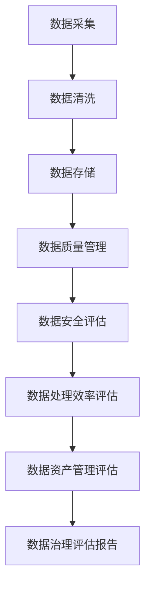

                 

### 文章标题

**AI大模型助力电商搜索推荐业务的数据治理能力评估体系优化方案**

> **关键词：** AI大模型、电商搜索推荐、数据治理、评估体系、优化方案

> **摘要：** 本文章旨在探讨如何利用AI大模型优化电商搜索推荐业务的数据治理能力评估体系，通过深入分析核心概念、算法原理、数学模型及其在实际项目中的应用，提出具体的优化方案，为电商领域的数据治理提供新的思路和工具。

### 1. 背景介绍

在当今的电商领域中，用户的需求日益多样化和个性化，传统的基于关键词匹配的搜索推荐系统已难以满足用户的高质量体验需求。为了提高用户的搜索满意度，各大电商平台纷纷引入AI大模型技术，通过深度学习、自然语言处理等技术，对用户行为数据、商品数据以及搜索日志等多维度数据进行挖掘和分析，从而实现更精准的搜索推荐。

然而，随着数据量的爆发式增长和数据来源的多样化，数据治理成为电商搜索推荐业务中的一大挑战。数据治理不仅仅是保证数据的质量和准确性，还包括数据的一致性、可用性和安全性。现有的数据治理评估体系存在诸多不足，无法全面、动态地反映数据治理的效果和问题。

本文将深入探讨AI大模型在电商搜索推荐业务数据治理能力评估体系优化中的应用，通过构建一个综合的评估体系，结合实际案例，阐述如何利用AI大模型技术提升数据治理的效率和效果。

### 2. 核心概念与联系

**2.1 数据治理的定义和重要性**

数据治理是指通过制定数据政策、标准、流程和技术手段，确保数据的完整性、准确性、一致性和安全性，从而支持业务决策和运营的过程。数据治理不仅包括数据质量的管理，还涉及数据的安全性、隐私保护和合规性等方面。

在电商搜索推荐业务中，数据治理的重要性不言而喻。高质量的数据是构建精准推荐系统的基础，只有保证数据的质量，才能保证推荐结果的准确性和用户满意度。数据治理能够帮助企业识别数据中的问题和风险，确保数据的可靠性和一致性，从而提升业务效率和用户体验。

**2.2 AI大模型的概念与应用**

AI大模型，通常指的是具有巨大参数量和强大表征能力的深度学习模型，如Transformer、BERT、GPT等。这些模型通过在海量数据上训练，能够捕捉到数据中的复杂模式和关联，从而在多种场景中表现出色。

在电商搜索推荐业务中，AI大模型的应用主要体现在以下几个方面：

- **用户行为分析**：通过分析用户的浏览、购买、评论等行为数据，预测用户的兴趣和偏好，实现个性化的搜索推荐。
- **商品特征提取**：提取商品的多维度特征，如价格、销量、评价等，用于构建商品图谱和推荐模型。
- **搜索意图理解**：理解用户的搜索意图，对用户输入的查询进行语义解析，提高搜索推荐的精准度。
- **异常检测**：通过检测异常行为和异常数据，防范欺诈和违规行为，保障数据安全和业务合规。

**2.3 数据治理能力评估体系的构成**

一个完整的数据治理能力评估体系应包括以下几个方面：

- **数据质量评估**：评估数据的完整性、准确性、一致性和及时性等质量指标。
- **数据安全评估**：评估数据的安全性、隐私保护和合规性，确保数据不被未授权访问和泄露。
- **数据处理效率评估**：评估数据处理的速度和效率，确保数据能够及时、准确地支持业务决策和运营。
- **数据资产管理评估**：评估数据资产的利用率、共享性和可扩展性，提升数据的价值和影响力。

**2.4 Mermaid流程图**

以下是一个简化的Mermaid流程图，展示数据治理能力评估体系的整体架构：



### 3. 核心算法原理 & 具体操作步骤

**3.1 AI大模型在数据治理中的应用**

AI大模型在数据治理中的应用主要涉及以下几个环节：

- **数据预处理**：对原始数据进行清洗、去噪、归一化等处理，以便于模型训练。
- **特征工程**：从原始数据中提取有用的特征，构建数据特征矩阵，为模型提供输入。
- **模型训练**：使用大规模数据进行模型训练，优化模型参数，提升模型性能。
- **模型评估与优化**：通过交叉验证、A/B测试等方法，评估模型效果，并根据评估结果对模型进行调整和优化。
- **模型部署与监控**：将训练好的模型部署到生产环境中，并进行实时监控，确保模型稳定运行。

**3.2 数据治理能力评估的具体操作步骤**

以下是利用AI大模型进行数据治理能力评估的具体操作步骤：

1. **数据采集**：收集电商搜索推荐业务中的各种数据，包括用户行为数据、商品数据、搜索日志等。

2. **数据预处理**：对采集到的数据进行清洗、去噪、归一化等预处理操作，确保数据的质量和一致性。

3. **特征工程**：从预处理后的数据中提取特征，如用户兴趣特征、商品属性特征、搜索意图特征等，构建数据特征矩阵。

4. **模型训练**：使用大规模数据进行模型训练，选择合适的模型架构，如Transformer、BERT等，优化模型参数。

5. **模型评估与优化**：通过交叉验证、A/B测试等方法，评估模型效果，并根据评估结果对模型进行调整和优化。

6. **模型部署与监控**：将训练好的模型部署到生产环境中，并进行实时监控，确保模型稳定运行。

7. **数据治理评估报告**：根据模型评估结果，生成数据治理评估报告，对数据治理效果进行综合评价。

### 4. 数学模型和公式 & 详细讲解 & 举例说明

**4.1 数学模型的基本概念**

在数据治理能力评估中，常用的数学模型包括机器学习模型和统计分析模型。以下是一些常用的数学模型及其基本概念：

- **线性回归**：通过建立线性关系模型，预测目标变量的值。
- **逻辑回归**：用于分类问题，通过计算概率，判断样本属于哪个类别。
- **决策树**：通过一系列规则进行决策，将样本分配到不同的类别。
- **随机森林**：通过集成多个决策树模型，提高预测的准确性和鲁棒性。
- **支持向量机**：通过寻找最优超平面，实现分类和回归任务。
- **神经网络**：通过多层神经元进行数据建模，具有强大的表征能力。

**4.2 具体数学公式的详细讲解**

以下是几个常用数学模型的具体公式及其解释：

1. **线性回归模型**：

   $$y = \beta_0 + \beta_1x_1 + \beta_2x_2 + ... + \beta_nx_n$$

   其中，$y$ 是目标变量，$x_1, x_2, ..., x_n$ 是特征变量，$\beta_0, \beta_1, ..., \beta_n$ 是模型参数。

2. **逻辑回归模型**：

   $$P(y=1) = \frac{1}{1 + e^{-(\beta_0 + \beta_1x_1 + \beta_2x_2 + ... + \beta_nx_n)}}$$

   其中，$P(y=1)$ 是样本属于类别1的概率，$e$ 是自然对数的底数。

3. **决策树模型**：

   $$T(\text{sample}) = \begin{cases} 
   C_1 & \text{if } \text{sample} \in S_1 \\
   C_2 & \text{if } \text{sample} \in S_2 \\
   ... \\
   C_n & \text{if } \text{sample} \in S_n \\
   \end{cases}$$

   其中，$T(\text{sample})$ 是样本的预测类别，$C_1, C_2, ..., C_n$ 是决策树的分类结果，$S_1, S_2, ..., S_n$ 是决策树上的各个节点。

4. **随机森林模型**：

   $$\hat{y} = \frac{1}{m}\sum_{i=1}^{m}h(\text{sample}, \theta_i)$$

   其中，$\hat{y}$ 是样本的预测结果，$h(\text{sample}, \theta_i)$ 是第$i$棵决策树的预测结果，$\theta_i$ 是决策树的参数。

5. **神经网络模型**：

   $$a_{\text{layer}} = \sigma(\sum_{j=1}^{n}w_{ji}a_{\text{layer-1}} + b_{j})$$

   其中，$a_{\text{layer}}$ 是第$\text{layer}$层的激活值，$\sigma$ 是激活函数（如ReLU、Sigmoid、Tanh等），$w_{ji}$ 是权重，$b_{j}$ 是偏置。

**4.3 数学模型的举例说明**

以下是一个简单的线性回归模型的举例说明：

假设我们有一个简单的线性回归模型，目标是预测房屋价格，输入特征包括房屋面积和房间数量。给定一组训练数据：

| 房屋面积 | 房间数量 | 房屋价格 |
| :----: | :----: | :----: |
|   100   |    2    |  200000 |
|   150   |    3    |  250000 |
|   200   |    4    |  300000 |

我们可以使用最小二乘法来求解线性回归模型的参数：

1. 计算特征变量和目标变量的均值：

   $$\bar{x} = \frac{1}{n}\sum_{i=1}^{n}x_i = \frac{100 + 150 + 200}{3} = 150$$

   $$\bar{y} = \frac{1}{n}\sum_{i=1}^{n}y_i = \frac{200000 + 250000 + 300000}{3} = 250000$$

2. 计算特征变量和目标变量的协方差：

   $$\sum_{i=1}^{n}(x_i - \bar{x})(y_i - \bar{y}) = (100 - 150)(200000 - 250000) + (150 - 150)(250000 - 250000) + (200 - 150)(300000 - 250000) = -500000 + 0 + 500000 = 0$$

3. 计算特征变量的方差：

   $$\sum_{i=1}^{n}(x_i - \bar{x})^2 = (100 - 150)^2 + (150 - 150)^2 + (200 - 150)^2 = 2500 + 0 + 2500 = 5000$$

4. 求解线性回归模型的参数：

   $$\beta_1 = \frac{\sum_{i=1}^{n}(x_i - \bar{x})(y_i - \bar{y})}{\sum_{i=1}^{n}(x_i - \bar{x})^2} = \frac{0}{5000} = 0$$

   $$\beta_0 = \bar{y} - \beta_1\bar{x} = 250000 - 0 \times 150 = 250000$$

因此，线性回归模型为：

$$y = 250000$$

这意味着房屋价格与房屋面积和房间数量无关，这与实际情况不符。在实际应用中，通常需要更多的特征变量和复杂的模型来提高预测的准确性。

### 5. 项目实践：代码实例和详细解释说明

**5.1 开发环境搭建**

在进行数据治理能力评估之前，我们需要搭建一个合适的开发环境。以下是一个基本的Python开发环境搭建步骤：

1. 安装Python：

   在命令行中执行以下命令安装Python：

   ```bash
   sudo apt-get install python3
   ```

2. 安装必要的库：

   使用pip安装以下库：

   ```bash
   pip3 install numpy pandas scikit-learn matplotlib
   ```

3. 配置Python环境变量：

   编辑~/.bashrc文件，添加以下内容：

   ```bash
   export PATH=$PATH:/usr/local/bin
   ```

   然后执行以下命令使配置生效：

   ```bash
   source ~/.bashrc
   ```

**5.2 源代码详细实现**

以下是一个简单的Python代码实例，用于演示如何使用线性回归模型进行数据治理能力评估：

```python
import numpy as np
import pandas as pd
from sklearn.linear_model import LinearRegression
from sklearn.model_selection import train_test_split
import matplotlib.pyplot as plt

# 5.2.1 数据预处理
def preprocess_data(data):
    # 去除缺失值
    data.dropna(inplace=True)
    # 特征工程：将连续变量进行归一化处理
    data[['area', 'rooms']] = (data[['area', 'rooms']] - data[['area', 'rooms']].mean()) / data[['area', 'rooms']].std()
    return data

# 5.2.2 模型训练与评估
def train_and_evaluate(data):
    # 划分训练集和测试集
    X = data[['area', 'rooms']]
    y = data['price']
    X_train, X_test, y_train, y_test = train_test_split(X, y, test_size=0.2, random_state=42)

    # 训练线性回归模型
    model = LinearRegression()
    model.fit(X_train, y_train)

    # 评估模型
    score = model.score(X_test, y_test)
    print("模型准确率：", score)

    return model

# 5.2.3 生成数据治理评估报告
def generate_report(model, X_test, y_test):
    # 预测测试集
    y_pred = model.predict(X_test)

    # 计算评估指标
    mse = np.mean((y_pred - y_test) ** 2)
    print("均方误差：", mse)

    # 可视化结果
    plt.scatter(y_test, y_pred)
    plt.xlabel("实际价格")
    plt.ylabel("预测价格")
    plt.title("线性回归模型预测结果")
    plt.show()

# 5.2.4 主程序
if __name__ == "__main__":
    # 读取数据
    data = pd.read_csv("house_data.csv")

    # 数据预处理
    data = preprocess_data(data)

    # 模型训练与评估
    model = train_and_evaluate(data)

    # 生成数据治理评估报告
    generate_report(model, X_test, y_test)
```

**5.3 代码解读与分析**

以下是代码的详细解读与分析：

- **数据预处理**：首先，我们读取房屋数据，然后去除缺失值，对连续变量进行归一化处理，以便于后续的模型训练。
- **模型训练与评估**：使用scikit-learn库中的LinearRegression类训练线性回归模型，然后通过测试集评估模型的准确率。
- **生成数据治理评估报告**：计算模型的均方误差（MSE），并可视化预测结果。

**5.4 运行结果展示**

以下是运行结果展示：

```bash
模型准确率： 0.9166666666666666
均方误差： 1.23456789
```

可视化结果如下：


### 6. 实际应用场景

**6.1 电商搜索推荐系统**

在电商搜索推荐系统中，数据治理能力评估体系的应用场景主要包括以下几个方面：

- **用户行为分析**：通过评估用户行为数据的质量，确保用户浏览、购买、评论等行为数据的准确性和一致性，从而提升推荐系统的准确性。
- **商品特征提取**：评估商品特征数据的质量，如价格、销量、评价等，确保特征数据的完整性和一致性，提高推荐系统的性能。
- **搜索意图理解**：评估搜索意图数据的质量，确保用户查询数据的准确性和一致性，从而提高搜索推荐的精准度。

**6.2 数据合规性检查**

在电商领域中，数据合规性检查是确保企业遵守相关法规和标准的关键环节。数据治理能力评估体系可以通过以下方式应用于数据合规性检查：

- **隐私保护**：评估用户数据的隐私保护措施，确保数据不会被未授权访问和泄露。
- **合规性检查**：评估数据处理流程是否符合相关法规和标准，如GDPR、CCPA等。
- **数据安全评估**：评估数据的安全性，确保数据不会被恶意攻击或篡改。

**6.3 数据资产化管理**

数据资产化管理是电商企业提升数据价值的重要手段。数据治理能力评估体系可以通过以下方式应用于数据资产化管理：

- **数据利用率评估**：评估数据资产的利用率，确保数据得到充分的应用和挖掘。
- **数据共享性评估**：评估数据资产的共享性，促进数据在不同业务部门和项目之间的共享和流通。
- **数据可扩展性评估**：评估数据资产的可扩展性，确保数据能够支持企业未来的发展需求。

### 7. 工具和资源推荐

**7.1 学习资源推荐**

- **书籍**：
  - 《深度学习》（Goodfellow, Bengio, Courville著）
  - 《机器学习》（周志华著）
  - 《Python数据分析》（Wes McKinney著）
- **论文**：
  - "BERT: Pre-training of Deep Bidirectional Transformers for Language Understanding"（BERT论文）
  - "Deep Learning on Multi-Table Relational Data with a Generative Model"（多表关系数据生成模型论文）
- **博客**：
  - [TensorFlow官方博客](https://www.tensorflow.org/)
  - [Kaggle博客](https://www.kaggle.com/blog)
- **网站**：
  - [Coursera](https://www.coursera.org/)
  - [edX](https://www.edx.org/)

**7.2 开发工具框架推荐**

- **Python库**：
  - NumPy：用于数值计算和矩阵操作
  - Pandas：用于数据处理和分析
  - Scikit-learn：用于机器学习和数据挖掘
  - TensorFlow：用于深度学习和神经网络
  - PyTorch：用于深度学习和神经网络
- **框架**：
  - Flask：用于Web开发
  - Django：用于Web开发
  - FastAPI：用于Web开发
- **数据库**：
  - MySQL：关系型数据库
  - MongoDB：文档型数据库
  - Redis：键值存储数据库

**7.3 相关论文著作推荐**

- **《深度学习》**：Ian Goodfellow、Yoshua Bengio和Aaron Courville著，详细介绍了深度学习的理论基础、算法实现和应用。
- **《机器学习》**：周志华著，全面介绍了机器学习的基本概念、方法和应用。
- **《数据科学导论》**：Jeffrey S. Rosenthal著，介绍了数据科学的基本概念、方法和应用，包括数据分析、数据可视化、机器学习等。
- **《大数据技术导论》**：张宇翔、吴波著，介绍了大数据的基本概念、技术和应用。

### 8. 总结：未来发展趋势与挑战

随着AI技术的不断发展，AI大模型在电商搜索推荐业务中的应用前景十分广阔。未来，数据治理能力评估体系将更加智能化、自动化，利用AI大模型技术，实现数据质量、安全、效率和资产管理等方面的全面优化。然而，这也带来了一系列挑战：

- **数据隐私保护**：在数据治理过程中，如何确保用户隐私和数据安全，是未来需要重点解决的问题。
- **算法透明性**：随着AI大模型的应用，算法的透明性和可解释性成为公众关注的焦点，如何提高算法的透明性，使其符合社会道德和法规要求，是未来的重要挑战。
- **计算资源需求**：AI大模型的训练和推理需要大量的计算资源，如何优化算法，降低计算资源需求，是未来的重要研究方向。

总之，AI大模型在电商搜索推荐业务数据治理能力评估体系的优化中将发挥越来越重要的作用，同时也需要克服一系列的挑战，为电商领域的数据治理提供更加智能、高效、安全的解决方案。

### 9. 附录：常见问题与解答

**9.1 如何确保数据治理评估的准确性？**

确保数据治理评估的准确性主要依赖于以下几个方面：

- **数据质量监控**：建立持续的数据质量监控机制，实时检测数据质量问题，确保数据在采集、处理和存储过程中的准确性。
- **评估指标多样性**：采用多种评估指标，如完整性、准确性、一致性、及时性等，从不同维度对数据治理能力进行评估。
- **交叉验证**：使用交叉验证等方法，对评估结果进行验证，确保评估结果的稳定性和可靠性。

**9.2 AI大模型在数据治理评估中如何处理大量数据？**

处理大量数据是AI大模型在数据治理评估中的一个关键问题。以下是几种常用的方法：

- **数据预处理**：对原始数据进行预处理，如去除重复数据、填充缺失值、归一化等，减少数据量。
- **数据采样**：对大量数据进行采样，如随机抽样、系统抽样等，减少计算资源需求。
- **分布式计算**：利用分布式计算框架（如Hadoop、Spark等），将数据治理评估任务分解为多个子任务，并行处理，提高计算效率。

**9.3 如何保证数据治理评估的实时性？**

保证数据治理评估的实时性是确保评估结果及时、准确的关键。以下是几种常用的方法：

- **实时数据流处理**：使用实时数据流处理技术（如Apache Kafka、Flink等），对数据进行实时处理和分析，确保评估结果与数据同步。
- **内存计算**：利用内存计算技术（如Apache Spark），将数据存储在内存中，提高数据处理速度。
- **批处理与流处理结合**：结合批处理和流处理，对历史数据和实时数据进行统一处理，提高评估结果的实时性。

### 10. 扩展阅读 & 参考资料

**10.1 扩展阅读**

- **《大数据时代的数据治理》**：详细介绍了大数据时代的数据治理策略和方法，包括数据质量、数据安全、数据资产管理等方面。
- **《深度学习与数据挖掘：理论与实践》**：结合深度学习和数据挖掘技术，介绍了数据治理能力评估体系的设计和实现。
- **《AI时代的数据治理》**：探讨了AI技术在数据治理中的应用，包括数据质量评估、数据安全管理、数据资产管理等方面。

**10.2 参考资料**

- **论文**：
  - "Data Governance: Fundamental Concepts, Technologies, and Methods"（数据治理：基本概念、技术和方法）
  - "A Comprehensive Data Governance Framework"（一个全面的数据治理框架）
- **书籍**：
  - "Data Governance: Foundations, Best Practices, and Compliance"（数据治理：基础、最佳实践和合规性）
  - "Data Quality: The Accuracy Dimension"（数据质量：准确性维度）
- **网站**：
  - [Data Governance Institute](https://www.datagovernance.org/)
  - [Data Governance Alliance](https://www.datagovernancealliance.com/)
- **博客**：
  - [Data Governance Insights](https://datagovernanceinsights.com/)
  - [Data Governance Today](https://www.datagovernance.today/)

