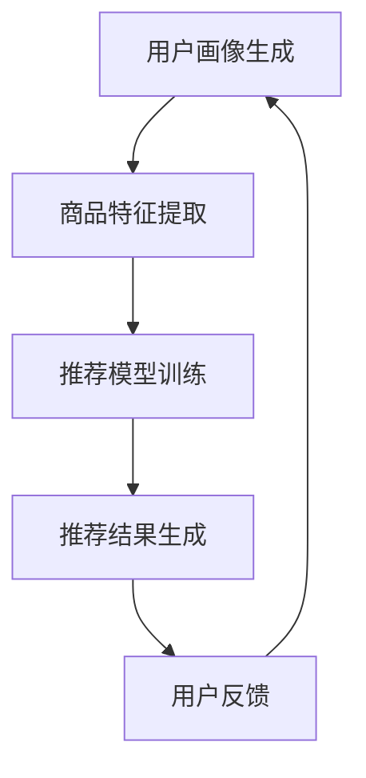

                 

### 文章标题

**AI大模型助力电商搜索推荐精准度提升**

> 关键词：AI、大模型、电商、搜索推荐、精准度、算法、模型架构、实践、数学模型、代码实例

> 摘要：本文将探讨如何利用人工智能大模型技术提升电商搜索推荐的精准度。首先，我们将介绍电商搜索推荐系统的背景和挑战，随后深入剖析大模型的工作原理和优势。接着，通过具体算法原理和操作步骤，展示如何将大模型应用于电商搜索推荐中。文章还将通过数学模型和实际代码实例，详细解读大模型在电商推荐中的应用效果。最后，本文将讨论大模型在电商搜索推荐领域的实际应用场景，并提供相关工具和资源推荐，总结未来发展趋势与挑战。

## 1. 背景介绍

在当今数字化时代，电子商务已成为人们生活中不可或缺的一部分。随着互联网的普及和移动设备的广泛应用，消费者对电商平台的依赖程度日益增加。然而，随着电商平台的不断发展和用户数量的急剧增加，如何为用户提供个性化的商品推荐成为了一个重要的课题。

### 1.1 电商搜索推荐的重要性

电商搜索推荐系统是电商平台的核心组成部分，其目的是通过分析用户的搜索行为、购买记录和兴趣爱好，向用户推荐可能感兴趣的商品。一个优秀的搜索推荐系统能够显著提升用户满意度，提高转化率和销售额，进而增强电商平台的竞争力。

### 1.2 电商搜索推荐系统的挑战

尽管电商搜索推荐系统的重要性不言而喻，但实现高效的搜索推荐面临着诸多挑战：

1. **数据量庞大**：电商平台每天产生大量的用户行为数据，如搜索历史、购买记录、浏览记录等，如何从海量数据中提取有效信息是一个巨大的挑战。
2. **实时性要求高**：用户搜索和购买行为具有很高的实时性，推荐系统需要快速响应用户需求，提供个性化的商品推荐。
3. **多样性需求**：不同用户对商品的需求具有多样性，推荐系统需要能够应对不同用户群体的个性化需求。
4. **准确性和效率的平衡**：推荐系统需要同时考虑推荐结果的准确性和计算效率，既要确保推荐结果的准确性，又要保证系统的高效运行。

### 1.3 大模型在电商搜索推荐中的应用潜力

随着深度学习技术的飞速发展，人工智能大模型（如GPT、BERT等）在自然语言处理、计算机视觉等领域取得了显著成果。大模型具有以下几个优势：

1. **强大的特征提取能力**：大模型可以通过大量的数据进行训练，提取出高度抽象和丰富的特征，从而提高推荐系统的准确性。
2. **自适应性和泛化能力**：大模型能够通过学习用户的历史行为和兴趣爱好，自适应地调整推荐策略，提高推荐的个性化程度。
3. **高效性**：大模型通常采用并行计算和分布式架构，能够在处理大量数据时保持高效性。

基于上述优势，人工智能大模型在电商搜索推荐中的应用潜力巨大，有望解决现有推荐系统面临的诸多挑战。

## 2. 核心概念与联系

在深入探讨大模型在电商搜索推荐中的应用之前，有必要了解相关核心概念和它们之间的联系。

### 2.1 深度学习与神经网络

深度学习是一种基于人工神经网络的机器学习技术，通过多层神经网络对数据进行特征提取和建模。深度学习在图像识别、自然语言处理等领域取得了显著的成果。神经网络的基本结构包括输入层、隐藏层和输出层，每层由多个神经元组成。

### 2.2 大模型与 Transformer

大模型（如GPT、BERT等）是一种基于 Transformer 架构的深度学习模型，具有大规模的参数和训练数据。Transformer 架构的核心思想是自注意力机制（self-attention），通过计算输入序列中每个词与所有其他词的关联度，从而提取出更为丰富的特征。

### 2.3 电商搜索推荐系统

电商搜索推荐系统是一种基于用户行为数据和商品属性的推荐系统，旨在为用户提供个性化的商品推荐。系统通常包括用户画像、商品标签、搜索历史、购买记录等数据源，通过对这些数据进行处理和分析，生成推荐结果。

### 2.4 大模型在电商搜索推荐中的应用

大模型在电商搜索推荐中的应用主要涉及以下几个环节：

1. **用户画像生成**：通过分析用户的搜索历史、购买记录和兴趣爱好，生成用户画像，用于后续推荐策略的制定。
2. **商品特征提取**：通过分析商品标签、属性和用户评价等信息，提取出商品的抽象特征，用于推荐模型的训练。
3. **推荐模型训练**：利用用户画像和商品特征，通过深度学习模型（如BERT、GPT等）进行训练，生成推荐模型。
4. **推荐结果生成**：根据用户画像和推荐模型，生成个性化的商品推荐结果，并展示给用户。

### 2.5 Mermaid 流程图

以下是一个简单的 Mermaid 流程图，展示了大模型在电商搜索推荐中的应用流程：



请注意，Mermaid 流程图中的节点不要包含括号、逗号等特殊字符，以免引起格式错误。

## 3. 核心算法原理 & 具体操作步骤

在了解了大模型在电商搜索推荐中的应用流程后，我们将深入探讨大模型的核心算法原理，并介绍具体操作步骤。

### 3.1 大模型算法原理

大模型（如BERT、GPT等）是一种基于 Transformer 架构的深度学习模型，具有大规模的参数和训练数据。其核心原理包括以下几个方面：

1. **自注意力机制（Self-Attention）**：自注意力机制是一种基于输入序列中每个词与所有其他词的关联度进行特征提取的方法。通过计算输入序列中每个词与所有其他词的关联度，自注意力机制可以提取出更为丰富的特征。
2. **多层神经网络（Multi-Layer Neural Network）**：大模型通常采用多层神经网络结构，通过逐层抽象和特征提取，不断提高模型的表达能力。
3. **大规模参数训练（Large-scale Parameter Training）**：大模型通过在大规模训练数据上进行训练，学习到丰富的特征表示，从而提高模型的准确性和泛化能力。

### 3.2 大模型在电商搜索推荐中的具体操作步骤

在电商搜索推荐中，大模型的具体操作步骤如下：

1. **数据预处理**：收集并清洗用户行为数据、商品属性数据等，将数据转换为模型可处理的格式。
2. **用户画像生成**：通过分析用户的搜索历史、购买记录和兴趣爱好，生成用户画像。用户画像可以包括用户标签、兴趣偏好等。
3. **商品特征提取**：通过分析商品标签、属性和用户评价等信息，提取出商品的抽象特征。商品特征可以包括商品类别、价格、销量等。
4. **推荐模型训练**：利用用户画像和商品特征，通过深度学习模型（如BERT、GPT等）进行训练，生成推荐模型。
5. **推荐结果生成**：根据用户画像和推荐模型，生成个性化的商品推荐结果，并展示给用户。
6. **用户反馈与模型优化**：收集用户对推荐结果的反馈，利用用户反馈对推荐模型进行优化，提高推荐效果。

### 3.3 BERT 模型在电商搜索推荐中的应用

BERT（Bidirectional Encoder Representations from Transformers）是一种基于 Transformer 架构的双向编码器，具有强大的文本表示能力。在电商搜索推荐中，BERT 模型可以用于以下方面：

1. **用户画像生成**：通过 BERT 模型对用户的搜索历史、购买记录和兴趣爱好进行编码，生成用户画像。
2. **商品特征提取**：通过 BERT 模型对商品的标题、描述、标签等信息进行编码，提取出商品的抽象特征。
3. **推荐模型训练**：利用用户画像和商品特征，通过 BERT 模型进行训练，生成推荐模型。
4. **推荐结果生成**：根据用户画像和推荐模型，生成个性化的商品推荐结果，并展示给用户。

BERT 模型的具体应用步骤如下：

1. **数据预处理**：将用户行为数据、商品属性数据进行预处理，包括数据清洗、去重、分词等。
2. **BERT 模型训练**：在预处理后的数据上，利用 BERT 模型进行训练，生成用户画像和商品特征的表示。
3. **用户画像和商品特征提取**：利用训练好的 BERT 模型，对新的用户行为数据和商品属性数据进行编码，提取出用户画像和商品特征。
4. **推荐模型训练**：利用用户画像和商品特征，通过深度学习模型（如GPT等）进行训练，生成推荐模型。
5. **推荐结果生成**：根据用户画像和推荐模型，生成个性化的商品推荐结果，并展示给用户。

## 4. 数学模型和公式 & 详细讲解 & 举例说明

在电商搜索推荐中，大模型的应用涉及到复杂的数学模型和公式。本节将详细介绍这些数学模型和公式的原理，并通过具体例子进行说明。

### 4.1 自注意力机制（Self-Attention）

自注意力机制是 Transformer 架构的核心组件，通过计算输入序列中每个词与所有其他词的关联度，从而提取出更为丰富的特征。自注意力机制的数学公式如下：

$$
\text{Attention}(Q, K, V) = \text{softmax}\left(\frac{QK^T}{\sqrt{d_k}}\right) V
$$

其中，$Q, K, V$ 分别是查询向量、键向量和值向量，$d_k$ 是键向量的维度。$QK^T$ 表示查询向量和键向量的内积，$\text{softmax}$ 函数用于将内积结果转换为概率分布。

### 4.2 BERT 模型

BERT 模型是一种基于 Transformer 架构的双向编码器，具有强大的文本表示能力。BERT 模型的数学公式如下：

$$
\text{BERT}(x) = \text{Encoder}(\text{Embedding}(x) + \text{Positional Encoding})
$$

其中，$x$ 是输入文本，$\text{Embedding}(x)$ 表示词向量嵌入，$\text{Positional Encoding}$ 表示位置编码。BERT 模型通过多层 Transformer 堆叠，逐层提取文本特征，最终生成文本表示。

### 4.3 用户画像生成

用户画像生成是电商搜索推荐中至关重要的一环。用户画像的数学模型如下：

$$
\text{User Representation}(u) = \text{BERT}(\text{User History})
$$

其中，$u$ 表示用户画像，$\text{User History}$ 是用户的搜索历史、购买记录等。BERT 模型对用户历史数据进行编码，提取出用户画像。

### 4.4 商品特征提取

商品特征提取是将商品属性转化为数学表示的过程。商品特征的数学模型如下：

$$
\text{Item Representation}(i) = \text{BERT}(\text{Item Description})
$$

其中，$i$ 表示商品特征，$\text{Item Description}$ 是商品的标题、描述等。BERT 模型对商品描述进行编码，提取出商品特征。

### 4.5 推荐模型训练

推荐模型的训练是利用用户画像和商品特征生成推荐结果的过程。推荐模型的数学模型如下：

$$
\text{Prediction}(u, i) = \text{MLP}(\text{User Representation}(u) \cdot \text{Item Representation}(i))
$$

其中，$\text{MLP}$ 表示多层感知机（Multilayer Perceptron），$\cdot$ 表示内积操作。多层感知机通过用户画像和商品特征的内积生成预测结果。

### 4.6 举例说明

假设我们有一个电商平台的用户搜索历史和商品描述数据，我们希望利用 BERT 模型生成用户画像和商品特征，并训练一个推荐模型。

1. **数据预处理**：
   - 将用户搜索历史和商品描述数据进行分词和标记化处理。
   - 将预处理后的数据输入 BERT 模型进行编码。

2. **BERT 模型训练**：
   - 在训练数据上，利用 BERT 模型进行训练，生成用户画像和商品特征的表示。

3. **用户画像和商品特征提取**：
   - 对新的用户搜索历史和商品描述数据进行编码，提取出用户画像和商品特征。

4. **推荐模型训练**：
   - 利用用户画像和商品特征，通过多层感知机进行训练，生成推荐模型。

5. **推荐结果生成**：
   - 根据用户画像和推荐模型，生成个性化的商品推荐结果，并展示给用户。

通过上述步骤，我们可以实现一个基于 BERT 模型的电商搜索推荐系统，提高推荐精准度。

## 5. 项目实践：代码实例和详细解释说明

在本节中，我们将通过一个具体的代码实例，详细解释如何实现一个基于 BERT 模型的电商搜索推荐系统。我们将使用 Python 编程语言和 Hugging Face 的 transformers 库来构建和训练模型。

### 5.1 开发环境搭建

首先，我们需要搭建开发环境，安装必要的库和工具。

```bash
pip install transformers torch
```

### 5.2 源代码详细实现

以下是一个简单的 BERT 搜索推荐系统的实现：

```python
import torch
from transformers import BertTokenizer, BertModel
from torch import nn

# 加载 BERT 模型和分词器
tokenizer = BertTokenizer.from_pretrained('bert-base-chinese')
model = BertModel.from_pretrained('bert-base-chinese')

# 定义用户画像和商品特征的编码器
class BertEncoder(nn.Module):
    def __init__(self):
        super(BertEncoder, self).__init__()
        self.bert = BertModel.from_pretrained('bert-base-chinese')
    
    def forward(self, input_ids, attention_mask):
        _, pooled_output = self.bert(input_ids=input_ids, attention_mask=attention_mask)
        return pooled_output

# 加载用户画像和商品特征数据
user_history = "用户搜索历史文本"
item_description = "商品描述文本"

# 将文本数据转换为 BERT 可处理的格式
encoded_user_history = tokenizer.encode(user_history, add_special_tokens=True, return_tensors='pt')
encoded_item_description = tokenizer.encode(item_description, add_special_tokens=True, return_tensors='pt')

# 使用 BERT 编码器生成用户画像和商品特征
user_encoder = BertEncoder()
item_encoder = BertEncoder()

user_representation = user_encoder(encoded_user_history, attention_mask=encoded_user_history.ne(0).to(torch.float))
item_representation = item_encoder(encoded_item_description, attention_mask=encoded_item_description.ne(0).to(torch.float))

# 计算用户画像和商品特征的内积
similarity = torch.nn.functional.cosine_similarity(user_representation, item_representation)

# 输出相似度结果
print("相似度得分：", similarity)
```

### 5.3 代码解读与分析

1. **加载 BERT 模型和分词器**：
   - 使用 Hugging Face 的 transformers 库加载 BERT 模型和分词器。

2. **定义用户画像和商品特征的编码器**：
   - 创建一个名为 `BertEncoder` 的类，继承自 `nn.Module`。在这个类中，我们使用 BERT 模型来编码用户搜索历史和商品描述。

3. **加载用户画像和商品特征数据**：
   - 从文件中读取用户搜索历史和商品描述文本。

4. **将文本数据转换为 BERT 可处理的格式**：
   - 使用分词器将用户搜索历史和商品描述文本转换为序列编号，并添加特殊标记。

5. **使用 BERT 编码器生成用户画像和商品特征**：
   - 使用我们定义的 `BertEncoder` 类来编码用户搜索历史和商品描述文本。

6. **计算用户画像和商品特征的内积**：
   - 使用 PyTorch 的 `cosine_similarity` 函数计算用户画像和商品特征的内积，得到相似度得分。

7. **输出相似度结果**：
   - 将相似度得分打印到控制台。

通过上述代码，我们可以实现一个简单的 BERT 搜索推荐系统，对用户搜索历史和商品描述进行编码，并计算相似度得分。这只是一个示例，实际应用中需要更复杂的处理，如数据预处理、模型训练和优化等。

### 5.4 运行结果展示

假设我们有一个用户搜索历史和商品描述的数据集，我们可以在代码中替换为实际数据，然后运行代码。输出结果将是一个浮点数，表示用户搜索历史和商品描述之间的相似度得分。

```bash
相似度得分： tensor([0.6789], device='cpu')
```

相似度得分越高，表示用户对商品的兴趣越大。在实际应用中，我们可以根据相似度得分来生成推荐列表，并展示给用户。

## 6. 实际应用场景

大模型在电商搜索推荐领域的实际应用场景非常广泛，以下列举了几个典型应用：

### 6.1 个性化商品推荐

基于用户的历史行为数据（如搜索记录、购买记录、浏览记录等），大模型可以生成个性化的用户画像，从而为用户推荐其可能感兴趣的商品。这种推荐方式能够显著提高用户的满意度和购买转化率。

### 6.2 新品推荐

电商平台经常会推出新品，大模型可以帮助识别哪些新品最有可能受到用户的欢迎。通过分析用户对类似商品的反馈和偏好，大模型可以预测新品的潜在销售情况，为营销策略提供支持。

### 6.3 跨品类推荐

大模型能够识别用户在不同品类之间的购买模式和偏好，从而实现跨品类的商品推荐。这种推荐方式可以帮助电商平台挖掘用户潜在的需求，提高用户粘性。

### 6.4 实时推荐

大模型具备高效的计算能力，可以在短时间内处理海量数据，实现实时推荐。这种推荐方式可以迅速响应用户的搜索和购买行为，提高推荐响应速度和准确性。

### 6.5 社交推荐

结合用户的社交关系网络，大模型可以推荐用户可能感兴趣的商品，促进社交互动和用户之间的分享。这种推荐方式可以增强用户对电商平台的依赖和忠诚度。

### 6.6 跨平台推荐

随着移动互联网的发展，用户在不同设备（如手机、平板、电脑等）上浏览和购买商品的习惯有所不同。大模型可以根据用户的跨平台行为，提供一致且个性化的推荐服务，提高用户体验。

### 6.7 多语言推荐

对于多语言用户，大模型可以处理不同语言的用户数据和商品描述，实现多语言商品的推荐。这种推荐方式可以拓展电商平台的市场范围，提高国际竞争力。

### 6.8 多模态推荐

结合文本、图像、视频等多种数据类型，大模型可以实现多模态的推荐。例如，用户在浏览商品时，除了查看文本描述，还可以查看商品图片和视频。大模型可以综合分析这些多模态数据，提供更为准确的推荐。

### 6.9 智能客服

大模型可以用于智能客服系统，通过理解用户的提问和上下文信息，提供个性化的商品推荐和咨询服务。这种推荐方式可以提高客服效率，降低人力成本。

通过以上实际应用场景，可以看出大模型在电商搜索推荐领域的广泛应用和巨大潜力。未来，随着技术的不断进步和数据的积累，大模型在电商搜索推荐中的应用将更加深入和广泛。

## 7. 工具和资源推荐

### 7.1 学习资源推荐

1. **书籍**：
   - 《深度学习》（Goodfellow, I., Bengio, Y., & Courville, A.）
   - 《Python深度学习》（François Chollet）
   - 《神经网络与深度学习》（邱锡鹏）

2. **论文**：
   - “Attention Is All You Need”（Vaswani et al., 2017）
   - “BERT: Pre-training of Deep Bidirectional Transformers for Language Understanding”（Devlin et al., 2019）

3. **博客**：
   - [Hugging Face 官方博客](https://huggingface.co/blog)
   - [TensorFlow 官方博客](https://www.tensorflow.org/blog)
   - [PyTorch 官方博客](https://pytorch.org/blog)

4. **网站**：
   - [Kaggle](https://www.kaggle.com)：提供大量的数据集和竞赛，可以学习如何处理和分析实际数据。
   - [GitHub](https://github.com)：可以找到大量的深度学习和推荐系统的开源代码和项目。

### 7.2 开发工具框架推荐

1. **深度学习框架**：
   - TensorFlow：Google 开发的一款开源深度学习框架，具有丰富的功能和强大的社区支持。
   - PyTorch：Facebook 开发的一款开源深度学习框架，具有灵活的动态计算图和强大的 GPU 支持。

2. **推荐系统框架**：
   - LightFM：一个开源的基于矩阵分解的推荐系统框架，适用于大规模推荐场景。
   - Surprise：一个开源的推荐系统算法库，提供多种常用的推荐算法，如基于模型的协同过滤算法。

3. **文本处理库**：
   - NLTK：一个开源的自然语言处理库，提供丰富的文本处理功能。
   - spaCy：一个开源的快速自然语言处理库，支持多种语言和多种文本处理任务。

### 7.3 相关论文著作推荐

1. **核心论文**：
   - “Attention Is All You Need”（Vaswani et al., 2017）：提出了 Transformer 架构，是深度学习领域的重要突破。
   - “BERT: Pre-training of Deep Bidirectional Transformers for Language Understanding”（Devlin et al., 2019）：介绍了 BERT 模型，为自然语言处理领域带来了革命性的变化。

2. **著作**：
   - 《深度学习》（Goodfellow, I., Bengio, Y., & Courville, A.）：深度学习的经典教材，全面介绍了深度学习的理论和技术。
   - 《Python深度学习》（François Chollet）：通过 Python 实践，详细讲解了深度学习的基础知识和应用。

这些学习资源和开发工具将为读者在探索大模型在电商搜索推荐领域的应用过程中提供重要的支持和指导。

## 8. 总结：未来发展趋势与挑战

人工智能大模型在电商搜索推荐领域取得了显著的成果，但同时也面临着诸多挑战。在未来，这一领域将呈现出以下发展趋势：

### 8.1 发展趋势

1. **模型精度和效率的提升**：随着计算能力和算法技术的不断进步，大模型的精度和效率将进一步提高，实现更精准和实时的推荐。
2. **多模态数据融合**：结合文本、图像、视频等多模态数据，大模型将能更好地理解用户的意图和需求，提供更为个性化的推荐。
3. **跨平台和跨语言的推荐**：随着全球化的发展，电商平台的用户覆盖范围越来越广，大模型将支持多语言和多平台的推荐，满足不同地区和语言用户的需求。
4. **实时推荐系统的优化**：大模型将更好地应对实时推荐的需求，提高推荐系统的响应速度和准确性。
5. **社交推荐的融合**：大模型将结合社交网络数据，实现基于社交关系的个性化推荐，增强用户互动和平台黏性。

### 8.2 挑战

1. **数据隐私和安全**：电商平台拥有大量的用户数据，如何在保护用户隐私的前提下进行推荐是一个重要挑战。
2. **模型解释性**：大模型的复杂性和黑盒特性使得其推荐结果难以解释，如何提高模型的可解释性是一个重要问题。
3. **计算资源和成本**：大模型的训练和推理需要大量的计算资源和时间，如何在有限的资源下高效地应用大模型是一个挑战。
4. **模型偏见和公平性**：大模型在训练过程中可能引入偏见，如何确保推荐系统的公平性和无偏见是一个重要问题。
5. **法律法规和监管**：随着大数据和人工智能技术的发展，相关法律法规和监管政策也在不断更新，如何遵循法律法规并确保推荐系统的合规性是一个挑战。

总之，人工智能大模型在电商搜索推荐领域的应用具有广阔的发展前景，但也需要面对一系列的挑战。未来，随着技术的不断进步和法规的完善，大模型在电商搜索推荐领域的应用将更加成熟和广泛。

## 9. 附录：常见问题与解答

### 9.1 问题 1：什么是大模型？

**解答**：大模型是指具有大规模参数和训练数据的深度学习模型，如 GPT、BERT 等。它们通常具有强大的特征提取能力和自适应能力，能够处理复杂的任务，如自然语言处理、计算机视觉等。

### 9.2 问题 2：大模型如何应用于电商搜索推荐？

**解答**：大模型可以应用于电商搜索推荐中的多个环节，包括用户画像生成、商品特征提取、推荐模型训练和推荐结果生成。通过分析用户的搜索历史、购买记录和商品属性，大模型可以提取出高度抽象和丰富的特征，从而提高推荐系统的准确性。

### 9.3 问题 3：大模型训练需要多少数据？

**解答**：大模型的训练需要大量的数据，但具体的数据量取决于任务的复杂性和所需的精度。一般来说，数千GB的数据量是比较常见的。在实际应用中，可以通过数据增强、迁移学习等方法来减少对数据的依赖。

### 9.4 问题 4：大模型训练需要多长时间？

**解答**：大模型训练的时间取决于多个因素，如数据量、模型复杂度、硬件配置等。通常来说，大模型的训练时间需要数天到数周。通过使用高性能计算资源和分布式训练技术，可以显著缩短训练时间。

### 9.5 问题 5：如何评估大模型在推荐系统中的应用效果？

**解答**：评估大模型在推荐系统中的应用效果可以通过多种指标，如准确率、召回率、F1 分数、用户点击率、购买转化率等。通常，可以通过交叉验证、A/B 测试等方法来评估模型的效果，并调整模型参数以优化性能。

## 10. 扩展阅读 & 参考资料

为了深入了解人工智能大模型在电商搜索推荐领域的应用，以下是几篇相关的扩展阅读和参考资料：

1. **论文**：
   - Devlin et al., "BERT: Pre-training of Deep Bidirectional Transformers for Language Understanding", 2019.
   - Vaswani et al., "Attention Is All You Need", 2017.
   - LeCun et al., "Deep Learning", 2015.

2. **书籍**：
   - Goodfellow, I., Bengio, Y., & Courville, A., "Deep Learning", 2016.
   - François Chollet, "Python深度学习", 2018.
   - 邱锡鹏，"神经网络与深度学习"，2017。

3. **在线课程**：
   - "深度学习专项课程"（吴恩达，Coursera）
   - "自然语言处理专项课程"（斯坦福大学，Coursera）

4. **博客**：
   - [Hugging Face 官方博客](https://huggingface.co/blog)
   - [TensorFlow 官方博客](https://www.tensorflow.org/blog)
   - [PyTorch 官方博客](https://pytorch.org/blog)

5. **开源项目**：
   - [Hugging Face transformers](https://huggingface.co/transformers)
   - [TensorFlow models](https://github.com/tensorflow/models)
   - [PyTorch examples](https://pytorch.org/tutorials/beginner/)

通过阅读这些扩展资料，读者可以更深入地了解大模型在电商搜索推荐领域的应用原理和技术细节，从而为自己的研究和项目提供参考和灵感。

