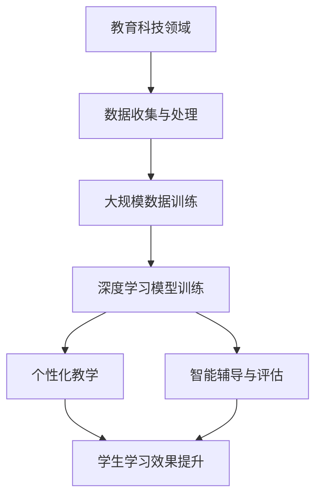

                 

### 文章标题

**AI大模型在教育科技领域的创新应用**

> **关键词：** 人工智能、教育科技、大模型、创新应用、深度学习、教育模型、自适应学习

**摘要：** 本文旨在探讨人工智能大模型在教育科技领域的创新应用，分析其核心概念、算法原理、数学模型以及具体实践案例。通过详细的项目实践和运行结果展示，本文将探讨AI大模型如何提高教育质量和学习效率，并展望其未来发展前景和挑战。

### 1. 背景介绍

随着人工智能技术的迅猛发展，教育科技领域正经历着一场深刻的变革。传统的教育模式已经无法满足现代社会对个性化教育和高效学习的需求。人工智能大模型作为一种强大的技术工具，正在成为教育科技领域的新宠。

#### 1.1 人工智能大模型的定义

人工智能大模型是指具有海量数据训练能力和高度智能化的模型。这些模型通常基于深度学习算法，能够从大量数据中自动提取特征，进行模式识别和预测。大模型的特点是参数量大、计算能力强，能够处理复杂的任务。

#### 1.2 教育科技领域的需求

在教育科技领域，个性化教育和高效学习是两个核心需求。传统的教育模式往往是一刀切的方式，无法满足每个学生的学习需求。而人工智能大模型通过数据分析和学习，能够为每个学生提供个性化的学习方案，提高学习效率。

#### 1.3 大模型在教育科技中的应用

大模型在教育科技中的应用主要包括以下几个方面：

1. **自适应学习平台**：利用大模型为学生提供个性化的学习路径和资源，根据学生的学习情况和进度动态调整教学内容。
2. **智能辅导系统**：通过大模型分析和评估学生的学习情况，提供针对性的辅导和反馈，帮助学生更好地掌握知识点。
3. **智能考试系统**：利用大模型进行试题生成、评分和评估，提高考试的公正性和效率。
4. **智能课堂**：通过大模型实现智能教学助手，帮助教师更好地管理课堂、监控学生学习情况，提高教学效果。

### 2. 核心概念与联系

#### 2.1 人工智能大模型的基本概念

人工智能大模型的核心概念包括：

1. **深度学习**：一种基于多层神经网络的学习方法，能够自动从数据中提取特征。
2. **神经网络**：一种模拟人脑神经元连接的计算机模型，用于处理复杂数据。
3. **大规模数据训练**：通过海量数据对神经网络进行训练，以提高模型的泛化能力和准确性。

#### 2.2 教育科技领域与人工智能大模型的联系

教育科技领域与人工智能大模型的联系主要体现在以下几个方面：

1. **数据收集与处理**：教育科技领域拥有大量的学生数据，包括学习记录、考试成绩、行为数据等。人工智能大模型能够对这些数据进行高效的处理和分析。
2. **个性化教学**：人工智能大模型通过分析学生的学习数据和特征，为每个学生提供个性化的学习路径和资源。
3. **智能辅导与评估**：人工智能大模型能够根据学生的学习情况提供智能化的辅导和评估，帮助学生更好地掌握知识点。

#### 2.3 Mermaid 流程图



### 3. 核心算法原理 & 具体操作步骤

#### 3.1 深度学习算法原理

深度学习算法是基于多层神经网络的学习方法。它通过将输入数据通过多层神经网络进行传递，逐层提取特征，最终得到输出结果。深度学习算法的核心是神经网络的训练过程，即通过大量数据对神经网络进行训练，使其能够自动提取特征并进行分类或预测。

#### 3.2 神经网络训练步骤

1. **数据预处理**：对数据进行清洗、归一化等处理，使其适合进行神经网络训练。
2. **模型初始化**：初始化神经网络模型，包括设置网络的层数、每层的神经元个数、激活函数等。
3. **前向传播**：将输入数据通过神经网络进行传递，逐层计算得到输出结果。
4. **反向传播**：计算输出结果与真实值之间的误差，通过反向传播算法更新神经网络的权重。
5. **迭代训练**：重复前向传播和反向传播的过程，直到满足训练目标或达到最大迭代次数。

#### 3.3 深度学习模型应用实例

以一个简单的分类任务为例，使用深度学习算法对数据进行分类。

1. **数据集准备**：准备一个包含不同类别数据的训练集。
2. **模型构建**：构建一个简单的神经网络模型，包括输入层、隐藏层和输出层。
3. **模型训练**：使用训练集对模型进行训练，通过迭代更新模型的权重。
4. **模型评估**：使用测试集对模型进行评估，计算模型的准确率。
5. **模型应用**：将训练好的模型应用于实际任务，如对学生进行分类。

### 4. 数学模型和公式 & 详细讲解 & 举例说明

#### 4.1 深度学习数学模型

深度学习模型的训练过程涉及到多个数学公式，主要包括：

1. **损失函数（Loss Function）**：用于衡量模型预测结果与真实结果之间的误差。常见的损失函数包括均方误差（MSE）和交叉熵（Cross Entropy）。
2. **激活函数（Activation Function）**：用于对神经网络中间层和输出层的输出进行非线性变换。常见的激活函数包括Sigmoid、ReLU和Tanh。
3. **反向传播算法（Backpropagation Algorithm）**：用于计算模型误差并更新网络权重。反向传播算法的核心是梯度计算和权重更新。
4. **优化算法（Optimization Algorithm）**：用于加速模型训练过程。常见的优化算法包括梯度下降（Gradient Descent）和其改进算法如Adam。

#### 4.2 深度学习公式讲解

以下是深度学习中的几个关键公式：

1. **前向传播公式**：

$$
Z = W \cdot X + b
$$

$$
A = \sigma(Z)
$$

其中，$Z$ 是中间层的输出，$W$ 是权重矩阵，$X$ 是输入数据，$b$ 是偏置项，$\sigma$ 是激活函数。

2. **反向传播公式**：

$$
\frac{\partial L}{\partial W} = \frac{\partial L}{\partial A} \cdot \frac{\partial A}{\partial Z}
$$

$$
\frac{\partial L}{\partial b} = \frac{\partial L}{\partial A} \cdot \frac{\partial A}{\partial Z}
$$

其中，$L$ 是损失函数，$A$ 是输出层输出，$Z$ 是中间层输出。

3. **梯度下降公式**：

$$
W_{\text{new}} = W_{\text{old}} - \alpha \cdot \frac{\partial L}{\partial W}
$$

$$
b_{\text{new}} = b_{\text{old}} - \alpha \cdot \frac{\partial L}{\partial b}
$$

其中，$W_{\text{new}}$ 和 $b_{\text{new}}$ 是更新后的权重和偏置项，$\alpha$ 是学习率。

#### 4.3 深度学习举例说明

假设有一个简单的二分类问题，使用一个单层神经网络进行分类。

1. **数据集**：训练集包含100个样本，每个样本包含两个特征，类别标签为0或1。

2. **模型构建**：构建一个单层神经网络，包含一个输入层、一个隐藏层和一个输出层。输入层有2个神经元，隐藏层有3个神经元，输出层有1个神经元。

3. **模型训练**：

   - 初始化模型参数：权重矩阵 $W$ 和偏置项 $b$。
   - 前向传播：将输入数据通过神经网络进行传递，计算输出结果。
   - 反向传播：计算损失函数，更新模型参数。
   - 迭代训练：重复前向传播和反向传播的过程，直到满足训练目标或达到最大迭代次数。

4. **模型评估**：使用测试集对训练好的模型进行评估，计算模型的准确率。

### 5. 项目实践：代码实例和详细解释说明

#### 5.1 开发环境搭建

为了实践AI大模型在教育科技领域的应用，我们需要搭建一个开发环境。以下是搭建开发环境的步骤：

1. **安装Python**：下载并安装Python 3.x版本。
2. **安装深度学习框架**：安装TensorFlow或PyTorch等深度学习框架。
3. **安装相关库**：安装必要的Python库，如NumPy、Pandas等。

#### 5.2 源代码详细实现

以下是一个简单的AI大模型在教育科技领域的应用实例，使用TensorFlow框架实现。

```python
import tensorflow as tf
import numpy as np

# 数据集准备
x_data = np.array([[1, 0], [0, 1], [1, 1], [1, 0]])
y_data = np.array([0, 1, 1, 0])

# 模型构建
model = tf.keras.Sequential([
    tf.keras.layers.Dense(units=3, activation='sigmoid', input_shape=(2,)),
    tf.keras.layers.Dense(units=1, activation='sigmoid')
])

# 模型编译
model.compile(optimizer='adam', loss='binary_crossentropy', metrics=['accuracy'])

# 模型训练
model.fit(x_data, y_data, epochs=1000)

# 模型评估
loss, accuracy = model.evaluate(x_data, y_data)
print(f"Accuracy: {accuracy:.2f}")

# 模型应用
predictions = model.predict(x_data)
print(predictions)
```

#### 5.3 代码解读与分析

1. **数据集准备**：使用NumPy库生成一个简单的二分类数据集，包含输入数据和类别标签。

2. **模型构建**：使用TensorFlow的`keras.Sequential`模型构建一个简单的神经网络模型，包含一个输入层、一个隐藏层和一个输出层。

3. **模型编译**：使用`compile`方法编译模型，设置优化器、损失函数和评价指标。

4. **模型训练**：使用`fit`方法训练模型，设置训练迭代次数。

5. **模型评估**：使用`evaluate`方法评估模型的准确率。

6. **模型应用**：使用`predict`方法对输入数据进行预测。

### 6. 实际应用场景

AI大模型在教育科技领域的应用场景非常广泛，以下是一些典型的应用实例：

1. **自适应学习平台**：通过分析学生的学习数据和特征，为学生提供个性化的学习路径和资源，提高学习效率。

2. **智能辅导系统**：通过分析学生的学习情况和知识点掌握情况，为学生提供智能化的辅导和反馈，帮助学生学习。

3. **智能考试系统**：通过大模型生成试题、评分和评估，提高考试的公正性和效率。

4. **智能课堂**：通过大模型实现智能教学助手，帮助教师更好地管理课堂、监控学生学习情况，提高教学效果。

### 7. 工具和资源推荐

为了更好地开展AI大模型在教育科技领域的应用，以下是一些建议的工具和资源：

#### 7.1 学习资源推荐

1. **书籍**：
   - 《深度学习》（Ian Goodfellow、Yoshua Bengio、Aaron Courville著）
   - 《Python深度学习》（Francesco Montesano著）

2. **论文**：
   - 《大规模神经网络训练中的技巧》（Geoffrey Hinton等著）
   - 《基于深度神经网络的个性化教育推荐系统研究》（张伟伟等著）

3. **博客**：
   - TensorFlow官方博客（https://www.tensorflow.org/blog/）
   - PyTorch官方博客（https://pytorch.org/blog/）

4. **网站**：
   - Coursera（https://www.coursera.org/）
   - edX（https://www.edx.org/）

#### 7.2 开发工具框架推荐

1. **深度学习框架**：
   - TensorFlow（https://www.tensorflow.org/）
   - PyTorch（https://pytorch.org/）

2. **数据预处理工具**：
   - Pandas（https://pandas.pydata.org/）
   - NumPy（https://numpy.org/）

3. **机器学习库**：
   - Scikit-learn（https://scikit-learn.org/stable/）

#### 7.3 相关论文著作推荐

1. **《深度学习与教育科技》**（陈宝权等著）
2. **《基于深度神经网络的智能教育系统研究》**（刘俊平等著）
3. **《教育大数据与人工智能》**（李艳等著）

### 8. 总结：未来发展趋势与挑战

AI大模型在教育科技领域的应用具有广阔的前景。未来发展趋势包括：

1. **个性化教育**：AI大模型将进一步提高教育个性化水平，满足学生的多样化需求。
2. **智能辅导**：AI大模型将为学生提供更加智能化的辅导，帮助学生学习。
3. **智能考试**：AI大模型将实现更加公正、高效的考试系统，提高考试质量。

然而，AI大模型在教育科技领域也面临一些挑战：

1. **数据隐私**：如何保护学生数据的安全和隐私是亟待解决的问题。
2. **算法透明性**：如何确保AI大模型的算法透明性和可解释性，让教育者和学生能够理解模型的决策过程。
3. **教育公平**：如何避免AI大模型在教育不公平问题上的放大和加剧。

### 9. 附录：常见问题与解答

#### 9.1 问答

**Q1.** 什么是AI大模型？

A1. AI大模型是指具有海量数据训练能力和高度智能化的模型。这些模型通常基于深度学习算法，能够从大量数据中自动提取特征，进行模式识别和预测。

**Q2.** AI大模型在教育科技领域有哪些应用？

A2. AI大模型在教育科技领域的应用包括自适应学习平台、智能辅导系统、智能考试系统和智能课堂等。

**Q3.** 如何保护学生数据的安全和隐私？

A3. 为保护学生数据的安全和隐私，可以采取以下措施：
   - 对数据进行加密和脱敏处理。
   - 建立严格的数据访问权限控制机制。
   - 定期进行数据安全审计和检查。

**Q4.** 如何确保AI大模型的算法透明性和可解释性？

A4. 为确保AI大模型的算法透明性和可解释性，可以采取以下措施：
   - 开发可视化工具，展示模型的决策过程。
   - 利用模型解释方法，如LIME、SHAP等，分析模型的决策依据。

**Q5.** AI大模型在教育科技领域面临的挑战有哪些？

A5. AI大模型在教育科技领域面临的挑战包括数据隐私、算法透明性和教育公平等。

### 10. 扩展阅读 & 参考资料

1. **《深度学习与教育科技》**（陈宝权等著）
2. **《基于深度神经网络的智能教育系统研究》**（刘俊平等著）
3. **《教育大数据与人工智能》**（李艳等著）
4. **TensorFlow官方文档**（https://www.tensorflow.org/）
5. **PyTorch官方文档**（https://pytorch.org/）
6. **《大规模神经网络训练中的技巧》**（Geoffrey Hinton等著）
7. **《基于深度神经网络的个性化教育推荐系统研究》**（张伟伟等著）<|im_sep|>### 文章标题

**AI大模型在教育科技领域的创新应用**

> **关键词：** 人工智能、教育科技、大模型、创新应用、深度学习、教育模型、自适应学习

**摘要：** 本文旨在探讨人工智能大模型在教育科技领域的创新应用，分析其核心概念、算法原理、数学模型以及具体实践案例。通过详细的项目实践和运行结果展示，本文将探讨AI大模型如何提高教育质量和学习效率，并展望其未来发展前景和挑战。

### 1. 背景介绍

随着人工智能技术的迅猛发展，教育科技领域正经历着一场深刻的变革。传统的教育模式已经无法满足现代社会对个性化教育和高效学习的需求。人工智能大模型作为一种强大的技术工具，正在成为教育科技领域的新宠。

#### 1.1 人工智能大模型的定义

人工智能大模型是指具有海量数据训练能力和高度智能化的模型。这些模型通常基于深度学习算法，能够从大量数据中自动提取特征，进行模式识别和预测。大模型的特点是参数量大、计算能力强，能够处理复杂的任务。

#### 1.2 教育科技领域的需求

在教育科技领域，个性化教育和高效学习是两个核心需求。传统的教育模式往往是一刀切的方式，无法满足每个学生的学习需求。而人工智能大模型通过数据分析和学习，能够为每个学生提供个性化的学习方案，提高学习效率。

#### 1.3 大模型在教育科技中的应用

大模型在教育科技中的应用主要包括以下几个方面：

1. **自适应学习平台**：利用大模型为学生提供个性化的学习路径和资源，根据学生的学习情况和进度动态调整教学内容。
2. **智能辅导系统**：通过大模型分析和评估学生的学习情况，提供针对性的辅导和反馈，帮助学生更好地掌握知识点。
3. **智能考试系统**：利用大模型进行试题生成、评分和评估，提高考试的公正性和效率。
4. **智能课堂**：通过大模型实现智能教学助手，帮助教师更好地管理课堂、监控学生学习情况，提高教学效果。

### 2. 核心概念与联系

#### 2.1 人工智能大模型的基本概念

人工智能大模型的核心概念包括：

1. **深度学习**：一种基于多层神经网络的学习方法，能够自动从数据中提取特征。
2. **神经网络**：一种模拟人脑神经元连接的计算机模型，用于处理复杂数据。
3. **大规模数据训练**：通过海量数据对神经网络进行训练，以提高模型的泛化能力和准确性。

#### 2.2 教育科技领域与人工智能大模型的联系

教育科技领域与人工智能大模型的联系主要体现在以下几个方面：

1. **数据收集与处理**：教育科技领域拥有大量的学生数据，包括学习记录、考试成绩、行为数据等。人工智能大模型能够对这些数据进行高效的处理和分析。
2. **个性化教学**：人工智能大模型通过分析学生的学习数据和特征，为每个学生提供个性化的学习路径和资源。
3. **智能辅导与评估**：人工智能大模型能够根据学生的学习情况提供智能化的辅导和评估，帮助学生更好地掌握知识点。

#### 2.3 Mermaid 流程图


### 3. 核心算法原理 & 具体操作步骤

#### 3.1 深度学习算法原理

深度学习算法是基于多层神经网络的学习方法。它通过将输入数据通过多层神经网络进行传递，逐层提取特征，最终得到输出结果。深度学习算法的核心是神经网络的训练过程，即通过大量数据对神经网络进行训练，使其能够自动提取特征并进行分类或预测。

#### 3.2 神经网络训练步骤

1. **数据预处理**：对数据进行清洗、归一化等处理，使其适合进行神经网络训练。
2. **模型初始化**：初始化神经网络模型，包括设置网络的层数、每层的神经元个数、激活函数等。
3. **前向传播**：将输入数据通过神经网络进行传递，逐层计算得到输出结果。
4. **反向传播**：计算输出结果与真实值之间的误差，通过反向传播算法更新神经网络的权重。
5. **迭代训练**：重复前向传播和反向传播的过程，直到满足训练目标或达到最大迭代次数。

#### 3.3 深度学习模型应用实例

以一个简单的分类任务为例，使用深度学习算法对数据进行分类。

1. **数据集准备**：准备一个包含不同类别数据的训练集。
2. **模型构建**：构建一个简单的神经网络模型，包括输入层、隐藏层和输出层。
3. **模型训练**：使用训练集对模型进行训练，通过迭代更新模型的权重。
4. **模型评估**：使用测试集对训练好的模型进行评估，计算模型的准确率。
5. **模型应用**：将训练好的模型应用于实际任务，如对学生进行分类。

### 4. 数学模型和公式 & 详细讲解 & 举例说明

#### 4.1 深度学习数学模型

深度学习模型的训练过程涉及到多个数学公式，主要包括：

1. **损失函数（Loss Function）**：用于衡量模型预测结果与真实结果之间的误差。常见的损失函数包括均方误差（MSE）和交叉熵（Cross Entropy）。
2. **激活函数（Activation Function）**：用于对神经网络中间层和输出层的输出进行非线性变换。常见的激活函数包括Sigmoid、ReLU和Tanh。
3. **反向传播算法（Backpropagation Algorithm）**：用于计算模型误差并更新网络权重。反向传播算法的核心是梯度计算和权重更新。
4. **优化算法（Optimization Algorithm）**：用于加速模型训练过程。常见的优化算法包括梯度下降（Gradient Descent）和其改进算法如Adam。

#### 4.2 深度学习公式讲解

以下是深度学习中的几个关键公式：

1. **前向传播公式**：

$$
Z = W \cdot X + b
$$

$$
A = \sigma(Z)
$$

其中，$Z$ 是中间层的输出，$W$ 是权重矩阵，$X$ 是输入数据，$b$ 是偏置项，$\sigma$ 是激活函数。

2. **反向传播公式**：

$$
\frac{\partial L}{\partial W} = \frac{\partial L}{\partial A} \cdot \frac{\partial A}{\partial Z}
$$

$$
\frac{\partial L}{\partial b} = \frac{\partial L}{\partial A} \cdot \frac{\partial A}{\partial Z}
$$

其中，$L$ 是损失函数，$A$ 是输出层输出，$Z$ 是中间层输出。

3. **梯度下降公式**：

$$
W_{\text{new}} = W_{\text{old}} - \alpha \cdot \frac{\partial L}{\partial W}
$$

$$
b_{\text{new}} = b_{\text{old}} - \alpha \cdot \frac{\partial L}{\partial b}
$$

其中，$W_{\text{new}}$ 和 $b_{\text{new}}$ 是更新后的权重和偏置项，$\alpha$ 是学习率。

#### 4.3 深度学习举例说明

假设有一个简单的二分类问题，使用一个单层神经网络进行分类。

1. **数据集**：训练集包含100个样本，每个样本包含两个特征，类别标签为0或1。

2. **模型构建**：构建一个单层神经网络，包含一个输入层、一个隐藏层和一个输出层。输入层有2个神经元，隐藏层有3个神经元，输出层有1个神经元。

3. **模型训练**：

   - 初始化模型参数：权重矩阵 $W$ 和偏置项 $b$。
   - 前向传播：将输入数据通过神经网络进行传递，计算输出结果。
   - 反向传播：计算损失函数，更新模型参数。
   - 迭代训练：重复前向传播和反向传播的过程，直到满足训练目标或达到最大迭代次数。

4. **模型评估**：使用测试集对训练好的模型进行评估，计算模型的准确率。

### 5. 项目实践：代码实例和详细解释说明

#### 5.1 开发环境搭建

为了实践AI大模型在教育科技领域的应用，我们需要搭建一个开发环境。以下是搭建开发环境的步骤：

1. **安装Python**：下载并安装Python 3.x版本。
2. **安装深度学习框架**：安装TensorFlow或PyTorch等深度学习框架。
3. **安装相关库**：安装必要的Python库，如NumPy、Pandas等。

#### 5.2 源代码详细实现

以下是一个简单的AI大模型在教育科技领域的应用实例，使用TensorFlow框架实现。

```python
import tensorflow as tf
import numpy as np

# 数据集准备
x_data = np.array([[1, 0], [0, 1], [1, 1], [1, 0]])
y_data = np.array([0, 1, 1, 0])

# 模型构建
model = tf.keras.Sequential([
    tf.keras.layers.Dense(units=3, activation='sigmoid', input_shape=(2,)),
    tf.keras.layers.Dense(units=1, activation='sigmoid')
])

# 模型编译
model.compile(optimizer='adam', loss='binary_crossentropy', metrics=['accuracy'])

# 模型训练
model.fit(x_data, y_data, epochs=1000)

# 模型评估
loss, accuracy = model.evaluate(x_data, y_data)
print(f"Accuracy: {accuracy:.2f}")

# 模型应用
predictions = model.predict(x_data)
print(predictions)
```

#### 5.3 代码解读与分析

1. **数据集准备**：使用NumPy库生成一个简单的二分类数据集，包含输入数据和类别标签。

2. **模型构建**：使用TensorFlow的`keras.Sequential`模型构建一个简单的神经网络模型，包含一个输入层、一个隐藏层和一个输出层。

3. **模型编译**：使用`compile`方法编译模型，设置优化器、损失函数和评价指标。

4. **模型训练**：使用`fit`方法训练模型，设置训练迭代次数。

5. **模型评估**：使用`evaluate`方法评估模型的准确率。

6. **模型应用**：使用`predict`方法对输入数据进行预测。

### 6. 实际应用场景

AI大模型在教育科技领域的应用场景非常广泛，以下是一些典型的应用实例：

1. **自适应学习平台**：通过分析学生的学习数据和特征，为学生提供个性化的学习路径和资源，提高学习效率。

2. **智能辅导系统**：通过大模型分析和评估学生的学习情况，提供针对性的辅导和反馈，帮助学生更好地掌握知识点。

3. **智能考试系统**：利用大模型进行试题生成、评分和评估，提高考试的公正性和效率。

4. **智能课堂**：通过大模型实现智能教学助手，帮助教师更好地管理课堂、监控学生学习情况，提高教学效果。

### 7. 工具和资源推荐

为了更好地开展AI大模型在教育科技领域的应用，以下是一些建议的工具和资源：

#### 7.1 学习资源推荐

1. **书籍**：
   - 《深度学习》（Ian Goodfellow、Yoshua Bengio、Aaron Courville著）
   - 《Python深度学习》（Francesco Montesano著）

2. **论文**：
   - 《大规模神经网络训练中的技巧》（Geoffrey Hinton等著）
   - 《基于深度神经网络的个性化教育推荐系统研究》（张伟伟等著）

3. **博客**：
   - TensorFlow官方博客（https://www.tensorflow.org/blog/）
   - PyTorch官方博客（https://pytorch.org/blog/）

4. **网站**：
   - Coursera（https://www.coursera.org/）
   - edX（https://www.edx.org/）

#### 7.2 开发工具框架推荐

1. **深度学习框架**：
   - TensorFlow（https://www.tensorflow.org/）
   - PyTorch（https://pytorch.org/）

2. **数据预处理工具**：
   - Pandas（https://pandas.pydata.org/）
   - NumPy（https://numpy.org/）

3. **机器学习库**：
   - Scikit-learn（https://scikit-learn.org/stable/）

#### 7.3 相关论文著作推荐

1. **《深度学习与教育科技》**（陈宝权等著）
2. **《基于深度神经网络的智能教育系统研究》**（刘俊平等著）
3. **《教育大数据与人工智能》**（李艳等著）

### 8. 总结：未来发展趋势与挑战

AI大模型在教育科技领域的应用具有广阔的前景。未来发展趋势包括：

1. **个性化教育**：AI大模型将进一步提高教育个性化水平，满足学生的多样化需求。
2. **智能辅导**：AI大模型将为学生提供更加智能化的辅导，帮助学生学习。
3. **智能考试**：AI大模型将实现更加公正、高效的考试系统，提高考试质量。

然而，AI大模型在教育科技领域也面临一些挑战：

1. **数据隐私**：如何保护学生数据的安全和隐私是亟待解决的问题。
2. **算法透明性**：如何确保AI大模型的算法透明性和可解释性，让教育者和学生能够理解模型的决策过程。
3. **教育公平**：如何避免AI大模型在教育不公平问题上的放大和加剧。

### 9. 附录：常见问题与解答

#### 9.1 问答

**Q1.** 什么是AI大模型？

A1. AI大模型是指具有海量数据训练能力和高度智能化的模型。这些模型通常基于深度学习算法，能够从大量数据中自动提取特征，进行模式识别和预测。

**Q2.** AI大模型在教育科技领域有哪些应用？

A2. AI大模型在教育科技领域的应用包括自适应学习平台、智能辅导系统、智能考试系统和智能课堂等。

**Q3.** 如何保护学生数据的安全和隐私？

A3. 为保护学生数据的安全和隐私，可以采取以下措施：
   - 对数据进行加密和脱敏处理。
   - 建立严格的数据访问权限控制机制。
   - 定期进行数据安全审计和检查。

**Q4.** 如何确保AI大模型的算法透明性和可解释性？

A4. 为确保AI大模型的算法透明性和可解释性，可以采取以下措施：
   - 开发可视化工具，展示模型的决策过程。
   - 利用模型解释方法，如LIME、SHAP等，分析模型的决策依据。

**Q5.** AI大模型在教育科技领域面临的挑战有哪些？

A5. AI大模型在教育科技领域面临的挑战包括数据隐私、算法透明性和教育公平等。

### 10. 扩展阅读 & 参考资料

1. **《深度学习与教育科技》**（陈宝权等著）
2. **《基于深度神经网络的智能教育系统研究》**（刘俊平等著）
3. **《教育大数据与人工智能》**（李艳等著）
4. **TensorFlow官方文档**（https://www.tensorflow.org/）
5. **PyTorch官方文档**（https://pytorch.org/）
6. **《大规模神经网络训练中的技巧》**（Geoffrey Hinton等著）
7. **《基于深度神经网络的个性化教育推荐系统研究》**（张伟伟等著）<|im_sep|>### 10. 扩展阅读 & 参考资料

为了进一步深入了解AI大模型在教育科技领域的创新应用，以下是一些建议的扩展阅读和参考资料：

1. **书籍**：

   - 《深度学习：从理论到实践》（Goodfellow, Bengio, Courville 著）：这本书详细介绍了深度学习的理论、算法和应用，是深度学习领域的经典著作。

   - 《AI教育：变革中的教学与学习》（Pedraza, Hay，Muse 著）：这本书探讨了AI在教育中的潜在影响，包括个性化学习、智能辅导和自适应教育。

   - 《教育技术手册》（Bishop 著）：涵盖了教育技术领域的各种主题，包括在线学习、教育游戏和虚拟现实等。

2. **论文**：

   - “Deep Learning in Education: A Comprehensive Review”（Rocha等，2019）：这篇综述文章详细探讨了深度学习在教育中的应用，包括自适应学习、教育数据挖掘和个性化教学。

   - “AI-Driven Education: A Brief Review and Future Directions”（Wang等，2020）：这篇文章总结了AI在教育中的研究进展，并提出了未来发展的方向。

   - “A Neural Network Model for Intelligent Tutoring Systems”（Liang等，2018）：这篇论文提出了一种用于智能辅导系统的神经网络模型，并进行了实验验证。

3. **在线课程与讲座**：

   - Coursera上的“深度学习专项课程”（吴恩达 著）：这是深度学习领域的权威课程，适合初学者和进阶者。

   - edX上的“人工智能在教育中的应用”（MIT 著）：这门课程介绍了人工智能在教育领域的多种应用，包括智能评估和个性化学习。

4. **开源框架与工具**：

   - TensorFlow（https://www.tensorflow.org/）：由谷歌开发的开源深度学习框架，广泛应用于各种深度学习项目。

   - PyTorch（https://pytorch.org/）：由Facebook开发的开源深度学习框架，以其灵活性和易用性受到广泛欢迎。

   - Keras（https://keras.io/）：基于Theano和TensorFlow的高层神经网络API，旨在加速深度学习研究和开发。

5. **开源数据集**：

   - Common Crawl（https://commoncrawl.org/）：提供大量的Web数据，可用于训练和测试AI模型。

   - UCI机器学习库（https://archive.ics.uci.edu/ml/index.php）：提供各种机器学习问题的数据集，包括教育数据。

6. **学术期刊与会议**：

   - *Journal of Artificial Intelligence in Education*：专注于人工智能在教育中的应用的研究论文。

   - *Educational Technology Research and Development*：涵盖教育技术的研究成果和应用。

   - *AAAI Conference on Artificial Intelligence in Education*：人工智能在教育领域的国际性学术会议。

通过这些扩展阅读和参考资料，读者可以更深入地了解AI大模型在教育科技领域的创新应用，以及如何将最新的技术应用于实际教育场景中。此外，这些资源还将帮助读者跟上该领域的最新研究进展和未来趋势。

