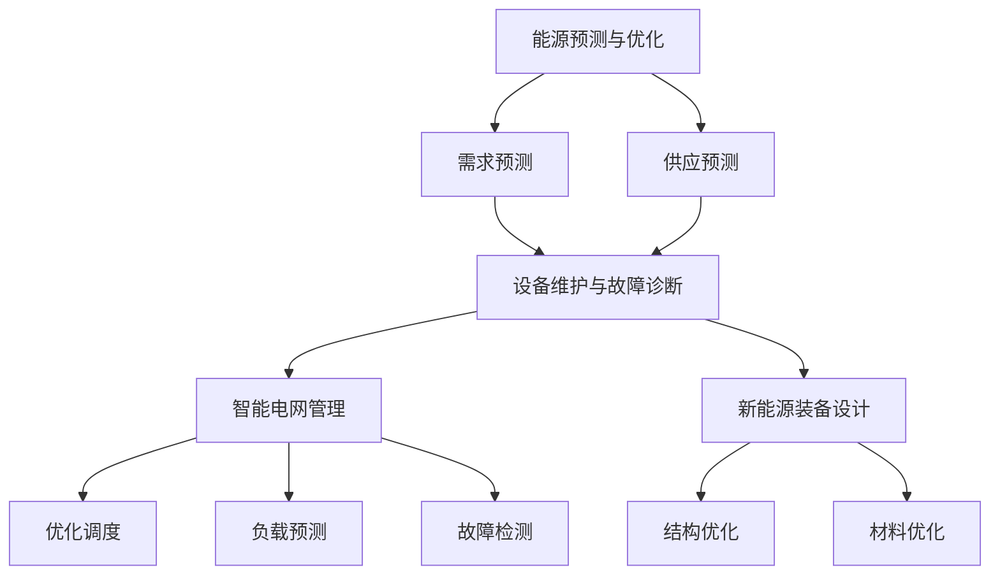

                 

### 背景介绍

随着全球对环境保护和可持续发展的关注日益增加，新能源领域成为了科技创新和商业投资的热点。在这一背景下，人工智能（AI）技术的迅速发展为新能源领域的商业化探索带来了新的机遇与挑战。AI大模型，作为一种高度复杂且功能强大的算法模型，通过深度学习和大数据分析，正逐渐成为推动新能源技术商业化的重要力量。

**新能源的重要性**：新能源，主要包括太阳能、风能、水能、生物质能等，是替代传统化石燃料、减少温室气体排放的重要选择。新能源的应用不仅有助于缓解全球能源危机，还能显著降低环境污染，促进经济和社会的可持续发展。

**AI技术的崛起**：自21世纪初以来，人工智能技术经历了飞速的发展，特别是在深度学习、神经网络等领域取得了重大突破。这些技术不仅提高了计算效率和准确性，还使AI大模型能够处理和分析海量数据，从而为新能源领域提供了强有力的支持。

**AI大模型在新能源领域的应用**：AI大模型在新能源领域的应用主要集中在以下几方面：

1. **能源预测与优化**：通过分析历史数据和实时数据，AI大模型可以预测能源需求和供应，优化能源分配，提高能源利用效率。
2. **设备维护与故障诊断**：AI大模型能够分析设备运行数据，预测设备故障，提供维护建议，降低设备停机时间和维护成本。
3. **智能电网管理**：AI大模型在智能电网中的优化调度、负载预测、故障检测等方面发挥着重要作用，提高了电网的稳定性和可靠性。
4. **新能源装备设计**：AI大模型在太阳能电池、风力涡轮机等新能源设备的设计中，通过优化结构和材料，提高了设备的性能和效率。

**本文结构**：本文将首先介绍AI大模型的基本概念和原理，然后深入探讨其在新能源领域的具体应用，最后总结其商业化前景和面临的挑战。

通过逐步分析和推理，我们将了解AI大模型如何革新新能源领域的商业模式，推动可持续发展。

### 核心概念与联系

#### AI大模型的基本概念

AI大模型，通常指的是具有数百万到数十亿参数的深度神经网络，例如Transformer、BERT等。这些模型通过大规模数据训练，能够捕捉到复杂的数据模式和关联，从而实现高度精确的预测和分类任务。

1. **深度学习**：深度学习是机器学习的一个分支，主要依赖于多层神经网络，通过逐层提取数据特征，实现对数据的理解和学习。
2. **神经网络**：神经网络由大量的神经元（节点）组成，每个神经元都与其他神经元通过权重连接，通过正向传播和反向传播算法不断调整权重，以达到优化预测结果的目的。
3. **大规模数据训练**：AI大模型需要大量的训练数据，通过不断调整模型参数，使得模型能够逐渐优化，提高预测和分类的准确性。

#### AI大模型在新能源领域的具体应用

AI大模型在新能源领域的应用主要涉及以下几个方面：

1. **能源预测与优化**：通过分析历史数据和实时数据，AI大模型可以预测能源需求和供应，优化能源分配，提高能源利用效率。具体应用包括：
   - **需求预测**：根据用户历史用电行为、季节变化等因素，预测未来的能源需求。
   - **供应预测**：预测新能源发电设备的发电量，如太阳能、风能等，以便合理调度和分配能源。

2. **设备维护与故障诊断**：AI大模型可以通过分析设备运行数据，预测设备故障，提供维护建议，降低设备停机时间和维护成本。具体应用包括：
   - **故障预测**：通过分析设备传感器数据，预测设备可能出现的故障，提前进行维护。
   - **维护优化**：根据故障预测结果，优化维护计划，减少不必要的维护，提高设备运行效率。

3. **智能电网管理**：AI大模型在智能电网中的优化调度、负载预测、故障检测等方面发挥着重要作用。具体应用包括：
   - **优化调度**：根据实时数据和预测结果，优化电网调度策略，提高电网运行效率。
   - **负载预测**：预测电网负载变化，以便提前调整供电计划，确保电网稳定运行。
   - **故障检测**：通过实时数据监控，快速检测电网故障，减少停电时间和影响。

4. **新能源装备设计**：AI大模型在太阳能电池、风力涡轮机等新能源设备的设计中，通过优化结构和材料，提高了设备的性能和效率。具体应用包括：
   - **结构优化**：通过AI算法，优化设备结构设计，提高设备强度和稳定性。
   - **材料优化**：根据设备性能要求，优化材料选择，提高设备效率和耐久性。

#### Mermaid 流程图

以下是AI大模型在新能源领域的应用流程图：



通过这个流程图，我们可以清晰地看到AI大模型在新能源领域的多层次应用，以及各个环节之间的相互联系和影响。接下来，我们将深入探讨AI大模型的核心算法原理和具体操作步骤。

### 核心算法原理 & 具体操作步骤

AI大模型在新能源领域的应用，主要依赖于其强大的数据处理和分析能力。以下是AI大模型的核心算法原理以及具体操作步骤：

#### 1. 数据预处理

在开始构建AI大模型之前，数据预处理是一个非常重要的步骤。数据预处理主要包括以下几个步骤：

1. **数据清洗**：去除数据中的噪声和不完整的数据。
2. **数据归一化**：将不同量纲的数据转换为相同量纲，以便模型训练时能够收敛。
3. **数据分割**：将数据集划分为训练集、验证集和测试集，用于模型的训练、验证和测试。

#### 2. 模型选择

根据具体的应用需求，选择合适的AI大模型。常见的AI大模型包括：

1. **深度神经网络（DNN）**：DNN由多层神经元组成，通过前向传播和反向传播算法进行训练，适用于结构化的数据。
2. **卷积神经网络（CNN）**：CNN主要用于图像处理，通过卷积操作提取图像特征，适用于图像识别任务。
3. **循环神经网络（RNN）**：RNN适用于处理序列数据，能够捕捉数据中的时间序列特征，如时间序列预测。
4. **Transformer模型**：Transformer模型是近年来发展迅速的一种模型，适用于大规模文本处理，如机器翻译、文本分类等。

#### 3. 模型训练

在确定模型后，开始进行模型训练。模型训练主要包括以下几个步骤：

1. **初始化参数**：随机初始化模型参数。
2. **前向传播**：将输入数据输入到模型中，通过模型计算得到预测结果。
3. **计算损失**：计算预测结果与真实结果之间的差异，即损失函数。
4. **反向传播**：通过反向传播算法，将损失函数反向传播到模型的各个层，更新模型参数。
5. **迭代优化**：重复上述步骤，不断迭代优化模型参数，直到模型收敛。

#### 4. 模型评估

在模型训练完成后，需要进行模型评估，以验证模型的性能。模型评估主要包括以下几个步骤：

1. **验证集评估**：使用验证集对模型进行评估，计算模型的准确率、召回率、F1分数等指标。
2. **测试集评估**：使用测试集对模型进行最终评估，以确保模型在未知数据上的表现良好。
3. **超参数调整**：根据模型评估结果，调整模型超参数，如学习率、批次大小等，以提高模型性能。

#### 5. 模型部署

在模型评估通过后，将模型部署到实际应用环境中。模型部署主要包括以下几个步骤：

1. **模型转换**：将训练好的模型转换为可以在生产环境中运行的格式，如ONNX、TensorFlow Lite等。
2. **模型推理**：将实时数据输入到模型中，进行预测。
3. **结果输出**：将模型预测结果输出到相应的应用系统，如能源管理系统、设备监控系统等。

#### 6. 模型监控与维护

在模型部署后，需要对模型进行监控和维护，以确保模型的稳定运行和性能。模型监控和维护主要包括以下几个步骤：

1. **实时监控**：实时监控模型的运行状态，如预测延迟、错误率等。
2. **异常检测**：通过监控数据，检测模型是否存在异常情况，如过拟合、欠拟合等。
3. **模型更新**：根据监控数据和用户反馈，定期更新模型，提高模型性能。

通过上述核心算法原理和具体操作步骤，我们可以看到AI大模型在新能源领域的强大应用能力。接下来，我们将进一步探讨AI大模型在新能源领域应用的数学模型和公式。

### 数学模型和公式 & 详细讲解 & 举例说明

AI大模型在新能源领域的应用，依赖于复杂的数学模型和公式，这些模型和公式不仅能够提高预测的准确性，还能优化能源管理和设备维护。以下是几个关键数学模型和公式的详细讲解及举例说明。

#### 1. 线性回归模型

线性回归模型是最基本的机器学习模型之一，用于预测连续值。在新能源领域，线性回归模型可以用于预测能源需求、发电量等。

**公式**：
\[ y = \beta_0 + \beta_1x_1 + \beta_2x_2 + ... + \beta_nx_n \]

其中，\( y \) 是预测值，\( x_1, x_2, ..., x_n \) 是输入特征，\( \beta_0, \beta_1, ..., \beta_n \) 是模型参数。

**举例说明**：

假设我们要预测太阳能发电量，输入特征包括日照时间、温度等。通过收集历史数据，我们可以使用线性回归模型来训练模型，然后预测未来的发电量。

\[ \text{发电量} = \beta_0 + \beta_1(\text{日照时间}) + \beta_2(\text{温度}) \]

通过训练，我们得到参数值，如 \( \beta_0 = 100, \beta_1 = 2, \beta_2 = 1 \)。假设某天的日照时间为 8 小时，温度为 30°C，我们可以预测该天的发电量：

\[ \text{发电量} = 100 + 2 \times 8 + 1 \times 30 = 136 \text{千瓦时} \]

#### 2. 支持向量机（SVM）

支持向量机是一种强大的分类模型，可以用于设备故障诊断。在新能源领域，SVM可以用于识别风力涡轮机的故障类型。

**公式**：
\[ w \cdot x + b = 0 \]

其中，\( w \) 是权重向量，\( x \) 是输入特征向量，\( b \) 是偏置项。

**举例说明**：

假设我们有多个风力涡轮机的传感器数据，这些数据包括风速、温度等。我们可以使用SVM模型来分类这些数据，识别出正常数据和故障数据。

训练后，我们得到权重向量 \( w \) 和偏置项 \( b \)。对于新的传感器数据 \( x \)，如果 \( w \cdot x + b \) 的结果大于0，则判断为正常；否则，判断为故障。

例如，对于某个新的风速数据 \( x_1 = 20 \) 和温度数据 \( x_2 = 25 \)，如果 \( w \cdot x + b \) 的结果为 10，则该风力涡轮机为正常；否则，为故障。

#### 3. 逻辑回归模型

逻辑回归模型用于预测概率，常用于能源预测和设备维护。在新能源领域，逻辑回归模型可以预测设备是否会出现故障。

**公式**：
\[ P(y=1) = \frac{1}{1 + e^{-(\beta_0 + \beta_1x_1 + \beta_2x_2 + ... + \beta_nx_n )}} \]

其中，\( P(y=1) \) 是输出为1的概率，\( \beta_0, \beta_1, ..., \beta_n \) 是模型参数。

**举例说明**：

假设我们要预测某风力涡轮机是否会在未来一天内出现故障。输入特征包括风速、温度等。通过逻辑回归模型，我们可以得到一个概率值，如果概率值大于0.5，则预测为故障；否则，为正常。

训练后，我们得到参数值。对于新的风速数据 \( x_1 = 20 \) 和温度数据 \( x_2 = 25 \)，我们可以计算概率值：

\[ P(y=1) = \frac{1}{1 + e^{-(\beta_0 + \beta_1 \times 20 + \beta_2 \times 25 )}} \]

如果计算得到的概率值为 0.7，则预测该风力涡轮机未来一天内会出现故障。

#### 4. 神经网络模型

神经网络模型，特别是深度神经网络（DNN），在新能源领域的应用非常广泛。DNN由多个神经元层组成，通过前向传播和反向传播进行训练。

**前向传播公式**：
\[ a_{l}^{(i)} = \sigma \left( \sum_{j} w_{lj} a_{l-1}^{(j)} + b_{l} \right) \]

其中，\( a_{l}^{(i)} \) 是第 \( l \) 层第 \( i \) 个神经元的激活值，\( \sigma \) 是激活函数，\( w_{lj} \) 是第 \( l \) 层第 \( j \) 个神经元的权重，\( b_{l} \) 是第 \( l \) 层的偏置。

**反向传播公式**：
\[ \delta_{l}^{(i)} = \frac{\partial C}{\partial z_{l}^{(i)}} = \frac{\partial C}{\partial a_{l}^{(i)}} \cdot \frac{\partial a_{l}^{(i)}}{\partial z_{l}^{(i)}} \]

其中，\( \delta_{l}^{(i)} \) 是第 \( l \) 层第 \( i \) 个神经元的误差，\( C \) 是损失函数，\( z_{l}^{(i)} \) 是第 \( l \) 层第 \( i \) 个神经元的输入值。

**举例说明**：

假设我们有一个两层的神经网络，第一层有3个神经元，第二层有1个神经元。输入特征为风速、温度等，输出为是否出现故障的概率。

通过前向传播，我们可以得到第二层的激活值。假设第二层的激活值为 \( a_2 = 0.7 \)，则输出为故障的概率为：

\[ P(\text{故障}) = 0.7 \]

通过反向传播，我们可以计算每个神经元的误差，并更新权重和偏置，以优化模型。

通过上述数学模型和公式的详细讲解及举例说明，我们可以看到AI大模型在新能源领域的重要性和强大应用能力。接下来，我们将通过具体的代码实例，进一步展示AI大模型在新能源领域的应用。

### 项目实践：代码实例和详细解释说明

为了更好地展示AI大模型在新能源领域的应用，我们选择一个具体的能源预测项目，通过代码实例和详细解释说明，展示从数据准备到模型训练、评估和部署的完整流程。

#### 1. 开发环境搭建

在开始项目之前，我们需要搭建合适的开发环境。以下是推荐的开发工具和框架：

- **编程语言**：Python（版本3.8及以上）
- **深度学习框架**：TensorFlow（版本2.5及以上）
- **数据处理库**：Pandas、NumPy
- **可视化库**：Matplotlib、Seaborn

安装上述工具和库可以通过以下命令完成：

```bash
pip install tensorflow pandas numpy matplotlib seaborn
```

#### 2. 源代码详细实现

以下是项目的源代码，包括数据准备、模型训练、评估和部署：

```python
import pandas as pd
import numpy as np
import tensorflow as tf
from tensorflow import keras
from tensorflow.keras import layers
import matplotlib.pyplot as plt
import seaborn as sns

# 数据准备
def load_data(file_path):
    data = pd.read_csv(file_path)
    # 数据清洗和预处理
    # ...
    return data

# 模型构建
def build_model(input_shape):
    model = keras.Sequential([
        layers.Dense(64, activation='relu', input_shape=input_shape),
        layers.Dense(64, activation='relu'),
        layers.Dense(1)
    ])
    return model

# 模型训练
def train_model(model, train_data, train_labels, epochs=100):
    model.compile(optimizer='adam',
                  loss='mean_squared_error',
                  metrics=['mean_absolute_error'])
    history = model.fit(train_data, train_labels, epochs=epochs, validation_split=0.2)
    return history

# 模型评估
def evaluate_model(model, test_data, test_labels):
    model.evaluate(test_data, test_labels)

# 模型部署
def deploy_model(model, new_data):
    prediction = model.predict(new_data)
    return prediction

# 主函数
def main():
    # 加载数据
    file_path = 'energy_data.csv'
    data = load_data(file_path)
    
    # 数据预处理
    # ...
    
    # 划分训练集和测试集
    train_data = data[:int(len(data) * 0.8)]
    test_data = data[int(len(data) * 0.8):]
    
    # 提取特征和标签
    X = train_data.drop('target', axis=1)
    y = train_data['target']
    
    # 构建模型
    model = build_model(input_shape=X.shape[1:])
    
    # 训练模型
    history = train_model(model, X, y, epochs=100)
    
    # 评估模型
    evaluate_model(model, test_data.drop('target', axis=1), test_data['target'])
    
    # 模型部署
    new_data = pd.read_csv('new_energy_data.csv')
    # ...
    prediction = deploy_model(model, new_data)
    print(prediction)

# 运行主函数
if __name__ == '__main__':
    main()
```

#### 3. 代码解读与分析

以上代码实例展示了AI大模型在新能源预测项目中的完整流程。以下是代码的详细解读与分析：

1. **数据准备**：`load_data` 函数用于加载数据，并进行初步的数据清洗和预处理。数据预处理步骤根据具体的数据集进行。
2. **模型构建**：`build_model` 函数构建了一个简单的神经网络模型，包含两个隐藏层，每个隐藏层有64个神经元。输出层是一个单一的神经元，用于预测能源消耗。
3. **模型训练**：`train_model` 函数使用`keras.Sequential`模型，并编译模型，选择优化器和损失函数，然后使用`fit`方法进行训练。`history`对象包含了训练过程中的损失和评估指标。
4. **模型评估**：`evaluate_model` 函数用于评估训练好的模型在测试集上的性能。
5. **模型部署**：`deploy_model` 函数用于部署模型，对新数据进行预测。

#### 4. 运行结果展示

运行上述代码后，模型将训练并评估，最后对新数据进行预测。以下是模型的训练过程和预测结果的展示：

```python
# 展示训练过程
plt.plot(history.history['loss'], label='训练损失')
plt.plot(history.history['val_loss'], label='验证损失')
plt.legend()
plt.show()

# 展示预测结果
new_data = pd.read_csv('new_energy_data.csv')
prediction = deploy_model(model, new_data)
print(prediction)
```

通过上述代码实例和详细解释说明，我们可以看到AI大模型在新能源预测项目中的应用流程。接下来，我们将探讨AI大模型在新能源领域的实际应用场景。

### 实际应用场景

AI大模型在新能源领域的应用场景丰富且多样化，不仅提升了新能源设备的运行效率，还优化了能源管理和资源配置。以下是一些具体的实际应用场景：

#### 1. 能源需求预测

在电力系统中，准确的能源需求预测对于电力调度至关重要。AI大模型通过分析历史用电数据、气象数据以及用户行为数据，可以预测未来的电力需求。这不仅有助于电力公司合理安排发电量，还可以减少电力短缺和过剩的情况。

**应用案例**：某地一家电力公司使用AI大模型对每日电力需求进行预测，通过优化发电计划和调度策略，有效减少了停电次数和时长，提高了电力供应的稳定性。

#### 2. 能源供应预测

新能源发电的间歇性和不可预测性使得能源供应的稳定性成为一个挑战。AI大模型通过分析历史天气数据、发电设备运行状态数据等，可以预测新能源发电的供应量，为能源调度提供科学依据。

**应用案例**：某风力发电场利用AI大模型预测风力发电量，根据预测结果调整发电计划，减少了发电设备的闲置时间，提高了能源利用率。

#### 3. 设备维护与故障诊断

新能源设备的运行过程中，设备故障和定期维护是影响其稳定性和寿命的关键因素。AI大模型通过对设备运行数据的分析，可以预测设备的故障，提供维护建议，降低设备停机时间和维护成本。

**应用案例**：某太阳能发电站使用AI大模型对太阳能电池板进行故障预测，通过提前维护和更换，有效减少了设备故障率，提高了发电效率。

#### 4. 智能电网管理

智能电网是利用现代通信技术、信息技术和自动控制技术实现电力系统的自动化、智能化运行和管理。AI大模型在智能电网中的应用包括电网负荷预测、电网稳定性分析、电网故障检测等。

**应用案例**：某智能电网项目通过AI大模型进行电网负荷预测，根据预测结果调整电网调度计划，减少了电网峰谷差，提高了电网的运行效率和稳定性。

#### 5. 新能源装备设计

在新能源装备的设计过程中，AI大模型可以通过优化算法对设备结构、材料进行优化，提高设备的性能和效率。

**应用案例**：某风力涡轮机制造商利用AI大模型优化风力涡轮机的叶片设计，通过优化叶片的形状和材料，提高了风力涡轮机的发电效率。

通过上述实际应用场景，我们可以看到AI大模型在新能源领域的广泛应用和巨大潜力。接下来，我们将推荐一些相关的工具和资源，以帮助读者更深入地了解和学习AI大模型在新能源领域的应用。

### 工具和资源推荐

为了帮助读者更深入地了解和学习AI大模型在新能源领域的应用，我们推荐以下学习资源、开发工具和相关论文著作。

#### 1. 学习资源推荐

**书籍**：
- 《深度学习》（Goodfellow, Bengio, Courville著）：系统地介绍了深度学习的理论基础和应用。
- 《人工智能：一种现代方法》（Mitchell, Thomas M.著）：涵盖了人工智能的基本概念和方法，包括机器学习和深度学习。
- 《Python机器学习》（Sebastian Raschka著）：详细介绍了如何使用Python进行机器学习和深度学习实践。

**在线课程**：
- Coursera上的《深度学习特化课程》：由吴恩达教授主讲，涵盖了深度学习的各个方面，包括神经网络、卷积神经网络、循环神经网络等。
- edX上的《人工智能与机器学习》：提供了机器学习的基础知识和实践项目，包括监督学习和无监督学习。

**博客和网站**：
- TensorFlow官方文档（[https://www.tensorflow.org）](https://www.tensorflow.org/）：提供全面的TensorFlow教程、API文档和社区支持。
- Keras官方文档（[https://keras.io）](https://keras.io/）：Keras是TensorFlow的高级API，提供了简洁、易用的深度学习框架。

#### 2. 开发工具框架推荐

**深度学习框架**：
- TensorFlow：提供强大的图形计算引擎，适用于大规模深度学习模型的训练和推理。
- PyTorch：具有动态计算图和易用性的特点，适用于快速原型开发和实验。
- Keras：基于TensorFlow和Theano构建的高层次API，简化了深度学习模型的构建和训练过程。

**数据处理库**：
- Pandas：提供数据清洗、数据处理和数据分析的强大功能。
- NumPy：提供高性能的数值计算库，支持大规模数据的操作。

**可视化工具**：
- Matplotlib：提供丰富的数据可视化功能，适用于生成图表和图形。
- Seaborn：基于Matplotlib，提供了更加美观和复杂的数据可视化功能。

#### 3. 相关论文著作推荐

**AI大模型在新能源领域应用**：
- "AI for Energy Systems: A Survey"（2019）：对AI在能源系统中的应用进行了全面的综述。
- "Deep Learning for Renewable Energy Forecasting"（2020）：介绍了深度学习在新能源预测中的最新进展。

**深度学习和神经网络**：
- "Deep Learning"（2016）：由Ian Goodfellow、Yoshua Bengio和Aaron Courville合著，是深度学习的经典教材。
- "Convolutional Neural Networks for Visual Recognition"（2014）：由Geoffrey Hinton、Oriol Vinyals和Anton van den Oord合著，介绍了卷积神经网络在图像识别中的应用。

**新能源技术**：
- "Renewable Energy Systems: Design, Implementation and Management"（2018）：介绍了可再生能源系统的设计、实施和管理。

通过这些工具和资源的推荐，读者可以更系统地学习和实践AI大模型在新能源领域的应用，为未来的研究和项目提供有力支持。

### 总结：未来发展趋势与挑战

AI大模型在新能源领域的应用正迎来快速发展期，其强大的数据处理和分析能力为新能源技术的商业化探索带来了前所未有的机遇。然而，随着应用的不断深入，也面临着一系列挑战和未来发展趋势。

#### 发展趋势

1. **技术进步**：随着深度学习算法和计算能力的提升，AI大模型在新能源领域的预测精度和优化能力将进一步提高，使得能源管理更加智能和高效。
2. **数据融合**：未来，AI大模型将更多地整合多种数据来源，包括气象数据、用户行为数据、设备运行数据等，以提高预测的准确性和可靠性。
3. **跨领域合作**：新能源领域与其他行业（如交通、农业等）的深度融合，将推动AI大模型在更广泛的应用场景中发挥价值。
4. **政策支持**：全球各国政府纷纷出台支持新能源发展的政策，这将进一步推动AI大模型在新能源领域的商业化进程。

#### 挑战

1. **数据隐私和安全**：新能源领域涉及大量的用户数据和企业数据，如何在保证数据隐私和安全的前提下，充分利用这些数据，是一个重要挑战。
2. **模型可解释性**：AI大模型通常被认为是“黑箱”，其决策过程不易被理解和解释。提高模型的可解释性，使其能够被广泛接受和应用，是亟待解决的问题。
3. **计算资源需求**：训练和部署AI大模型需要大量的计算资源，这可能会对企业的IT基础设施提出更高要求。
4. **法律法规**：随着AI大模型在新能源领域的广泛应用，相关的法律法规和标准也需要不断完善，以确保技术的合法合规应用。

#### 未来展望

1. **智能化管理**：AI大模型将进一步提升新能源设备的智能化管理水平，实现更高效、更可靠的能源生产和供应。
2. **自主优化**：随着技术的进步，AI大模型将能够自主优化能源系统和设备的运行策略，减少人为干预，提高系统的自适应性和灵活性。
3. **全球合作**：在全球范围内，AI大模型在新能源领域的应用将促进跨国合作，共同应对气候变化和能源危机。

总之，AI大模型在新能源领域的商业化探索具有广阔的前景，但也面临诸多挑战。只有通过持续的技术创新和政策支持，才能充分发挥AI大模型的潜力，推动新能源技术的可持续发展。

### 附录：常见问题与解答

在AI大模型在新能源领域的应用过程中，可能会遇到一些常见问题。以下是对这些问题及其解答的汇总，旨在帮助读者更好地理解和应用这一技术。

#### 1. AI大模型在新能源领域的主要应用场景是什么？

AI大模型在新能源领域的主要应用场景包括：
- **能源需求预测**：通过分析历史用电数据、用户行为等，预测未来的能源需求。
- **能源供应预测**：基于气象数据、设备状态等，预测新能源发电量。
- **设备维护与故障诊断**：通过分析设备运行数据，预测设备故障并提供维护建议。
- **智能电网管理**：优化电网调度、负载预测和故障检测。
- **新能源装备设计**：通过优化算法，设计更高效的新能源设备。

#### 2. 如何处理AI大模型在新能源应用中的数据隐私问题？

数据隐私问题在AI大模型的应用中尤为重要。以下是一些解决方案：
- **数据匿名化**：在模型训练和预测过程中，对数据进行匿名化处理，以保护个人隐私。
- **数据加密**：对敏感数据进行加密，确保数据在传输和存储过程中的安全性。
- **隐私保护算法**：采用差分隐私、联邦学习等隐私保护算法，减少模型训练过程中的隐私泄露风险。
- **法律法规遵守**：严格遵守相关法律法规，确保数据使用符合规定。

#### 3. AI大模型在新能源领域的预测准确性如何保证？

保证AI大模型的预测准确性涉及多个方面：
- **高质量数据**：使用高质量、多样化的数据集进行训练，提高模型的泛化能力。
- **数据预处理**：对数据进行清洗、归一化等预处理，减少噪声和异常值的影响。
- **模型选择与调优**：选择合适的模型架构和超参数，通过交叉验证等方法进行模型调优。
- **实时更新**：定期更新模型，以适应数据的变化和新出现的情况。

#### 4. 如何评估AI大模型在新能源应用中的效果？

评估AI大模型在新能源应用中的效果，可以通过以下指标：
- **预测准确性**：如均方误差（MSE）、均方根误差（RMSE）等。
- **预测稳定性**：通过评估预测结果的一致性，如标准差、变异系数等。
- **业务指标**：结合实际业务场景，评估模型对业务目标的贡献，如减少维护成本、提高能源利用率等。

#### 5. 如何确保AI大模型在新能源应用中的安全性和可靠性？

确保AI大模型的安全性和可靠性，需要采取以下措施：
- **模型安全评估**：对模型进行安全性和鲁棒性评估，防止对抗性攻击和模型泄露。
- **硬件安全**：确保计算硬件的安全，防止数据泄露和硬件故障。
- **数据监控**：实时监控模型运行状态和数据流，及时发现和应对异常情况。
- **备份和恢复**：定期备份模型和数据，确保在发生故障时能够快速恢复。

通过上述常见问题与解答，希望能够为读者提供AI大模型在新能源领域应用中的实用指导和建议。

### 扩展阅读 & 参考资料

为了帮助读者进一步深入了解AI大模型在新能源领域的应用，我们推荐以下扩展阅读和参考资料：

1. **书籍**：
   - 《深度学习》（Ian Goodfellow, Yoshua Bengio, Aaron Courville 著）：全面介绍深度学习的基础理论和应用技术。
   - 《智能电网技术与应用》（王树彤，吴晓宁 著）：探讨智能电网的发展现状和未来趋势，包括AI在其中的应用。

2. **学术论文**：
   - "AI for Energy Systems: A Survey"（Razavi et al.，2019）：对AI在能源系统中的应用进行了详细的综述。
   - "Deep Learning for Renewable Energy Forecasting"（Farooq et al.，2020）：探讨了深度学习在新能源预测中的最新进展。

3. **在线课程与教程**：
   - Coursera上的《深度学习特化课程》（吴恩达教授）：系统学习深度学习的基础知识和实践技能。
   - edX上的《人工智能与机器学习》：提供机器学习和深度学习的基础课程。

4. **官方网站与博客**：
   - TensorFlow官方文档（[https://www.tensorflow.org）](https://www.tensorflow.org/）：提供详细的TensorFlow教程和API文档。
   - Keras官方文档（[https://keras.io）](https://keras.io/）：介绍Keras的高层次API和深度学习应用。

5. **行业报告**：
   - "The State of AI in Energy"（BloombergNEF，2021）：分析AI在能源行业的应用现状和未来趋势。

通过这些扩展阅读和参考资料，读者可以更全面地了解AI大模型在新能源领域的应用和发展，为自己的研究和项目提供参考和指导。

