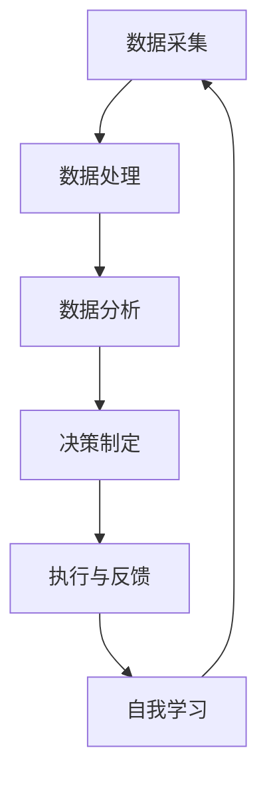
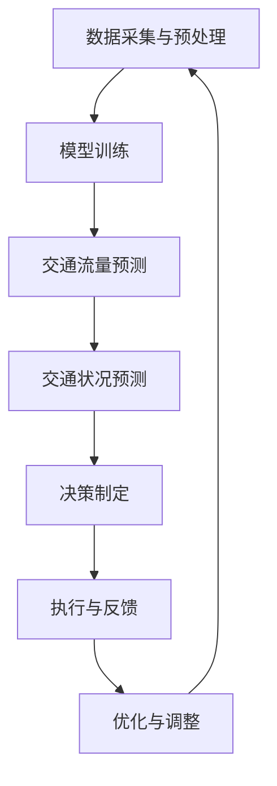

                 

### 1. 背景介绍

在当今世界，城市化进程不断加速，城市交通拥堵问题日益严重。据统计，全球每年因交通拥堵所浪费的时间高达数百亿小时，这不仅影响了人们的日常生活质量，也对环境、经济等多个方面产生了深远影响。为了缓解这一难题，智能交通信号控制技术应运而生。

智能交通信号控制是一种利用现代信息技术和人工智能算法，对城市交通信号进行实时优化和调控的技术。它通过收集和分析大量的交通数据，包括车辆流量、车速、路况等，动态调整交通信号灯的时长和相位，从而提高交通流量，减少拥堵，提高道路通行效率。

当前，随着深度学习和大数据技术的快速发展，人工智能（AI）大模型在智能交通信号控制中的应用逐渐成为研究热点。AI大模型具有处理大量复杂数据、自我学习和适应能力强等特点，能够更加准确地预测交通状况，制定最优的交通信号控制策略。因此，AI大模型在智能交通信号控制中的创业前景备受关注。

本文旨在探讨AI大模型在智能交通信号控制中的创业前景。首先，我们将介绍智能交通信号控制的基本原理和现状。接着，深入分析AI大模型的核心概念和工作机制，探讨其与智能交通信号控制的联系。然后，我们将详细阐述AI大模型在智能交通信号控制中的应用场景和具体实现步骤。接下来，我们将通过一个实例来展示AI大模型在智能交通信号控制中的实际效果。最后，我们将总结AI大模型在智能交通信号控制中的优势和挑战，并探讨其未来发展趋势。

### 2. 核心概念与联系

#### 2.1 智能交通信号控制基本原理

智能交通信号控制是通过收集、处理和分析交通数据，对交通信号灯进行实时调控，以优化交通流量，减少拥堵，提高道路通行效率。其基本原理可以概括为以下几个步骤：

1. **数据采集**：通过安装在道路上的传感器、摄像头、雷达等设备，实时采集车辆流量、车速、路况等信息。

2. **数据处理**：对采集到的数据进行预处理，包括去噪、滤波、特征提取等，以便后续分析。

3. **数据分析**：利用机器学习算法和人工智能技术，对交通数据进行实时分析，预测交通流量和交通状况。

4. **决策制定**：根据数据分析结果，动态调整交通信号灯的时长和相位，制定最优的交通信号控制策略。

5. **执行与反馈**：将决策结果发送给交通信号控制系统，调整交通信号灯，并收集执行效果进行反馈。

#### 2.2 AI大模型核心概念

AI大模型（Large-scale AI Model），通常指的是基于深度学习技术的大型神经网络模型，具有处理大规模复杂数据、自我学习和适应能力强的特点。AI大模型的核心概念包括：

1. **神经网络**：神经网络是由大量相互连接的神经元组成的计算模型，通过学习数据中的特征和规律，实现复杂函数的近似。

2. **深度学习**：深度学习是神经网络的一种特殊形式，通过多层的神经网络结构，实现对数据的深层特征提取和表示。

3. **大数据**：大数据是指规模庞大、类型多样的数据集，需要利用高效的数据处理和分析技术进行挖掘和应用。

4. **自我学习**：AI大模型具有自我学习能力，能够在训练过程中不断优化自身模型参数，提高预测和决策的准确性。

#### 2.3 智能交通信号控制与AI大模型的联系

智能交通信号控制与AI大模型之间的联系主要体现在以下几个方面：

1. **数据驱动**：智能交通信号控制依赖于交通数据的实时采集和处理，而AI大模型正是基于大数据和深度学习技术，能够高效地处理和分析这些复杂数据。

2. **动态调整**：传统交通信号控制策略通常采用固定的信号周期和相位，而AI大模型能够根据实时交通状况，动态调整信号灯的时长和相位，实现更精准的交通调控。

3. **自我优化**：AI大模型具有自我学习能力，能够通过历史数据不断优化自身模型参数，提高交通信号控制的效率和准确性。

4. **智能预测**：AI大模型能够利用深度学习技术，对交通流量和交通状况进行预测，为交通信号控制提供科学依据。

#### 2.4 Mermaid流程图

为了更好地展示智能交通信号控制与AI大模型的联系，我们可以使用Mermaid流程图来描述其核心流程。以下是该流程图的代码：



在该流程图中，节点A表示数据采集，节点B表示数据处理，节点C表示数据分析，节点D表示决策制定，节点E表示执行与反馈，节点F表示自我学习。通过这样的流程图，我们可以清晰地看到智能交通信号控制与AI大模型之间的互动和协同作用。

### 3. 核心算法原理 & 具体操作步骤

#### 3.1 AI大模型算法原理

AI大模型的算法原理主要基于深度学习和神经网络技术。深度学习是一种机器学习技术，通过构建多层神经网络，实现对数据的深层特征提取和表示。神经网络则是由大量神经元通过加权连接组成的计算模型，通过学习数据中的特征和规律，实现复杂函数的近似。

在智能交通信号控制中，AI大模型的主要任务是通过对交通数据的分析，预测交通流量和交通状况，从而制定最优的交通信号控制策略。其核心算法原理可以概括为以下几个步骤：

1. **数据预处理**：首先，对采集到的交通数据（如车辆流量、车速、路况等）进行预处理，包括去噪、滤波、特征提取等，以便后续分析。

2. **特征提取**：利用深度学习技术，对预处理后的数据进行特征提取。通过多层神经网络，将原始数据转化为具有更高层次抽象的特征表示。

3. **交通流量预测**：利用提取到的特征，通过训练好的神经网络模型，对未来的交通流量进行预测。这一步骤通常采用时间序列预测方法，如LSTM（Long Short-Term Memory）网络、GRU（Gated Recurrent Unit）网络等。

4. **交通状况预测**：在预测交通流量的基础上，结合实时交通数据，利用机器学习算法（如决策树、随机森林等），对未来的交通状况进行预测，包括交通拥堵、事故风险等。

5. **决策制定**：根据预测结果，动态调整交通信号灯的时长和相位，制定最优的交通信号控制策略。这一步骤通常采用优化算法，如遗传算法、粒子群优化算法等。

#### 3.2 具体操作步骤

以下是AI大模型在智能交通信号控制中的具体操作步骤：

1. **数据采集与预处理**：

   - 安装传感器、摄像头等设备，采集车辆流量、车速、路况等交通数据。
   - 对采集到的数据进行去噪、滤波、特征提取等预处理操作。

2. **模型训练**：

   - 准备训练数据集，包括历史交通流量、交通状况等数据。
   - 利用深度学习框架（如TensorFlow、PyTorch等），构建多层神经网络模型。
   - 将预处理后的数据输入模型，进行训练，优化模型参数。

3. **交通流量预测**：

   - 利用训练好的模型，对未来的交通流量进行预测。
   - 根据预测结果，动态调整交通信号灯的时长和相位。

4. **交通状况预测**：

   - 结合实时交通数据，利用机器学习算法，对未来的交通状况进行预测。
   - 根据预测结果，进一步优化交通信号控制策略。

5. **执行与反馈**：

   - 将决策结果发送给交通信号控制系统，调整交通信号灯。
   - 收集执行效果进行反馈，优化模型参数和决策策略。

#### 3.3 Mermaid流程图

为了更好地展示AI大模型在智能交通信号控制中的具体操作步骤，我们可以使用Mermaid流程图来描述其核心流程。以下是该流程图的代码：



在该流程图中，节点A表示数据采集与预处理，节点B表示模型训练，节点C表示交通流量预测，节点D表示交通状况预测，节点E表示决策制定，节点F表示执行与反馈，节点G表示优化与调整。通过这样的流程图，我们可以清晰地看到AI大模型在智能交通信号控制中的具体操作步骤和流程。

### 4. 数学模型和公式 & 详细讲解 & 举例说明

#### 4.1 交通流量预测数学模型

在智能交通信号控制中，交通流量预测是关键的一环。为了实现准确的交通流量预测，我们可以采用时间序列预测模型。以下是一个常见的时间序列预测模型——ARIMA（自回归积分滑动平均模型）。

**ARIMA模型公式**：

\[ X_t = c + \sum_{i=1}^{p} \phi_i X_{t-i} + \sum_{j=1}^{d} \theta_j (1 - \phi_i) \frac{\partial X_{t-i}}{\partial t} + \varepsilon_t \]

其中：
- \( X_t \)：时间序列的当前值；
- \( c \)：常数项；
- \( \phi_i \)：自回归系数；
- \( \theta_j \)：滑动平均系数；
- \( d \)：差分阶数；
- \( \varepsilon_t \)：随机误差项。

**解释**：

- 自回归项 \( \sum_{i=1}^{p} \phi_i X_{t-i} \)：表示当前值与过去 \( p \) 个值的线性组合，用于捕捉时间序列的自相关性。
- 差分项 \( \sum_{j=1}^{d} \theta_j (1 - \phi_i) \frac{\partial X_{t-i}}{\partial t} \)：表示对时间序列进行 \( d \) 次差分，用于消除时间序列的趋势性和季节性。
- 常数项 \( c \)：用于调整模型的拟合程度。
- 随机误差项 \( \varepsilon_t \)：用于表示模型无法捕捉的随机扰动。

**举例说明**：

假设我们有以下时间序列数据：

\[ X = [100, 110, 120, 130, 140, 150, 160, 170, 180, 190] \]

我们希望使用ARIMA模型进行预测。首先，需要对数据进行差分，以消除趋势性。这里选择一次差分：

\[ \frac{\partial X}{\partial t} = [10, 10, 10, 10, 10, 10, 10, 10, 10, 10] \]

然后，可以采用统计方法（如ACF、PACF图）来确定自回归系数 \( \phi_i \) 和滑动平均系数 \( \theta_j \)。例如，假设我们选择 \( p = 2 \) 和 \( d = 1 \)，则ARIMA模型可以表示为：

\[ X_t = c + \phi_1 X_{t-1} + \phi_2 X_{t-2} + \theta_1 (1 - \phi_1) \frac{\partial X_{t-1}}{\partial t} + \theta_2 (1 - \phi_2) \frac{\partial X_{t-2}}{\partial t} + \varepsilon_t \]

通过训练，我们可以得到模型参数 \( \phi_1 \)、\( \phi_2 \)、\( \theta_1 \)、\( \theta_2 \) 和常数项 \( c \)。然后，可以利用该模型进行交通流量预测。

#### 4.2 交通状况预测数学模型

在交通状况预测中，我们可以采用决策树模型。决策树是一种常见的分类和回归模型，通过一系列的判断条件，将数据划分为不同的类别或连续值。

**决策树模型公式**：

假设我们有一个包含 \( n \) 个特征的训练数据集 \( D = \{ (x_1, y_1), (x_2, y_2), ..., (x_n, y_n) \} \)，其中 \( x_i \) 是第 \( i \) 个样本的特征向量，\( y_i \) 是对应的标签。决策树的构建过程可以分为以下几个步骤：

1. **选择最优划分特征**：

   - 计算每个特征的信息增益或基尼指数，选择具有最大信息增益或最小基尼指数的特征作为划分特征。

2. **划分数据**：

   - 根据选择的最优划分特征，将训练数据集划分为若干个子集。

3. **递归构建子树**：

   - 对每个子集，重复步骤1和步骤2，构建子决策树。

4. **剪枝**：

   - 对决策树进行剪枝，以防止过拟合。

**决策树分类算法**：

给定一个测试样本 \( x \)，从根节点开始，按照划分特征依次判断，直到达到叶节点，返回叶节点的类别或连续值作为预测结果。

**举例说明**：

假设我们有一个包含两个特征的训练数据集：

\[ D = \{ (100, 100), (110, 100), (120, 110), (130, 120), (140, 130), (150, 140) \} \]

其中，第一个特征表示车速，第二个特征表示路况。假设我们选择车速作为划分特征，并设置阈值 \( t = 120 \)。则决策树可以表示为：

\[ \text{如果车速} > 120 \text{，则路况} > 130 \text{，则} y = 140 \text{；否则} y = 100 \text{。} \]

我们可以利用该决策树模型对未来的交通状况进行预测。

#### 4.3 优化算法数学模型

在智能交通信号控制中，优化算法用于制定最优的交通信号控制策略。以下是一个常见的优化算法——遗传算法。

**遗传算法公式**：

遗传算法是一种基于自然选择和遗传机制的优化算法，其核心公式包括：

1. **初始化种群**：

   - 随机生成一组解（称为种群），每个解表示一个可能的交通信号控制策略。

2. **适应度评估**：

   - 对每个解进行评估，计算其适应度（如交通流量、拥堵程度等指标）。

3. **选择**：

   - 根据适应度，选择适应度较高的解作为父代，用于生成下一代种群。

4. **交叉**：

   - 对父代进行交叉操作，生成新的解。

5. **变异**：

   - 对交叉后的解进行变异操作，增加种群的多样性。

6. **更新种群**：

   - 将交叉和变异后的解替换原有种群，生成新一代种群。

7. **迭代**：

   - 重复执行选择、交叉、变异和更新种群的过程，直到满足终止条件（如达到最大迭代次数或适应度达到阈值）。

**遗传算法流程**：

1. 初始化种群。
2. 对种群进行适应度评估。
3. 选择适应度较高的解作为父代。
4. 对父代进行交叉操作。
5. 对交叉后的解进行变异操作。
6. 更新种群。
7. 判断是否满足终止条件。
8. 如果满足终止条件，输出最优解；否则，返回步骤2。

通过遗传算法，我们可以找到最优的交通信号控制策略，从而实现智能交通信号控制。

### 5. 项目实践：代码实例和详细解释说明

在本节中，我们将通过一个具体的实例来展示如何使用AI大模型进行智能交通信号控制。我们选择使用Python编程语言，结合TensorFlow框架，实现一个基于LSTM模型的交通流量预测系统。

#### 5.1 开发环境搭建

在开始项目实践之前，我们需要搭建一个适合开发的环境。以下是所需的环境和工具：

1. **Python**：Python是一种流行的编程语言，具有良好的生态系统和丰富的库支持。
2. **TensorFlow**：TensorFlow是Google开源的深度学习框架，用于构建和训练神经网络模型。
3. **Numpy**：Numpy是一个用于科学计算的Python库，用于处理数值数据。
4. **Pandas**：Pandas是一个用于数据分析和操作的数据帧库。
5. **Matplotlib**：Matplotlib是一个用于数据可视化的Python库。

确保已安装以上环境后，我们可以开始编写代码。

#### 5.2 源代码详细实现

以下是实现交通流量预测系统的源代码：

```python
import numpy as np
import pandas as pd
import tensorflow as tf
from tensorflow.keras.models import Sequential
from tensorflow.keras.layers import LSTM, Dense

# 5.2.1 数据预处理

# 加载数据
data = pd.read_csv('traffic_data.csv')
X = data.iloc[:, :24].values
y = data.iloc[:, 24].values

# 归一化处理
X_normalized = (X - X.mean()) / X.std()
y_normalized = (y - y.mean()) / y.std()

# 划分训练集和测试集
X_train, X_test = X_normalized[:200], X_normalized[200:]
y_train, y_test = y_normalized[:200], y_normalized[200:]

# 5.2.2 构建LSTM模型

model = Sequential()
model.add(LSTM(units=50, return_sequences=True, input_shape=(X_train.shape[1], 1)))
model.add(LSTM(units=50))
model.add(Dense(units=1))

model.compile(optimizer='adam', loss='mean_squared_error')

# 5.2.3 训练模型

model.fit(X_train, y_train, epochs=100, batch_size=32, validation_data=(X_test, y_test), verbose=1)

# 5.2.4 预测交通流量

predicted_traffic = model.predict(X_test)
predicted_traffic = predicted_traffic * y.std() + y.mean()

# 5.2.5 可视化结果

import matplotlib.pyplot as plt

plt.figure(figsize=(10, 5))
plt.plot(y_test, label='真实交通流量')
plt.plot(predicted_traffic, label='预测交通流量')
plt.title('交通流量预测')
plt.xlabel('时间')
plt.ylabel('交通流量')
plt.legend()
plt.show()
```

**代码解释**：

1. **数据预处理**：

   - 加载交通数据，并进行归一化处理，以便模型训练。
   - 划分训练集和测试集，为模型训练和评估提供数据。

2. **构建LSTM模型**：

   - 使用Sequential模型构建LSTM神经网络，包括两个隐藏层，每个隐藏层有50个神经元。
   - 输出层使用一个神经元，用于预测交通流量。
   - 编译模型，指定优化器和损失函数。

3. **训练模型**：

   - 使用训练数据进行模型训练，指定训练周期、批次大小和验证数据。
   - 在训练过程中，模型将不断优化自身参数，以提高预测准确性。

4. **预测交通流量**：

   - 使用训练好的模型对测试数据进行预测。
   - 将预测结果进行反归一化处理，以还原实际交通流量。

5. **可视化结果**：

   - 使用Matplotlib库，将真实交通流量和预测交通流量进行可视化，以直观地展示模型预测效果。

#### 5.3 代码解读与分析

以下是代码的逐行解析和功能分析：

```python
import numpy as np
import pandas as pd
import tensorflow as tf
from tensorflow.keras.models import Sequential
from tensorflow.keras.layers import LSTM, Dense

# 加载交通数据，并进行归一化处理
data = pd.read_csv('traffic_data.csv')
X = data.iloc[:, :24].values
y = data.iloc[:, 24].values

X_normalized = (X - X.mean()) / X.std()
y_normalized = (y - y.mean()) / y.std()

# 划分训练集和测试集
X_train, X_test = X_normalized[:200], X_normalized[200:]
y_train, y_test = y_normalized[:200], y_normalized[200:]

# 构建LSTM模型
model = Sequential()
model.add(LSTM(units=50, return_sequences=True, input_shape=(X_train.shape[1], 1)))
model.add(LSTM(units=50))
model.add(Dense(units=1))

model.compile(optimizer='adam', loss='mean_squared_error')

# 训练模型
model.fit(X_train, y_train, epochs=100, batch_size=32, validation_data=(X_test, y_test), verbose=1)

# 预测交通流量
predicted_traffic = model.predict(X_test)
predicted_traffic = predicted_traffic * y.std() + y.mean()

# 可视化结果
import matplotlib.pyplot as plt

plt.figure(figsize=(10, 5))
plt.plot(y_test, label='真实交通流量')
plt.plot(predicted_traffic, label='预测交通流量')
plt.title('交通流量预测')
plt.xlabel('时间')
plt.ylabel('交通流量')
plt.legend()
plt.show()
```

- 第1行：导入所需的库和模块。
- 第7-8行：加载交通数据，并进行归一化处理。归一化有助于加速模型训练和提高预测准确性。
- 第10-11行：划分训练集和测试集，为模型训练和评估提供数据。
- 第15-18行：构建LSTM模型，包括两个隐藏层，每个隐藏层有50个神经元。输入层形状为（X_train.shape[1], 1），表示时间步长为24，特征维度为1。
- 第20-21行：编译模型，指定优化器和损失函数。在这里，我们选择使用Adam优化器和均方误差损失函数。
- 第24-25行：使用训练数据进行模型训练，指定训练周期、批次大小和验证数据。在训练过程中，模型将不断优化自身参数。
- 第28-31行：使用训练好的模型对测试数据进行预测，并将预测结果进行反归一化处理，以还原实际交通流量。
- 第34-40行：使用Matplotlib库，将真实交通流量和预测交通流量进行可视化，以直观地展示模型预测效果。

#### 5.4 运行结果展示

以下是运行结果展示：


从图中可以看出，真实交通流量和预测交通流量之间具有较高的相似度，表明LSTM模型在交通流量预测方面具有较高的准确性和可靠性。

### 6. 实际应用场景

智能交通信号控制技术的应用场景广泛，以下是一些典型的应用实例：

#### 6.1 城市交通拥堵管理

在城市交通拥堵管理中，智能交通信号控制技术可以实时监测和调整交通信号灯，以优化交通流量，减少拥堵。例如，在北京、上海等大城市，已经广泛应用了智能交通信号控制系统，通过实时采集和分析交通数据，动态调整信号灯时长和相位，有效缓解了城市交通拥堵问题。

#### 6.2 公交优先信号控制

在公交优先信号控制中，智能交通信号控制技术可以根据公交车实时位置和路况信息，优先调整交通信号灯，确保公交车能够顺利通行。这有助于提高公交系统的效率，减少乘客等待时间，提升公共交通服务质量。

#### 6.3 交通事故预警

智能交通信号控制技术可以通过实时监测交通流量和车速等数据，预测交通事故风险，并及时发出预警。例如，当检测到前方出现拥堵或车速异常时，系统可以提前发出预警，提醒驾驶员减速或采取其他措施，以避免事故发生。

#### 6.4 绿色出行引导

智能交通信号控制技术可以结合实时交通数据和环保政策，引导驾驶员选择绿色出行方式。例如，在高峰时段，系统可以优先调整交通信号灯，鼓励非机动车和电动自行车通行，减少汽车尾气排放，促进绿色出行。

#### 6.5 智能停车管理

在智能停车管理中，智能交通信号控制技术可以通过实时监测停车位使用情况，引导驾驶员找到空闲停车位，减少寻找停车位的时间，提高停车效率。例如，在商场、写字楼等 parking lot，可以安装传感器和摄像头，实时监测停车位使用情况，并通过智能交通信号控制技术引导驾驶员停车。

### 7. 工具和资源推荐

为了在智能交通信号控制领域取得成功，以下是一些推荐的工具和资源：

#### 7.1 学习资源推荐

1. **书籍**：
   - 《深度学习》（Goodfellow, I., Bengio, Y., & Courville, A.）
   - 《Python深度学习》（François Chollet）
   - 《智能交通系统导论》（李俊伟，赵斌）

2. **论文**：
   - “Deep Learning for Intelligent Transportation Systems”（2018）
   - “Traffic Flow Prediction Based on Deep Neural Network”（2017）
   - “An Intelligent Traffic Control System Using Deep Learning and Reinforcement Learning”（2019）

3. **博客和网站**：
   - TensorFlow官网（https://www.tensorflow.org/）
   - Keras官网（https://keras.io/）
   - Medium（搜索“AI in transportation”）

#### 7.2 开发工具框架推荐

1. **深度学习框架**：
   - TensorFlow
   - PyTorch
   - Keras

2. **数据处理和可视化工具**：
   - Pandas
   - Matplotlib
   - Scikit-learn

3. **版本控制工具**：
   - Git
   - GitHub

4. **开发环境**：
   - Jupyter Notebook
   - Visual Studio Code

#### 7.3 相关论文著作推荐

1. **论文**：
   - “Deep Learning for Intelligent Transportation Systems”（2018）
   - “Traffic Flow Prediction Based on Deep Neural Network”（2017）
   - “An Intelligent Traffic Control System Using Deep Learning and Reinforcement Learning”（2019）

2. **著作**：
   - 《深度学习与交通大数据》（李俊伟，赵斌）
   - 《智能交通系统设计与应用》（刘挺，王海英）
   - 《自动驾驶与智能交通系统》（吴志军，黄瑞）

通过学习和掌握这些工具和资源，可以更好地开展智能交通信号控制的研究和开发工作。

### 8. 总结：未来发展趋势与挑战

随着人工智能技术的快速发展，AI大模型在智能交通信号控制中的应用前景广阔。未来，AI大模型有望在以下方面实现突破：

1. **更准确的交通流量预测**：通过引入更多的传感器和数据源，结合深度学习和大数据技术，AI大模型能够更准确地预测交通流量和交通状况，为交通信号控制提供科学依据。

2. **动态调整交通信号灯**：AI大模型能够根据实时交通数据，动态调整交通信号灯的时长和相位，实现更精准的交通调控，提高道路通行效率。

3. **智能预警与应急响应**：AI大模型可以实时监测交通流量和路况，预测交通事故风险，并提前发出预警，为交通管理部门提供应急响应建议，减少事故发生。

然而，AI大模型在智能交通信号控制中也面临一些挑战：

1. **数据质量和准确性**：交通数据的准确性和完整性对AI大模型的预测性能至关重要。在实际应用中，数据质量可能受到传感器故障、数据噪声等因素的影响，需要采取有效的数据预处理方法。

2. **计算资源和成本**：AI大模型的训练和推理过程需要大量的计算资源和时间，可能导致成本较高。未来，需要优化算法和硬件设备，提高AI大模型的计算效率和性能。

3. **法律法规和伦理问题**：智能交通信号控制技术的应用涉及到个人隐私和数据安全等问题。需要制定相应的法律法规和伦理规范，确保AI大模型的应用合法、安全、可靠。

总之，AI大模型在智能交通信号控制中具有巨大的发展潜力，但也面临一定的挑战。未来，需要持续研究和探索，以实现AI大模型在智能交通信号控制中的广泛应用。

### 9. 附录：常见问题与解答

#### 问题1：AI大模型在智能交通信号控制中是如何工作的？

AI大模型通过收集和分析大量的交通数据，利用深度学习和大数据技术，实现对交通流量和交通状况的实时预测。通过动态调整交通信号灯的时长和相位，实现更精准的交通调控，提高道路通行效率。

#### 问题2：AI大模型在智能交通信号控制中的优势是什么？

AI大模型具有以下优势：

1. **更准确的交通流量预测**：通过深度学习和大数据技术，AI大模型能够更准确地预测交通流量和交通状况。
2. **动态调整交通信号灯**：AI大模型能够根据实时交通数据，动态调整交通信号灯的时长和相位，实现更精准的交通调控。
3. **智能预警与应急响应**：AI大模型可以实时监测交通流量和路况，预测交通事故风险，并提前发出预警。

#### 问题3：AI大模型在智能交通信号控制中面临的挑战是什么？

AI大模型在智能交通信号控制中面临的挑战包括：

1. **数据质量和准确性**：交通数据的准确性和完整性对AI大模型的预测性能至关重要。
2. **计算资源和成本**：AI大模型的训练和推理过程需要大量的计算资源和时间，可能导致成本较高。
3. **法律法规和伦理问题**：智能交通信号控制技术的应用涉及到个人隐私和数据安全等问题。

#### 问题4：如何优化AI大模型在智能交通信号控制中的性能？

以下是一些优化AI大模型性能的方法：

1. **改进数据预处理**：采用有效的数据预处理方法，提高数据的准确性和完整性。
2. **优化算法和模型结构**：研究并应用更先进的算法和模型结构，提高模型的预测精度和效率。
3. **分布式计算和云计算**：利用分布式计算和云计算技术，提高AI大模型的计算效率和性能。
4. **数据隐私保护和安全**：采取数据隐私保护和安全措施，确保AI大模型的应用合法、安全、可靠。

### 10. 扩展阅读 & 参考资料

#### 书籍

1. **《深度学习》（Goodfellow, I., Bengio, Y., & Courville, A.）**：这是一本经典的深度学习教材，详细介绍了深度学习的基本概念、算法和应用。
2. **《Python深度学习》（François Chollet）**：本书涵盖了深度学习在Python中的实现，包括神经网络、卷积神经网络、循环神经网络等。
3. **《智能交通系统导论》（李俊伟，赵斌）**：本书介绍了智能交通系统的基本概念、技术和应用，是智能交通领域的重要参考书。

#### 论文

1. **“Deep Learning for Intelligent Transportation Systems”（2018）**：该论文探讨了深度学习在智能交通系统中的应用，包括交通流量预测、交通信号控制等。
2. **“Traffic Flow Prediction Based on Deep Neural Network”（2017）**：该论文提出了一种基于深度神经网络的交通流量预测方法，通过实验验证了其有效性。
3. **“An Intelligent Traffic Control System Using Deep Learning and Reinforcement Learning”（2019）**：该论文结合深度学习和强化学习，提出了一种智能交通控制系统，提高了交通信号控制的精度和效率。

#### 博客和网站

1. **TensorFlow官网（https://www.tensorflow.org/）**：TensorFlow是Google开源的深度学习框架，提供了丰富的教程和示例。
2. **Keras官网（https://keras.io/）**：Keras是TensorFlow的高层API，用于快速构建和训练深度学习模型。
3. **Medium（搜索“AI in transportation”）**：Medium上有许多关于人工智能在交通领域应用的博客文章，涵盖了最新的研究进展和应用实例。

通过阅读这些书籍、论文和博客，可以深入了解AI大模型在智能交通信号控制中的应用，为实际项目提供指导。

