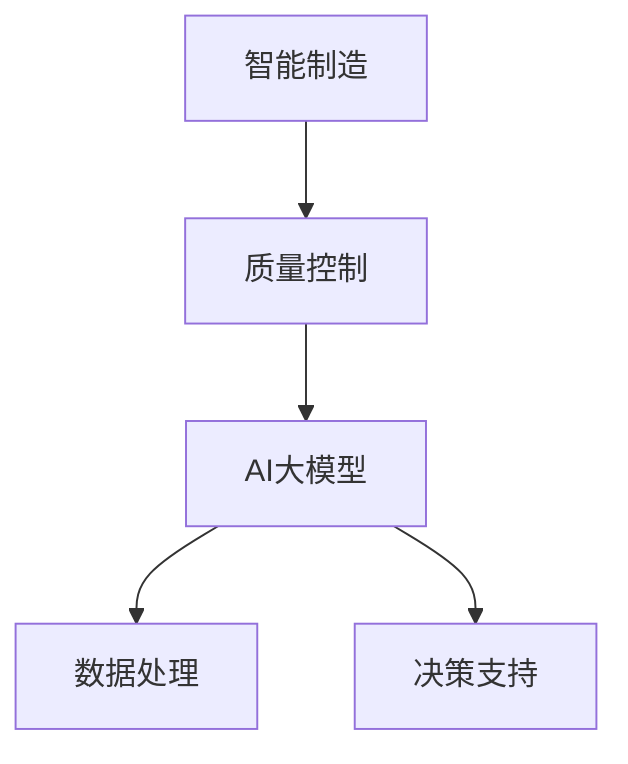

                 

关键词：AI大模型、智能制造、质量控制、创业机会、算法、应用领域

> 摘要：本文深入探讨了AI大模型在智能制造质量控制中的应用前景，通过分析核心概念与联系，详细介绍了算法原理、数学模型、项目实践和实际应用场景，为创业者提供了宝贵的创业机会分析。

## 1. 背景介绍

随着智能制造的快速发展，质量控制成为制造业的重要一环。传统的质量控制方法依赖于人为经验和统计数据分析，效率低下且难以满足现代制造业的精确需求。近年来，人工智能（AI）技术的迅猛发展，特别是大模型技术的出现，为智能制造质量控制带来了新的契机。

AI大模型，如深度学习、强化学习等，具有处理大规模数据、自我学习和自适应优化的能力。这些特性使得AI大模型在智能制造质量控制中具有巨大的潜力。本文旨在探讨AI大模型在智能制造质量控制中的应用，为创业者提供新的商业机会。

## 2. 核心概念与联系

### 2.1 智能制造

智能制造是通过智能技术与传统制造技术的深度融合，实现制造过程的智能化、自动化和高效化。智能制造的核心包括物联网（IoT）、大数据、云计算、人工智能等。

### 2.2 质量控制

质量控制是指通过检测、分析、评估和改进，确保产品或服务满足预定标准的过程。质量控制的核心目标是降低不良品率，提高生产效率。

### 2.3 AI大模型

AI大模型是指通过大规模数据训练得到的复杂神经网络模型，能够实现高度自动化的数据处理和决策。AI大模型的核心是深度学习，特别是卷积神经网络（CNN）和循环神经网络（RNN）。

### 2.4 Mermaid 流程图



## 3. 核心算法原理 & 具体操作步骤

### 3.1 算法原理概述

AI大模型在智能制造质量控制中的应用主要包括两部分：数据预处理和决策支持。数据预处理通过AI大模型对生产数据进行自动清洗、标注和分类，提高数据质量。决策支持则通过AI大模型对生产过程进行实时监控和预测，提供优化方案。

### 3.2 算法步骤详解

1. 数据采集：收集生产过程中的传感器数据、操作记录等。
2. 数据预处理：使用AI大模型对数据进行清洗、标注和分类。
3. 数据分析：使用统计分析和机器学习算法对预处理后的数据进行深入分析。
4. 决策支持：根据分析结果，提供生产过程的优化方案。

### 3.3 算法优缺点

优点：
- 自动化程度高，减少了人为干预。
- 能够处理大规模数据，提高了数据分析的精度和效率。

缺点：
- 需要大量的训练数据和计算资源。
- 模型解释性较差，难以理解决策过程。

### 3.4 算法应用领域

AI大模型在智能制造质量控制中的应用非常广泛，包括但不限于：
- 生产过程实时监控。
- 质量异常检测。
- 产品缺陷预测。
- 优化生产参数。

## 4. 数学模型和公式 & 详细讲解 & 举例说明

### 4.1 数学模型构建

AI大模型通常使用神经网络作为数学模型。神经网络由多个神经元（节点）组成，每个神经元都是一个简单的函数。神经网络通过多层神经元组合，实现对复杂函数的逼近。

### 4.2 公式推导过程

神经网络的激活函数通常使用Sigmoid函数或ReLU函数。假设一个简单的神经网络包含两个输入层、两个隐藏层和一个输出层，其激活函数分别为：

$$
\text{激活函数1} = \frac{1}{1 + e^{-x}} \\
\text{激活函数2} = \max(0, x)
$$

### 4.3 案例分析与讲解

以质量预测为例，假设我们有一个包含1000个样本的数据集，每个样本有10个特征。我们使用一个包含两个隐藏层（每个隐藏层有5个神经元）的神经网络进行训练。训练过程如下：

1. 初始化网络权重。
2. 前向传播：将样本输入神经网络，计算输出值。
3. 反向传播：计算输出误差，更新网络权重。
4. 重复步骤2和3，直到网络收敛。

经过多次迭代，神经网络能够学会对质量进行准确预测。具体实现可以使用Python的TensorFlow或PyTorch等库。

## 5. 项目实践：代码实例和详细解释说明

### 5.1 开发环境搭建

使用Python作为开发语言，安装TensorFlow库。

```python
pip install tensorflow
```

### 5.2 源代码详细实现

以下是一个简单的AI大模型训练示例：

```python
import tensorflow as tf
from tensorflow.keras.models import Sequential
from tensorflow.keras.layers import Dense, Activation

# 构建模型
model = Sequential([
    Dense(10, input_shape=(10,), activation='relu'),
    Dense(10, activation='relu'),
    Dense(1, activation='sigmoid')
])

# 编译模型
model.compile(optimizer='adam', loss='binary_crossentropy', metrics=['accuracy'])

# 加载数据
x_train = ... # 输入数据
y_train = ... # 输出数据

# 训练模型
model.fit(x_train, y_train, epochs=10, batch_size=32)

# 评估模型
loss, accuracy = model.evaluate(x_test, y_test)
print(f"Test accuracy: {accuracy}")
```

### 5.3 代码解读与分析

上述代码首先导入了TensorFlow库，并定义了一个简单的序列模型，包含两个隐藏层和一个输出层。编译模型时，使用了Adam优化器和二元交叉熵损失函数。训练模型时，使用了一个包含1000个样本的数据集。最后，评估模型在测试集上的准确率。

### 5.4 运行结果展示

运行上述代码后，模型将在训练集上完成10个周期的训练，并输出测试集上的准确率。

## 6. 实际应用场景

AI大模型在智能制造质量控制中的实际应用场景包括：
- 生产过程监控：实时监控生产过程，及时发现异常。
- 质量检测：对生产出的产品进行质量检测，识别不良品。
- 设备维护：预测设备故障，提前进行维护，减少停机时间。

## 7. 未来应用展望

随着AI技术的不断发展，AI大模型在智能制造质量控制中的应用前景十分广阔。未来，AI大模型有望实现更高效、更智能的质量控制，提高生产效率和产品质量。

## 8. 工具和资源推荐

### 8.1 学习资源推荐

- 《深度学习》（Goodfellow, Bengio, Courville著）：深度学习的基础教材。
- 《Python机器学习》（Sebastian Raschka著）：Python语言在机器学习领域的应用。

### 8.2 开发工具推荐

- TensorFlow：Google开发的深度学习框架。
- PyTorch：Facebook开发的深度学习框架。

### 8.3 相关论文推荐

- "Deep Learning for Manufacturing: A Survey"（2020）：综述了深度学习在制造领域的应用。
- "AI in Manufacturing: A Comprehensive Overview"（2019）：全面介绍了AI在制造业的应用。

## 9. 总结：未来发展趋势与挑战

AI大模型在智能制造质量控制中的应用具有巨大的潜力，但也面临一些挑战。未来，随着技术的不断进步，AI大模型在智能制造质量控制中的应用将更加广泛和深入。

### 附录：常见问题与解答

Q: AI大模型在智能制造质量控制中具体有哪些应用？
A: AI大模型在智能制造质量控制中的应用包括生产过程实时监控、质量检测和设备维护等。

Q: 如何确保AI大模型的准确性和稳定性？
A: 通过使用大量训练数据、优化模型结构和调整超参数，可以提高AI大模型的准确性和稳定性。

Q: AI大模型是否可以完全取代人为质量控制？
A: 目前AI大模型还不能完全取代人为质量控制，但在提高生产效率和产品质量方面具有显著优势。

### 参考文献

- Goodfellow, Y., Bengio, Y., & Courville, A. (2016). *Deep Learning*.
- Raschka, S. (2015). *Python Machine Learning*.
- "Deep Learning for Manufacturing: A Survey" (2020).
- "AI in Manufacturing: A Comprehensive Overview" (2019).

## 作者署名

作者：禅与计算机程序设计艺术 / Zen and the Art of Computer Programming

