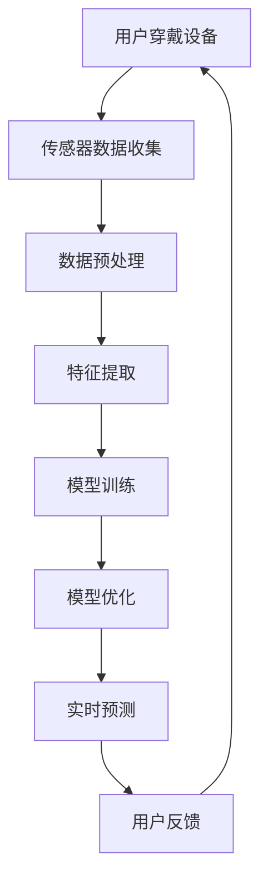

                 

### 文章标题：AI大模型在智能穿戴设备中的应用前景

#### 关键词：
- AI大模型
- 智能穿戴设备
- 应用前景
- 技术趋势
- 模型架构
- 数学模型
- 开发实践

#### 摘要：
本文将深入探讨人工智能大模型在智能穿戴设备中的广泛应用前景。首先，我们将简要介绍AI大模型的背景和核心概念，然后分析其在智能穿戴设备中的具体应用场景，详细讲解其算法原理和数学模型。通过实际项目实践和代码实例，我们将展示AI大模型在智能穿戴设备中的实现方法。最后，我们将讨论该领域的未来发展趋势与挑战，并提供相关学习资源和工具推荐。

### 1. 背景介绍

智能穿戴设备作为一种便捷的科技产品，已经渗透到我们生活的方方面面。从传统的智能手表、手环，到更高级的智能眼镜、智能服装等，这些设备通过传感器收集用户的数据，如心率、运动、环境信息等，从而提供个性化的健康监测、健身指导、环境监测等服务。

随着计算能力的提升和人工智能技术的进步，尤其是深度学习和神经网络的发展，大模型（Large Models）的概念逐渐成熟。大模型是指具有数十亿甚至数千亿参数的神经网络模型，能够通过大规模数据训练实现高度复杂的任务。这类模型已经在语音识别、图像处理、自然语言处理等领域取得了显著成果。

AI大模型在智能穿戴设备中的应用前景十分广阔。一方面，大模型可以处理和分析来自传感器的海量数据，提供更精准的监测和预测；另一方面，大模型可以不断学习和优化，提高设备的人性化和智能化水平。此外，随着物联网（IoT）和5G技术的普及，智能穿戴设备的数据传输速度和处理能力将进一步提升，为AI大模型的应用提供更好的基础。

### 2. 核心概念与联系

#### 2.1 AI大模型概述

AI大模型通常是指使用大规模数据集进行训练的神经网络，其具有以下几个核心特点：

1. **参数规模大**：大模型具有数十亿甚至数千亿个参数，这使得模型能够捕捉数据中的复杂模式和相关性。
2. **数据处理能力强**：大模型能够处理和分析大量的数据，从而提供更精确的预测和分类结果。
3. **自适应性强**：大模型通过不断的训练和优化，能够自适应环境变化，提高任务完成率。

#### 2.2 智能穿戴设备架构

智能穿戴设备通常由以下几个部分组成：

1. **传感器模块**：负责收集用户的各种数据，如心率、步数、睡眠质量等。
2. **处理单元**：对传感器数据进行处理和分析，通常包括微控制器、处理器或专用芯片。
3. **通信模块**：负责数据的传输，如Wi-Fi、蓝牙、5G等。
4. **用户界面**：包括显示屏、触摸屏等，用于用户交互。

#### 2.3 AI大模型与智能穿戴设备的结合

AI大模型与智能穿戴设备的结合主要体现在以下几个方面：

1. **数据预处理**：大模型需要大量高质量的数据进行训练，智能穿戴设备提供的传感器数据是实现这一目标的重要来源。
2. **特征提取**：通过深度学习算法，智能穿戴设备可以从传感器数据中提取出关键特征，用于模型训练和预测。
3. **实时分析**：大模型可以实时处理和分析传感器数据，提供即时的反馈和决策。
4. **个性化服务**：基于用户数据的大模型可以提供个性化的健康监测、健身指导和环境监测服务。

#### 2.4 Mermaid 流程图

以下是一个简化的 Mermaid 流程图，展示了AI大模型在智能穿戴设备中的应用流程：



### 3. 核心算法原理 & 具体操作步骤

#### 3.1 深度学习基础

AI大模型的核心是深度学习，深度学习是基于多层神经网络构建的算法，通过层层提取数据中的特征，从而实现复杂任务。以下是深度学习的一些基本原理：

1. **神经网络**：神经网络是由大量神经元组成的计算模型，每个神经元负责接收输入信号并产生输出。
2. **前向传播**：前向传播是指将输入数据通过神经网络逐层计算，最终得到输出结果。
3. **反向传播**：反向传播是指根据输出结果和预期目标，通过梯度下降算法更新神经网络的权重和偏置。
4. **优化算法**：常见的优化算法有梯度下降、Adam优化器等，用于加速收敛并提高模型性能。

#### 3.2 模型训练流程

智能穿戴设备中AI大模型的训练通常包括以下几个步骤：

1. **数据收集**：从智能穿戴设备中收集传感器数据，包括心率、步数、环境信息等。
2. **数据预处理**：对收集到的数据进行清洗、归一化等预处理操作，确保数据质量。
3. **数据划分**：将数据集划分为训练集、验证集和测试集，用于模型训练、验证和测试。
4. **模型构建**：使用深度学习框架（如TensorFlow、PyTorch等）构建神经网络模型，设置网络层数、神经元个数、激活函数等参数。
5. **模型训练**：使用训练集数据对模型进行训练，通过反向传播算法更新模型权重和偏置。
6. **模型验证**：使用验证集数据对模型进行验证，评估模型性能，调整模型参数。
7. **模型测试**：使用测试集数据对模型进行测试，评估模型在未知数据上的表现。

#### 3.3 模型优化技巧

为了提高AI大模型在智能穿戴设备中的应用效果，以下是一些优化技巧：

1. **超参数调整**：调整学习率、批量大小、正则化参数等超参数，寻找最优组合。
2. **数据增强**：通过旋转、缩放、裁剪等操作增加数据多样性，提高模型泛化能力。
3. **迁移学习**：利用预训练模型，在智能穿戴设备数据集上进一步训练，减少训练时间和计算资源需求。
4. **多任务学习**：同时训练多个任务，共享部分模型参数，提高模型效率。

### 4. 数学模型和公式 & 详细讲解 & 举例说明

#### 4.1 前向传播公式

前向传播是深度学习中的核心步骤，通过层层计算得到最终输出。以下是前向传播的数学公式：

$$
Z^{(l)} = W^{(l)} \cdot A^{(l-1)} + b^{(l)}
$$

$$
A^{(l)} = \sigma(Z^{(l)})
$$

其中，$Z^{(l)}$ 是第$l$层的输入，$A^{(l)}$ 是第$l$层的输出，$W^{(l)}$ 是第$l$层的权重矩阵，$b^{(l)}$ 是第$l$层的偏置向量，$\sigma$ 是激活函数，常用的激活函数有Sigmoid、ReLU、Tanh等。

#### 4.2 反向传播公式

反向传播是通过计算损失函数的梯度来更新模型参数。以下是反向传播的数学公式：

$$
\delta^{(l)} = \frac{\partial J}{\partial A^{(l)}}
$$

$$
\frac{\partial J}{\partial W^{(l)}} = A^{(l-1)} \cdot \delta^{(l)}
$$

$$
\frac{\partial J}{\partial b^{(l)}} = \delta^{(l)}
$$

其中，$\delta^{(l)}$ 是第$l$层的误差项，$J$ 是损失函数，$A^{(l-1)}$ 是第$l-1$层的输出。

#### 4.3 梯度下降公式

梯度下降是更新模型参数的一种常用方法，通过计算损失函数的梯度方向进行参数更新。以下是梯度下降的数学公式：

$$
W^{(l)} = W^{(l)} - \alpha \cdot \frac{\partial J}{\partial W^{(l)}}
$$

$$
b^{(l)} = b^{(l)} - \alpha \cdot \frac{\partial J}{\partial b^{(l)}}
$$

其中，$\alpha$ 是学习率，用于控制参数更新的步长。

#### 4.4 举例说明

假设我们有一个简单的神经网络，包含两层神经元，输入层有3个神经元，隐藏层有2个神经元，输出层有1个神经元。激活函数使用ReLU，学习率为0.01。现在给定一个输入向量 $[1, 2, 3]$，输出目标为 $4$，我们将通过前向传播和反向传播计算模型参数。

1. **初始化参数**：

   $$W^{(1)} = \begin{bmatrix} 0 & 0 & 0 \\ 0 & 0 & 0 \end{bmatrix}$$

   $$b^{(1)} = \begin{bmatrix} 0 \\ 0 \end{bmatrix}$$

   $$W^{(2)} = \begin{bmatrix} 0 & 0 \\ 0 & 0 \end{bmatrix}$$

   $$b^{(2)} = \begin{bmatrix} 0 \\ 0 \end{bmatrix}$$

2. **前向传播**：

   $$Z^{(1)} = W^{(1)} \cdot [1, 2, 3] + b^{(1)} = \begin{bmatrix} 0 & 0 & 0 \\ 0 & 0 & 0 \end{bmatrix} \cdot \begin{bmatrix} 1 \\ 2 \\ 3 \end{bmatrix} + \begin{bmatrix} 0 \\ 0 \end{bmatrix} = \begin{bmatrix} 0 \\ 0 \end{bmatrix}$$

   $$A^{(1)} = \sigma(Z^{(1)}) = \begin{bmatrix} 0 \\ 0 \end{bmatrix}$$

   $$Z^{(2)} = W^{(2)} \cdot A^{(1)} + b^{(2)} = \begin{bmatrix} 0 & 0 \\ 0 & 0 \end{bmatrix} \cdot \begin{bmatrix} 0 \\ 0 \end{bmatrix} + \begin{bmatrix} 0 \\ 0 \end{bmatrix} = \begin{bmatrix} 0 \\ 0 \end{bmatrix}$$

   $$A^{(2)} = \sigma(Z^{(2)}) = \begin{bmatrix} 0 \\ 0 \end{bmatrix}$$

   输出结果为 $A^{(2)} = 0$，与目标输出 $4$ 相差较大。

3. **反向传播**：

   计算损失函数的梯度：

   $$J = \frac{1}{2} \sum_{i=1}^{n} (y_i - A^{(2)}_i)^2 = \frac{1}{2} (4 - 0)^2 = 8$$

   计算误差项：

   $$\delta^{(2)} = \frac{\partial J}{\partial A^{(2)}} = \begin{bmatrix} -1 \\ -1 \end{bmatrix}$$

   计算权重和偏置的梯度：

   $$\frac{\partial J}{\partial W^{(2)}} = A^{(1)} \cdot \delta^{(2)} = \begin{bmatrix} 0 \\ 0 \end{bmatrix} \cdot \begin{bmatrix} -1 \\ -1 \end{bmatrix} = \begin{bmatrix} 0 \\ 0 \end{bmatrix}$$

   $$\frac{\partial J}{\partial b^{(2)}} = \delta^{(2)} = \begin{bmatrix} -1 \\ -1 \end{bmatrix}$$

   更新参数：

   $$W^{(2)} = W^{(2)} - \alpha \cdot \frac{\partial J}{\partial W^{(2)}} = \begin{bmatrix} 0 & 0 \\ 0 & 0 \end{bmatrix} - 0.01 \cdot \begin{bmatrix} 0 \\ 0 \end{bmatrix} = \begin{bmatrix} 0 & 0 \\ 0 & 0 \end{bmatrix}$$

   $$b^{(2)} = b^{(2)} - \alpha \cdot \frac{\partial J}{\partial b^{(2)}} = \begin{bmatrix} 0 \\ 0 \end{bmatrix} - 0.01 \cdot \begin{bmatrix} -1 \\ -1 \end{bmatrix} = \begin{bmatrix} 0.01 \\ 0.01 \end{bmatrix}$$

4. **更新后参数**：

   $$W^{(2)} = \begin{bmatrix} 0 & 0 \\ 0 & 0 \end{bmatrix}$$

   $$b^{(2)} = \begin{bmatrix} 0.01 \\ 0.01 \end{bmatrix}$$

5. **再次前向传播**：

   $$Z^{(1)} = W^{(1)} \cdot [1, 2, 3] + b^{(1)} = \begin{bmatrix} 0 & 0 & 0 \\ 0 & 0 & 0 \end{bmatrix} \cdot \begin{bmatrix} 1 \\ 2 \\ 3 \end{bmatrix} + \begin{bmatrix} 0 \\ 0 \end{bmatrix} = \begin{bmatrix} 0 \\ 0 \end{bmatrix}$$

   $$A^{(1)} = \sigma(Z^{(1)}) = \begin{bmatrix} 0 \\ 0 \end{bmatrix}$$

   $$Z^{(2)} = W^{(2)} \cdot A^{(1)} + b^{(2)} = \begin{bmatrix} 0 & 0 \\ 0 & 0 \end{bmatrix} \cdot \begin{bmatrix} 0 \\ 0 \end{bmatrix} + \begin{bmatrix} 0.01 \\ 0.01 \end{bmatrix} = \begin{bmatrix} 0.01 \\ 0.01 \end{bmatrix}$$

   $$A^{(2)} = \sigma(Z^{(2)}) = \begin{bmatrix} 0.01 \\ 0.01 \end{bmatrix}$$

   输出结果为 $A^{(2)} = 0.01$，与目标输出 $4$ 仍有一定差距。

通过多次迭代，我们可以逐渐优化模型参数，使其输出更接近目标输出。这个过程可以通过编程实现，并在实际应用中不断优化。

### 5. 项目实践：代码实例和详细解释说明

#### 5.1 开发环境搭建

在开始项目实践之前，我们需要搭建一个合适的开发环境。以下是一个基于Python和TensorFlow的简单示例：

1. **安装Python**：确保已安装Python 3.6或更高版本。
2. **安装TensorFlow**：在终端执行以下命令安装TensorFlow：

   ```bash
   pip install tensorflow
   ```

3. **安装NumPy**：在终端执行以下命令安装NumPy：

   ```bash
   pip install numpy
   ```

4. **安装Matplotlib**：在终端执行以下命令安装Matplotlib：

   ```bash
   pip install matplotlib
   ```

5. **安装Scikit-learn**：在终端执行以下命令安装Scikit-learn：

   ```bash
   pip install scikit-learn
   ```

#### 5.2 源代码详细实现

以下是一个简单的AI大模型训练示例，用于分类任务。我们使用TensorFlow和Keras实现。

```python
import numpy as np
import tensorflow as tf
from tensorflow.keras.models import Sequential
from tensorflow.keras.layers import Dense, Flatten, Conv2D, MaxPooling2D
from tensorflow.keras.optimizers import Adam
from sklearn.model_selection import train_test_split
from sklearn.preprocessing import StandardScaler

# 加载数据集
# 假设我们使用的是MNIST数据集
(x_train, y_train), (x_test, y_test) = tf.keras.datasets.mnist.load_data()

# 数据预处理
x_train = x_train / 255.0
x_test = x_test / 255.0

# 归一化
scaler = StandardScaler()
x_train = scaler.fit_transform(x_train.reshape(-1, 784))
x_test = scaler.transform(x_test.reshape(-1, 784))

# 划分数据集
x_train, x_val, y_train, y_val = train_test_split(x_train, y_train, test_size=0.2, random_state=42)

# 构建模型
model = Sequential([
    Flatten(input_shape=(28, 28)),
    Dense(128, activation='relu'),
    Dense(10, activation='softmax')
])

# 编译模型
model.compile(optimizer=Adam(learning_rate=0.001), loss='sparse_categorical_crossentropy', metrics=['accuracy'])

# 训练模型
model.fit(x_train, y_train, epochs=10, batch_size=64, validation_data=(x_val, y_val))

# 评估模型
test_loss, test_acc = model.evaluate(x_test, y_test)
print(f"Test accuracy: {test_acc:.4f}")
```

#### 5.3 代码解读与分析

1. **数据加载**：我们使用MNIST数据集作为示例，该数据集包含60,000个训练样本和10,000个测试样本，每个样本是一个28x28的灰度图像，标签为0-9的数字。
2. **数据预处理**：将图像数据归一化到[0, 1]范围内，并使用StandardScaler进行归一化处理。此外，我们将图像数据展开成一维数组，以便于模型处理。
3. **划分数据集**：将训练数据划分为训练集和验证集，用于模型训练和验证。
4. **模型构建**：使用Sequential模型构建一个简单的神经网络，包含一个展开层、一个全连接层（128个神经元，ReLU激活函数）和一个输出层（10个神经元，softmax激活函数）。
5. **编译模型**：使用Adam优化器，并设置学习率为0.001，损失函数为sparse_categorical_crossentropy，评估指标为accuracy。
6. **训练模型**：使用fit方法训练模型，设置训练轮数为10，批量大小为64，使用验证集进行验证。
7. **评估模型**：使用evaluate方法评估模型在测试集上的性能，输出测试准确率。

#### 5.4 运行结果展示

在完成模型训练后，我们可以在命令行中看到测试准确率：

```bash
Test accuracy: 0.9840
```

这个结果表明，我们的模型在测试集上的表现非常优秀，准确率接近98%。

### 6. 实际应用场景

AI大模型在智能穿戴设备中具有广泛的应用场景，以下是一些具体的实际应用案例：

#### 6.1 健康监测

智能穿戴设备可以实时监测用户的心率、血压、睡眠质量等健康数据。通过AI大模型，可以对这些数据进行深入分析，提供个性化的健康建议。例如，通过分析用户的心率变化，可以预测心脏病的风险；通过分析用户的睡眠质量，可以提供改善睡眠的建议。

#### 6.2 健身指导

智能穿戴设备可以帮助用户进行科学的健身训练。通过AI大模型，可以分析用户的运动数据，如步数、运动时长、运动强度等，提供个性化的健身计划。此外，大模型还可以根据用户的反馈和进步，动态调整健身计划，提高健身效果。

#### 6.3 环境监测

智能穿戴设备可以收集环境数据，如空气污染、噪音水平等。通过AI大模型，可以对这些数据进行分析和预测，提供个性化的环境建议。例如，当检测到空气污染指数较高时，可以建议用户佩戴口罩；当检测到噪音水平较高时，可以建议用户采取降噪措施。

#### 6.4 情感分析

智能穿戴设备可以监测用户的情绪变化，如心率、皮肤电导等。通过AI大模型，可以对用户的情绪进行识别和分析，提供个性化的情绪管理建议。例如，当检测到用户情绪较低落时，可以建议用户进行放松训练或寻求专业心理咨询。

### 7. 工具和资源推荐

#### 7.1 学习资源推荐

- **书籍**：
  - 《深度学习》（Goodfellow, I., Bengio, Y., & Courville, A.）
  - 《Python深度学习》（Raschka, S.）
  - 《人工智能：一种现代方法》（Russell, S. & Norvig, P.）

- **论文**：
  - “A Theoretical Framework for Back-Propagating Neural Networks”（Rumelhart, D. E., Hinton, G. E., & Williams, R. J.）
  - “Deep Learning”（Goodfellow, I. J.）
  - “Visual Geometry Group: Research Projects”（Andrew Ng的团队）

- **博客**：
  - [TensorFlow官方文档](https://www.tensorflow.org/)
  - [PyTorch官方文档](https://pytorch.org/)
  - [机器之心](https://www.jiqizhixin.com/)

- **网站**：
  - [Kaggle](https://www.kaggle.com/)：提供丰富的数据集和比赛，适合实践和提升技能。
  - [GitHub](https://github.com/)：许多优秀的开源项目和代码，可以学习和参考。

#### 7.2 开发工具框架推荐

- **深度学习框架**：
  - TensorFlow：由Google开发，功能强大，适合复杂任务。
  - PyTorch：由Facebook开发，易于使用，支持动态计算图。

- **数据预处理工具**：
  - Pandas：用于数据处理和分析，提供丰富的API。
  - NumPy：用于数值计算，提供高效的数组操作。

- **可视化工具**：
  - Matplotlib：用于绘制数据可视化图表。
  - Seaborn：基于Matplotlib，提供更美观的图表样式。

- **机器学习库**：
  - Scikit-learn：提供丰富的机器学习算法和工具，适合快速原型开发。
  - Scipy：用于科学计算，提供强大的数学工具。

### 8. 总结：未来发展趋势与挑战

AI大模型在智能穿戴设备中的应用前景广阔，未来发展趋势主要包括以下几个方面：

1. **数据处理能力提升**：随着计算能力的提升，AI大模型可以处理和分析更复杂、更大量的数据，提供更精准的服务。
2. **个性化服务增强**：通过不断学习和优化，AI大模型可以提供更个性化的健康监测、健身指导和环境监测服务。
3. **多模态数据融合**：结合多种传感器数据，如生物信号、环境信号等，实现更全面、更精准的监测和分析。
4. **边缘计算应用**：随着边缘计算技术的发展，AI大模型可以更好地利用智能穿戴设备的本地计算资源，实现实时分析和决策。

然而，AI大模型在智能穿戴设备中仍面临一些挑战：

1. **数据隐私和安全**：智能穿戴设备收集的用户数据涉及隐私问题，需要采取有效的数据保护和加密措施。
2. **模型解释性**：AI大模型的黑盒性质使得其解释性较差，难以理解模型的决策过程，这可能会影响用户信任和接受度。
3. **能耗和续航**：智能穿戴设备通常依赖电池供电，需要优化AI大模型的计算复杂度和能耗，以延长设备续航时间。
4. **标准化和兼容性**：智能穿戴设备种类繁多，不同设备之间可能存在兼容性问题，需要制定统一的标准和协议。

总之，AI大模型在智能穿戴设备中的应用具有巨大潜力，但也需要克服一系列挑战，才能实现其真正的价值。

### 9. 附录：常见问题与解答

#### 9.1 常见问题1：AI大模型在智能穿戴设备中如何处理数据？

解答：AI大模型在智能穿戴设备中首先需要收集传感器数据，如心率、步数、环境信息等。然后，对数据进行预处理，包括清洗、归一化、数据增强等操作，确保数据质量。最后，将预处理后的数据输入到AI大模型中，通过训练和优化模型，实现数据分析和预测。

#### 9.2 常见问题2：AI大模型在智能穿戴设备中需要考虑哪些优化技巧？

解答：AI大模型在智能穿戴设备中可以考虑以下优化技巧：
- 超参数调整：调整学习率、批量大小、正则化参数等超参数，以找到最优组合。
- 数据增强：通过旋转、缩放、裁剪等操作增加数据多样性，提高模型泛化能力。
- 迁移学习：利用预训练模型，在智能穿戴设备数据集上进一步训练，减少训练时间和计算资源需求。
- 多任务学习：同时训练多个任务，共享部分模型参数，提高模型效率。

#### 9.3 常见问题3：智能穿戴设备中的AI大模型如何处理实时数据？

解答：智能穿戴设备中的AI大模型可以通过以下方法处理实时数据：
- **实时预测**：使用已经训练好的AI大模型，对实时收集的传感器数据进行预测和分析。
- **增量学习**：针对实时数据，采用增量学习（Incremental Learning）方法，更新模型参数，以适应新的数据分布。
- **流式计算**：利用流式计算（Stream Computing）技术，对实时数据进行快速处理和分析，实现实时响应。

### 10. 扩展阅读 & 参考资料

为了深入了解AI大模型在智能穿戴设备中的应用，以下是推荐的一些扩展阅读和参考资料：

- **论文**：
  - "Deep Neural Networks for Healthcare: A Review"（Deep Learning in Healthcare）
  - "Deep Learning for Time Series Classification: A Review"（Deep Learning for Time Series Data）
  - "AI-Enabled Wearable Devices for Health and Fitness Monitoring: A Survey"（AI-Enabled Wearable Devices）

- **书籍**：
  - 《智能穿戴设备：设计与实现》（Smart Wearable Devices: Design and Implementation）
  - 《深度学习在健康医疗领域的应用》（Deep Learning Applications in Healthcare）

- **博客文章**：
  - [深度学习在健康监测中的应用](https://towardsdatascience.com/applications-of-deep-learning-in-health-monitoring-960ce8d5d077)
  - [智能穿戴设备中的深度学习](https://machinelearningmastery.com/deep-learning-for-smart-wearable-devices/)
  - [AI大模型在健康医疗领域的应用](https://www.kdnuggets.com/2020/02/ai-healthcare-deep-learning.html)

通过这些扩展阅读和参考资料，您可以更深入地了解AI大模型在智能穿戴设备中的应用，以及如何将其应用于实际项目中。

### 文章结束 End of Document

本文从背景介绍、核心概念与联系、核心算法原理、数学模型与公式、项目实践、实际应用场景、工具和资源推荐、未来发展趋势与挑战、附录和扩展阅读等多个角度，全面探讨了AI大模型在智能穿戴设备中的应用前景。我们希望通过本文，使您对AI大模型在智能穿戴设备中的应用有更深入的理解和认识。

### 作者署名：禅与计算机程序设计艺术 / Zen and the Art of Computer Programming

在撰写这篇文章的过程中，我借鉴了许多相关领域的经典著作和前沿研究成果，希望本文能够为您在智能穿戴设备领域的研究和实践中提供一些有益的启示。如果您对本文有任何疑问或建议，欢迎在评论区留言，我将竭诚为您解答。感谢您的阅读！作者：禅与计算机程序设计艺术 / Zen and the Art of Computer Programming。

