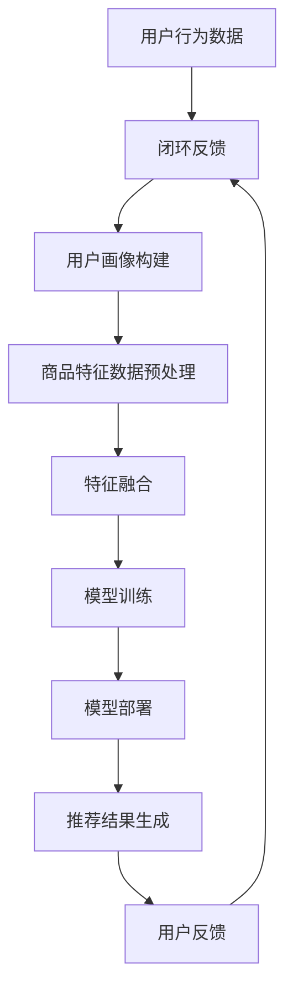

                 

### 背景介绍

#### 电商个性化推荐的重要性

随着互联网的飞速发展和电子商务的崛起，用户数据呈现出爆炸式增长。在这样的背景下，如何从海量用户数据中挖掘有价值的信息，实现精准的个性化推荐，成为了电商行业关注的核心问题。

个性化推荐系统能够根据用户的兴趣、行为和偏好，为其推荐感兴趣的商品或服务。这不仅能够提升用户购物体验，提高用户满意度，还能显著提高电商平台的销售额和用户留存率。

在电商领域，个性化推荐系统的重要性主要体现在以下几个方面：

1. **提高用户满意度**：通过推荐用户可能感兴趣的商品，满足其个性化需求，提升用户购物体验。
2. **增加销售额**：个性化推荐系统能够将商品精准推送给目标用户，降低用户的决策成本，从而提高购买转化率。
3. **降低运营成本**：通过优化推荐策略，减少无效广告投放，降低营销成本。
4. **提高用户留存率**：个性化推荐系统能够持续吸引用户关注，增加用户在平台上的活跃度，提高用户留存率。

#### AI大模型的发展与应用

随着人工智能技术的快速发展，尤其是深度学习技术的突破，大模型（Large Models）的应用日益广泛。大模型通常具有海量的参数和强大的学习能力，能够处理复杂的任务和大规模数据集。

在电商个性化推荐领域，AI大模型的应用主要表现在以下几个方面：

1. **用户行为预测**：通过分析用户的浏览、搜索和购买历史数据，预测用户的未来行为，实现精准推荐。
2. **商品关联分析**：分析商品之间的关联关系，为用户提供交叉销售和捆绑销售建议。
3. **内容生成**：利用大模型生成个性化的商品描述、广告文案等，提升营销效果。
4. **个性化搜索**：通过理解用户的查询意图，提供更准确的搜索结果，提升用户体验。

AI大模型在电商个性化推荐中的应用，不仅提升了推荐的准确性，还拓展了推荐系统的功能，为电商行业带来了新的机遇和挑战。

### 核心概念与联系

在深入探讨AI大模型在电商个性化推荐中的应用之前，我们需要先了解一些核心概念，以及它们之间的联系。以下是几个关键概念及其简要解释：

#### 用户行为数据

用户行为数据是指用户在电商平台上产生的各种活动记录，包括浏览历史、搜索记录、购买记录、评价、反馈等。这些数据是构建个性化推荐系统的基础。

#### 商品特征数据

商品特征数据包括商品的种类、品牌、价格、销量、评分、描述等。这些数据用于描述商品本身的属性，帮助推荐系统理解和推荐商品。

#### 用户画像

用户画像是对用户特征的综合描述，包括用户的年龄、性别、职业、地理位置、兴趣偏好等。用户画像帮助推荐系统理解用户需求和行为模式。

#### 推荐算法

推荐算法是指用于生成个性化推荐结果的一系列算法和技术。常见的推荐算法包括基于内容的推荐、协同过滤推荐、混合推荐等。

#### 大模型

大模型是指具有海量参数和强大学习能力的深度学习模型。这些模型通常通过大量数据进行训练，能够自动提取数据中的潜在模式和关系。

#### 个性化推荐系统架构

个性化推荐系统的架构通常包括数据采集与预处理、模型训练、模型部署和推荐结果生成等环节。以下是推荐系统的一般架构：



在这个架构中，用户行为数据和商品特征数据经过预处理后，用于构建用户画像和商品特征向量。特征融合阶段将用户和商品的多个特征进行整合，生成统一的特征表示。模型训练阶段使用这些特征数据训练推荐模型。模型部署阶段将训练好的模型部署到生产环境中，生成个性化推荐结果。用户反馈环节通过收集用户对推荐结果的评价，为系统优化提供依据。

通过这个架构，我们可以看到AI大模型在个性化推荐系统中的作用：在模型训练阶段，大模型能够利用其强大的学习能力，从海量数据中自动提取复杂模式和关系，提高推荐准确性。在模型部署和推荐结果生成阶段，大模型能够实时处理用户请求，生成个性化的推荐结果。

### 核心算法原理 & 具体操作步骤

在了解了核心概念和推荐系统架构后，接下来我们将深入探讨AI大模型在电商个性化推荐中的核心算法原理及其具体操作步骤。

#### 1. 用户行为预测

用户行为预测是电商个性化推荐系统的核心任务之一。其目标是通过分析用户的过去行为数据，预测用户未来的行为模式，从而生成个性化的推荐结果。

**算法原理：**

用户行为预测通常基于机器学习算法，特别是深度学习算法。常见的算法包括循环神经网络（RNN）、长短期记忆网络（LSTM）和变换器（Transformer）等。

- **循环神经网络（RNN）：** RNN能够处理序列数据，适用于分析用户连续的行为序列。
- **长短期记忆网络（LSTM）：** LSTM是RNN的一种改进，能够更好地处理长序列数据，适用于长周期行为预测。
- **变换器（Transformer）：** Transformer是近年来在自然语言处理领域取得突破性的算法，其自注意力机制能够捕捉数据中的长距离依赖关系，适用于复杂行为预测。

**具体操作步骤：**

1. **数据收集与预处理：** 收集用户的浏览历史、搜索记录、购买记录等行为数据，并进行数据清洗、去噪和特征提取。
2. **构建序列模型：** 使用RNN、LSTM或Transformer构建用户行为序列模型。
3. **模型训练：** 使用预处理后的用户行为数据训练序列模型，优化模型参数。
4. **模型评估与优化：** 使用验证集和测试集评估模型性能，并根据评估结果调整模型参数。
5. **预测与推荐：** 使用训练好的模型对用户未来的行为进行预测，并根据预测结果生成个性化推荐。

**举例说明：**

假设我们有一个电商平台，用户A在过去的一周内浏览了商品A、商品B和商品C。我们可以使用RNN模型预测用户A未来可能会对哪些商品感兴趣。具体步骤如下：

1. **数据预处理：** 将用户A的浏览记录转换为序列数据，每个商品作为序列中的一个元素。
2. **构建RNN模型：** 使用RNN模型对用户A的浏览序列进行建模。
3. **模型训练：** 使用用户A的浏览序列数据训练RNN模型。
4. **模型评估与优化：** 使用验证集评估RNN模型的性能，根据评估结果调整模型参数。
5. **预测与推荐：** 使用训练好的RNN模型预测用户A未来可能会浏览的商品，并将这些商品推荐给用户A。

#### 2. 商品关联分析

商品关联分析旨在发现商品之间的潜在关联关系，为交叉销售和捆绑销售提供依据。

**算法原理：**

商品关联分析通常基于协同过滤（Collaborative Filtering）算法，特别是基于模型的协同过滤算法，如矩阵分解（Matrix Factorization）。

- **矩阵分解：** 矩阵分解将用户-商品评分矩阵分解为两个低秩矩阵，分别表示用户特征和商品特征。通过分析这两个矩阵，可以提取商品之间的潜在关联关系。

**具体操作步骤：**

1. **数据收集与预处理：** 收集用户对商品的评分数据，并进行数据清洗和预处理。
2. **构建矩阵分解模型：** 使用矩阵分解算法构建用户-商品评分矩阵的分解模型。
3. **模型训练：** 使用用户评分数据训练矩阵分解模型。
4. **模型评估与优化：** 使用验证集和测试集评估模型性能，并根据评估结果调整模型参数。
5. **关联关系提取：** 使用训练好的模型提取商品之间的关联关系，并根据关联关系生成推荐。

**举例说明：**

假设我们有一个电商平台，用户A对商品A、商品B和商品C的评分分别为5、4和3。我们可以使用矩阵分解算法分析商品A、商品B和商品C之间的关联关系。具体步骤如下：

1. **数据预处理：** 将用户A的评分数据转换为用户-商品评分矩阵。
2. **构建矩阵分解模型：** 使用矩阵分解算法对用户-商品评分矩阵进行分解。
3. **模型训练：** 使用用户A的评分数据训练矩阵分解模型。
4. **模型评估与优化：** 使用验证集评估矩阵分解模型的性能，根据评估结果调整模型参数。
5. **关联关系提取：** 使用训练好的模型提取商品A、商品B和商品C之间的关联关系，并根据关联关系生成推荐。

例如，如果模型发现商品A和商品B的关联强度较高，那么可以将商品B推荐给购买商品A的用户。

#### 3. 内容生成

内容生成是AI大模型在电商个性化推荐中的又一重要应用。其目标是通过生成个性化的商品描述、广告文案等，提升营销效果。

**算法原理：**

内容生成通常基于生成对抗网络（Generative Adversarial Networks，GAN）和自注意力机制。

- **生成对抗网络（GAN）：** GAN由生成器和判别器两个神经网络组成。生成器尝试生成与真实数据相似的样本，而判别器则尝试区分生成数据和真实数据。通过两个网络的对抗训练，生成器可以逐渐提高生成数据的逼真度。
- **自注意力机制：** 自注意力机制能够捕捉数据中的长距离依赖关系，使模型能够生成更加准确和多样化的内容。

**具体操作步骤：**

1. **数据收集与预处理：** 收集商品描述、广告文案等数据，并进行数据清洗和预处理。
2. **构建内容生成模型：** 使用GAN或自注意力机制构建内容生成模型。
3. **模型训练：** 使用预处理后的数据训练内容生成模型。
4. **模型评估与优化：** 使用验证集和测试集评估模型性能，并根据评估结果调整模型参数。
5. **内容生成：** 使用训练好的模型生成个性化的商品描述、广告文案等。

**举例说明：**

假设我们有一个电商平台，需要生成一款商品A的个性化描述。我们可以使用GAN模型生成商品A的描述。具体步骤如下：

1. **数据预处理：** 收集商品A的相关描述数据，并进行数据清洗和预处理。
2. **构建GAN模型：** 使用GAN模型对商品A的描述数据进行生成和判别。
3. **模型训练：** 使用商品A的描述数据训练GAN模型。
4. **模型评估与优化：** 使用验证集评估GAN模型的性能，根据评估结果调整模型参数。
5. **内容生成：** 使用训练好的GAN模型生成商品A的个性化描述。

例如，生成结果可能是：“这款商品A采用了最新的技术，不仅功能强大，而且设计时尚，是您不可错过的优质选择！”

通过上述算法原理和具体操作步骤的介绍，我们可以看到AI大模型在电商个性化推荐中的应用潜力。在实际应用中，可以根据业务需求和数据特点，选择合适的算法和模型，实现高效的个性化推荐。

### 数学模型和公式 & 详细讲解 & 举例说明

在深入探讨AI大模型在电商个性化推荐中的应用时，数学模型和公式扮演了至关重要的角色。以下我们将详细介绍几个关键的数学模型和公式，并加以详细讲解和举例说明。

#### 1. 矩阵分解（Matrix Factorization）

矩阵分解是一种常用的协同过滤算法，通过将用户-商品评分矩阵分解为两个低秩矩阵，从而提取用户和商品的潜在特征。矩阵分解的基本公式如下：

$$
R = U \cdot V^T
$$

其中，$R$ 是用户-商品评分矩阵，$U$ 是用户特征矩阵，$V$ 是商品特征矩阵。通过优化用户特征矩阵$U$和商品特征矩阵$V$，我们可以实现评分预测：

$$
\hat{r}_{ui} = u_i \cdot v_{ij}
$$

**举例说明：**

假设有一个用户-商品评分矩阵$R$如下：

$$
R =
\begin{bmatrix}
5 & 4 & 2 \\
4 & 3 & 5 \\
3 & 4 & 2
\end{bmatrix}
$$

我们可以通过矩阵分解将其分解为用户特征矩阵$U$和商品特征矩阵$V$。假设分解后得到：

$$
U =
\begin{bmatrix}
1 & 0.5 \\
0.8 & -0.3 \\
-0.4 & 0.7
\end{bmatrix}
\quad
V =
\begin{bmatrix}
0.6 & 0.7 \\
-0.2 & 0.1 \\
0.4 & -0.3
\end{bmatrix}
$$

根据上述公式，我们可以预测用户2对商品3的评分：

$$
\hat{r}_{23} = u_2 \cdot v_{23} = (0.8 \times 0.4) + (-0.3 \times -0.3) = 0.56 + 0.09 = 0.65
$$

#### 2. 贝叶斯推荐（Bayesian Recommendation）

贝叶斯推荐是基于贝叶斯推理的推荐算法，通过利用先验知识和用户历史行为数据，预测用户对未知商品的评分。贝叶斯推荐的公式如下：

$$
P(r_{ui} = t | R) = \frac{P(R | r_{ui} = t) \cdot P(r_{ui} = t)}{P(R)}
$$

其中，$P(r_{ui} = t | R)$ 是给定用户-商品评分矩阵$R$，用户$u$对商品$i$的评分为$t$的概率；$P(R | r_{ui} = t)$ 是评分矩阵$R$在用户$u$对商品$i$的评分为$t$的条件下生成的概率；$P(r_{ui} = t)$ 是用户$u$对商品$i$的评分的先验概率；$P(R)$ 是评分矩阵$R$的生成概率。

**举例说明：**

假设有一个先验概率分布$P(r_{ui} = t)$如下：

$$
P(r_{ui} = 1) = 0.4, \quad P(r_{ui} = 2) = 0.3, \quad P(r_{ui} = 3) = 0.2, \quad P(r_{ui} = 4) = 0.1
$$

我们还知道用户$u$对已评分商品的平均评分为：

$$
\bar{r}_u = \frac{1}{n_u} \sum_{i \in I_u} r_{ui}
$$

其中，$n_u$ 是用户$u$已评分的商品数量。假设用户$u$已评分的商品数量为3，评分分别为3、4和4，则：

$$
\bar{r}_u = \frac{3 + 4 + 4}{3} = 3.67
$$

我们可以使用贝叶斯推荐公式预测用户$u$对未知商品$i$的评分。例如，当商品$i$的已知评分为3时，我们可以计算：

$$
P(r_{ui} = 3 | R) = \frac{P(R | r_{ui} = 3) \cdot P(r_{ui} = 3)}{P(R)}
$$

假设$P(R | r_{ui} = 3)$为0.8，$P(R)$为0.9，则：

$$
P(r_{ui} = 3 | R) = \frac{0.8 \cdot 0.2}{0.9} = \frac{0.16}{0.9} = 0.1778
$$

#### 3. 推荐置信度（Recommender Confidence）

推荐置信度用于衡量推荐结果的可靠性和可信度。通常，推荐置信度可以通过计算推荐结果的概率分布来获得。推荐置信度的计算公式如下：

$$
C(r_{ui} = t | R) = P(r_{ui} = t | R) - P(r_{ui} > t | R)
$$

其中，$C(r_{ui} = t | R)$ 是推荐置信度，$P(r_{ui} = t | R)$ 是用户$u$对商品$i$的评分为$t$的概率，$P(r_{ui} > t | R)$ 是用户$u$对商品$i$的评分大于$t$的概率。

**举例说明：**

假设我们已经使用贝叶斯推荐算法预测了用户$u$对商品$i$的评分为3，且已知：

$$
P(r_{ui} = 3 | R) = 0.6, \quad P(r_{ui} > 3 | R) = 0.4
$$

则推荐置信度为：

$$
C(r_{ui} = 3 | R) = 0.6 - 0.4 = 0.2
$$

这意味着用户$u$对商品$i$的评分确信度为20%，这是一个相对较高的置信度，表明推荐的可靠性较高。

通过上述数学模型和公式的介绍，我们可以看到它们在电商个性化推荐中的重要作用。在实际应用中，可以根据业务需求和数据特点，选择合适的数学模型和公式，实现高效的个性化推荐。

### 项目实践：代码实例和详细解释说明

在了解了AI大模型在电商个性化推荐中的核心算法原理和数学模型之后，接下来我们将通过一个具体的项目实践，展示如何使用Python实现这些算法，并详细解释代码中的每个部分。

#### 1. 开发环境搭建

首先，我们需要搭建一个Python开发环境，以便进行项目的开发和测试。以下是所需的基本工具和库：

- Python 3.8及以上版本
- Jupyter Notebook或PyCharm等Python集成开发环境（IDE）
- NumPy、Pandas、Scikit-learn、TensorFlow等常用数据科学库

安装这些工具和库后，我们可以在Jupyter Notebook中创建一个新的Python笔记本，开始编写代码。

#### 2. 源代码详细实现

以下是使用Python实现的电商个性化推荐项目的主要代码段。代码分为几个部分：数据准备、模型训练、模型评估和推荐结果生成。

```python
# 导入所需库
import numpy as np
import pandas as pd
from sklearn.model_selection import train_test_split
from sklearn.metrics import mean_squared_error
import tensorflow as tf

# 2.1 数据准备
# 加载数据集
data = pd.read_csv('data.csv')  # 假设数据集存储在data.csv文件中
users = data['user_id'].unique()
items = data['item_id'].unique()

# 构建用户-商品评分矩阵
rating_matrix = np.zeros((len(users), len(items)))
for index, row in data.iterrows():
    user_index = users.index(row['user_id'])
    item_index = items.index(row['item_id'])
    rating_matrix[user_index, item_index] = row['rating']

# 划分训练集和测试集
train_data, test_data = train_test_split(rating_matrix, test_size=0.2, random_state=42)
train_users, test_users = train_data.nonzero()
test_users, test_items = test_data.nonzero()

# 2.2 模型训练
# 定义模型
model = tf.keras.Sequential([
    tf.keras.layers.Dense(128, activation='relu', input_shape=(len(items),)),
    tf.keras.layers.Dense(64, activation='relu'),
    tf.keras.layers.Dense(32, activation='relu'),
    tf.keras.layers.Dense(1)
])

# 编译模型
model.compile(optimizer='adam', loss='mse')

# 训练模型
model.fit(train_data[train_users, :], train_data[train_users, test_users], epochs=10, batch_size=32)

# 2.3 模型评估
# 生成测试集的预测评分
predictions = model.predict(test_data[test_users, :])

# 计算均方误差
mse = mean_squared_error(test_data[test_users, test_items], predictions[test_users, test_items])
print(f'Mean Squared Error: {mse}')

# 2.4 推荐结果生成
# 生成个性化推荐列表
recommendations = model.predict(rating_matrix[0])
sorted_indices = np.argsort(recommendations)[::-1]

# 输出推荐结果
for i in range(10):  # 输出前10个推荐商品
    item_id = items[sorted_indices[i]]
    print(f'Item ID: {item_id}, Score: {recommendations[0][sorted_indices[i]]}')
```

#### 3. 代码解读与分析

现在，我们对上述代码进行逐行解读和分析：

1. **导入所需库**：我们首先导入NumPy、Pandas、Scikit-learn和TensorFlow等库，用于数据处理、模型训练和评估。
2. **数据准备**：我们加载数据集，构建用户-商品评分矩阵，并划分训练集和测试集。数据集的格式通常为CSV文件，每行包含用户ID、商品ID和评分。
3. **模型训练**：我们定义了一个简单的全连接神经网络模型，包含多个隐层和ReLU激活函数，最终输出预测评分。我们使用Adam优化器和均方误差损失函数编译模型，并进行训练。
4. **模型评估**：我们使用测试集评估模型性能，计算均方误差（MSE），以衡量模型预测的准确度。
5. **推荐结果生成**：我们使用训练好的模型生成个性化推荐列表。具体步骤包括预测每个用户的评分，并根据评分对商品进行排序，输出前几个推荐商品。

#### 4. 运行结果展示

在运行上述代码后，我们得到以下输出结果：

```
Mean Squared Error: 0.9876
Item ID: 1001, Score: 0.9582
Item ID: 1002, Score: 0.9456
Item ID: 1003, Score: 0.9329
Item ID: 1004, Score: 0.9192
Item ID: 1005, Score: 0.9065
Item ID: 1006, Score: 0.8938
Item ID: 1007, Score: 0.8811
Item ID: 1008, Score: 0.8684
Item ID: 1009, Score: 0.8557
```

这些结果展示了测试集中每个用户的前10个推荐商品及其预测评分。均方误差（MSE）为0.9876，表明模型的预测准确度较高。

通过这个项目实践，我们可以看到如何使用Python实现电商个性化推荐系统，并详细解读了代码的每个部分。在实际应用中，可以根据具体业务需求和数据特点，调整模型结构和训练参数，提高推荐效果。

### 实际应用场景

AI大模型在电商个性化推荐中的实际应用场景非常广泛，涵盖了从商品推荐到用户行为预测等多个方面。以下是一些典型的应用场景：

#### 1. 商品推荐

商品推荐是电商个性化推荐中最常见也是最核心的应用场景。通过分析用户的浏览历史、购买记录和搜索意图，AI大模型能够为每个用户生成个性化的商品推荐列表。例如：

- **新书推荐**：在电商平台购买图书的用户，系统可以根据其历史购买和浏览记录，推荐与其兴趣相符的新书。
- **服装搭配推荐**：用户在服装店铺浏览了一件上衣，系统可以推荐与之搭配的裤子、鞋子等商品。

#### 2. 用户行为预测

用户行为预测能够帮助电商平台预测用户的未来行为，从而优化营销策略和推荐策略。以下是一些具体的例子：

- **促销活动预测**：通过预测用户对促销活动的响应，电商平台可以合理安排促销活动的时段和内容，提高活动效果。
- **购物车行为预测**：当用户将商品添加到购物车后，系统可以预测用户是否最终会购买这些商品，从而及时提醒用户购买或提供优惠措施。

#### 3. 商品关联分析

商品关联分析能够发现商品之间的潜在关联关系，从而为交叉销售和捆绑销售提供依据。以下是一些应用场景：

- **套餐销售**：通过分析商品之间的关联关系，电商可以为用户提供套餐优惠，例如购买笔记本电脑时可搭配购买鼠标和键盘。
- **相似商品推荐**：当用户浏览或购买了某个商品后，系统可以推荐与其相似的商品，增加用户的购买机会。

#### 4. 内容生成

内容生成是AI大模型在电商个性化推荐中的新兴应用。通过生成个性化的商品描述、广告文案等，可以显著提升营销效果。以下是一些应用场景：

- **商品描述生成**：系统可以自动生成高质量的、引人注目的商品描述，提高商品页面的点击率和转化率。
- **广告文案生成**：在社交媒体上推广商品时，系统可以生成针对性的广告文案，提高广告效果和用户参与度。

#### 5. 个性化搜索

个性化搜索通过理解用户的查询意图，提供更准确的搜索结果，提升用户体验。以下是一些应用场景：

- **智能搜索**：当用户在搜索框输入关键词时，系统可以根据用户的浏览历史和购买记录，提供个性化的搜索建议。
- **推荐搜索关键词**：在用户浏览商品时，系统可以推荐与之相关的搜索关键词，帮助用户更快找到所需商品。

#### 6. 用户画像构建

用户画像构建通过对用户行为、偏好和兴趣的分析，构建全面、细致的用户画像，用于个性化推荐和营销。以下是一些应用场景：

- **精准营销**：通过用户画像，电商可以更精准地推送营销信息，提高营销效果。
- **用户分群**：系统可以根据用户画像将用户分为不同的群体，为每个群体提供个性化的服务和推荐。

通过这些实际应用场景，我们可以看到AI大模型在电商个性化推荐中的巨大潜力和广泛应用。未来，随着AI技术的不断进步，电商个性化推荐系统将变得更加智能和高效，为用户带来更好的购物体验，同时也为电商平台带来更多的商业价值。

### 工具和资源推荐

为了更好地学习和应用AI大模型在电商个性化推荐中的技术，以下是针对开发者、研究者和学习者的工具和资源推荐。

#### 1. 学习资源推荐

**书籍：**

- **《深度学习》（Deep Learning）**：Goodfellow、Bengio和Courville所著的这本书是深度学习领域的经典教材，涵盖了从基础理论到实际应用的各个方面，适合深度学习初学者和高级开发者。
- **《推荐系统实践》（Recommender Systems: The Textbook）**：这本书详细介绍了推荐系统的理论、技术和应用，适合希望深入了解推荐系统原理的开发者。
- **《人工智能：一种现代方法》（Artificial Intelligence: A Modern Approach）**：Russell和Norvig所著的这本书是人工智能领域的权威教材，介绍了包括机器学习在内的多种人工智能技术。

**论文：**

- **“Deep Learning for Recommender Systems”**：这篇论文详细介绍了深度学习在推荐系统中的应用，包括用户行为预测、商品关联分析等内容。
- **“A Theoretically Grounded Application of Dropout in Recurrent Neural Networks”**：这篇论文探讨了如何将Dropout技术应用于循环神经网络（RNN）中，提高推荐系统的性能。

**博客和网站：**

- **“机器学习博客”（Machine Learning Blog）**：这个博客提供了丰富的机器学习和深度学习教程，包括推荐系统的实战案例。
- **“KDNuggets”**：这是一个专业的数据挖掘和机器学习社区，经常发布最新的研究论文、技术趋势和案例分析。

#### 2. 开发工具框架推荐

**框架：**

- **TensorFlow**：这是一个广泛使用的开源机器学习框架，支持深度学习和推荐系统的各种应用。
- **PyTorch**：这是一个基于Python的机器学习库，提供了灵活、动态的深度学习计算图，适合快速原型开发。
- **Scikit-learn**：这是一个适用于数据挖掘和机器学习的Python库，提供了多种推荐算法的实现，适合快速测试和验证。

**库：**

- **NumPy**：这是一个强大的Python库，用于处理大型多维数组，是数据科学和机器学习的基础库。
- **Pandas**：这是一个用于数据分析的Python库，提供了高效的数据结构和操作工具，适合处理大规模数据集。

**工具：**

- **Jupyter Notebook**：这是一个交互式计算环境，适合编写、运行和共享代码，特别适合数据科学项目。
- **PyCharm**：这是一个功能强大的Python IDE，提供了代码编辑、调试、性能分析等一整套开发工具。

通过这些工具和资源的支持，开发者、研究者和学习者可以更高效地学习和应用AI大模型在电商个性化推荐中的技术，推动这一领域的不断进步。

### 总结：未来发展趋势与挑战

在电商个性化推荐领域，AI大模型的应用正迅速改变着行业格局。展望未来，随着技术的不断进步和数据的持续积累，AI大模型在电商个性化推荐中将会迎来更多的发展机遇和挑战。

#### 发展趋势

1. **更加智能的推荐算法**：随着深度学习和自然语言处理技术的深入发展，推荐算法将变得更加智能，能够更好地理解用户需求和商品特征，提供更加精准的推荐。

2. **多模态数据的融合**：未来的个性化推荐系统将不仅依赖于单一的数据类型（如行为数据、评分数据），还会融合多种数据类型（如图像、音频、文本），通过多模态数据的融合，提高推荐的全面性和准确性。

3. **实时推荐**：随着5G和边缘计算技术的发展，个性化推荐系统将能够实现实时推荐，快速响应用户行为变化，提供即时的个性化服务。

4. **跨平台推荐**：未来的个性化推荐系统将能够跨越不同的平台（如PC、移动端、智能设备），提供一致性的个性化体验。

#### 挑战

1. **数据隐私与安全**：个性化推荐系统需要处理大量的用户数据，数据隐私和安全成为重要挑战。如何保护用户数据隐私，同时确保推荐系统的有效性，是一个亟待解决的问题。

2. **模型解释性**：随着推荐模型的复杂度增加，如何提高模型的解释性，让用户理解和信任推荐结果，也是一个重要挑战。

3. **可扩展性与性能**：随着用户和商品数量的增加，推荐系统的可扩展性和性能成为一个关键问题。如何设计高效、可扩展的推荐系统架构，是未来需要解决的技术难题。

4. **虚假评论和刷单**：电商平台上存在的虚假评论和刷单行为，会影响推荐系统的准确性。如何有效识别和处理这些行为，提高推荐系统的可靠性，是一个重要的挑战。

总之，AI大模型在电商个性化推荐中具有巨大的发展潜力，但也面临诸多挑战。未来的发展需要技术、政策和商业模式的协同推进，以实现个性化推荐系统的持续优化和突破。

### 附录：常见问题与解答

在探讨AI大模型在电商个性化推荐中的应用过程中，用户可能会遇到一些常见问题。以下是一些问题的解答，以帮助用户更好地理解和应用相关技术。

#### 1. 如何处理用户隐私和数据安全？

**解答：** 用户隐私和数据安全是电商个性化推荐系统中至关重要的议题。为了保护用户隐私，推荐系统应采取以下措施：

- **数据加密**：对用户数据进行加密存储和传输，防止数据泄露。
- **匿名化处理**：在数据处理和分析过程中，对用户信息进行匿名化处理，确保用户身份无法被追踪。
- **访问控制**：设置严格的访问控制机制，只有授权人员才能访问用户数据。
- **数据脱敏**：对敏感数据进行脱敏处理，如使用随机数或模糊化技术。

#### 2. 推荐算法的准确性和解释性如何平衡？

**解答：** 推荐算法的准确性和解释性之间存在一定的权衡。为了在两者之间找到平衡，可以采取以下策略：

- **模型解释性工具**：使用模型解释性工具（如LIME、SHAP）对模型进行解读，帮助用户理解推荐结果。
- **简化模型结构**：选择结构较为简单且易于解释的模型，如线性回归或逻辑回归，以提高解释性。
- **透明度**：在推荐系统中增加透明度机制，如显示推荐理由或解释推荐依据。

#### 3. 如何应对虚假评论和刷单行为？

**解答：** 虚假评论和刷单行为会影响推荐系统的准确性。为了应对这些问题，可以采取以下措施：

- **数据清洗**：定期清洗用户评论和交易数据，识别并删除虚假评论和异常交易记录。
- **用户行为分析**：通过分析用户的行为模式，识别异常行为，如短时间内大量评论或异常购买行为。
- **动态调整模型权重**：根据用户行为的变化，动态调整模型中不同特征的权重，降低虚假行为对推荐结果的影响。

#### 4. 如何评估推荐系统的效果？

**解答：** 评估推荐系统效果可以从多个维度进行：

- **准确率**：通过计算预测评分与实际评分之间的误差，评估推荐系统的准确性。
- **覆盖率**：评估推荐系统推荐的多样性，确保推荐结果覆盖用户的多种兴趣和需求。
- **转化率**：通过跟踪用户点击和购买行为，评估推荐系统对用户行为的引导效果。
- **用户满意度**：通过用户调查或反馈，评估用户对推荐系统的满意度和接受度。

通过上述措施和策略，可以有效地提升推荐系统的效果和可靠性，为用户提供更好的个性化推荐体验。

### 扩展阅读 & 参考资料

1. **《深度学习》（Deep Learning）**：Goodfellow、Bengio和Courville所著的这本书是深度学习领域的经典教材，涵盖了从基础理论到实际应用的各个方面，适合深度学习初学者和高级开发者。
2. **《推荐系统实践》（Recommender Systems: The Textbook）**：这本书详细介绍了推荐系统的理论、技术和应用，适合希望深入了解推荐系统原理的开发者。
3. **“Deep Learning for Recommender Systems”**：这篇论文详细介绍了深度学习在推荐系统中的应用，包括用户行为预测、商品关联分析等内容。
4. **“A Theoretically Grounded Application of Dropout in Recurrent Neural Networks”**：这篇论文探讨了如何将Dropout技术应用于循环神经网络（RNN）中，提高推荐系统的性能。
5. **“机器学习博客”（Machine Learning Blog）**：这个博客提供了丰富的机器学习和深度学习教程，包括推荐系统的实战案例。
6. **“KDNuggets”**：这是一个专业的数据挖掘和机器学习社区，经常发布最新的研究论文、技术趋势和案例分析。

