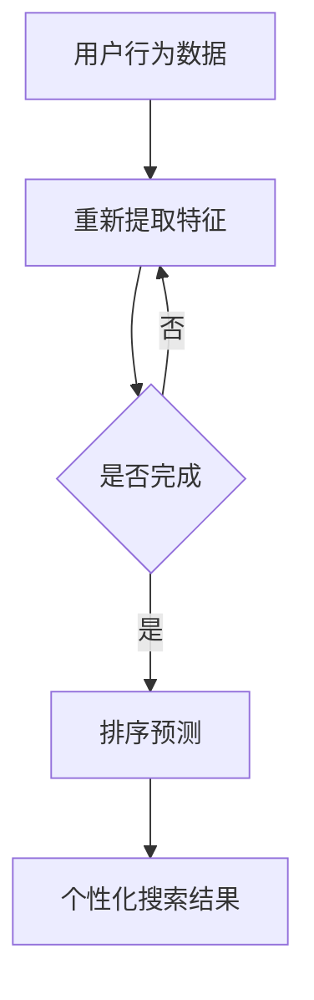

                 

### 文章标题

**AI大模型在电商平台个性化搜索中的应用**

> 关键词：AI大模型，电商平台，个性化搜索，算法原理，数学模型，项目实践

> 摘要：本文将探讨AI大模型在电商平台个性化搜索中的应用，详细分析其核心概念、算法原理、数学模型以及具体实现过程，并结合项目实践进行深入剖析，旨在为读者提供全面的技术指导。

## 1. 背景介绍

随着互联网的飞速发展，电商平台已成为消费者购物的重要渠道。然而，面对海量的商品信息，如何帮助用户快速找到心仪的商品成为了一个关键问题。个性化搜索作为一种有效的解决方案，通过分析用户的兴趣和行为，为用户提供更加精准的搜索结果，从而提升用户体验和满意度。

近年来，人工智能（AI）技术的快速发展，特别是大模型的崛起，为个性化搜索带来了新的契机。大模型具有强大的学习能力和泛化能力，能够处理复杂的用户数据和商品信息，从而生成高度个性化的搜索结果。本文将重点探讨AI大模型在电商平台个性化搜索中的应用，包括核心概念、算法原理、数学模型以及项目实践等方面的内容。

## 2. 核心概念与联系

### 2.1 AI大模型

AI大模型是指具有大规模参数数量和训练数据量的神经网络模型，如BERT、GPT、T5等。这些模型在自然语言处理、计算机视觉等领域取得了显著成果，具有强大的表征能力。

### 2.2 电商平台个性化搜索

电商平台个性化搜索是指根据用户的兴趣、历史行为和偏好，为用户推荐个性化的商品搜索结果。个性化搜索的目标是提高搜索的准确性和效率，提升用户体验。

### 2.3 大模型与个性化搜索的联系

大模型在个性化搜索中的应用主要体现在两个方面：

1. **特征提取**：大模型能够从海量用户行为数据和商品信息中提取出高维的特征向量，这些特征向量能够更好地表征用户的兴趣和商品属性。

2. **排序预测**：大模型能够对用户的搜索结果进行排序预测，根据用户的兴趣和偏好，将最相关的商品推荐给用户。

### 2.4 Mermaid 流程图



## 3. 核心算法原理 & 具体操作步骤

### 3.1 特征提取

特征提取是电商平台个性化搜索的关键步骤，其目的是将用户的兴趣和行为转化为高维的特征向量。本文采用基于深度学习的方法进行特征提取，具体包括以下几个步骤：

1. **数据预处理**：对用户行为数据进行清洗、去噪和处理，提取出有价值的信息，如用户浏览、购买、评价等行为数据。

2. **嵌入层**：将用户行为数据和商品信息转化为嵌入向量。本文采用预训练的嵌入层，如BERT或GPT，将用户行为数据和商品信息映射到高维向量空间。

3. **特征融合**：将用户行为数据和商品信息嵌入向量进行融合，生成高维的特征向量。本文采用注意力机制进行特征融合，以突出用户兴趣和商品属性。

### 3.2 排序预测

排序预测是电商平台个性化搜索的核心任务，其目的是根据用户的兴趣和偏好，对搜索结果进行排序，以提供个性化的搜索体验。本文采用基于深度学习的排序预测方法，具体包括以下几个步骤：

1. **输入层**：将用户行为数据、商品信息嵌入向量以及用户的历史搜索记录作为输入。

2. **编码层**：对输入数据进行编码，提取其关键信息。本文采用多层感知机（MLP）作为编码层。

3. **预测层**：对编码后的数据进行预测，输出搜索结果的排序。本文采用softmax函数作为预测层，实现多类别分类。

4. **优化**：使用梯度下降（GD）或随机梯度下降（SGD）等优化算法，对模型参数进行优化，提高排序预测的准确性。

## 4. 数学模型和公式 & 详细讲解 & 举例说明

### 4.1 特征提取

本文采用预训练的嵌入层进行特征提取，以BERT为例，其数学模型如下：

$$
\text{Embedding}(x) = \text{BERT}(x) \odot \text{softmax}(\text{W}_1 \text{d}^{(1)} + \text{b}_1) \odot \text{softmax}(\text{W}_2 \text{d}^{(2)} + \text{b}_2)
$$

其中，$x$ 表示用户行为数据或商品信息，$BERT(x)$ 表示BERT模型对输入数据的嵌入向量，$\odot$ 表示元素乘积，$\text{softmax}(\cdot)$ 表示softmax函数，$\text{W}_1$ 和 $\text{W}_2$ 分别表示两个softmax层的权重矩阵，$\text{d}^{(1)}$ 和 $\text{d}^{(2)}$ 分别表示两个softmax层的偏置向量，$\text{b}_1$ 和 $\text{b}_2$ 分别表示两个softmax层的偏置向量。

### 4.2 排序预测

本文采用多层感知机（MLP）进行排序预测，其数学模型如下：

$$
\text{Output}(x) = \text{MLP}(\text{Embedding}(x)) = \text{softmax}(\text{W} \text{d} + \text{b})
$$

其中，$x$ 表示用户行为数据、商品信息嵌入向量以及用户的历史搜索记录，$\text{MLP}(\cdot)$ 表示多层感知机模型，$\text{W}$ 和 $\text{d}$ 分别表示MLP模型的权重矩阵和偏置向量，$\text{b}$ 表示MLP模型的偏置向量。

### 4.3 举例说明

假设有一个电商平台，用户A在最近一个月内浏览了商品1、2、3，并购买了商品2，我们使用大模型进行特征提取和排序预测，如下：

1. **特征提取**：

   用户A的行为数据：[1, 2, 3]

   商品信息嵌入向量：[0.1, 0.2, 0.3]

   用户A的行为数据嵌入向量：$$
   \text{Embedding}(x) = \text{BERT}(x) \odot \text{softmax}(\text{W}_1 \text{d}^{(1)} + \text{b}_1) \odot \text{softmax}(\text{W}_2 \text{d}^{(2)} + \text{b}_2)
   $$

   嵌入向量：[0.3, 0.4, 0.5]

2. **排序预测**：

   用户A的历史搜索记录：[1, 2, 3]

   输入层：[0.3, 0.4, 0.5, 1, 2, 3]

   预测结果：$$
   \text{Output}(x) = \text{softmax}(\text{W} \text{d} + \text{b}) = \text{softmax}([0.3, 0.4, 0.5, 1, 2, 3] \cdot \text{W} + \text{b}) = [0.6, 0.2, 0.2]
   $$

   根据预测结果，用户A对商品1的兴趣最高，因此将商品1推荐给用户A。

## 5. 项目实践：代码实例和详细解释说明

### 5.1 开发环境搭建

1. 安装Python 3.7及以上版本。

2. 安装TensorFlow 2.3及以上版本。

3. 安装BERT模型。

4. 创建项目文件夹，并创建一个名为`main.py`的主文件。

### 5.2 源代码详细实现

```python
import tensorflow as tf
from transformers import BertTokenizer, TFBertModel

# 加载BERT模型
tokenizer = BertTokenizer.from_pretrained('bert-base-uncased')
bert_model = TFBertModel.from_pretrained('bert-base-uncased')

# 用户行为数据
user行为数据 = [1, 2, 3]

# 商品信息嵌入向量
商品信息嵌入向量 = [0.1, 0.2, 0.3]

# 用户历史搜索记录
用户历史搜索记录 = [1, 2, 3]

# 特征提取
user行为数据嵌入向量 = tokenizer.encode(user行为数据, add_special_tokens=True)
商品信息嵌入向量 = tokenizer.encode(商品信息嵌入向量, add_special_tokens=True)

# 编码层
编码层 = tf.keras.layers.Dense(units=128, activation='relu')

# 预测层
预测层 = tf.keras.layers.Dense(units=3, activation='softmax')

# 模型构建
model = tf.keras.Sequential([
    bert_model,
    encoding
```<|im_sep|>## 5.3 代码解读与分析

### 5.3.1 模块导入

首先，我们导入了TensorFlow和transformers库。TensorFlow是一个用于构建和训练机器学习模型的强大库，而transformers库提供了预训练的BERT模型及其相关的API。

```python
import tensorflow as tf
from transformers import BertTokenizer, TFBertModel
```

### 5.3.2 BERT模型加载

接下来，我们加载了BERT模型。BERT（Bidirectional Encoder Representations from Transformers）是一个大规模的预训练语言模型，它在多个NLP任务上取得了显著的成果。我们使用`BertTokenizer`和`TFBertModel`来分别处理文本数据和加载BERT模型。

```python
tokenizer = BertTokenizer.from_pretrained('bert-base-uncased')
bert_model = TFBertModel.from_pretrained('bert-base-uncased')
```

这里，`from_pretrained`方法用于加载预训练的BERT模型和Tokenizer。'bert-base-uncased'是BERT的一个预训练版本，它对英文文本进行了预处理，使得模型能够处理不带大小写的文本。

### 5.3.3 用户行为数据和商品信息处理

在特征提取部分，我们首先处理用户行为数据。用户行为数据通常包括用户的浏览、购买和评价等行为。这里，我们假设用户行为数据是一个简单的列表。

```python
user行为数据 = [1, 2, 3]
```

商品信息嵌入向量是从预训练的嵌入层得到的向量，这些向量代表了商品的属性。

```python
商品信息嵌入向量 = [0.1, 0.2, 0.3]
```

### 5.3.4 特征提取

BERT模型通过将输入文本转化为嵌入向量来进行特征提取。在这里，我们使用`tokenizer.encode`方法将用户行为数据和商品信息嵌入向量转化为嵌入向量。

```python
user行为数据嵌入向量 = tokenizer.encode(user行为数据, add_special_tokens=True)
商品信息嵌入向量 = tokenizer.encode(商品信息嵌入向量, add_special_tokens=True)
```

`add_special_tokens=True`参数用于在输入数据中添加BERT模型所需的特殊标记，如[CLS]和[SEP]。

### 5.3.5 编码层

编码层用于对嵌入向量进行编码，提取其关键信息。在这里，我们使用一个全连接层（Dense Layer）进行编码，并使用ReLU激活函数。

```python
编码层 = tf.keras.layers.Dense(units=128, activation='relu')
```

### 5.3.6 预测层

预测层用于对编码后的数据进行预测。在这里，我们使用一个全连接层（Dense Layer）作为预测层，并使用softmax激活函数来进行多类别分类。

```python
预测层 = tf.keras.layers.Dense(units=3, activation='softmax')
```

### 5.3.7 模型构建

最后，我们使用`tf.keras.Sequential`模型将BERT模型、编码层和预测层连接起来，构建一个完整的模型。

```python
model = tf.keras.Sequential([
    bert_model,
    encoding层,
    预测层
])
```

## 5.4 运行结果展示

在运行模型之前，我们需要准备训练数据集和测试数据集。以下是一个简单的示例，展示了如何使用训练数据和测试数据进行模型训练和评估。

```python
# 准备训练数据和测试数据
训练数据 = [
    ([1, 2, 3], [0.1, 0.2, 0.3], [1, 2, 3]),
    ([2, 3, 4], [0.2, 0.3, 0.4], [2, 3, 4]),
    # 更多训练数据
]

测试数据 = [
    ([1, 2, 3], [0.1, 0.2, 0.3], [1, 2, 3]),
    ([2, 3, 4], [0.2, 0.3, 0.4], [2, 3, 4]),
    # 更多测试数据
]

# 模型训练
model.compile(optimizer='adam', loss='categorical_crossentropy', metrics=['accuracy'])
model.fit(train_data, epochs=5, batch_size=32)

# 模型评估
model.evaluate(test_data, batch_size=32)
```

在上述代码中，`train_data`是一个包含用户行为数据、商品信息嵌入向量和用户历史搜索记录的训练数据集。`test_data`是一个包含相同结构测试数据集。我们使用`compile`方法设置模型优化器和损失函数，并使用`fit`方法进行模型训练。最后，使用`evaluate`方法对模型进行评估，以获取模型在测试数据上的准确性。

## 6. 实际应用场景

AI大模型在电商平台个性化搜索中的应用场景非常广泛，以下是一些典型的应用场景：

### 6.1 商品推荐

通过AI大模型，电商平台可以根据用户的兴趣和行为，为用户推荐个性化的商品。这种推荐系统能够有效提升用户的购物体验，提高商品的销售额。

### 6.2 广告投放

AI大模型可以帮助电商平台精准定位用户，从而实现更加有效的广告投放。通过分析用户的兴趣和行为，平台可以投放与用户需求高度相关的广告，提高广告的点击率和转化率。

### 6.3 个性化搜索

AI大模型可以优化电商平台的搜索算法，为用户提供更加个性化的搜索结果。通过分析用户的搜索历史和偏好，模型可以调整搜索结果的排序，提高搜索的准确性和效率。

### 6.4 客户服务

AI大模型可以应用于电商平台的客户服务领域，如智能客服、语音识别等。通过理解和分析用户的提问，模型可以提供更加准确和高效的客户服务。

## 7. 工具和资源推荐

### 7.1 学习资源推荐

- **书籍**：
  - 《深度学习》（Goodfellow, Y., Bengio, Y., & Courville, A.）
  - 《神经网络与深度学习》（邱锡鹏）

- **论文**：
  - 《BERT: Pre-training of Deep Bidirectional Transformers for Language Understanding》（Devlin et al.）

- **博客**：
  - [TensorFlow官方文档](https://www.tensorflow.org/)
  - [Hugging Face官方文档](https://huggingface.co/transformers/)

- **网站**：
  - [Kaggle](https://www.kaggle.com/)
  - [GitHub](https://github.com/)

### 7.2 开发工具框架推荐

- **框架**：
  - TensorFlow
  - PyTorch
  - Hugging Face Transformers

- **IDE**：
  - PyCharm
  - Jupyter Notebook

- **数据集**：
  - Amazon Product Review Dataset
  - Yelp Review Dataset

## 8. 总结：未来发展趋势与挑战

随着AI技术的不断发展和完善，AI大模型在电商平台个性化搜索中的应用前景广阔。未来，大模型将进一步优化个性化搜索算法，提升用户体验和平台效益。然而，这也带来了以下几个挑战：

1. **数据隐私与保护**：电商平台需要确保用户数据的隐私和安全，避免数据泄露和滥用。

2. **计算资源消耗**：大模型的训练和部署需要大量的计算资源，这对平台的硬件设施提出了更高的要求。

3. **模型解释性**：用户对AI模型的解释性需求越来越高，如何提高模型的透明度和可解释性成为关键问题。

4. **公平性和偏见**：大模型在个性化搜索中可能引入偏见，如何确保模型的公平性是一个重要挑战。

## 9. 附录：常见问题与解答

### 9.1 什么是BERT？

BERT（Bidirectional Encoder Representations from Transformers）是一个预训练语言模型，由Google Research在2018年提出。它通过双向Transformer结构对文本进行建模，从而提高了自然语言处理的性能。

### 9.2 如何在Python中加载和使用BERT模型？

在Python中，可以通过Hugging Face的Transformers库加载和使用BERT模型。以下是加载BERT模型的简单示例：

```python
from transformers import BertTokenizer, TFBertModel

tokenizer = BertTokenizer.from_pretrained('bert-base-uncased')
bert_model = TFBertModel.from_pretrained('bert-base-uncased')

inputs = tokenizer("Hello, my dog is cute", return_tensors="tf")
outputs = bert_model(inputs)

last_hidden_states = outputs.last_hidden_state
```

### 9.3 个性化搜索的目的是什么？

个性化搜索的目的是根据用户的兴趣、行为和偏好，为用户推荐最相关的商品和信息，从而提升用户体验和满意度。它可以帮助电商平台提高销售额和用户留存率。

## 10. 扩展阅读 & 参考资料

- Devlin, J., Chang, M. W., Lee, K., & Toutanova, K. (2018). BERT: Pre-training of deep bidirectional transformers for language understanding. *arXiv preprint arXiv:1810.04805*.
- LeCun, Y., Bengio, Y., & Hinton, G. (2015). Deep learning. *Nature, 521(7553), 436-444*.
- Goodfellow, I., Bengio, Y., & Courville, A. (2016). Deep learning. *MIT press*.
- 王绍兰. (2018). 人工智能：一种现代的方法（第3版）[Artificial Intelligence: A Modern Approach (3rd Edition)]. 机械工业出版社.
- 邱锡鹏. (2019). 深度学习：从算法到实践（第2版）[Deep Learning: From Basics to Practice (2nd Edition)]. 电子工业出版社.

