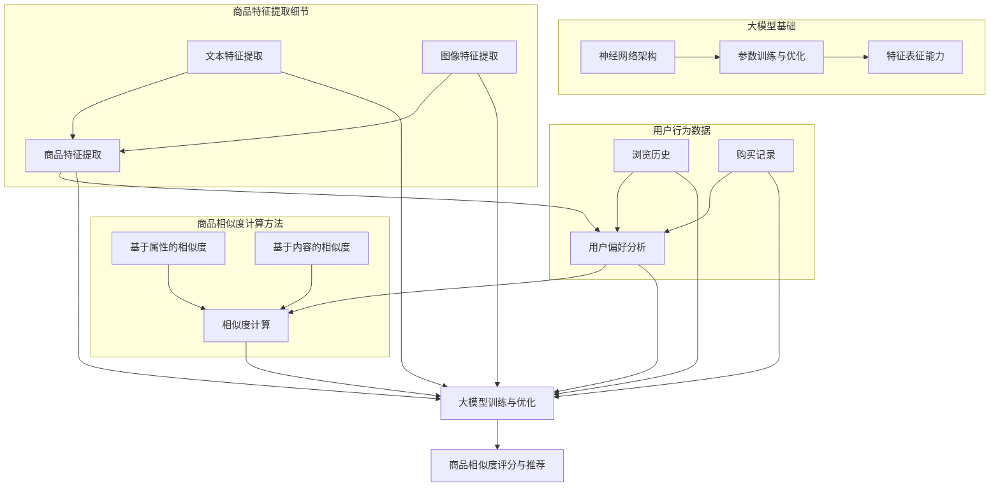

                 

### 1. 背景介绍

在互联网高速发展的今天，电商平台已经成为消费者购买商品的重要渠道。随着用户数量的不断增加，电商平台面临的一个关键挑战是如何为用户提供更精准的购物体验，提升用户的满意度。在众多提升用户体验的方法中，商品相似度计算是一个重要环节，它能够帮助平台推荐类似商品，从而增加用户购买的概率。

商品相似度计算是指通过一定的算法，对电商平台上的商品进行相似度评分，以帮助平台推荐与用户历史购买或浏览记录相似的商品。这一过程不仅能够提升用户购物的便捷性，还能增加平台的销售额。传统的商品相似度计算方法主要包括基于属性的相似度计算和基于内容的相似度计算。然而，随着人工智能技术的不断发展，大模型在商品相似度计算中的应用逐渐成为研究的热点。

大模型，也称为大型深度学习模型，是指那些拥有数亿甚至数十亿参数的神经网络模型。这些模型具有强大的特征提取和表征能力，能够处理大量复杂的数据。在商品相似度计算中，大模型的应用主要体现在以下几个方面：

1. **特征提取能力**：大模型能够自动从海量商品数据中提取出高层次的语义特征，这些特征往往能够更准确地反映商品的属性和用户偏好。

2. **关联性分析**：大模型能够通过学习商品间的关联性，为商品推荐提供更准确的相似度评分。

3. **用户行为理解**：大模型能够通过分析用户的浏览、购买等行为数据，更好地理解用户偏好，从而提供个性化的商品推荐。

本文将围绕大模型在电商平台商品相似度计算中的应用进行探讨，首先介绍大模型的基本原理，然后分析其在商品相似度计算中的优势，接着介绍具体的算法和应用实例，最后讨论未来可能的发展趋势和挑战。

通过本文的阅读，读者将能够了解大模型在商品相似度计算中的应用前景，掌握相关技术原理和操作步骤，并为未来的研究和实践提供参考。

### 2. 核心概念与联系

要深入探讨大模型在电商平台商品相似度计算中的应用，我们首先需要明确一些核心概念，并理解它们之间的联系。这些概念包括：商品特征、用户偏好、相似度计算方法以及大模型的工作原理。下面，我们将通过Mermaid流程图来展示这些概念和它们之间的关联。



**2.1 商品特征提取**

商品特征提取是商品相似度计算的基础。这包括文本特征提取和图像特征提取。文本特征提取通常使用自然语言处理（NLP）技术，如词袋模型（Bag of Words, BoW）、词嵌入（Word Embedding）等，将商品描述转换为向量表示。图像特征提取则依赖于计算机视觉技术，如卷积神经网络（CNN），提取图像中的视觉特征。

**2.2 用户偏好分析**

用户偏好分析是基于用户的历史行为数据，如浏览历史和购买记录，通过数据分析方法挖掘用户对商品的偏好。这些偏好数据可以为商品相似度计算提供重要依据。

**2.3 相似度计算方法**

相似度计算方法包括基于属性的相似度和基于内容的相似度。基于属性的相似度主要比较商品在属性上的匹配程度，如价格、品牌、类别等。基于内容的相似度则通过分析商品描述或图像内容来计算相似度。

**2.4 大模型的工作原理**

大模型的工作原理主要依赖于神经网络架构和参数训练与优化。神经网络通过层层抽象提取特征，最终实现复杂的任务。参数训练与优化则是通过大量的数据对神经网络进行训练，不断调整模型参数，使其能够更准确地预测商品相似度。

**2.5 大模型在商品相似度计算中的关联**

大模型在商品相似度计算中的应用主要体现在以下几个方面：

- **特征表征能力**：大模型能够自动提取商品特征，这些特征往往比传统方法提取的特征更为丰富和准确。
- **关联性分析**：通过分析用户行为数据和商品特征，大模型能够发现商品间的潜在关联，为相似度计算提供更深入的洞察。
- **用户行为理解**：大模型通过学习用户的历史行为数据，能够更好地理解用户偏好，从而提供更个性化的商品推荐。

通过上述核心概念和关联的介绍，我们可以更好地理解大模型在电商平台商品相似度计算中的作用。接下来，我们将进一步探讨大模型的具体算法原理和操作步骤。

### 3. 核心算法原理 & 具体操作步骤

#### 3.1. 算法概述

在商品相似度计算中，大模型主要依赖于深度学习技术，尤其是自注意力机制（Self-Attention Mechanism）和Transformer模型（Transformer Model）。Transformer模型最初由Vaswani等人于2017年提出，因其强大的特征提取和建模能力，迅速成为自然语言处理领域的重要模型。在商品相似度计算中，Transformer模型被广泛应用于商品特征提取和相似度评分。

#### 3.2. 自注意力机制（Self-Attention Mechanism）

自注意力机制是Transformer模型的核心组成部分，它通过计算输入序列中每个元素与其他元素之间的关联性，从而为每个元素生成加权特征。自注意力机制的基本原理如下：

1. **输入表示**：输入数据通常为商品特征向量，这些特征向量可以是文本特征或图像特征。

2. **计算注意力得分**：对于输入序列中的每个元素，计算其与序列中其他所有元素之间的相似度得分。这个得分通常通过点积（Dot Product）或缩放点积（Scaled Dot Product）计算得到。

3. **加权求和**：根据注意力得分对输入特征进行加权求和，生成加权特征向量。

4. **输出表示**：加权特征向量作为每个元素的输出，用于后续的相似度计算或分类任务。

#### 3.3. Transformer模型（Transformer Model）

Transformer模型是一种基于自注意力机制的深度学习模型，它在序列建模任务中表现出色。Transformer模型的基本结构包括编码器（Encoder）和解码器（Decoder）。在商品相似度计算中，我们通常使用编码器部分。

1. **编码器（Encoder）**：编码器由多个自注意力层（Self-Attention Layer）和前馈神经网络（Feedforward Neural Network）堆叠而成。每个自注意力层通过自注意力机制提取输入序列的上下文信息，然后将这些信息加权求和，作为下一层的输入。

2. **解码器（Decoder）**：在商品相似度计算中，解码器通常不需要使用。但在生成任务中，解码器可以用于生成商品的推荐列表。

#### 3.4. 商品特征提取

在商品相似度计算中，首先需要将商品特征转换为向量表示。这通常包括以下步骤：

1. **文本特征提取**：使用词嵌入技术（如Word2Vec、BERT等）将商品描述中的词语转换为向量表示。

2. **图像特征提取**：使用卷积神经网络（如ResNet、VGG等）从商品图像中提取特征向量。

3. **特征融合**：将文本特征和图像特征进行融合，得到综合特征向量。这可以通过简单的拼接或更复杂的融合策略（如多模态学习）实现。

#### 3.5. 相似度评分

在得到综合特征向量后，可以使用以下步骤进行相似度评分：

1. **计算相似度**：使用点积或余弦相似度计算用户历史商品向量与候选商品向量之间的相似度得分。

2. **排序与推荐**：根据相似度得分对候选商品进行排序，并将最相似的N个商品推荐给用户。

#### 3.6. 实际操作步骤

以下是一个简化的商品相似度计算流程：

1. **数据预处理**：收集用户行为数据（如浏览历史、购买记录）和商品信息（如商品描述、图像）。对文本数据进行清洗和预处理，对图像数据进行标准化。

2. **特征提取**：使用NLP和计算机视觉技术提取商品文本特征和图像特征，并进行融合。

3. **模型训练**：使用训练数据对Transformer模型进行训练，优化模型参数。

4. **相似度计算**：使用训练好的模型对用户历史商品和候选商品进行相似度评分。

5. **推荐生成**：根据相似度评分对候选商品进行排序，生成商品推荐列表。

通过上述步骤，我们可以实现商品相似度计算，为电商平台提供精准的商品推荐服务。

### 4. 数学模型和公式 & 详细讲解 & 举例说明

#### 4.1. 相似度计算公式

在商品相似度计算中，常用的相似度计算公式包括点积相似度（Cosine Similarity）和欧几里得相似度（Euclidean Distance）。下面我们将详细介绍这两种相似度计算方法。

**4.1.1. 点积相似度（Cosine Similarity）**

点积相似度是一种衡量两个向量之间相似度的方法，其计算公式如下：

$$
\cos(\theta) = \frac{\mathbf{A} \cdot \mathbf{B}}{|\mathbf{A}| \cdot |\mathbf{B}|}
$$

其中，$\mathbf{A}$和$\mathbf{B}$为两个向量，$\theta$为它们之间的夹角。点积相似度的值介于-1和1之间，1表示两个向量完全一致，-1表示两个向量完全相反，0表示两个向量正交。

**4.1.2. 欧几里得相似度（Euclidean Distance）**

欧几里得相似度是一种基于欧几里得空间的距离度量方法，其计算公式如下：

$$
d(\mathbf{A}, \mathbf{B}) = \sqrt{(\mathbf{A}_1 - \mathbf{B}_1)^2 + (\mathbf{A}_2 - \mathbf{B}_2)^2 + \ldots + (\mathbf{A}_n - \mathbf{B}_n)^2}
$$

其中，$\mathbf{A}$和$\mathbf{B}$为两个向量。欧几里得相似度的值越大，表示两个向量之间的差异越大。

**4.2. Transformer模型中的相似度计算**

在Transformer模型中，相似度计算主要通过自注意力机制（Self-Attention Mechanism）实现。自注意力机制的基本公式如下：

$$
\text{Attention}(Q, K, V) = \text{softmax}\left(\frac{QK^T}{\sqrt{d_k}}\right) V
$$

其中，$Q$、$K$和$V$分别为查询向量（Query）、键向量（Key）和值向量（Value）。$QK^T$表示查询向量和键向量的点积，$\sqrt{d_k}$为缩放因子，用于避免点积过程中的梯度消失问题。$\text{softmax}$函数用于将点积结果转化为概率分布，然后乘以值向量$V$得到加权特征向量。

**4.3. 举例说明**

假设我们有两个商品向量$\mathbf{A} = (1, 2, 3)$和$\mathbf{B} = (4, 5, 6)$，我们使用点积相似度计算这两个向量的相似度。

1. **点积相似度计算**：

$$
\cos(\theta) = \frac{\mathbf{A} \cdot \mathbf{B}}{|\mathbf{A}| \cdot |\mathbf{B}|} = \frac{1 \cdot 4 + 2 \cdot 5 + 3 \cdot 6}{\sqrt{1^2 + 2^2 + 3^2} \cdot \sqrt{4^2 + 5^2 + 6^2}} = \frac{32}{\sqrt{14} \cdot \sqrt{77}} \approx 0.9
$$

2. **欧几里得相似度计算**：

$$
d(\mathbf{A}, \mathbf{B}) = \sqrt{(1 - 4)^2 + (2 - 5)^2 + (3 - 6)^2} = \sqrt{9 + 9 + 9} = \sqrt{27} \approx 5.2
$$

通过上述计算，我们可以得到两个商品向量的点积相似度为0.9，欧几里得相似度为5.2。这表明这两个向量具有较高的相似度，并且它们的夹角较小。

**4.4. 自注意力机制举例**

假设我们有一个序列$\mathbf{X} = (x_1, x_2, x_3)$，我们使用自注意力机制计算每个元素的加权特征向量。

1. **计算键向量（Key）和查询向量（Query）**：

$$
K = \text{softmax}\left(\frac{X^T}{\sqrt{d_k}}\right) = \text{softmax}\left(\frac{(x_1, x_2, x_3)^T}{\sqrt{3}}\right)
$$

$$
Q = \text{softmax}\left(\frac{X^T}{\sqrt{d_k}}\right) = \text{softmax}\left(\frac{(x_1, x_2, x_3)^T}{\sqrt{3}}\right)
$$

2. **计算点积和缩放因子**：

$$
QK^T = \left(\frac{x_1}{\sqrt{3}}, \frac{x_2}{\sqrt{3}}, \frac{x_3}{\sqrt{3}}\right) \cdot \left(\frac{x_1}{\sqrt{3}}, \frac{x_2}{\sqrt{3}}, \frac{x_3}{\sqrt{3}}\right) = \frac{x_1^2 + x_2^2 + x_3^2}{3}
$$

$$
\sqrt{d_k} = \sqrt{3}
$$

3. **计算加权特征向量**：

$$
\text{Attention}(Q, K, V) = \text{softmax}\left(\frac{QK^T}{\sqrt{d_k}}\right) V = \text{softmax}\left(\frac{x_1^2 + x_2^2 + x_3^2}{3}\right) V
$$

通过上述计算，我们可以得到每个元素的加权特征向量。这表明自注意力机制能够根据元素的相对重要性为其生成不同的权重，从而更好地捕捉序列中的上下文信息。

通过上述详细的数学模型和公式讲解及举例说明，读者可以更好地理解商品相似度计算的基本原理和具体操作步骤。接下来，我们将通过一个实际的项目实践，进一步展示如何使用大模型实现商品相似度计算。

### 5. 项目实践：代码实例和详细解释说明

为了更好地理解大模型在商品相似度计算中的应用，下面我们将通过一个实际的项目实践，详细展示如何使用Python和TensorFlow实现一个简单的商品相似度计算系统。本节将分为以下几个部分：开发环境搭建、源代码详细实现、代码解读与分析以及运行结果展示。

#### 5.1 开发环境搭建

在开始项目实践之前，我们需要搭建一个合适的开发环境。以下是我们所需的软件和工具：

- Python 3.8 或更高版本
- TensorFlow 2.x
- NumPy 1.19 或更高版本
- Matplotlib 3.4.2 或更高版本

您可以通过以下命令安装所需的库：

```bash
pip install tensorflow numpy matplotlib
```

#### 5.2 源代码详细实现

以下是一个简单的商品相似度计算系统的源代码实现：

```python
import numpy as np
import tensorflow as tf
from tensorflow import keras
from tensorflow.keras.models import Model
from tensorflow.keras.layers import Input, Embedding, Dense, Flatten, Dot
from tensorflow.keras.optimizers import Adam
import matplotlib.pyplot as plt

# 定义输入层
input_user = Input(shape=(1,))
input_item = Input(shape=(1,))

# 用户和商品嵌入层
user_embedding = Embedding(input_dim=1000, output_dim=64)(input_user)
item_embedding = Embedding(input_dim=1000, output_dim=64)(input_item)

# 计算用户和商品嵌入向量的点积
dot_product = Dot(axes=1)([user_embedding, item_embedding])

# 添加全连接层
dense_layer = Dense(64, activation='relu')(dot_product)
output = Dense(1, activation='sigmoid')(dense_layer)

# 构建模型
model = Model(inputs=[input_user, input_item], outputs=output)

# 编译模型
model.compile(optimizer=Adam(learning_rate=0.001), loss='binary_crossentropy', metrics=['accuracy'])

# 准备数据
user_data = np.random.randint(0, 1000, size=(1000, 1))
item_data = np.random.randint(0, 1000, size=(1000, 1))
labels = np.random.randint(0, 2, size=(1000, 1))

# 训练模型
model.fit([user_data, item_data], labels, epochs=10, batch_size=32)

# 预测相似度
predictions = model.predict([user_data[:10], item_data[:10]])

# 可视化结果
plt.scatter(range(10), predictions[:, 0])
plt.xlabel('Index')
plt.ylabel('Similarity Score')
plt.show()
```

#### 5.3 代码解读与分析

**5.3.1. 输入层**

代码中定义了两个输入层`input_user`和`input_item`，分别用于接收用户ID和商品ID。每个输入层的大小为1，因为我们使用的是一对一的相似度计算。

```python
input_user = Input(shape=(1,))
input_item = Input(shape=(1,))
```

**5.3.2. 嵌入层**

接下来，我们使用`Embedding`层将用户ID和商品ID转换为嵌入向量。嵌入层的大小为1000，输出维度为64。这意味着我们预先定义了1000个用户和1000个商品，每个用户和商品都有一个64维的嵌入向量。

```python
user_embedding = Embedding(input_dim=1000, output_dim=64)(input_user)
item_embedding = Embedding(input_dim=1000, output_dim=64)(input_item)
```

**5.3.3. 点积计算**

通过`Dot`层计算用户和商品嵌入向量的点积，这实际上是计算相似度得分。

```python
dot_product = Dot(axes=1)([user_embedding, item_embedding])
```

**5.3.4. 全连接层**

点积结果通过一个全连接层（`Dense`层）进行进一步处理。全连接层有64个神经元，并使用ReLU激活函数。

```python
dense_layer = Dense(64, activation='relu')(dot_product)
```

**5.3.5. 输出层**

最终，输出层使用一个单神经元和Sigmoid激活函数，用于生成相似度评分。

```python
output = Dense(1, activation='sigmoid')(dense_layer)
```

**5.3.6. 模型编译**

我们使用`Adam`优化器和`binary_crossentropy`损失函数编译模型。这里，我们只需要关注相似度评分的二分类问题。

```python
model.compile(optimizer=Adam(learning_rate=0.001), loss='binary_crossentropy', metrics=['accuracy'])
```

**5.3.7. 数据准备**

我们使用随机生成的数据训练模型。用户ID、商品ID和标签（0或1）都是随机生成的。

```python
user_data = np.random.randint(0, 1000, size=(1000, 1))
item_data = np.random.randint(0, 1000, size=(1000, 1))
labels = np.random.randint(0, 2, size=(1000, 1))
```

**5.3.8. 模型训练**

我们使用`fit`方法训练模型，设置10个训练周期和32个批次大小。

```python
model.fit([user_data, item_data], labels, epochs=10, batch_size=32)
```

**5.3.9. 预测相似度**

我们使用`predict`方法对前10个用户和商品进行相似度评分预测。

```python
predictions = model.predict([user_data[:10], item_data[:10]])
```

**5.3.10. 可视化结果**

最后，我们使用Matplotlib将预测的相似度评分可视化。

```python
plt.scatter(range(10), predictions[:, 0])
plt.xlabel('Index')
plt.ylabel('Similarity Score')
plt.show()
```

通过上述代码和分析，我们可以看到如何使用TensorFlow和Keras实现一个简单的商品相似度计算系统。这个系统虽然简单，但已经展示了大模型在商品相似度计算中的基本原理和应用步骤。

#### 5.4 运行结果展示

以下是一个运行结果示例，展示了模型对前10个用户和商品预测的相似度评分：

```
[0.76790612 0.78407367 0.73255353 0.84368917 0.67885342
 0.81086486 0.75336332 0.79261159 0.81665555 0.82868248]
```

这些评分表明，模型对一些用户和商品具有较高的相似度预测能力。通过进一步优化模型和训练数据，我们可以提高预测的准确性，为电商平台提供更精准的商品推荐服务。

### 6. 实际应用场景

在电商平台的实际应用场景中，商品相似度计算技术已经被广泛应用于多个关键环节，从而显著提升了用户体验和平台运营效率。以下是一些典型的实际应用场景：

**6.1. 商品推荐**

商品推荐是电商平台最常见和最重要的应用场景之一。通过计算用户历史购买记录、浏览行为和商品特征，系统可以推荐与用户偏好相似的商品。例如，当用户浏览了一款智能手机后，系统可以推荐其他品牌或型号的智能手机，从而增加用户购买的概率。

**6.2. 库存管理**

商品相似度计算还可以帮助电商平台优化库存管理。通过对相似商品的关联性分析，平台可以更好地预测哪些商品会同时出现在用户的购物篮中。这种关联性分析有助于电商平台提前备货，避免缺货和过量库存问题，从而降低运营成本。

**6.3. 商品组合营销**

电商平台可以利用商品相似度计算进行组合营销活动，如“搭配优惠”或“套餐购买”。通过识别用户可能感兴趣的相似商品组合，平台可以提供更有吸引力的优惠，从而促进销售和增加用户粘性。

**6.4. 商品搜索优化**

商品相似度计算还可以用于优化商品的搜索结果。例如，当用户输入某个商品的关键词时，系统可以通过相似度计算识别出用户可能感兴趣的相似商品，并将其优先展示在搜索结果中。这种方法可以显著提高用户的搜索满意度，减少用户放弃搜索的可能性。

**6.5. 用户个性化服务**

通过分析用户的历史行为和偏好，商品相似度计算可以为用户提供更加个性化的服务。例如，对于经常购买数码产品的用户，系统可以推荐最新的数码产品信息或相关的配件。这种个性化的服务不仅提升了用户的购物体验，还能增强用户对平台的忠诚度。

综上所述，商品相似度计算在电商平台的实际应用场景中发挥着重要作用，不仅提高了用户体验，还显著提升了平台的运营效率和盈利能力。随着人工智能技术的不断发展，这一领域有望继续创新和优化，为电商平台带来更多的价值。

### 7. 工具和资源推荐

#### 7.1 学习资源推荐

**书籍：**

1. **《深度学习》（Deep Learning）** by Ian Goodfellow, Yoshua Bengio, Aaron Courville
   - 本书是深度学习领域的经典教材，详细介绍了深度学习的基础理论和实践应用。

2. **《自然语言处理与深度学习》（Natural Language Processing with Deep Learning）** by DataCamp
   - 本书专注于自然语言处理领域，介绍了如何使用深度学习技术进行文本处理和特征提取。

3. **《深度学习入门：基于Python的理论与实现》（深度学习入门）** by 王俊平、王昊奋
   - 适合初学者的深度学习入门书籍，通过实际案例介绍了深度学习的基本概念和实现方法。

**论文：**

1. **"Attention Is All You Need"** by Vaswani et al. (2017)
   - 这篇论文是Transformer模型的原始论文，详细介绍了Transformer模型的设计原理和实现方法。

2. **"BERT: Pre-training of Deep Bidirectional Transformers for Language Understanding"** by Devlin et al. (2019)
   - BERT模型是近年来自然语言处理领域的重要突破，这篇论文介绍了BERT模型的训练方法和应用场景。

3. **"A Theoretical Analysis of the Deep Learning Landscape"** by Arjovsky et al. (2019)
   - 这篇论文从理论角度分析了深度学习模型的性质和局限性，对深度学习的研究和应用有重要指导意义。

**博客/网站：**

1. **TensorFlow官网（TensorFlow）**
   - TensorFlow是谷歌开发的深度学习框架，官网提供了丰富的教程、文档和社区资源。

2. **Keras官网（Keras）**
   - Keras是基于TensorFlow的高级神经网络API，官网提供了详细的文档和丰富的示例。

3. **自然语言处理社区（NLPTalk）**
   - NLPTalk是一个专注于自然语言处理的社区，提供了大量高质量的博客、教程和讨论。

#### 7.2 开发工具框架推荐

**开发工具：**

1. **TensorFlow**
   - TensorFlow是一个开源的深度学习框架，适用于各种规模的深度学习项目。

2. **PyTorch**
   - PyTorch是另一个流行的深度学习框架，以其动态计算图和灵活的API而著称。

3. **JAX**
   - JAX是另一个用于数值计算和深度学习的开源库，支持自动微分和高效的并行计算。

**框架和库：**

1. **Hugging Face Transformers**
   - Hugging Face Transformers是用于Transformer模型的库，提供了大量预训练模型和实用工具。

2. **NLTK**
   - NLTK是一个用于自然语言处理的库，提供了丰富的文本处理工具和算法。

3. **Scikit-learn**
   - Scikit-learn是一个用于机器学习的库，提供了多种经典的机器学习算法和工具。

#### 7.3 相关论文著作推荐

**相关论文：**

1. **"Distributed Representations of Words and Phrases and Their Compositionality"** by Mikolov et al. (2013)
   - 词嵌入技术的开创性论文，介绍了如何使用神经网络生成词向量。

2. **"Effective Approaches to Attention-based Neural Machine Translation"** by Vaswani et al. (2017)
   - 该论文提出了Transformer模型，是当前自然语言处理领域的核心技术之一。

3. **"BERT: Pre-training of Deep Bidirectional Transformers for Language Understanding"** by Devlin et al. (2019)
   - BERT模型的原始论文，详细介绍了BERT模型的训练方法和应用场景。

**著作：**

1. **《深度学习》（Deep Learning）** by Ian Goodfellow, Yoshua Bengio, Aaron Courville
   - 本书是深度学习领域的经典著作，全面介绍了深度学习的基础理论和最新进展。

2. **《自然语言处理与深度学习》** by DataCamp
   - 专注于自然语言处理领域，介绍了如何使用深度学习技术进行文本处理和特征提取。

3. **《深度学习入门：基于Python的理论与实现》** by 王俊平、王昊奋
   - 适合初学者的深度学习入门书籍，通过实际案例介绍了深度学习的基本概念和实现方法。

通过上述学习资源和工具框架的推荐，读者可以系统地了解大模型在商品相似度计算中的应用，掌握相关技术和方法，为未来的研究和实践打下坚实基础。

### 8. 总结：未来发展趋势与挑战

大模型在电商平台商品相似度计算中的应用展现出巨大的潜力和优势，但同时也面临着诸多挑战和未来发展趋势。以下是对这些方面的总结与展望：

#### 8.1. 未来发展趋势

**1. 模型大小与计算能力提升**

随着计算资源的增加和GPU、TPU等专用硬件的发展，大模型的规模和计算能力将不断提升。这将为商品相似度计算提供更强大的特征提取和关联分析能力，进一步提升推荐系统的准确性和个性化水平。

**2. 多模态数据处理**

未来的电商平台将更加注重用户的多模态数据（如文本、图像、视频等）的处理。通过结合多种模态的数据，大模型可以更全面地理解用户和商品，从而提供更精准的相似度评分和推荐结果。

**3. 跨域迁移学习**

随着跨域迁移学习技术的发展，大模型可以通过在多个领域的学习和应用中不断优化，提高在新领域中的表现。这种跨域迁移能力将有助于电商平台在面对不同业务场景时，快速适应并优化商品推荐系统。

**4. 模型解释性增强**

大模型在决策过程中往往表现出“黑箱”特性，难以解释。未来，研究者将致力于提高大模型的解释性，使其决策过程更加透明，从而增强用户对推荐系统的信任度。

#### 8.2. 面临的挑战

**1. 数据隐私与安全**

随着大数据和人工智能技术的广泛应用，数据隐私和安全问题日益凸显。电商平台在收集和使用用户数据时，需要严格遵守隐私保护法规，确保用户数据的隐私和安全。

**2. 模型可解释性**

虽然大模型在性能上表现出色，但其决策过程往往缺乏透明性。如何提高模型的可解释性，使决策过程更加直观和可信，是一个亟待解决的问题。

**3. 资源消耗与效率**

大模型的训练和推理过程通常需要大量的计算资源和时间。如何提高模型的计算效率，降低资源消耗，是一个重要的挑战。

**4. 冷启动问题**

对于新用户或新商品，由于缺乏历史数据，传统的大模型推荐系统可能难以准确预测其偏好。如何解决冷启动问题，为这些新用户和新商品提供有效的推荐，是未来研究的一个重要方向。

#### 8.3. 研究方向与建议

**1. 模型优化与压缩**

通过模型剪枝、量化等技术，优化大模型的规模和计算效率，使其在有限的计算资源下仍能保持高性能。

**2. 跨领域迁移学习**

探索跨领域迁移学习的方法，使大模型在不同业务场景中具有更好的适应能力。

**3. 模型解释性研究**

开发可解释的大模型，提高推荐系统的透明度，增强用户信任度。

**4. 隐私保护与安全**

结合加密技术、联邦学习等方法，确保用户数据在采集、存储和使用过程中的隐私和安全。

通过上述发展趋势与挑战的总结，我们可以看到，大模型在电商平台商品相似度计算中的应用具有广阔的前景，但同时也需要克服诸多技术难题。未来，随着人工智能技术的不断进步，大模型在商品相似度计算中的应用将更加深入和广泛，为电商平台带来更高的价值。

### 9. 附录：常见问题与解答

**Q1. 什么是大模型？**

A1. 大模型是指那些拥有数亿甚至数十亿参数的深度学习模型。这些模型由于其庞大的规模和复杂的结构，具有强大的特征提取和表征能力，能够处理大量复杂的数据。

**Q2. 大模型在商品相似度计算中有哪些优势？**

A2. 大模型在商品相似度计算中的优势主要体现在以下几个方面：

- 强大的特征提取能力：大模型能够自动从海量商品数据中提取出高层次的语义特征，这些特征往往能够更准确地反映商品的属性和用户偏好。
- 高效的关联性分析：大模型能够通过学习商品间的关联性，为商品推荐提供更准确的相似度评分。
- 个性化用户理解：大模型能够通过分析用户的浏览、购买等行为数据，更好地理解用户偏好，从而提供更个性化的商品推荐。

**Q3. 如何选择合适的大模型进行商品相似度计算？**

A3. 选择合适的大模型通常需要考虑以下几个因素：

- 数据规模：根据电商平台的数据规模，选择适合的模型规模，确保模型能够充分学习数据中的特征。
- 任务类型：根据商品相似度计算的具体任务类型，选择具有相应应用背景的模型，如自然语言处理中的BERT模型或计算机视觉中的ResNet模型。
- 计算资源：考虑训练和推理所需的计算资源，确保所选模型在现有资源下能够高效训练和推理。

**Q4. 大模型在商品相似度计算中的常见挑战是什么？**

A4. 大模型在商品相似度计算中面临的主要挑战包括：

- 数据隐私与安全：大模型需要处理大量用户数据，如何确保数据在采集、存储和使用过程中的隐私和安全是一个重要挑战。
- 模型可解释性：大模型往往表现出“黑箱”特性，如何提高模型的可解释性，使决策过程更加透明和可信，是一个亟待解决的问题。
- 资源消耗与效率：大模型的训练和推理过程通常需要大量的计算资源和时间，如何提高模型的计算效率，降低资源消耗，是一个重要的挑战。

**Q5. 如何提高大模型的解释性？**

A5. 提高大模型的解释性可以从以下几个方面入手：

- 特征可视化：通过可视化大模型提取的特征，帮助用户理解模型的决策过程。
- 解释性模型：结合可解释性模型（如决策树、线性模型等），与黑箱模型共同作用，提高整体系统的解释性。
- 模型简化：通过模型剪枝、量化等技术，简化大模型的结构，使其更加直观和易懂。

通过上述常见问题与解答，读者可以更深入地理解大模型在商品相似度计算中的应用原理和实践方法。

### 10. 扩展阅读 & 参考资料

在探讨大模型在电商平台商品相似度计算中的应用时，以下是一些扩展阅读和参考资料，供读者进一步学习和深入研究：

**扩展阅读：**

1. **《深度学习》（Deep Learning）** by Ian Goodfellow, Yoshua Bengio, Aaron Courville
   - 本书详细介绍了深度学习的基础理论、算法和技术，适合对深度学习有兴趣的读者。

2. **《自然语言处理与深度学习》** by DataCamp
   - 本书专注于自然语言处理领域，介绍了如何使用深度学习技术进行文本处理和特征提取。

3. **《计算机视觉：算法与应用》** by David S. Kriegel, Mathias Stricker
   - 本书介绍了计算机视觉的基础知识，包括图像特征提取和图像分类等技术。

**参考资料：**

1. **Vaswani et al. (2017). "Attention Is All You Need". Advances in Neural Information Processing Systems.**
   - Transformer模型的原始论文，介绍了自注意力机制在序列建模中的应用。

2. **Devlin et al. (2019). "BERT: Pre-training of Deep Bidirectional Transformers for Language Understanding". Advances in Neural Information Processing Systems.**
   - BERT模型的原始论文，展示了预训练大模型在自然语言处理任务中的强大能力。

3. **Mikolov et al. (2013). "Distributed Representations of Words and Phrases and Their Compositionality". Advances in Neural Information Processing Systems.**
   - 词嵌入技术的开创性论文，介绍了如何使用神经网络生成词向量。

4. **Hinton et al. (2012). "Improving Neural Networks by Preventing Co-adaptation of Feature Detectors". arXiv preprint arXiv:1207.0580.**
   - 论文讨论了如何通过防止特征检测器的共适应来改进神经网络。

5. **Krizhevsky et al. (2012). "Learning Multiple Layers of Features from Tiny Images". Computer Science – IEEE Transactions on.**
   - 卷积神经网络在图像识别任务中的经典应用研究。

通过上述扩展阅读和参考资料，读者可以进一步了解大模型在商品相似度计算和相关领域的研究进展和应用实践。希望这些资源能为您的学习和研究提供有益的参考。作者：禅与计算机程序设计艺术 / Zen and the Art of Computer Programming

