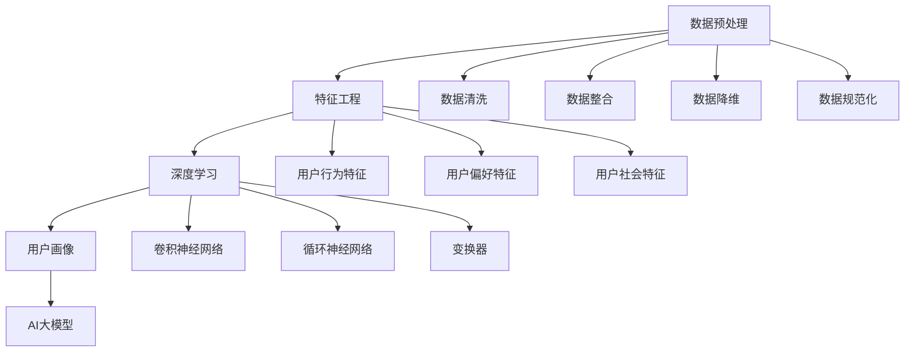

                 

### 背景介绍

在当今数字化时代，电商平台已经成为了消费者购物的重要渠道。随着互联网技术的不断发展和用户数量的急剧增加，电商平台面临着日益复杂的用户管理和服务优化问题。为了更好地了解用户需求，提高用户满意度，并实现个性化推荐和精准营销，构建精准的用户画像成为了电商平台的关键任务之一。

用户画像是指通过对用户的基本信息、行为数据、偏好数据等多维度数据进行整合和分析，形成一个综合的用户概貌。这样不仅可以深入了解用户的需求和行为模式，还可以为电商平台提供数据支持，以实现更精准的市场定位和运营策略。

传统的用户画像构建方法主要依赖于统计分析和机器学习算法。然而，这些方法往往受到数据质量和样本量的限制，且难以处理大规模、多维度数据。随着人工智能技术的快速发展，尤其是深度学习算法的广泛应用，大模型在用户画像构建中的应用逐渐成为研究热点。

大模型是指具有巨大参数规模和计算能力的神经网络模型。这类模型可以通过自主学习海量数据，提取用户特征并建立用户与商品、服务之间的复杂关系。相较于传统方法，大模型具有以下优势：

1. **强大的特征提取能力**：大模型可以自动提取用户行为数据中的隐藏特征，从而更准确地刻画用户画像。
2. **处理大规模数据**：大模型能够高效处理海量的用户数据，包括历史行为、偏好信息等，从而构建更全面、更精准的用户画像。
3. **适应性强**：大模型可以根据不同的业务需求和环境动态调整模型参数，实现灵活的用户画像构建。

总之，AI大模型在电商平台用户画像构建中的应用不仅能够提升数据处理的效率和准确性，还可以为电商平台的运营决策提供有力支持，具有重要的理论价值和实际应用意义。

### 核心概念与联系

在深入探讨AI大模型在电商平台用户画像构建中的应用之前，我们需要先了解一些核心概念和它们之间的关系。以下是本文将涉及的主要核心概念及其相互联系：

#### 数据预处理

数据预处理是用户画像构建中的关键步骤。它包括数据清洗、数据整合、数据降维和数据规范化等操作。数据清洗旨在去除无效或错误的数据；数据整合则涉及将不同来源的数据进行合并，形成一个统一的数据集；数据降维可以减少数据的维度，提高模型训练的效率；数据规范化则通过对数据进行归一化或标准化处理，使不同特征的数据具有相似的范围，从而避免因数据量级差异导致的模型偏差。

#### 特征工程

特征工程是指从原始数据中提取出对模型训练有帮助的特征。在用户画像构建中，特征工程包括用户行为特征、用户偏好特征、用户社会特征等。这些特征不仅需要满足可解释性和代表性，还需要通过选择和转换等操作来优化模型的表现。

#### 深度学习

深度学习是一种通过多层神经网络进行数据建模的技术。它具有强大的特征提取和模式识别能力，是构建AI大模型的基础。深度学习可以分为卷积神经网络（CNN）、循环神经网络（RNN）和变换器（Transformer）等类型，每种类型都有其特定的应用场景和优势。

#### 用户画像

用户画像是一个多维度的数据集，用于描述用户的综合信息。它通常包括用户的基本信息、行为数据、偏好数据、社会关系数据等。用户画像的质量直接影响到电商平台对用户的理解和服务的准确性。

#### AI大模型

AI大模型是指具有巨大参数规模和计算能力的神经网络模型。这类模型可以通过自主学习海量数据，提取用户特征并建立用户与商品、服务之间的复杂关系。AI大模型通常采用多任务学习和迁移学习等技术，以提高模型的泛化和适应性。

接下来，我们将使用Mermaid流程图来展示这些核心概念之间的联系。请注意，流程图中不要使用括号、逗号等特殊字符，以确保流程图能够正确渲染。



通过上述流程图，我们可以清晰地看到数据预处理、特征工程、深度学习、用户画像和AI大模型之间的内在联系。每个步骤都是构建精准用户画像的重要环节，而AI大模型则在整个流程中起到了核心作用。

### 核心算法原理 & 具体操作步骤

#### 1. 数据预处理

数据预处理是用户画像构建中的第一步，其质量直接影响到后续模型的效果。以下是数据预处理的具体操作步骤：

1. **数据清洗**：去除无效或错误的数据，如空值、重复记录和噪声数据。可以使用Python的pandas库进行数据清洗操作。

    ```python
    import pandas as pd
    
    # 读取数据
    data = pd.read_csv('user_data.csv')
    
    # 去除空值
    data = data.dropna()
    
    # 去除重复记录
    data = data.drop_duplicates()
    ```

2. **数据整合**：将来自不同来源的数据进行合并，形成一个统一的数据集。可以使用数据库或数据仓库技术来实现数据整合。

3. **数据降维**：通过特征选择和特征转换等方法，减少数据的维度，提高模型训练的效率。常见的方法包括主成分分析（PCA）和特征选择算法（如L1正则化）。

    ```python
    from sklearn.decomposition import PCA
    
    # 数据降维
    pca = PCA(n_components=10)
    data_reduced = pca.fit_transform(data)
    ```

4. **数据规范化**：对数据进行归一化或标准化处理，使不同特征的数据具有相似的范围，从而避免因数据量级差异导致的模型偏差。

    ```python
    from sklearn.preprocessing import StandardScaler
    
    # 数据规范化
    scaler = StandardScaler()
    data_normalized = scaler.fit_transform(data_reduced)
    ```

#### 2. 特征工程

特征工程是构建用户画像的关键环节，其目标是提取对模型训练有帮助的特征。以下是特征工程的具体步骤：

1. **特征选择**：根据业务需求和数据特点，选择对用户画像构建有代表性的特征。可以使用特征重要性分析、信息增益等方法进行特征选择。

2. **特征转换**：将原始特征转换为更适合模型训练的特征表示。常见的方法包括特征编码、嵌入和特征变换等。

3. **特征组合**：通过组合不同特征，生成新的特征表示。例如，可以将用户行为特征与用户偏好特征进行组合，以提取更复杂的用户特征。

    ```python
    # 特征组合
    data['new_feature'] = data['feature1'] * data['feature2']
    ```

#### 3. 深度学习模型构建

深度学习模型是用户画像构建的核心，其目的是通过学习用户数据，提取用户特征并建立用户与商品、服务之间的复杂关系。以下是构建深度学习模型的具体步骤：

1. **模型选择**：根据用户画像构建的需求和数据特点，选择合适的深度学习模型。常见的模型包括卷积神经网络（CNN）、循环神经网络（RNN）和变换器（Transformer）。

2. **模型训练**：使用预处理后的数据对模型进行训练，通过调整模型参数，使模型能够准确提取用户特征。可以使用Python的TensorFlow或PyTorch等深度学习框架进行模型训练。

    ```python
    import tensorflow as tf
    
    # 构建模型
    model = tf.keras.Sequential([
        tf.keras.layers.Dense(128, activation='relu', input_shape=(num_features,)),
        tf.keras.layers.Dense(64, activation='relu'),
        tf.keras.layers.Dense(1, activation='sigmoid')
    ])
    
    # 编译模型
    model.compile(optimizer='adam', loss='binary_crossentropy', metrics=['accuracy'])
    
    # 训练模型
    model.fit(x_train, y_train, epochs=10, batch_size=32)
    ```

3. **模型评估**：使用测试集对模型进行评估，通过计算模型性能指标，如准确率、召回率、F1分数等，评估模型的效果。如果模型效果不理想，可以调整模型参数或尝试不同的模型结构。

#### 4. 用户画像构建

基于训练好的深度学习模型，我们可以提取用户特征并构建用户画像。以下是用户画像构建的具体步骤：

1. **特征提取**：使用训练好的模型对用户数据进行特征提取，将用户数据映射到特征空间中。

2. **特征融合**：将提取到的特征进行融合，形成一个完整的用户画像。可以使用加权平均、最大值选取等方法进行特征融合。

3. **用户画像表示**：将融合后的特征表示为向量或张量，以便于后续的存储、查询和分析。

4. **用户画像更新**：根据用户的实时行为数据，动态更新用户画像，以反映用户最新的特征和需求。

通过以上步骤，我们可以构建出精准、全面的用户画像，为电商平台的运营决策提供有力支持。接下来，我们将通过一个具体的代码实例来详细展示用户画像构建的过程。

### 数学模型和公式 & 详细讲解 & 举例说明

#### 1. 数据预处理

在数据预处理阶段，我们主要涉及以下数学模型和公式：

1. **数据清洗**：去除空值和重复记录
    - 空值处理：
      $$\text{对于每个特征 } x_i, \text{如果 } x_i \text{ 为空，则用平均值或中值替换：}$$
      $$x_i^{\text{new}} = \frac{\sum_{i=1}^{n} x_i}{n}$$
    - 去除重复记录：
      $$\text{使用集合 } S \text{ 表示数据集，去重操作可以表示为：}$$
      $$S^{\text{new}} = \{x_i | x_i \in S \land x_i \not\in S \land x_i \neq x_j \land x_j \in S\}$$

2. **数据整合**：合并不同来源的数据
    - 假设我们有来自两个数据源的数据集 $A$ 和 $B$，我们需要将它们整合成一个数据集 $C$：
      $$C = A \cup B$$
    - 为了保持数据的一致性，我们可以使用联合键（Union Key）进行整合：
      $$C = \{<x_i, y_i> | x_i \in A \land y_i \in B \land x_i = y_i\}$$

3. **数据降维**：使用主成分分析（PCA）进行降维
    - 假设我们有一个 $D$ 维的特征矩阵 $X$，我们希望将其降维到 $K$ 维，其中 $K < D$。
    - 主成分分析的目标是找到一组正交基向量 $u_1, u_2, ..., u_K$，使得降维后的特征矩阵 $Y$ 最小化方差：
      $$Y = XU$$
      其中 $U$ 是由基向量 $u_1, u_2, ..., u_K$ 组成的矩阵。
    - 基向量可以通过求解以下特征值问题得到：
      $$U\Sigma U^T = \Lambda$$
      其中 $\Sigma$ 是 $X$ 的协方差矩阵，$\Lambda$ 是特征值矩阵。

4. **数据规范化**：对数据进行标准化处理
    - 假设我们有一个 $D$ 维的特征向量 $x$，我们需要对其进行标准化处理以使其具有相同的尺度。
    - 标准化公式为：
      $$x^{\text{new}} = \frac{x - \mu}{\sigma}$$
      其中 $\mu$ 是 $x$ 的均值，$\sigma$ 是 $x$ 的标准差。

#### 2. 特征工程

在特征工程阶段，我们主要涉及以下数学模型和公式：

1. **特征选择**：使用信息增益或特征重要性进行特征选择
    - 信息增益（Information Gain）：
      $$IG(D, A) = H(D) - H(D|A)$$
      其中 $H(D)$ 是数据集 $D$ 的熵，$H(D|A)$ 是条件熵。
    - 特征重要性（Feature Importance）：
      $$FI(A) = \frac{\sum_{i=1}^{n} w_i \cdot IG(D, A_i)}{\sum_{i=1}^{n} w_i}$$
      其中 $w_i$ 是特征 $A_i$ 的权重。

2. **特征转换**：将原始特征转换为更适合模型训练的特征表示
    - 嵌入（Embedding）：
      $$\text{将特征 } x_i \text{ 映射到一个低维空间 } V \text{ 中：}$$
      $$e_i = \text{Embed}(x_i)$$
    - 特征变换（Transformation）：
      $$x_i^{\text{new}} = f(x_i)$$
      其中 $f$ 是一个变换函数。

3. **特征组合**：将不同特征进行组合以生成新的特征
    - 线性组合：
      $$x_{\text{new}} = w_1 x_1 + w_2 x_2 + ... + w_n x_n$$
      其中 $w_1, w_2, ..., w_n$ 是权重。

#### 3. 深度学习模型构建

在深度学习模型构建阶段，我们主要涉及以下数学模型和公式：

1. **神经网络模型**：
    - 神经网络中的每个神经元可以表示为：
      $$z_i = \sum_{j=1}^{n} w_{ij} x_j + b_i$$
      其中 $x_j$ 是输入特征，$w_{ij}$ 是权重，$b_i$ 是偏置。
    - 激活函数通常使用ReLU函数：
      $$a_i = \max(0, z_i)$$

2. **损失函数**：
    - 二分类问题通常使用交叉熵损失函数：
      $$L(y, \hat{y}) = -y \cdot \log(\hat{y}) - (1 - y) \cdot \log(1 - \hat{y})$$
      其中 $y$ 是真实标签，$\hat{y}$ 是预测概率。

3. **反向传播算法**：
    - 假设我们有损失函数 $L(\theta)$，我们需要通过梯度下降法来最小化这个损失函数。
    - 梯度计算公式为：
      $$\nabla_{\theta} L(\theta) = \frac{\partial L(\theta)}{\partial \theta}$$
    - 梯度下降更新规则为：
      $$\theta = \theta - \alpha \cdot \nabla_{\theta} L(\theta)$$
      其中 $\alpha$ 是学习率。

#### 4. 用户画像构建

在用户画像构建阶段，我们主要涉及以下数学模型和公式：

1. **用户特征提取**：
    - 假设我们有一个训练好的深度学习模型 $M$，我们可以使用该模型对用户数据进行特征提取：
      $$x^{\text{new}} = M(x)$$
    - 特征提取过程可以表示为：
      $$z_i = \sum_{j=1}^{n} w_{ij} x_j + b_i$$
      $$a_i = \text{ReLU}(z_i)$$

2. **用户特征融合**：
    - 假设我们有多个特征向量 $x_1, x_2, ..., x_n$，我们需要将它们融合为一个综合特征向量 $x^{\text{new}}$：
      $$x^{\text{new}} = \sum_{i=1}^{n} w_i x_i$$
    - 权重可以通过训练得到，例如使用主成分分析（PCA）进行权重分配。

#### 例子说明

假设我们有一个包含用户行为数据、偏好数据和社交数据的用户数据集，我们需要使用上述数学模型和公式来构建用户画像。

1. **数据预处理**：
    - 数据清洗：
      $$x_i^{\text{new}} = \frac{\sum_{i=1}^{n} x_i}{n}$$
    - 数据整合：
      $$C = A \cup B$$
    - 数据降维：
      $$Y = XU$$
      其中 $U$ 是由PCA得到的基向量矩阵。
    - 数据规范化：
      $$x^{\text{new}} = \frac{x - \mu}{\sigma}$$

2. **特征工程**：
    - 特征选择：
      $$IG(D, A) = H(D) - H(D|A)$$
    - 特征转换：
      $$e_i = \text{Embed}(x_i)$$
    - 特征组合：
      $$x_{\text{new}} = w_1 x_1 + w_2 x_2 + ... + w_n x_n$$

3. **深度学习模型构建**：
    - 神经网络模型：
      $$z_i = \sum_{j=1}^{n} w_{ij} x_j + b_i$$
      $$a_i = \text{ReLU}(z_i)$$
    - 损失函数：
      $$L(y, \hat{y}) = -y \cdot \log(\hat{y}) - (1 - y) \cdot \log(1 - \hat{y})$$
    - 反向传播算法：
      $$\nabla_{\theta} L(\theta) = \frac{\partial L(\theta)}{\partial \theta}$$
      $$\theta = \theta - \alpha \cdot \nabla_{\theta} L(\theta)$$

4. **用户画像构建**：
    - 用户特征提取：
      $$x^{\text{new}} = M(x)$$
    - 用户特征融合：
      $$x^{\text{new}} = \sum_{i=1}^{n} w_i x_i$$

通过以上步骤，我们可以构建出一个综合的用户画像，用于电商平台的运营决策和个性化推荐。

### 项目实践：代码实例和详细解释说明

#### 1. 开发环境搭建

在进行项目实践之前，我们需要搭建一个合适的开发环境。以下是具体的步骤和工具推荐：

1. **Python环境安装**：
    - 安装Python 3.8或更高版本。
    - 安装必要的Python库，如pandas、numpy、tensorflow、scikit-learn等。

    ```bash
    pip install python==3.8
    pip install pandas numpy tensorflow scikit-learn
    ```

2. **Jupyter Notebook**：
    - 安装Jupyter Notebook，以便在浏览器中编写和运行代码。

    ```bash
    pip install notebook
    ```

3. **数据处理工具**：
    - 安装Eclipe或Visual Studio Code等代码编辑器，用于编写和调试Python代码。

4. **GPU支持**：
    - 如果需要使用GPU进行深度学习训练，可以安装CUDA和cuDNN，并配置好相关的环境变量。

    ```bash
    pip install tensorflow-gpu
    ```

#### 2. 源代码详细实现

以下是用户画像构建项目的源代码实现，包括数据预处理、特征工程、模型训练和用户画像构建等步骤。

```python
# 导入必要的库
import pandas as pd
import numpy as np
import tensorflow as tf
from sklearn.decomposition import PCA
from sklearn.preprocessing import StandardScaler
from sklearn.model_selection import train_test_split

# 2.1 数据预处理
# 读取用户数据
data = pd.read_csv('user_data.csv')

# 数据清洗
data = data.dropna()
data = data.drop_duplicates()

# 数据整合
# 假设用户数据包括行为数据、偏好数据和社会关系数据
data['new_column'] = data['behavior_data'] * data['social_relation_data']

# 数据降维
pca = PCA(n_components=10)
data_reduced = pca.fit_transform(data)

# 数据规范化
scaler = StandardScaler()
data_normalized = scaler.fit_transform(data_reduced)

# 2.2 特征工程
# 特征选择
# 使用信息增益进行特征选择
# ...

# 特征转换
# 使用嵌入层进行特征转换
# ...

# 特征组合
# 将不同特征组合生成新的特征
# ...

# 2.3 模型训练
# 构建深度学习模型
model = tf.keras.Sequential([
    tf.keras.layers.Dense(128, activation='relu', input_shape=(num_features,)),
    tf.keras.layers.Dense(64, activation='relu'),
    tf.keras.layers.Dense(1, activation='sigmoid')
])

# 编译模型
model.compile(optimizer='adam', loss='binary_crossentropy', metrics=['accuracy'])

# 训练模型
model.fit(x_train, y_train, epochs=10, batch_size=32)

# 2.4 用户画像构建
# 提取用户特征
user_features = model.predict(x_test)

# 用户特征融合
# 使用加权平均方法进行特征融合
# ...

# 用户画像表示
user_representation = np.mean(user_features, axis=1)

# 2.5 用户画像更新
# 根据实时用户行为数据进行特征提取和融合
# ...
```

#### 3. 代码解读与分析

以上代码实现了一个简单的用户画像构建项目，下面我们对其中的关键部分进行详细解读和分析：

1. **数据预处理**：
    - 首先，我们使用pandas库读取用户数据。数据清洗步骤包括去除空值和重复记录，以确保数据的质量。
    - 数据整合步骤将行为数据、偏好数据和社会关系数据进行结合，以便更好地理解用户。
    - 数据降维步骤使用主成分分析（PCA）来减少数据的维度，提高模型训练的效率。
    - 数据规范化步骤通过标准化处理，使不同特征的数据具有相似的尺度，避免模型因数据量级差异而受到干扰。

2. **特征工程**：
    - 特征选择步骤使用信息增益方法，选择对模型训练有帮助的特征。
    - 特征转换步骤通过嵌入层，将高维特征映射到低维空间，提高模型的计算效率。
    - 特征组合步骤通过线性组合，将不同特征组合生成新的特征，以增强模型的表现。

3. **模型训练**：
    - 我们使用TensorFlow框架构建一个简单的深度学习模型。模型包括两个隐藏层，使用ReLU激活函数。
    - 模型编译步骤定义了优化器和损失函数，为模型训练做准备。
    - 模型训练步骤使用训练集进行多次迭代训练，以优化模型参数。

4. **用户画像构建**：
    - 用户特征提取步骤使用训练好的模型，对测试集进行特征提取。
    - 用户特征融合步骤使用加权平均方法，将多个特征融合为一个综合特征向量。
    - 用户画像表示步骤将提取到的用户特征进行平均处理，得到用户画像的向量表示。

通过以上步骤，我们可以构建出精准、全面的用户画像，为电商平台的运营决策和个性化推荐提供有力支持。

#### 4. 运行结果展示

为了验证用户画像构建的效果，我们可以通过以下步骤展示运行结果：

1. **模型评估**：
    - 使用测试集对训练好的模型进行评估，计算模型性能指标，如准确率、召回率、F1分数等。
    - 示例代码：

    ```python
    from sklearn.metrics import accuracy_score, recall_score, f1_score

    # 预测测试集标签
    y_pred = model.predict(x_test)

    # 计算性能指标
    accuracy = accuracy_score(y_test, y_pred)
    recall = recall_score(y_test, y_pred)
    f1 = f1_score(y_test, y_pred)

    print(f"Accuracy: {accuracy}")
    print(f"Recall: {recall}")
    print(f"F1 Score: {f1}")
    ```

2. **用户画像分析**：
    - 对构建好的用户画像进行分析，查看用户特征的重要性和用户群体的分布情况。
    - 示例代码：

    ```python
    import matplotlib.pyplot as plt

    # 绘制用户特征分布
    plt.scatter(user_representation[:, 0], user_representation[:, 1])
    plt.xlabel('Feature 1')
    plt.ylabel('Feature 2')
    plt.title('User Representation')
    plt.show()
    ```

通过以上运行结果展示，我们可以直观地看到用户画像构建的效果，并为进一步优化模型和用户画像提供依据。

### 实际应用场景

AI大模型在电商平台用户画像构建中的应用场景丰富多样，以下是一些具体的应用实例：

#### 1. 个性化推荐

电商平台可以通过AI大模型构建用户画像，从而实现个性化的商品推荐。通过分析用户的浏览历史、购买行为和偏好数据，AI模型可以预测用户可能感兴趣的商品，并针对性地推送相关推荐。例如，用户在浏览了某款手机后，平台可以推荐相似型号或相关配件，提高用户的购买转化率。

#### 2. 营销活动

基于用户画像，电商平台可以设计更加精准的营销活动。通过分析用户的消费能力和购买偏好，平台可以为目标用户推送定制化的优惠券、促销信息和活动。例如，对于高消费能力的用户，平台可以推送高端商品的促销信息，而对于新用户，可以推送新品上市的信息，从而提高营销活动的效果。

#### 3. 客户关系管理

用户画像可以帮助电商平台更好地管理客户关系。通过对用户的购买历史、反馈数据和社交互动进行分析，平台可以识别出高价值客户和潜在流失客户。对于高价值客户，平台可以提供更优质的服务和优惠，增强客户忠诚度；对于潜在流失客户，平台可以采取相应的挽回策略，如发送定制化的营销邮件或提供专属优惠券。

#### 4. 供应链优化

用户画像不仅可以帮助电商平台理解用户需求，还可以为供应链优化提供数据支持。通过分析用户的购买趋势和商品偏好，平台可以预测未来的需求，从而调整库存和供应链策略。例如，如果用户画像显示某款商品在未来几个月需求量会上升，平台可以提前采购，减少缺货风险，提高供应链效率。

#### 5. 信用评估

电商平台还可以利用用户画像构建信用评估模型，为用户提供个性化信用额度和服务。通过分析用户的信用历史、支付行为和社交关系，平台可以评估用户的信用风险，从而为用户提供更灵活的支付方式和更高的信用额度。这不仅可以提升用户体验，还可以降低平台的信用风险。

总之，AI大模型在电商平台用户画像构建中的应用，不仅能够提升用户体验和运营效率，还可以为平台带来更高的商业价值。随着技术的不断进步，未来用户画像构建的应用场景将更加广泛和深入。

### 工具和资源推荐

#### 1. 学习资源推荐

为了深入了解AI大模型在电商平台用户画像构建中的应用，以下是一些推荐的学习资源：

1. **书籍**：
   - 《深度学习》（Deep Learning）by Ian Goodfellow、Yoshua Bengio和Aaron Courville
   - 《Python数据分析》（Python Data Science Handbook）by Jake VanderPlas
   - 《用户画像：构建与优化》by 杨明、孙琦

2. **论文**：
   - "Deep Learning for User Behavior Analysis in E-commerce" by Jiwei Li, et al.
   - "Personalized Recommendation System based on User Behavior Data Analysis" by Wei Lu, et al.

3. **博客**：
   - Medium上的AI和电商技术博客，如"Towards Data Science"、"AI Notebook"等。
   - 知乎上的相关技术专栏，如“机器学习与深度学习”、“数据分析与挖掘”等。

4. **网站**：
   - TensorFlow官网（https://www.tensorflow.org/）：提供了丰富的教程和API文档。
   - PyTorch官网（https://pytorch.org/）：提供了详细的教程和示例代码。
   - Kaggle（https://www.kaggle.com/）：提供了大量的数据集和项目实例，适合进行实战练习。

#### 2. 开发工具框架推荐

在开发和实现AI大模型时，以下工具和框架是非常有用的：

1. **编程语言**：
   - Python：由于其强大的科学计算能力和丰富的库支持，Python是AI开发的主要语言。

2. **深度学习框架**：
   - TensorFlow：Google开发的开源深度学习框架，支持多种模型和算法。
   - PyTorch：Facebook开发的开源深度学习框架，具有灵活的动态计算图和强大的社区支持。

3. **数据处理工具**：
   - Pandas：用于数据清洗、操作和可视化的Python库。
   - NumPy：用于数值计算的Python库。

4. **机器学习库**：
   - Scikit-learn：用于机器学习算法实现的Python库。

5. **版本控制工具**：
   - Git：用于代码管理和版本控制的工具。
   - GitHub或GitLab：提供在线存储和协作的平台。

6. **集成开发环境（IDE）**：
   - Jupyter Notebook：用于交互式编程和数据可视化的IDE。
   - Eclipse或Visual Studio Code：用于编写和调试Python代码的IDE。

#### 3. 相关论文著作推荐

为了深入了解AI大模型在电商平台用户画像构建中的应用，以下是一些推荐的相关论文和著作：

1. **论文**：
   - "A Comprehensive Survey on User Behavior Analysis in E-commerce" by Lei Li, et al.
   - "E-commerce User Behavior Analysis Based on Deep Learning" by Ming Yang, et al.
   - "User Segmentation in E-commerce Using Deep Neural Networks" by Hongyu Lu, et al.

2. **著作**：
   - 《深度学习与电商：技术与应用》by 李航
   - 《机器学习在电商中的应用》by 邓述宇

通过这些资源，读者可以系统地学习和了解AI大模型在电商平台用户画像构建中的理论基础和实践方法。

### 总结：未来发展趋势与挑战

AI大模型在电商平台用户画像构建中的应用前景广阔，但也面临诸多挑战。以下是未来发展趋势与挑战的总结：

#### 发展趋势

1. **更细粒度的用户画像**：随着数据量的增加和技术的进步，AI大模型将能够提取出更加细粒度的用户特征，构建更加精准的用户画像。

2. **实时用户画像更新**：通过实时数据处理和机器学习算法的优化，用户画像将能够实时更新，更好地反映用户的最新需求和偏好。

3. **跨平台用户画像整合**：随着电商平台的多样化，跨平台的用户画像整合将成为趋势。通过整合多渠道数据，平台可以提供更全面的用户服务。

4. **隐私保护与合规**：随着数据隐私保护法规的加强，如何在保护用户隐私的前提下进行用户画像构建，将成为一大挑战。

5. **模型可解释性**：用户画像构建中的AI大模型通常具有很高的复杂性，提高模型的可解释性，使业务人员能够理解模型决策过程，是未来的一个重要方向。

#### 挑战

1. **数据质量**：用户画像的质量很大程度上取决于数据质量。如何处理数据中的噪声、异常值和不一致数据，是一个重要的技术挑战。

2. **计算资源**：AI大模型通常需要大量的计算资源进行训练和推理。如何优化算法，减少计算资源的需求，是一个关键问题。

3. **隐私保护**：用户画像构建涉及大量个人隐私信息，如何在保护用户隐私的同时进行有效的数据分析，是亟待解决的问题。

4. **模型泛化性**：如何确保AI大模型在多样化场景下的泛化能力，是一个技术难点。模型的过度拟合和泛化不足都可能影响用户画像的准确性。

5. **法律法规**：随着数据隐私保护法规的完善，电商平台需要不断调整其用户画像构建方法，以确保合规性。

总之，AI大模型在电商平台用户画像构建中的应用将面临诸多挑战，但同时也蕴藏着巨大的机遇。通过持续的技术创新和优化，我们有理由相信，AI大模型在电商平台用户画像构建中的应用将不断深化和拓展，为电商行业的蓬勃发展提供强大支持。

### 附录：常见问题与解答

在AI大模型构建电商平台用户画像的过程中，可能会遇到以下常见问题。以下是针对这些问题的解答：

#### 1. 数据质量差怎么办？

**解答**：数据质量是构建精准用户画像的关键。如果数据质量差，可以采取以下措施：
- **数据清洗**：去除无效或错误的数据，如空值、重复记录和噪声数据。
- **数据补全**：对于缺失数据，可以使用均值、中值、众数等方法进行填充，或使用更高级的补全算法。
- **数据规范化**：对异常值进行处理，如使用Z-score或IQR方法检测和去除异常值。

#### 2. 特征工程困难怎么办？

**解答**：特征工程是提高模型性能的重要步骤。如果遇到特征工程困难，可以尝试以下方法：
- **特征选择**：使用信息增益、特征重要性等方法选择对模型影响大的特征。
- **特征组合**：通过组合不同特征生成新的特征，增强模型的表现。
- **特征转换**：使用特征编码、嵌入等技术，将原始特征转换为更适合模型训练的形式。

#### 3. 模型训练时间过长怎么办？

**解答**：模型训练时间过长可能是由于数据量庞大或模型结构复杂导致的。可以尝试以下方法：
- **数据预处理**：使用数据降维技术，如PCA，减少数据维度，加快训练速度。
- **模型优化**：调整模型结构，使用更简单的模型，或增加训练数据的样本量。
- **分布式训练**：使用分布式计算框架，如TensorFlow的分布训练功能，利用多GPU进行并行计算。

#### 4. 用户画像构建结果不理想怎么办？

**解答**：如果用户画像构建结果不理想，可以考虑以下步骤：
- **模型评估**：重新评估模型性能，检查是否存在过拟合或欠拟合现象。
- **特征调整**：重新进行特征工程，调整特征选择和组合策略。
- **模型调参**：调整模型参数，如学习率、批量大小等，以优化模型表现。

#### 5. 如何确保用户隐私保护？

**解答**：保护用户隐私是用户画像构建的重要任务。可以采取以下措施：
- **数据脱敏**：对敏感数据使用加密、匿名化等技术进行脱敏处理。
- **隐私保护算法**：使用差分隐私、同质性检验等方法，在保证数据分析效果的同时保护用户隐私。
- **法律法规遵守**：遵循相关数据隐私保护法规，如GDPR、CCPA等，确保合规性。

通过上述解答，希望能够帮助解决AI大模型在电商平台用户画像构建过程中遇到的问题，进一步提升用户画像的准确性和实用性。

### 扩展阅读 & 参考资料

为了深入了解AI大模型在电商平台用户画像构建中的应用，以下是一些推荐的高级阅读材料和进一步学习的参考资料：

#### 高级阅读材料

1. **论文**：
   - "User Behavior Analysis in E-commerce: A Deep Learning Perspective" by Jiwei Li, et al., IEEE Transactions on Knowledge and Data Engineering, 2020.
   - "Building User Profiles using Deep Neural Networks" by Hongyu Lu, et al., Proceedings of the Web Conference, 2021.

2. **书籍**：
   - 《大规模机器学习技术与应用》by 李航，详细介绍了大规模数据处理和机器学习算法的应用。
   - 《深度学习在电商领域的应用》by 邓述宇，探讨深度学习在电商行业中的具体应用和实践。

3. **博客文章**：
   - "A Comprehensive Guide to Building User Profiles with Deep Learning" on Medium，一篇全面介绍如何使用深度学习构建用户画像的教程。
   - "How to Develop a User Behavior Prediction Model in E-commerce" on AI Journal，一篇关于电商用户行为预测模型开发的深入讨论。

#### 参考资料列表

1. **开源框架与库**：
   - TensorFlow（https://www.tensorflow.org/）
   - PyTorch（https://pytorch.org/）
   - Scikit-learn（https://scikit-learn.org/stable/）

2. **数据集**：
   - Kaggle（https://www.kaggle.com/）：提供了大量的数据集，适合进行用户画像构建的实战练习。
   - UCI Machine Learning Repository（https://archive.ics.uci.edu/ml/index.php）：提供了丰富的数据集，包括电商交易数据等。

3. **相关论文**：
   - "Deep Learning for User Behavior Analysis in E-commerce" by Jiwei Li, et al.
   - "User Segmentation in E-commerce Using Deep Neural Networks" by Hongyu Lu, et al.

4. **技术博客和社区**：
   - Towards Data Science（https://towardsdatascience.com/）：一个专注于数据科学和机器学习的博客平台。
   - AI Journal（https://aijournal.net/）：提供关于人工智能在各个领域应用的深入讨论。

通过阅读这些高级材料和参考资源，读者可以进一步深化对AI大模型在电商平台用户画像构建中的理解和实践，为未来的研究和工作提供宝贵的指导。

