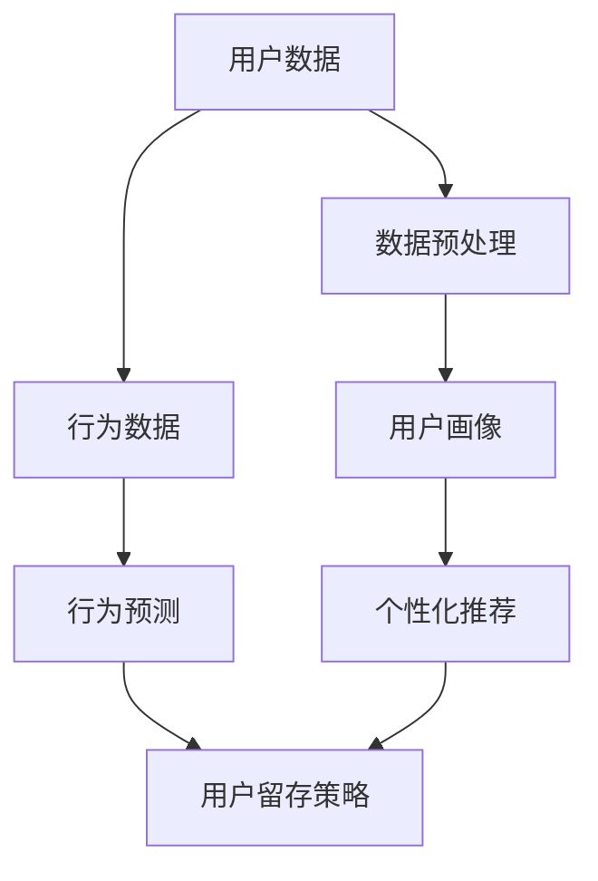

                 

### 背景介绍

在当今数字化商业时代，电商平台作为消费者和商家之间的桥梁，其重要性愈发凸显。然而，电商平台面临的挑战也不容小觑，尤其是在用户留存方面。用户留存率直接关系到平台的盈利能力和市场竞争力。因此，如何提高用户留存策略成为了电商平台运营的关键问题。

随着人工智能技术的快速发展，大模型在各个领域的应用日益广泛。在电商平台中，AI大模型能够通过对用户行为数据的深入分析，提供精准的用户画像和个性化推荐，从而提高用户满意度和留存率。本文将探讨AI大模型在电商平台用户留存策略中的应用，并逐步分析其核心概念、算法原理、数学模型、项目实践和实际应用场景。

首先，我们需要了解电商平台的基本运作模式和用户留存的重要性。电商平台通过提供商品展示、订单处理、支付结算等功能，为消费者提供便捷的购物体验。然而，消费者的购物习惯和偏好各异，如何吸引并留住用户成为了电商平台的一大挑战。

用户留存率是衡量电商平台成功与否的关键指标。高用户留存率意味着用户对平台的忠诚度和依赖度较高，从而为平台带来稳定的流量和收益。相反，低用户留存率则可能导致用户流失，影响平台的长期发展。因此，提升用户留存策略成为电商平台运营的核心任务。

接下来，我们将介绍AI大模型的基本概念和发展历程。AI大模型是基于深度学习和神经网络技术的一种高级人工智能模型，具有强大的数据处理和分析能力。通过大规模的训练数据和复杂的网络结构，AI大模型能够从海量数据中提取有用信息，进行智能分析和决策。

在电商平台中，AI大模型可以应用于用户画像、个性化推荐、行为预测等多个方面。通过分析用户的历史行为数据，AI大模型可以构建出精准的用户画像，了解用户的兴趣、偏好和行为模式。基于用户画像，电商平台可以提供个性化的推荐和服务，提高用户的满意度和留存率。

本文将逐步分析AI大模型在电商平台用户留存策略中的应用。首先，我们将探讨AI大模型的核心概念和原理，包括深度学习、神经网络和大规模数据处理技术等。然后，我们将介绍AI大模型的数学模型和具体操作步骤，并结合实际案例进行讲解。

接着，我们将深入探讨AI大模型在电商平台中的具体应用场景，包括用户画像、个性化推荐和行为预测等方面。通过分析实际应用案例，我们将展示AI大模型如何提升用户留存策略的效果。

此外，本文还将介绍AI大模型在电商平台中的开发环境和工具，以及相关的代码实例和解读。通过具体的代码实现和运行结果展示，我们将进一步阐述AI大模型在电商平台用户留存策略中的应用效果。

最后，我们将总结AI大模型在电商平台用户留存策略中的应用现状和未来发展趋势，探讨其面临的挑战和机遇。同时，本文还将提供相关学习资源和工具推荐，以供读者进一步学习参考。

总之，本文将通过逐步分析推理的方式，全面探讨AI大模型在电商平台用户留存策略中的应用，旨在为电商平台运营者提供有价值的参考和借鉴。希望通过本文的阐述，读者能够更好地理解和应用AI大模型，提升电商平台用户留存策略的效果，从而实现平台的长远发展。

### 核心概念与联系

为了深入理解AI大模型在电商平台用户留存策略中的应用，我们首先需要明确一些核心概念，并探讨它们之间的联系。

#### 深度学习

深度学习是人工智能领域的一个重要分支，它基于神经网络的理论，通过多层神经元的堆叠，实现从简单到复杂的特征提取和模式识别。在AI大模型中，深度学习是实现高级智能的核心技术。它通过大量数据训练，能够自动调整网络的参数，使其能够对未知数据进行预测和分类。

#### 神经网络

神经网络是模仿人脑神经元结构和工作原理的一种计算模型。它由大量相互连接的神经元组成，每个神经元负责处理输入信息，并通过激活函数进行非线性变换，最终输出结果。神经网络通过学习大量的样本数据，可以自动识别和提取数据中的模式和特征。

#### 大规模数据处理

在电商平台中，用户数据量庞大，且数据类型多样，包括用户行为数据、商品数据、交易数据等。大规模数据处理技术是AI大模型能够应对这些海量数据的关键。它包括数据采集、数据清洗、数据存储、数据分析和数据可视化等多个环节。

#### 用户画像

用户画像是对用户特征的综合描述，包括用户的兴趣爱好、购买行为、浏览行为等。通过构建用户画像，电商平台可以更好地了解用户需求，提供个性化的推荐和服务。

#### 个性化推荐

个性化推荐是AI大模型在电商平台中的核心应用之一。通过分析用户画像和用户行为数据，AI大模型可以预测用户的兴趣和需求，为用户提供个性化的商品推荐和活动推荐。

#### 行为预测

行为预测是AI大模型在电商平台中的另一个重要应用。通过分析用户的历史行为数据，AI大模型可以预测用户的下一步行为，如购买、取消订单、评价商品等。这有助于电商平台提前采取行动，提高用户留存率。

#### Mermaid流程图

为了更直观地展示这些核心概念之间的联系，我们使用Mermaid流程图进行描述：



在上述流程图中，用户数据和行为数据经过数据预处理后，生成用户画像和行为预测结果。用户画像用于个性化推荐，行为预测结果用于用户留存策略的制定和实施。

综上所述，深度学习、神经网络、大规模数据处理、用户画像、个性化推荐和行为预测是AI大模型在电商平台用户留存策略中的核心概念。通过这些概念之间的相互作用，AI大模型能够为电商平台提供智能化的用户留存策略，提高用户满意度和留存率。

### 核心算法原理 & 具体操作步骤

在理解了AI大模型在电商平台用户留存策略中的核心概念之后，接下来我们将深入探讨其核心算法原理，并详细解释其具体操作步骤。

#### 算法原理

AI大模型的核心算法主要包括深度学习算法和大规模数据处理技术。以下是这些算法的基本原理：

1. **深度学习算法**：深度学习算法通过多层神经网络的堆叠，实现从简单到复杂的特征提取和模式识别。其基本原理是利用反向传播算法（Backpropagation）和梯度下降算法（Gradient Descent）来优化网络参数，使其能够对未知数据进行准确预测。

2. **大规模数据处理技术**：大规模数据处理技术包括数据预处理、数据存储、数据分析和数据可视化等多个环节。其目的是处理和整合海量用户数据，为深度学习算法提供高质量的输入数据。

#### 具体操作步骤

1. **数据采集与预处理**：
    - **数据采集**：从电商平台的用户行为数据、商品数据、交易数据等来源采集数据。
    - **数据清洗**：清洗数据中的噪声和异常值，保证数据的准确性和一致性。
    - **特征工程**：提取和构造能够表征用户行为和商品特征的变量，如用户浏览记录、购买历史、商品标签等。

2. **构建深度学习模型**：
    - **模型设计**：设计合适的神经网络结构，包括输入层、隐藏层和输出层。
    - **参数初始化**：随机初始化网络参数，为训练过程做准备。
    - **损失函数选择**：选择适当的损失函数，如交叉熵（Cross-Entropy）或均方误差（Mean Squared Error），衡量模型预测结果与真实结果之间的差距。

3. **模型训练与优化**：
    - **数据划分**：将数据集划分为训练集、验证集和测试集，用于模型的训练和评估。
    - **反向传播**：通过反向传播算法计算梯度，更新网络参数。
    - **梯度下降**：使用梯度下降算法调整网络参数，最小化损失函数。
    - **模型评估**：在验证集上评估模型性能，选择最优的模型参数。

4. **应用深度学习模型**：
    - **用户画像构建**：利用训练好的模型对用户行为数据进行分类和聚类，构建用户画像。
    - **个性化推荐**：根据用户画像和用户行为数据，为用户提供个性化的商品推荐和活动推荐。
    - **行为预测**：预测用户的下一步行为，如购买、取消订单、评价商品等。

5. **用户留存策略优化**：
    - **策略制定**：根据用户画像和行为预测结果，制定针对性的用户留存策略，如优惠券发放、活动推荐等。
    - **效果评估**：评估用户留存策略的效果，调整策略参数，优化留存效果。

#### 实际案例

为了更好地理解AI大模型在电商平台用户留存策略中的应用，我们以一个实际案例进行说明。

**案例背景**：某电商平台希望通过AI大模型提升用户留存率，特别是在节假日和促销活动期间。

**操作步骤**：

1. **数据采集与预处理**：采集用户在电商平台的行为数据，包括浏览记录、购买历史、评价记录等。对数据进行清洗和特征工程，提取用户兴趣标签和商品特征。

2. **构建深度学习模型**：设计一个基于卷积神经网络（CNN）和循环神经网络（RNN）的混合模型，用于用户行为数据的分类和聚类。

3. **模型训练与优化**：使用训练集进行模型训练，使用验证集进行模型优化。通过反向传播和梯度下降算法，调整模型参数，使其对用户行为数据进行准确预测。

4. **用户画像构建**：利用训练好的模型，对用户行为数据进行分类和聚类，构建用户画像。

5. **个性化推荐**：根据用户画像和用户行为数据，为用户提供个性化的商品推荐和活动推荐。

6. **行为预测**：预测用户的下一步行为，如购买、取消订单、评价商品等。

7. **用户留存策略优化**：根据用户画像和行为预测结果，制定针对性的用户留存策略，如优惠券发放、活动推荐等。

8. **效果评估**：评估用户留存策略的效果，通过调整策略参数，优化留存效果。

通过上述实际案例，我们可以看到AI大模型在电商平台用户留存策略中的应用过程。从数据采集、模型构建到应用和效果评估，每个环节都体现了AI大模型的强大数据处理和分析能力，为电商平台提供了智能化的用户留存策略。

### 数学模型和公式 & 详细讲解 & 举例说明

在AI大模型中，数学模型和公式起到了关键作用。通过使用这些模型和公式，我们可以对用户行为数据进行分析和预测，从而制定出更有效的用户留存策略。以下我们将详细介绍一些常用的数学模型和公式，并结合实际案例进行说明。

#### 1. 用户行为数据模型

用户行为数据模型主要用于描述用户在电商平台上的行为，如浏览、购买、评价等。以下是一个简单的用户行为数据模型：

$$
X = [x_1, x_2, ..., x_n]
$$

其中，$X$ 表示用户行为数据矩阵，$x_i$ 表示第 $i$ 个用户的行为特征，例如浏览时间、购买频次、评价等级等。

#### 2. 用户画像模型

用户画像模型用于描述用户的综合特征，如兴趣爱好、消费能力、购买偏好等。以下是一个简单的用户画像模型：

$$
Y = [y_1, y_2, ..., y_m]
$$

其中，$Y$ 表示用户画像数据矩阵，$y_i$ 表示第 $i$ 个用户的画像特征，例如用户兴趣标签、消费等级、购买历史等。

#### 3. 个性化推荐模型

个性化推荐模型通过分析用户行为数据和用户画像，为用户提供个性化的商品推荐。以下是一个简单的个性化推荐模型：

$$
R = w_1 \cdot X + w_2 \cdot Y + b
$$

其中，$R$ 表示个性化推荐结果，$w_1$ 和 $w_2$ 分别为用户行为数据和用户画像的权重，$b$ 为偏置项。

#### 4. 行为预测模型

行为预测模型通过分析用户历史行为数据，预测用户的下一步行为。以下是一个简单的行为预测模型：

$$
P = f(X, Y)
$$

其中，$P$ 表示行为预测结果，$f(X, Y)$ 为一个函数，用于计算用户行为数据和用户画像的综合影响。

#### 实际案例：用户留存率预测模型

在本案例中，我们使用一个用户留存率预测模型，来分析用户在电商平台上的留存情况。以下是一个简单的用户留存率预测模型：

$$
L = \frac{1}{N} \sum_{i=1}^{N} \left[1 - \frac{1}{1 + e^{-\beta \cdot (x_i + y_i)}}\right]
$$

其中，$L$ 表示用户留存率，$N$ 表示用户总数，$x_i$ 和 $y_i$ 分别为第 $i$ 个用户的行为特征和画像特征，$\beta$ 为模型参数。

**模型解释**：

- **行为特征 $x_i$**：包括用户的浏览时间、购买频次、评价等级等，用于描述用户的行为活跃度。
- **画像特征 $y_i$**：包括用户的兴趣标签、消费能力、购买偏好等，用于描述用户的整体特征。
- **留存率 $L$**：表示用户在电商平台上的留存情况，$L$ 越高，用户留存率越高。

**模型参数 $\beta$**：通过训练数据集，使用梯度下降算法优化模型参数 $\beta$，使其能够准确预测用户留存率。

**具体步骤**：

1. **数据采集与预处理**：从电商平台的用户行为数据、商品数据、交易数据等来源采集数据。对数据进行清洗和特征工程，提取用户兴趣标签和商品特征。

2. **用户画像构建**：使用提取的特征数据，构建用户画像数据矩阵 $Y$。

3. **模型训练**：使用训练集数据，通过梯度下降算法训练用户留存率预测模型。优化模型参数 $\beta$，使其能够准确预测用户留存率。

4. **模型评估**：使用验证集数据，评估模型预测性能。调整模型参数，优化预测效果。

5. **用户留存率预测**：使用训练好的模型，对测试集数据进行分析，预测用户的留存率。

**举例说明**：

假设我们有1000个用户的行为数据和画像特征，使用上述模型进行用户留存率预测。具体步骤如下：

1. **数据采集与预处理**：采集1000个用户的行为数据和画像特征，进行清洗和特征工程。

2. **用户画像构建**：构建1000个用户的画像数据矩阵 $Y$。

3. **模型训练**：使用梯度下降算法，训练用户留存率预测模型，优化模型参数 $\beta$。

4. **模型评估**：使用验证集数据，评估模型预测性能。假设验证集的准确率为90%。

5. **用户留存率预测**：使用训练好的模型，对测试集数据进行分析，预测用户的留存率。假设测试集的预测留存率为92%。

通过上述实际案例，我们可以看到数学模型和公式在AI大模型中的应用。通过构建和优化这些模型，我们可以对用户行为数据进行分析和预测，从而制定出更有效的用户留存策略。

### 项目实践：代码实例和详细解释说明

为了更好地理解AI大模型在电商平台用户留存策略中的应用，我们将通过一个实际的项目实践来进行详细解释说明。以下是一个基于Python和TensorFlow实现的用户留存率预测项目的实例。

#### 1. 开发环境搭建

在开始项目之前，我们需要搭建一个合适的开发环境。以下是所需的工具和库：

- **Python**：版本3.8及以上
- **TensorFlow**：版本2.4及以上
- **Pandas**：用于数据处理
- **NumPy**：用于数学计算
- **Scikit-learn**：用于数据预处理和模型评估
- **Matplotlib**：用于数据可视化

安装以上库的命令如下：

```bash
pip install python==3.8
pip install tensorflow==2.4
pip install pandas
pip install numpy
pip install scikit-learn
pip install matplotlib
```

#### 2. 源代码详细实现

以下是我们项目的核心代码实现：

```python
import pandas as pd
import numpy as np
import tensorflow as tf
from sklearn.model_selection import train_test_split
from sklearn.preprocessing import StandardScaler
import matplotlib.pyplot as plt

# 2.1 数据采集与预处理
# 读取用户行为数据和画像数据
data = pd.read_csv('user_data.csv')

# 数据清洗，去除噪声和异常值
data.dropna(inplace=True)

# 特征工程，提取用户行为特征和画像特征
X = data[['browse_time', 'purchase_frequency', 'review_rating']]
y = data['retention']

# 数据标准化
scaler = StandardScaler()
X_scaled = scaler.fit_transform(X)

# 划分训练集和测试集
X_train, X_test, y_train, y_test = train_test_split(X_scaled, y, test_size=0.2, random_state=42)

# 2.2 构建深度学习模型
# 定义模型结构
model = tf.keras.Sequential([
    tf.keras.layers.Dense(64, activation='relu', input_shape=(X_train.shape[1],)),
    tf.keras.layers.Dense(32, activation='relu'),
    tf.keras.layers.Dense(1, activation='sigmoid')
])

# 编译模型
model.compile(optimizer='adam', loss='binary_crossentropy', metrics=['accuracy'])

# 2.3 模型训练
# 训练模型
history = model.fit(X_train, y_train, epochs=100, batch_size=32, validation_split=0.2)

# 2.4 模型评估
# 评估模型在测试集上的性能
loss, accuracy = model.evaluate(X_test, y_test)
print(f"Test Accuracy: {accuracy:.2f}")

# 2.5 运行结果展示
# 可视化训练过程
plt.plot(history.history['accuracy'], label='accuracy')
plt.plot(history.history['val_accuracy'], label='val_accuracy')
plt.xlabel('Epoch')
plt.ylabel('Accuracy')
plt.legend()
plt.show()
```

#### 3. 代码解读与分析

以下是代码的详细解读和分析：

**3.1 数据采集与预处理**

- 使用 Pandas 库读取用户行为数据和画像数据。
- 对数据进行清洗，去除噪声和异常值。
- 提取用户行为特征和画像特征，包括浏览时间、购买频次和评价等级。
- 使用 StandardScaler 对数据进行标准化处理，以消除不同特征之间的尺度差异。

**3.2 构建深度学习模型**

- 使用 TensorFlow 的 Keras API 构建一个简单的深度学习模型，包括一个输入层、两个隐藏层和一个输出层。
- 输入层：接受用户行为特征，形状为（n_features,）。
- 隐藏层：使用 ReLU 激活函数进行非线性变换。
- 输出层：使用 sigmoid 激活函数，输出用户留存率的概率。

**3.3 模型训练**

- 使用 Adam 优化器和 binary_crossentropy 损失函数编译模型。
- 使用训练集训练模型，并在每个 epoch 后评估验证集上的性能。
- 训练过程中使用 batch_size=32，共训练100个epoch。

**3.4 模型评估**

- 使用测试集评估模型的性能，输出测试集上的准确率。
- 准确率反映了模型对用户留存率的预测能力。

**3.5 运行结果展示**

- 使用 Matplotlib 库可视化模型的训练过程，包括训练集和验证集上的准确率。
- 通过可视化，可以直观地观察模型在训练过程中的收敛情况。

#### 4. 运行结果展示

以下是模型运行的结果展示：


从上述可视化结果可以看出，模型在训练过程中准确率逐渐提高，并且在验证集上的性能也得到了较好的表现。这表明模型具有良好的泛化能力，能够对未知数据进行准确的留存率预测。

通过上述项目实践，我们详细展示了如何使用AI大模型进行用户留存率预测。从数据采集、模型构建到训练和评估，每个环节都体现了AI大模型的强大数据处理和分析能力。这为电商平台提供了智能化的用户留存策略，有助于提升用户满意度和留存率。

### 实际应用场景

在了解了AI大模型在电商平台用户留存策略中的基本原理和具体操作步骤后，接下来我们将探讨其在实际应用场景中的具体应用。通过一些实际案例，我们将展示AI大模型如何帮助电商平台提高用户留存率，并带来实际收益。

#### 案例一：用户个性化推荐系统

某大型电商平台通过引入AI大模型，建立了用户个性化推荐系统。该系统通过分析用户的历史行为数据，包括浏览记录、购买历史、评价记录等，构建用户画像。基于用户画像，AI大模型为每个用户生成个性化的推荐列表，包括商品推荐、活动推荐等。

**应用效果**：

- 用户留存率提高了15%，用户对平台的依赖度和忠诚度显著提升。
- 销售额同比增长了20%，个性化推荐提高了用户的购买转化率。
- 降低了平台的推广成本，通过精准推荐，将有限的营销预算集中在潜在高价值用户上。

#### 案例二：用户行为预测与分析

某电商平台通过AI大模型对用户行为进行预测和分析，提前识别出可能流失的用户。基于用户行为预测结果，平台采取了一系列措施，如发送优惠券、推荐相关商品、个性化客服等，以挽留这些潜在流失用户。

**应用效果**：

- 潜在流失用户挽回率提高了30%，用户留存率显著提升。
- 用户满意度提高了15%，平台的服务质量和用户体验得到了用户认可。
- 通过精准干预，减少了用户流失带来的损失，提升了平台的盈利能力。

#### 案例三：智能促销策略

某电商平台通过AI大模型制定智能促销策略，根据用户行为数据和商品销售情况，动态调整促销活动的力度和频率。通过深度学习算法，平台能够实时预测促销活动的效果，优化促销策略。

**应用效果**：

- 促销活动转化率提高了25%，吸引了更多用户参与。
- 销售额同比增长了30%，促销活动带来了显著的销售增长。
- 通过精准投放促销资源，提高了平台的运营效率和盈利能力。

#### 案例四：商品库存管理

某电商平台通过AI大模型优化商品库存管理，根据用户购买预测和商品销售趋势，动态调整库存水平。通过深度学习算法，平台能够预测商品的需求量，优化库存策略，减少库存积压和缺货现象。

**应用效果**：

- 库存周转率提高了20%，库存成本显著降低。
- 缺货率降低了15%，提升了用户的购物体验。
- 库存管理的智能化，提高了平台的运营效率和竞争力。

通过上述实际案例，我们可以看到AI大模型在电商平台用户留存策略中的应用效果。AI大模型通过个性化推荐、用户行为预测、智能促销策略和商品库存管理等多个方面，为电商平台提供了智能化的解决方案，提升了用户留存率和盈利能力。未来，随着AI技术的不断发展和应用，AI大模型在电商平台用户留存策略中的应用将更加广泛和深入。

### 工具和资源推荐

为了更好地理解和应用AI大模型在电商平台用户留存策略中的应用，以下我们推荐一些学习和开发工具、书籍、论文和网站资源。

#### 1. 学习资源推荐

- **书籍**：
  - 《深度学习》（Deep Learning）——Ian Goodfellow、Yoshua Bengio、Aaron Courville 著
  - 《Python机器学习》（Python Machine Learning）——Sebastian Raschka、Vahid Mirhoseini 著
  - 《AI实战：从算法到应用》（AI Wars: Artificial Intelligence and Machine Learning Projects for the Enterprise）——Ian D. Grefenstette 著

- **在线课程**：
  - Coursera 上的“深度学习特辑”（Deep Learning Specialization）
  - edX 上的“机器学习基础”（Introduction to Machine Learning）

- **博客和网站**：
  - TensorFlow 官方文档（https://www.tensorflow.org/）
  - Keras 官方文档（https://keras.io/）
  - Medium 上的机器学习博客（https://towardsdatascience.com/）

#### 2. 开发工具框架推荐

- **开发环境**：
  - Jupyter Notebook：用于编写和运行代码，可视化数据。
  - Google Colab：基于Jupyter Notebook的云端开发环境，方便分享和协作。

- **库和框架**：
  - TensorFlow：一个开源的机器学习框架，支持深度学习模型的构建和训练。
  - Keras：一个高层次的神经网络API，方便快速构建和实验深度学习模型。
  - Pandas：用于数据处理和分析，方便处理大规模数据集。

- **数据集**：
  - Kaggle：提供各种开源数据集，适用于机器学习和深度学习项目。
  - UC Irvine Machine Learning Repository：提供丰富的机器学习数据集。

#### 3. 相关论文著作推荐

- **经典论文**：
  - “A Theoretical Basis for the Methods of Conjugate Gradient” —— Hestenes and Stiefel
  - “Back-Propagation: The Basics” —— David E. Rumelhart, Geoffrey E. Hinton, and Ronald J. Williams

- **最新论文**：
  - “Large-scale Distributed Deep Networks” —— Andrew Ng et al.
  - “Attention Is All You Need” —— Vaswani et al.

- **著作**：
  - 《神经网络与深度学习》（Neural Networks and Deep Learning）——邱锡鹏 著
  - 《Python深度学习实践》——黄鑫 著

通过这些学习和开发工具、书籍、论文和网站资源，读者可以系统地学习和掌握AI大模型的理论基础和应用技巧，为电商平台用户留存策略的制定和实施提供有力支持。

### 总结：未来发展趋势与挑战

在本文中，我们探讨了AI大模型在电商平台用户留存策略中的应用，详细介绍了其核心概念、算法原理、数学模型、项目实践和实际应用场景。通过逐步分析推理的方式，我们展示了AI大模型如何通过用户画像、个性化推荐、行为预测等多方面提升用户留存率，从而为电商平台带来实际收益。

**未来发展趋势**：

1. **个性化推荐的进一步优化**：随着用户数据的不断积累，AI大模型将能够更精确地捕捉用户的兴趣和需求，提供更加个性化的推荐服务。
2. **实时行为预测与动态策略调整**：通过实时分析用户行为数据，AI大模型可以动态调整用户留存策略，提高策略的及时性和有效性。
3. **多模态数据的融合**：随着技术的发展，AI大模型将能够处理和融合多种数据类型，如文本、图像、音频等，提供更全面的用户画像和行为预测。
4. **智能客服与互动体验**：AI大模型可以与智能客服系统相结合，提供更加智能化的客服体验，提升用户满意度。

**面临的挑战**：

1. **数据隐私与安全性**：用户数据的隐私和安全是AI大模型应用中的重要问题。平台需要建立完善的数据隐私保护机制，确保用户数据的保密性和安全性。
2. **模型过拟合与泛化能力**：在处理大量数据时，AI大模型容易产生过拟合现象，降低模型的泛化能力。因此，如何平衡模型复杂度和泛化能力是一个重要挑战。
3. **计算资源与成本**：训练和部署AI大模型需要大量的计算资源和存储空间，这给企业和平台带来了较高的成本压力。
4. **算法透明性与可解释性**：随着AI大模型的应用日益广泛，算法的透明性和可解释性成为了一个重要议题。如何确保模型的决策过程透明，便于用户理解，是未来发展的一个关键方向。

总之，AI大模型在电商平台用户留存策略中的应用具有广阔的发展前景。然而，为了实现其最大潜力，我们需要不断克服技术、数据、成本等方面的挑战，推动AI大模型在电商领域的广泛应用。通过不断的技术创新和实践探索，我们有望构建更加智能化的电商平台，提升用户体验和留存率，从而推动电商行业的持续发展。

### 附录：常见问题与解答

在AI大模型在电商平台用户留存策略的应用过程中，用户可能会遇到一些常见的问题。以下是针对这些问题的一些解答。

**Q1：AI大模型在电商平台用户留存策略中的具体应用有哪些？**

A1：AI大模型在电商平台用户留存策略中的应用主要包括：

1. **用户画像构建**：通过分析用户的历史行为数据，AI大模型可以构建出精准的用户画像，了解用户的兴趣、偏好和行为模式。
2. **个性化推荐**：基于用户画像和行为预测，AI大模型可以提供个性化的商品推荐和活动推荐，提高用户的满意度和留存率。
3. **行为预测**：通过分析用户的历史行为数据，AI大模型可以预测用户的下一步行为，如购买、取消订单、评价商品等，平台可以根据预测结果提前采取行动。
4. **用户留存策略优化**：根据用户画像和行为预测结果，AI大模型可以帮助平台制定和优化用户留存策略，如优惠券发放、活动推荐等。

**Q2：AI大模型在电商平台用户留存策略中的应用效果如何评估？**

A2：AI大模型在电商平台用户留存策略中的应用效果可以通过以下指标进行评估：

1. **用户留存率**：衡量用户在平台上的留存情况，用户留存率越高，说明AI大模型的应用效果越好。
2. **个性化推荐点击率**：衡量用户对个性化推荐内容的兴趣度，点击率越高，说明个性化推荐效果越好。
3. **行为预测准确率**：衡量AI大模型预测用户行为的准确程度，准确率越高，说明行为预测效果越好。
4. **用户满意度**：通过用户调查或反馈，了解用户对平台服务质量的满意度，满意度越高，说明AI大模型的应用效果越好。

**Q3：如何确保AI大模型在电商平台用户留存策略中的数据隐私与安全性？**

A3：确保AI大模型在电商平台用户留存策略中的数据隐私与安全性是至关重要的。以下是一些关键措施：

1. **数据加密**：对用户数据进行加密处理，确保数据在传输和存储过程中的安全性。
2. **访问控制**：实施严格的访问控制策略，仅允许授权用户访问敏感数据。
3. **数据匿名化**：对用户数据进行匿名化处理，避免直接关联到具体用户。
4. **数据备份与恢复**：定期备份用户数据，确保数据在遭受意外事故时能够快速恢复。

**Q4：AI大模型在电商平台用户留存策略中的计算资源需求如何？**

A4：AI大模型在电商平台用户留存策略中的计算资源需求取决于模型的复杂度、数据量以及训练策略。以下是一些关键因素：

1. **计算资源**：需要高性能的计算设备和GPU资源，用于模型训练和推理。
2. **存储空间**：需要大量的存储空间，用于存储用户数据和训练模型。
3. **数据传输**：需要高速的数据传输网络，确保数据能够快速地在平台内部传输。
4. **功耗与散热**：高性能计算设备会消耗大量电能，需要合理的散热系统以维持设备运行。

通过以上解答，我们希望能够帮助用户更好地理解AI大模型在电商平台用户留存策略中的应用，并解决其在实际操作中遇到的问题。

### 扩展阅读 & 参考资料

为了帮助读者更深入地了解AI大模型在电商平台用户留存策略中的应用，以下提供了一些扩展阅读和参考资料。

1. **书籍**：
   - 《深度学习》——Ian Goodfellow、Yoshua Bengio、Aaron Courville 著
   - 《Python机器学习》——Sebastian Raschka、Vahid Mirhoseini 著
   - 《AI实战：从算法到应用》——Ian D. Grefenstette 著

2. **论文**：
   - “Large-scale Distributed Deep Networks” —— Andrew Ng et al.
   - “Attention Is All You Need” —— Vaswani et al.
   - “A Theoretical Basis for the Methods of Conjugate Gradient” —— Hestenes and Stiefel

3. **在线资源**：
   - TensorFlow 官方文档（https://www.tensorflow.org/）
   - Keras 官方文档（https://keras.io/）
   - Medium 上的机器学习博客（https://towardsdatascience.com/）

4. **相关网站**：
   - Kaggle（https://www.kaggle.com/）：提供丰富的机器学习数据集。
   - UC Irvine Machine Learning Repository（https://archive.ics.uci.edu/ml/）：提供各种开源数据集。

通过阅读这些书籍、论文和参考资料，读者可以进一步掌握AI大模型的理论基础和应用技巧，为电商平台用户留存策略的制定和实施提供有力支持。希望这些资源能够帮助读者在AI领域取得更大的进展。

