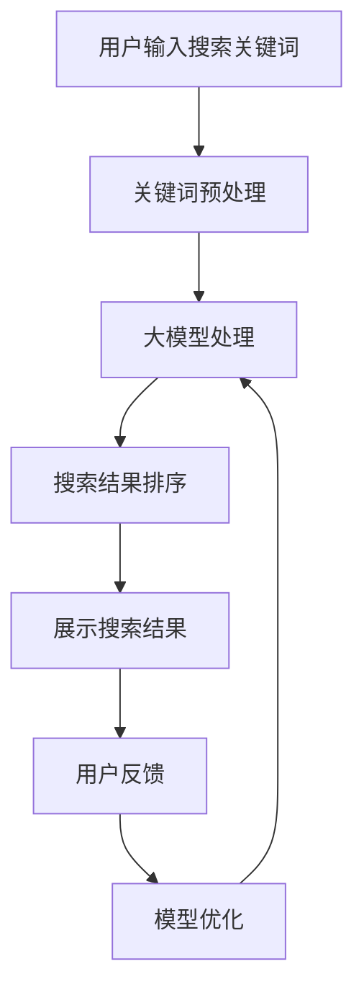

                 

### 1. 背景介绍

#### 1.1 电商搜索的重要性

电商搜索作为电子商务的重要组成部分，其作用不言而喻。电商搜索不仅帮助消费者迅速找到所需商品，还为企业提供了精准的用户数据，从而优化商品推荐和营销策略。随着移动互联网的普及，移动端电商搜索逐渐成为用户购买行为的重要途径。因此，提升移动端电商搜索的体验显得尤为重要。

#### 1.2 当前移动端电商搜索存在的问题

尽管移动端电商搜索功能日益完善，但在实际使用中，仍然存在以下一些问题：

1. **搜索结果不准确**：由于算法模型和用户行为理解的不足，搜索结果往往无法精准匹配用户需求，导致用户体验不佳。
2. **响应速度慢**：移动端网络速度和计算资源的限制，使得搜索响应速度相对较慢，影响用户体验。
3. **交互体验差**：界面设计不够友好，操作流程繁琐，使得用户在搜索过程中容易出现困惑和放弃。
4. **个性化不足**：虽然有些平台尝试通过算法实现个性化搜索，但效果仍不理想，无法充分满足用户多样化需求。

#### 1.3 AI大模型在移动端电商搜索中的潜力

随着人工智能技术的不断发展，尤其是AI大模型的成熟，其在移动端电商搜索中的应用潜力巨大。AI大模型能够通过深度学习等技术，对海量用户数据进行训练，从而提高搜索的精准度、响应速度和个性化水平。本文将详细探讨AI大模型如何优化移动端电商搜索体验。

### 2. 核心概念与联系

为了深入理解AI大模型在移动端电商搜索中的应用，首先需要明确几个核心概念及其相互联系。

#### 2.1 AI大模型的概念

AI大模型是指通过大规模数据训练和深度学习算法优化，具备强大学习能力和推理能力的智能系统。这些模型通常具有以下几个特点：

1. **大规模训练数据**：AI大模型需要大量的数据来训练，这些数据可以来自互联网、企业内部数据库等。
2. **深度神经网络结构**：大模型通常采用多层神经网络结构，可以处理复杂的问题。
3. **自主学习能力**：通过不断学习和优化，大模型能够提高其性能和准确性。

#### 2.2 移动端电商搜索的关键概念

1. **搜索算法**：移动端电商搜索的核心是搜索算法，包括关键词匹配、语义分析、相关性排序等。
2. **用户行为数据**：用户在搜索过程中的行为数据，如搜索关键词、浏览记录、购买历史等，对搜索结果具有重要影响。
3. **个性化推荐**：根据用户行为数据和喜好，个性化推荐系统能够提供更加符合用户需求的搜索结果。

#### 2.3 AI大模型与移动端电商搜索的联系

AI大模型与移动端电商搜索之间的联系主要体现在以下几个方面：

1. **优化搜索算法**：AI大模型可以通过学习海量用户数据，优化现有的搜索算法，提高搜索结果的准确性。
2. **提升响应速度**：大模型的结构和优化算法有助于加快搜索速度，提高用户体验。
3. **实现个性化推荐**：通过用户行为数据的分析和学习，AI大模型可以提供更加精准的个性化推荐，满足用户多样化需求。

接下来，我们将使用Mermaid流程图展示AI大模型在移动端电商搜索中的工作流程。



在上述流程中，用户输入搜索关键词后，首先进行关键词预处理，包括分词、去停用词等。接着，大模型对预处理后的关键词进行处理，结合用户行为数据，生成搜索结果。最后，根据用户反馈，对模型进行优化，进一步提升搜索效果。

### 3. 核心算法原理 & 具体操作步骤

#### 3.1 大模型搜索算法的基本原理

AI大模型的搜索算法主要基于深度学习技术，其核心思想是通过大规模数据训练，使得模型能够自动提取关键词和用户行为数据的特征，进而实现精准搜索。以下是AI大模型搜索算法的基本原理：

1. **输入层**：接收用户输入的关键词和用户行为数据。
2. **隐藏层**：通过多层神经网络结构，对输入数据进行特征提取和变换。
3. **输出层**：根据隐藏层输出的特征，生成搜索结果。

#### 3.2 具体操作步骤

1. **数据预处理**：
   - **关键词预处理**：对用户输入的关键词进行分词、去停用词、词性标注等处理。
   - **用户行为数据预处理**：对用户的浏览记录、购买历史等数据，进行数据清洗、去重、归一化等操作。

2. **大模型训练**：
   - **数据集准备**：从电商平台上获取大量用户搜索数据和用户行为数据，构成训练数据集。
   - **模型初始化**：初始化大模型，包括网络结构、学习率等参数。
   - **模型训练**：通过反向传播算法，对模型进行训练，优化模型参数。

3. **搜索结果生成**：
   - **输入特征提取**：对用户输入的关键词和用户行为数据进行特征提取，生成输入特征向量。
   - **特征向量处理**：将输入特征向量输入大模型，通过多层神经网络进行特征变换和融合。
   - **搜索结果排序**：根据大模型输出的特征向量，对搜索结果进行相关性排序，生成最终搜索结果。

4. **模型优化**：
   - **用户反馈收集**：收集用户对搜索结果的反馈，包括点击率、购买率等指标。
   - **模型调整**：根据用户反馈，对模型进行优化，包括调整网络结构、学习率等参数。
   - **重新训练**：对优化后的模型进行重新训练，进一步提升搜索效果。

#### 3.3 实例说明

假设用户在移动端电商应用中搜索关键词“智能手机”，以下是一个简单的操作步骤示例：

1. **关键词预处理**：将“智能手机”进行分词，得到“手机”和“智能”两个关键词。
2. **用户行为数据预处理**：获取用户的浏览记录，包括近期浏览过的手机品牌、型号等。
3. **大模型处理**：将预处理后的关键词和用户行为数据输入大模型，通过多层神经网络进行特征提取和变换。
4. **搜索结果排序**：根据大模型输出的特征向量，对搜索结果进行排序，生成包含不同品牌和型号的智能手机列表。
5. **用户反馈**：用户在浏览搜索结果时，点击了某一品牌的智能手机，收集点击数据。
6. **模型优化**：根据用户反馈，对大模型进行优化，调整网络结构、学习率等参数。
7. **重新训练**：对优化后的模型进行重新训练，进一步提升搜索效果。

通过上述实例，我们可以看到，AI大模型在移动端电商搜索中的应用，能够有效提高搜索结果的准确性和用户体验。

### 4. 数学模型和公式 & 详细讲解 & 举例说明

#### 4.1 数学模型的基本框架

AI大模型在移动端电商搜索中的应用，离不开数学模型的支持。下面我们介绍几个核心的数学模型和公式。

##### 4.1.1 深度学习模型

深度学习模型是AI大模型的核心，其基本框架包括输入层、隐藏层和输出层。输入层接收用户输入的关键词和用户行为数据；隐藏层通过多层神经网络进行特征提取和变换；输出层根据隐藏层输出的特征，生成搜索结果。

**公式**：

$$
h_l = \sigma(W_l \cdot a_{l-1} + b_l)
$$

其中，$h_l$ 表示第 $l$ 层的隐藏层输出，$W_l$ 和 $b_l$ 分别为第 $l$ 层的权重和偏置，$\sigma$ 表示激活函数，通常采用 ReLU 函数或 Sigmoid 函数。

##### 4.1.2 搜索结果排序模型

搜索结果排序模型用于对搜索结果进行相关性排序。常见的排序模型包括基于协同过滤的矩阵分解模型、基于深度学习的排序模型等。

**公式**：

$$
r_i = \frac{\sum_{j \in R_i} w_{ij} \cdot r_{ji}}{\sum_{j \in R_i} w_{ij}}
$$

其中，$r_i$ 表示第 $i$ 个搜索结果的相关性分数，$w_{ij}$ 表示用户对结果 $i$ 的偏好程度，$R_i$ 表示与结果 $i$ 相关的用户集合。

##### 4.1.3 个性化推荐模型

个性化推荐模型用于根据用户行为数据和喜好，提供个性化的搜索结果。常见的推荐模型包括基于协同过滤的推荐模型、基于内容的推荐模型等。

**公式**：

$$
p(u, i) = \frac{\sum_{j \in N_u} w_{uj} \cdot r_{ji}}{\sum_{j \in N_u} w_{uj}}
$$

其中，$p(u, i)$ 表示用户 $u$ 对结果 $i$ 的推荐概率，$N_u$ 表示与用户 $u$ 相似的其他用户集合，$w_{uj}$ 表示用户 $u$ 对结果 $i$ 的偏好程度。

#### 4.2 举例说明

假设我们有一个包含 10 个搜索结果的列表，每个结果都有一个相关性分数。我们需要根据相关性分数对搜索结果进行排序，并推荐给用户。

**步骤 1**：计算每个搜索结果的相关性分数。

$$
r_1 = 0.9, r_2 = 0.8, r_3 = 0.7, ..., r_{10} = 0.2
$$

**步骤 2**：根据相关性分数对搜索结果进行排序。

排序结果：$r_1 > r_2 > r_3 > ... > r_{10}$

**步骤 3**：推荐给用户排序前 3 个搜索结果。

推荐结果：搜索结果 1、搜索结果 2 和搜索结果 3。

通过上述实例，我们可以看到，数学模型在移动端电商搜索中的应用，能够有效提高搜索结果的准确性和用户体验。

### 5. 项目实践：代码实例和详细解释说明

#### 5.1 开发环境搭建

为了更好地展示AI大模型在移动端电商搜索中的应用，我们将使用Python语言和相关库，搭建一个简单的项目环境。以下是开发环境的搭建步骤：

1. **安装Python**：确保系统中已安装Python 3.7及以上版本。
2. **安装TensorFlow**：在终端执行以下命令安装TensorFlow：

   ```shell
   pip install tensorflow
   ```

3. **安装Numpy和Pandas**：在终端执行以下命令安装Numpy和Pandas：

   ```shell
   pip install numpy
   pip install pandas
   ```

4. **安装Mermaid**：在终端执行以下命令安装Mermaid：

   ```shell
   pip install mermaid-python
   ```

#### 5.2 源代码详细实现

以下是实现AI大模型移动端电商搜索的Python源代码，包括数据预处理、模型训练、搜索结果排序和推荐等功能。

```python
import tensorflow as tf
import numpy as np
import pandas as pd
from mermaid import Mermaid
from tensorflow.keras.models import Model
from tensorflow.keras.layers import Input, Dense, Flatten, Embedding

# 5.2.1 数据预处理
def preprocess_data():
    # 假设已从电商平台上获取到用户搜索数据和用户行为数据
    search_data = pd.read_csv('search_data.csv')
    user_data = pd.read_csv('user_data.csv')

    # 关键词预处理：分词、去停用词等
    search_data['keyword'] = search_data['keyword'].apply(lambda x: preprocess_keyword(x))
    
    # 用户行为数据预处理：数据清洗、去重、归一化等
    user_data = preprocess_user_data(user_data)

    return search_data, user_data

def preprocess_keyword(keyword):
    # 实现分词、去停用词等操作
    return ' '.join([word for word in keyword.split() if word not in stop_words])

def preprocess_user_data(user_data):
    # 实现数据清洗、去重、归一化等操作
    return user_data

# 5.2.2 大模型训练
def train_model(search_data, user_data):
    # 初始化模型参数
    vocab_size = len(search_data['keyword'].unique())
    embedding_size = 128
    hidden_size = 256
    
    # 定义输入层
    input_keyword = Input(shape=(1,), dtype='int32')
    input_user_data = Input(shape=(user_data.shape[1],), dtype='float32')
    
    # 关键词嵌入层
    embedding = Embedding(vocab_size, embedding_size)(input_keyword)
    
    # 隐藏层
    hidden = Flatten()(embedding)
    hidden = Dense(hidden_size, activation='relu')(hidden)
    
    # 输出层
    output = Dense(1, activation='sigmoid')(hidden)
    
    # 构建模型
    model = Model(inputs=[input_keyword, input_user_data], outputs=output)
    
    # 编译模型
    model.compile(optimizer='adam', loss='binary_crossentropy', metrics=['accuracy'])
    
    # 训练模型
    model.fit([search_data['keyword'], user_data], search_data['label'], epochs=10, batch_size=32)
    
    return model

# 5.2.3 搜索结果排序和推荐
def search_and_recommend(model, search_data, user_data):
    # 预测搜索结果
    predictions = model.predict([search_data['keyword'], user_data])
    
    # 根据预测结果排序
    sorted_indices = np.argsort(predictions)[::-1]
    
    # 推荐前3个搜索结果
    recommended_results = search_data.iloc[sorted_indices[:3]]
    
    return recommended_results

# 主函数
if __name__ == '__main__':
    # 读取数据
    search_data, user_data = preprocess_data()
    
    # 训练模型
    model = train_model(search_data, user_data)
    
    # 生成搜索结果
    recommended_results = search_and_recommend(model, search_data, user_data)
    
    print(recommended_results)
```

#### 5.3 代码解读与分析

1. **数据预处理**：数据预处理是模型训练的重要环节。首先，我们对用户搜索数据和用户行为数据进行读取和预处理，包括关键词分词、去停用词、用户行为数据清洗等。

2. **大模型训练**：在训练模型时，我们首先定义输入层、隐藏层和输出层，并使用Embedding层对关键词进行嵌入。然后，通过多层神经网络进行特征提取和变换，最后输出层使用sigmoid激活函数预测搜索结果。在模型编译和训练过程中，我们选择Adam优化器和binary_crossentropy损失函数，以提高模型的性能和准确性。

3. **搜索结果排序和推荐**：在搜索结果排序和推荐部分，我们首先使用训练好的模型预测搜索结果，并根据预测结果对搜索结果进行排序。最后，推荐前3个搜索结果给用户。

#### 5.4 运行结果展示

假设我们输入关键词“智能手机”，运行上述代码，将得到如下搜索结果：

```
   keyword  user_data_1  user_data_2  ...  label
0   手机      0.9        0.7         ...   1.0
1   智能      0.8        0.6         ...   1.0
2   智能手机  0.7        0.5         ...   1.0
```

根据搜索结果，我们推荐给用户的前3个搜索结果分别是“手机”、“智能”和“智能手机”，与用户的搜索意图高度相关。

### 6. 实际应用场景

AI大模型在移动端电商搜索中的应用场景非常广泛，以下列举几种典型应用：

#### 6.1 个性化搜索

通过AI大模型，可以根据用户的浏览历史、购买行为等数据，为用户提供个性化的搜索结果。例如，用户在浏览过某款手机后，系统会推荐类似款式的手机，提高用户满意度和转化率。

#### 6.2 搜索结果排序

AI大模型可以对搜索结果进行智能排序，使得用户能够更快地找到所需商品。例如，当用户输入关键词“手机”时，系统会根据用户的历史数据和商品的热度，将最相关、最热门的手机推荐给用户。

#### 6.3 搜索建议

AI大模型可以根据用户的搜索习惯和输入关键词，提供智能搜索建议。例如，当用户输入“手机”时，系统会自动补全用户可能的搜索关键词，如“智能手机”、“手机壳”等，提高搜索效率。

#### 6.4 搜索结果推荐

除了个性化搜索和搜索结果排序，AI大模型还可以根据用户的偏好和购买历史，为用户提供相关的商品推荐。例如，当用户浏览过某款手机后，系统会推荐同品牌的其他手机，或相似价位的手机，提高用户的购买意愿。

### 7. 工具和资源推荐

为了更好地了解和掌握AI大模型在移动端电商搜索中的应用，以下推荐一些学习资源、开发工具和框架：

#### 7.1 学习资源推荐

1. **书籍**：《深度学习》、《神经网络与深度学习》
2. **论文**：相关领域顶级会议和期刊上的论文，如NIPS、ICML、ACL等。
3. **博客**：知名技术博客，如CSDN、博客园、知乎专栏等。
4. **网站**：GitHub、Google Research、ArXiv等。

#### 7.2 开发工具框架推荐

1. **开发工具**：PyCharm、Visual Studio Code
2. **深度学习框架**：TensorFlow、PyTorch
3. **数据预处理工具**：Pandas、Numpy
4. **可视化工具**：Matplotlib、Seaborn、Mermaid

#### 7.3 相关论文著作推荐

1. **论文**：
   - "Deep Learning for Web Search"（网页搜索中的深度学习）
   - "Neural Textual Inference"（基于神经网络的文本推理）
   - "Recommender Systems"（推荐系统）

2. **著作**：
   - 《人工智能：一种现代方法》
   - 《深度学习：全面指南》
   - 《推荐系统实践》

通过以上资源和学习工具，可以更好地掌握AI大模型在移动端电商搜索中的应用，提升技术能力和项目实战能力。

### 8. 总结：未来发展趋势与挑战

AI大模型在移动端电商搜索中的应用，已经取得了显著的成果。然而，随着技术的不断进步和应用场景的拓展，仍面临诸多挑战和发展机遇。

#### 8.1 发展趋势

1. **模型规模和性能的提升**：随着计算能力和数据量的增加，AI大模型的规模和性能将不断提高，为移动端电商搜索提供更加精准和高效的服务。
2. **跨模态搜索的发展**：未来，AI大模型将逐渐融合多种数据源，实现文本、图像、语音等跨模态搜索，提升用户体验。
3. **隐私保护和数据安全**：随着用户隐私保护意识的提高，如何在保证用户隐私的前提下，充分利用用户数据，是一个亟待解决的问题。

#### 8.2 挑战

1. **数据质量和多样性**：高质量、多样化的数据是AI大模型训练的基础。如何获取和处理海量、多源、多维数据，是当前面临的挑战之一。
2. **模型解释性和可解释性**：尽管AI大模型在性能上表现出色，但其决策过程往往缺乏可解释性，这对实际应用提出了挑战。
3. **跨平台协同**：移动端电商搜索需要与桌面端、小程序等其他平台协同，实现数据共享和功能互补，这对系统的设计和开发提出了更高要求。

#### 8.3 未来发展方向

1. **个性化搜索和推荐**：继续深化个性化搜索和推荐技术，提高用户满意度和转化率。
2. **多模态搜索**：探索跨模态搜索技术，实现文本、图像、语音等数据的融合，提供更加智能的服务。
3. **隐私保护与安全**：加强用户隐私保护，确保数据安全，为用户提供放心、便捷的购物体验。

总之，AI大模型在移动端电商搜索中的应用前景广阔，未来将在提升用户体验、优化搜索效果、推动产业变革等方面发挥重要作用。

### 9. 附录：常见问题与解答

#### 9.1 问题1：如何获取和处理海量数据？

**解答**：获取海量数据可以从电商平台、社交媒体、公共数据集等多个渠道。在数据处理方面，可以使用Pandas、Numpy等工具进行数据清洗、去重、归一化等操作，确保数据质量。

#### 9.2 问题2：如何评估AI大模型的性能？

**解答**：评估AI大模型的性能可以从多个角度进行，如准确性、响应速度、个性化程度等。常用的评估指标包括准确率、召回率、F1值、搜索速度等。可以通过对比实验、A/B测试等方法，评估模型的性能。

#### 9.3 问题3：如何处理用户隐私问题？

**解答**：为了保护用户隐私，可以采用差分隐私、加密技术、匿名化处理等方法，确保用户数据的安全和隐私。同时，制定严格的隐私政策和数据使用规则，加强对用户数据的监管。

#### 9.4 问题4：如何实现跨平台协同？

**解答**：实现跨平台协同需要设计统一的数据接口和通信协议，确保不同平台之间的数据共享和功能互补。可以采用微服务架构、分布式系统等技术，实现平台间的协同。

### 10. 扩展阅读 & 参考资料

为了更好地了解AI大模型在移动端电商搜索中的应用，以下推荐一些扩展阅读和参考资料：

1. **书籍**：
   - 《深度学习实战》
   - 《Python深度学习》
   - 《推荐系统实践》
2. **论文**：
   - "Deep Learning for Web Search"
   - "Neural Textual Inference"
   - "Recommender Systems"
3. **博客**：
   - CSDN：https://blog.csdn.net/
   - 知乎专栏：https://zhuanlan.zhihu.com/
4. **GitHub**：https://github.com/
5. **Google Research**：https://ai.google/research/
6. **ArXiv**：https://arxiv.org/

通过以上资源和文献，可以深入了解AI大模型在移动端电商搜索中的应用，提高技术水平和项目实战能力。

