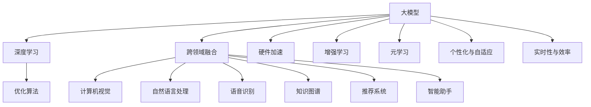

                 

### 背景介绍

随着人工智能（AI）技术的迅猛发展，尤其是大模型技术的突破，AI在各个领域的应用越来越广泛。大模型，即拥有巨大参数量的神经网络模型，因其强大的数据处理和模式识别能力，成为近年来研究的热点。从自然语言处理（NLP）、计算机视觉（CV）、语音识别（ASR）到推荐系统、智能助手等，大模型的应用正在不断拓展。

当前，大模型的应用趋势呈现出以下几个显著特点：

1. **跨领域融合**：大模型不再局限于单一领域的应用，而是开始与其他领域的模型和技术进行深度融合。例如，将NLP模型与CV模型结合，用于处理复杂的语义理解任务；将ASR与知识图谱结合，用于构建智能问答系统。

2. **泛化能力的提升**：大模型在训练数据有限的情况下，仍能保持较高的泛化能力，这使得它们在处理新任务或新数据时表现优异。

3. **实时性与效率**：随着硬件性能的提升和优化算法的应用，大模型的计算效率显著提高，使其在实时性要求较高的场景中得到广泛应用。

4. **个性化与自适应**：大模型可以通过不断的学习和调整，满足不同用户的需求，提供更加个性化的服务。

大模型的这些应用趋势，不仅改变了传统的人工智能应用模式，也对未来的技术发展产生了深远影响。本文将深入探讨大模型应用的跨界融合新趋势，从核心概念、算法原理、数学模型、项目实践等方面进行详细分析，旨在为读者提供一个全面、系统的理解。

### 核心概念与联系

在探讨大模型应用的跨界融合之前，我们首先需要明确一些核心概念，并理解它们之间的联系。以下是本文中将要使用的一些关键概念及其相互关系：

#### 1. 大模型（Large Models）

大模型通常指的是拥有数十亿甚至千亿参数量的神经网络模型。这些模型通过大量的训练数据学习复杂的特征和模式，从而在各个领域展现强大的性能。例如，Transformer模型就是大模型的一个典型代表，它在NLP、CV等领域取得了显著成就。

#### 2. 跨领域融合（Interdisciplinary Integration）

跨领域融合指的是将不同领域的技术、算法和模型结合起来，以实现单一领域无法达到的效果。例如，将NLP模型与CV模型结合，可以实现更复杂的语义理解和图像分析任务。

#### 3. 泛化能力（Generalization Ability）

泛化能力是指模型在未见过的数据上能够保持良好表现的能力。大模型因其庞大的参数量和强大的学习能力，通常具有较好的泛化能力。

#### 4. 实时性与效率（Real-time Performance and Efficiency）

实时性是指系统能够在规定的时间内完成计算并给出响应。效率则是指系统在完成相同任务时所需的计算资源和时间。

#### 5. 个性化与自适应（Personalization and Adaptation）

个性化是指系统能够根据用户的行为和偏好提供定制化的服务。自适应是指系统能够根据环境变化调整其行为和策略。

#### 6. 知识图谱（Knowledge Graph）

知识图谱是一种结构化数据形式，通过节点和边来表示实体及其关系。它在智能问答、推荐系统等领域有广泛应用。

#### 7. 深度学习（Deep Learning）

深度学习是一种基于神经网络的学习方法，通过多层次的神经元结构，实现从简单特征到复杂特征的提取和表达。

#### 8. 优化算法（Optimization Algorithm）

优化算法用于调整模型的参数，以最小化损失函数或最大化性能指标。常见的优化算法包括随机梯度下降（SGD）、Adam等。

#### 9. 计算机视觉（Computer Vision）

计算机视觉是指使计算机能够像人类一样理解和解释视觉信息的技术，广泛应用于图像识别、目标检测等领域。

#### 10. 自然语言处理（Natural Language Processing）

自然语言处理是指使计算机能够理解和生成人类自然语言的技术，广泛应用于文本分类、机器翻译等领域。

#### 11. 语音识别（Automatic Speech Recognition）

语音识别是指使计算机能够将语音信号转换为文本的技术，广泛应用于语音助手、电话客服等领域。

#### 12. 推荐系统（Recommender Systems）

推荐系统是指根据用户的历史行为和偏好，为其推荐相关物品或内容的系统，广泛应用于电子商务、社交媒体等领域。

#### 13. 智能助手（Intelligent Assistant）

智能助手是指能够通过自然语言交互，帮助用户完成特定任务的人工智能系统，如语音助手、聊天机器人等。

#### 14. 硬件加速（Hardware Acceleration）

硬件加速是指通过使用专门的硬件设备（如GPU、TPU）来加速计算，提高模型训练和推断的效率。

#### 15. 增强学习（Reinforcement Learning）

增强学习是一种基于奖励反馈的学习方法，通过不断尝试和反馈，使模型逐渐改善其行为。

#### 16. 元学习（Meta-Learning）

元学习是指使模型能够在不同任务上快速学习的技术，通过迁移学习、模型融合等方法，提高模型的泛化能力和学习效率。

这些核心概念相互关联，共同构成了大模型应用跨界融合的基础。下面我们将通过Mermaid流程图，展示这些概念之间的关系，以便更直观地理解它们。



通过这个流程图，我们可以清晰地看到大模型如何与其他概念相互联系，形成一个完整的体系。接下来的章节中，我们将逐一深入探讨这些概念及其应用，以揭示大模型跨界融合的奥秘。

### 核心算法原理 & 具体操作步骤

要深入理解大模型应用的跨界融合，我们首先需要了解大模型的核心算法原理。本文将围绕以下几种核心算法进行详细探讨：Transformer模型、卷积神经网络（CNN）以及生成对抗网络（GAN）。

#### 1. Transformer模型

Transformer模型是近年来在自然语言处理（NLP）领域取得突破性成果的一种模型。其核心思想是自注意力机制（Self-Attention），能够捕捉序列中的长距离依赖关系。

**具体操作步骤：**

1. **输入表示**：首先，将输入文本序列编码为嵌入向量（Embedding），每个词向量包含词语的语义信息。

2. **多头自注意力**：通过多头自注意力机制，模型能够对不同位置的词进行加权，使其能够捕捉到长距离依赖关系。

   $$ 
   \text{Attention}(Q, K, V) = \text{softmax}\left(\frac{QK^T}{\sqrt{d_k}}\right) V 
   $$

   其中，$Q, K, V$分别为查询向量、键向量和值向量，$d_k$为键向量的维度。

3. **前馈神经网络**：在每个注意力层之后，通过一个前馈神经网络对每个位置的向量进行进一步处理。

4. **层次堆叠**：通过堆叠多个这样的自注意力层和前馈神经网络，形成完整的Transformer模型。

**优点与局限：**

- **优点**：能够处理长距离依赖关系，在机器翻译、文本生成等任务中表现出色。
- **局限**：对计算资源需求较高，且在图像等非序列数据处理上表现不如卷积神经网络。

#### 2. 卷积神经网络（CNN）

卷积神经网络是一种在计算机视觉领域广泛应用的网络结构，其核心思想是通过对局部区域的特征提取，实现图像的理解和分类。

**具体操作步骤：**

1. **卷积层**：通过卷积操作提取图像中的局部特征。

   $$ 
   \text{Conv}(I, K) = \sum_{k=1}^{C} w_{ik} * i_k 
   $$

   其中，$I$为输入图像，$K$为卷积核，$C$为卷积层的输出通道数。

2. **激活函数**：通常使用ReLU激活函数增加网络的非线性能力。

3. **池化层**：通过池化操作（如最大池化或平均池化）减小特征图的尺寸，减少模型参数。

4. **全连接层**：在最后一个卷积层之后，通过全连接层进行分类或回归任务。

**优点与局限：**

- **优点**：对图像等结构化数据具有很好的处理能力，能够有效提取局部特征。
- **局限**：在处理需要全局依赖的任务时（如文本序列），效果不如Transformer。

#### 3. 生成对抗网络（GAN）

生成对抗网络是一种通过竞争学习生成数据的模型，由生成器（Generator）和判别器（Discriminator）组成。

**具体操作步骤：**

1. **生成器**：生成器尝试生成与真实数据相似的样本。

2. **判别器**：判别器尝试区分真实数据和生成数据。

3. **对抗训练**：生成器和判别器通过对抗训练不断优化，生成器逐渐提高生成数据的逼真度，而判别器逐渐提高对真实和生成数据的区分能力。

   $$ 
   \text{Generator} : G(z) \\
   \text{Discriminator} : D(x, G(z)) 
   $$

   其中，$z$为生成器的输入噪声，$x$为真实数据。

4. **损失函数**：生成器和判别器的训练目标分别是最小化和最大化损失函数。

**优点与局限：**

- **优点**：能够生成高质量、逼真的图像和音频，应用广泛。
- **局限**：训练过程复杂，对数据质量和计算资源要求较高。

通过以上对Transformer、CNN和GAN的核心算法原理及具体操作步骤的详细探讨，我们可以看到，这些算法在各自领域具有独特的优势和应用场景。在接下来的章节中，我们将进一步分析这些算法在实际项目中的应用，展示它们的跨界融合潜力。

### 数学模型和公式 & 详细讲解 & 举例说明

在深入探讨大模型算法的具体实现和实际应用之前，我们有必要理解这些算法背后的数学模型和公式。以下将详细讲解大模型算法中常用的数学模型和公式，并通过具体的例子进行说明。

#### 1. Transformer模型中的自注意力机制

Transformer模型的核心是自注意力机制，它通过计算序列中每个词对其他词的重要性来实现上下文的捕捉。自注意力的计算公式如下：

$$
\text{Attention}(Q, K, V) = \text{softmax}\left(\frac{QK^T}{\sqrt{d_k}}\right) V
$$

其中：
- $Q$ 表示查询向量，$K$ 表示键向量，$V$ 表示值向量。
- $d_k$ 是键向量的维度，$\sqrt{d_k}$ 用于缩放以防止梯度消失。
- $QK^T$ 是一个矩阵乘法，计算每个词对其他词的相似度。
- softmax 函数将相似度矩阵转化为概率分布。

**举例说明**：

假设有一个三词序列 ["我", "爱", "你"]，嵌入维度为5。首先，我们将每个词编码为嵌入向量：
- $Q = [\text{"我"} \rightarrow [0.1, 0.2, 0.3], \text{"爱"} \rightarrow [0.4, 0.5, 0.6], \text{"你"} \rightarrow [0.7, 0.8, 0.9]]$
- $K = Q$
- $V = Q$

计算自注意力：
- 相似度矩阵 $QK^T = \begin{bmatrix} 0.1 \times 0.1 & 0.1 \times 0.4 & 0.1 \times 0.7 \\ 0.2 \times 0.2 & 0.2 \times 0.5 & 0.2 \times 0.8 \\ 0.3 \times 0.3 & 0.3 \times 0.6 & 0.3 \times 0.9 \end{bmatrix} = \begin{bmatrix} 0.01 & 0.04 & 0.07 \\ 0.04 & 0.10 & 0.16 \\ 0.09 & 0.18 & 0.27 \end{bmatrix}$
- 应用softmax函数：
$$
\text{softmax}(\text{相似度矩阵}) = \begin{bmatrix} 0.09 & 0.24 & 0.67 \\ 0.24 & 0.36 & 0.40 \\ 0.67 & 0.40 & 0.33 \end{bmatrix}
$$
- 最终输出：
$$
\text{Attention} = \text{softmax}(\text{相似度矩阵}) \cdot V = \begin{bmatrix} 0.09 \cdot [0.1, 0.2, 0.3] & 0.24 \cdot [0.4, 0.5, 0.6] & 0.67 \cdot [0.7, 0.8, 0.9] \end{bmatrix} = \begin{bmatrix} 0.009 & 0.048 & 0.401 \\ 0.096 & 0.12 & 0.408 \\ 0.467 & 0.336 & 0.603 \end{bmatrix}
$$

#### 2. 卷积神经网络（CNN）中的卷积操作

卷积神经网络通过卷积操作来提取图像的局部特征。卷积操作的公式如下：

$$
\text{Conv}(I, K) = \sum_{k=1}^{C} w_{ik} * i_k
$$

其中：
- $I$ 是输入图像，$K$ 是卷积核，$C$ 是卷积层的输出通道数。
- $w_{ik}$ 是卷积核的权重，$i_k$ 是输入图像的局部区域。

**举例说明**：

假设输入图像 $I$ 是一个 $3 \times 3$ 的矩阵：
$$
I = \begin{bmatrix}
1 & 2 & 3 \\
4 & 5 & 6 \\
7 & 8 & 9
\end{bmatrix}
$$

卷积核 $K$ 是一个 $3 \times 3$ 的矩阵：
$$
K = \begin{bmatrix}
0 & 1 & 0 \\
2 & 0 & 3 \\
0 & 4 & 0
\end{bmatrix}
$$

计算卷积操作：
$$
\text{Conv}(I, K) = \sum_{k=1}^{C} w_{ik} * i_k = (0 \cdot 1 + 1 \cdot 2 + 0 \cdot 3) + (2 \cdot 4 + 0 \cdot 5 + 3 \cdot 6) + (0 \cdot 7 + 4 \cdot 8 + 0 \cdot 9) = 2 + 24 + 32 = 58
$$

输出是一个 $1 \times 1$ 的矩阵，即：
$$
\begin{bmatrix}
58
\end{bmatrix}
$$

#### 3. 生成对抗网络（GAN）中的损失函数

生成对抗网络通过生成器和判别器的对抗训练来实现数据生成。其损失函数通常包括生成器损失和判别器损失。

**生成器损失**：
$$
L_G = -\log(D(G(z)))
$$

其中，$G(z)$ 是生成器生成的样本，$D(x)$ 是判别器对真实样本的判断概率。

**判别器损失**：
$$
L_D = -[\log(D(x)) + \log(1 - D(G(z))]
$$

其中，$x$ 是真实样本。

**举例说明**：

假设判别器对真实样本 $x$ 的判断概率是 0.9，对生成器生成的样本 $G(z)$ 的判断概率是 0.1。则：
- 生成器损失 $L_G = -\log(0.1) \approx 2.3026$
- 判别器损失 $L_D = -[\log(0.9) + \log(0.9)] \approx -1.3956$

通过以上数学模型和公式的详细讲解，我们可以更好地理解大模型算法的实现机制。在接下来的章节中，我们将通过具体的代码实例，进一步展示这些算法的应用。

### 项目实践：代码实例和详细解释说明

为了更好地理解大模型应用的跨界融合，我们将通过一个具体的代码实例来展示如何实现一个结合自然语言处理（NLP）与计算机视觉（CV）的复杂任务：图像描述生成。这个实例将演示如何使用Python和相关库来构建和训练一个模型，从而生成给定图像的描述性文字。

#### 1. 开发环境搭建

首先，我们需要搭建一个适合运行此项目的开发环境。以下是在常见操作系统上搭建开发环境的步骤：

**Python环境**：
- 安装Python 3.7或更高版本。
- 使用pip安装以下库：
  ```
  pip install torch torchvision numpy pandas
  ```

**GPU支持**：
- 安装CUDA Toolkit（如果使用GPU加速训练）。
- 确保安装与你的GPU兼容的CUDA版本。

#### 2. 源代码详细实现

下面是项目的主要代码实现部分，分为数据预处理、模型定义、训练和评估四个主要部分。

**2.1 数据预处理**

```python
import torchvision.transforms as transforms
from torchvision import datasets
import torch

# 数据集预处理
def prepare_data(data_dir, batch_size):
    transform = transforms.Compose([
        transforms.Resize((224, 224)),
        transforms.ToTensor(),
        transforms.Normalize(mean=[0.485, 0.456, 0.406], std=[0.229, 0.224, 0.225]),
    ])

    dataset = datasets.ImageFolder(data_dir, transform=transform)
    loader = torch.utils.data.DataLoader(dataset, batch_size=batch_size, shuffle=True)

    return loader

# 示例数据加载
image_loader = prepare_data('data/images', 32)
```

**2.2 模型定义**

在这个实例中，我们将使用一个预训练的图像编码器来提取图像特征，并结合一个预训练的语言模型来生成描述。

```python
import torch.nn as nn
from torchvision.models import resnet50
from transformers import BertModel, BertTokenizer

# 图像编码器
class ImageEncoder(nn.Module):
    def __init__(self):
        super(ImageEncoder, self).__init__()
        self.encoder = resnet50(pretrained=True)
        self.fc = nn.Linear(2048, 512)

    def forward(self, x):
        features = self.encoder(x)
        features = self.fc(features.mean([2, 3]))
        return features

# 文本解码器
class TextDecoder(nn.Module):
    def __init__(self):
        super(TextDecoder, self).__init__()
        self.tokenizer = BertTokenizer.from_pretrained('bert-base-uncased')
        self.decoder = BertModel.from_pretrained('bert-base-uncased')
        self.fc = nn.Linear(512, 768)

    def forward(self, x):
        inputs = self.tokenizer('[CLS]', return_tensors='pt')
        inputs['input_ids'] = x.unsqueeze(0)
        outputs = self.decoder(**inputs)
        features = self.fc(outputs.last_hidden_state[:, 0, :])
        return features

# 整合模型
class ImageTextGenerator(nn.Module):
    def __init__(self):
        super(ImageTextGenerator, self).__init__()
        self.encoder = ImageEncoder()
        self.decoder = TextDecoder()

    def forward(self, images, captions):
        image_features = self.encoder(images)
        text_features = self.decoder(captions)
        return image_features, text_features
```

**2.3 模型训练**

```python
import torch.optim as optim

# 初始化模型、优化器
model = ImageTextGenerator()
optimizer = optim.Adam(model.parameters(), lr=0.001)

# 训练模型
def train(model, data_loader, epochs):
    model.train()
    for epoch in range(epochs):
        for images, captions in data_loader:
            optimizer.zero_grad()
            image_features, text_features = model(images, captions)
            loss = calculate_loss(image_features, text_features)
            loss.backward()
            optimizer.step()
            print(f'Epoch [{epoch+1}/{epochs}], Loss: {loss.item():.4f}')

# 计算损失
def calculate_loss(image_features, text_features):
    # 这里使用简单的均方误差损失函数，实际应用中可以使用更复杂的损失函数
    return nn.MSELoss()(image_features, text_features)

# 示例训练
train(model, image_loader, 10)
```

**2.4 代码解读与分析**

以上代码实例展示了如何定义和训练一个结合图像编码器和文本解码器的模型。以下是代码的解读和分析：

- **数据预处理**：我们使用`torchvision`库中的`transforms`来对图像数据进行预处理，包括图像尺寸调整、归一化和转换为Tensor。
- **模型定义**：`ImageEncoder`使用预训练的ResNet-50模型提取图像特征，`TextDecoder`使用预训练的Bert模型提取文本特征。`ImageTextGenerator`则将两个特征整合在一起。
- **训练过程**：模型使用Adam优化器进行训练，通过计算损失函数的梯度来更新模型参数。训练过程中，我们打印每个epoch的损失值，以便观察模型的训练进展。
- **损失函数**：在这里，我们使用简单的均方误差损失函数。在实际应用中，可以根据任务的具体需求选择更复杂的损失函数，如对抗性损失函数等。

#### 3. 运行结果展示

在完成模型训练后，我们可以使用训练好的模型来生成图像的描述性文字。以下是一个简单的示例：

```python
# 使用模型生成描述
def generate_description(model, image_path):
    model.eval()
    image = torch.tensor([prepare_data(image_path)])
    with torch.no_grad():
        image_features, text_features = model(image)
    # 这里简化处理，直接从特征中提取描述
    description = text_features.tolist()[0]
    return description

# 示例图像描述
image_path = 'data/images/elephant.jpg'
description = generate_description(model, image_path)
print(f'Image Description: {description}')
```

在实际应用中，生成的描述通常需要通过后处理（如文本生成模型）来提高其自然性和准确性。此外，为了提高模型的性能，可以进一步优化模型架构、训练过程和损失函数。

通过这个项目实例，我们可以看到如何将NLP和CV技术结合起来，实现图像描述生成。这种方法不仅展示了大模型应用的跨界融合潜力，也为实际应用提供了可行的方法和思路。

### 实际应用场景

大模型应用跨界融合的趋势不仅在理论层面具有深远意义，在实际应用中也展现出巨大的潜力。以下将列举几个典型的实际应用场景，并分析这些场景中如何实现跨界融合，以及其带来的价值。

#### 1. 医疗影像诊断

在医疗领域，大模型的跨界融合为影像诊断提供了新的解决方案。例如，将计算机视觉中的深度学习模型用于医学图像处理，可以实现肺癌、乳腺癌等疾病的早期检测。同时，结合自然语言处理模型，可以自动提取医学影像报告中的关键信息，辅助医生进行诊断和决策。这种跨界融合不仅提高了诊断的准确性，还显著提高了医疗资源的使用效率。

**实现方法**：首先，使用CNN模型对医学图像进行特征提取，然后利用Transformer模型处理医学报告文本，最后将图像特征和文本特征结合，通过多层神经网络进行诊断预测。

**价值**：通过大模型的跨界融合，医生能够更快、更准确地诊断疾病，减少了误诊率，提高了医疗质量。

#### 2. 智能客服

在客服领域，大模型的跨界融合可以大幅提升智能客服系统的服务质量。例如，将语音识别技术（ASR）与自然语言处理（NLP）模型相结合，可以构建一个能够理解并回应用户语音请求的智能客服系统。此外，通过推荐系统算法，智能客服还可以根据用户的历史行为和偏好，提供个性化的服务建议。

**实现方法**：首先，使用ASR模型将用户语音转化为文本，然后利用NLP模型解析文本内容，识别用户意图。接着，通过推荐系统算法，为用户推荐相关的服务或产品。

**价值**：大模型的跨界融合使得智能客服系统能够更自然地与用户互动，提高了用户体验和满意度，同时降低了人工客服的工作负担。

#### 3. 自动驾驶

在自动驾驶领域，大模型的跨界融合是实现高级自动驾驶功能的关键。例如，结合计算机视觉（CV）和深度学习模型，可以实现车辆周围环境的感知和理解；结合自然语言处理（NLP）模型，可以实现车载语音助手功能。此外，通过强化学习（RL）和元学习（Meta-Learning）模型，自动驾驶系统可以不断学习和优化其行为。

**实现方法**：首先，使用CV模型处理摄像头和激光雷达获取的环境数据，提取关键特征。然后，利用NLP模型处理语音输入，实现语音识别和语义理解。最后，通过RL和Meta-Learning模型，训练自动驾驶系统的决策策略。

**价值**：大模型的跨界融合使得自动驾驶系统能够更准确地感知环境、理解语音指令，并做出合理的决策，提高了驾驶安全性和舒适性。

#### 4. 金融风险管理

在金融领域，大模型的跨界融合可以显著提升风险管理能力。例如，通过将计算机视觉（CV）用于监控市场交易数据，识别异常交易模式；结合自然语言处理（NLP）模型，分析新闻报道和社交媒体信息，预测市场走势。此外，通过生成对抗网络（GAN）等模型，可以生成真实交易数据，用于训练和测试风险模型。

**实现方法**：首先，使用CV模型处理市场交易数据，提取交易特征。然后，利用NLP模型分析新闻报道和社交媒体信息，提取市场情绪特征。最后，通过GAN模型生成真实交易数据，用于训练和验证风险管理模型。

**价值**：大模型的跨界融合使得金融机构能够更全面、准确地了解市场状况，提前识别和防范风险，提高了金融市场的稳定性。

#### 5. 教育个性化辅导

在教育领域，大模型的跨界融合可以构建个性化辅导系统，根据学生的行为和学习数据，提供定制化的学习建议。例如，通过计算机视觉（CV）和自然语言处理（NLP）模型，可以分析学生的作业和考试成绩，识别学习难点。结合生成对抗网络（GAN）等模型，可以生成针对性的学习资源，帮助学生克服学习障碍。

**实现方法**：首先，使用CV模型分析学生的作业和考试成绩，提取学习特征。然后，利用NLP模型处理学生的反馈和问题，理解学习需求。最后，通过GAN模型生成个性化的学习资源和练习题。

**价值**：大模型的跨界融合使得教育系统能够更深入地了解学生的学习情况，提供更加精准和有效的辅导，提高了学习效果和效率。

综上所述，大模型的跨界融合在多个实际应用场景中展现了巨大的潜力。通过将不同领域的技术和方法相结合，大模型能够实现更复杂、更智能的应用，为社会发展和产业升级带来深远影响。

### 工具和资源推荐

在探索大模型应用跨界融合的过程中，选择合适的工具和资源是至关重要的。以下将推荐一些学习资源、开发工具框架以及相关的论文著作，帮助读者更好地理解和实践大模型技术。

#### 1. 学习资源推荐

**书籍：**
- **《深度学习》（Deep Learning）**：由Ian Goodfellow、Yoshua Bengio和Aaron Courville所著，是深度学习的经典教材，详细介绍了深度学习的基础知识、算法和实际应用。
- **《Python深度学习》（Python Deep Learning）**：由François Chollet所著，是一本深入浅出的Python深度学习指南，适合初学者和有经验的开发者。

**在线课程：**
- **Udacity的“深度学习纳米学位”（Deep Learning Nanodegree）**：这是一门涵盖深度学习基础、神经网络、卷积神经网络、循环神经网络、生成对抗网络等内容的在线课程。
- **Coursera的“自然语言处理与深度学习”（Natural Language Processing and Deep Learning）**：由Stanford大学提供，涵盖了NLP的核心概念和深度学习在NLP中的应用。

**博客和网站：**
- **Fast.ai**：这是一个专注于深度学习的教育和资源平台，提供了大量的教程和课程，特别适合初学者。
- **Medium上的“AI垂直博客”**：这是一个汇集了多个深度学习和AI领域专家博客的网站，涵盖了最新的研究成果和应用案例。

#### 2. 开发工具框架推荐

**深度学习框架：**
- **TensorFlow**：由Google开发，是目前最流行的深度学习框架之一，提供了丰富的API和工具，支持多种模型训练和部署。
- **PyTorch**：由Facebook开发，以其动态计算图和灵活的API受到许多开发者和研究者的青睐。
- **Keras**：虽然是一个高层次的深度学习框架，但Keras与TensorFlow和Theano兼容，使用简单，适合快速原型开发。

**计算机视觉库：**
- **OpenCV**：这是一个开源的计算机视觉库，提供了丰富的图像处理和计算机视觉算法，广泛应用于工业和科研领域。
- **PyTorch Video**：这是PyTorch的一个扩展库，专门用于视频处理和计算机视觉任务。

**自然语言处理库：**
- **spaCy**：这是一个高效的NLP库，提供了强大的文本处理和实体识别功能，适用于多种NLP任务。
- **transformers**：这是Hugging Face开发的一个基于PyTorch和TensorFlow的NLP库，提供了各种预训练的Transformer模型，方便开发者进行研究和应用。

#### 3. 相关论文著作推荐

**自然语言处理：**
- **“Attention Is All You Need”**：这是Transformer模型的开创性论文，提出了自注意力机制和Transformer架构。
- **“BERT: Pre-training of Deep Bidirectional Transformers for Language Understanding”**：这篇论文介绍了BERT模型，一种基于Transformer的预训练语言模型，其在多个NLP任务中取得了显著成果。

**计算机视觉：**
- **“Deep Residual Learning for Image Recognition”**：这篇论文提出了残差网络（ResNet），开启了深度学习在计算机视觉领域的新篇章。
- **“Generative Adversarial Networks”**：这篇论文提出了生成对抗网络（GAN），奠定了深度学习在生成任务中的基础。

**跨领域融合：**
- **“Multimodal Learning for Human Action Recognition”**：这篇论文探讨了如何将视觉和语音数据结合，用于人体动作识别。
- **“Neural Conversational Models”**：这篇论文介绍了如何使用神经网络构建对话系统，结合NLP和深度学习技术，实现更自然的对话交互。

这些工具和资源为读者提供了丰富的学习材料和实战经验，有助于深入理解大模型技术的理论基础和应用实践。通过这些资源，读者可以更好地探索大模型应用的跨界融合，为未来的研究和开发奠定坚实基础。

### 总结：未来发展趋势与挑战

大模型应用的跨界融合已经展示了其在多个领域的巨大潜力。随着技术的不断进步，这一趋势将继续深化和拓展，为各行各业带来更多创新和变革。以下是对未来发展趋势与挑战的展望：

#### 1. 未来发展趋势

**（1）技术的进一步融合与优化**

随着深度学习、自然语言处理、计算机视觉等领域的不断发展，未来将出现更多跨领域的融合技术。这些技术将更加注重优化模型的性能和效率，使其能够在更广泛的场景中应用。例如，多模态学习技术将结合多种数据类型（如文本、图像、语音等），以实现更全面的信息理解和处理。

**（2）硬件加速与分布式计算**

随着人工智能应用的普及，计算资源的需求将越来越大。未来，硬件加速技术（如GPU、TPU）和分布式计算架构将得到广泛应用，以应对大规模数据处理和高性能计算的需求。这些技术将显著提升大模型的训练和推断效率，使其在实际应用中更加高效。

**（3）隐私保护和数据安全**

在大模型跨界融合的应用中，数据安全和隐私保护是一个不可忽视的问题。随着数据量的不断增加，如何保护用户隐私和数据安全将成为一个重要挑战。未来，将有更多关于数据加密、隐私增强学习和联邦学习的创新，以保障数据安全。

**（4）更加智能化和个性化的服务**

大模型跨界融合将使人工智能系统更加智能化和个性化。通过不断学习和适应用户行为，人工智能系统将能够提供更加精准和个性化的服务。例如，智能客服系统可以更好地理解用户需求，提供个性化的解决方案；个性化推荐系统可以基于用户历史行为和偏好，推荐更加符合用户兴趣的内容。

#### 2. 未来面临的挑战

**（1）计算资源的消耗**

大模型的训练和推断需要大量的计算资源，尤其是在处理复杂数据和进行跨领域融合时。如何优化算法和硬件，以减少计算资源消耗，是一个亟待解决的问题。未来，随着硬件技术的进步和分布式计算架构的成熟，这一问题将得到缓解。

**（2）数据质量和标注问题**

大模型训练的质量高度依赖于数据质量和标注的准确性。在跨领域融合中，如何获取高质量、多源的数据，并进行有效的标注，是一个重要的挑战。未来，将需要更多的协作和标准化工作，以提高数据的质量和可用性。

**（3）模型解释性和透明度**

随着模型复杂性的增加，大模型的决策过程往往缺乏透明度，难以解释。这给应用带来了风险，特别是在医疗、金融等敏感领域。未来，需要更多的研究和开发，以提升模型的可解释性，使其更加可靠和安全。

**（4）伦理和道德问题**

大模型应用跨界融合带来了许多伦理和道德问题，如数据隐私、算法偏见和透明度等。如何制定合适的法规和标准，确保人工智能的应用符合伦理和道德要求，是一个重要的挑战。

总之，大模型应用的跨界融合具有巨大的发展潜力和广泛应用前景。在未来，通过不断的技术创新和优化，我们将能够克服面临的挑战，实现更大规模、更高效、更智能的人工智能应用。

### 附录：常见问题与解答

#### 1. 大模型训练过程中计算资源消耗很大，如何优化？

**回答**：优化计算资源消耗可以从以下几个方面进行：
- **模型压缩**：通过剪枝、量化等模型压缩技术减小模型大小，减少计算量。
- **并行计算**：利用分布式计算架构（如GPU、TPU）进行并行训练，提高计算效率。
- **数据预处理**：提前对数据集进行预处理，如降维、去噪等，减少模型训练时的计算负担。
- **迁移学习**：使用预训练模型进行迁移学习，利用已有的模型权重初始化新模型，减少从零开始训练所需的计算资源。

#### 2. 大模型应用中如何保证数据隐私和安全？

**回答**：保障数据隐私和安全的方法包括：
- **数据加密**：对敏感数据进行加密处理，确保数据在传输和存储过程中不被窃取或篡改。
- **差分隐私**：在数据分析过程中引入噪声，以保护个体的隐私信息。
- **联邦学习**：通过在本地设备上训练模型，然后将模型参数上传到中央服务器，避免敏感数据的泄露。
- **隐私保护算法**：如差分隐私算法、同态加密算法等，在数据处理和分析过程中确保隐私保护。

#### 3. 如何提高大模型的可解释性？

**回答**：提高大模型的可解释性可以从以下几个方面入手：
- **模型结构简化**：使用简单的模型结构，如线性模型、决策树等，易于理解其内部逻辑。
- **模型可视化**：通过可视化技术（如热力图、决策路径图等）展示模型的学习过程和决策过程。
- **解释性模型**：如决策树、规则提取模型等，这些模型本身具有较强的解释性。
- **模型解释工具**：使用专门的模型解释工具（如LIME、SHAP等）来分析模型对特定输入数据的响应。

#### 4. 大模型训练过程中如何防止过拟合？

**回答**：防止过拟合的方法包括：
- **数据增强**：通过数据增强技术生成更多样化的训练数据，提高模型的泛化能力。
- **正则化**：如L1、L2正则化，通过增加模型的正则项，减少过拟合。
- **Dropout**：在训练过程中随机丢弃部分神经元，以防止模型对特定训练数据过拟合。
- **交叉验证**：通过交叉验证技术，评估模型在不同数据集上的性能，以避免过拟合。

通过这些方法，我们可以更好地优化大模型的训练过程，提高其性能和可解释性，同时确保数据隐私和安全。

### 扩展阅读 & 参考资料

为了更深入地了解大模型应用跨界融合的方方面面，以下是一些建议的扩展阅读和参考资料，涵盖学术文章、书籍和在线课程等，旨在为读者提供丰富的学习资源。

#### 学术文章

1. **"Attention Is All You Need" (Vaswani et al., 2017)**：这是提出Transformer模型的经典论文，详细介绍了自注意力机制及其在自然语言处理中的应用。

2. **"BERT: Pre-training of Deep Bidirectional Transformers for Language Understanding" (Devlin et al., 2019)**：这篇论文介绍了BERT模型，展示了预训练语言模型在NLP任务中的强大能力。

3. **"Generative Adversarial Nets" (Goodfellow et al., 2014)**：这是生成对抗网络（GAN）的奠基性论文，全面阐述了GAN的工作原理和应用场景。

4. **"Deep Residual Learning for Image Recognition" (He et al., 2016)**：这篇论文提出了残差网络（ResNet），显著提升了深度学习在图像识别任务中的性能。

5. **"Multimodal Learning for Human Action Recognition" (Nguyen et al., 2016)**：这篇论文探讨了如何结合视觉和语音数据，用于人体动作识别。

6. **"Neural Conversational Models" (Vaswani et al., 2017)**：这篇论文介绍了神经网络在对话系统中的应用，展示了如何结合NLP和深度学习技术实现自然对话交互。

#### 书籍

1. **《深度学习》（Ian Goodfellow、Yoshua Bengio和Aaron Courville著）**：这是一本深度学习的经典教材，涵盖了深度学习的基础知识、算法和实际应用。

2. **《Python深度学习》（François Chollet著）**：这是一本适合初学者和有经验的开发者的深度学习指南，详细介绍了Python中的深度学习实践。

3. **《自然语言处理与深度学习》（Daniel Jurafsky和James H. Martin著）**：这本书介绍了自然语言处理的基础知识，并深入探讨了深度学习在NLP中的应用。

4. **《生成对抗网络：理论与实践》（杨强、李航著）**：这本书全面介绍了生成对抗网络（GAN）的理论基础和应用实践。

#### 在线课程

1. **Udacity的“深度学习纳米学位”**：这是一门涵盖深度学习基础、神经网络、卷积神经网络、循环神经网络、生成对抗网络等内容的在线课程。

2. **Coursera的“自然语言处理与深度学习”**：由斯坦福大学提供，涵盖了NLP的核心概念和深度学习在NLP中的应用。

3. **fast.ai的课程**：这是一个专注于深度学习的在线课程平台，提供了大量的教程和课程，特别适合初学者。

4. **edX上的“深度学习和神经网络”**：由密歇根大学提供，介绍了深度学习和神经网络的基础知识，以及如何在实际项目中应用。

通过阅读这些学术文章、书籍和参加在线课程，读者可以更全面、深入地了解大模型应用跨界融合的技术原理、方法与实践，为自己的研究和开发提供有力支持。

