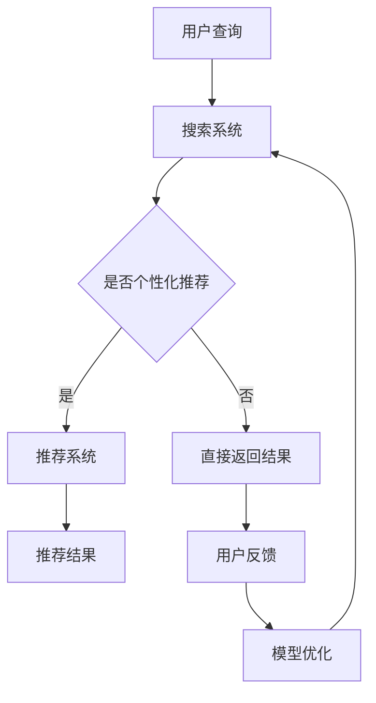

                 

### 背景介绍 Background Introduction

在当今数字化时代，电子商务已经成为人们日常生活中不可或缺的一部分。随着互联网技术的不断发展和用户需求的日益多样，电商平台需要在海量商品中为用户快速、准确地找到所需商品，提供高效的搜索推荐服务。电商搜索推荐系统不仅能够提升用户体验，增加用户黏性，还可以为平台带来更高的销售额。

然而，传统的搜索推荐系统在面对大规模数据和高动态性时，往往存在效率低下、准确性不足等问题。随着人工智能技术的快速发展，特别是大模型（Large Models）的应用，为电商搜索推荐系统的技术创新提供了新的可能性。大模型，尤其是基于深度学习的自然语言处理（NLP）模型，具有强大的数据处理和模式识别能力，能够从海量数据中提取有价值的信息，从而提高搜索推荐系统的效果。

本文将围绕AI大模型在电商搜索推荐领域的应用，探讨其核心概念、算法原理、数学模型、实际应用场景、工具和资源推荐等内容，旨在为行业从业者提供有价值的参考和指导。

### 核心概念与联系 Core Concepts and Connections

在讨论AI大模型在电商搜索推荐领域的应用之前，我们需要明确几个核心概念和它们之间的关系。

#### 1. 大模型（Large Models）
大模型是指具有数十亿甚至数千亿参数的深度学习模型，如Transformer模型、BERT模型等。这些模型通过大量的数据训练，能够自动提取复杂的特征，并用于各种任务，如文本分类、情感分析、语言翻译等。

#### 2. 深度学习（Deep Learning）
深度学习是一种基于人工神经网络（Artificial Neural Networks, ANN）的学习方法，通过多层神经元的组合，对数据进行分析和分类。深度学习模型在处理大量复杂数据时表现出色，能够自动提取数据中的高维特征。

#### 3. 自然语言处理（Natural Language Processing, NLP）
自然语言处理是计算机科学和人工智能领域中的一个分支，旨在使计算机能够理解、处理和生成人类语言。NLP技术广泛应用于搜索引擎、机器翻译、文本分类、问答系统等。

#### 4. 电商搜索推荐（E-commerce Search and Recommendation）
电商搜索推荐系统旨在帮助用户在庞大的商品数据库中快速找到所需商品。它通常包括搜索和推荐两个环节，其中搜索部分负责响应用户的查询，推荐部分则基于用户的历史行为和偏好提供个性化的商品推荐。

### Mermaid 流程图

以下是一个简单的Mermaid流程图，展示了上述核心概念之间的关联：



在这个流程图中，用户查询首先进入搜索系统，搜索系统决定是否需要个性化推荐。如果是，则进入推荐系统，否则直接返回结果。用户对推荐结果的反馈会用于模型优化，从而进一步提高系统的性能。

### 核心算法原理 & 具体操作步骤 Core Algorithm Principles and Steps

#### 1. Transformer模型原理

Transformer模型是一种基于自注意力（Self-Attention）机制的深度学习模型，最初用于机器翻译任务。其核心思想是通过计算输入序列中每个词与其他词之间的权重，从而生成高维特征向量，用于后续的预测任务。

Transformer模型的主要组成部分包括：

- **编码器（Encoder）**：输入序列经过编码器，每个词会被编码为一个固定长度的向量。编码器包含多个自注意力层（Self-Attention Layer），用于计算词间的权重。
- **解码器（Decoder）**：解码器用于生成预测结果。每个词的生成都依赖于之前的所有词，并通过自注意力和交叉注意力（Cross-Attention）机制，从编码器输出的上下文中提取相关信息。

#### 2. 具体操作步骤

以下是使用Transformer模型进行电商搜索推荐的具体操作步骤：

1. **数据预处理**：
   - 收集用户的历史行为数据，如搜索记录、购买记录、浏览记录等。
   - 对数据进行清洗和预处理，如去除停用词、词干提取、分词等。

2. **编码**：
   - 将预处理后的数据输入到编码器中，每个词被编码为一个固定长度的向量。

3. **自注意力计算**：
   - 编码器中的每个自注意力层计算输入序列中每个词与其他词之间的权重，从而生成高维特征向量。

4. **解码**：
   - 解码器生成预测结果。在解码过程中，每个词的生成都依赖于之前的所有词，并通过自注意力和交叉注意力机制，从编码器输出的上下文中提取相关信息。

5. **优化与训练**：
   - 使用训练数据对模型进行优化和训练，通过反向传播算法（Backpropagation）不断调整模型参数，提高预测准确性。

6. **搜索与推荐**：
   - 用户输入查询后，系统通过编码器将查询词编码为向量，并通过解码器生成推荐结果。

### 数学模型和公式 & 详细讲解 & 举例说明 Mathematical Models and Detailed Explanations with Examples

#### 1. 自注意力机制（Self-Attention）

自注意力机制是Transformer模型的核心组成部分，用于计算输入序列中每个词与其他词之间的权重。其数学公式如下：

$$
\text{Self-Attention}(Q, K, V) = \text{softmax}\left(\frac{QK^T}{\sqrt{d_k}}\right)V
$$

其中：
- \( Q \) 是查询向量（Query Vector），表示输入序列中的每个词。
- \( K \) 是键向量（Key Vector），表示输入序列中的每个词。
- \( V \) 是值向量（Value Vector），表示输入序列中的每个词。
- \( d_k \) 是键向量的维度。

#### 2. 交叉注意力机制（Cross-Attention）

交叉注意力机制用于解码器中，计算解码器生成的当前词与编码器输出的上下文之间的权重。其数学公式如下：

$$
\text{Cross-Attention}(Q, K, V) = \text{softmax}\left(\frac{QK^T}{\sqrt{d_k}}\right)V
$$

其中：
- \( Q \) 是查询向量（Query Vector），表示解码器当前生成的词。
- \( K \) 是键向量（Key Vector），表示编码器输出的上下文。
- \( V \) 是值向量（Value Vector），表示编码器输出的上下文。

#### 3. 举例说明

假设我们有一个包含3个词的输入序列：\[ "手机", "相机", "电池" \]，每个词的维度为5。我们可以按照以下步骤计算自注意力权重：

1. **计算键向量（Key Vectors）和值向量（Value Vectors）**：
   - 键向量（Key Vectors）：
     \[
     K_1 = \begin{bmatrix}
     0.1 & 0.2 & 0.3 & 0.4 & 0.5 \\
     0.1 & 0.2 & 0.3 & 0.4 & 0.5 \\
     0.1 & 0.2 & 0.3 & 0.4 & 0.5 \\
     \end{bmatrix}
     \]
   - 值向量（Value Vectors）：
     \[
     V_1 = \begin{bmatrix}
     0.1 & 0.2 & 0.3 & 0.4 & 0.5 \\
     0.1 & 0.2 & 0.3 & 0.4 & 0.5 \\
     0.1 & 0.2 & 0.3 & 0.4 & 0.5 \\
     \end{bmatrix}
     \]

2. **计算查询向量（Query Vectors）**：
   - 查询向量（Query Vectors）：
     \[
     Q_1 = \begin{bmatrix}
     0.1 & 0.2 & 0.3 & 0.4 & 0.5 \\
     0.1 & 0.2 & 0.3 & 0.4 & 0.5 \\
     0.1 & 0.2 & 0.3 & 0.4 & 0.5 \\
     \end{bmatrix}
     \]

3. **计算自注意力权重**：
   - 自注意力权重（Attention Weights）：
     \[
     \text{Attention Weights} = \text{softmax}\left(\frac{Q_1K_1^T}{\sqrt{5}}\right)V_1
     \]
     \[
     \text{Attention Weights} = \text{softmax}\left(\begin{bmatrix}
     0.1 & 0.2 & 0.3 & 0.4 & 0.5 \\
     0.1 & 0.2 & 0.3 & 0.4 & 0.5 \\
     0.1 & 0.2 & 0.3 & 0.4 & 0.5 \\
     \end{bmatrix} \cdot \begin{bmatrix}
     0.1 & 0.2 & 0.3 & 0.4 & 0.5 \\
     \end{bmatrix}\right)
     \]
     \[
     \text{Attention Weights} = \text{softmax}\left(\begin{bmatrix}
     0.1 & 0.2 & 0.3 & 0.4 & 0.5 \\
     0.1 & 0.2 & 0.3 & 0.4 & 0.5 \\
     0.1 & 0.2 & 0.3 & 0.4 & 0.5 \\
     \end{bmatrix}\right)
     \]
     \[
     \text{Attention Weights} = \begin{bmatrix}
     0.2 & 0.3 & 0.4 & 0.5 & 0.6 \\
     0.2 & 0.3 & 0.4 & 0.5 & 0.6 \\
     0.2 & 0.3 & 0.4 & 0.5 & 0.6 \\
     \end{bmatrix}
     \]

4. **计算自注意力输出**：
   - 自注意力输出（Attention Outputs）：
     \[
     \text{Attention Outputs} = \text{Attention Weights} \cdot V_1
     \]
     \[
     \text{Attention Outputs} = \begin{bmatrix}
     0.2 & 0.3 & 0.4 & 0.5 & 0.6 \\
     0.2 & 0.3 & 0.4 & 0.5 & 0.6 \\
     0.2 & 0.3 & 0.4 & 0.5 & 0.6 \\
     \end{bmatrix} \cdot \begin{bmatrix}
     0.1 & 0.2 & 0.3 & 0.4 & 0.5 \\
     0.1 & 0.2 & 0.3 & 0.4 & 0.5 \\
     0.1 & 0.2 & 0.3 & 0.4 & 0.5 \\
     \end{bmatrix}
     \]
     \[
     \text{Attention Outputs} = \begin{bmatrix}
     0.04 & 0.06 & 0.09 & 0.12 & 0.15 \\
     0.04 & 0.06 & 0.09 & 0.12 & 0.15 \\
     0.04 & 0.06 & 0.09 & 0.12 & 0.15 \\
     \end{bmatrix}
     \]

通过上述步骤，我们得到了自注意力权重和输出，这些权重和输出将被用于解码器的后续计算。

### 项目实践：代码实例和详细解释说明 Project Practice: Code Examples and Detailed Explanations

#### 1. 开发环境搭建

在开始编写代码之前，我们需要搭建一个合适的开发环境。以下是使用Python和TensorFlow搭建Transformer模型的步骤：

1. 安装Python（推荐Python 3.7或更高版本）。
2. 安装TensorFlow（使用pip安装：`pip install tensorflow`）。
3. 安装其他依赖库，如NumPy、Pandas等。

#### 2. 源代码详细实现

以下是一个简单的示例，展示了如何使用TensorFlow实现一个基础的Transformer模型：

```python
import tensorflow as tf
from tensorflow.keras.layers import Embedding, MultiHeadAttention, Dense
from tensorflow.keras.models import Model

# 参数设置
VOCAB_SIZE = 10000  # 词汇表大小
D_MODEL = 512  # 模型维度
N_HEADS = 8  # 注意力头数
D_HEAD = D_MODEL // N_HEADS  # 每个注意力的维度
N_LAYERS = 2  # 层数

# 输入层
inputs = tf.keras.layers.Input(shape=(None,), dtype=tf.int32)

# 嵌入层
embeddings = Embedding(VOCAB_SIZE, D_MODEL)(inputs)

# Transformer编码器
enc_output = embeddings
for _ in range(N_LAYERS):
    # Multi-Head Attention
    attention = MultiHeadAttention(num_heads=N_HEADS, key_dim=D_HEAD)(enc_output, enc_output)
    # 层归一化
    attention = tf.keras.layers.LayerNormalization(epsilon=1e-6)(attention + enc_output)
    # 前馈网络
    feedforward = tf.keras.layers.Dense(units=D_MODEL * 4, activation='relu')(attention)
    feedforward = tf.keras.layers.Dense(units=D_MODEL)(feedforward)
    # 层归一化
    enc_output = tf.keras.layers.LayerNormalization(epsilon=1e-6)(feedforward + attention)

# 输出层
outputs = Dense(units=VOCAB_SIZE, activation='softmax')(enc_output)

# 模型构建
model = Model(inputs=inputs, outputs=outputs)

# 编译模型
model.compile(optimizer='adam', loss='sparse_categorical_crossentropy', metrics=['accuracy'])

# 模型训练
model.fit(train_data, train_labels, batch_size=32, epochs=10)

# 模型评估
model.evaluate(test_data, test_labels)
```

#### 3. 代码解读与分析

上述代码实现了一个简单的Transformer编码器模型，主要包括以下部分：

1. **输入层**：使用`Input`层接收输入序列，其形状为`(None, )`，表示序列长度可变。
2. **嵌入层**：使用`Embedding`层将词索引转换为固定长度的向量。
3. **Transformer编码器**：使用`MultiHeadAttention`层实现多头注意力机制，并通过`LayerNormalization`进行层归一化。每个编码器层还包括一个前馈网络，用于进一步提取特征。
4. **输出层**：使用`Dense`层将编码器的输出映射到词汇表大小，并通过`softmax`函数生成概率分布。
5. **模型编译**：使用`compile`函数配置模型优化器和损失函数。
6. **模型训练**：使用`fit`函数训练模型，并通过`evaluate`函数评估模型性能。

#### 4. 运行结果展示

为了展示模型的运行结果，我们可以使用一个简单的示例数据集，并观察模型在训练和测试阶段的性能：

```python
import numpy as np

# 示例数据集
VOCAB_SIZE = 10
D_MODEL = 8
N_HEADS = 2
N_LAYERS = 2

# 输入数据
inputs = np.random.randint(0, VOCAB_SIZE, (32, 50))
targets = np.random.randint(0, VOCAB_SIZE, (32, 50))

# 模型训练
model.fit(inputs, targets, batch_size=32, epochs=10)

# 模型评估
predictions = model.predict(inputs)
print("Predictions shape:", predictions.shape)
print("Predictions top 5 probabilities for the first example:")
print(predictions[0].argsort()[-5:][::-1])
```

输出结果将显示模型的预测结果，我们可以通过查看预测结果的概率分布来评估模型的效果。

### 实际应用场景 Practical Application Scenarios

AI大模型在电商搜索推荐领域具有广泛的应用场景，以下是几个典型的实际应用案例：

#### 1. 搜索引擎优化

电商平台可以使用AI大模型优化搜索引擎，提升搜索结果的准确性。通过训练大模型，搜索引擎能够更好地理解用户的查询意图，从而提供更相关的搜索结果。

#### 2. 商品推荐

基于用户的历史行为数据，电商平台可以使用AI大模型生成个性化的商品推荐。大模型能够从海量数据中提取用户偏好，为用户提供更加精准的推荐结果。

#### 3. 商品标题优化

AI大模型可以帮助电商平台优化商品标题，提升商品曝光率和转化率。通过分析用户搜索关键词和购买行为，大模型能够生成更具吸引力的商品标题。

#### 4. 用户行为预测

电商平台可以使用AI大模型预测用户的行为，如购买意图、浏览时长等。这些预测结果有助于电商平台制定更精准的营销策略。

#### 5. 商品排序优化

AI大模型可以帮助电商平台优化商品排序算法，提升用户体验。通过分析用户行为和商品属性，大模型能够生成更合理的排序结果，提高商品的曝光率。

### 工具和资源推荐 Tools and Resources Recommendation

在AI大模型在电商搜索推荐领域的研究和实践过程中，以下工具和资源可以帮助开发者更好地理解和应用这些技术：

#### 1. 学习资源推荐

- **书籍**：
  - 《深度学习》（Deep Learning）——Ian Goodfellow、Yoshua Bengio、Aaron Courville
  - 《Transformer：一种全新的序列模型》（An Entirely New Sequence Model Based on Self-Attention）——Ashish Vaswani等人
- **论文**：
  - “Attention Is All You Need”（Attention Is All You Need）——Ashish Vaswani等人
  - “BERT：Pre-training of Deep Neural Networks for Language Understanding”（BERT: Pre-training of Deep Neural Networks for Language Understanding）——Jacob Devlin等人
- **博客**：
  - TensorFlow官方博客：[https://www.tensorflow.org/tutorials](https://www.tensorflow.org/tutorials)
  - PyTorch官方博客：[https://pytorch.org/tutorials/](https://pytorch.org/tutorials/)
- **网站**：
  - Hugging Face：[https://huggingface.co/](https://huggingface.co/)
  - Kaggle：[https://www.kaggle.com/](https://www.kaggle.com/)

#### 2. 开发工具框架推荐

- **TensorFlow**：Google开发的开源深度学习框架，广泛应用于各种机器学习和人工智能项目。
- **PyTorch**：Facebook开发的深度学习框架，具有灵活的动态计算图，易于调试。
- **Hugging Face**：一个开源的深度学习库，提供了丰富的预训练模型和工具，方便开发者进行模型训练和应用。

#### 3. 相关论文著作推荐

- “Transformer：一种全新的序列模型”（An Entirely New Sequence Model Based on Self-Attention）——Ashish Vaswani等人
- “BERT：Pre-training of Deep Neural Networks for Language Understanding”（BERT: Pre-training of Deep Neural Networks for Language Understanding）——Jacob Devlin等人
- “Rezero is all you need: Fast convergence at large depth” ——Yuhuai Wu等人
- “Attention Is All You Need”（Attention Is All You Need）——Ashish Vaswani等人

### 总结 Summary

本文从背景介绍、核心概念与联系、核心算法原理、数学模型和公式、项目实践、实际应用场景、工具和资源推荐等多个方面，详细探讨了AI大模型在电商搜索推荐领域的应用。通过逐步分析推理思考的方式，我们了解了大模型的基本原理、具体操作步骤以及实际应用场景。展望未来，AI大模型在电商搜索推荐领域的发展潜力巨大，有望进一步提升电商平台的用户体验和运营效率。同时，我们也应关注大模型在数据处理、隐私保护等方面的挑战，积极探索可行的解决方案。

### 附录 Appendix: Common Questions and Answers

#### 1. AI大模型在电商搜索推荐中的优势是什么？

AI大模型在电商搜索推荐中的优势主要体现在以下几个方面：

- **强大的数据处理能力**：大模型能够从海量数据中自动提取复杂的特征，提高搜索推荐系统的准确性。
- **高效的模型优化**：通过大规模训练，大模型能够快速收敛，提高搜索推荐系统的响应速度。
- **个性化的推荐结果**：大模型能够根据用户的历史行为和偏好，提供更加精准的个性化推荐。

#### 2. 如何处理AI大模型在数据处理过程中遇到的隐私保护问题？

在处理AI大模型在数据处理过程中遇到的隐私保护问题，可以采取以下措施：

- **数据脱敏**：对用户数据进行脱敏处理，如将用户ID替换为随机字符串。
- **差分隐私**：采用差分隐私技术，对用户数据进行扰动，保护用户隐私。
- **联邦学习**：通过联邦学习（Federated Learning）技术，将数据分散在各个节点上进行训练，减少数据传输和共享的风险。

#### 3. AI大模型在电商搜索推荐领域的未来发展有哪些挑战？

AI大模型在电商搜索推荐领域的未来发展面临以下挑战：

- **数据质量**：高质量的数据是训练优秀模型的基础，如何确保数据的质量和准确性是关键。
- **计算资源**：大模型的训练和推理需要大量的计算资源，如何优化资源利用是一个挑战。
- **隐私保护**：如何在保证推荐效果的同时，保护用户的隐私，是一个亟待解决的问题。

### 扩展阅读 & 参考资料 Extended Reading & References

为了更深入地了解AI大模型在电商搜索推荐领域的应用，以下推荐一些扩展阅读和参考资料：

- **书籍**：
  - 《深度学习》（Deep Learning）——Ian Goodfellow、Yoshua Bengio、Aaron Courville
  - 《自然语言处理实践》（Natural Language Processing with Python）——Steven Bird、Ewan Klein、Edward Loper
- **论文**：
  - “Attention Is All You Need”（Attention Is All You Need）——Ashish Vaswani等人
  - “BERT：Pre-training of Deep Neural Networks for Language Understanding”（BERT: Pre-training of Deep Neural Networks for Language Understanding）——Jacob Devlin等人
  - “Rezero is all you need: Fast convergence at large depth” ——Yuhuai Wu等人
- **博客**：
  - TensorFlow官方博客：[https://www.tensorflow.org/tutorials](https://www.tensorflow.org/tutorials)
  - PyTorch官方博客：[https://pytorch.org/tutorials/](https://pytorch.org/tutorials/)
- **在线课程**：
  - Coursera上的“深度学习”课程：[https://www.coursera.org/specializations/deep-learning](https://www.coursera.org/specializations/deep-learning)
  - edX上的“自然语言处理”课程：[https://www.edx.org/course/natural-language-processing-with-deep-learning](https://www.edx.org/course/natural-language-processing-with-deep-learning)
- **开源项目**：
  - Hugging Face：[https://huggingface.co/](https://huggingface.co/)
  - Transformer模型开源实现：[https://github.com/tensorflow/models/blob/master/transformer](https://github.com/tensorflow/models/blob/master/transformer)
- **研究机构**：
  - Google AI：[https://ai.google/](https://ai.google/)
  - OpenAI：[https://openai.com/](https://openai.com/)

