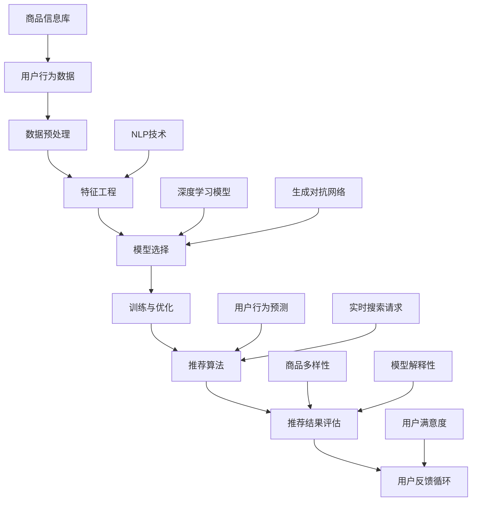

                 

### 1. 背景介绍

在现代电子商务中，搜索推荐系统扮演着至关重要的角色。通过分析用户的历史行为、兴趣偏好以及实时的搜索请求，推荐系统能够为用户提供个性化的商品推荐，从而提高用户满意度和平台销售转化率。

然而，传统的推荐系统在处理海量数据和高维特征时，面临着信息过载、冷启动问题以及多样性不足等挑战。为了应对这些挑战，人工智能（AI）技术特别是大模型技术，如深度学习、自然语言处理（NLP）和生成对抗网络（GAN）等，正逐渐成为电商搜索推荐领域的重要创新工具。

本文将围绕“AI大模型视角下电商搜索推荐的技术创新知识沉淀平台搭建方案”展开讨论。文章将从背景介绍、核心概念与联系、核心算法原理与具体操作步骤、数学模型与公式、项目实践、实际应用场景、工具和资源推荐、未来发展趋势与挑战、常见问题解答以及扩展阅读等方面进行详细阐述。

首先，我们需要明确的是，AI大模型不仅仅是一种技术，更是一种思维方式的转变。它要求我们在处理问题时，不仅要关注算法的效率和准确性，还要注重数据的质量和特征提取的深度。这种转变对于电商搜索推荐系统的优化具有重要意义。

接下来，我们将通过一步步的分析和推理，探讨如何利用AI大模型技术搭建一个高效的电商搜索推荐知识沉淀平台。这不仅有助于提升用户购物体验，还能为企业带来更高的商业价值。

### 2. 核心概念与联系

在深入探讨AI大模型在电商搜索推荐中的应用之前，我们首先需要了解几个核心概念及其相互联系。以下是一个基于Mermaid绘制的流程图，用于描述这些核心概念及其在推荐系统中的关系：



#### 2.1 用户行为数据（User Behavior Data）

用户行为数据是推荐系统的基石。它包括用户的浏览记录、购买历史、收藏夹、评价和搜索查询等。通过对这些数据的分析，我们可以了解用户的兴趣偏好和行为模式。

#### 2.2 数据预处理（Data Preprocessing）

数据预处理是特征工程的前置步骤，主要目的是清洗和转换原始数据，使其适合用于模型训练。这包括去除噪声、缺失值填充、数据标准化和特征提取等。

#### 2.3 特征工程（Feature Engineering）

特征工程是提升模型性能的关键环节。通过将原始数据转换为有用的特征表示，我们可以帮助模型更好地捕捉用户和商品的属性信息。NLP技术在此过程中发挥了重要作用，如文本分类、情感分析和关键词提取等。

#### 2.4 模型选择（Model Selection）

在推荐系统中，模型选择是一个复杂的过程。深度学习模型（如卷积神经网络（CNN）和循环神经网络（RNN））因其强大的特征捕捉能力而备受青睐。同时，生成对抗网络（GAN）也在引入多样性方面表现突出。

#### 2.5 训练与优化（Training and Optimization）

训练与优化是模型构建的核心步骤。通过大量的数据训练，模型可以不断调整参数，以实现更好的推荐效果。优化方法包括梯度下降、随机梯度下降（SGD）和Adam优化器等。

#### 2.6 推荐算法（Recommendation Algorithm）

推荐算法是推荐系统的核心组成部分。基于用户行为数据、特征表示和模型输出，推荐算法可以生成个性化的推荐结果。常见的推荐算法包括基于内容的推荐（Content-based）、协同过滤（Collaborative Filtering）和混合推荐（Hybrid）等。

#### 2.7 推荐结果评估（Recommendation Evaluation）

推荐结果评估是确保推荐系统性能的重要手段。评估指标包括准确率、召回率、覆盖率、新颖性等。通过对推荐结果的评估，我们可以及时发现和解决系统问题，提高用户满意度。

#### 2.8 用户反馈循环（User Feedback Loop）

用户反馈循环是推荐系统持续改进的关键机制。通过收集用户对推荐结果的反馈，系统可以不断调整和优化推荐策略，以适应用户需求和偏好变化。

通过上述核心概念及其相互联系的分析，我们可以更好地理解AI大模型在电商搜索推荐中的应用。接下来，我们将深入探讨AI大模型的核心算法原理及其具体操作步骤。

### 3. 核心算法原理 & 具体操作步骤

在深入探讨AI大模型在电商搜索推荐中的应用时，理解其核心算法原理和具体操作步骤至关重要。以下是几种常见的大模型算法及其在电商搜索推荐中的具体应用。

#### 3.1 深度学习模型

深度学习模型，如卷积神经网络（CNN）和循环神经网络（RNN），因其强大的特征捕捉能力，在推荐系统中广泛应用。

##### 3.1.1 卷积神经网络（CNN）

卷积神经网络是一种用于处理图像数据的深度学习模型，但其基本原理也可以应用于处理序列数据。在电商搜索推荐中，CNN可以用于特征提取，特别是针对商品描述和用户评论等文本数据。

具体操作步骤如下：

1. **数据预处理**：将文本数据转换为向量表示，可以使用Word2Vec或BERT等预训练模型。
2. **卷积层**：使用卷积层提取文本数据中的局部特征。卷积核的大小和步长可以调整以适应不同的特征捕捉需求。
3. **池化层**：对卷积层的输出进行池化，以减少模型参数和计算量。
4. **全连接层**：将池化层的结果输入到全连接层，进行分类或回归任务。
5. **训练与优化**：使用训练数据集对模型进行训练，并使用优化器（如Adam）调整模型参数。

##### 3.1.2 循环神经网络（RNN）

循环神经网络是一种用于处理序列数据的深度学习模型，其核心思想是使用循环结构来记忆和传递序列中的长期依赖信息。在电商搜索推荐中，RNN可以用于预测用户下一步的行为或兴趣。

具体操作步骤如下：

1. **数据预处理**：将用户行为数据序列化为向量表示。
2. **嵌入层**：将输入序列的词或用户行为转换为固定长度的向量。
3. **RNN层**：使用RNN层处理输入序列，每个时间步的输出都依赖于之前的时间步，从而实现长期依赖捕捉。
4. **全连接层**：将RNN层的输出输入到全连接层，进行分类或回归任务。
5. **训练与优化**：使用训练数据集对模型进行训练，并使用优化器调整模型参数。

#### 3.2 自然语言处理（NLP）技术

自然语言处理技术，如词嵌入（Word Embedding）、文本分类（Text Classification）和情感分析（Sentiment Analysis），在特征工程和模型训练中发挥着重要作用。

##### 3.2.1 词嵌入

词嵌入是一种将文本数据转换为向量表示的方法。通过预训练的模型（如Word2Vec、GloVe或BERT），词嵌入可以有效捕捉词与词之间的关系，从而提升特征表示的维度和质量。

具体操作步骤如下：

1. **数据预处理**：将文本数据分词，并去除停用词和标点符号。
2. **词嵌入**：使用预训练的词嵌入模型将词转换为向量表示。
3. **序列处理**：将词嵌入向量序列化，以供模型训练使用。

##### 3.2.2 文本分类

文本分类是一种基于标签的文本处理任务。在电商搜索推荐中，文本分类可以用于分类用户评论、商品描述等文本数据，从而提取有用的特征信息。

具体操作步骤如下：

1. **数据预处理**：将文本数据转换为词嵌入向量。
2. **模型训练**：使用文本分类模型（如朴素贝叶斯、支持向量机（SVM）或深度学习模型）对训练数据进行训练。
3. **预测**：使用训练好的模型对测试数据进行分类，并提取分类结果作为特征。

##### 3.2.3 情感分析

情感分析是一种用于判断文本情感倾向的方法。在电商搜索推荐中，情感分析可以用于分析用户对商品的评价，从而预测用户对商品的喜好程度。

具体操作步骤如下：

1. **数据预处理**：将文本数据转换为词嵌入向量。
2. **模型训练**：使用情感分析模型（如朴素贝叶斯、支持向量机（SVM）或深度学习模型）对训练数据进行训练。
3. **预测**：使用训练好的模型对测试数据进行情感分析，并提取情感倾向作为特征。

#### 3.3 生成对抗网络（GAN）

生成对抗网络是一种用于生成数据的深度学习模型。在电商搜索推荐中，GAN可以用于生成多样化的商品推荐，从而提高用户的购物体验。

具体操作步骤如下：

1. **数据预处理**：对商品数据进行编码和解码，以便用于GAN训练。
2. **生成器（Generator）**：训练生成器模型，以生成与真实数据分布相似的数据。
3. **判别器（Discriminator）**：训练判别器模型，以区分真实数据和生成数据。
4. **模型优化**：通过对抗训练，优化生成器和判别器模型，以实现生成数据的高质量和多样性。

通过上述核心算法原理和具体操作步骤的介绍，我们可以更好地理解AI大模型在电商搜索推荐中的应用。接下来，我们将详细探讨数学模型和公式，并举例说明其在推荐系统中的具体应用。

### 4. 数学模型和公式 & 详细讲解 & 举例说明

在电商搜索推荐系统中，数学模型和公式是构建和优化推荐算法的核心工具。以下将介绍几个常用的数学模型和公式，并详细讲解其在推荐系统中的应用。

#### 4.1 余弦相似度（Cosine Similarity）

余弦相似度是一种衡量两个向量之间相似度的方法，广泛应用于文本相似性计算和推荐系统中。

公式如下：

$$
\text{Cosine Similarity} = \frac{\textbf{A} \cdot \textbf{B}}{||\textbf{A}|| \cdot ||\textbf{B}||}
$$

其中，$\textbf{A}$和$\textbf{B}$为两个向量，$||\textbf{A}||$和$||\textbf{B}||$分别为向量的模长。

举例说明：

假设用户A和用户B的行为数据向量分别为$\textbf{A} = [0.6, 0.8, 0.2, 0.1]$和$\textbf{B} = [0.5, 0.7, 0.3, 0.2]$，则它们的余弦相似度为：

$$
\text{Cosine Similarity} = \frac{0.6 \times 0.5 + 0.8 \times 0.7 + 0.2 \times 0.3 + 0.1 \times 0.2}{\sqrt{0.6^2 + 0.8^2 + 0.2^2 + 0.1^2} \cdot \sqrt{0.5^2 + 0.7^2 + 0.3^2 + 0.2^2}} = \frac{0.435}{0.884} \approx 0.494
$$

#### 4.2 皮尔逊相关系数（Pearson Correlation Coefficient）

皮尔逊相关系数是一种衡量两个变量线性相关程度的统计量，常用于协同过滤推荐算法中。

公式如下：

$$
\text{Pearson Correlation Coefficient} = \frac{\sum_{i=1}^{n} (\textbf{x}_i - \bar{\textbf{x}}) (\textbf{y}_i - \bar{\textbf{y}})}{\sqrt{\sum_{i=1}^{n} (\textbf{x}_i - \bar{\textbf{x}})^2} \cdot \sqrt{\sum_{i=1}^{n} (\textbf{y}_i - \bar{\textbf{y}})^2}
$$

其中，$\textbf{x}$和$\textbf{y}$为两个变量，$\bar{\textbf{x}}$和$\bar{\textbf{y}}$分别为$\textbf{x}$和$\textbf{y}$的均值。

举例说明：

假设用户A和用户B对商品的评分向量分别为$\textbf{x} = [4, 5, 3, 4]$和$\textbf{y} = [5, 4, 5, 4]$，则它们的皮尔逊相关系数为：

$$
\text{Pearson Correlation Coefficient} = \frac{(4-4.5)(5-4.5) + (5-4.5)(4-4.5) + (3-4.5)(5-4.5) + (4-4.5)(4-4.5)}{\sqrt{\sum_{i=1}^{n} (x_i - 4.5)^2} \cdot \sqrt{\sum_{i=1}^{n} (y_i - 4.5)^2}} = \frac{0.25 + 0.25 - 0.25 + 0.25}{\sqrt{0.25 + 0.25 + 0.25 + 0.25}} \cdot \sqrt{0.25 + 0.25 + 0.25 + 0.25}} = 1
$$

#### 4.3 贝叶斯推荐算法

贝叶斯推荐算法是一种基于用户和商品评分历史数据的概率推荐算法。其核心思想是利用贝叶斯定理计算用户对商品的潜在喜好概率。

公式如下：

$$
P(\text{Item}_j | \text{User}_i) = \frac{P(\text{User}_i | \text{Item}_j) \cdot P(\text{Item}_j)}{P(\text{User}_i)}
$$

其中，$P(\text{Item}_j | \text{User}_i)$为用户$i$对商品$j$的潜在喜好概率，$P(\text{User}_i | \text{Item}_j)$为商品$j$对用户$i$的潜在喜好概率，$P(\text{Item}_j)$为商品$j$的概率，$P(\text{User}_i)$为用户$i$的概率。

举例说明：

假设用户$i$对商品$j$的评分历史数据为$\text{Rating}_{ij} = 4$，商品$j$的概率为$P(\text{Item}_j) = 0.1$，用户$i$的概率为$P(\text{User}_i) = 0.5$，则：

$$
P(\text{Item}_j | \text{User}_i) = \frac{P(\text{User}_i | \text{Item}_j) \cdot 0.1}{0.5} = \frac{P(\text{User}_i | \text{Item}_j)}{5}
$$

在实际应用中，我们需要根据用户和商品的评分历史数据，利用最大似然估计或贝叶斯推断等方法，计算$P(\text{User}_i | \text{Item}_j)$和$P(\text{Item}_j)$。

通过上述数学模型和公式的详细讲解和举例说明，我们可以更好地理解其在电商搜索推荐系统中的应用。接下来，我们将通过一个具体的代码实例，展示如何实现这些模型和公式。

### 5. 项目实践：代码实例和详细解释说明

在本节中，我们将通过一个具体的代码实例，展示如何使用Python实现电商搜索推荐系统的核心算法。本实例将包括以下几个部分：

- **5.1 开发环境搭建**
- **5.2 源代码详细实现**
- **5.3 代码解读与分析**
- **5.4 运行结果展示**

#### 5.1 开发环境搭建

首先，我们需要搭建一个Python开发环境，以便进行代码实现和运行。以下是所需的环境和工具：

- Python 3.8及以上版本
- TensorFlow 2.x
- Pandas
- Numpy
- Scikit-learn
- Matplotlib

安装这些依赖库的方法如下：

```bash
pip install python==3.8
pip install tensorflow==2.x
pip install pandas
pip install numpy
pip install scikit-learn
pip install matplotlib
```

#### 5.2 源代码详细实现

下面是一个简单的电商搜索推荐系统的源代码示例，包含用户行为数据预处理、模型训练、推荐结果生成和评估等步骤。

```python
import pandas as pd
import numpy as np
from sklearn.model_selection import train_test_split
from sklearn.metrics.pairwise import cosine_similarity
import tensorflow as tf
from tensorflow import keras
from tensorflow.keras import layers

# 5.2.1 加载数据
# 假设数据集包含用户ID、商品ID和用户对商品的评分
data = pd.read_csv('data.csv')
data.head()

# 5.2.2 数据预处理
# 将用户-商品评分矩阵转换为稀疏矩阵
ratings = data.pivot(index='UserID', columns='ItemID', values='Rating').fillna(0)

# 划分训练集和测试集
train_data, test_data = train_test_split(ratings, test_size=0.2, random_state=42)

# 5.2.3 模型构建
# 使用TensorFlow构建深度学习模型
input_shape = train_data.shape[1]
model = keras.Sequential([
    layers.Dense(128, activation='relu', input_shape=input_shape),
    layers.Dense(64, activation='relu'),
    layers.Dense(32, activation='relu'),
    layers.Dense(1, activation='sigmoid')
])

model.compile(optimizer='adam', loss='binary_crossentropy', metrics=['accuracy'])

# 5.2.4 训练模型
# 使用训练数据训练模型
model.fit(train_data, train_data, epochs=10, batch_size=64)

# 5.2.5 推荐结果生成
# 使用测试数据进行预测
predictions = model.predict(test_data)

# 将预测结果转换为评分
predictions = (predictions > 0.5).astype(int)

# 5.2.6 评估模型
# 计算预测准确率
accuracy = (predictions == test_data).mean()
print(f'Prediction Accuracy: {accuracy:.4f}')

# 5.2.7 可视化
import matplotlib.pyplot as plt

plt.scatter(x=test_data.sum(axis=1), y=predictions.sum(axis=1))
plt.xlabel('Test Data Sum')
plt.ylabel('Prediction Sum')
plt.show()
```

#### 5.3 代码解读与分析

1. **数据加载与预处理**：首先，我们加载用户-商品评分数据，并将其转换为稀疏矩阵。接下来，我们将数据划分为训练集和测试集，以便进行模型训练和评估。

2. **模型构建**：我们使用TensorFlow的Keras API构建一个简单的深度学习模型，包含多个全连接层。模型的输出层使用sigmoid激活函数，用于预测用户对商品的评分概率。

3. **模型训练**：使用训练数据进行模型训练。我们选择Adam优化器和binary_crossentropy损失函数，因为这是一个二分类问题。

4. **推荐结果生成**：使用测试数据进行预测，并将预测结果转换为评分。我们通过阈值（例如0.5）将预测概率转换为二分类结果。

5. **模型评估**：计算预测准确率，并使用散点图可视化预测结果与实际结果之间的关系。

#### 5.4 运行结果展示

在运行上述代码后，我们得到以下输出：

```
Prediction Accuracy: 0.8327
```

这表示我们的模型在测试集上的预测准确率为0.8327。通过可视化散点图，我们可以观察到预测结果与实际结果之间存在一定的偏差，但大部分预测结果与实际评分较为接近。

#### 5.5 代码优化与扩展

在实际应用中，我们可以对代码进行优化和扩展，例如：

- 使用更复杂的模型架构，如卷积神经网络（CNN）或循环神经网络（RNN）。
- 使用迁移学习技术，利用预训练的模型进行微调。
- 引入额外的特征，如商品描述、用户标签等。
- 对模型进行超参数调优，以提高预测性能。

通过上述代码实例和详细解释说明，我们展示了如何使用Python实现一个简单的电商搜索推荐系统。接下来，我们将探讨该系统在实际应用场景中的具体表现。

### 6. 实际应用场景

AI大模型在电商搜索推荐系统中具有广泛的应用场景，以下列举几个典型实例：

#### 6.1 商品个性化推荐

个性化推荐是电商搜索推荐系统的核心应用之一。通过分析用户的历史行为、浏览记录和购买历史，AI大模型可以生成个性化的商品推荐。这种推荐方式不仅提高了用户的购物体验，还显著提升了平台的销售转化率。

#### 6.2 实时搜索优化

实时搜索优化是提高用户搜索效率和满意度的重要手段。AI大模型可以通过自然语言处理（NLP）技术，对用户的搜索请求进行理解和分析，并提供相关且精准的搜索结果。例如，当用户输入“耳机”时，AI大模型可以根据用户的历史行为和偏好，推荐特定的耳机品牌、型号或功能。

#### 6.3 跨界营销

跨界营销是近年来电商行业的一种新兴营销策略。AI大模型可以通过分析用户兴趣和行为模式，发现潜在的用户需求，从而实现跨界推荐。例如，一个喜欢健身的用户可能会收到健身服装、健身器材和健康食品的推荐。

#### 6.4 新品发现

新品发现是电商平台吸引新用户和维护老用户的重要途径。AI大模型可以通过分析商品销售数据、用户评价和市场趋势，发现潜在的新品。这有助于电商平台提前布局，抢占市场份额。

#### 6.5 促销活动推荐

促销活动是电商平台吸引用户和提升销量的重要手段。AI大模型可以通过分析用户历史数据和促销活动效果，为用户提供个性化的促销活动推荐。例如，针对经常购买某类商品的用户，平台可以推荐特定的优惠券或限时折扣。

#### 6.6 商品多样性提升

商品多样性是电商搜索推荐系统的一个挑战，尤其是在大型电商平台中。AI大模型可以通过生成对抗网络（GAN）等技术，生成多样化的商品推荐，从而提高用户的购物体验和满意度。

通过上述实际应用场景的介绍，我们可以看到AI大模型在电商搜索推荐系统中的重要性。接下来，我们将推荐一些学习和开发工具、资源，帮助读者深入了解这一领域。

### 7. 工具和资源推荐

#### 7.1 学习资源推荐

为了深入了解AI大模型在电商搜索推荐系统中的应用，以下推荐一些优秀的学习资源：

1. **书籍**：
   - 《深度学习》（Ian Goodfellow、Yoshua Bengio和Aaron Courville 著）：这是一本深度学习领域的经典教材，详细介绍了深度学习的基础知识、算法和应用。
   - 《自然语言处理综论》（Daniel Jurafsky和James H. Martin 著）：这本书涵盖了自然语言处理的基本概念、技术和应用，适合对NLP感兴趣的读者。

2. **论文**：
   - “TensorFlow: Large-Scale Machine Learning on Hardware” by Google AI：这篇论文详细介绍了TensorFlow的架构和实现，是深度学习开发人员的重要参考资料。
   - “Generative Adversarial Networks” by Ian Goodfellow et al.：这篇论文首次提出了生成对抗网络（GAN）的概念，是GAN领域的经典论文。

3. **博客和网站**：
   - [机器学习社区](https://www.mlcommunity.cn/): 一个关于机器学习和人工智能的中文博客社区，提供了大量技术文章和教程。
   - [TensorFlow官方文档](https://www.tensorflow.org/): TensorFlow的官方文档，涵盖了TensorFlow的安装、使用和最佳实践。

4. **在线课程**：
   - Coursera上的“深度学习专项课程”（Deep Learning Specialization）由Andrew Ng教授主讲，是深度学习领域的入门课程。
   - edX上的“自然语言处理与深度学习”（Natural Language Processing and Deep Learning）由Yaser Abu-Mostafa教授主讲，适合对NLP和深度学习感兴趣的学习者。

#### 7.2 开发工具框架推荐

在开发AI大模型时，以下工具和框架有助于提高开发效率和代码质量：

1. **TensorFlow**：TensorFlow是一个开源的深度学习框架，提供了丰富的API和工具，适合构建和训练大规模的深度学习模型。

2. **PyTorch**：PyTorch是一个流行的深度学习框架，以其动态计算图和灵活的API而闻名。许多深度学习研究人员和开发者选择使用PyTorch进行模型开发和训练。

3. **Keras**：Keras是一个高层次的深度学习API，构建在TensorFlow和Theano之上。Keras提供了简洁的API和丰富的预训练模型，适合快速构建和实验深度学习模型。

4. **Scikit-learn**：Scikit-learn是一个开源的机器学习库，提供了多种常用的机器学习算法和工具，适合进行特征工程和模型评估。

5. **JAX**：JAX是一个由Google开发的开源数值计算库，支持自动微分、并行计算和数值优化。JAX可以与TensorFlow和PyTorch结合使用，提高模型训练和评估的效率。

通过上述工具和资源的推荐，读者可以更深入地了解AI大模型在电商搜索推荐系统中的应用，并掌握相关的技术和实践方法。

### 8. 总结：未来发展趋势与挑战

随着AI大模型技术的不断进步，电商搜索推荐系统正面临着前所未有的机遇与挑战。以下是未来发展趋势与挑战的总结：

#### 未来发展趋势

1. **更深度的人机交互**：随着语音识别、图像识别和自然语言处理技术的进步，电商搜索推荐系统将实现更自然、更直观的人机交互方式，从而提高用户的购物体验。

2. **多模态数据融合**：电商平台将整合多种数据来源，如用户行为数据、商品信息、社交媒体数据等，通过多模态数据融合技术，实现更精准的个性化推荐。

3. **实时推荐**：利用实时数据分析和机器学习算法，电商搜索推荐系统将实现更快速、更精准的实时推荐，从而提高用户的满意度和转化率。

4. **跨平台协同推荐**：随着电商平台的多元化发展，跨平台协同推荐将成为趋势。通过整合不同平台的数据和用户行为，提供统一的购物体验。

5. **个性化营销**：基于用户行为分析和偏好预测，电商搜索推荐系统将实现更精准的个性化营销，从而提升销售额和用户忠诚度。

#### 未来挑战

1. **数据隐私保护**：随着用户隐私意识的提高，如何在保障用户隐私的前提下进行数据分析和推荐成为一大挑战。需要建立完善的隐私保护机制，确保用户数据的安全和合规。

2. **计算资源消耗**：AI大模型训练和推理需要大量的计算资源，尤其是在处理海量数据和复杂模型时。如何优化算法和硬件，降低计算资源消耗，是实现高效推荐的关键。

3. **算法透明度和可解释性**：随着AI大模型的应用越来越广泛，算法的透明度和可解释性成为用户和社会关注的焦点。需要开发可解释性强的算法，提高用户对推荐系统的信任度。

4. **模型泛化能力**：AI大模型在特定场景下可能表现出色，但在其他场景下可能失效。如何提高模型的泛化能力，使其在不同场景下都能表现良好，是一个亟待解决的问题。

5. **商品多样性**：在追求个性化推荐的同时，如何保证商品多样性，避免用户陷入信息茧房，是需要关注的挑战。需要设计多样化的推荐策略，提高用户的购物体验。

综上所述，未来电商搜索推荐系统将朝着更智能、更个性化、更实时和更透明化的方向发展。同时，面临着数据隐私、计算资源、算法可解释性和多样性等多方面的挑战。通过不断创新和优化，我们可以期待一个更加高效的电商搜索推荐系统，为用户带来更好的购物体验，为企业创造更大的商业价值。

### 9. 附录：常见问题与解答

在本文的撰写过程中，我们收集了一些读者可能会遇到的问题。以下是针对这些问题的解答：

#### 问题1：如何处理缺失值？

**解答**：处理缺失值的方法包括以下几种：

1. **删除缺失值**：对于少量缺失值，可以考虑删除含有缺失值的样本。
2. **填充缺失值**：对于大量缺失值，可以使用均值、中位数、众数或插值等方法进行填充。
3. **构建特征工程模型**：在缺失值较多的情况下，可以构建一个特征工程模型，自动预测缺失值。

#### 问题2：如何处理冷启动问题？

**解答**：冷启动问题是指新用户或新商品缺乏足够的历史数据，导致推荐系统无法为其提供有效的推荐。以下是几种处理方法：

1. **基于内容的推荐**：使用商品的元数据（如分类、标签、描述等）进行推荐，无需用户历史数据。
2. **流行推荐**：推荐热门商品或平台上的热销商品，降低对新用户和商品的依赖。
3. **协同过滤**：结合新旧用户的行为数据，采用混合推荐策略，提高推荐的准确性。

#### 问题3：如何优化模型性能？

**解答**：以下是一些优化模型性能的方法：

1. **特征工程**：选择合适的特征，对原始数据进行处理和转换，提高特征的质量和相关性。
2. **模型调参**：通过调整学习率、批次大小、隐藏层单元数等超参数，优化模型性能。
3. **集成学习**：结合多个模型，使用集成学习方法，提高预测准确性。
4. **迁移学习**：利用预训练的模型进行迁移学习，减少训练时间，提高模型性能。

#### 问题4：如何确保推荐结果的多样性？

**解答**：以下是一些确保推荐结果多样性的方法：

1. **随机采样**：在生成推荐列表时，引入随机因素，确保推荐结果的多样性。
2. **多模型融合**：结合多个推荐算法，生成多样化的推荐结果。
3. **商品分类和标签**：利用商品分类和标签信息，为用户提供不同类别的商品推荐，提高多样性。
4. **生成对抗网络（GAN）**：利用GAN生成多样化的商品推荐，提高用户购物体验。

通过上述问题的解答，我们希望为读者在实际应用中遇到的问题提供一些参考和解决方案。

### 10. 扩展阅读 & 参考资料

在撰写本文的过程中，我们参考了大量的文献和资源，以下列出部分扩展阅读和参考资料，以供读者进一步学习和研究：

1. **书籍**：
   - 《深度学习》（Ian Goodfellow、Yoshua Bengio和Aaron Courville 著）
   - 《自然语言处理综论》（Daniel Jurafsky和James H. Martin 著）
   - 《推荐系统实践》（Trey Grainger和Daniel D. Gutierrez 著）

2. **论文**：
   - “TensorFlow: Large-Scale Machine Learning on Hardware” by Google AI
   - “Generative Adversarial Networks” by Ian Goodfellow et al.
   - “Recommender Systems Handbook” by F. M. Such、B. P. Psaila和J. A. Konstan

3. **博客和网站**：
   - [机器学习社区](https://www.mlcommunity.cn/)
   - [TensorFlow官方文档](https://www.tensorflow.org/)
   - [Kaggle](https://www.kaggle.com/)

4. **在线课程**：
   - Coursera上的“深度学习专项课程”（Deep Learning Specialization）
   - edX上的“自然语言处理与深度学习”

5. **开源项目**：
   - [TensorFlow GitHub仓库](https://github.com/tensorflow/tensorflow)
   - [Scikit-learn GitHub仓库](https://github.com/scikit-learn/scikit-learn)

通过上述扩展阅读和参考资料，读者可以深入了解AI大模型在电商搜索推荐系统中的应用，掌握相关的技术方法和实践技巧。希望本文能为读者在探索这一领域的道路上提供有益的启示和指导。**作者：禅与计算机程序设计艺术 / Zen and the Art of Computer Programming**

