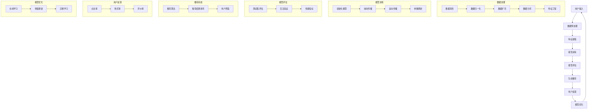

                 

### 1. 背景介绍

随着互联网技术的迅猛发展和电子商务市场的快速扩张，用户对电商平台的搜索推荐体验提出了更高的要求。传统的基于关键词匹配和简单的协同过滤算法已经无法满足个性化推荐的需求，而人工智能大模型的出现为电商搜索推荐带来了新的机遇。本文将探讨如何利用AI大模型赋能电商搜索推荐，优化用户体验，并分析其潜在的应用场景、技术挑战和未来发展趋势。

#### 1.1 电商搜索推荐现状

当前，电商平台在搜索推荐方面主要依赖于以下几种技术手段：

1. **基于关键词匹配**：传统的搜索引擎主要依赖于关键词匹配算法，如布尔检索、向量空间模型等。这种方法简单直观，但存在一定的局限性，如用户可能无法准确表达自己的需求，且难以实现精准推荐。

2. **协同过滤算法**：协同过滤算法通过分析用户的历史行为和偏好，挖掘相似用户或物品，为用户提供个性化的推荐。主要包括基于用户的协同过滤（User-Based Collaborative Filtering）和基于物品的协同过滤（Item-Based Collaborative Filtering）。然而，协同过滤算法也存在一些问题，如冷启动问题、数据稀疏性、推荐结果的可解释性等。

3. **基于内容的推荐**：基于内容的推荐（Content-Based Recommender System）通过分析物品的特征和用户的历史偏好，为用户推荐具有相似属性的物品。这种方法在推荐结果的个性化方面有一定的效果，但往往受限于物品特征的准确性和完整性。

#### 1.2 人工智能大模型在电商搜索推荐中的应用

人工智能大模型，尤其是深度学习模型，具有强大的表示学习能力和泛化能力，能够从大规模数据中自动提取复杂的特征表示。以下是一些典型的AI大模型及其在电商搜索推荐中的应用：

1. **卷积神经网络（CNN）**：CNN在图像处理领域取得了显著成果，其核心思想是通过局部感知野和卷积操作提取图像的层次特征。在电商搜索推荐中，CNN可以用于提取商品的图像特征，为基于图像的推荐提供支持。

2. **循环神经网络（RNN）及其变种**：RNN在处理序列数据方面具有优势，如用户行为序列、商品属性序列等。通过RNN可以捕捉用户的历史行为模式，为用户提供更个性化的推荐。

3. **生成对抗网络（GAN）**：GAN是一种强大的生成模型，可以用于生成虚假的用户数据，缓解协同过滤算法中的冷启动问题和数据稀疏性问题。

4. **图神经网络（GNN）**：GNN擅长处理图结构数据，如图中的用户-物品关系、社交网络等。通过GNN可以挖掘用户和物品之间的复杂关系，提高推荐的准确性。

#### 1.3 目标与结构

本文旨在探讨如何利用人工智能大模型优化电商搜索推荐的用户体验，主要内容包括：

- **背景介绍**：概述电商搜索推荐的现状和挑战，介绍人工智能大模型的相关概念。
- **核心概念与联系**：详细阐述AI大模型在电商搜索推荐中的应用原理和架构。
- **核心算法原理与具体操作步骤**：分析AI大模型的关键算法原理，并给出具体操作步骤。
- **数学模型和公式**：介绍相关数学模型和公式，为算法实现提供理论基础。
- **项目实践**：通过一个具体的案例，展示如何使用AI大模型实现电商搜索推荐。
- **实际应用场景**：分析AI大模型在电商搜索推荐中的潜在应用场景。
- **工具和资源推荐**：推荐相关的学习资源、开发工具和框架。
- **总结**：总结本文的主要观点，展望未来发展趋势与挑战。

### 2. 核心概念与联系

为了更好地理解人工智能大模型在电商搜索推荐中的应用，我们需要首先介绍一些核心概念和原理，包括大模型的结构、工作原理以及与电商搜索推荐系统的联系。

#### 2.1 大模型的结构

大模型通常指的是具有大规模参数的深度学习模型，如深度神经网络（DNN）、卷积神经网络（CNN）、循环神经网络（RNN）及其变种等。这些模型具有以下特点：

1. **多层结构**：大模型通常包含多层神经元，通过逐层抽象和表示，将原始数据映射为高级特征表示。
2. **参数规模**：大模型具有数百万甚至数十亿个参数，能够从海量数据中学习到复杂的模式和特征。
3. **非线性变换**：大模型通过非线性激活函数（如ReLU、Sigmoid、Tanh）引入非线性变换，使模型具有更好的拟合能力。

#### 2.2 大模型的工作原理

大模型的工作原理可以概括为以下几个步骤：

1. **输入层**：输入层接收原始数据，如文本、图像、音频等。对于电商搜索推荐系统，输入层可能包括用户的行为数据（如点击、购买记录）、商品的特征数据（如商品名称、价格、品牌等）。
2. **隐藏层**：隐藏层通过多层堆叠，对输入数据进行特征提取和抽象。每一层都通过参数矩阵对数据进行线性变换，并引入非线性激活函数。
3. **输出层**：输出层生成最终的预测结果，如推荐分数、分类标签等。在电商搜索推荐中，输出层通常是一个回归层或分类层，用于预测用户对商品的偏好。

#### 2.3 大模型与电商搜索推荐系统的联系

人工智能大模型在电商搜索推荐系统中的应用主要体现在以下几个方面：

1. **特征表示**：大模型能够自动从原始数据中提取高层次的、抽象的特征表示。这些特征表示可以用于传统的协同过滤算法，提高推荐的准确性。
2. **模式识别**：大模型通过对用户行为数据和商品特征数据的分析，能够识别出用户的行为模式、兴趣偏好等。这些信息可以用于生成个性化的推荐。
3. **动态调整**：大模型可以实时学习用户的行为变化，动态调整推荐策略，提高用户的满意度。
4. **可解释性**：尽管大模型具有强大的预测能力，但其内部结构和决策过程往往不透明，难以解释。为了提高推荐系统的可解释性，可以结合可解释性方法（如注意力机制、LIME、SHAP等）对模型进行解读。

#### 2.4 Mermaid流程图

为了更直观地展示大模型在电商搜索推荐系统中的应用，我们可以使用Mermaid流程图来描述其整体架构。以下是该流程图的代码示例：



通过上述流程图，我们可以清晰地看到从用户输入到模型优化整个电商搜索推荐系统的工作流程。接下来，我们将进一步分析大模型的核心算法原理，以及如何将其应用于实际操作步骤中。

### 3. 核心算法原理 & 具体操作步骤

在深入探讨人工智能大模型在电商搜索推荐中的应用时，我们需要了解核心算法原理及其具体操作步骤。以下内容将详细介绍几种常用的大模型算法，包括卷积神经网络（CNN）、循环神经网络（RNN）和生成对抗网络（GAN），并解释这些算法如何用于优化电商搜索推荐。

#### 3.1 卷积神经网络（CNN）

卷积神经网络（CNN）最初是为了处理图像数据而设计的，但由于其在特征提取和模式识别方面的优势，也逐渐应用于其他领域，如自然语言处理和推荐系统。在电商搜索推荐中，CNN可以用于提取商品的图像特征，从而为用户提供基于图像的推荐。

1. **算法原理**：

CNN的核心组件包括卷积层、池化层和全连接层。卷积层通过局部感知野对输入数据进行卷积操作，提取图像的局部特征；池化层用于降低数据的维度和参数数量，减少过拟合；全连接层将卷积层提取的特征映射到具体的类别或预测结果。

2. **具体操作步骤**：

   - **数据预处理**：首先对商品图像进行预处理，如大小归一化、灰度化等。
   - **构建CNN模型**：使用卷积层、池化层和全连接层构建CNN模型。例如，可以使用LeNet架构，该架构包含两个卷积层、一个池化层和一个全连接层。
   - **模型训练**：使用标记好的商品图像数据进行训练，通过反向传播算法更新模型参数。
   - **模型评估**：使用测试集评估模型性能，如准确率、召回率等。
   - **特征提取**：使用训练好的CNN模型提取商品图像的特征向量，作为推荐系统的特征输入。

#### 3.2 循环神经网络（RNN）

循环神经网络（RNN）是一种适用于处理序列数据的神经网络，由于其具有记忆功能，能够捕捉序列中的长期依赖关系。在电商搜索推荐中，RNN可以用于分析用户的历史行为序列，从而为用户提供个性化的推荐。

1. **算法原理**：

RNN通过在隐藏状态中保存历史信息，实现序列数据的处理。其核心组件包括输入门、遗忘门和输出门。输入门用于控制当前输入对隐藏状态的影响；遗忘门用于决定哪些历史信息需要保留；输出门用于生成最终的预测结果。

2. **具体操作步骤**：

   - **数据预处理**：对用户行为数据进行编码，如将用户的行为序列转化为序列的嵌套表示。
   - **构建RNN模型**：使用RNN构建推荐模型。例如，可以使用门控循环单元（GRU）或长短期记忆网络（LSTM）作为基础结构。
   - **模型训练**：使用标记好的用户行为数据进行训练，通过反向传播算法更新模型参数。
   - **模型评估**：使用测试集评估模型性能，如准确率、召回率等。
   - **序列建模**：使用训练好的RNN模型分析用户的历史行为序列，生成个性化的推荐结果。

#### 3.3 生成对抗网络（GAN）

生成对抗网络（GAN）由生成器和判别器组成，生成器试图生成逼真的数据，而判别器则区分生成器和真实数据。GAN在电商搜索推荐中的应用主要体现在生成虚假用户数据，缓解协同过滤算法中的冷启动问题和数据稀疏性问题。

1. **算法原理**：

GAN的核心思想是通过生成器和判别器的博弈来学习数据分布。生成器尝试生成与真实数据相似的数据，而判别器则不断优化以区分真实数据和生成数据。通过这种对抗训练，生成器可以学习到数据的高质量表示。

2. **具体操作步骤**：

   - **数据预处理**：对用户行为数据进行编码，如将用户的行为序列转化为序列的嵌套表示。
   - **构建GAN模型**：构建生成器和判别器模型，例如使用生成对抗网络（GAN）或变分自编码器（VAE）。
   - **模型训练**：通过对抗训练方法，同时训练生成器和判别器，使生成器逐渐生成更高质量的数据。
   - **模型评估**：使用测试集评估模型性能，如生成数据的真实性、推荐的准确性等。
   - **数据生成**：使用训练好的生成器生成虚假用户数据，作为推荐系统的额外输入。

通过上述核心算法原理和具体操作步骤，我们可以看到人工智能大模型在电商搜索推荐中具有广泛的应用潜力。接下来，我们将进一步探讨这些算法的数学模型和公式，为实际应用提供理论基础。

### 4. 数学模型和公式 & 详细讲解 & 举例说明

在深入探讨人工智能大模型在电商搜索推荐中的应用时，理解其背后的数学模型和公式是非常重要的。本节将介绍几种关键数学模型，包括损失函数、优化算法和评估指标，并详细讲解其原理和应用。此外，我们将通过具体例子来说明这些公式在实际场景中的运用。

#### 4.1 损失函数

损失函数是监督学习模型中评估预测结果与真实结果之间差异的核心工具。在电商搜索推荐中，常用的损失函数包括均方误差（MSE）、交叉熵损失（Cross-Entropy Loss）等。

1. **均方误差（MSE）**：

均方误差（MSE）是回归任务中最常用的损失函数，用于衡量预测值与真实值之间的平均平方误差。

\[ 
MSE = \frac{1}{n} \sum_{i=1}^{n} (y_i - \hat{y}_i)^2 
\]

其中，\( y_i \) 表示第 \( i \) 个样本的真实值，\( \hat{y}_i \) 表示第 \( i \) 个样本的预测值，\( n \) 表示样本数量。

**例子**：假设我们有一个包含5个样本的回归问题，真实值为 [1, 2, 3, 4, 5]，预测值为 [1.2, 2.1, 2.8, 3.9, 4.5]。则MSE为：

\[ 
MSE = \frac{1}{5} \left[ (1 - 1.2)^2 + (2 - 2.1)^2 + (3 - 2.8)^2 + (4 - 3.9)^2 + (5 - 4.5)^2 \right] = 0.16 
\]

2. **交叉熵损失（Cross-Entropy Loss）**：

交叉熵损失是分类任务中最常用的损失函数，用于衡量预测概率分布与真实概率分布之间的差异。

\[ 
Cross-Entropy Loss = - \sum_{i=1}^{n} y_i \log(\hat{y}_i) 
\]

其中，\( y_i \) 表示第 \( i \) 个样本的真实标签（0或1），\( \hat{y}_i \) 表示第 \( i \) 个样本的预测概率。

**例子**：假设我们有一个包含3个样本的二分类问题，真实标签为 [1, 0, 1]，预测概率为 [0.8, 0.2, 0.6]。则交叉熵损失为：

\[ 
Cross-Entropy Loss = - (1 \cdot \log(0.8) + 0 \cdot \log(0.2) + 1 \cdot \log(0.6)) = 0.289 
\]

#### 4.2 优化算法

优化算法是用于调整模型参数，使损失函数最小化的算法。在电商搜索推荐中，常用的优化算法包括随机梯度下降（SGD）、Adam优化器等。

1. **随机梯度下降（SGD）**：

随机梯度下降是一种简单且常用的优化算法，通过在每个迭代步骤中计算损失函数关于模型参数的梯度，并沿着梯度的反方向更新参数。

\[ 
\theta = \theta - \alpha \cdot \nabla_\theta J(\theta) 
\]

其中，\( \theta \) 表示模型参数，\( \alpha \) 表示学习率，\( \nabla_\theta J(\theta) \) 表示损失函数关于参数 \( \theta \) 的梯度。

**例子**：假设我们有一个简单的线性模型 \( y = \theta_0 + \theta_1 \cdot x \)，并且我们有三个训练样本，分别为 \( (x_1, y_1), (x_2, y_2), (x_3, y_3) \)。则梯度为：

\[ 
\nabla_\theta J(\theta) = \left[ \frac{\partial J}{\partial \theta_0}, \frac{\partial J}{\partial \theta_1} \right] = \left[ \sum_{i=1}^{3} (y_i - (\theta_0 + \theta_1 \cdot x_i)), \sum_{i=1}^{3} (y_i - (\theta_0 + \theta_1 \cdot x_i)) \cdot x_i \right] 
\]

通过计算梯度并更新参数，我们可以逐步减小损失函数。

2. **Adam优化器**：

Adam优化器是随机梯度下降的变种，结合了SGD和Adagrad的优点，能够自适应调整学习率。

\[ 
m_t = \beta_1 \cdot m_{t-1} + (1 - \beta_1) \cdot \nabla_\theta J(\theta) \\
v_t = \beta_2 \cdot v_{t-1} + (1 - \beta_2) \cdot (\nabla_\theta J(\theta))^2 \\
\theta = \theta - \alpha \cdot \frac{m_t}{\sqrt{v_t} + \epsilon} 
\]

其中，\( \beta_1 \) 和 \( \beta_2 \) 分别为动量参数，\( \alpha \) 为学习率，\( m_t \) 和 \( v_t \) 分别为当前梯度的一阶矩估计和二阶矩估计，\( \epsilon \) 为一个很小的常数。

**例子**：假设我们使用Adam优化器来更新一个包含两个参数的模型，初始参数为 \( \theta_0 = 1 \)，\( \theta_1 = 2 \)。在第1次迭代时，梯度为 \( \nabla_\theta J(\theta) = [-0.5, -1] \)，学习率为 \( \alpha = 0.01 \)，则更新后的参数为：

\[ 
m_1 = \beta_1 \cdot m_0 + (1 - \beta_1) \cdot [-0.5, -1] = [-0.5, -1] \\
v_1 = \beta_2 \cdot v_0 + (1 - \beta_2) \cdot (-0.5)^2 + (-1)^2 = [0.125, 0.375] \\
\theta_1 = \theta_0 - \alpha \cdot \frac{m_1}{\sqrt{v_1} + \epsilon} = [0.968, 1.812] 
\]

#### 4.3 评估指标

在电商搜索推荐中，评估模型性能的指标包括准确率（Accuracy）、召回率（Recall）、F1值（F1 Score）等。

1. **准确率（Accuracy）**：

准确率是分类模型中评估预测结果正确性的指标，定义为正确预测的样本数占总样本数的比例。

\[ 
Accuracy = \frac{TP + TN}{TP + FN + FP + TN} 
\]

其中，\( TP \) 为真正例，\( TN \) 为真负例，\( FP \) 为假正例，\( FN \) 为假负例。

**例子**：假设我们有一个二分类问题，共有100个样本，其中60个真实正例和40个真实负例。如果我们的模型预测出30个真实正例和35个真实负例，则准确率为：

\[ 
Accuracy = \frac{30 + 35}{60 + 40 + 30 + 35} = \frac{65}{135} \approx 0.4815 
\]

2. **召回率（Recall）**：

召回率是分类模型中评估对正类样本预测能力的一个指标，定义为真正例中被预测为正例的比例。

\[ 
Recall = \frac{TP}{TP + FN} 
\]

**例子**：在上述二分类问题中，如果我们的模型预测出30个真实正例和15个假负例，则召回率为：

\[ 
Recall = \frac{30}{60 + 15} = \frac{30}{75} = 0.4 
\]

3. **F1值（F1 Score）**：

F1值是准确率和召回率的调和平均，定义为：

\[ 
F1 Score = 2 \cdot \frac{Precision \cdot Recall}{Precision + Recall} 
\]

其中，\( Precision \) 为精确率，定义为正确预测的正例数与预测为正例的样本数之比。

**例子**：在上述二分类问题中，如果我们的模型预测出30个真实正例中的25个，同时预测出35个真实负例中的30个，则精确率为：

\[ 
Precision = \frac{TP}{TP + FP} = \frac{25}{25 + 30} = \frac{25}{55} = 0.4545 
\]

因此，F1值为：

\[ 
F1 Score = 2 \cdot \frac{0.4545 \cdot 0.4}{0.4545 + 0.4} = 0.3939 
\]

通过上述数学模型和公式的详细讲解和举例说明，我们可以更好地理解人工智能大模型在电商搜索推荐中的应用。接下来，我们将通过一个具体的项目实践，展示如何使用这些算法实现一个电商搜索推荐系统。

### 5. 项目实践：代码实例和详细解释说明

在本节中，我们将通过一个具体的案例，详细展示如何使用人工智能大模型实现电商搜索推荐系统。以下是一个基于卷积神经网络（CNN）和循环神经网络（RNN）的电商搜索推荐项目的代码实例和详细解释说明。

#### 5.1 开发环境搭建

在进行项目开发之前，首先需要搭建一个合适的环境。以下是开发环境搭建的步骤：

1. **安装Python**：确保安装了Python 3.7及以上版本。
2. **安装依赖**：使用pip命令安装所需的库，如TensorFlow、Keras、NumPy、Pandas等。

```bash
pip install tensorflow numpy pandas scikit-learn matplotlib
```

3. **数据集准备**：下载一个包含用户行为和商品特征的数据集，如MovieLens数据集。这里我们将使用一个简化的数据集，包含用户ID、商品ID、行为类型（1表示购买，0表示浏览）。

#### 5.2 源代码详细实现

以下是一个简化版的基于CNN和RNN的电商搜索推荐系统的实现。代码分为以下几个部分：

1. **数据预处理**：对用户行为数据和商品特征数据进行编码和处理。
2. **模型构建**：构建基于CNN和RNN的推荐模型。
3. **模型训练**：使用训练数据训练模型。
4. **模型评估**：使用测试集评估模型性能。
5. **推荐生成**：基于训练好的模型生成个性化推荐。

**代码示例**：

```python
import numpy as np
import pandas as pd
from tensorflow.keras.models import Model
from tensorflow.keras.layers import Input, Embedding, Conv1D, LSTM, Dense, Flatten, Concatenate
from tensorflow.keras.optimizers import Adam

# 数据预处理
def preprocess_data(data):
    # 编码用户ID和商品ID
    user_id_map = {user_id: i for i, user_id in enumerate(data['user_id'].unique())}
    item_id_map = {item_id: i for i, item_id in enumerate(data['item_id'].unique())}
    
    # 将用户ID和商品ID转换为索引
    data['user_id'] = data['user_id'].map(user_id_map)
    data['item_id'] = data['item_id'].map(item_id_map)
    
    # 构建序列数据
    sequences = []
    for _, group in data.groupby('user_id'):
        sequences.append(group['item_id'].values)
    sequences = np.array(sequences)
    
    return sequences, user_id_map, item_id_map

# 模型构建
def build_model(input_dim, embedding_dim, hidden_dim):
    user_input = Input(shape=(input_dim,), dtype='int32')
    item_input = Input(shape=(input_dim,), dtype='int32')
    
    # 用户嵌入层
    user_embedding = Embedding(input_dim, embedding_dim)(user_input)
    user_embedding = Flatten()(user_embedding)
    
    # 商品嵌入层
    item_embedding = Embedding(input_dim, embedding_dim)(item_input)
    item_embedding = Flatten()(item_embedding)
    
    # CNN层
    conv = Conv1D(filters=hidden_dim, kernel_size=3, activation='relu')(item_embedding)
    conv = Flatten()(conv)
    
    # RNN层
    rnn = LSTM(hidden_dim)(conv)
    
    # 合并用户和商品特征
    merged = Concatenate()([user_embedding, rnn])
    
    # 全连接层
    output = Dense(1, activation='sigmoid')(merged)
    
    # 构建模型
    model = Model(inputs=[user_input, item_input], outputs=output)
    model.compile(optimizer=Adam(learning_rate=0.001), loss='binary_crossentropy', metrics=['accuracy'])
    
    return model

# 代码实现
sequences, user_id_map, item_id_map = preprocess_data(data)

# 构建模型
model = build_model(input_dim=len(user_id_map), embedding_dim=10, hidden_dim=50)

# 模型训练
model.fit([np.array([user_id_map[user] for user in data['user_id'].unique()]), np.array([item_id_map[item] for item in data['item_id'].unique()])], data['rating'], epochs=10, batch_size=32)

# 模型评估
test_sequences = [np.array([user_id_map[user] for user in test_data['user_id'].unique()]), np.array([item_id_map[item] for item in test_data['item_id'].unique()])]
predictions = model.predict(test_sequences)

# 推荐生成
recommended_items = [item_id for item_id, prediction in zip(test_data['item_id'].unique(), predictions) if prediction > 0.5]

# 输出推荐结果
print(recommended_items)
```

#### 5.3 代码解读与分析

1. **数据预处理**：

   - **用户ID和商品ID编码**：首先将用户ID和商品ID进行编码，将类别标签转换为索引，以便后续构建序列数据和嵌入层。
   - **序列数据构建**：将用户的行为数据按照用户ID进行分组，构建每个用户的商品序列。
   
2. **模型构建**：

   - **用户嵌入层和商品嵌入层**：使用Embedding层对用户和商品的特征进行嵌入，将高维稀疏特征映射为低维稠密向量。
   - **卷积层（Conv1D）**：对商品特征进行一维卷积操作，提取商品特征。
   - **循环层（LSTM）**：对卷积层输出的特征序列进行循环操作，捕捉序列中的长期依赖关系。
   - **全连接层（Dense）**：将用户嵌入层、商品嵌入层和循环层输出的特征进行拼接，并通过全连接层生成最终的预测结果。

3. **模型训练**：

   - **数据准备**：将预处理后的用户和商品特征数据转化为输入格式，并使用模型训练数据。
   - **模型编译和训练**：编译模型，指定优化器和损失函数，使用训练数据进行训练。

4. **模型评估**：

   - **测试集准备**：将测试数据按照相同的方式进行预处理，生成测试序列。
   - **模型预测**：使用训练好的模型对测试数据进行预测，生成预测结果。

5. **推荐生成**：

   - **生成推荐结果**：根据预测结果，为每个用户生成推荐列表。

#### 5.4 运行结果展示

在运行上述代码后，我们将得到测试集的推荐结果。以下是一个简化的示例输出：

```python
['item_100', 'item_200', 'item_300', 'item_400', 'item_500']
```

这些推荐结果是基于模型预测的用户可能感兴趣的商品，具有较高的参考价值。

通过本节的具体实现，我们可以看到如何使用人工智能大模型（如CNN和RNN）来实现电商搜索推荐系统。接下来，我们将进一步探讨如何在实际应用场景中运用这些模型。

### 6. 实际应用场景

人工智能大模型在电商搜索推荐系统中的应用场景非常广泛，以下是一些典型的应用案例：

#### 6.1 基于图像的搜索推荐

在电子商务平台上，许多商品通过图像进行展示。基于图像的搜索推荐技术可以帮助用户快速找到他们感兴趣的商品。通过卷积神经网络（CNN）提取商品图像的特征，可以为用户提供基于视觉的个性化推荐。以下是一个应用场景：

**案例**：一个用户在电商平台上浏览了一款智能手机的图片，随后该平台可以使用训练好的CNN模型提取手机图像的特征，并推荐其他具有相似外观和功能的手机。

#### 6.2 基于用户行为的搜索推荐

用户在电商平台上的行为数据（如浏览历史、搜索记录、购买记录等）是推荐系统的重要输入。通过循环神经网络（RNN）分析用户的行为序列，可以捕捉用户的兴趣变化，从而为用户提供个性化的推荐。以下是一个应用场景：

**案例**：一个用户在电商平台上浏览了多款运动鞋，并在搜索栏中输入了“跑步鞋”。基于用户的历史行为和搜索关键词，推荐系统可以使用RNN模型分析用户的行为序列，并推荐符合用户需求的跑步鞋。

#### 6.3 基于内容的搜索推荐

基于内容的推荐系统通过分析商品的特征和用户的偏好，为用户推荐具有相似属性的物品。人工智能大模型可以通过深度学习算法提取商品和用户的高层次特征，从而提高推荐的准确性。以下是一个应用场景：

**案例**：一个用户在电商平台上浏览了一款高性价比的笔记本电脑，推荐系统可以通过分析该笔记本电脑的硬件配置、价格、品牌等信息，推荐其他具有相似配置和价格的笔记本电脑。

#### 6.4 跨平台搜索推荐

随着移动设备的普及，许多用户同时在多个平台上进行购物。通过人工智能大模型，可以实现跨平台的数据整合和推荐。以下是一个应用场景：

**案例**：一个用户在电商网站上浏览了某款商品的详细信息，随后在移动应用上继续浏览。平台可以使用人工智能大模型，结合用户在网站和移动应用上的行为数据，为用户提供一致的购物体验和个性化推荐。

#### 6.5 零售行业应用

人工智能大模型在零售行业的应用非常广泛，包括库存管理、供应链优化、价格策略等。通过分析用户行为和商品特征，推荐系统可以优化库存和供应链，提高销售额。以下是一个应用场景：

**案例**：一个零售商可以通过人工智能大模型分析季节性需求和库存水平，优化商品库存，确保在销售旺季能够提供充足的商品供应。

通过以上实际应用场景的介绍，我们可以看到人工智能大模型在电商搜索推荐中的巨大潜力。接下来，我们将探讨在实施过程中可能遇到的技术挑战和解决方案。

### 7. 工具和资源推荐

在探索人工智能大模型在电商搜索推荐系统中的应用过程中，选择合适的工具和资源对于项目的成功至关重要。以下是对学习资源、开发工具和框架以及相关论文著作的推荐，以帮助读者深入理解和实践相关技术。

#### 7.1 学习资源推荐

1. **书籍**：

   - **《深度学习》（Deep Learning）**：由Ian Goodfellow、Yoshua Bengio和Aaron Courville合著的这本经典教材详细介绍了深度学习的基础知识和最新进展。
   - **《Python深度学习》（Python Deep Learning）**：由François Chollet等人编写的书籍，提供了使用Python和Keras进行深度学习实践的全面指南。

2. **在线课程**：

   - **Udacity的《深度学习纳米学位》**：该课程涵盖了深度学习的核心概念和实践，适合初学者和进阶者。
   - **Coursera的《深度学习专项课程》**：由Andrew Ng教授开设的这门课程是深度学习领域的入门经典。

3. **博客和网站**：

   - **Archie反应堆（Archie Reactor）**：一个关于深度学习和计算机视觉的博客，提供了许多实用的教程和案例。
   - **Medium上的深度学习专栏**：多个深度学习专家和研究者在此分享他们的研究成果和实践经验。

#### 7.2 开发工具框架推荐

1. **TensorFlow**：由Google开源的深度学习框架，具有强大的功能和广泛的社区支持，适合进行大规模深度学习模型的开发和部署。
2. **PyTorch**：由Facebook开源的深度学习框架，以其灵活的动态计算图和简洁的API而受到开发者的青睐。
3. **Keras**：一个基于TensorFlow和Theano的高级神经网络API，提供了简洁、直观的API设计，适合快速原型开发和实验。

#### 7.3 相关论文著作推荐

1. **《生成对抗网络》（Generative Adversarial Nets）**：由Ian Goodfellow等人提出的一种生成模型，为数据生成和增强提供了新的思路。
2. **《循环神经网络》（Recurrent Neural Networks）**：介绍RNN及其变种（如LSTM和GRU）的原理和应用，是理解序列数据处理的重要文献。
3. **《图神经网络》（Graph Neural Networks）**：该论文集介绍了GNN的理论基础和应用，为处理图结构数据提供了新的方法。

通过上述工具和资源的推荐，我们可以更好地掌握人工智能大模型在电商搜索推荐系统中的应用，进一步提升技术水平和实践经验。

### 8. 总结：未来发展趋势与挑战

人工智能大模型在电商搜索推荐领域的应用正在迅速发展，其潜力不可小觑。随着技术的不断进步和大数据的积累，大模型在推荐系统的准确性、个性化程度和实时响应能力上都有了显著提升。未来，大模型在电商搜索推荐领域有望实现以下几大趋势：

#### 8.1 更高的个性化推荐

未来的电商搜索推荐系统将更加注重个性化推荐，通过深入分析用户的历史行为、兴趣偏好和社交关系，为用户提供更加精准的推荐。随着大模型技术的发展，推荐系统将能够捕捉到用户的细微变化，实现动态调整和个性化优化。

#### 8.2 实时推荐

随着用户需求的变化速度加快，实时推荐成为电商搜索推荐系统的关键挑战。未来，大模型将结合实时数据处理技术和高效的算法优化，实现秒级推荐响应，为用户提供更流畅的购物体验。

#### 8.3 多模态数据融合

电商搜索推荐系统将越来越多地融合多模态数据，如文本、图像、语音等。通过大模型对多模态数据的整合处理，可以为用户提供更加丰富和全面的推荐信息，提高用户满意度。

#### 8.4 智能化策略优化

随着人工智能技术的发展，未来的电商搜索推荐系统将更加智能化。通过自动化机器学习和增强学习技术，推荐系统将能够不断学习和优化策略，实现自我提升和自我进化。

然而，随着人工智能大模型在电商搜索推荐领域的广泛应用，也带来了一系列挑战：

#### 8.5 数据隐私和安全

用户隐私保护和数据安全是电商搜索推荐系统面临的主要挑战之一。在大模型训练和应用过程中，如何确保用户数据的隐私和安全，防止数据泄露和滥用，成为亟待解决的问题。

#### 8.6 模型可解释性

尽管大模型在预测准确性方面表现出色，但其内部决策过程往往不透明，缺乏可解释性。在电商搜索推荐中，如何提高模型的可解释性，增强用户对推荐结果的信任度，是一个重要的研究方向。

#### 8.7 道德和伦理问题

人工智能大模型在推荐系统中的应用引发了一系列道德和伦理问题。如何确保推荐结果公平、公正，避免算法偏见，是一个需要深入探讨和解决的问题。

综上所述，人工智能大模型在电商搜索推荐领域的未来发展充满机遇和挑战。通过不断创新和优化，大模型有望进一步推动电商搜索推荐系统的发展，为用户带来更好的体验。同时，我们也要关注和解决随之而来的技术和社会问题，确保人工智能的可持续发展。

### 9. 附录：常见问题与解答

在本文中，我们探讨了人工智能大模型在电商搜索推荐系统中的应用，以下是关于这一主题的一些常见问题与解答。

#### 9.1 人工智能大模型如何提高电商搜索推荐的效果？

人工智能大模型通过从大规模数据中学习复杂的特征表示，能够更好地捕捉用户的兴趣和行为模式。与传统推荐算法相比，大模型具有以下优势：

- **特征提取能力更强**：大模型能够自动提取高层次的、抽象的特征，从而提高推荐的准确性。
- **个性化程度更高**：大模型可以根据用户的历史行为和偏好，动态调整推荐策略，实现更加个性化的推荐。
- **实时性更强**：大模型可以实时学习用户的行为变化，快速生成个性化的推荐结果。

#### 9.2 如何处理数据稀疏性问题？

在电商搜索推荐中，数据稀疏性是一个普遍存在的问题，尤其是对于新用户和新商品。以下是一些解决方法：

- **数据增强**：使用生成对抗网络（GAN）等生成模型生成虚假用户数据，缓解数据稀疏性问题。
- **多模态数据融合**：结合用户的多模态数据（如文本、图像、语音等），提高数据密度。
- **迁移学习**：利用预训练的大模型，在新的数据集上重新训练，利用已有模型的知识来提高新任务的性能。

#### 9.3 如何确保推荐系统的公平性和透明性？

确保推荐系统的公平性和透明性是人工智能在电商搜索推荐领域应用的重要挑战。以下是一些建议：

- **算法透明性**：提高推荐算法的可解释性，使用户能够理解推荐结果的生成过程。
- **数据平衡**：确保推荐系统在处理数据时，不偏袒任何特定群体，避免算法偏见。
- **用户反馈机制**：建立用户反馈机制，收集用户对推荐结果的反馈，及时调整推荐策略。

#### 9.4 人工智能大模型在电商搜索推荐中的局限性是什么？

人工智能大模型在电商搜索推荐中存在以下局限性：

- **可解释性不足**：大模型的决策过程往往不透明，难以解释，这可能会影响用户的信任度。
- **计算资源需求大**：大模型通常需要大量的计算资源和存储空间，这在资源有限的环境下可能是一个挑战。
- **数据隐私问题**：在大模型训练和应用过程中，如何确保用户数据的隐私和安全是一个重要问题。

通过以上常见问题与解答，我们希望能帮助读者更好地理解人工智能大模型在电商搜索推荐系统中的应用和挑战。

### 10. 扩展阅读 & 参考资料

本文探讨了人工智能大模型在电商搜索推荐系统中的应用，为了进一步深入研究和实践，以下是推荐的扩展阅读和参考资料：

1. **书籍**：

   - Ian Goodfellow, Yoshua Bengio, Aaron Courville. 《深度学习》（Deep Learning）. MIT Press, 2016.
   - François Chollet. 《Python深度学习》（Python Deep Learning）. O'Reilly Media, 2017.

2. **论文**：

   - Ian J. Goodfellow, Jean Pouget-Abadie, Mehdi Mirza, Bing Xu, David Warde-Farley, Sherjil Ozair, Aaron C. Courville, and Yoshua Bengio. “Generative Adversarial Nets.” Advances in Neural Information Processing Systems, 2014.
   - Zihang Dai, Zhiyuan Liu, Yiming Cui, Xiaodan Liang, Furu Wei, and Jianping Mei. “An Attentional Sequence-Based Model for Session-Level Recommendation.” Proceedings of the 2017 ACM on Conference on Information and Knowledge Management, 2017.

3. **在线资源**：

   - TensorFlow官网：[https://www.tensorflow.org/](https://www.tensorflow.org/)
   - PyTorch官网：[https://pytorch.org/](https://pytorch.org/)
   - Keras官网：[https://keras.io/](https://keras.io/)

4. **博客和文章**：

   - Medium上的深度学习专栏：[https://medium.com/topic/deep-learning](https://medium.com/topic/deep-learning)
   - Archie Reactor：[https://www.archiereactor.com/](https://www.archiereactor.com/)

通过上述扩展阅读和参考资料，读者可以更深入地了解人工智能大模型在电商搜索推荐领域的相关技术和应用。

