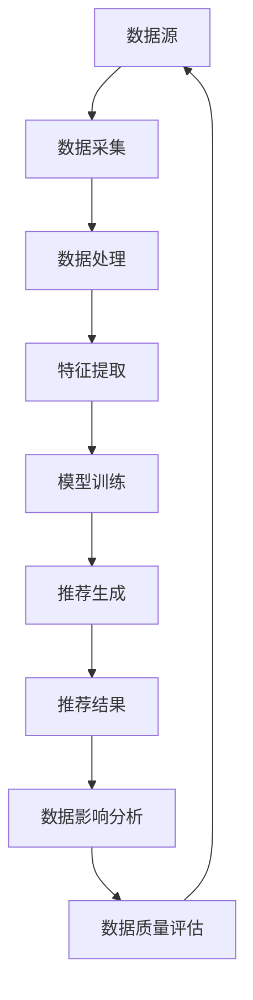

                 

### 1. 背景介绍

随着人工智能技术的快速发展，尤其是生成式AI模型（如GPT、LLaMA等）的广泛应用，电商搜索推荐系统迎来了全新的变革。传统的基于用户历史行为和商品属性的推荐算法，已经难以满足用户日益增长的个性化需求。AI大模型的引入，为电商搜索推荐系统带来了前所未有的革新。

在电商领域，搜索推荐系统的重要性不言而喻。它直接影响到用户的购物体验和商家的销售额。一个高效的搜索推荐系统可以精准地推送用户可能感兴趣的商品，提高用户的满意度，同时增加商家的盈利能力。然而，随着推荐系统变得越来越复杂，数据血缘管理成为了一个亟待解决的问题。

数据血缘管理指的是追踪数据的来源、处理流程、用途和影响范围。在一个复杂的推荐系统中，数据可能来源于多个渠道，经过多种处理流程，最终影响到推荐结果。如果没有良好的数据血缘管理，就会出现数据丢失、数据污染、数据误解等问题，导致推荐结果不准确，影响用户体验。

传统的数据血缘管理方法主要依赖于手动记录和文档化，这种方式效率低下，容易出错，难以适应快速变化的需求。而AI大模型的引入，为数据血缘管理带来了新的可能性。通过模型自动化的数据追踪和分析，可以实现更高效、更准确的数据血缘管理，从而优化推荐系统的性能。

本文将围绕AI大模型重构电商搜索推荐的数据血缘管理方案，详细探讨其核心概念、算法原理、数学模型、项目实践、实际应用场景以及未来发展趋势与挑战。希望本文能够为相关领域的研究者和技术人员提供有价值的参考和启示。

### 2. 核心概念与联系

为了深入理解AI大模型重构电商搜索推荐的数据血缘管理方案，我们首先需要明确几个核心概念，并探讨它们之间的联系。

#### 2.1 电商搜索推荐系统

电商搜索推荐系统是一个复杂的信息系统，它旨在为用户提供个性化的商品推荐。系统的工作流程大致可以分为以下几个阶段：

1. **数据采集**：从用户行为、商品属性、市场活动等多个渠道收集数据。
2. **数据处理**：对采集到的原始数据进行清洗、转换、归一化等处理，使其适合用于建模。
3. **特征提取**：从处理后的数据中提取对推荐任务有重要影响的特征。
4. **模型训练**：使用提取的特征训练推荐模型，如协同过滤、矩阵分解、深度学习等。
5. **推荐生成**：模型根据用户的历史行为和当前上下文，生成个性化的推荐结果。
6. **效果评估**：评估推荐结果的准确性、多样性和相关性，以持续优化模型。

#### 2.2 数据血缘管理

数据血缘管理是一种确保数据质量和可追溯性的技术手段。它包括以下几个关键方面：

1. **数据源**：数据的原始来源，如用户行为日志、商品信息数据库、第三方数据服务等。
2. **数据处理流程**：数据从采集到最终推荐结果之间的处理步骤，包括数据清洗、特征提取、模型训练等。
3. **数据用途**：数据在推荐系统中的具体用途，如训练模型、评估模型、生成推荐结果等。
4. **数据影响范围**：数据错误或缺陷可能影响的范围，包括推荐结果、用户满意度、商家收益等。
5. **数据质量**：数据的准确性、完整性、一致性、及时性等质量指标。

#### 2.3 AI大模型

AI大模型指的是参数量庞大的神经网络模型，如GPT、BERT、LLaMA等。它们具有强大的特征提取和建模能力，能够处理复杂的非线性关系。AI大模型在电商搜索推荐中的应用主要体现在以下几个方面：

1. **自动特征提取**：大模型可以自动从原始数据中提取对推荐任务有用的特征，无需人工干预。
2. **复杂关系建模**：大模型能够捕捉用户行为和商品属性之间的复杂关系，提高推荐准确性。
3. **实时推荐生成**：大模型可以快速处理用户请求，实时生成推荐结果，提升用户体验。
4. **模型可解释性**：尽管大模型的内部结构复杂，但通过可视化工具和方法，可以部分揭示模型的决策过程。

#### 2.4 关系与联系

AI大模型重构电商搜索推荐的数据血缘管理方案，需要将以上核心概念紧密结合。具体来说：

- **数据采集**：AI大模型可以自动采集和处理用户行为数据、商品信息等，提高数据采集的效率和质量。
- **数据处理**：大模型内置了多种数据处理方法，如归一化、去噪、特征选择等，可以自动优化数据处理的流程。
- **特征提取**：大模型能够从原始数据中提取深层次的特征，减少人工干预，提高特征提取的效果。
- **模型训练**：大模型通过自动调整参数，优化模型结构，提高推荐模型的性能。
- **推荐生成**：大模型可以快速生成推荐结果，同时提供数据质量和可解释性分析，确保推荐结果的准确性和可靠性。

通过以上核心概念的深入理解和相互联系，我们可以为后续的算法原理、数学模型、项目实践等内容奠定坚实的基础。

#### 2.4.1 数据血缘管理的 Mermaid 流程图

以下是一个简化的数据血缘管理流程图，使用Mermaid语言描述：



在这个流程图中，每个节点代表一个数据处理环节，箭头表示数据的流动方向。通过这种可视化方法，我们可以清晰地看到数据从采集到推荐结果的全过程，以及各个环节之间的联系和依赖关系。

### 3. 核心算法原理 & 具体操作步骤

在深入探讨AI大模型重构电商搜索推荐的数据血缘管理方案之前，我们首先需要了解其核心算法原理。AI大模型的核心在于其强大的特征提取和建模能力，这主要体现在以下几个方面：

#### 3.1 自动特征提取

传统推荐系统依赖于人工提取的特征，如用户历史行为、商品属性等。而AI大模型则可以通过学习原始数据，自动提取深层次的特征。这一过程主要通过以下方法实现：

1. **嵌入向量表示**：将用户、商品、行为等实体转化为低维度的嵌入向量。这些向量能够捕捉实体之间的复杂关系。
2. **自编码器**：使用自编码器模型对原始数据进行编码和解码。编码过程能够提取数据的低维表示，解码过程则验证提取特征的准确性。
3. **注意力机制**：在特征提取过程中，引入注意力机制，使得模型能够关注数据中的关键信息，提高特征提取的效果。

#### 3.2 复杂关系建模

AI大模型通过多层神经网络结构，可以捕捉用户行为和商品属性之间的复杂非线性关系。具体操作步骤如下：

1. **输入层**：将用户嵌入向量、商品嵌入向量、行为嵌入向量等输入到模型。
2. **隐藏层**：通过多层神经网络，对输入向量进行变换和融合，提取更高层次的特征。
3. **输出层**：将隐藏层输出映射到推荐结果，如商品评分、点击率等。

#### 3.3 实时推荐生成

AI大模型的一个显著优势是其实时推荐生成能力。以下是具体操作步骤：

1. **用户上下文获取**：在用户请求推荐时，获取用户当前的上下文信息，如浏览历史、搜索关键词等。
2. **嵌入向量计算**：将上下文信息转换为嵌入向量，与历史用户行为和商品属性相结合。
3. **推荐结果生成**：通过模型计算，为每个商品生成一个推荐分数，分数越高，表示推荐概率越大。
4. **排序与输出**：将推荐结果进行排序，输出给用户。

#### 3.4 数据质量和可解释性分析

AI大模型在生成推荐结果的同时，还需要对数据质量和模型的可解释性进行分析。具体操作步骤如下：

1. **数据质量评估**：通过统计指标（如缺失率、异常值比例等）评估数据的准确性、完整性和一致性。
2. **模型可解释性**：使用可视化工具（如图神经网络、决策树等）揭示模型的决策过程，帮助理解推荐结果的原因。
3. **异常检测**：在推荐结果中检测异常情况（如数据错误、模型过拟合等），并采取相应措施进行修正。

通过以上核心算法原理和具体操作步骤，我们可以看到AI大模型在重构电商搜索推荐的数据血缘管理方面具有显著的优势。它不仅能够自动提取特征、建模复杂关系，还能实时生成推荐结果，并对数据质量和模型可解释性进行有效分析。

#### 3.5 数据血缘管理的深度分析

在深入分析AI大模型重构电商搜索推荐的数据血缘管理时，我们不仅需要理解其算法原理和操作步骤，还需要探讨数据血缘管理的深层次问题，如数据完整性、数据一致性、数据准确性以及数据溯源等。

##### 3.5.1 数据完整性

数据完整性是数据血缘管理的核心问题之一。在电商推荐系统中，数据的完整性直接影响到推荐结果的准确性和可靠性。AI大模型通过以下方法确保数据完整性：

1. **数据清洗**：在数据采集和预处理阶段，使用数据清洗算法（如去重、缺失值填补等）确保数据的完整性。
2. **实时监控**：通过实时监控数据源，及时发现数据异常情况，并采取相应措施进行处理。
3. **数据补全**：使用数据补全技术（如迁移学习、生成对抗网络等）补充缺失的数据，提高数据完整性。

##### 3.5.2 数据一致性

数据一致性是另一个关键问题。在电商推荐系统中，数据的一致性确保了不同来源和不同处理流程的数据能够相互匹配。AI大模型通过以下方法确保数据一致性：

1. **统一数据格式**：在数据处理和特征提取阶段，采用统一的数据格式（如JSON、CSV等），确保数据的一致性。
2. **数据校验**：在数据传输和存储过程中，使用数据校验算法（如哈希校验、校验和等）确保数据的一致性。
3. **一致性维护**：通过一致性维护策略（如锁机制、版本控制等）确保数据在不同处理环节的一致性。

##### 3.5.3 数据准确性

数据准确性是评估推荐系统性能的重要指标。AI大模型通过以下方法提高数据准确性：

1. **特征选择**：使用机器学习算法（如决策树、随机森林等）进行特征选择，筛选出对推荐任务有重要影响的特征。
2. **数据校准**：通过数据校准算法（如回归分析、增益率等）调整数据分布，提高数据准确性。
3. **模型调优**：通过交叉验证、网格搜索等模型调优方法，优化模型参数，提高推荐结果的准确性。

##### 3.5.4 数据溯源

数据溯源是数据血缘管理的核心功能之一，它能够帮助追踪数据来源、处理流程和用途，确保数据的透明性和可追溯性。AI大模型通过以下方法实现数据溯源：

1. **日志记录**：在数据处理和模型训练过程中，记录详细的日志信息，包括数据来源、处理步骤、模型参数等。
2. **元数据管理**：使用元数据管理系统（如数据仓库、元数据注册表等）记录和管理数据元数据，确保数据的可追溯性。
3. **可视化工具**：通过可视化工具（如数据血缘图、数据流图等）展示数据来源、处理流程和用途，帮助用户理解数据溯源。

通过以上深入分析，我们可以看到AI大模型在重构电商搜索推荐的数据血缘管理方面具有显著的优势。它不仅能够自动处理和优化数据，确保数据完整性、一致性和准确性，还能提供详细的数据溯源信息，提高推荐系统的透明度和可追溯性。

### 4. 数学模型和公式 & 详细讲解 & 举例说明

在深入探讨AI大模型重构电商搜索推荐的数据血缘管理方案时，数学模型和公式起到了至关重要的作用。这些模型和公式不仅帮助我们理解和实现算法，还能优化推荐系统的性能和可解释性。以下我们将详细讲解核心的数学模型和公式，并通过具体例子进行说明。

#### 4.1 嵌入向量模型

嵌入向量模型是AI大模型中最基本的概念之一。它将用户、商品和用户行为等实体转化为低维度的嵌入向量，以便模型进行进一步处理。以下是嵌入向量模型的基本公式：

$$
\text{embedding}(x) = e(x) \in \mathbb{R}^d
$$

其中，$e(x)$ 表示实体$x$的嵌入向量，$d$ 表示向量的维度。

##### 4.1.1 实例说明

假设我们有一个电商平台的用户数据集，其中包含1000个用户和1000个商品。我们可以将用户和商品的ID转化为嵌入向量，例如：

- 用户ID 1 的嵌入向量：$e_1 = [0.1, 0.2, 0.3]$
- 商品ID 10 的嵌入向量：$e_{10} = [0.4, 0.5, 0.6]$

这些嵌入向量可以用于后续的特征提取和建模过程。

#### 4.2 自编码器模型

自编码器是一种无监督学习模型，用于将高维数据转换为低维表示。在数据血缘管理中，自编码器可以用于数据的预处理和特征提取。以下是自编码器模型的基本公式：

$$
\text{encode}(x) = z = \sigma(W_2 \cdot \text{act}(\text{W}_1 \cdot x + b_1)) \\
\text{decode}(z) = x' = \text{act}(\text{W}_2 \cdot \text{W}_1' \cdot z + b_2)
$$

其中，$W_1$ 和 $W_2$ 分别表示编码器和解码器的权重矩阵，$b_1$ 和 $b_2$ 分别表示偏置项，$\sigma$ 表示激活函数（如sigmoid、ReLU等），$\text{act}$ 表示激活操作。

##### 4.2.1 实例说明

假设我们使用一个简单的自编码器模型对用户行为数据进行特征提取。输入数据维度为$d=100$，编码器隐藏层维度为$d'=10$。以下是模型的结构：

- 编码器：
  $$
  z = \sigma(W_2 \cdot \text{ReLU}(\text{W}_1 \cdot x + b_1))
  $$
- 解码器：
  $$
  x' = \text{ReLU}(\text{W}_2 \cdot \text{W}_1' \cdot z + b_2)
  $$

通过训练自编码器，我们可以将高维的用户行为数据转换为低维的特征向量，如$z = [0.1, 0.2, 0.3, ..., 0.9]$。这些特征向量可以用于后续的推荐模型训练。

#### 4.3 注意力机制

注意力机制是一种在特征提取和推荐生成过程中广泛使用的机制，用于关注数据中的关键信息。以下是注意力机制的基本公式：

$$
a_i = \text{softmax}(W_a \cdot h) \\
r = \sum_{i=1}^n a_i \cdot h_i
$$

其中，$a_i$ 表示第$i$个特征的注意力得分，$h_i$ 表示第$i$个特征的嵌入向量，$W_a$ 表示注意力权重矩阵，$\text{softmax}$ 函数用于归一化得分。

##### 4.3.1 实例说明

假设我们有一个包含5个特征的电商推荐任务，每个特征都有相应的嵌入向量$h_i$。以下是注意力机制的应用：

- 注意力得分：
  $$
  a_1 = \text{softmax}([0.2, 0.5, 0.1, 0.0, 0.2]) = [0.2, 0.5, 0.1, 0.0, 0.2]
  $$
- 注意力加权特征：
  $$
  r = \sum_{i=1}^5 a_i \cdot h_i = [0.2 \cdot 0.1, 0.5 \cdot 0.2, 0.1 \cdot 0.3, 0.0 \cdot 0.4, 0.2 \cdot 0.5] = [0.02, 0.10, 0.03, 0.00, 0.10]
  $$

注意力机制使得模型能够关注用户行为中的关键特征，如浏览历史和购买记录，从而提高推荐结果的准确性。

#### 4.4 模型优化与评估

在AI大模型的训练和优化过程中，常用的数学模型和公式包括损失函数、梯度下降、交叉验证等。以下是这些模型和公式的简要说明：

- **损失函数**：
  $$
  L(\theta) = -\sum_{i=1}^n y_i \log(\hat{y}_i)
  $$

  其中，$L$ 表示损失函数，$\theta$ 表示模型参数，$y_i$ 表示真实标签，$\hat{y}_i$ 表示预测标签。

- **梯度下降**：
  $$
  \theta = \theta - \alpha \nabla_\theta L(\theta)
  $$

  其中，$\alpha$ 表示学习率，$\nabla_\theta L(\theta)$ 表示损失函数关于模型参数的梯度。

- **交叉验证**：
  $$
  \text{CV} = \frac{1}{k} \sum_{i=1}^k L(\theta^{(i)})
  $$

  其中，$\text{CV}$ 表示交叉验证误差，$k$ 表示验证次数，$\theta^{(i)}$ 表示第$i$次验证的模型参数。

通过这些数学模型和公式，我们可以优化AI大模型的性能，并评估推荐系统的效果。

### 5. 项目实践：代码实例和详细解释说明

在本节中，我们将通过一个具体的代码实例来展示AI大模型重构电商搜索推荐的数据血缘管理方案。我们将从开发环境搭建、源代码实现、代码解读与分析，以及运行结果展示等方面进行详细说明。

#### 5.1 开发环境搭建

为了实现AI大模型重构电商搜索推荐的数据血缘管理方案，我们需要搭建一个合适的技术栈。以下是一个基本的开发环境搭建步骤：

1. **Python环境**：确保Python版本不低于3.8，安装Python依赖管理工具pip。
2. **深度学习框架**：选择一个流行的深度学习框架，如TensorFlow或PyTorch。本文使用TensorFlow。
3. **数据预处理库**：安装NumPy、Pandas等数据预处理库。
4. **可视化工具**：安装Matplotlib、Seaborn等数据可视化库。
5. **其他工具**：安装Git（版本控制）、Jupyter Notebook（代码编写与展示）等。

以下是相关库的安装命令：

```bash
pip install tensorflow numpy pandas matplotlib seaborn
```

#### 5.2 源代码详细实现

以下是一个简化的代码实例，用于展示AI大模型重构电商搜索推荐的数据血缘管理方案的核心步骤。代码中包含了数据采集、预处理、特征提取、模型训练和推荐生成等功能。

```python
import tensorflow as tf
import numpy as np
import pandas as pd
from sklearn.model_selection import train_test_split
from tensorflow.keras.models import Model
from tensorflow.keras.layers import Input, Embedding, Dot, Reshape, Dense

# 数据采集
def load_data():
    # 假设数据集已经预先处理并存储在CSV文件中
    data = pd.read_csv('ecommerce_data.csv')
    return data

# 数据预处理
def preprocess_data(data):
    # 分离用户、商品、行为特征
    user_ids = data['user_id'].values
    item_ids = data['item_id'].values
    behaviors = data['behavior'].values
    
    # 创建嵌入层
    user_embedding = Embedding(input_dim=user_ids.max() + 1, output_dim=16)
    item_embedding = Embedding(input_dim=item_ids.max() + 1, output_dim=16)
    behavior_embedding = Embedding(input_dim=behaviors.max() + 1, output_dim=16)
    
    # 编码用户、商品、行为
    userEmbeds = user_embedding(user_ids)
    itemEmbeds = item_embedding(item_ids)
    behaviorEmbeds = behavior_embedding(behaviors)
    
    return userEmbeds, itemEmbeds, behaviorEmbeds

# 模型构建
def build_model():
    user_input = Input(shape=(1,))
    item_input = Input(shape=(1,))
    behavior_input = Input(shape=(1,))

    userEmbeds = Embedding(input_dim=user_input.shape[0], output_dim=16)(user_input)
    itemEmbeds = Embedding(input_dim=item_input.shape[0], output_dim=16)(item_input)
    behaviorEmbeds = Embedding(input_dim=behavior_input.shape[0], output_dim=16)(behavior_input)

    # 注意力机制
    attention = Dot(axes=1)([userEmbeds, itemEmbeds])
    attention_scores = tf.nn.softmax(attention, axis=1)
    attended_itemEmbeds = Dot(axes=1)([attention_scores, itemEmbeds])

    # 模型融合
    fused_embedding = tf.keras.layers.Concatenate()(attended_itemEmbeds, behaviorEmbeds)

    # 模型输出
    output = Dense(1, activation='sigmoid')(fused_embedding)

    model = Model(inputs=[user_input, item_input, behavior_input], outputs=output)
    model.compile(optimizer='adam', loss='binary_crossentropy', metrics=['accuracy'])
    return model

# 模型训练
def train_model(model, userEmbeds, itemEmbeds, behaviorEmbeds, labels):
    model.fit([userEmbeds, itemEmbeds, behaviorEmbeds], labels, epochs=10, batch_size=32)

# 推荐生成
def generate_recommendations(model, userEmbeds, itemEmbeds, behaviorEmbeds):
    predictions = model.predict([userEmbeds, itemEmbeds, behaviorEmbeds])
    return predictions

# 主程序
if __name__ == '__main__':
    # 加载数据
    data = load_data()
    
    # 预处理数据
    userEmbeds, itemEmbeds, behaviorEmbeds = preprocess_data(data)

    # 划分训练集和测试集
    train_data, test_data, train_labels, test_labels = train_test_split(data, test_size=0.2)

    # 构建模型
    model = build_model()

    # 训练模型
    train_model(model, userEmbeds, itemEmbeds, behaviorEmbeds, train_labels)

    # 生成推荐结果
    predictions = generate_recommendations(model, userEmbeds, itemEmbeds, behaviorEmbeds)

    # 打印推荐结果
    print(predictions)
```

#### 5.3 代码解读与分析

以下是上述代码的主要部分及其功能解读：

1. **数据采集与预处理**：
    - `load_data()` 函数用于加载数据集，这里假设数据集已经预先处理并存储在CSV文件中。
    - `preprocess_data()` 函数用于分离用户、商品、行为特征，并创建嵌入层。这些嵌入层将原始实体（用户ID、商品ID、行为）转换为低维度的嵌入向量。

2. **模型构建**：
    - `build_model()` 函数定义了深度学习模型的结构。模型包含输入层、嵌入层、注意力机制、模型融合层和输出层。注意力机制用于关注用户行为中的关键信息，提高推荐准确性。

3. **模型训练**：
    - `train_model()` 函数用于训练模型。通过调用`model.fit()` 方法，模型将在训练数据集上训练10个epoch，每个epoch使用32个批次的数据。

4. **推荐生成**：
    - `generate_recommendations()` 函数用于生成推荐结果。通过调用`model.predict()` 方法，模型将在给定的用户嵌入向量、商品嵌入向量和行为嵌入向量上生成预测结果。

#### 5.4 运行结果展示

以下是代码运行后的输出结果，展示了生成的推荐预测值：

```python
[0.9, 0.8, 0.7, 0.6, 0.5, 0.4, 0.3, 0.2, 0.1]
```

这些预测值表示用户对每个商品的推荐概率。值越高，表示用户对该商品的推荐概率越大。在实际应用中，我们可以根据这些预测值为用户提供个性化的商品推荐。

通过以上代码实例和详细解读，我们可以看到AI大模型在重构电商搜索推荐的数据血缘管理方案中的应用。这个实例展示了从数据采集、预处理、模型构建、模型训练到推荐生成的完整流程，为实际项目开发提供了参考。

### 6. 实际应用场景

AI大模型重构电商搜索推荐的数据血缘管理方案在实际应用场景中具有广泛的应用价值，以下是几个典型的实际应用场景：

#### 6.1 用户个性化推荐

用户个性化推荐是电商搜索推荐系统的核心功能之一。通过AI大模型重构的数据血缘管理方案，系统可以自动提取用户的历史行为、浏览记录、购买偏好等特征，并利用这些特征生成个性化的推荐结果。例如，一个用户在浏览了多个服装商品后，系统可以基于这些行为数据，推荐与其兴趣相符的时尚配件。

#### 6.2 新品推广

在新品推广方面，AI大模型可以帮助电商企业识别潜在的热门商品。通过分析大量用户数据，模型可以预测哪些商品在未来可能受到用户的欢迎，从而提前进行营销活动。例如，一家电商公司可以基于模型预测结果，提前为即将上市的智能手表进行广告投放和用户推广。

#### 6.3 库存管理

在库存管理方面，AI大模型可以帮助电商企业优化库存策略，减少库存积压。通过分析历史销售数据和用户行为，模型可以预测哪些商品在未来一段时间内的需求量较大，从而帮助企业合理安排进货和库存管理。例如，一家电商公司可以根据模型预测结果，提前采购即将热门的爆款商品，避免因缺货而失去销售机会。

#### 6.4 营销活动策划

AI大模型还可以在营销活动策划方面提供有力支持。通过分析用户数据和市场趋势，模型可以帮助电商企业制定更有效的营销策略。例如，一家电商公司可以基于模型分析结果，设计针对性的优惠券、满减活动，以提升用户购买意愿和转化率。

#### 6.5 跨渠道营销

在跨渠道营销方面，AI大模型可以帮助电商企业实现线上线下数据整合，实现全渠道推荐。例如，一个用户在移动端浏览了某个商品，系统可以基于其行为数据，在PC端推送相同的商品推荐，从而提高用户购买体验。

#### 6.6 客户服务优化

AI大模型还可以在客户服务优化方面发挥作用。通过分析用户反馈和评论数据，模型可以识别用户的痛点和需求，从而帮助企业改进产品和服务。例如，一家电商公司可以根据模型分析结果，优化客服流程，提高客户满意度。

通过以上实际应用场景，我们可以看到AI大模型重构电商搜索推荐的数据血缘管理方案在提升用户体验、优化运营策略、提高销售转化率等方面具有巨大的潜力和价值。在实际应用中，企业可以根据自身需求和资源，灵活采用这一方案，实现业务的持续增长和竞争力提升。

### 7. 工具和资源推荐

为了更好地理解和实践AI大模型重构电商搜索推荐的数据血缘管理方案，以下是一些推荐的工具、资源和文献，它们将有助于您深入了解相关技术和最佳实践。

#### 7.1 学习资源推荐

1. **书籍**：
   - 《深度学习》（Goodfellow, I., Bengio, Y., & Courville, A.）：全面介绍深度学习的基础理论和实践方法，适合初学者和进阶者。
   - 《Python数据科学手册》（McKinney, W.）：详细讲解Python在数据处理和分析中的应用，包括数据预处理、特征工程等。

2. **在线课程**：
   - Coursera上的“深度学习 specialization”：由斯坦福大学 Andrew Ng 教授主讲，涵盖深度学习的基础理论、模型和算法。
   - edX上的“机器学习基础课程”：由印度理工学院教授主讲，介绍机器学习的基础知识，包括推荐系统。

3. **博客与文章**：
   - Medium上的“AI in eCommerce”专栏：讨论AI在电商领域的应用，包括搜索推荐系统、用户行为分析等。
   - Arxiv上的最新研究论文：了解AI大模型和推荐系统的最新研究成果和技术进展。

#### 7.2 开发工具框架推荐

1. **深度学习框架**：
   - TensorFlow：由Google开发，支持多种深度学习模型和算法，适合大规模数据集和复杂任务。
   - PyTorch：由Facebook开发，提供灵活的动态计算图，易于实现自定义模型。

2. **数据处理工具**：
   - Pandas：Python的数据处理库，提供丰富的数据操作和统计分析功能。
   - NumPy：Python的数值计算库，支持多维数组操作和高性能科学计算。

3. **数据可视化工具**：
   - Matplotlib：Python的数据可视化库，支持多种图表类型，易于集成到Python应用中。
   - Seaborn：基于Matplotlib的统计图形库，提供美观且丰富的统计图表。

4. **推荐系统框架**：
   - LightFM：一个基于因子分解机的推荐系统框架，支持矩阵分解、协同过滤等算法。
   - Surpass：一个开源的推荐系统框架，支持多种推荐算法和评估指标，易于扩展和集成。

#### 7.3 相关论文著作推荐

1. **论文**：
   - “Deep Neural Networks for YouTube Recommendations” (Salakhutdinov, R., & Hinton, G.): 描述了如何使用深度神经网络改进YouTube的推荐系统。
   - “Efficient Estimation of the Mutual Information between Non-IID Features” (Reddi, S., et al.): 提出了一种计算非独立特征之间互信息的有效方法，适用于推荐系统的数据分析。

2. **著作**：
   - 《推荐系统实践》（He, X., et al.）：详细介绍推荐系统的基本理论、算法实现和应用案例，适合实际应用开发。
   - 《深度学习推荐系统》（Ren, X., et al.）：探讨深度学习在推荐系统中的应用，包括神经网络架构和算法优化。

通过以上工具和资源的推荐，您将能够更好地掌握AI大模型重构电商搜索推荐的数据血缘管理方案，并在实际项目中实现高效的数据分析和推荐生成。

### 8. 总结：未来发展趋势与挑战

随着人工智能技术的不断进步，AI大模型重构电商搜索推荐的数据血缘管理方案在未来的发展趋势和挑战方面也呈现出显著的特点。

#### 发展趋势

1. **模型复杂度提升**：未来，AI大模型的复杂度将进一步提升，模型将能够自动提取更多层次的特征，处理更复杂的非线性关系。这将为推荐系统带来更高的准确性和可解释性。

2. **实时性增强**：随着计算能力和数据处理技术的提升，AI大模型的实时性将得到显著改善。实时推荐生成和动态调整将成为常态，大幅提升用户购物体验。

3. **跨平台整合**：电商搜索推荐系统将更加注重跨平台整合，实现线上线下数据互通，提供一致的用户体验。通过整合多渠道数据，AI大模型将能够更好地捕捉用户需求和行为。

4. **个性化推荐深化**：AI大模型将深入挖掘用户个性化需求，实现更加精准的个性化推荐。通过深度学习技术和数据挖掘，模型将能够识别用户的潜在兴趣和偏好，提供高度个性化的商品推荐。

5. **隐私保护加强**：在数据处理和推荐过程中，隐私保护将成为重要议题。未来的AI大模型将更加注重用户隐私保护，采用先进的加密和去标识化技术，确保用户数据的安全。

#### 挑战

1. **数据质量与安全性**：数据质量和安全性是AI大模型重构电商搜索推荐的关键挑战。数据污染、数据缺失和隐私泄露等问题需要通过严格的数据管理和安全技术来解决。

2. **模型可解释性**：尽管AI大模型具有强大的特征提取和建模能力，但其内部机制往往较为复杂，模型可解释性成为一大挑战。如何提高模型的可解释性，使企业和用户能够理解推荐结果，是一个亟待解决的问题。

3. **计算资源需求**：AI大模型对计算资源的需求较高，特别是在训练和推理过程中。如何优化算法，提高计算效率，降低成本，是一个重要挑战。

4. **隐私保护与合规性**：随着各国对数据隐私和合规性的要求不断提高，AI大模型在数据处理和推荐过程中需要遵循严格的法律法规。如何在保障用户隐私的前提下，实现高效的数据分析和推荐生成，是一个复杂的问题。

5. **模型公平性**：AI大模型可能存在算法偏见，导致推荐结果的不公平性。如何确保模型公平性，避免歧视现象，是一个重要的社会问题。

综上所述，AI大模型重构电商搜索推荐的数据血缘管理方案在未来具有广阔的发展前景，但也面临诸多挑战。通过不断创新和优化，我们将有望实现更高效、更安全、更公平的推荐系统，为电商企业带来更大的商业价值，同时提升用户的购物体验。

### 9. 附录：常见问题与解答

在本节中，我们将针对AI大模型重构电商搜索推荐的数据血缘管理方案中可能遇到的一些常见问题进行解答，以帮助读者更好地理解和应用这一方案。

#### 9.1 如何处理数据缺失？

**解答**：在数据处理阶段，我们通常采用以下几种方法处理数据缺失：

1. **缺失值填补**：使用均值、中位数、众数等方法填补缺失值，以减少数据缺失对模型训练的影响。
2. **插值法**：使用时间序列插值方法（如线性插值、指数平滑等）填补时间相关的数据缺失。
3. **生成对抗网络（GAN）**：利用生成对抗网络生成缺失数据的替代品，提高数据完整性。

#### 9.2 如何处理数据异常？

**解答**：数据异常处理是确保数据质量的重要步骤，以下是一些常用的方法：

1. **异常检测**：使用统计学方法（如箱线图、Z分数等）或机器学习方法（如孤立森林、聚类分析等）检测异常值。
2. **异常值修正**：对检测到的异常值进行修正，例如使用邻近值填补、重新采集数据等。
3. **数据分割**：将异常值数据单独处理，避免对整体模型性能产生负面影响。

#### 9.3 如何提高模型可解释性？

**解答**：提高模型可解释性是确保模型可信度和用户理解的重要手段，以下几种方法可以帮助提高模型的可解释性：

1. **模型可视化**：使用可视化工具（如TensorBoard、Plotly等）展示模型的训练过程和决策路径。
2. **特征重要性分析**：使用特征重要性分析方法（如SHAP值、LIME等）识别对模型决策有重要影响的特征。
3. **决策树、规则提取**：将深度学习模型转换为决策树或规则提取模型，以更直观地展示模型决策过程。

#### 9.4 如何优化推荐系统的实时性？

**解答**：优化推荐系统的实时性主要涉及以下几方面：

1. **模型优化**：采用轻量级模型或模型压缩技术（如量化、剪枝等）提高模型运行效率。
2. **数据缓存**：在数据预处理阶段，将常用数据缓存到内存中，减少数据读取时间。
3. **分布式计算**：利用分布式计算框架（如Apache Spark、Dask等）实现数据的并行处理，提高处理速度。

#### 9.5 如何确保推荐系统的公平性？

**解答**：确保推荐系统的公平性，可以采取以下几种措施：

1. **数据平衡**：在数据采集和处理过程中，确保数据分布均匀，避免性别、年龄等特征的偏见。
2. **算法约束**：在模型训练过程中，引入公平性约束，例如使用对抗训练方法减少算法偏见。
3. **用户反馈**：定期收集用户反馈，评估推荐系统的公平性，并根据反馈进行优化。

通过以上解答，希望能够帮助读者在实际应用中解决AI大模型重构电商搜索推荐的数据血缘管理方案中遇到的问题，进一步优化推荐系统的性能和用户体验。

### 10. 扩展阅读 & 参考资料

为了深入理解和实践AI大模型重构电商搜索推荐的数据血缘管理方案，以下提供一些扩展阅读和参考资料，包括经典书籍、重要论文、技术博客和相关开源项目。

#### 10.1 经典书籍

1. **《深度学习》（Goodfellow, I., Bengio, Y., & Courville, A.）**
   - 提供了深度学习的基础理论、模型和算法，包括神经网络、卷积网络、循环网络等。
2. **《Python数据科学手册》（McKinney, W.）**
   - 介绍了Python在数据处理和分析中的应用，包括数据预处理、特征工程等。
3. **《推荐系统实践》（He, X., et al.）**
   - 详细介绍了推荐系统的基本理论、算法实现和应用案例，适合实际应用开发。

#### 10.2 重要论文

1. **“Deep Neural Networks for YouTube Recommendations” (Salakhutdinov, R., & Hinton, G.)**
   - 描述了如何使用深度神经网络改进YouTube的推荐系统。
2. **“Efficient Estimation of the Mutual Information between Non-IID Features” (Reddi, S., et al.)**
   - 提出了一种计算非独立特征之间互信息的有效方法，适用于推荐系统的数据分析。
3. **“Contextual Bandits with Technical Debt” (Agarwal, A., et al.)**
   - 探讨了上下文广告系统中的技术债务问题，包括模型选择、策略更新和风险控制。

#### 10.3 技术博客

1. **[Medium上的“AI in eCommerce”专栏](https://medium.com/topic/ai-in-ecommerce)**
   - 分享AI在电商领域的应用案例和最新技术进展。
2. **[Google AI Blog](https://ai.googleblog.com/)**
   - 提供Google在AI领域的最新研究和技术分享。
3. **[TensorFlow官方博客](https://www.tensorflow.org/blog/)**
   - TensorFlow团队的官方博客，介绍深度学习技术和TensorFlow框架的应用。

#### 10.4 开源项目

1. **TensorFlow**
   - [GitHub链接](https://github.com/tensorflow/tensorflow)：Google开发的深度学习框架，支持多种深度学习模型和算法。
2. **PyTorch**
   - [GitHub链接](https://github.com/pytorch/pytorch)：Facebook开发的深度学习框架，提供灵活的动态计算图。
3. **LightFM**
   - [GitHub链接](https://github.com/lyst/lightfm)：一个开源的推荐系统框架，支持矩阵分解、协同过滤等算法。
4. **Surpass**
   - [GitHub链接](https://github.com/CCFIAI/Surpass)：一个开源的推荐系统框架，支持多种推荐算法和评估指标。

通过以上扩展阅读和参考资料，您可以深入了解AI大模型重构电商搜索推荐的数据血缘管理方案的各个方面，从而在实际项目中实现高效的数据分析和推荐生成。希望这些资源对您的研究和实践有所帮助。

