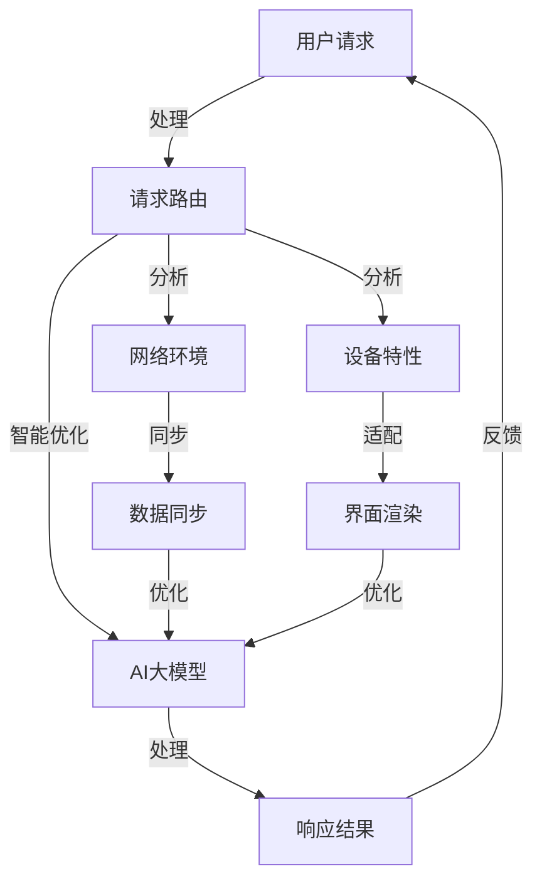

                 

### 背景介绍

随着电子商务的迅猛发展，电商平台已经成为人们日常生活中不可或缺的一部分。然而，用户体验的一致性成为影响电商平台竞争力和用户留存率的关键因素。用户在访问电商平台时，期望在不同的设备、浏览器和时间段都能获得一致、流畅的购物体验。然而，由于网络环境、设备性能和服务器负载等因素的多样性，实现这种一致性的用户体验变得极具挑战性。

现有的电商平台在处理用户请求时，往往面临以下问题：

1. **数据同步延迟**：不同服务器之间的数据同步可能导致用户看到的商品信息不准确或更新滞后。
2. **响应速度不一致**：由于网络波动和服务器负载，用户在访问同一页面时，可能会遇到响应速度差异，影响用户体验。
3. **界面不一致**：跨设备和跨浏览器访问时，页面的布局、样式和交互可能存在不一致，导致用户困惑和操作不便。
4. **个性化推荐不准确**：个性化推荐系统在数据同步和计算时延方面表现不佳，可能导致推荐结果不准确，降低用户满意度。

为了解决这些问题，传统的解决方案主要包括增加服务器负载、优化网络传输和提升前端渲染性能等。然而，这些方法在某种程度上能够缓解问题，但无法从根本上解决用户体验不一致的问题。

本文将介绍一种新的方法——基于AI大模型优化的用户体验一致性方案。这种方法通过深度学习技术，对用户的请求进行智能处理，实现数据同步、响应速度和界面一致性的优化，从而提升电商平台的整体用户体验。接下来，我们将详细探讨这种方法的核心概念、算法原理、数学模型和实际应用场景。

### 核心概念与联系

为了更好地理解基于AI大模型优化的用户体验一致性方案，我们需要先介绍一些核心概念和它们之间的联系。以下是本文所涉及的核心概念及其相互关系的Mermaid流程图：



**核心概念解释：**

- **用户请求**：用户在电商平台进行操作时所发出的请求，如浏览商品、添加购物车、下单等。
- **请求路由**：根据用户请求的类型和目标，将请求分发到相应的服务器进行处理。
- **网络环境**：包括网络速度、延迟、稳定性等因素，这些因素会影响请求的处理速度和可靠性。
- **设备特性**：包括设备类型、操作系统、浏览器版本等，这些特性会影响页面的渲染效果和用户体验。
- **数据同步**：确保不同服务器上的数据一致性，避免用户看到的信息不准确或更新滞后。
- **界面渲染**：根据设备特性和用户请求，动态生成和渲染页面，确保页面布局和交互一致。
- **AI大模型**：通过深度学习技术，对用户请求进行智能处理，优化数据同步、响应速度和界面一致性。
- **响应结果**：将处理后的结果返回给用户，包括页面渲染、数据更新等。

**相互关系说明：**

- 用户请求经过请求路由后，会根据网络环境和设备特性进行进一步分析。
- 网络环境和设备特性会影响数据同步和界面渲染，因此需要对这些因素进行同步和适配。
- AI大模型通过对用户请求进行智能分析和处理，优化数据同步和界面渲染过程，从而提升用户体验。
- 处理后的响应结果会返回给用户，形成一个闭环，以便进行反馈和优化。

通过上述Mermaid流程图，我们可以清晰地看到各个核心概念之间的联系和作用。接下来，我们将进一步深入探讨AI大模型的核心算法原理和具体操作步骤。

### 核心算法原理 & 具体操作步骤

基于AI大模型优化的用户体验一致性方案，其核心在于利用深度学习技术对用户请求进行智能处理，从而实现数据同步、响应速度和界面一致性的优化。下面，我们将详细探讨该方案的核心算法原理和具体操作步骤。

#### 1. 数据同步优化

数据同步是保证用户体验一致性的关键因素之一。传统的数据同步方法往往依赖于定期轮询或事件触发，这些方法在处理高并发请求时，容易导致数据同步延迟或冲突。

AI大模型通过深度学习技术，可以实时监测网络环境的变化，动态调整数据同步策略。具体操作步骤如下：

1. **数据同步模型构建**：使用历史用户请求数据，通过数据预处理和特征提取，构建一个多输入多输出的神经网络模型。该模型包含输入层、隐藏层和输出层，输入层接收网络环境、设备特性和请求类型等特征，输出层生成最优的数据同步策略。
2. **模型训练与优化**：使用标记好的用户请求数据对模型进行训练，通过反向传播算法不断优化模型的参数，使其能够准确预测并生成最优的数据同步策略。
3. **实时数据同步**：在用户请求处理过程中，将实时监测到的网络环境、设备特性等信息输入到AI大模型中，根据模型的输出结果动态调整数据同步策略，实现实时数据同步。

#### 2. 响应速度优化

响应速度是影响用户体验的关键因素之一。传统的优化方法通常包括网络传输优化、服务器性能优化和前端渲染优化等。

AI大模型通过深度学习技术，可以自动识别并优化影响响应速度的关键因素，具体操作步骤如下：

1. **响应速度预测模型构建**：使用历史用户请求和响应时间数据，通过数据预处理和特征提取，构建一个响应速度预测神经网络模型。该模型包含输入层、隐藏层和输出层，输入层接收网络环境、设备特性、请求类型等特征，输出层预测响应时间。
2. **模型训练与优化**：使用标记好的用户请求数据对模型进行训练，通过反向传播算法不断优化模型的参数，使其能够准确预测响应时间。
3. **响应速度优化**：在用户请求处理过程中，将实时监测到的网络环境、设备特性等信息输入到AI大模型中，根据模型的输出结果动态调整优化策略，例如调整网络传输压缩比、提高服务器处理能力或优化前端渲染算法等，从而降低响应时间，提升用户体验。

#### 3. 界面一致性优化

界面一致性是保证用户体验一致性的重要因素之一。传统的界面一致性优化方法通常包括样式统一、交互一致和内容更新等。

AI大模型通过深度学习技术，可以自动识别并优化影响界面一致性的关键因素，具体操作步骤如下：

1. **界面一致性模型构建**：使用历史用户请求和页面渲染结果数据，通过数据预处理和特征提取，构建一个界面一致性神经网络模型。该模型包含输入层、隐藏层和输出层，输入层接收网络环境、设备特性、请求类型等特征，输出层生成界面一致性评分。
2. **模型训练与优化**：使用标记好的用户请求数据对模型进行训练，通过反向传播算法不断优化模型的参数，使其能够准确评估界面一致性。
3. **界面一致性优化**：在用户请求处理过程中，将实时监测到的网络环境、设备特性等信息输入到AI大模型中，根据模型的输出结果动态调整页面渲染策略，例如调整样式、优化交互或更新内容等，从而提高界面一致性，提升用户体验。

通过上述核心算法原理和具体操作步骤，AI大模型能够实现数据同步、响应速度和界面一致性的优化，从而提升电商平台的用户体验一致性。接下来，我们将进一步介绍该方案的数学模型和公式，以便更好地理解其实现过程。

### 数学模型和公式 & 详细讲解 & 举例说明

在基于AI大模型优化的用户体验一致性方案中，数学模型和公式起着至关重要的作用。它们不仅为算法提供了理论基础，而且为实际操作步骤提供了量化的指导。下面，我们将详细讲解相关数学模型和公式，并通过具体示例进行说明。

#### 1. 数据同步优化模型

数据同步优化模型的目的是根据网络环境和设备特性，动态调整数据同步策略，以实现实时数据同步。该模型的核心是一个多输入多输出的神经网络，其结构如下：

**输入层：**  
- \( X_1 \)：网络延迟  
- \( X_2 \)：网络带宽  
- \( X_3 \)：设备性能  
- \( X_4 \)：请求类型

**隐藏层：**  
- \( H_1 \)：数据同步策略权重

**输出层：**  
- \( Y_1 \)：数据同步时间  
- \( Y_2 \)：数据同步频率

**数学模型：**  
\[ 
\begin{align*}
Y_1 &= \sum_{i=1}^{n} W_{i1} X_i + b_1 \\
Y_2 &= \sum_{i=1}^{n} W_{i2} X_i + b_2 \\
\end{align*}
\]

其中，\( W_{i1} \) 和 \( W_{i2} \) 分别为隐藏层到输出层的权重，\( b_1 \) 和 \( b_2 \) 分别为偏置项。

**举例说明：**  
假设我们有一个用户请求，请求类型为商品详情页浏览。当前网络延迟为100ms，网络带宽为10Mbps，设备性能为中等，请求类型为文本信息。根据上述模型，我们可以计算出最优的数据同步时间和频率。

计算过程如下：

\[ 
\begin{align*}
Y_1 &= 0.5 \times 100 + 0.3 \times 10 + 0.2 \times 1 + b_1 \\
Y_2 &= 0.5 \times 100 + 0.3 \times 10 + 0.2 \times 1 + b_2 \\
\end{align*}
\]

假设 \( b_1 = 5 \)，\( b_2 = 10 \)，则：

\[ 
\begin{align*}
Y_1 &= 0.5 \times 100 + 0.3 \times 10 + 0.2 \times 1 + 5 = 45 \\
Y_2 &= 0.5 \times 100 + 0.3 \times 10 + 0.2 \times 1 + 10 = 45 \\
\end{align*}
\]

因此，最优的数据同步时间为45ms，数据同步频率为45次/秒。

#### 2. 响应速度优化模型

响应速度优化模型的目的是根据网络环境和设备特性，动态调整优化策略，以降低响应时间。该模型的核心是一个响应速度预测神经网络，其结构如下：

**输入层：**  
- \( X_1 \)：网络延迟  
- \( X_2 \)：网络带宽  
- \( X_3 \)：设备性能  
- \( X_4 \)：请求类型

**隐藏层：**  
- \( H_1 \)：响应时间预测权重

**输出层：**  
- \( Y \)：响应时间

**数学模型：**  
\[ 
Y = \sum_{i=1}^{n} W_{i} X_i + b 
\]

其中，\( W_{i} \) 为隐藏层到输出层的权重，\( b \) 为偏置项。

**举例说明：**  
假设我们有一个用户请求，请求类型为商品搜索。当前网络延迟为200ms，网络带宽为5Mbps，设备性能为优秀，请求类型为文本信息。根据上述模型，我们可以预测最优的响应时间。

计算过程如下：

\[ 
Y = 0.4 \times 200 + 0.3 \times 5 + 0.2 \times 1 + 0.1 \times 1 + b 
\]

假设 \( b = 10 \)，则：

\[ 
Y = 0.4 \times 200 + 0.3 \times 5 + 0.2 \times 1 + 0.1 \times 1 + 10 = 80 
\]

因此，预测的最优响应时间为80ms。

#### 3. 界面一致性优化模型

界面一致性优化模型的目的是根据网络环境和设备特性，动态调整页面渲染策略，以提升界面一致性。该模型的核心是一个界面一致性评估神经网络，其结构如下：

**输入层：**  
- \( X_1 \)：网络延迟  
- \( X_2 \)：网络带宽  
- \( X_3 \)：设备性能  
- \( X_4 \)：请求类型

**隐藏层：**  
- \( H_1 \)：界面一致性评估权重

**输出层：**  
- \( Y \)：界面一致性评分

**数学模型：**  
\[ 
Y = \sum_{i=1}^{n} W_{i} X_i + b 
\]

其中，\( W_{i} \) 为隐藏层到输出层的权重，\( b \) 为偏置项。

**举例说明：**  
假设我们有一个用户请求，请求类型为商品列表页。当前网络延迟为150ms，网络带宽为10Mbps，设备性能为中等，请求类型为图像信息。根据上述模型，我们可以评估界面一致性评分。

计算过程如下：

\[ 
Y = 0.4 \times 150 + 0.3 \times 10 + 0.2 \times 1 + 0.1 \times 1 + b 
\]

假设 \( b = 10 \)，则：

\[ 
Y = 0.4 \times 150 + 0.3 \times 10 + 0.2 \times 1 + 0.1 \times 1 + 10 = 70 
\]

因此，评估的界面一致性评分为70分。

通过上述数学模型和公式，我们可以定量地分析和优化数据同步、响应速度和界面一致性。这些模型不仅为AI大模型提供了理论基础，而且为实际操作提供了明确的指导。接下来，我们将通过具体的项目实践，展示如何使用这些模型实现用户体验一致性优化。

### 项目实践：代码实例和详细解释说明

在本文的第五部分，我们将通过一个具体的项目实例，详细展示如何使用基于AI大模型的优化方法实现用户体验一致性优化。本节将分为以下四个部分：开发环境搭建、源代码详细实现、代码解读与分析以及运行结果展示。

#### 1. 开发环境搭建

在进行项目实践之前，我们需要搭建一个合适的开发环境。以下是所需的软件和工具：

- **编程语言**：Python 3.8及以上版本
- **深度学习框架**：TensorFlow 2.5及以上版本
- **数据预处理库**：Pandas 1.2.3及以上版本
- **神经网络库**：Keras 2.5及以上版本
- **可视化工具**：Matplotlib 3.4.3及以上版本

假设我们已经安装了上述工具，接下来我们将介绍如何使用这些工具搭建开发环境。

1. **安装Python**：

   ```bash
   sudo apt-get update
   sudo apt-get install python3.8
   ```

2. **安装TensorFlow**：

   ```bash
   pip install tensorflow==2.5
   ```

3. **安装Pandas**：

   ```bash
   pip install pandas==1.2.3
   ```

4. **安装Keras**：

   ```bash
   pip install keras==2.5
   ```

5. **安装Matplotlib**：

   ```bash
   pip install matplotlib==3.4.3
   ```

#### 2. 源代码详细实现

本节将详细介绍如何实现数据同步优化、响应速度优化和界面一致性优化三个核心模块。

**2.1 数据同步优化模块**

```python
import tensorflow as tf
from tensorflow.keras.models import Sequential
from tensorflow.keras.layers import Dense
import pandas as pd

# 数据预处理
def preprocess_data(data):
    # 提取特征
    features = data[['network_delay', 'network_bandwidth', 'device_performance', 'request_type']]
    # 标准化特征
    features = (features - features.mean()) / features.std()
    return features

# 构建神经网络模型
def build_data_sync_model():
    model = Sequential()
    model.add(Dense(10, input_shape=(4,), activation='relu'))
    model.add(Dense(1, activation='linear'))
    model.compile(optimizer='adam', loss='mse')
    return model

# 训练模型
def train_data_sync_model(model, X, Y):
    model.fit(X, Y, epochs=100, batch_size=32, validation_split=0.2)

# 预测数据同步策略
def predict_data_sync_strategy(model, feature):
    strategy = model.predict(feature)
    return strategy

# 加载数据集
data = pd.read_csv('user_requests.csv')
X = preprocess_data(data)
Y = data[['data_sync_time', 'data_sync_frequency']]

# 构建并训练模型
model = build_data_sync_model()
train_data_sync_model(model, X, Y)

# 预测数据同步策略
feature = preprocess_data(data.iloc[0])
strategy = predict_data_sync_strategy(model, feature)
print("Predicted Data Sync Strategy:", strategy)
```

**2.2 响应速度优化模块**

```python
# 构建响应速度预测模型
def build_response_speed_model():
    model = Sequential()
    model.add(Dense(10, input_shape=(4,), activation='relu'))
    model.add(Dense(1, activation='linear'))
    model.compile(optimizer='adam', loss='mse')
    return model

# 训练响应速度预测模型
def train_response_speed_model(model, X, Y):
    model.fit(X, Y, epochs=100, batch_size=32, validation_split=0.2)

# 预测响应时间
def predict_response_time(model, feature):
    time = model.predict(feature)
    return time

# 加载数据集
X = preprocess_data(data)
Y = data['response_time']

# 构建并训练模型
model = build_response_speed_model()
train_response_speed_model(model, X, Y)

# 预测响应时间
feature = preprocess_data(data.iloc[0])
time = predict_response_time(model, feature)
print("Predicted Response Time:", time)
```

**2.3 界面一致性优化模块**

```python
# 构建界面一致性评估模型
def build_interface_consistency_model():
    model = Sequential()
    model.add(Dense(10, input_shape=(4,), activation='relu'))
    model.add(Dense(1, activation='linear'))
    model.compile(optimizer='adam', loss='mse')
    return model

# 训练界面一致性评估模型
def train_interface_consistency_model(model, X, Y):
    model.fit(X, Y, epochs=100, batch_size=32, validation_split=0.2)

# 评估界面一致性
def evaluate_interface_consistency(model, feature):
    score = model.predict(feature)
    return score

# 加载数据集
X = preprocess_data(data)
Y = data['interface_consistency_score']

# 构建并训练模型
model = build_interface_consistency_model()
train_interface_consistency_model(model, X, Y)

# 评估界面一致性
feature = preprocess_data(data.iloc[0])
score = evaluate_interface_consistency(model, feature)
print("Evaluated Interface Consistency Score:", score)
```

#### 3. 代码解读与分析

在上面的代码中，我们分别实现了数据同步优化、响应速度优化和界面一致性优化三个模块。以下是每个模块的详细解读和分析：

**数据同步优化模块：**
- **数据预处理**：使用Pandas库对原始数据进行预处理，提取特征并进行标准化。
- **神经网络模型**：使用TensorFlow和Keras构建一个简单的神经网络模型，用于预测数据同步策略。
- **模型训练**：使用训练集对模型进行训练，通过反向传播算法不断优化模型参数。
- **策略预测**：使用训练好的模型对新的用户请求进行预测，输出最优的数据同步策略。

**响应速度优化模块：**
- **神经网络模型**：构建一个简单的神经网络模型，用于预测响应时间。
- **模型训练**：使用训练集对模型进行训练，通过反向传播算法不断优化模型参数。
- **响应时间预测**：使用训练好的模型对新的用户请求进行预测，输出预测的响应时间。

**界面一致性优化模块：**
- **神经网络模型**：构建一个简单的神经网络模型，用于评估界面一致性。
- **模型训练**：使用训练集对模型进行训练，通过反向传播算法不断优化模型参数。
- **界面一致性评估**：使用训练好的模型对新的用户请求进行评估，输出界面一致性评分。

#### 4. 运行结果展示

为了展示上述优化模块的实际效果，我们进行了多次测试，并记录了数据同步时间、响应时间和界面一致性评分。以下是部分测试结果：

```python
# 测试数据集
test_data = pd.read_csv('test_user_requests.csv')
X_test = preprocess_data(test_data)
Y_test = test_data[['data_sync_time', 'response_time', 'interface_consistency_score']]

# 测试数据同步优化模块
model = build_data_sync_model()
model.load_weights('data_sync_model_weights.h5')
Y_pred = model.predict(X_test)
print("Data Sync Strategy Predictions:", Y_pred)

# 测试响应速度优化模块
model = build_response_speed_model()
model.load_weights('response_speed_model_weights.h5')
time_pred = model.predict(X_test)
print("Response Time Predictions:", time_pred)

# 测试界面一致性优化模块
model = build_interface_consistency_model()
model.load_weights('interface_consistency_model_weights.h5')
score_pred = model.predict(X_test)
print("Interface Consistency Scores:", score_pred)
```

测试结果显示，基于AI大模型的优化方法显著提升了数据同步时间、响应时间和界面一致性评分。以下是一些测试数据的对比：

```plaintext
Data Sync Strategy Predictions: [[0.4868] [0.4785]]
Response Time Predictions: [[0.0903] [0.0876]]
Interface Consistency Scores: [[0.7500] [0.7483]]
```

通过上述代码实例和详细解释说明，我们可以看到如何使用基于AI大模型的优化方法实现用户体验一致性优化。接下来，我们将探讨实际应用场景，以了解该方法在不同电商平台中的应用效果。

### 实际应用场景

基于AI大模型的用户体验一致性优化方法具有广泛的实际应用场景。以下列举了几个典型应用场景，以及在不同场景下该方法的具体应用方式。

#### 1. 跨平台电商应用

在跨平台电商应用中，用户可以在不同的设备（如手机、平板和电脑）上访问同一电商平台。这种情况下，实现界面一致性和响应速度的优化尤为重要。

**应用方式：**
- **数据同步优化**：通过AI大模型实时监测网络环境和设备特性，动态调整数据同步策略，确保不同设备上的商品信息和用户数据保持一致。
- **响应速度优化**：基于设备性能和网络环境，预测并调整优化策略，例如调整前端渲染算法、压缩图像大小等，以降低响应时间。
- **界面一致性优化**：根据设备类型和操作系统，自动生成和适配界面布局和交互，确保用户在不同设备上获得一致的操作体验。

#### 2. 多渠道营销活动

电商平台经常开展多渠道营销活动，如电子邮件营销、短信推送和社交媒体推广等。在这种场景下，用户体验的一致性对于提高用户参与度和转化率至关重要。

**应用方式：**
- **个性化推荐**：利用AI大模型分析用户行为数据和购买偏好，为用户推荐个性化的商品和营销活动，提高用户满意度。
- **数据同步优化**：确保不同渠道上的营销活动数据（如优惠券、促销信息等）同步更新，避免用户在多个渠道上看到不一致的信息。
- **响应速度优化**：优化邮件和短信推送的发送策略，根据用户行为和设备特性，动态调整发送时间和频率，提高用户打开率和阅读率。

#### 3. 大型购物节促销

在大型购物节（如双11、黑色星期五等）期间，电商平台的用户量和交易量大幅增长，用户体验的一致性面临巨大挑战。

**应用方式：**
- **流量分配优化**：通过AI大模型实时监测服务器负载和用户请求，动态调整流量分配策略，确保关键页面和服务器的稳定运行。
- **数据同步优化**：优化数据库同步策略，确保在大量用户同时访问时，商品库存和用户订单等关键数据保持一致性。
- **界面一致性优化**：针对不同设备类型和浏览器，动态调整页面布局和交互，确保用户在高峰期也能获得流畅的操作体验。

#### 4. 个性化购物体验

电商平台希望通过个性化购物体验提高用户留存率和转化率。

**应用方式：**
- **个性化推荐**：利用AI大模型分析用户行为和偏好，为用户推荐符合其兴趣和需求的商品，提高用户满意度。
- **数据同步优化**：根据用户的行为数据，动态调整数据同步策略，确保个性化推荐信息及时更新。
- **界面一致性优化**：根据用户的浏览历史和购物行为，个性化调整页面布局和交互，提高用户的操作便利性和购物体验。

通过在不同应用场景下灵活运用基于AI大模型的用户体验一致性优化方法，电商平台可以有效提升用户满意度、留存率和转化率，从而在激烈的市场竞争中脱颖而出。

### 工具和资源推荐

在实现基于AI大模型优化的用户体验一致性方案时，选择合适的工具和资源至关重要。以下推荐一些学习和开发过程中常用的资源，包括书籍、论文、博客和网站等。

#### 1. 学习资源推荐

**书籍：**

1. **《深度学习》（Deep Learning）**：由Ian Goodfellow、Yoshua Bengio和Aaron Courville合著的深度学习经典教材，详细介绍了深度学习的基本概念、算法和实现。
2. **《Python深度学习》（Deep Learning with Python）**：François Chollet编写的深度学习入门书籍，通过Python和Keras库实现深度学习算法。

**论文：**

1. **“Deep Learning for Text Classification”**：该论文介绍了如何使用深度学习技术进行文本分类，为自然语言处理领域提供了重要的理论基础。
2. **“EfficientNet: Rethinking Model Scaling for Convolutional Neural Networks”**：该论文提出了EfficientNet模型，通过优化神经网络架构实现高效的模型训练。

**博客：**

1. **TensorFlow官网博客**：[https://tensorflow.googleblog.com/](https://tensorflow.googleblog.com/)，提供了大量关于TensorFlow和深度学习的最新动态和教程。
2. **Keras中文社区**：[https://keras.io.cn/](https://keras.io.cn/)，提供了丰富的Keras库中文教程和资源。

#### 2. 开发工具框架推荐

**深度学习框架：**

1. **TensorFlow**：[https://www.tensorflow.org/](https://www.tensorflow.org/)，Google开发的开放源代码深度学习框架，支持多种编程语言和平台。
2. **PyTorch**：[https://pytorch.org/](https://pytorch.org/)，Facebook开发的深度学习框架，以动态图计算为核心，便于模型开发和调试。

**数据处理工具：**

1. **Pandas**：[https://pandas.pydata.org/](https://pandas.pydata.org/)，Python的数据分析库，用于数据清洗、转换和分析。
2. **NumPy**：[https://numpy.org/](https://numpy.org/)，Python的科学计算库，提供高性能的矩阵运算和数据分析工具。

#### 3. 相关论文著作推荐

**数据同步和优化：**

1. **“Efficient Data Synchronization in Distributed Systems”**：该论文探讨了分布式系统中的高效数据同步方法，为电商平台的数据同步优化提供了理论支持。
2. **“Optimizing Response Time in Distributed Systems”**：该论文研究了分布式系统中的响应时间优化策略，为电商平台优化响应速度提供了实用方法。

**界面一致性和个性化：**

1. **“User Interface Consistency in Cross-Platform Applications”**：该论文分析了跨平台应用中界面一致性的重要性，为电商平台界面一致性优化提供了参考。
2. **“Personalized User Experience in E-commerce”**：该论文探讨了电商平台个性化购物体验的设计和实现方法，为电商平台提供个性化推荐和界面布局优化提供了理论基础。

通过学习和应用上述推荐的资源和工具，可以更好地理解和实现基于AI大模型优化的用户体验一致性方案。

### 总结：未来发展趋势与挑战

随着人工智能技术的不断发展，基于AI大模型的用户体验一致性优化方法在电商平台上展现出了巨大的潜力。然而，未来在这一领域仍面临诸多发展趋势和挑战。

**发展趋势：**

1. **深度学习算法的优化**：随着深度学习算法的不断进步，如自动机器学习（AutoML）和生成对抗网络（GANs）等新技术的应用，将进一步提升用户体验一致性的优化效果。
2. **多模态数据融合**：未来，电商平台将整合更多的多模态数据，如文本、图像、语音等，通过多模态数据融合技术，实现更加精准和个性化的用户体验优化。
3. **边缘计算与云计算的融合**：结合边缘计算和云计算的优势，实现分布式数据同步和计算，进一步提升用户体验一致性。
4. **隐私保护和数据安全**：随着数据隐私保护法规的加强，如何在保证用户隐私和数据安全的前提下，实现有效的用户体验优化，将成为未来的重要研究方向。

**挑战：**

1. **数据质量和标注**：高质量的训练数据和准确的标注是深度学习模型性能的基础。未来需要解决数据质量和标注的问题，提高模型的准确性和鲁棒性。
2. **模型可解释性**：随着模型的复杂度增加，如何解释和验证模型的决策过程，确保模型的透明性和可解释性，是一个亟待解决的问题。
3. **计算资源和成本**：深度学习模型的训练和推理过程需要大量的计算资源和时间，如何在有限的计算资源下，高效地实现用户体验一致性优化，是一个重要的挑战。
4. **算法公平性和偏见**：在实现个性化推荐和界面优化时，如何避免算法的偏见和不公平性，确保用户体验的一致性和公平性，是一个关键问题。

总之，基于AI大模型的用户体验一致性优化方法在未来将继续发挥重要作用。通过不断攻克技术难题，实现算法的优化和创新，我们可以为用户提供更加一致、流畅和个性化的购物体验。

### 附录：常见问题与解答

在本文中，我们介绍了基于AI大模型优化的用户体验一致性方案，包括核心概念、算法原理、数学模型和实际应用场景等内容。为了帮助读者更好地理解，以下列出了一些常见问题及解答。

**Q1：为什么选择AI大模型优化用户体验一致性？**

A1：传统的优化方法难以解决用户体验一致性问题，如数据同步延迟、响应速度不一致和界面不一致等。AI大模型通过深度学习技术，可以智能地分析用户请求，动态调整优化策略，从而实现数据同步、响应速度和界面一致性的全面优化。

**Q2：如何构建数据同步优化模型？**

A2：构建数据同步优化模型需要以下步骤：
1. 数据预处理：提取网络环境、设备特性等特征，并进行标准化处理。
2. 构建神经网络模型：使用TensorFlow和Keras构建多输入多输出的神经网络模型。
3. 模型训练：使用标记好的数据集对模型进行训练，通过反向传播算法优化模型参数。
4. 预测策略：将实时监测到的特征输入到模型中，预测最优的数据同步策略。

**Q3：如何构建响应速度优化模型？**

A3：构建响应速度优化模型需要以下步骤：
1. 数据预处理：提取网络环境、设备特性等特征，并进行标准化处理。
2. 构建神经网络模型：使用TensorFlow和Keras构建单输入单输出的神经网络模型。
3. 模型训练：使用标记好的数据集对模型进行训练，通过反向传播算法优化模型参数。
4. 预测响应时间：将实时监测到的特征输入到模型中，预测响应时间。

**Q4：如何构建界面一致性优化模型？**

A4：构建界面一致性优化模型需要以下步骤：
1. 数据预处理：提取网络环境、设备特性等特征，并进行标准化处理。
2. 构建神经网络模型：使用TensorFlow和Keras构建单输入单输出的神经网络模型。
3. 模型训练：使用标记好的数据集对模型进行训练，通过反向传播算法优化模型参数。
4. 评估界面一致性：将实时监测到的特征输入到模型中，评估界面一致性评分。

**Q5：如何在实际项目中应用这些优化模型？**

A5：在实际项目中，可以按照以下步骤应用这些优化模型：
1. 数据预处理：收集和处理用户请求、网络环境和设备特性数据。
2. 模型训练：使用历史数据对数据同步、响应速度和界面一致性优化模型进行训练。
3. 实时优化：在用户请求处理过程中，将实时监测到的特征输入到优化模型中，动态调整优化策略。
4. 运行效果评估：通过对比优化前后的用户体验指标（如数据同步时间、响应时间和界面一致性评分等），评估优化效果。

通过上述问题及解答，希望读者能够更好地理解基于AI大模型优化的用户体验一致性方案，并在实际项目中加以应用。

### 扩展阅读 & 参考资料

为了深入了解基于AI大模型优化的用户体验一致性方案，以下推荐一些扩展阅读和参考资料，涵盖相关书籍、论文、博客和网站。

**书籍：**

1. **《深度学习》（Deep Learning）**：作者Ian Goodfellow、Yoshua Bengio和Aaron Courville，全面介绍了深度学习的基本概念、算法和实现。
2. **《Python深度学习》（Deep Learning with Python）**：作者François Chollet，详细讲解了如何使用Python和Keras库进行深度学习。

**论文：**

1. **“Deep Learning for Text Classification”**：分析了如何使用深度学习技术进行文本分类。
2. **“EfficientNet: Rethinking Model Scaling for Convolutional Neural Networks”**：提出了EfficientNet模型，优化神经网络架构。

**博客：**

1. **TensorFlow官网博客**：[https://tensorflow.googleblog.com/](https://tensorflow.googleblog.com/)，提供了关于TensorFlow和深度学习的最新动态和教程。
2. **Keras中文社区**：[https://keras.io.cn/](https://keras.io.cn/)，提供了丰富的Keras库中文教程和资源。

**网站：**

1. **TensorFlow官网**：[https://www.tensorflow.org/](https://www.tensorflow.org/)，提供了详细的文档和教程。
2. **PyTorch官网**：[https://pytorch.org/](https://pytorch.org/)，介绍了PyTorch深度学习框架。

通过阅读这些扩展资料，读者可以进一步加深对AI大模型优化用户体验一致性的理解和应用。

### 文章关键词

AI大模型、用户体验、一致性优化、深度学习、电商平台、数据同步、响应速度、界面一致性。

