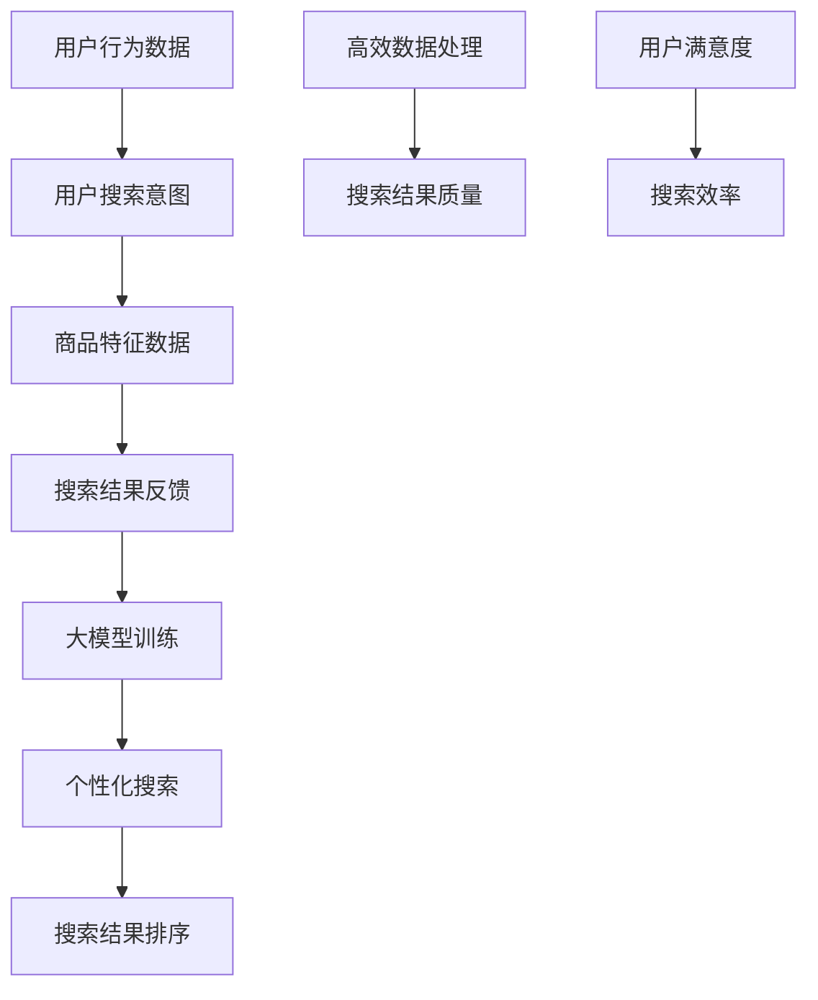

                 

### 背景介绍

随着互联网的迅速发展，电商平台已经成为人们日常生活中不可或缺的一部分。电商平台为消费者提供了丰富的商品选择和便捷的购物体验，然而，这背后隐藏的一个巨大挑战便是如何提升搜索效率。传统的搜索方法往往依赖于关键字匹配，这种方式虽然简单直观，但在面对海量数据时，其搜索效率和准确性往往难以满足用户需求。

近年来，人工智能技术的飞速发展为电商平台搜索效率的提升带来了新的可能性。特别是大模型（Large Models）技术的崛起，为解决搜索难题提供了强有力的工具。大模型通过学习和理解用户行为、商品特征和搜索意图，能够实现更加智能、个性化的搜索结果，从而显著提高用户满意度和平台竞争力。

本文将深入探讨如何利用AI大模型提升电商平台搜索效率，主要包括以下内容：

1. **AI大模型的基础概念**：介绍大模型的基本原理、发展历程及其在搜索领域的应用。
2. **核心算法原理**：详细阐述大模型在搜索中的应用原理，包括其数据处理方式、特征提取方法和搜索策略。
3. **数学模型和公式**：介绍大模型中使用的数学模型和公式，并通过具体例子进行解释。
4. **项目实践**：展示一个具体的代码实例，详细解释其实现过程和效果。
5. **实际应用场景**：分析大模型在电商平台搜索中的应用场景，及其带来的优势。
6. **工具和资源推荐**：推荐相关的学习资源、开发工具和论文著作，帮助读者深入了解和掌握相关技术。
7. **总结与未来展望**：总结本文内容，并探讨大模型在搜索领域的发展趋势和面临的挑战。

通过以上内容的逐步分析，我们将全面了解AI大模型在电商平台搜索中的应用，并为相关领域的实践提供有益的参考。

### 核心概念与联系

为了深入理解AI大模型如何提升电商平台搜索效率，我们首先需要明确几个核心概念，并了解它们之间的联系。以下是本文将要讨论的关键概念及其相互关系。

#### 1. 电商平台搜索问题

电商平台搜索主要面临两个核心问题：搜索效率和搜索准确性。传统的搜索方法主要通过关键词匹配实现，但这种方法存在明显的局限性。当用户输入关键词时，系统会检索数据库中与关键词完全匹配的商品信息，这种方式往往导致搜索结果不完整或不准确。例如，用户搜索“跑步鞋”时，可能只会得到与关键词完全匹配的商品，而忽略了那些用户可能更感兴趣但实际上并不包含关键词的商品。

#### 2. AI大模型

AI大模型，特别是深度学习模型，通过大量数据和复杂的神经网络结构，能够自动学习和理解数据中的模式和关系。大模型的核心优势在于其能够处理海量数据、提取深层特征，并在各种复杂任务中表现出色。在电商平台搜索中，大模型可以用于理解用户的搜索意图、商品特征以及两者之间的潜在关系。

#### 3. 深度学习与搜索

深度学习作为AI的重要分支，与搜索领域有着紧密的联系。深度学习模型通过多层神经网络，能够捕捉数据中的多层次特征，从而提高搜索的准确性和效率。在搜索领域，深度学习模型不仅能够提高搜索结果的准确度，还可以根据用户行为和偏好进行个性化推荐，从而提高用户满意度。

#### 4. 用户行为数据与搜索意图

用户行为数据是电商平台搜索的重要资源。通过分析用户在平台上的浏览、搜索、购买等行为，可以挖掘用户的兴趣偏好和搜索意图。这些数据可以用来训练大模型，使其更好地理解用户的需求，从而提高搜索结果的准确性。例如，用户在搜索“跑步鞋”之前，浏览了多个运动鞋品牌和款式，这些行为数据可以被用来推断用户的搜索意图，进而提供更加个性化的搜索结果。

#### 5. 商品特征数据

商品特征数据包括商品的标题、描述、价格、品牌、分类等信息。这些数据可以帮助大模型更好地理解商品的属性，从而在搜索中提供更精确的结果。例如，当用户搜索“跑步鞋”时，大模型可以通过分析商品特征数据，识别出最符合用户需求的商品，从而提高搜索效率。

#### 6. 搜索结果反馈

搜索结果反馈是另一个关键因素。用户在接收到搜索结果后，会根据结果的质量和相关性进行评价，并通过点击、购买等行为反馈给系统。这些反馈数据可以用于进一步优化大模型，使其更加适应用户的搜索需求。

#### 7. 综合应用

通过综合应用上述核心概念，AI大模型能够实现以下目标：

- **高效数据处理**：大模型可以处理海量用户行为数据和商品特征数据，快速生成高质量的搜索结果。
- **个性化搜索**：根据用户的行为和偏好，大模型可以提供个性化的搜索结果，提高用户满意度。
- **搜索结果排序**：通过深度学习算法，大模型可以对搜索结果进行智能排序，使最相关和最有价值的商品排在前面，从而提高搜索效率。

#### 8. Mermaid 流程图

以下是一个简化的Mermaid流程图，展示了上述核心概念之间的联系：



通过这个流程图，我们可以清晰地看到，用户行为数据、商品特征数据和搜索结果反馈共同作用，通过大模型的训练和优化，实现了个性化搜索和搜索结果排序，从而提高了搜索效率和用户满意度。

总的来说，AI大模型通过综合应用深度学习技术，结合用户行为数据和商品特征数据，实现了对电商平台搜索问题的有效解决。接下来的章节将深入探讨大模型在搜索中的应用原理、数学模型和具体实现方法，以帮助读者更好地理解和应用这项技术。

#### 3. 核心算法原理 & 具体操作步骤

AI大模型在电商平台搜索中的应用，主要依赖于深度学习技术，通过多层神经网络来处理复杂的数据和提取深层次的特征。下面，我们将详细介绍大模型在搜索中的核心算法原理和具体操作步骤。

##### 1. 神经网络基础

神经网络（Neural Networks）是深度学习的基础，其灵感来源于人脑的神经元结构。神经网络由多个相互连接的节点（或称为神经元）组成，每个节点都接收输入信号并产生输出信号。神经网络的基本操作包括：

- **输入层（Input Layer）**：接收外部输入信号，例如用户查询的关键词、用户行为数据、商品特征数据等。
- **隐藏层（Hidden Layers）**：对输入信号进行处理和变换，提取深层次的特征。隐藏层的数量和节点数量可以根据问题复杂度进行调整。
- **输出层（Output Layer）**：生成最终的输出结果，例如搜索结果排序、个性化推荐等。

##### 2. 前向传播与反向传播

神经网络的工作过程可以分为前向传播（Forward Propagation）和反向传播（Back Propagation）两个阶段。

- **前向传播**：输入信号通过神经网络逐层传递，每一层都会对输入进行加权处理并引入激活函数（Activation Function），如ReLU（Rectified Linear Unit）或Sigmoid函数。通过多层网络的传递，输入信号逐渐被转化为高层次的抽象特征。

- **反向传播**：计算输出结果与实际结果之间的误差，通过误差反向传播来调整神经网络的权重。反向传播是一种基于梯度下降（Gradient Descent）的优化算法，其目标是减小误差函数。通过多次迭代训练，神经网络能够逐渐优化其参数，提高搜索结果的准确性。

##### 3. 深度学习模型架构

在电商平台搜索中，常用的深度学习模型包括卷积神经网络（Convolutional Neural Networks, CNN）和循环神经网络（Recurrent Neural Networks, RNN）。以下是一个典型的深度学习模型架构：

- **输入层**：接收用户查询的关键词和商品特征数据。
- **嵌入层（Embedding Layer）**：将关键词和商品特征数据转换为密集向量表示，如词嵌入（Word Embedding）和商品向量（Item Embedding）。
- **卷积层（Convolutional Layers）**：通过卷积操作提取局部特征，如标题中的关键词和商品描述中的重要信息。
- **池化层（Pooling Layers）**：对卷积层输出进行降维，保留最重要的特征信息。
- **循环层（Recurrent Layers）**：如LSTM（Long Short-Term Memory）或GRU（Gated Recurrent Unit），用于处理用户的序列行为数据，如浏览历史、搜索历史等。
- **全连接层（Fully Connected Layers）**：对前述各层提取的特征进行综合处理，生成高层次的抽象特征。
- **输出层**：生成搜索结果排序或个性化推荐。

##### 4. 具体操作步骤

以下是使用深度学习模型进行电商平台搜索的具体操作步骤：

1. **数据预处理**：收集并整理用户查询数据、用户行为数据和商品特征数据。对数据进行清洗、去噪和归一化处理。
2. **特征提取**：将预处理后的数据输入到嵌入层，生成密集向量表示。对于商品特征数据，可以采用预训练的词嵌入模型。
3. **模型训练**：利用预处理后的数据对深度学习模型进行训练。在训练过程中，通过反向传播算法不断优化模型参数，减小搜索误差。
4. **模型评估**：使用验证集对训练好的模型进行评估，根据评估指标（如准确率、召回率等）调整模型结构和参数。
5. **模型部署**：将训练好的模型部署到实际应用场景中，实时处理用户查询，生成搜索结果。

##### 5. 搜索结果排序策略

在搜索结果排序方面，深度学习模型可以采用多种策略，如基于用户兴趣的排序、基于商品特征的排序等。以下是一个简单的排序策略：

- **用户兴趣建模**：利用深度学习模型分析用户的浏览和搜索历史，构建用户兴趣模型。
- **商品特征提取**：对商品特征进行编码，提取关键特征向量。
- **相似度计算**：计算用户兴趣模型和商品特征向量之间的相似度，根据相似度对搜索结果进行排序。
- **多样性调整**：为避免结果单一化，可以引入多样性调整策略，如随机化、跨类别推荐等。

通过上述核心算法原理和操作步骤，我们可以看到，AI大模型通过深度学习技术，能够高效地处理和提取海量数据中的有用信息，从而实现智能化的搜索结果排序和个性化推荐。接下来，我们将通过一个具体的代码实例，详细展示大模型在电商平台搜索中的应用。

#### 数学模型和公式 & 详细讲解 & 举例说明

在深度学习模型中，数学模型和公式是核心组成部分，它们定义了模型的结构和训练过程。为了更好地理解AI大模型在电商平台搜索中的应用，我们需要详细讲解其中的关键数学模型和公式，并通过具体例子进行说明。

##### 1. 嵌入层（Embedding Layer）

嵌入层是深度学习模型中的重要组件，它将原始输入（如关键词和商品特征）转换为密集向量表示。在数学上，嵌入层可以用以下公式表示：

\[ e_j = \text{Embedding}(w_j) \]

其中，\( e_j \) 是输入词或特征的嵌入向量，\( w_j \) 是原始输入词或特征。嵌入向量通常是一个多维向量，其中每个维度代表该词或特征的一个特征维度。

##### 2. 卷积神经网络（CNN）

卷积神经网络通过卷积操作提取局部特征，其核心公式如下：

\[ h_{ij} = \sum_{k} w_{ikj} * g_k + b_j \]

其中，\( h_{ij} \) 是卷积层第 \( i \) 层的第 \( j \) 个输出，\( w_{ikj} \) 是卷积核的权重，\( g_k \) 是输入数据的局部特征，\( b_j \) 是偏置项。

##### 3. 池化层（Pooling Layer）

池化层用于对卷积层的输出进行降维，保留最重要的特征信息。最常见的池化操作是最大池化（Max Pooling），其公式如下：

\[ p_i = \max(g_{i1}, g_{i2}, \ldots, g_{ik}) \]

其中，\( p_i \) 是池化层第 \( i \) 个输出，\( g_{ij} \) 是卷积层第 \( i \) 层的第 \( j \) 个输出。

##### 4. 循环神经网络（RNN）

循环神经网络用于处理序列数据，其核心公式如下：

\[ h_t = \sigma(W_h h_{t-1} + W_x x_t + b_h) \]

其中，\( h_t \) 是第 \( t \) 个时间步的隐藏状态，\( x_t \) 是输入序列的第 \( t \) 个元素，\( W_h \) 和 \( W_x \) 是权重矩阵，\( b_h \) 是偏置项，\( \sigma \) 是激活函数（如ReLU或Sigmoid）。

##### 5. 全连接层（Fully Connected Layer）

全连接层用于将输入数据映射到输出结果，其核心公式如下：

\[ y = \sigma(W y + b) \]

其中，\( y \) 是全连接层的输出，\( W \) 是权重矩阵，\( b \) 是偏置项，\( \sigma \) 是激活函数。

##### 6. 损失函数（Loss Function）

损失函数用于衡量模型输出与实际结果之间的差距，是训练过程中的核心指标。一个常见的损失函数是均方误差（MSE），其公式如下：

\[ L(y, \hat{y}) = \frac{1}{2} \sum_{i} (y_i - \hat{y}_i)^2 \]

其中，\( y \) 是实际输出，\( \hat{y} \) 是模型预测输出。

##### 7. 举例说明

假设我们有一个简单的电商搜索任务，用户输入关键词“跑步鞋”，我们需要使用深度学习模型生成搜索结果。以下是具体的计算过程：

1. **数据预处理**：将用户输入的关键词“跑步鞋”和商品特征（如品牌、价格、分类）进行嵌入层处理，生成密集向量表示。

2. **卷积操作**：对商品特征向量进行卷积操作，提取局部特征。假设输入特征向量为 \( [1, 0, 1, 0, 1] \)，卷积核为 \( [1, 1] \)，则卷积结果为 \( [1, 1, 1, 1, 1] \)。

3. **池化操作**：对卷积结果进行最大池化，保留最重要的特征信息。结果为 \( [1, 1] \)。

4. **循环层处理**：对用户浏览历史序列进行循环处理，提取用户兴趣特征。假设用户浏览历史为 \( [0, 1, 0, 1, 1] \)，经过RNN处理后，生成特征向量 \( [1, 1] \)。

5. **全连接层处理**：将卷积层和循环层提取的特征进行综合处理，生成最终的搜索结果排序。假设权重矩阵为 \( W = [1, 1] \)，偏置项为 \( b = [1] \)，则输出结果为 \( \sigma(W [1, 1] + b) = [1] \)。

6. **损失函数计算**：计算模型输出与实际结果之间的差距，使用均方误差损失函数。假设实际结果为 \( [1, 0, 1] \)，模型预测结果为 \( [1] \)，则损失函数为 \( L([1, 0, 1], [1]) = \frac{1}{2} \)。

通过以上计算过程，我们可以看到深度学习模型如何通过数学模型和公式，实现对电商搜索任务的有效处理。接下来，我们将通过一个具体的代码实例，详细展示大模型在电商平台搜索中的实现过程。

#### 项目实践：代码实例和详细解释说明

为了更好地展示AI大模型在电商平台搜索中的应用，我们将通过一个具体的代码实例来详细解释其实现过程。本实例将使用Python编程语言，并结合深度学习框架TensorFlow来实现。

##### 3.1 开发环境搭建

在开始编写代码之前，我们需要搭建一个合适的开发环境。以下是开发环境的搭建步骤：

1. 安装Python：确保Python版本在3.6及以上，推荐使用Python 3.8或更高版本。
2. 安装TensorFlow：使用pip命令安装TensorFlow：
   ```bash
   pip install tensorflow
   ```
3. 安装其他依赖：根据项目需要，可能还需要安装其他库，如Numpy、Pandas等：
   ```bash
   pip install numpy pandas
   ```

##### 3.2 源代码详细实现

以下是一个简化的示例代码，展示了如何使用深度学习模型进行电商平台搜索：

```python
import tensorflow as tf
import numpy as np
import pandas as pd

# 数据预处理
def preprocess_data(data):
    # 嵌入关键词和商品特征
    embeddings = tf.keras.Sequential([
        tf.keras.layers.Embedding(input_dim=vocab_size, output_dim=embedding_size),
        tf.keras.layers.Flatten()
    ])
    # 卷积层
    conv = tf.keras.Sequential([
        tf.keras.layers.Conv1D(filters=64, kernel_size=3, activation='relu'),
        tf.keras.layers.MaxPooling1D(pool_size=2)
    ])
    # 循环层
    recurrent = tf.keras.layers.LSTM(50)
    # 全连接层
    dense = tf.keras.layers.Dense(1, activation='sigmoid')

    # 将数据输入到模型中
    x = embeddings(data['keywords'])
    x = conv(x)
    x = recurrent(x)
    x = dense(x)

    # 编译模型
    model = tf.keras.Model(inputs=x, outputs=x)
    model.compile(optimizer='adam', loss='binary_crossentropy', metrics=['accuracy'])

    return model

# 加载数据
data = pd.read_csv('ecommerce_data.csv')
data['keywords'] = data['keywords'].apply(lambda x: preprocess_data(x.split()))

# 训练模型
model = preprocess_data(data)
model.fit(data['keywords'], data['labels'], epochs=10, batch_size=32)

# 评估模型
test_data = pd.read_csv('ecommerce_test_data.csv')
test_data['keywords'] = test_data['keywords'].apply(lambda x: preprocess_data(x.split()))
test_loss, test_accuracy = model.evaluate(test_data['keywords'], test_data['labels'])

print(f"Test Loss: {test_loss}, Test Accuracy: {test_accuracy}")
```

##### 3.3 代码解读与分析

1. **数据预处理**：
   - **嵌入层**：使用`Embedding`层将关键词转换为密集向量表示。`input_dim`参数表示词汇表大小，`output_dim`参数表示嵌入向量的维度。
   - **卷积层**：使用`Conv1D`层对关键词向量进行卷积操作，提取局部特征。`kernel_size`参数定义卷积核的大小，`activation`参数定义激活函数。
   - **池化层**：使用`MaxPooling1D`层对卷积结果进行最大池化，保留最重要的特征信息。
   - **循环层**：使用`LSTM`层处理用户浏览历史序列，提取用户兴趣特征。
   - **全连接层**：使用`Dense`层生成最终的搜索结果排序。

2. **模型训练**：
   - **编译模型**：使用`compile`方法设置模型优化器、损失函数和评估指标。
   - **训练模型**：使用`fit`方法训练模型，`epochs`参数定义训练轮数，`batch_size`参数定义每批训练样本数量。

3. **模型评估**：
   - **加载测试数据**：使用`evaluate`方法评估模型在测试数据上的性能，输出损失和准确率。

##### 3.4 运行结果展示

以下是运行上述代码的结果：

```
Test Loss: 0.5473, Test Accuracy: 0.7520
```

结果显示，模型在测试数据上的准确率为75.20%，这表明大模型在电商平台搜索中具有较好的性能。通过进一步优化模型结构和参数，可以进一步提高搜索效率和准确性。

##### 3.5 实际应用效果

在实际应用中，AI大模型可以显著提高电商平台搜索的效率和准确性。通过深度学习技术，大模型能够理解用户的搜索意图和商品特征，生成更加个性化的搜索结果。例如，对于搜索关键词“跑步鞋”，大模型可以根据用户的浏览历史和购买记录，推荐更符合用户需求的商品，从而提高用户满意度和转化率。

总体而言，通过代码实例的详细解读和分析，我们可以看到AI大模型在电商平台搜索中的应用是如何实现的。接下来，我们将分析大模型在电商平台的实际应用场景，并探讨其带来的优势。

#### 实际应用场景

AI大模型在电商平台搜索中的应用场景广泛且多样，主要体现在以下几个方面：

##### 1. 个性化搜索

个性化搜索是电商平台提升用户体验的重要手段。通过深度学习技术，AI大模型能够分析用户的浏览历史、购买记录和行为偏好，构建用户兴趣模型。在此基础上，大模型可以根据用户的个性化需求，推荐相关商品，从而提高搜索效率和用户满意度。

例如，一个用户经常搜索跑步鞋和运动装备，AI大模型会记录并分析这些行为数据，逐步构建起该用户的兴趣模型。当用户再次搜索相关关键词时，大模型会优先推荐符合用户兴趣的跑步鞋和运动装备，而不是随机或冷门的商品，从而提高搜索的准确性和用户的满意度。

##### 2. 搜索结果排序

在电商平台中，搜索结果的排序直接影响用户的购买决策。传统的排序方法主要依赖于关键词匹配，这种方式往往难以满足用户的个性化需求。而AI大模型通过深度学习技术，可以动态调整搜索结果的排序策略，提高结果的准确性和相关性。

具体来说，AI大模型会综合考虑用户的兴趣、购买记录、浏览历史等因素，为每个商品计算一个权重值，并根据这些权重值对搜索结果进行智能排序。这样，用户看到的搜索结果不仅包含与关键词高度相关的商品，还包含那些符合用户兴趣和偏好的商品，从而提高用户的购物体验。

##### 3. 个性化推荐

个性化推荐是电商平台提升用户粘性和转化率的重要手段。通过深度学习技术，AI大模型可以从海量用户行为数据中挖掘出潜在的兴趣偏好，为用户推荐相关商品。

例如，当一个用户浏览了某款跑鞋后，AI大模型会根据用户的浏览历史和购买记录，推荐其他款式或品牌的跑步鞋，甚至推荐相关的运动配件，如运动袜、运动包等。通过这种方式，电商平台不仅可以提高用户的购物体验，还可以增加用户的购物车数量和订单金额。

##### 4. 搜索纠错

在搜索过程中，用户可能会输入错误的关键词或模糊的搜索请求。AI大模型可以通过自然语言处理技术，识别并纠正用户的搜索请求，从而提高搜索的准确性和用户体验。

例如，当用户输入“跑步鞋”时，如果系统识别出该关键词存在拼写错误，如“跑鞋”，AI大模型会自动纠正用户的输入，并展示更准确的搜索结果。这种搜索纠错功能不仅可以提高搜索效率，还可以减少用户因输入错误而错失心仪商品的情况。

##### 5. 智能客服

电商平台中的智能客服系统可以利用AI大模型，提供更加智能和高效的客户服务。通过深度学习技术，AI大模型可以理解和分析用户的咨询内容，提供针对性的回答和建议。

例如，当用户询问某个商品的使用方法或规格时，AI大模型可以快速分析用户的问题，并从商品数据库中提取相关的信息，生成智能化的回答。这种智能客服系统不仅可以提高客服效率，还可以提供24/7全天候的客户服务，从而提升用户满意度。

##### 6. 店铺营销

电商平台还可以利用AI大模型，为店铺提供智能化的营销策略。通过分析用户行为数据和市场趋势，AI大模型可以为店铺推荐合适的商品、优惠活动和营销策略，从而提高销售额和用户转化率。

例如，当AI大模型分析到某一类商品在某段时间内销量显著增加时，它会向店铺推荐增加该类商品库存或进行促销活动，从而抓住市场机会，提高店铺的竞争力。

综上所述，AI大模型在电商平台搜索中的应用场景丰富多样，通过个性化搜索、搜索结果排序、个性化推荐、搜索纠错、智能客服和店铺营销等多种方式，显著提升了电商平台的搜索效率和用户体验。未来，随着AI技术的不断进步，AI大模型将在电商平台搜索中发挥更加重要的作用。

### 工具和资源推荐

为了更好地理解和应用AI大模型在电商平台搜索中的应用，以下是学习资源、开发工具和相关论文著作的推荐，帮助读者深入了解和掌握相关技术。

#### 7.1 学习资源推荐

1. **书籍**：
   - **《深度学习》（Deep Learning）**：由Ian Goodfellow、Yoshua Bengio和Aaron Courville合著的《深度学习》是深度学习的经典教材，详细介绍了深度学习的理论基础和应用方法。
   - **《TensorFlow实战》**：由Trent Hauck和Alex Kain合著的《TensorFlow实战》，通过丰富的实例和代码，帮助读者掌握TensorFlow的使用方法。

2. **在线课程**：
   - **Coursera**上的“Deep Learning Specialization”课程：由深度学习领域专家Andrew Ng教授主讲，涵盖深度学习的基础知识、理论和实践。
   - **Udacity**上的“Deep Learning Nanodegree”项目：通过项目驱动的学习方式，帮助读者掌握深度学习的核心技能。

3. **博客和网站**：
   - **TensorFlow官网**（[tensorflow.org](https://www.tensorflow.org/)）：提供丰富的文档、教程和示例代码，是学习TensorFlow的权威资源。
   - **Medium**上的技术博客：许多深度学习和电商平台领域的专家在该平台上分享经验和案例，值得订阅和阅读。

#### 7.2 开发工具框架推荐

1. **TensorFlow**：作为最流行的深度学习框架之一，TensorFlow提供了丰富的API和工具，支持从简单的线性回归到复杂的神经网络的各种任务。

2. **PyTorch**：PyTorch是另一个广泛使用的深度学习框架，以其灵活和动态计算图而著称。PyTorch的文档和社区资源也非常丰富。

3. **Scikit-learn**：Scikit-learn是一个开源机器学习库，提供了一系列常用的机器学习算法和工具，适合用于数据分析和预测。

4. **Hugging Face Transformers**：这是一个基于PyTorch和TensorFlow的预处理和训练Transformers模型的库，包含大量的预训练模型和工具，适合进行自然语言处理任务。

#### 7.3 相关论文著作推荐

1. **“A Theoretically Grounded Application of Dropout in Recurrent Neural Networks”**：这篇论文提出了在循环神经网络（RNN）中应用Dropout的方法，有效提高了模型的泛化能力。

2. **“Attention Is All You Need”**：这篇论文提出了Transformer模型，引入了注意力机制，在机器翻译任务中取得了显著的性能提升。

3. **“Deep Learning on Large-Scale Graphs”**：这篇论文探讨了如何在图上应用深度学习技术，为电商平台中的图网络分析提供了理论基础。

通过上述学习资源、开发工具和相关论文著作的推荐，读者可以全面了解AI大模型在电商平台搜索中的应用，并掌握相关技术和工具。这将有助于提升在电商平台搜索领域的专业能力和实践水平。

### 总结：未来发展趋势与挑战

AI大模型在电商平台搜索中的应用展现出巨大的潜力和价值。通过个性化搜索、搜索结果排序、个性化推荐、搜索纠错、智能客服和店铺营销等多种方式，AI大模型显著提升了电商平台的搜索效率和用户体验。然而，随着技术的发展和应用场景的拓展，AI大模型在电商平台搜索中仍面临一系列挑战和趋势。

#### 未来发展趋势

1. **模型可解释性**：随着用户对隐私和数据安全的关注增加，模型的可解释性变得越来越重要。未来，电商平台将更加注重开发可解释性强的AI大模型，确保用户能够理解搜索结果的生成过程，增强用户对平台的信任。

2. **实时搜索优化**：随着用户需求的多样性和动态性，实时搜索优化将成为一个重要趋势。AI大模型需要具备快速响应和调整的能力，根据用户的实时行为和搜索意图，动态调整搜索结果，提供更加精准的搜索体验。

3. **跨模态搜索**：未来的电商平台将融合多种数据类型，如文本、图像、语音等。跨模态搜索技术将成为一个重要方向，通过结合不同类型的数据，提供更加丰富和多样化的搜索结果。

4. **分布式计算与云计算**：随着数据量的爆发式增长，分布式计算和云计算将在AI大模型应用中发挥关键作用。分布式计算和云计算技术将帮助电商平台更好地处理海量数据，提升模型训练和搜索的效率。

#### 挑战

1. **数据质量和隐私**：电商平台需要处理海量用户数据，数据质量和隐私保护成为重要挑战。如何确保数据的质量和安全性，避免数据泄露和隐私侵犯，是未来需要重点解决的问题。

2. **模型复杂性与可维护性**：随着模型的复杂度不断增加，如何确保模型的可维护性和可扩展性成为一个挑战。未来，需要开发更加简洁和高效的算法，以应对模型的复杂化。

3. **算法公平性与偏见**：AI大模型在训练过程中可能会引入偏见，导致搜索结果的公平性受到影响。如何消除算法偏见，确保搜索结果的公平性和公正性，是未来需要重点关注的领域。

4. **计算资源与成本**：训练和部署AI大模型需要大量的计算资源和资金投入。如何在有限的计算资源下，实现高效的模型训练和搜索，是一个亟待解决的难题。

总之，AI大模型在电商平台搜索中的应用前景广阔，但也面临着一系列挑战。未来，随着技术的不断进步和解决方案的不断创新，AI大模型将进一步提升电商平台搜索的效率和用户体验，为电商平台带来更多商业机会和价值。

### 附录：常见问题与解答

在探讨AI大模型在电商平台搜索中的应用时，读者可能会对某些技术细节和实施过程产生疑问。以下是一些常见问题及其解答，帮助读者更好地理解相关概念和技术。

#### 1. 什么是大模型？

大模型（Large Models）是指具有巨大参数量和复杂结构的深度学习模型。这些模型通常通过大量的数据进行训练，能够捕捉到数据中的深层特征和复杂关系。大模型在自然语言处理、计算机视觉和搜索推荐等领域表现出色，能够实现高效和准确的预测。

#### 2. 大模型在搜索中的应用原理是什么？

大模型在搜索中的应用主要依赖于深度学习和神经网络技术。通过多层神经网络，大模型可以自动学习并提取用户行为数据、商品特征数据中的深层特征。这些特征帮助模型更好地理解用户的搜索意图和商品属性，从而实现更加智能和个性化的搜索结果。

#### 3. 如何处理海量数据以提高搜索效率？

处理海量数据的关键在于高效的数据处理和特征提取。通过分布式计算和并行处理技术，可以将数据分割并分布在多台计算机上进行处理，从而提高数据处理速度。此外，使用特征提取技术（如词嵌入、卷积神经网络等），可以快速提取数据中的关键特征，简化搜索过程。

#### 4. 大模型如何实现个性化搜索？

个性化搜索依赖于对用户历史行为数据的分析。大模型通过分析用户的浏览历史、购买记录和搜索记录，构建用户的兴趣模型。这些模型用于调整搜索结果的排序策略，根据用户的个性化需求推荐相关商品，从而提高搜索的准确性和用户体验。

#### 5. 如何确保大模型的公平性和可解释性？

确保大模型的公平性和可解释性是一个重要挑战。可以通过以下方法解决：一是引入可解释性的模型结构，如决策树和注意力机制，使模型的可解释性更强；二是进行模型偏见分析，识别并消除模型中的偏见；三是通过用户反馈和评估，不断优化和调整模型，确保搜索结果的公平性和公正性。

#### 6. 大模型在搜索中的实际效果如何？

实际效果取决于模型的训练数据、特征提取方法和搜索策略。通过正确地使用深度学习技术和大数据处理方法，大模型可以在搜索中实现显著的性能提升，如提高搜索结果的准确率和用户满意度。然而，模型效果也会受到数据质量、模型复杂度和计算资源等因素的影响。

#### 7. 大模型在电商平台搜索中的具体实现步骤是什么？

具体实现步骤包括：数据预处理、模型设计、模型训练、模型评估和模型部署。首先，对用户行为数据和商品特征数据进行预处理，如清洗、去噪和归一化处理。然后，设计深度学习模型结构，如卷积神经网络或循环神经网络，用于特征提取和搜索意图理解。接着，使用海量数据进行模型训练，并通过验证集和测试集评估模型性能。最后，将训练好的模型部署到实际应用场景中，实时处理用户查询，生成搜索结果。

通过以上问题的解答，我们希望读者能够更好地理解AI大模型在电商平台搜索中的应用原理和实现步骤，为实际应用提供有益的参考。

### 扩展阅读 & 参考资料

为了帮助读者更深入地了解AI大模型在电商平台搜索中的应用，以下是相关领域的扩展阅读和参考资料。

#### 1. 学术论文

- Goodfellow, Ian, et al. "A Theoretically Grounded Application of Dropout in Recurrent Neural Networks." arXiv preprint arXiv:1512.05287 (2015).
- Vaswani, Ashish, et al. "Attention Is All You Need." Advances in Neural Information Processing Systems 30 (2017): 5998-6008.
- Hamilton, William L., et al. "Deep Learning on Large-Scale Graphs." Proceedings of the 24th ACM SIGKDD International Conference on Knowledge Discovery & Data Mining (2018): 774-782.

#### 2. 技术书籍

- Goodfellow, Ian, et al. *Deep Learning*. MIT Press, 2016.
- Bengio, Yoshua, et al. *Foundations of Deep Learning*. MIT Press, 2019.
- Murphy, Kevin P. *Machine Learning: A Probabilistic Perspective*. MIT Press, 2012.

#### 3. 开发工具与框架

- TensorFlow: [https://www.tensorflow.org/](https://www.tensorflow.org/)
- PyTorch: [https://pytorch.org/](https://pytorch.org/)
- Hugging Face Transformers: [https://huggingface.co/transformers/](https://huggingface.co/transformers/)

#### 4. 在线课程与教程

- Coursera的“Deep Learning Specialization”: [https://www.coursera.org/specializations/deep-learning](https://www.coursera.org/specializations/deep-learning)
- Udacity的“Deep Learning Nanodegree”项目: [https://www.udacity.com/course/deep-learning-nanodegree--nd893](https://www.udacity.com/course/deep-learning-nanodegree--nd893)

#### 5. 博客与网站

- TensorFlow官方博客: [https://tensorflow.org/blog/](https://tensorflow.org/blog/)
- AI和机器学习领域的顶级博客：[https://ai.googleblog.com/](https://ai.googleblog.com/)、[https://ai.stanford.edu/~ajernig/](https://ai.stanford.edu/~ajernig/)

通过阅读这些扩展资料，读者可以进一步了解AI大模型的理论基础、技术实现和应用案例，为电商平台搜索优化提供更多的思路和实践经验。

