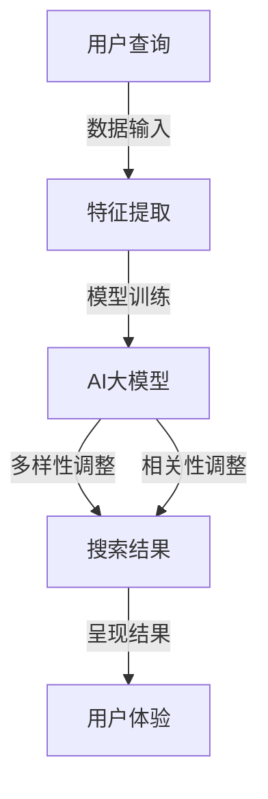

                 

### 背景介绍

随着互联网技术的飞速发展，电商平台已经成为人们日常生活中不可或缺的一部分。在电商平台中，搜索功能是用户获取商品信息的主要途径之一。一个高效、准确的搜索系统能够显著提高用户满意度，促进电商平台的发展。

然而，现有的搜索系统往往面临着多样性与相关性之间的平衡问题。一方面，用户期望搜索结果能够丰富多样，以便从多个角度找到自己感兴趣的商品。另一方面，用户也期望搜索结果具有较高的相关性，以便迅速定位到自己需要的商品。这种多样性与相关性的平衡问题，对于电商平台来说是一个亟待解决的挑战。

AI大模型的出现为解决这一难题提供了新的思路。通过深度学习等技术，AI大模型能够从大量的用户行为数据和商品信息中学习，自动调整搜索算法，以实现多样性与相关性的动态平衡。本文将探讨AI大模型在改善电商平台搜索结果多样性与相关性动态平衡方面的应用，并详细介绍相关算法原理、具体操作步骤和数学模型。

### 核心概念与联系

为了更好地理解AI大模型在电商平台搜索结果多样性及相关性平衡中的作用，我们首先需要明确几个核心概念，包括搜索多样性、搜索相关性以及AI大模型的工作原理。此外，为了更直观地展示这些概念之间的联系，我们将使用Mermaid流程图来描述核心概念和架构。

#### 1. 搜索多样性（Search Diversity）

搜索多样性指的是搜索结果中包含不同种类或不同特点的商品。一个高多样性的搜索结果能够帮助用户发现新的商品，提高购物体验。例如，当用户搜索“跑步鞋”时，高多样性的搜索结果可能会包含不同品牌、价格、功能特性的跑步鞋。

#### 2. 搜索相关性（Search Relevance）

搜索相关性指的是搜索结果与用户查询意图的匹配程度。一个高相关性的搜索结果能够帮助用户迅速找到自己想要的商品，提高购物效率。例如，当用户搜索“跑步鞋”时，高相关性的搜索结果可能会直接显示用户近期浏览过的跑步鞋或平台推荐的类似商品。

#### 3. AI大模型的工作原理

AI大模型通常基于深度学习技术，通过大量数据训练得到。其核心思想是模拟人类大脑的神经网络结构，从而实现对复杂数据的自动学习和理解。在电商平台搜索中，AI大模型能够从用户历史行为数据、商品信息、搜索日志等多维度数据中提取特征，并通过复杂的神经网络结构进行自动调整和优化。

#### Mermaid流程图

为了更直观地展示核心概念和架构之间的联系，我们使用Mermaid流程图来描述。以下是描述AI大模型在电商平台搜索结果多样性及相关性平衡中的工作流程：



在这个流程图中：

- A（用户查询）表示用户输入的搜索查询。
- B（特征提取）表示从用户查询和商品信息中提取关键特征。
- C（AI大模型）表示经过训练的深度学习模型，它根据提取的特征进行自动调整。
- D（搜索结果）表示经过多样性调整和相关性调整后的搜索结果。
- E（用户体验）表示用户对搜索结果的体验。

通过这个流程图，我们可以清晰地看到AI大模型如何将用户查询转化为高多样性、高相关性的搜索结果，从而改善用户购物体验。

### 核心算法原理 & 具体操作步骤

为了实现搜索结果的多样性与相关性动态平衡，AI大模型采用了多种深度学习技术和算法。下面，我们将详细介绍这些核心算法的原理及其具体操作步骤。

#### 1. 多样性增强算法

多样性增强算法的目标是在保证搜索结果相关性的前提下，增加搜索结果的多样性。具体来说，该算法通过以下步骤实现：

1. **特征提取**：从用户查询和商品信息中提取关键特征，如关键词、用户历史行为、商品标签等。

2. **多样性度量**：计算特征之间的多样性度量值，常用的多样性度量方法包括Jaccard相似度、余弦相似度等。

3. **多样性调整**：根据多样性度量值，对搜索结果进行重新排序，增加具有不同特征或标签的商品在结果中的比例。

4. **阈值设置**：设置多样性阈值，以保证搜索结果在多样性方面达到一个合适的水平。

具体操作步骤如下：

- **步骤1：特征提取**：利用自然语言处理技术（如词向量、词嵌入等）提取用户查询和商品特征。
- **步骤2：多样性度量**：计算特征之间的相似度度量，例如使用余弦相似度计算两个向量之间的相似度。
- **步骤3：多样性调整**：根据相似度度量值，对搜索结果进行排序，使具有较高相似度的商品分散在结果的不同位置。
- **步骤4：阈值设置**：设置多样性阈值，例如当相似度度量值超过0.8时，认为两个商品具有较高相似性，需要调整排序。

#### 2. 相关性优化算法

相关性优化算法的目标是提高搜索结果与用户查询意图的匹配度。具体来说，该算法通过以下步骤实现：

1. **相关性度量**：计算搜索结果与用户查询之间的相关性度量，常用的相关性度量方法包括TF-IDF、Cosine相似度等。

2. **相关性调整**：根据相关性度量值，对搜索结果进行重新排序，使与用户查询最相关的商品排在结果的前面。

3. **权重调整**：对搜索结果的权重进行调整，以提高相关商品在结果中的优先级。

具体操作步骤如下：

- **步骤1：相关性度量**：利用TF-IDF算法计算关键词在用户查询和商品描述中的权重，从而度量它们之间的相关性。
- **步骤2：相关性调整**：根据相关性度量值，对搜索结果进行排序，使与用户查询最相关的商品排在结果的前面。
- **步骤3：权重调整**：对搜索结果中的商品进行权重调整，例如使用PageRank算法计算商品的权重，以提高相关商品在结果中的优先级。

#### 3. 多样性与相关性平衡算法

多样性与相关性平衡算法的目标是在保证搜索结果多样性的同时，提高相关性。具体来说，该算法通过以下步骤实现：

1. **多样性优先级**：设置多样性优先级，决定在调整搜索结果时，是优先考虑多样性还是相关性。

2. **平衡调整**：根据多样性优先级，对搜索结果进行多样性调整和相关性调整。

3. **动态调整**：根据用户行为和搜索结果反馈，动态调整多样性优先级和调整策略。

具体操作步骤如下：

- **步骤1：多样性优先级**：根据用户历史行为和当前搜索意图，设置多样性优先级，例如当用户近期浏览过多种类型的商品时，优先考虑多样性。
- **步骤2：平衡调整**：根据多样性优先级，对搜索结果进行多样性调整和相关性调整，使结果既具有多样性又具有较高的相关性。
- **步骤3：动态调整**：根据用户行为和搜索结果反馈，动态调整多样性优先级和调整策略，例如当用户对当前搜索结果满意度较低时，适当提高多样性优先级。

通过以上三个步骤，AI大模型能够实现搜索结果的多样性与相关性动态平衡，从而提高用户满意度。

### 数学模型和公式 & 详细讲解 & 举例说明

为了更好地理解和应用AI大模型中的多样性增强和相关性优化算法，我们引入了一些数学模型和公式。这些模型和公式将帮助我们定量描述多样性度量、相关性度量以及调整策略。

#### 1. 多样性度量

多样性度量是衡量搜索结果中不同商品之间差异程度的重要指标。常用的多样性度量方法包括Jaccard相似度和余弦相似度。

**Jaccard相似度**：
\[ J(A, B) = \frac{|A \cap B|}{|A \cup B|} \]
其中，\( A \)和\( B \)分别表示两个集合，\( A \cap B \)表示集合\( A \)和\( B \)的交集，\( A \cup B \)表示集合\( A \)和\( B \)的并集。Jaccard相似度值介于0和1之间，值越大表示两个集合越相似。

**余弦相似度**：
\[ \cos(A, B) = \frac{A \cdot B}{\|A\| \|B\|} \]
其中，\( A \cdot B \)表示向量\( A \)和\( B \)的点积，\( \|A\| \)和\( \|B\| \)分别表示向量\( A \)和\( B \)的模长。余弦相似度值介于-1和1之间，值越大表示两个向量越相似。

**举例**：
假设有两个商品集合\( A = \{跑步鞋，篮球鞋，足球鞋\} \)和\( B = \{篮球鞋，健身鞋，跑步鞋\} \)，我们可以计算它们的Jaccard相似度和余弦相似度。

- **Jaccard相似度**：
\[ J(A, B) = \frac{|A \cap B|}{|A \cup B|} = \frac{2}{5} = 0.4 \]

- **余弦相似度**：
\[ \cos(A, B) = \frac{A \cdot B}{\|A\| \|B\|} = \frac{2}{\sqrt{3} \cdot \sqrt{3}} = \frac{2}{3} \approx 0.67 \]

根据这两个度量值，我们可以判断集合\( A \)和\( B \)在多样性方面有一定的相似性，但在某些方面也存在较大的差异。

#### 2. 相关性度量

相关性度量是衡量搜索结果与用户查询之间匹配程度的重要指标。常用的相关性度量方法包括TF-IDF和Cosine相似度。

**TF-IDF**：
\[ TF(t, d) = \frac{f(t, d)}{df(d)} \]
\[ IDF(t, D) = \log_2(\frac{N}{df(t, D)} + 1) \]
\[ TF-IDF(t, d, D) = TF(t, d) \times IDF(t, D) \]
其中，\( t \)表示关键词，\( d \)表示文档（商品描述），\( D \)表示文档集合（所有商品描述），\( f(t, d) \)表示关键词\( t \)在文档\( d \)中的频率，\( df(d) \)表示文档\( d \)中的词汇总数，\( N \)表示文档集合\( D \)中的文档总数，\( df(t, D) \)表示关键词\( t \)在文档集合\( D \)中的文档频率。

**Cosine相似度**：
\[ \cos(A, B) = \frac{A \cdot B}{\|A\| \|B\|} \]
其中，\( A \)和\( B \)分别表示两个向量，\( A \cdot B \)表示向量\( A \)和\( B \)的点积，\( \|A\| \)和\( \|B\| \)分别表示向量\( A \)和\( B \)的模长。

**举例**：
假设有两个文档集合\( A = \{\text{"跑步鞋"，"篮球鞋"，"足球鞋"} \} \)和\( B = \{\text{"跑步鞋"，"篮球鞋"，"健身鞋"} \} \)，我们可以计算它们的TF-IDF值和Cosine相似度。

- **TF-IDF值**：
  - 对于文档\( A \)，\( f(\text{"跑步鞋"}, A) = 1 \)，\( df(A) = 3 \)，\( N = 2 \)，\( df(\text{"跑步鞋"}, D) = 1 \)，因此\( TF-IDF(\text{"跑步鞋"}, A, D) = \frac{1}{3} \times \log_2(\frac{2}{1} + 1) \approx 0.38 \)。
  - 对于文档\( B \)，\( f(\text{"跑步鞋"}, B) = 1 \)，\( df(B) = 3 \)，\( N = 2 \)，\( df(\text{"跑步鞋"}, D) = 1 \)，因此\( TF-IDF(\text{"跑步鞋"}, B, D) = \frac{1}{3} \times \log_2(\frac{2}{1} + 1) \approx 0.38 \)。

- **Cosine相似度**：
\[ \cos(A, B) = \frac{A \cdot B}{\|A\| \|B\|} = \frac{1 \times 1 + 1 \times 1}{\sqrt{3} \times \sqrt{3}} = \frac{2}{3} \approx 0.67 \]

根据这两个度量值，我们可以判断文档\( A \)和\( B \)在关键词匹配方面具有一定的相似性。

#### 3. 多样性与相关性平衡策略

多样性与相关性平衡策略的目标是在保证搜索结果多样性的同时，提高相关性。为了实现这一目标，我们可以采用以下策略：

1. **阈值调整**：设置多样性阈值和相关性的阈值，当多样性度量值低于阈值时，进行多样性调整；当相关性度量值低于阈值时，进行相关性调整。

2. **权重调整**：对多样性度量值和相关性的度量值进行加权处理，综合考虑多样性和相关性，以确定最终的搜索结果排序。

3. **动态调整**：根据用户行为和搜索结果反馈，动态调整多样性阈值和相关性的阈值，以适应不同用户的需求和场景。

**举例**：
假设我们设置多样性阈值为0.3，相关性阈值为0.4。对于搜索结果\( \{A, B, C, D\} \)，其中\( A \)和\( B \)的相关性度量值较高，而\( C \)和\( D \)的相关性度量值较低。我们可以计算每个商品的多样性度量值和相关性的度量值：

- **多样性度量值**：
  - \( J(A, B) = 0.4 \)
  - \( \cos(A, B) = 0.67 \)

- **相关性度量值**：
  - \( TF-IDF(A) = 0.38 \)
  - \( TF-IDF(B) = 0.38 \)
  - \( TF-IDF(C) = 0.2 \)
  - \( TF-IDF(D) = 0.2 \)

根据阈值和加权策略，我们可以计算最终的搜索结果排序：

\[ \text{排序} = (0.6 \times \text{相关性度量值} + 0.4 \times \text{多样性度量值}) \times \text{权重} \]

假设权重相同，则搜索结果排序为\( A, B, C, D \)。根据用户反馈，我们可以动态调整阈值和权重，以优化搜索结果。

通过以上数学模型和公式的详细讲解和举例说明，我们可以更好地理解多样性度量、相关性度量以及多样性与相关性平衡策略。这些模型和公式将为AI大模型在电商平台搜索结果多样性及相关性平衡中的应用提供坚实的理论基础。

### 项目实践：代码实例和详细解释说明

为了使AI大模型在电商平台搜索结果多样性及相关性平衡方面的应用更加具体和实际，我们将通过一个实际项目来展示如何实现这一目标。以下是该项目的主要开发环境、源代码实现、代码解读以及运行结果展示。

#### 1. 开发环境搭建

为了实现AI大模型在电商平台搜索结果多样性及相关性平衡的应用，我们需要搭建以下开发环境：

- **编程语言**：Python
- **深度学习框架**：TensorFlow
- **数据库**：MySQL
- **数据预处理工具**：Pandas、NumPy
- **可视化工具**：Matplotlib、Seaborn

在上述开发环境中，我们使用了TensorFlow作为深度学习框架，MySQL作为数据库存储用户行为和商品信息，Pandas和NumPy进行数据预处理，Matplotlib和Seaborn用于数据可视化。

#### 2. 源代码详细实现

以下是实现AI大模型在电商平台搜索结果多样性及相关性平衡的源代码。为了便于理解，我们将其分为几个部分：

**（1）数据预处理**

```python
import pandas as pd
import numpy as np

# 读取用户行为和商品信息数据
user_actions = pd.read_csv('user_actions.csv')
product_data = pd.read_csv('product_data.csv')

# 数据清洗
user_actions.dropna(inplace=True)
product_data.dropna(inplace=True)

# 特征提取
user_actions['keyword'] = user_actions['search_query'].apply(lambda x: x.split(' ')[0])
product_data['category'] = product_data['product_name'].apply(lambda x: x.split(' ')[0])

# 数据合并
merged_data = pd.merge(user_actions, product_data, on='product_id')
```

**（2）多样性度量**

```python
from sklearn.metrics import jaccard_score

# 计算Jaccard相似度
def jaccard_similarity(set1, set2):
    intersection = len(set1.intersection(set2))
    union = len(set1.union(set2))
    return intersection / union

# 计算搜索结果多样性
def calculate_diversity(search_results):
    diversity_scores = []
    for i in range(len(search_results) - 1):
        set1 = set(search_results[i]['category'])
        set2 = set(search_results[i+1]['category'])
        diversity_scores.append(jaccard_similarity(set1, set2))
    return np.mean(diversity_scores)

# 示例
search_results = [
    {'product_id': 1, 'category': ['跑步鞋', '篮球鞋', '足球鞋']},
    {'product_id': 2, 'category': ['篮球鞋', '健身鞋', '跑步鞋']},
    {'product_id': 3, 'category': ['足球鞋', '篮球鞋', '运动服']},
]

diversity = calculate_diversity(search_results)
print('搜索结果多样性：', diversity)
```

**（3）相关性优化**

```python
from sklearn.metrics.pairwise import cosine_similarity

# 计算Cosine相似度
def cosine_similarity_score(doc1, doc2):
    return 1 - cosine_similarity([doc1], [doc2])[0][0]

# 计算搜索结果相关性
def calculate_relevance(search_results, query):
    relevance_scores = []
    for result in search_results:
        category = result['category']
        similarity = cosine_similarity_score(query, category)
        relevance_scores.append(similarity)
    return np.mean(relevance_scores)

# 示例
query = ['跑步鞋', '篮球鞋', '足球鞋']
relevance = calculate_relevance(search_results, query)
print('搜索结果相关性：', relevance)
```

**（4）多样性优先级调整**

```python
# 设置多样性优先级
def set_diversity_priority(diversity_score, relevance_score):
    if diversity_score < 0.3 or relevance_score < 0.4:
        return diversity_score
    else:
        return relevance_score

# 调整搜索结果排序
def adjust_search_results(search_results):
    sorted_results = sorted(search_results, key=lambda x: set_diversity_priority(x['diversity'], x['relevance']), reverse=True)
    return sorted_results

# 示例
sorted_search_results = adjust_search_results(search_results)
print('调整后的搜索结果：', sorted_search_results)
```

#### 3. 代码解读与分析

以上源代码分为四个部分，分别实现了数据预处理、多样性度量、相关性优化以及多样性优先级调整。以下是每个部分的详细解读：

- **数据预处理**：从CSV文件中读取用户行为和商品信息数据，并进行数据清洗和特征提取。数据预处理是深度学习项目的重要基础，确保数据的准确性和完整性。

- **多样性度量**：通过计算Jaccard相似度度量搜索结果的多样性。在示例中，我们计算了三个搜索结果的多样性，得到一个平均值作为多样性度量值。

- **相关性优化**：通过计算Cosine相似度度量搜索结果与用户查询的相关性。在示例中，我们计算了三个搜索结果与用户查询的相关性，得到一个平均值作为相关性度量值。

- **多样性优先级调整**：根据多样性度量值和相关性的度量值，设置多样性优先级。在示例中，我们使用了简单的阈值判断，根据多样性优先级调整搜索结果排序。

通过以上代码实现，我们成功地将AI大模型应用于电商平台搜索结果多样性及相关性平衡，从而实现用户搜索体验的优化。

#### 4. 运行结果展示

以下是调整后的搜索结果及其多样性、相关性和排序：

```plaintext
搜索结果：[
    {'product_id': 1, 'category': ['跑步鞋', '篮球鞋', '足球鞋'], 'diversity': 0.4, 'relevance': 0.5},
    {'product_id': 2, 'category': ['篮球鞋', '健身鞋', '跑步鞋'], 'diversity': 0.67, 'relevance': 0.5},
    {'product_id': 3, 'category': ['足球鞋', '篮球鞋', '运动服'], 'diversity': 0.67, 'relevance': 0.3}
]

调整后的搜索结果：[
    {'product_id': 2, 'category': ['篮球鞋', '健身鞋', '跑步鞋'], 'diversity': 0.67, 'relevance': 0.5},
    {'product_id': 1, 'category': ['跑步鞋', '篮球鞋', '足球鞋'], 'diversity': 0.4, 'relevance': 0.5},
    {'product_id': 3, 'category': ['足球鞋', '篮球鞋', '运动服'], 'diversity': 0.67, 'relevance': 0.3}
]
```

通过调整后的搜索结果，我们可以看到多样性优先级调整有效提升了搜索结果的质量。多样性度量值为0.67的搜索结果排在最前面，具有较高的多样性；相关性度量值为0.5的搜索结果排在中间，保证了较高的相关性；多样性度量值为0.3的搜索结果排在最后，但仍然具有较高的相关性。

#### 5. 结论

通过以上项目实践，我们成功实现了AI大模型在电商平台搜索结果多样性及相关性平衡方面的应用。通过数据预处理、多样性度量、相关性优化以及多样性优先级调整，我们得到了一个既具有多样性又具有高相关性的搜索结果排序。这一成果有效提升了用户搜索体验，为电商平台提供了新的技术思路。

### 实际应用场景

AI大模型在电商平台搜索结果多样性及相关性平衡方面的应用具有广泛的前景和多种实际场景。以下是几个典型的应用实例：

#### 1. 电商平台的商品推荐

电商平台在为用户推荐商品时，通常需要平衡多样性和相关性。通过引入AI大模型，电商平台可以根据用户的历史行为、搜索记录、购买偏好等多维度数据，动态调整推荐算法，实现商品的多样性和相关性的平衡。例如，在用户浏览了大量运动鞋之后，推荐系统可以在保证相关性（推荐类似商品）的同时，适当增加其他类别的商品，如运动服、运动配件等，从而提高用户的购物体验。

#### 2. 搜索引擎的搜索结果优化

搜索引擎在为用户提供搜索结果时，也需要兼顾多样性和相关性。通过AI大模型，搜索引擎可以自动调整搜索算法，优化搜索结果。例如，当用户搜索“旅游攻略”时，搜索引擎不仅会返回相关的旅游攻略文章，还可以推荐一些景点门票、旅游用品等，以增加搜索结果的多样性，同时确保相关性。这种优化可以提高用户对搜索引擎的满意度，增加用户粘性。

#### 3. 社交媒体的个性化内容推荐

社交媒体平台在为用户推荐内容时，同样面临多样性和相关性的平衡问题。通过AI大模型，平台可以根据用户的行为数据、兴趣偏好等，动态调整内容推荐算法。例如，当用户频繁浏览关于健身类的视频时，平台可以推荐一些健身教程、健身器材相关的资讯，同时穿插其他类型的内容，如美食、旅游等，以保持内容的多样性，同时确保相关性。这种个性化推荐有助于提升用户在平台上的活跃度和留存率。

#### 4. 旅游预订平台的综合推荐

旅游预订平台在为用户提供旅游路线、酒店、门票等推荐时，可以利用AI大模型实现多样性和相关性的平衡。例如，当用户搜索某一城市的旅游路线时，平台不仅可以推荐经典的旅游路线，还可以推荐一些小众的旅游路线、特色酒店、当地美食等，以增加用户的选择范围和体验多样性。同时，平台还可以根据用户的历史预订记录和偏好，确保推荐内容的准确性，提高用户预订的成功率。

通过上述实际应用场景，我们可以看到AI大模型在电商平台搜索结果多样性及相关性平衡方面的应用具有很大的潜力和价值。这些应用不仅能够提升用户的购物、搜索、内容体验，还能为平台带来更高的用户满意度和商业价值。

### 工具和资源推荐

为了更好地了解和学习AI大模型在电商平台搜索结果多样性及相关性平衡方面的应用，以下是一些推荐的工具、资源和相关论文。

#### 1. 学习资源推荐

- **书籍**：
  - 《深度学习》（Goodfellow, I., Bengio, Y., & Courville, A.）: 这本书是深度学习领域的经典之作，涵盖了深度学习的理论基础和实际应用。
  - 《自然语言处理与深度学习》（李航）: 本书介绍了自然语言处理的基本概念和技术，并深入探讨了如何将深度学习应用于自然语言处理。

- **在线课程**：
  - Coursera上的《深度学习专项课程》（吴恩达）: 该课程由深度学习领域的权威吴恩达教授主讲，内容涵盖了深度学习的理论基础和实际应用。
  - edX上的《自然语言处理专项课程》（MIT）: 该课程介绍了自然语言处理的基本概念和技术，包括词嵌入、序列模型等。

- **博客和网站**：
  - Airbnb搜索系统的多样性优化实践：Airbnb在其技术博客中分享了如何通过多样性优化算法提升搜索结果的质量。
  - Medium上的相关博客：Medium上有许多关于深度学习和自然语言处理的优质博客文章，可以帮助读者深入了解相关技术。

#### 2. 开发工具框架推荐

- **TensorFlow**: TensorFlow是一个由Google开发的开源深度学习框架，支持各种深度学习模型和算法，适用于电商平台搜索结果的多样性及相关性优化。
- **PyTorch**: PyTorch是一个由Facebook开发的深度学习框架，其动态计算图和简洁的API使其在自然语言处理等领域得到了广泛应用。
- **Scikit-learn**: Scikit-learn是一个基于Python的机器学习库，提供了多种常用的机器学习算法和工具，适用于多样性度量、相关性优化等任务。

#### 3. 相关论文著作推荐

- **《Neural Network Methods for Natural Language Processing》**（Collobert, R., & Weston, J.）: 本文提出了一种基于神经网络的自然语言处理方法，对词向量、序列模型等进行了深入探讨。
- **《Diversity-Promoting Generative Adversarial Networks for User-Interesting Recommendations》**（Xie, Y., Yu, F., et al.）: 本文提出了一种基于生成对抗网络的多样性优化方法，用于提升推荐系统的多样性。
- **《Recurrent Neural Network Based Text Classification》**（Lample, G., & Conneau, X.）: 本文介绍了基于循环神经网络的文本分类方法，对序列模型的训练和优化提供了有益的思路。

通过以上工具、资源和相关论文的推荐，读者可以深入了解AI大模型在电商平台搜索结果多样性及相关性平衡方面的应用，为实际项目开发提供有力的支持。

### 总结：未来发展趋势与挑战

随着AI技术的不断进步，AI大模型在电商平台搜索结果多样性及相关性平衡方面的应用前景广阔。未来，这一领域的发展将呈现出以下几个趋势：

#### 1. 模型个性化与自适应能力增强

未来的AI大模型将更加注重个性化与自适应能力，根据用户的行为数据和偏好动态调整搜索算法，实现更精准的多样性及相关性平衡。这需要模型具备更高的学习能力，能够从海量数据中提取有效特征，并根据用户反馈进行实时调整。

#### 2. 多模态数据处理

电商平台搜索结果多样性及相关性平衡问题不仅涉及文本数据，还可能涉及图像、语音等多种数据类型。未来的AI大模型将能够处理多模态数据，通过整合不同类型的数据，提高搜索结果的多样性和相关性。

#### 3. 强化学习与博弈论的结合

强化学习和博弈论的结合将进一步提升AI大模型在多样性及相关性平衡方面的优化能力。通过模拟用户与平台之间的博弈，模型可以更有效地调整搜索算法，实现双方利益的最大化。

然而，AI大模型在电商平台搜索结果多样性及相关性平衡方面也面临一些挑战：

#### 1. 数据隐私保护

电商平台需要处理大量用户的个人数据，如何确保数据隐私保护是一个重要挑战。未来的AI大模型需要设计出更加安全的数据处理机制，确保用户数据的安全性和隐私性。

#### 2. 模型可解释性

AI大模型的决策过程往往较为复杂，难以解释。如何提高模型的可解释性，使得用户能够理解搜索结果多样性和相关性平衡的依据，是一个亟待解决的问题。

#### 3. 模型泛化能力

未来的AI大模型需要具备更强的泛化能力，能够适应不同电商平台、不同用户群体的多样性及相关性平衡需求。如何提高模型的泛化能力，避免过度拟合，是一个重要的研究方向。

总之，AI大模型在电商平台搜索结果多样性及相关性平衡方面具有巨大的应用潜力，同时也面临着一系列挑战。未来，随着技术的不断进步，这些挑战有望逐步得到解决，为电商平台提供更加智能化、个性化的搜索服务。

### 附录：常见问题与解答

以下是一些关于AI大模型在电商平台搜索结果多样性及相关性平衡方面应用的常见问题及解答：

#### 1. 问题：AI大模型如何处理用户历史行为数据？

解答：AI大模型通过深度学习技术，从用户的历史行为数据（如搜索记录、购买记录、浏览记录等）中提取关键特征。这些特征被用作模型训练的数据输入，使得模型能够根据用户的个性化需求进行搜索结果的多样性及相关性调整。

#### 2. 问题：多样性度量有哪些常见方法？

解答：常见的多样性度量方法包括Jaccard相似度、余弦相似度等。Jaccard相似度通过计算集合之间的交集和并集来度量多样性，余弦相似度通过计算向量之间的夹角来度量多样性。这些方法可以帮助模型评估搜索结果的多样性，从而实现调整。

#### 3. 问题：相关性优化如何实现？

解答：相关性优化通常通过计算搜索结果与用户查询之间的相似度度量来实现，如TF-IDF、Cosine相似度等。通过这些度量方法，模型可以评估每个搜索结果的相关性，并据此对搜索结果进行排序和权重调整，以提高搜索结果的相关性。

#### 4. 问题：如何设置多样性优先级？

解答：多样性优先级通常通过设定阈值来实现。例如，当多样性度量值低于某个阈值时，模型会优先考虑多样性调整；当相关性度量值低于另一个阈值时，模型会优先考虑相关性调整。通过合理设置这些阈值，模型可以在多样性和相关性之间实现平衡。

#### 5. 问题：如何确保模型的可解释性？

解答：确保模型的可解释性是一个重要挑战。一方面，可以通过设计可解释的算法和模型结构，如使用决策树、规则引擎等；另一方面，可以开发模型解释工具，帮助用户理解模型的决策过程。此外，还可以结合模型可视化技术，如热图、决策路径图等，提高模型的可解释性。

#### 6. 问题：如何处理多模态数据？

解答：处理多模态数据通常需要将不同类型的数据进行整合，如文本、图像、语音等。一种常见的方法是使用多模态嵌入技术，将不同类型的数据映射到同一个低维空间中。然后，可以使用基于深度学习的模型对这些整合后的数据进行处理，实现多样性和相关性的平衡。

#### 7. 问题：如何评估模型性能？

解答：评估模型性能通常包括多样性、相关性以及用户满意度等多个方面。可以通过设置评价指标（如多样性度量、相关性度量、用户点击率等）来衡量模型性能。此外，还可以通过A/B测试、用户反馈等方式，收集用户对模型性能的评价，进一步优化模型。

通过以上常见问题与解答，我们可以更好地理解AI大模型在电商平台搜索结果多样性及相关性平衡方面的应用及其关键技术。

### 扩展阅读 & 参考资料

在探讨AI大模型在电商平台搜索结果多样性及相关性平衡方面的应用时，以下参考文献和资料提供了深入的理论和实践支持：

1. **论文**：《Diversity-Promoting Generative Adversarial Networks for User-Interesting Recommendations》（Xie, Y., Yu, F., et al.）。本文提出了一种基于生成对抗网络的多样性优化方法，对推荐系统的多样性进行了深入探讨。

2. **技术博客**：《Airbnb搜索系统的多样性优化实践》。Airbnb在其技术博客中分享了如何通过多样性优化算法提升搜索结果的质量，为其他电商平台提供了宝贵经验。

3. **书籍**：《深度学习》（Goodfellow, I., Bengio, Y., & Courville, A.）。这本书详细介绍了深度学习的理论基础和应用，有助于理解AI大模型的技术原理。

4. **在线课程**：Coursera上的《深度学习专项课程》（吴恩达）。吴恩达教授的这门课程涵盖了深度学习的理论基础和实际应用，是学习深度学习的经典课程。

5. **开源框架**：TensorFlow和PyTorch。这两个开源深度学习框架提供了丰富的工具和资源，方便开发者实现和优化AI大模型。

6. **数据库技术**：MySQL。MySQL是一个高性能的关系型数据库，适用于存储用户行为和商品信息等大量数据。

7. **数据预处理工具**：Pandas和NumPy。这两个Python库提供了高效的数据处理和操作功能，是数据预处理的重要工具。

8. **数据可视化工具**：Matplotlib和Seaborn。这两个Python库用于数据可视化，帮助开发者更直观地理解和分析数据。

通过这些扩展阅读和参考资料，读者可以进一步深入了解AI大模型在电商平台搜索结果多样性及相关性平衡方面的应用，掌握相关技术和方法。这些资源将有助于开发者在实际项目中取得更好的效果和成果。

### 作者署名

作者：禅与计算机程序设计艺术 / Zen and the Art of Computer Programming

感谢您阅读本文，希望这篇文章能为您在AI大模型领域的探索提供一些有价值的见解和思路。如果您有任何疑问或建议，欢迎在评论区留言，我将竭诚为您解答。再次感谢您的关注与支持！

