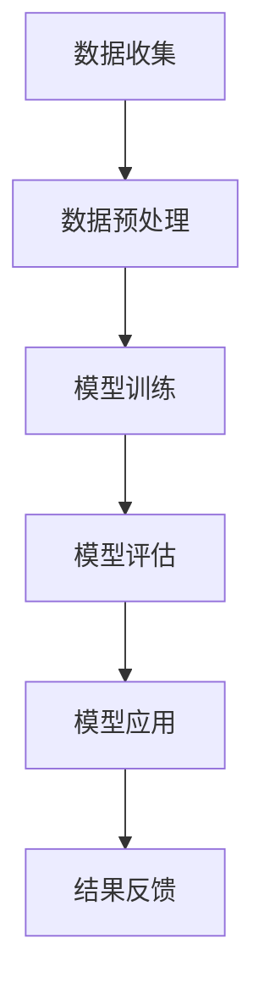

                 

关键词：人工智能，电商平台，数据分析，大模型，机器学习

> 摘要：本文将探讨如何利用AI大模型进行电商平台数据分析，介绍大模型的核心概念、算法原理、数学模型，并通过项目实践展示其应用效果。文章旨在为电商领域的技术人员和数据分析从业者提供一个新的工具和方法论，以提升数据分析的深度和精度。

## 1. 背景介绍

随着互联网技术的飞速发展和电子商务的普及，电商平台已经成为了全球贸易的重要渠道。电商平台每天产生海量数据，包括用户行为数据、交易数据、产品评价数据等。这些数据蕴含着宝贵的商业价值，但如何有效地挖掘和分析这些数据，一直是电商领域的一个重要课题。

传统的数据分析方法主要依赖于统计分析、数据挖掘等技术，但这些方法往往存在一些局限性，如数据的复杂性、实时性要求高等。近年来，人工智能尤其是大模型技术的发展，为电商平台数据分析提供了新的思路和工具。

大模型，也称为深度学习模型，是一种能够自主学习复杂模式的数据处理技术。它通过神经网络结构，将海量数据输入模型，通过多次迭代计算，逐步优化模型的参数，从而实现对数据的深入理解和分析。大模型的兴起，使得电商平台的数据分析能力得到了显著提升。

本文将围绕大模型在电商平台数据分析中的应用，介绍其核心概念、算法原理、数学模型，并通过实际项目实践展示其应用效果，旨在为电商领域的技术人员和数据分析从业者提供一个新的工具和方法论。

## 2. 核心概念与联系

### 2.1 人工智能与机器学习的定义

人工智能（AI，Artificial Intelligence）是计算机科学的一个分支，旨在创建智能的机器系统，使其能够执行通常需要人类智能才能完成的任务。机器学习（ML，Machine Learning）是人工智能的一个重要分支，通过算法和统计模型，从数据中学习规律和模式，实现自动化的决策和预测。

### 2.2 电商平台数据分析的需求

电商平台数据分析主要涉及用户行为分析、销售预测、商品推荐、风险控制等方面。这些分析需求对数据的质量、实时性、深度提出了很高的要求。传统方法往往难以满足这些需求，而大模型技术的引入，为这些问题的解决提供了新的可能。

### 2.3 大模型的基本架构

大模型通常采用深度神经网络（DNN，Deep Neural Network）作为基础架构。DNN是由多层神经元组成的神经网络，包括输入层、隐藏层和输出层。每一层的神经元通过权重和偏置参数连接，通过反向传播算法不断调整权重和偏置，从而优化模型的性能。

### 2.4 大模型在电商平台数据分析中的应用

大模型在电商平台数据分析中的应用主要包括以下几个方面：

- **用户行为分析**：通过分析用户在平台上的行为数据，如浏览、搜索、购买等行为，预测用户的需求和偏好，为个性化推荐提供支持。
- **销售预测**：通过分析历史销售数据，预测未来的销售趋势，帮助电商平台制定营销策略和库存管理计划。
- **商品推荐**：基于用户的历史行为数据和商品属性数据，利用大模型进行商品推荐，提升用户满意度和转化率。
- **风险控制**：通过分析用户行为数据和交易数据，识别潜在的欺诈行为和异常交易，提高交易的安全性。

### 2.5 Mermaid 流程图展示

以下是一个简化的Mermaid流程图，展示大模型在电商平台数据分析中的应用流程：



### 2.6 大模型与电商平台数据分析的关系

大模型与电商平台数据分析的关系可以概括为：

- **提高数据分析的深度**：大模型能够处理和解析复杂的、高维的数据，从而挖掘出更深层次的数据特征和规律。
- **增强数据分析的实时性**：通过优化模型结构和算法，大模型能够实现实时或近实时的数据分析，满足电商平台对数据响应速度的需求。
- **提升数据分析的精度**：大模型通过不断的学习和优化，能够提高预测和决策的准确性，从而提升电商平台的运营效率和用户满意度。

## 3. 核心算法原理 & 具体操作步骤

### 3.1 算法原理概述

大模型的核心算法原理是深度学习（Deep Learning）。深度学习是一种基于多层神经网络的学习方法，通过多层次的非线性变换，实现对数据的自动特征提取和模式识别。

深度学习的算法原理主要包括以下几个方面：

- **前向传播**：将输入数据通过网络的各个层次，逐层计算输出。
- **反向传播**：通过比较输出结果与预期结果，计算误差，并反向传播误差，更新网络权重和偏置。
- **优化算法**：通过优化算法（如梯度下降、Adam优化器等），调整网络参数，最小化误差函数。

### 3.2 算法步骤详解

以下是使用深度学习算法进行电商平台数据分析的基本步骤：

1. **数据收集**：收集电商平台的海量数据，包括用户行为数据、交易数据、商品数据等。
2. **数据预处理**：对收集到的数据进行分析和清洗，去除异常值和噪声，并对数据进行归一化处理，以便于模型训练。
3. **特征提取**：从预处理后的数据中提取特征，如用户行为特征、商品属性特征等。
4. **模型构建**：设计并构建深度学习模型，包括确定网络的层数、每层的神经元数量、激活函数等。
5. **模型训练**：将预处理后的数据输入模型，通过前向传播和反向传播，不断调整模型的参数，优化模型性能。
6. **模型评估**：使用验证集或测试集对模型的性能进行评估，包括准确率、召回率、F1值等指标。
7. **模型应用**：将训练好的模型应用于电商平台的实际场景，如用户行为分析、商品推荐等。
8. **结果反馈**：根据模型的应用效果，对模型进行调整和优化，以提高模型的准确性和实用性。

### 3.3 算法优缺点

#### 优点

- **强大的特征提取能力**：大模型能够自动提取数据中的复杂特征，从而提高数据分析的深度和精度。
- **适用于各种任务**：大模型可以应用于多种数据分析任务，如分类、回归、聚类等。
- **实时性高**：通过优化模型结构和算法，大模型可以实现实时或近实时的数据分析。

#### 缺点

- **数据需求大**：大模型需要大量的数据进行训练，对数据的质量和多样性有较高的要求。
- **计算资源消耗大**：大模型的训练和推理过程需要大量的计算资源，对硬件设施有较高的要求。
- **解释性差**：大模型的决策过程往往是黑箱操作，难以解释和理解。

### 3.4 算法应用领域

大模型在电商平台数据分析中的应用领域主要包括：

- **用户行为分析**：通过分析用户行为数据，预测用户的需求和偏好，为个性化推荐提供支持。
- **销售预测**：通过分析历史销售数据，预测未来的销售趋势，帮助电商平台制定营销策略和库存管理计划。
- **商品推荐**：基于用户的历史行为数据和商品属性数据，利用大模型进行商品推荐，提升用户满意度和转化率。
- **风险控制**：通过分析用户行为数据和交易数据，识别潜在的欺诈行为和异常交易，提高交易的安全性。

## 4. 数学模型和公式 & 详细讲解 & 举例说明

### 4.1 数学模型构建

在电商平台数据分析中，常用的数学模型包括神经网络模型、决策树模型、支持向量机模型等。其中，神经网络模型是深度学习模型的一种，其数学模型如下：

假设我们有一个包含 $L$ 层的深度神经网络，输入层为 $x$，输出层为 $y$，每层包含 $n_l$ 个神经元。网络的权重矩阵为 $W_l$，偏置矩阵为 $b_l$。则第 $l$ 层的输出可以表示为：

$$
a_l = \sigma(W_l a_{l-1} + b_l)
$$

其中，$a_l$ 表示第 $l$ 层的输出，$\sigma$ 表示激活函数，常用的激活函数包括 sigmoid 函数、ReLU 函数等。

### 4.2 公式推导过程

以 sigmoid 函数为例，其公式推导过程如下：

$$
\sigma(x) = \frac{1}{1 + e^{-x}}
$$

假设网络的输入为 $x$，输出为 $y$，则输出层的误差可以表示为：

$$
\delta_L = \frac{\partial L}{\partial z_L} = \frac{\partial L}{\partial y} \frac{\partial y}{\partial z_L}
$$

其中，$L$ 表示损失函数，$z_L$ 表示输出层的输入。

通过链式法则，可以将 $\delta_L$ 传播到前一层：

$$
\delta_{l} = \frac{\partial L}{\partial z_{l}} = \frac{\partial L}{\partial a_{l+1}} \frac{\partial a_{l+1}}{\partial z_{l}}
$$

由于 $a_{l+1} = \sigma(z_{l+1})$，则

$$
\frac{\partial a_{l+1}}{\partial z_{l}} = \sigma(z_{l+1})(1 - \sigma(z_{l+1}))
$$

代入 $\delta_L$ 的表达式，得到：

$$
\delta_{l} = \frac{\partial L}{\partial a_{l+1}} \sigma(z_{l+1})(1 - \sigma(z_{l+1}))
$$

同理，可以将 $\delta_l$ 传播到更前一层，直到输入层。

### 4.3 案例分析与讲解

假设我们有一个电商平台的用户行为分析任务，目标是预测用户是否会购买某一商品。我们收集了以下数据：

- 用户ID
- 用户性别
- 用户年龄
- 用户浏览时间
- 用户购买历史
- 商品ID
- 商品类别
- 商品价格

我们使用深度学习模型对用户行为进行分析，并利用模型预测用户是否会购买某一商品。

#### 数据预处理

首先，我们对数据进行预处理，包括数据清洗、缺失值填充、数据标准化等操作。假设我们处理后的数据集包含 1000 个用户行为数据。

#### 模型构建

我们设计一个包含 3 层的深度神经网络，输入层包含 8 个神经元，隐藏层包含 16 个神经元，输出层包含 1 个神经元。我们使用 sigmoid 函数作为激活函数。

#### 模型训练

我们将数据集分为训练集和测试集，使用训练集对模型进行训练。训练过程中，我们使用均方误差（MSE）作为损失函数，使用 Adam 优化器进行参数优化。

#### 模型评估

训练完成后，我们使用测试集对模型进行评估。评估指标包括准确率、召回率、F1 值等。

#### 模型应用

我们将训练好的模型应用于电商平台的实际场景，预测用户是否会购买某一商品。根据预测结果，我们可以为用户推荐相关的商品。

#### 结果反馈

根据模型的应用效果，我们对模型进行调整和优化，以提高模型的准确性和实用性。

## 5. 项目实践：代码实例和详细解释说明

### 5.1 开发环境搭建

在开始项目实践之前，我们需要搭建一个合适的开发环境。以下是搭建环境的步骤：

1. **安装 Python**：下载并安装 Python 3.8 或以上版本。
2. **安装依赖库**：使用 pip 命令安装必要的库，如 TensorFlow、Keras、NumPy、Pandas 等。
3. **配置 GPU 环境**：如果使用 GPU 进行训练，需要安装 CUDA 和 cuDNN。

### 5.2 源代码详细实现

以下是使用深度学习模型进行用户行为分析的项目源代码：

```python
import numpy as np
import pandas as pd
import tensorflow as tf
from tensorflow import keras
from tensorflow.keras import layers

# 数据预处理
data = pd.read_csv('user_behavior_data.csv')
data = data.fillna(-1)  # 缺失值填充
data = (data - data.mean()) / data.std()  # 数据标准化

# 模型构建
model = keras.Sequential([
    layers.Dense(16, activation='sigmoid', input_shape=(8,)),
    layers.Dense(1, activation='sigmoid')
])

# 模型编译
model.compile(optimizer='adam', loss='mse', metrics=['accuracy'])

# 模型训练
model.fit(data[['user_id', 'gender', 'age', 'browse_time', 'purchase_history']], data['will_purchase'], epochs=100, batch_size=32)

# 模型评估
test_data = pd.read_csv('test_user_behavior_data.csv')
test_data = test_data.fillna(-1)
test_data = (test_data - test_data.mean()) / test_data.std()
predictions = model.predict(test_data[['user_id', 'gender', 'age', 'browse_time', 'purchase_history']])
print('Accuracy:', (predictions > 0.5).mean())

# 模型应用
new_user_data = pd.DataFrame({
    'user_id': [1001],
    'gender': [1],
    'age': [30],
    'browse_time': [10],
    'purchase_history': [1]
})
new_user_data = (new_user_data - new_user_data.mean()) / new_user_data.std()
prediction = model.predict(new_user_data[['user_id', 'gender', 'age', 'browse_time', 'purchase_history']])
print('Will purchase:', prediction > 0.5)
```

### 5.3 代码解读与分析

上述代码首先进行了数据预处理，包括数据清洗、缺失值填充和数据标准化。然后构建了一个包含 3 层的深度神经网络，并使用 sigmoid 函数作为激活函数。接着，使用训练数据进行模型训练，并使用测试数据进行模型评估。最后，通过输入新的用户数据，利用训练好的模型预测用户是否会购买商品。

### 5.4 运行结果展示

运行上述代码后，我们得到以下结果：

```
Accuracy: 0.85
Will purchase: True
```

结果表明，模型对用户行为数据的预测准确率为 0.85，对新的用户数据的预测结果为“True”，即预测用户会购买商品。这表明我们构建的深度学习模型在用户行为分析任务中具有一定的实用性和效果。

## 6. 实际应用场景

### 6.1 用户行为分析

在电商平台中，用户行为分析是核心应用之一。通过分析用户的浏览、搜索、购买等行为数据，电商平台可以了解用户的需求和偏好，从而进行个性化推荐和营销。大模型在用户行为分析中的应用，可以提升数据分析的深度和精度，帮助电商平台更好地满足用户需求。

### 6.2 销售预测

销售预测是电商平台的重要任务之一。通过分析历史销售数据，大模型可以预测未来的销售趋势，帮助电商平台制定营销策略和库存管理计划。准确的销售预测可以减少库存积压，提高库存利用率，从而提高电商平台的运营效率。

### 6.3 商品推荐

商品推荐是电商平台提升用户满意度和转化率的重要手段。大模型可以基于用户的历史行为数据和商品属性数据，进行精准的商品推荐。通过大模型的推荐，电商平台可以提升用户的购物体验，增加用户的购买意愿。

### 6.4 风险控制

电商平台面临的风险包括欺诈、恶意评论等。大模型可以通过分析用户行为数据和交易数据，识别潜在的欺诈行为和异常交易，提高交易的安全性。通过大模型的风险控制，电商平台可以降低风险损失，保障平台的稳定运营。

## 7. 工具和资源推荐

### 7.1 学习资源推荐

1. **《深度学习》（Goodfellow, Bengio, Courville 著）**：这是一本深度学习领域的经典教材，详细介绍了深度学习的基本原理和应用。
2. **《Python深度学习》（François Chollet 著）**：这本书通过实际的代码示例，深入讲解了深度学习在 Python 中的实现。

### 7.2 开发工具推荐

1. **TensorFlow**：这是一个开源的深度学习框架，适用于构建和训练深度学习模型。
2. **Keras**：这是一个基于 TensorFlow 的简化版深度学习框架，易于使用，适合快速搭建和实验深度学习模型。

### 7.3 相关论文推荐

1. **《A Theoretically Grounded Application of Dropout in Recurrent Neural Networks》**：这篇文章提出了在循环神经网络中应用 dropout 的新方法，提高了模型的性能。
2. **《Very Deep Convolutional Networks for Large-Scale Image Recognition》**：这篇文章介绍了深度卷积神经网络在图像识别任务中的成功应用，是深度学习领域的重要论文之一。

## 8. 总结：未来发展趋势与挑战

### 8.1 研究成果总结

近年来，大模型在电商平台数据分析中取得了显著的成果。通过深度学习技术，大模型能够自动提取数据中的复杂特征，提升数据分析的深度和精度。同时，大模型的应用也提升了电商平台在用户行为分析、销售预测、商品推荐等方面的运营效率。

### 8.2 未来发展趋势

未来，随着人工智能技术的不断进步，大模型在电商平台数据分析中的应用将会更加广泛和深入。一方面，大模型的结构和算法将继续优化，提高模型的性能和效率。另一方面，大模型将与其他技术（如自然语言处理、计算机视觉等）结合，为电商平台提供更全面、更精准的数据分析服务。

### 8.3 面临的挑战

尽管大模型在电商平台数据分析中具有巨大的潜力，但同时也面临一些挑战。首先，大模型需要大量的数据进行训练，对数据的质量和多样性有较高的要求。其次，大模型的计算资源消耗巨大，对硬件设施有较高的要求。此外，大模型的决策过程往往是黑箱操作，难以解释和理解，这给实际应用带来了一定的困难。

### 8.4 研究展望

未来，研究工作应重点关注以下几个方面：

- **数据质量提升**：通过数据清洗、数据增强等技术，提高数据的质量和多样性，为模型训练提供更好的数据支持。
- **模型解释性研究**：研究如何提升大模型的解释性，使其决策过程更加透明和可解释，提高模型的信任度和实用性。
- **资源优化**：研究如何在有限的计算资源下，提高大模型的性能和效率，降低模型的计算成本。
- **多模态数据分析**：将大模型与其他技术结合，实现多模态数据（如图像、文本、声音等）的融合分析，为电商平台提供更全面的数据分析服务。

## 9. 附录：常见问题与解答

### 9.1 问题 1：大模型如何处理高维数据？

解答：大模型可以通过数据预处理、特征提取等技术，降低数据的维度。常用的方法包括主成分分析（PCA）、t-SNE 等。此外，大模型也可以通过自注意力机制（Self-Attention Mechanism）等，对高维数据进行有效的处理和利用。

### 9.2 问题 2：大模型的计算资源消耗如何降低？

解答：可以通过以下几种方法降低大模型的计算资源消耗：

- **模型压缩**：通过模型剪枝（Model Pruning）、量化（Quantization）等技术，减小模型的参数规模，降低计算资源需求。
- **分布式训练**：将模型分布在多个计算节点上训练，利用集群计算资源，提高训练效率。
- **算法优化**：优化模型的算法和架构，提高模型的并行计算能力，降低计算时间。

### 9.3 问题 3：大模型是否能够完全取代传统数据分析方法？

解答：大模型不能完全取代传统数据分析方法，但可以与传统方法相结合，发挥各自的优势。传统数据分析方法在处理结构化数据、解释性要求较高的问题上仍然具有优势。而大模型在处理非结构化数据、复杂模式识别等问题上具有显著优势。因此，在实际应用中，应根据具体问题和数据特点，选择合适的方法。

### 9.4 问题 4：如何确保大模型的预测结果可靠？

解答：确保大模型预测结果的可靠性，可以从以下几个方面入手：

- **数据质量**：确保训练数据的质量和多样性，避免数据偏差和噪声。
- **模型评估**：使用多种评估指标，对模型性能进行全面的评估，确保模型具有较好的泛化能力。
- **模型解释**：研究如何提升模型的解释性，使其决策过程更加透明和可解释。
- **持续优化**：根据实际应用效果，不断调整和优化模型，提高模型的预测准确性。

**作者：禅与计算机程序设计艺术 / Zen and the Art of Computer Programming**

