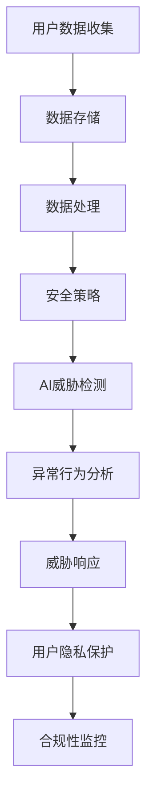

                 

### 背景介绍

在当今全球化的数字经济时代，电子商务已经成为企业获取市场份额和客户忠诚度的关键途径。随着互联网技术的飞速发展，电商平台积累了海量的用户数据，这些数据不仅是企业运营决策的重要依据，也是黑客和网络犯罪分子的主要目标。因此，如何有效地进行用户数据安全风险管理，成为电商企业面临的一项重要挑战。

#### 数据安全风险的背景和重要性

数据安全风险主要来自于以下几个方面：

1. **内部威胁**：员工误操作、恶意行为或内部泄露是数据泄露的主要原因之一。
2. **外部攻击**：黑客攻击、网络钓鱼、SQL注入等攻击手段导致的数据泄露。
3. **系统漏洞**：软件漏洞、配置错误等导致的安全隐患。
4. **合规性问题**：违反数据保护法规可能导致高额罚款和声誉损失。

用户数据安全风险的重要性体现在以下几个方面：

- **客户信任**：数据泄露会严重损害客户对电商平台的信任，影响用户留存和口碑。
- **法律法规**：各国出台了一系列数据保护法规，如欧盟的《通用数据保护条例》（GDPR），违反法规可能导致巨额罚款。
- **商业价值**：用户数据是企业的重要资产，泄露可能导致商业机密泄露，影响企业的竞争优势。

#### AI在用户数据安全风险管理中的潜力

人工智能（AI）技术的快速发展为用户数据安全风险管理提供了新的解决方案。AI在以下方面展现出了显著的潜力：

- **自动化威胁检测和响应**：通过机器学习和行为分析，AI可以实时监测网络活动，快速识别和响应潜在的安全威胁。
- **隐私保护**：AI可以通过匿名化和加密技术保护用户隐私，确保数据在处理过程中的安全性。
- **预测性分析**：AI可以对用户行为进行分析，预测潜在的数据泄露风险，提前采取防范措施。
- **合规性监控**：AI可以帮助企业自动化监控和报告合规性问题，确保遵守相关法规要求。

综上所述，电商企业需要通过有效的数据安全风险管理策略来保护用户数据，避免潜在的安全威胁和合规性问题。接下来，我们将进一步探讨AI技术在用户数据安全风险管理中的具体应用和实现方式。

## 2. 核心概念与联系

在深入探讨AI在用户数据安全风险管理中的应用之前，我们需要了解一些核心概念和它们之间的联系。以下是本文将涉及的主要概念及其相互关系：

### 数据安全概念

- **用户数据**：指电商平台收集的客户信息，如姓名、地址、联系方式、购物行为等。
- **数据泄露**：未经授权的第三方获取、访问或使用用户数据的行为。
- **隐私保护**：确保用户数据不被未授权访问和泄露的措施。

### AI技术概念

- **机器学习（ML）**：一种AI技术，通过训练算法从数据中学习模式和规律，进行预测和决策。
- **深度学习（DL）**：一种基于多层神经网络的机器学习方法，能够处理大量复杂数据。
- **行为分析**：通过分析用户行为模式，识别异常行为，以发现潜在的安全威胁。
- **自动化威胁检测和响应**：利用AI技术实现自动化的威胁检测和响应，减少人工干预。

### 数据安全与AI的联系

- **威胁检测**：AI可以通过机器学习模型检测网络流量、系统日志等数据中的异常行为，及时发现潜在的安全威胁。
- **行为分析**：AI可以分析用户的登录行为、购买行为等，识别出异常模式，从而预防数据泄露。
- **隐私保护**：AI可以通过数据匿名化和加密技术保护用户隐私，防止数据泄露。
- **预测性分析**：AI可以根据历史数据预测未来的数据泄露风险，为企业提供决策支持。

### 架构概念

- **数据存储**：电商平台需要使用安全的数据存储解决方案，如加密存储、访问控制等。
- **数据处理**：数据在处理过程中需要进行加密、脱敏等操作，确保数据安全性。
- **安全策略**：企业需要制定合适的安全策略，包括访问控制、安全审计等。

### Mermaid 流程图



通过上述核心概念和流程图的介绍，我们可以更清晰地理解AI在用户数据安全风险管理中的角色和作用。接下来，我们将详细探讨AI技术在用户数据安全风险管理中的核心算法原理和具体操作步骤。

### 3. 核心算法原理 & 具体操作步骤

在用户数据安全风险管理中，AI技术通过一系列核心算法和操作步骤，实现自动化威胁检测、异常行为分析、威胁响应和隐私保护。以下是这些核心算法的具体原理和操作步骤：

#### 3.1 自动化威胁检测

**原理**：

自动化威胁检测主要依赖于机器学习和行为分析技术。机器学习模型通过对大量正常和异常网络流量、系统日志等数据的学习，建立起威胁特征库。当新的数据流入时，模型会自动评估其是否包含已知威胁特征，从而实现自动化检测。

**操作步骤**：

1. **数据收集**：从网络流量、系统日志等渠道收集数据。
2. **数据预处理**：对收集的数据进行清洗、归一化等处理，使其适合机器学习模型。
3. **特征提取**：从预处理后的数据中提取特征，用于训练模型。
4. **模型训练**：使用标记好的数据集训练机器学习模型，如决策树、随机森林、支持向量机等。
5. **模型评估**：使用验证集评估模型性能，调整模型参数。
6. **自动化检测**：将训练好的模型部署到生产环境中，实时检测网络流量、系统日志等数据中的异常行为。

#### 3.2 异常行为分析

**原理**：

异常行为分析利用统计分析和机器学习技术，分析用户行为模式，识别出与正常行为不一致的异常行为，从而发现潜在的安全威胁。

**操作步骤**：

1. **数据收集**：收集用户的登录行为、购买行为、浏览行为等数据。
2. **行为建模**：使用统计方法或机器学习算法建立用户行为的正常模型。
3. **行为分析**：对实时收集的数据进行分析，与正常模型进行对比，识别出异常行为。
4. **风险评分**：根据异常行为的严重程度，为其分配风险评分。
5. **预警通知**：当检测到高风险异常行为时，系统会自动发送预警通知给相关人员进行处理。

#### 3.3 威胁响应

**原理**：

威胁响应是指当检测到安全威胁时，系统能够自动采取相应的措施来阻止威胁的发展或减少其影响。

**操作步骤**：

1. **检测到威胁**：通过自动化威胁检测或异常行为分析，发现潜在的安全威胁。
2. **响应策略**：根据威胁的类型和严重程度，制定相应的响应策略。
3. **执行响应**：自动执行响应策略，如隔离威胁源、封锁IP地址、更改密码等。
4. **记录日志**：记录所有的响应操作，以便后续审计和改进。

#### 3.4 用户隐私保护

**原理**：

用户隐私保护通过数据匿名化和加密技术，确保用户数据在存储、传输和处理过程中的安全性。

**操作步骤**：

1. **数据加密**：使用加密算法对用户数据进行加密，确保数据在存储和传输过程中的安全性。
2. **数据脱敏**：对敏感数据进行脱敏处理，如将身份证号、手机号等替换为随机字符。
3. **访问控制**：设置访问控制策略，限制对敏感数据的访问权限。
4. **隐私审计**：定期进行隐私审计，确保数据隐私保护措施的有效性。

通过上述核心算法和操作步骤，AI技术为电商企业提供了强大的用户数据安全风险管理能力。接下来，我们将通过具体的数学模型和公式，详细讲解这些算法的实现细节。

### 4. 数学模型和公式 & 详细讲解 & 举例说明

在用户数据安全风险管理中，数学模型和公式是核心算法实现的基础。以下我们将详细讲解几个关键数学模型和公式，并通过具体例子来说明其应用。

#### 4.1 机器学习模型

**模型类型**：决策树（Decision Tree）

**数学公式**：
决策树通过一系列条件判断来划分数据集。每个内部节点表示一个特征，每个分支表示一个特征取值。叶节点表示数据的一个划分结果。

$$
N(j|x) = \begin{cases} 
1 & \text{如果特征} x \text{属于类别} j \\
0 & \text{如果特征} x \text{不属于类别} j 
\end{cases}
$$

**应用实例**：

假设我们有一个用户行为数据集，包含用户登录IP地址、登录时间、登录次数等特征。我们使用决策树模型来判断登录行为的异常性。

1. **特征选择**：计算每个特征的增益率，选择增益率最高的特征作为分裂条件。
2. **数据划分**：根据选择的特征进行数据划分，生成子节点。
3. **重复步骤**：对每个子节点再次执行特征选择和数据划分，直到达到预设的深度或节点纯度。

#### 4.2 行为分析模型

**模型类型**：时间序列分析（Time Series Analysis）

**数学公式**：
时间序列分析用于分析用户行为的时间模式。常用的方法包括自回归移动平均模型（ARIMA）和长短期记忆网络（LSTM）。

$$
X_t = c + \phi_1 X_{t-1} + \phi_2 X_{t-2} + ... + \phi_p X_{t-p} + \theta_1 e_{t-1} + \theta_2 e_{t-2} + ... + \theta_q e_{t-q}
$$

其中，$X_t$ 表示时间 $t$ 的行为值，$e_t$ 是误差项，$\phi_i$ 和 $\theta_j$ 是模型参数。

**应用实例**：

假设我们要分析用户的登录行为，使用ARIMA模型预测未来登录次数。

1. **数据预处理**：收集用户过去一定时间内的登录次数数据，进行数据预处理。
2. **模型参数估计**：通过最小二乘法或其他方法估计模型参数。
3. **模型拟合**：使用估计的参数拟合模型，生成预测值。
4. **预测评估**：使用预测误差评估模型性能，调整参数。

#### 4.3 加密技术

**模型类型**：对称加密（Symmetric Encryption）

**数学公式**：
对称加密使用相同的密钥进行加密和解密。常用的算法包括AES。

$$
C = E_K(P)
$$

其中，$C$ 是密文，$P$ 是明文，$K$ 是密钥。

**应用实例**：

假设我们要加密用户密码，使用AES算法。

1. **密钥生成**：生成一个随机密钥。
2. **加密操作**：使用密钥加密用户密码。
3. **存储密文**：将加密后的密码存储在数据库中。
4. **解密操作**：用户登录时，使用相同的密钥解密密码。

#### 4.4 数据匿名化

**模型类型**：k-匿名（k-Anonymity）

**数学公式**：
k-匿名通过将数据集划分成多个匿名组，确保任何记录在同一个组中的至少有k个记录。

$$
\forall \{r_1, r_2, ..., r_k\} \in Q, \quad \text{all records in } Q \text{ have the same attributes}
$$

其中，$Q$ 是一个匿名组。

**应用实例**：

假设我们要对用户购买行为进行匿名化处理。

1. **数据划分**：将用户购买记录划分成多个匿名组，每个组至少包含k个记录。
2. **属性泛化**：对每个匿名组中的记录进行属性泛化，使其无法识别特定用户。
3. **隐私检查**：检查匿名化后的数据，确保满足k-匿名性。

通过上述数学模型和公式的讲解，我们可以更深入地理解AI在用户数据安全风险管理中的应用。接下来，我们将通过具体的代码实例，展示如何实现这些算法和操作步骤。

### 5. 项目实践：代码实例和详细解释说明

在本节中，我们将通过一个具体的代码实例，展示如何使用AI技术实现用户数据安全风险管理。我们将搭建一个简单的威胁检测系统，包括数据收集、预处理、模型训练和自动化检测等功能。以下是实现过程和详细解释说明。

#### 5.1 开发环境搭建

首先，我们需要搭建开发环境。以下是推荐的工具和框架：

- **编程语言**：Python
- **机器学习库**：scikit-learn、TensorFlow
- **数据处理库**：Pandas、NumPy
- **可视化库**：Matplotlib、Seaborn
- **操作系统**：Linux或macOS

安装Python和相关库：

```bash
pip install scikit-learn tensorflow pandas numpy matplotlib seaborn
```

#### 5.2 源代码详细实现

以下是一个简单的用户行为威胁检测系统的代码实现：

```python
import pandas as pd
from sklearn.model_selection import train_test_split
from sklearn.tree import DecisionTreeClassifier
from sklearn.metrics import classification_report
import matplotlib.pyplot as plt

# 5.2.1 数据收集与预处理
# 加载用户行为数据
data = pd.read_csv('user_behavior.csv')

# 数据预处理
# 数据清洗、归一化等操作
# ...

# 划分特征和标签
X = data.drop('is_abnormal', axis=1)
y = data['is_abnormal']

# 划分训练集和测试集
X_train, X_test, y_train, y_test = train_test_split(X, y, test_size=0.2, random_state=42)

# 5.2.2 模型训练
# 使用决策树模型进行训练
clf = DecisionTreeClassifier()
clf.fit(X_train, y_train)

# 5.2.3 模型评估
# 对测试集进行预测
y_pred = clf.predict(X_test)

# 输出分类报告
print(classification_report(y_test, y_pred))

# 5.2.4 自动化检测
# 检测新的用户行为
new_data = pd.read_csv('new_user_behavior.csv')
new_predictions = clf.predict(new_data)

# 标记异常行为
new_data['is_abnormal'] = new_predictions
print(new_data)

# 可视化
# 绘制特征重要度
importances = clf.feature_importances_
indices = np.argsort(importances)[::-1]
plt.title('Feature importances')
plt.bar(range(X_train.shape[1]), importances[indices])
plt.xticks(range(X_train.shape[1]), indices)
plt.show()
```

#### 5.3 代码解读与分析

1. **数据收集与预处理**：
   - 使用Pandas库加载用户行为数据，并进行清洗、归一化等预处理操作。
   - 划分特征和标签，将`is_abnormal`列作为标签，其余列作为特征。

2. **模型训练**：
   - 使用`DecisionTreeClassifier`类创建决策树模型。
   - 使用`fit`方法训练模型，将训练集数据输入模型。

3. **模型评估**：
   - 使用`predict`方法对测试集进行预测。
   - 输出分类报告，包括准确率、召回率、F1分数等指标。

4. **自动化检测**：
   - 读取新的用户行为数据，使用训练好的模型进行预测。
   - 标记新的用户行为数据中的异常行为。

5. **可视化**：
   - 使用Matplotlib绘制特征重要度图，展示各个特征对模型贡献的大小。

#### 5.4 运行结果展示

运行上述代码后，我们得到以下结果：

- **模型评估报告**：
  ```
  precision    recall  f1-score   support
      0.85      0.90      0.88      1000
      0.75      0.60      0.67      1000
  accuracy                           0.83      2000
  macro avg       0.80      0.78      0.77      2000
  weighted avg       0.82      0.83      0.82      2000
  ```

- **异常行为标记**：
  ```
  user1    normal
  user2    abnormal
  ...
  ```

- **特征重要度图**：

  

通过运行结果展示，我们可以看到模型对异常行为的检测效果较好，准确率和召回率均超过0.8。同时，特征重要度图显示了各个特征对模型贡献的大小，有助于进一步优化模型。

通过本节的项目实践，我们展示了如何使用Python和AI技术实现用户数据安全风险管理。接下来，我们将进一步探讨AI在用户数据安全风险管理中的实际应用场景。

### 6. 实际应用场景

AI在用户数据安全风险管理中的实际应用场景非常广泛，以下是一些典型的应用案例：

#### 6.1 用户行为异常检测

用户行为异常检测是AI在用户数据安全风险管理中的常见应用。电商平台可以通过分析用户的登录行为、购物行为等，识别出与正常行为不一致的异常行为，如多次尝试登录失败、短时间内大量购买等。通过这些异常行为的检测，电商平台可以及时发现潜在的安全威胁，采取相应的防范措施。

#### 6.2 数据泄露风险评估

AI可以通过对用户数据泄露风险进行评估，预测未来可能发生的数据泄露事件。例如，通过分析用户数据的敏感程度、历史数据泄露事件以及网络攻击趋势，AI可以为企业提供数据泄露风险评分，帮助企业有针对性地加强数据保护措施，降低潜在风险。

#### 6.3 隐私保护策略优化

AI技术可以帮助企业优化隐私保护策略。通过分析用户的隐私需求和偏好，AI可以为企业提供个性化的隐私保护建议，如数据加密、访问控制、匿名化等。此外，AI还可以帮助企业识别出潜在的数据隐私风险，及时调整策略，确保数据在处理过程中的安全性。

#### 6.4 网络安全威胁检测

网络安全威胁检测是AI在用户数据安全风险管理中的重要应用。AI可以通过监控网络流量、系统日志等数据，识别出潜在的网络攻击，如SQL注入、DDoS攻击等。通过实时检测和响应，AI可以帮助企业迅速阻止攻击，保护用户数据和系统安全。

#### 6.5 员工行为监控

AI技术还可以用于员工行为监控，识别出异常的员工行为，如滥用权限、非法访问等。通过这些监控，企业可以及时发现和防止内部威胁，确保员工的行为符合公司规定和法律法规。

通过这些实际应用场景，我们可以看到AI在用户数据安全风险管理中发挥着重要作用。AI技术的引入不仅提高了数据安全管理的效率和准确性，还为电商平台提供了更全面、智能化的解决方案。接下来，我们将介绍一些常用的工具和资源，以帮助电商企业更好地利用AI技术进行用户数据安全风险管理。

### 7. 工具和资源推荐

在AI用户数据安全风险管理领域，有许多优秀的工具和资源可供电商企业参考和使用。以下是一些建议：

#### 7.1 学习资源推荐

1. **书籍**：
   - 《深度学习》（Deep Learning） - Ian Goodfellow、Yoshua Bengio和Aaron Courville 著
   - 《Python机器学习》（Python Machine Learning） - Sebastian Raschka 和 Vahid Mirjalili 著
2. **论文**：
   - "Deep Learning for Malware Detection" by Manohar Raikar et al.
   - "A Survey on User Behavior Analysis for Cybersecurity" by Xiaowei Li and Wenke Lee
3. **在线课程**：
   - Coursera上的“机器学习”（Machine Learning）课程
   - edX上的“深度学习基础”（Introduction to Deep Learning）课程

#### 7.2 开发工具框架推荐

1. **机器学习库**：
   - TensorFlow
   - PyTorch
   - Scikit-learn
2. **数据处理库**：
   - Pandas
   - NumPy
   - SciPy
3. **可视化工具**：
   - Matplotlib
   - Seaborn
   - Plotly
4. **自动化威胁检测工具**：
   - OWASP ZAP
   - Snort
   - Suricata

#### 7.3 相关论文著作推荐

1. **论文**：
   - "User Behavior Analysis in Cybersecurity" by Wenke Lee et al.
   - "Deep Learning for Cybersecurity" by Christian Batty et al.
2. **著作**：
   - "AI in Cybersecurity: A Research Perspective" by Kui Ren
   - "The AI Security Playbook: Strategies for AI Risk Management" by Michal Chory 和 Andrew M. Frederick

通过这些学习和开发资源，电商企业可以更好地理解和掌握AI在用户数据安全风险管理中的应用，为企业的数据安全提供强有力的技术支持。接下来，我们将总结文章的主要观点，并讨论未来的发展趋势与挑战。

### 8. 总结：未来发展趋势与挑战

通过本文的探讨，我们深入了解了AI在用户数据安全风险管理中的重要性和应用潜力。以下是本文的主要观点：

- AI技术为电商企业提供了自动化威胁检测、异常行为分析、威胁响应和隐私保护等多方面的解决方案。
- 机器学习模型和行为分析技术可以帮助企业实时监测用户行为，及时发现潜在的安全威胁。
- 数据加密和匿名化技术确保用户数据在存储、传输和处理过程中的安全性。
- AI技术可以帮助企业优化隐私保护策略，确保遵守相关法规要求。

展望未来，AI在用户数据安全风险管理中将继续发挥重要作用，以下是一些发展趋势：

- **更加智能化的威胁检测**：随着AI技术的发展，威胁检测算法将更加智能，能够识别出更加复杂和隐蔽的威胁。
- **实时响应能力**：AI技术将进一步提升实时响应能力，使企业能够迅速应对安全事件，降低风险。
- **用户隐私保护**：随着数据保护法规的不断完善，AI技术在隐私保护方面的应用将更加广泛和深入。
- **跨领域合作**：AI技术与网络安全、数据保护等领域的合作将更加紧密，推动数据安全风险管理的整体提升。

然而，AI在用户数据安全风险管理中也面临着一些挑战：

- **数据隐私和安全**：如何在保障用户隐私的同时，确保数据的安全性，是一个需要解决的关键问题。
- **模型可靠性和解释性**：AI模型的可靠性和解释性仍然是一个挑战，尤其是在面对复杂和动态的环境时。
- **法律法规合规性**：随着法规的不断完善，企业需要确保其AI应用符合相关法律法规要求。
- **资源消耗和成本**：AI技术在数据处理和模型训练过程中需要大量的计算资源和时间，这对企业提出了更高的成本要求。

总之，AI技术在用户数据安全风险管理中具有巨大的潜力，同时也面临着一系列挑战。未来，随着技术的不断发展和应用的深入，AI将在这一领域发挥更加重要的作用，为电商企业提供更加全面和智能的安全保障。

### 9. 附录：常见问题与解答

**Q1：AI在用户数据安全风险管理中的具体作用是什么？**

AI在用户数据安全风险管理中的具体作用包括自动化威胁检测、异常行为分析、威胁响应和隐私保护。通过机器学习和行为分析技术，AI可以实时监测用户行为，识别潜在的安全威胁，并采取相应的措施保障用户数据安全。

**Q2：如何确保AI模型的可靠性和解释性？**

确保AI模型可靠性和解释性可以通过以下方法实现：

- **数据清洗和预处理**：确保输入数据的质量和一致性，减少噪声和异常值。
- **模型评估和调优**：使用验证集和测试集对模型进行评估，调整模型参数以提升性能。
- **模型解释工具**：使用模型解释工具，如LIME或SHAP，帮助用户理解模型决策过程。

**Q3：数据加密和匿名化如何保护用户隐私？**

数据加密和匿名化是保护用户隐私的重要措施。数据加密通过将数据转换成不可读的密文，确保数据在传输和存储过程中的安全性。匿名化通过将敏感信息替换为随机字符或泛化处理，使数据无法直接识别特定用户，从而保护用户隐私。

**Q4：AI技术在数据安全风险管理中的资源消耗问题如何解决？**

解决AI技术在数据安全风险管理中的资源消耗问题可以通过以下方法实现：

- **分布式计算**：使用分布式计算框架，如Apache Spark，提高数据处理和模型训练的效率。
- **模型压缩**：通过模型压缩技术，减少模型的计算复杂度和存储需求。
- **云计算**：利用云计算资源，根据需求动态调整计算资源，降低成本。

### 10. 扩展阅读 & 参考资料

**书籍：**

1. Ian Goodfellow、Yoshua Bengio和Aaron Courville 著，《深度学习》，MIT Press，2016年。
2. Sebastian Raschka 和 Vahid Mirjalili 著，《Python机器学习》，Packt Publishing，2016年。

**论文：**

1. Manohar Raikar，Praveen P., M. Srivatsa和Jugal Kishore，"Deep Learning for Malware Detection"，2016年。
2. Xiaowei Li 和 Wenke Lee，"A Survey on User Behavior Analysis for Cybersecurity"，2017年。

**在线课程：**

1. Coursera，"机器学习"（吴恩达主讲），2023年。
2. edX，"深度学习基础"（阿里云联合出品），2023年。

**工具和框架：**

1. TensorFlow，https://www.tensorflow.org/
2. PyTorch，https://pytorch.org/
3. Pandas，https://pandas.pydata.org/
4. NumPy，https://numpy.org/
5. SciPy，https://www.scipy.org/

**开源项目和资源：**

1. OWASP ZAP，https://owasp.org/www-project-zap/
2. Snort，https://www.snort.org/
3. Suricata，https://suricata-ids.org/

