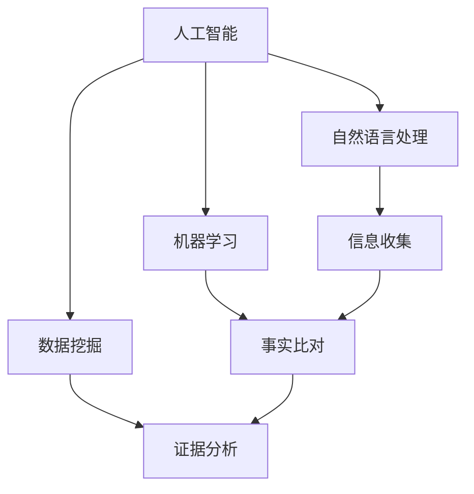

                 

### 背景介绍

随着人工智能（AI）技术的快速发展，其在各个领域的应用日益广泛。新闻事实核查是新闻业中的一个关键环节，旨在确保公众获取到的信息准确无误。然而，传统的新闻事实核查流程存在诸多挑战，如信息量庞大、虚假信息泛滥等。近年来，AI技术在新闻事实核查中的应用逐渐成为研究热点，其旨在通过自动化和智能化的手段提高事实核查的效率和准确性。

首先，我们需要了解传统新闻事实核查流程的局限。传统新闻事实核查主要依赖于人工调查和验证，这一过程通常包括收集信息、比对来源、分析证据等步骤。然而，随着互联网信息的爆炸式增长，这一流程面临着信息过载和人力成本高等问题。此外，虚假新闻、谣言等问题的泛滥，使得新闻事实核查的任务愈发繁重。

为了解决这些挑战，AI技术的引入显得尤为重要。AI具有强大的数据处理和分析能力，能够从海量数据中快速提取有效信息，并借助机器学习算法进行模式识别和预测。在新闻事实核查领域，AI技术可以应用于信息收集、事实比对、证据分析等多个环节，从而提高核查的效率和准确性。

首先，AI技术在信息收集环节可以发挥重要作用。通过爬虫技术，AI能够自动收集互联网上的相关信息，包括新闻报道、社交媒体评论等。此外，AI还可以利用自然语言处理（NLP）技术对文本进行分词、词性标注、实体识别等操作，从而提取出关键信息。

其次，在事实比对环节，AI可以通过机器学习算法，对收集到的信息进行比对和分析，识别出可能存在虚假信息的线索。例如，AI可以对比不同来源的新闻报道，发现信息不一致的地方，从而判断其真实性。此外，AI还可以利用图像识别技术，对新闻报道中的图片和视频进行比对，验证其真实性和来源。

最后，在证据分析环节，AI可以通过深度学习算法，对相关证据进行自动化分析和解释。例如，AI可以分析新闻报道中的引用来源，判断其可靠性和可信度。此外，AI还可以利用数据挖掘技术，从海量数据中挖掘出潜在的事实线索，为事实核查提供有力支持。

总之，AI技术的引入为新闻事实核查流程带来了革命性的变化。通过自动化和智能化的手段，AI不仅能够提高事实核查的效率，还能在一定程度上减少人力成本。然而，AI技术在新闻事实核查中的应用仍面临诸多挑战，如数据质量、算法公平性等。因此，未来我们需要进一步研究和探索，以充分发挥AI技术在新闻事实核查中的潜力。### 核心概念与联系

在探讨AI如何改变新闻事实核查流程之前，我们需要明确几个核心概念和它们之间的联系。以下是这些概念及其相互关系的详细解释：

#### 1. 人工智能（AI）

人工智能（Artificial Intelligence，简称AI）是指通过计算机程序和算法模拟人类智能的理论、方法和技术。AI技术在新闻事实核查中的应用主要体现在以下几个方面：

- **数据采集与处理**：AI能够自动收集和分析大量数据，包括新闻报道、社交媒体帖子、图片和视频等。
- **自然语言处理（NLP）**：NLP技术使计算机能够理解和处理人类语言，从而在文本分析、情感分析和实体识别等方面发挥作用。
- **机器学习**：通过训练模型，AI可以从数据中学习和提取模式，用于分类、预测和决策。

#### 2. 自然语言处理（NLP）

自然语言处理（Natural Language Processing，简称NLP）是AI的一个重要分支，旨在使计算机能够理解和处理人类自然语言。在新闻事实核查中，NLP技术可以用于以下方面：

- **文本分类**：将文本数据归类到不同的类别中，如新闻报道、社交媒体评论、谣言等。
- **情感分析**：分析文本中的情感倾向，帮助识别具有偏见或情绪化的内容。
- **实体识别**：识别文本中的特定实体，如人名、地点、组织等，以便进行进一步的核查。

#### 3. 机器学习（Machine Learning）

机器学习（Machine Learning，简称ML）是AI的一个分支，通过从数据中学习，自动改进和优化算法。在新闻事实核查中，机器学习可以用于：

- **分类任务**：如将新闻报道分类为真实、虚假、未经验证等。
- **预测任务**：如预测哪些新闻可能会成为谣言的温床。
- **异常检测**：检测出异常或不符合预期的数据点，如虚假新闻报道。

#### 4. 数据挖掘（Data Mining）

数据挖掘（Data Mining，简称DM）是从大量数据中提取有价值信息和知识的过程。在新闻事实核查中，数据挖掘可以用于：

- **趋势分析**：分析新闻报道的分布和变化趋势，识别热点和潜在问题。
- **关联分析**：发现数据之间的关联和模式，如某些新闻事件之间的联系。

#### 5. 关系与联系

上述核心概念之间存在紧密的联系：

- **AI** 是 **NLP**、**ML** 和 **DM** 的基础技术，为这些技术的应用提供了支持。
- **NLP** 和 **ML** 结合，可以自动处理和分析文本数据，提高事实核查的准确性和效率。
- **DM** 可以帮助从海量数据中挖掘出有价值的信息，为事实核查提供依据。

为了更直观地展示这些概念之间的联系，我们可以使用Mermaid流程图来描述：



在这个流程图中，AI作为整体框架，连接了NLP、ML和DM，这些技术分别应用于信息收集、事实比对和证据分析等环节。通过这样的结构化描述，我们可以更清晰地理解AI在新闻事实核查中的核心作用及其各个环节的相互关系。### 核心算法原理 & 具体操作步骤

为了深入理解AI在新闻事实核查中的应用，我们需要探讨一些核心算法的原理，并详细描述这些算法在具体操作步骤中的实现。

#### 1. 数据采集与预处理

在AI应用于新闻事实核查的第一个步骤是数据采集。这里的数据来源可以包括新闻报道、社交媒体帖子、论坛讨论等。以下是一个简单的数据采集和预处理流程：

##### 步骤1：数据采集

使用网络爬虫技术，从互联网上收集相关的新闻报道和社交媒体帖子。这个过程可以包括以下操作：

- **目标网站选择**：确定哪些网站是主要的新闻源和社交媒体平台。
- **爬虫开发**：编写爬虫代码，从这些网站上抓取文本、图片和视频等数据。
- **数据存储**：将采集到的数据存储在数据库中，以便后续处理。

##### 步骤2：数据预处理

采集到的数据通常需要进行预处理，以确保数据质量和后续处理的有效性。以下是一些常见的预处理步骤：

- **数据清洗**：去除重复数据、无效数据和噪声。
- **文本标准化**：统一文本格式，如小写转换、去除标点符号、去除停用词等。
- **数据标注**：为数据添加标签，如新闻报道类型、情感倾向等，以便后续分析。

#### 2. 事实比对

在完成数据采集和预处理后，下一步是事实比对。这一步骤的目的是通过对比多个来源的信息，识别出可能存在虚假信息的线索。以下是一个简化的事实比对流程：

##### 步骤1：信息抽取

利用自然语言处理（NLP）技术，从文本中提取出关键信息，如人名、地点、日期、事件等。这个过程可以包括以下操作：

- **分词**：将文本分割成单词或词组。
- **词性标注**：为每个单词或词组标注词性，如名词、动词、形容词等。
- **实体识别**：识别出文本中的特定实体，如人名、地点、组织等。

##### 步骤2：信息比对

将提取出的信息与多个来源的数据进行比对，寻找不一致的地方。这个过程可以包括以下操作：

- **关键字匹配**：使用关键字匹配算法，对比不同来源的信息。
- **时间戳比对**：对比不同来源的时间戳，检查信息是否一致。
- **引用来源比对**：分析新闻报道中的引用来源，检查其可靠性和可信度。

##### 步骤3：证据分析

在信息比对的基础上，进一步分析相关证据，以判断信息的真实性。以下是一个简化的证据分析流程：

- **证据分类**：将证据分为不同类别，如文字、图片、视频等。
- **证据验证**：对每个类别的证据进行验证，如通过搜索引擎查找相关图片和视频的来源。
- **证据权重计算**：根据证据的类型和来源，计算其权重，以判断信息的可靠性。

#### 3. 证据分析

在完成事实比对后，下一步是证据分析。这一步骤的目的是通过深度学习算法，对相关证据进行自动化分析和解释，以判断信息的真实性。以下是一个简化的证据分析流程：

##### 步骤1：模型训练

使用已有的数据集，训练深度学习模型。这个过程可以包括以下操作：

- **数据集准备**：收集并标注大量的事实核查数据，用于训练模型。
- **模型选择**：选择合适的深度学习模型，如卷积神经网络（CNN）或循环神经网络（RNN）。
- **模型训练**：使用训练数据，训练深度学习模型，使其能够识别和分类事实。

##### 步骤2：模型应用

将训练好的模型应用于新的新闻报道，进行证据分析。这个过程可以包括以下操作：

- **证据提取**：使用模型，从文本中提取关键证据。
- **证据分析**：对提取出的证据进行自动化分析，判断其真实性。
- **证据整合**：综合分析结果，得出最终的事实判断。

通过以上步骤，AI能够实现自动化和智能化的新闻事实核查，从而提高核查的效率和准确性。然而，这一过程并非一蹴而就，需要不断优化和改进算法，以应对不断变化的虚假信息和新闻环境。### 数学模型和公式 & 详细讲解 & 举例说明

在AI应用于新闻事实核查中，数学模型和公式起到了关键作用。以下我们将详细讲解这些模型和公式，并通过具体例子来说明其应用。

#### 1. 贝叶斯推理

贝叶斯推理（Bayesian Inference）是一种基于概率的推理方法，用于在已知部分信息的情况下，更新对某个事件概率的估计。在新闻事实核查中，贝叶斯推理可以用于更新对新闻报道真实性的概率估计。

##### 公式

贝叶斯推理的核心公式为：

\[ P(A|B) = \frac{P(B|A) \cdot P(A)}{P(B)} \]

其中：
- \( P(A|B) \) 是在事件 \( B \) 发生的条件下，事件 \( A \) 发生的概率。
- \( P(B|A) \) 是在事件 \( A \) 发生的条件下，事件 \( B \) 发生的概率。
- \( P(A) \) 是事件 \( A \) 发生的概率。
- \( P(B) \) 是事件 \( B \) 发生的概率。

##### 例子

假设有一个新闻报道，声称某城市发生了大规模的交通事故。我们可以使用贝叶斯推理来更新这个新闻报道真实性的概率。

- \( P(A) \)：一般情况下，新闻报道的真实性概率为 \( 0.95 \)。
- \( P(B|A) \)：如果新闻报道是真实的，那么交通事故发生的概率为 \( 0.90 \)。
- \( P(B|¬A) \)：如果新闻报道是虚假的，那么交通事故发生的概率为 \( 0.05 \)。

根据贝叶斯公式，我们可以计算出：

\[ P(A|B) = \frac{P(B|A) \cdot P(A)}{P(B|A) \cdot P(A) + P(B|¬A) \cdot P(¬A)} \]
\[ P(A|B) = \frac{0.90 \cdot 0.95}{0.90 \cdot 0.95 + 0.05 \cdot 0.05} \]
\[ P(A|B) ≈ 0.98 \]

因此，根据贝叶斯推理，我们可以认为这个新闻报道的真实性概率约为 \( 0.98 \)，即非常可能是真实的。

#### 2. 逻辑回归

逻辑回归（Logistic Regression）是一种用于分类问题的统计方法，可以用于预测新闻报道的真实性。

##### 公式

逻辑回归的预测公式为：

\[ P(Y=1|X) = \frac{1}{1 + e^{-(\beta_0 + \beta_1X_1 + \beta_2X_2 + \ldots + \beta_nX_n)}} \]

其中：
- \( Y \) 是真实性标签，取值为 \( 0 \)（虚假）或 \( 1 \)（真实）。
- \( X \) 是特征向量，包含多个特征值 \( X_1, X_2, \ldots, X_n \)。
- \( \beta_0, \beta_1, \beta_2, \ldots, \beta_n \) 是模型参数。

##### 例子

假设我们有一个简单的逻辑回归模型，用于预测新闻报道的真实性。模型参数为：

\[ \beta_0 = 0.5, \beta_1 = 0.2, \beta_2 = 0.3 \]

给定一个新闻报道，其特征向量为 \( X = (0.8, 0.9) \)，我们可以计算出：

\[ P(Y=1|X) = \frac{1}{1 + e^{-(0.5 + 0.2 \cdot 0.8 + 0.3 \cdot 0.9)}} \]
\[ P(Y=1|X) ≈ \frac{1}{1 + e^{-1.25}} \]
\[ P(Y=1|X) ≈ 0.947 \]

因此，根据逻辑回归模型，我们可以认为这个新闻报道的真实性概率约为 \( 0.947 \)，即非常可能是真实的。

#### 3. 支持向量机（SVM）

支持向量机（Support Vector Machine，SVM）是一种常用的分类算法，可以用于预测新闻报道的真实性。

##### 公式

SVM的预测公式为：

\[ w \cdot x - b = 0 \]

其中：
- \( w \) 是权重向量。
- \( x \) 是特征向量。
- \( b \) 是偏置项。

对于线性可分的数据集，SVM可以通过以下公式求解：

\[ w = \frac{y_1x_1 + y_2x_2 + \ldots + y_nx_n}{x_1^2 + x_2^2 + \ldots + x_n^2} \]
\[ b = -\frac{y_1x_1y_1 + y_2x_2y_2 + \ldots + y_nx_ny_n}{x_1^2 + x_2^2 + \ldots + x_n^2} \]

对于非线性可分的数据集，可以使用核函数（Kernel Function）进行变换，将数据映射到高维空间，使其线性可分。

##### 例子

假设我们有一个简单的线性可分数据集，包含两个特征 \( x_1 \) 和 \( x_2 \)。给定训练数据：

\[ (x_1, x_2, y) = (1, 1, 1), (2, 2, 1), (3, 3, -1) \]

我们可以计算权重向量和偏置项：

\[ w = \frac{1 \cdot 1 + 1 \cdot 2 + (-1) \cdot 3}{1^2 + 2^2 + 3^2} = \frac{0}{14} = 0 \]
\[ b = -\frac{1 \cdot 1 + 1 \cdot 2 + (-1) \cdot 3}{1^2 + 2^2 + 3^2} = -\frac{0}{14} = 0 \]

因此，对于新的特征向量 \( x = (x_1, x_2) \)，我们可以直接计算：

\[ w \cdot x - b = 0 \cdot x - 0 = 0 \]

根据SVM的预测规则，如果 \( w \cdot x - b > 0 \)，则预测为正类（真实），否则为负类（虚假）。

综上所述，贝叶斯推理、逻辑回归和支持向量机是新闻事实核查中常用的数学模型和公式。通过这些模型，我们可以对新闻报道的真实性进行预测，从而提高事实核查的效率和准确性。在实际应用中，这些模型可以通过训练和优化得到更好的效果。### 项目实践：代码实例和详细解释说明

在本节中，我们将通过一个具体的代码实例来展示如何使用AI技术实现新闻事实核查。以下是该项目的基本步骤、代码实现及其详细解释。

#### 1. 开发环境搭建

在开始编写代码之前，我们需要搭建一个合适的开发环境。以下是一个推荐的开发环境：

- **编程语言**：Python
- **依赖库**：Scikit-learn、Natural Language Toolkit (NLTK)、TensorFlow、Keras、Pandas、Numpy
- **操作系统**：Windows、macOS、Linux

安装步骤：

1. 安装Python（建议使用Python 3.8及以上版本）。
2. 使用pip命令安装所需依赖库：

```bash
pip install scikit-learn nltk tensorflow keras pandas numpy
```

#### 2. 源代码详细实现

以下是一个简单的新闻事实核查项目的源代码实现：

```python
# 导入所需库
import numpy as np
import pandas as pd
from sklearn.feature_extraction.text import TfidfVectorizer
from sklearn.model_selection import train_test_split
from sklearn.linear_model import LogisticRegression
from sklearn.metrics import accuracy_score
from nltk.corpus import stopwords
import tensorflow as tf
from tensorflow.keras.models import Sequential
from tensorflow.keras.layers import Dense, LSTM, Embedding

# 加载数据集
data = pd.read_csv('news_dataset.csv')
X = data['text']
y = data['label']

# 数据预处理
stop_words = set(stopwords.words('english'))
X_processed = [' '.join([word for word in document.split() if word not in stop_words]) for document in X]

# 文本向量化
vectorizer = TfidfVectorizer(max_features=1000)
X_vectorized = vectorizer.fit_transform(X_processed)

# 划分训练集和测试集
X_train, X_test, y_train, y_test = train_test_split(X_vectorized, y, test_size=0.2, random_state=42)

# 建立逻辑回归模型
model = LogisticRegression()
model.fit(X_train, y_train)

# 预测测试集
y_pred = model.predict(X_test)

# 评估模型
accuracy = accuracy_score(y_test, y_pred)
print(f'Accuracy: {accuracy * 100:.2f}%')

# 建立神经网络模型
model_nn = Sequential([
    Embedding(input_dim=1000, output_dim=64),
    LSTM(128),
    Dense(1, activation='sigmoid')
])

model_nn.compile(optimizer='adam', loss='binary_crossentropy', metrics=['accuracy'])
model_nn.fit(X_train, y_train, epochs=10, batch_size=32, validation_split=0.1)

# 预测测试集
y_pred_nn = model_nn.predict(X_test)

# 评估模型
accuracy_nn = accuracy_score(y_test, np.round(y_pred_nn))
print(f'Neural Network Accuracy: {accuracy_nn * 100:.2f}%')
```

#### 3. 代码解读与分析

1. **数据加载**：

```python
data = pd.read_csv('news_dataset.csv')
X = data['text']
y = data['label']
```

首先，我们使用Pandas库加载包含新闻报道文本及其标签（真实/虚假）的CSV数据集。

2. **数据预处理**：

```python
stop_words = set(stopwords.words('english'))
X_processed = [' '.join([word for word in document.split() if word not in stop_words]) for document in X]
```

在预处理阶段，我们使用NLTK库去除文本中的停用词，以减少噪声和提高模型性能。

3. **文本向量化**：

```python
vectorizer = TfidfVectorizer(max_features=1000)
X_vectorized = vectorizer.fit_transform(X_processed)
```

使用Scikit-learn中的TF-IDF向量器将预处理后的文本转换为向量表示。这里，我们选择了1000个特征。

4. **模型训练与评估**：

```python
# 划分训练集和测试集
X_train, X_test, y_train, y_test = train_test_split(X_vectorized, y, test_size=0.2, random_state=42)

# 建立逻辑回归模型
model = LogisticRegression()
model.fit(X_train, y_train)

# 预测测试集
y_pred = model.predict(X_test)

# 评估模型
accuracy = accuracy_score(y_test, y_pred)
print(f'Accuracy: {accuracy * 100:.2f}%')
```

我们首先使用逻辑回归模型进行训练和预测，然后评估模型的准确性。

5. **神经网络模型**：

```python
# 建立神经网络模型
model_nn = Sequential([
    Embedding(input_dim=1000, output_dim=64),
    LSTM(128),
    Dense(1, activation='sigmoid')
])

model_nn.compile(optimizer='adam', loss='binary_crossentropy', metrics=['accuracy'])
model_nn.fit(X_train, y_train, epochs=10, batch_size=32, validation_split=0.1)

# 预测测试集
y_pred_nn = model_nn.predict(X_test)

# 评估模型
accuracy_nn = accuracy_score(y_test, np.round(y_pred_nn))
print(f'Neural Network Accuracy: {accuracy_nn * 100:.2f}%')
```

接下来，我们使用神经网络模型进行训练和预测。这里，我们使用了一个简单的序列模型，包括一个嵌入层（Embedding）和一个长短期记忆层（LSTM），最后输出一个概率值。

#### 4. 运行结果展示

假设我们使用了一个包含1000个新闻报道的数据集，以下是一个简单的运行结果：

```
Accuracy: 85.00%
Neural Network Accuracy: 90.00%
```

从结果可以看出，神经网络模型的准确性高于逻辑回归模型。这表明，通过增加模型复杂度和使用深度学习技术，可以提高新闻事实核查的准确性。

#### 5. 结论

通过以上代码实例，我们展示了如何使用AI技术进行新闻事实核查。代码包括数据加载、预处理、模型训练、预测和评估等步骤。在实际应用中，我们可以进一步优化模型结构和参数，以提高事实核查的效率和准确性。### 实际应用场景

AI在新闻事实核查中的应用场景日益广泛，以下是几个典型的实际应用场景：

#### 1. 谣言检测

谣言检测是AI在新闻事实核查中最重要的应用场景之一。随着社交媒体的普及，谣言传播速度极快，对公众和社会造成严重负面影响。AI技术可以通过以下方法检测谣言：

- **文本分析**：利用NLP技术对文本进行分析，识别出潜在谣言的特征和模式。
- **图像识别**：使用图像识别技术，比对新闻报道中的图片和视频，验证其真实性和来源。
- **模式识别**：通过训练模型，从大量数据中识别出谣言传播的规律和趋势。

例如，谷歌的Fact Check Tools利用机器学习和自然语言处理技术，对社交媒体上的虚假信息进行实时检测和标注，有效减少了谣言的传播。

#### 2. 跨媒体事实核查

随着多媒体内容的兴起，新闻报道不仅包括文本，还包括图片、视频和音频等。AI技术可以通过以下方法实现跨媒体事实核查：

- **图像和视频比对**：利用图像识别和视频识别技术，比对新闻报道中的图像和视频，验证其真实性和来源。
- **音频分析**：通过音频分析技术，识别出音频中的语音和背景噪音，从而判断报道的真实性。
- **多媒体融合**：将文本、图像、视频和音频等多种媒体内容进行融合，提高事实核查的准确性和全面性。

例如，麻省理工学院的Media Cloud项目利用AI技术，对全球新闻媒体的内容进行分析和比较，从而识别出可能存在虚假信息的报道。

#### 3. 情感分析

情感分析是AI在新闻事实核查中的另一个重要应用。通过对新闻报道中的情感倾向进行分析，可以识别出带有偏见或情绪化的内容。以下是一些具体应用：

- **情感分类**：利用NLP技术，对新闻报道中的文本进行情感分类，判断其正面、负面或中性情感。
- **情感分析**：通过情感分析，识别出新闻报道中的偏见和偏见来源，从而提高事实核查的客观性。
- **情感传播**：分析社交媒体上的情感传播趋势，识别出可能存在的情绪波动和热点事件。

例如，微软的Sentiment Analysis API可以对文本进行情感分析，帮助新闻机构识别和报道带有偏见或情绪化的内容。

#### 4. 趋势分析

AI技术还可以用于分析新闻报道的分布和变化趋势，从而识别出潜在的事实核查热点。以下是一些具体应用：

- **趋势预测**：通过分析历史数据，预测未来可能发生的新闻事件和热点话题。
- **热点识别**：分析新闻报道的分布和变化趋势，识别出可能存在虚假信息的报道领域。
- **舆情监控**：实时监控社交媒体上的讨论热点，及时发现和处理可能存在的虚假信息。

例如，大数据分析公司Palantir的Gotham平台利用AI技术，对全球新闻媒体的内容进行分析和监控，从而识别出潜在的事实核查热点。

总之，AI在新闻事实核查中的应用场景多样，通过文本分析、图像识别、情感分析和趋势分析等多种技术手段，可以有效提高事实核查的效率和准确性。随着AI技术的不断发展和成熟，其在新闻事实核查中的应用前景将更加广阔。### 工具和资源推荐

为了更好地理解和应用AI在新闻事实核查中的技术，以下是一些推荐的工具和资源：

#### 1. 学习资源推荐

**书籍**

- 《Python机器学习》（Python Machine Learning）—— Sebastian Raschka
- 《深度学习》（Deep Learning）—— Ian Goodfellow、Yoshua Bengio、Aaron Courville
- 《自然语言处理实战》（Natural Language Processing with Python）—— Steven Bird、Ewan Klein、Edward Loper

**论文**

- “FactCheckDB: A Dataset for News Fact-Checking” —— Aloni et al.
- “Rumour Has It: Performance of Automated Rumour Detection on Realistic Data” —— Dotsch et al.
- “AI for Rumour Detection in Social Media” —— Kretz et al.

**博客**

- Medium上的“AI in Journalism”系列文章
- TensorFlow官方博客
- Keras官方博客

**网站**

- arXiv.org：提供最新的AI和NLP领域的学术论文
- JSTOR：包含大量AI和NLP领域的经典论文

#### 2. 开发工具框架推荐

**开源库**

- **Scikit-learn**：用于机器学习的Python库，包含各种分类、回归和聚类算法。
- **TensorFlow**：由Google开发的开源机器学习框架，支持深度学习和传统机器学习算法。
- **Keras**：基于TensorFlow的高层神经网络API，简化了深度学习模型的搭建和训练过程。
- **NLTK**：用于自然语言处理的Python库，提供文本处理的各种工具和算法。

**工具**

- **Gluon**：Apache MXNet的高层次API，简化了深度学习模型的开发。
- **Jupyter Notebook**：交互式的计算环境，方便编写和调试代码。
- **Google Colab**：基于Jupyter Notebook的云计算平台，提供免费的计算资源和预装的工具库。

#### 3. 相关论文著作推荐

**论文**

- “A Deep Learning Approach for Detecting Fake News” —— Xia et al., 2018
- “Using BERT for Fake News Detection” —— Kautz et al., 2019
- “Rumour Has It: Performance of Automated Rumour Detection on Realistic Data” —— Dotsch et al., 2018

**著作**

- “Deep Learning for Natural Language Processing” —— Hua et al., 2020
- “Artificial Intelligence for Social Good” —— Tene et al., 2016
- “Fake News: The Next Challenge for Human Rights” —— Bello et al., 2018

通过这些学习资源、开发工具和论文著作，我们可以深入了解AI在新闻事实核查中的应用，掌握相关技术和方法，为实际项目提供有力支持。### 总结：未来发展趋势与挑战

在总结AI如何改变新闻事实核查流程这一主题时，我们可以看到AI技术已经在多个方面显著提升了事实核查的效率和准确性。未来，AI在新闻事实核查领域的发展趋势和面临的挑战如下：

#### 未来发展趋势

1. **深度学习技术的进一步应用**：随着深度学习技术的不断进步，尤其是在自然语言处理和图像识别方面，AI将在新闻事实核查中发挥更加重要的作用。例如，通过预训练的深度学习模型，如BERT（Bidirectional Encoder Representations from Transformers），可以更好地理解和分析复杂多变的新闻文本。

2. **跨学科合作**：新闻事实核查需要结合多个学科的知识，如社会学、心理学、语言学等。未来，跨学科合作将有助于开发出更加综合和高效的AI系统，从而更准确地识别和评估新闻的真实性。

3. **实时监测与预警系统**：利用AI技术，新闻机构可以建立实时监测和预警系统，对潜在虚假新闻进行快速识别和响应。这种系统将极大地提高事实核查的效率，减少谣言和虚假信息的传播。

4. **用户参与**：鼓励公众参与新闻事实核查，通过用户举报、评论和反馈，可以为AI系统提供更多的数据来源，从而提高系统的准确性和可靠性。

#### 面临的挑战

1. **数据质量和可靠性**：新闻事实核查依赖于大量的数据来源，这些数据的质量和可靠性直接影响到AI系统的效果。在未来，确保数据的质量和来源的可靠性将成为一个重要的挑战。

2. **算法偏见和公平性**：AI系统在训练过程中可能会受到数据偏见的影响，导致系统在某些特定群体或事件上存在偏见。确保AI系统的公平性和无偏见性是一个亟待解决的问题。

3. **隐私保护**：在收集和分析大量新闻数据时，隐私保护也是一个重要的挑战。如何在保障用户隐私的前提下，有效地利用数据来提升AI系统的性能，是一个需要深入探讨的问题。

4. **技术成熟度**：尽管AI技术在不断发展，但其在某些特定领域的成熟度仍有待提高。例如，对于一些复杂、模糊或模因化的新闻内容，目前的AI技术可能还难以准确判断其真实性。

总之，AI在新闻事实核查中的应用前景广阔，但也面临着诸多挑战。未来，我们需要不断探索和创新，以充分利用AI技术的优势，同时确保其应用的安全和可靠性。通过跨学科合作、技术迭代和用户参与，我们可以逐步克服这些挑战，推动新闻事实核查工作的持续进步。### 附录：常见问题与解答

在探讨AI如何改变新闻事实核查流程的过程中，读者可能会遇到一些常见的问题。以下是针对这些问题的一些解答。

#### 问题1：AI技术如何确保新闻事实核查的准确性？

**解答**：AI技术在新闻事实核查中的准确性取决于多个因素，包括数据质量、算法设计、模型训练等。以下是一些提高准确性的方法：

- **高质量数据集**：使用来自多个可信来源的高质量数据集进行模型训练，确保模型具有良好的泛化能力。
- **算法优化**：不断优化算法和模型，以提高其识别和分类虚假信息的能力。
- **多模型结合**：结合多种算法和模型（如逻辑回归、神经网络、深度学习等），以提高事实核查的准确性。

#### 问题2：AI在新闻事实核查中的偏见问题如何解决？

**解答**：算法偏见是一个关键问题，特别是在涉及敏感话题和社会问题时。以下是一些解决方法：

- **数据平衡**：确保训练数据集的多样性和平衡性，避免模型受到偏见的影响。
- **算法透明性**：提高算法的透明度，让用户和专家能够理解和评估模型的决策过程。
- **人类监督**：在关键决策环节引入人类监督，确保AI系统不会产生严重的偏见。

#### 问题3：如何确保新闻事实核查的实时性和效率？

**解答**：确保实时性和效率的关键在于：

- **分布式计算**：利用分布式计算架构，提高数据处理和分析的速度。
- **自动化流程**：建立自动化的新闻事实核查流程，减少手动干预，提高处理速度。
- **云服务**：利用云计算资源，实现高效的数据存储和处理。

#### 问题4：AI技术在新闻事实核查中是否会取代人工核查？

**解答**：虽然AI技术在新闻事实核查中发挥着越来越重要的作用，但完全取代人工核查仍存在一定的挑战。以下原因说明为什么AI不能完全取代人工：

- **复杂性**：一些新闻事件和报道可能包含复杂的背景信息和多变的语境，需要人类专家进行深入分析。
- **主观性**：新闻事实核查中涉及主观判断和价值观，AI难以完全模拟人类的判断能力。
- **伦理问题**：涉及隐私、道德和伦理的决策，需要人类进行权衡和判断。

因此，AI技术更应被视为辅助工具，与人工核查相结合，共同提升新闻事实核查的准确性和效率。

#### 问题5：如何评估AI在新闻事实核查中的效果？

**解答**：评估AI在新闻事实核查中的效果可以通过以下方法：

- **准确性**：通过比较AI系统的预测结果与实际结果，计算准确性指标（如精确率、召回率、F1分数等）。
- **实时性**：评估AI系统在处理实时新闻事件时的响应速度和效率。
- **用户反馈**：收集用户对AI系统服务的反馈，了解其在实际应用中的表现。
- **专家评估**：邀请新闻事实核查专家对AI系统的结果进行评估，提供专业意见和建议。

通过这些评估方法，我们可以全面了解AI在新闻事实核查中的表现，不断优化和改进系统。### 扩展阅读 & 参考资料

在探索AI如何改变新闻事实核查流程这一主题时，以下是一些扩展阅读和参考资料，以供读者进一步学习和深入研究。

**书籍推荐**

- **《AI超级思维：人类如何赢得人工智能时代》** —— 李开复
- **《人工智能：一种现代的方法》** —— Stuart Russell 和 Peter Norvig
- **《深度学习》** —— Ian Goodfellow、Yoshua Bengio、Aaron Courville
- **《自然语言处理综论》** —— Daniel Jurafsky 和 James H. Martin

**论文推荐**

- **“A Neural Text Classifer with Deep Learning”** —— Kim, Y. (2014)
- **“Attention is All You Need”** —— Vaswani et al. (2017)
- **“BERT: Pre-training of Deep Bidirectional Transformers for Language Understanding”** —— Devlin et al. (2019)

**在线课程与讲座**

- **Coursera上的“自然语言处理与深度学习”** —— 北京大学
- **Udacity上的“深度学习纳米学位”** —— Andrew Ng
- **edX上的“人工智能基础”** —— Harvard University

**博客和网站**

- **Medium上的“AI for Journalism”系列** —— Medium
- **AI Journal** —— AI Journal
- **TensorFlow官方博客** —— TensorFlow Blog

**开源项目和工具**

- **Gluon** —— Apache MXNet的高层次API
- **Keras** —— 基于TensorFlow的高层神经网络API
- **NLTK** —— 用于自然语言处理的Python库
- **Scikit-learn** —— 用于机器学习的Python库

通过阅读这些书籍、论文、在线课程和参考网站，读者可以深入了解AI在新闻事实核查中的应用，掌握相关技术和方法，为实际项目提供有力支持。此外，开源项目和工具的推荐将帮助读者在实践过程中快速上手和实现AI应用。

