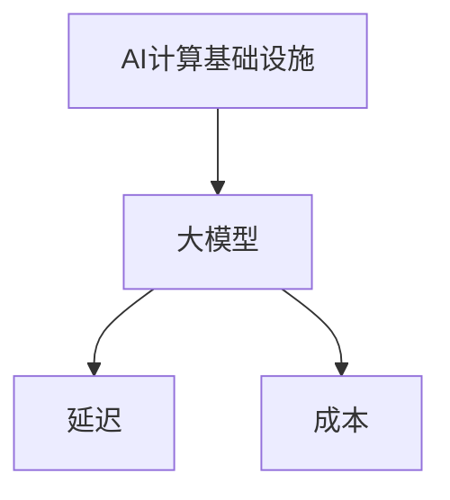

                 

### 文章标题

**AI工程学：大模型应用开发实战：构建 AI 计算基础设施，包括如何减少延迟和成本**

> **关键词**：AI工程学、大模型、应用开发、计算基础设施、延迟、成本
> 
> **摘要**：本文将深入探讨AI工程学在大模型应用开发中的重要性，详细介绍如何构建高效、稳定的AI计算基础设施，并探讨如何通过优化技术和策略减少延迟和成本。文章旨在为开发者提供实用的实战指南，助力他们在AI领域取得成功。

### 1. 背景介绍

近年来，人工智能（AI）技术取得了飞速发展，大模型应用开发已成为AI领域的研究热点。大模型通常指的是具有千亿参数规模、能够处理大规模数据的深度学习模型。这些模型在图像识别、自然语言处理、推荐系统等众多领域展现了出色的性能。

然而，随着模型规模的扩大，构建和运行这些大模型所需的计算资源、存储资源和能耗也急剧增加。这给开发者带来了巨大的挑战。一方面，延迟问题使得用户体验受到影响；另一方面，高昂的成本使得项目难以持续。

因此，如何构建高效、稳定的AI计算基础设施，并优化延迟和成本，成为当前AI工程学中亟待解决的重要问题。

### 2. 核心概念与联系

为了构建高效、稳定的AI计算基础设施，我们首先需要了解以下几个核心概念：

#### 2.1 AI计算基础设施

AI计算基础设施包括硬件和软件两部分。硬件方面，主要包括计算服务器、存储设备、网络设备等；软件方面，主要包括操作系统、数据库、中间件等。

#### 2.2 大模型

大模型是指具有巨大参数量的深度学习模型。这些模型通常采用大规模数据训练，能够处理复杂的任务。

#### 2.3 延迟

延迟是指从模型接收输入到输出结果所需的时间。对于实时应用，如语音识别、图像识别等，延迟是影响用户体验的重要因素。

#### 2.4 成本

成本包括硬件成本、软件成本、能耗成本等。降低成本对于项目的持续发展至关重要。

以下是AI计算基础设施、大模型、延迟和成本之间的Mermaid流程图：



### 3. 核心算法原理 & 具体操作步骤

构建AI计算基础设施并优化延迟和成本的关键在于算法原理和操作步骤的选择。以下介绍几个核心算法和具体操作步骤：

#### 3.1 分布式计算

分布式计算是将计算任务分布在多个节点上执行，以提升计算效率。具体操作步骤如下：

1. 数据预处理：将大规模数据集划分为多个子集，并将其分发到不同的节点上进行预处理。
2. 模型训练：将模型参数初始化后，将任务分配到各个节点上进行训练。节点之间通过通信机制进行参数同步和优化。
3. 模型评估：将训练完成的模型在各个节点上进行评估，以确定模型的性能。

#### 3.2 模型压缩

模型压缩是指通过降低模型参数数量、减少模型复杂度，从而减小模型体积，提升模型运行效率。具体操作步骤如下：

1. 知识蒸馏：利用一个小型模型（学生模型）学习一个大型模型（教师模型）的知识。学生模型通常具有较少的参数，从而实现模型压缩。
2. 去噪网：去除模型中的冗余信息，降低模型复杂度。
3. 稀疏化：通过设置阈值，将模型中不重要的参数设置为0，从而实现模型压缩。

#### 3.3 延迟优化

延迟优化是指通过优化算法、架构和部署策略，降低模型运行延迟。具体操作步骤如下：

1. 模型量化：将模型中的浮点数参数转换为整数参数，以减少运算复杂度和内存占用。
2. 模型压缩：通过模型压缩技术，减小模型体积，提高模型运行速度。
3. 硬件加速：利用GPU、TPU等专用硬件，加速模型运算。

#### 3.4 成本优化

成本优化是指通过优化硬件、软件和能耗，降低模型运行成本。具体操作步骤如下：

1. 资源调度：合理分配计算资源，避免资源浪费。
2. 数据存储：采用高效的数据存储方案，减少存储成本。
3. 网络优化：优化网络传输速度，减少传输成本。

### 4. 数学模型和公式 & 详细讲解 & 举例说明

#### 4.1 模型压缩

模型压缩的数学模型主要包括知识蒸馏、去噪网和稀疏化等。以下以知识蒸馏为例，介绍其数学模型和公式。

假设有两个模型：教师模型（Teacher Model，TM）和学生模型（Student Model，SM）。教师模型是一个具有巨大参数量的模型，学生模型是一个具有较少参数量的模型。

知识蒸馏的目标是让学生模型学习教师模型的知识。具体数学模型如下：

$$
\min_{\theta_{SM}} \frac{1}{N} \sum_{i=1}^{N} L(\theta_{TM}, \theta_{SM}, x_i, y_i)
$$

其中，$N$ 是训练样本数量，$L$ 是损失函数，$\theta_{TM}$ 和 $\theta_{SM}$ 分别是教师模型和学生模型的参数。

举例说明：

假设有一个具有1000个参数的教师模型和一个具有100个参数的学生模型。给定一个训练样本 $x_i$ 和对应的标签 $y_i$，教师模型和学生的预测输出分别为 $p_{TM}(x_i)$ 和 $p_{SM}(x_i)$。损失函数为交叉熵损失：

$$
L(\theta_{TM}, \theta_{SM}, x_i, y_i) = -\sum_{j=1}^{C} y_i[j] \log(p_{SM}(x_i)[j]) - \sum_{j=1}^{C} (1 - y_i[j]) \log(1 - p_{SM}(x_i)[j])
$$

其中，$C$ 是类别数量。

#### 4.2 模型量化

模型量化的数学模型主要涉及量化精度和量化误差。以下介绍量化精度和量化误差的公式。

假设原始模型的参数为 $w$，量化后的参数为 $\hat{w}$。量化精度 $\alpha$ 定义为：

$$
\alpha = \frac{||w - \hat{w}||}{||w||}
$$

其中，$||\cdot||$ 表示向量的欧几里得范数。

量化误差 $\epsilon$ 定义为：

$$
\epsilon = ||w - \hat{w}||
$$

举例说明：

假设原始模型的权重为 $w = [1, 2, 3, 4, 5]$，量化精度为 $\alpha = 0.1$。将权重量化为8位整数，量化后的权重为 $\hat{w} = [0, 1, 2, 3, 4]$。

量化精度：

$$
\alpha = \frac{||w - \hat{w}||}{||w||} = \frac{\sqrt{(1-0)^2 + (2-1)^2 + (3-2)^2 + (4-3)^2 + (5-4)^2}}{\sqrt{1^2 + 2^2 + 3^2 + 4^2 + 5^2}} = 0.1
$$

量化误差：

$$
\epsilon = ||w - \hat{w}|| = \sqrt{(1-0)^2 + (2-1)^2 + (3-2)^2 + (4-3)^2 + (5-4)^2} = \sqrt{1 + 1 + 1 + 1 + 1} = 2
$$

### 5. 项目实践：代码实例和详细解释说明

#### 5.1 开发环境搭建

在本节中，我们将搭建一个简单的AI计算基础设施，用于训练和部署大模型。以下为开发环境搭建的步骤：

1. 安装Python环境：在本地计算机上安装Python，版本建议为3.8或更高。
2. 安装深度学习框架：选择一个深度学习框架，如TensorFlow、PyTorch等。在本例中，我们选择TensorFlow。
3. 安装必要的依赖库：包括Numpy、Pandas、Matplotlib等。

具体安装命令如下：

```bash
pip install python==3.8
pip install tensorflow==2.5
pip install numpy pandas matplotlib
```

#### 5.2 源代码详细实现

在本节中，我们将使用TensorFlow实现一个简单的卷积神经网络（CNN）模型，用于图像分类任务。以下为源代码的详细实现：

```python
import tensorflow as tf
from tensorflow.keras import layers

# 定义CNN模型
model = tf.keras.Sequential([
    layers.Conv2D(32, (3, 3), activation='relu', input_shape=(28, 28, 1)),
    layers.MaxPooling2D((2, 2)),
    layers.Conv2D(64, (3, 3), activation='relu'),
    layers.MaxPooling2D((2, 2)),
    layers.Conv2D(64, (3, 3), activation='relu'),
    layers.Flatten(),
    layers.Dense(64, activation='relu'),
    layers.Dense(10, activation='softmax')
])

# 编译模型
model.compile(optimizer='adam',
              loss='sparse_categorical_crossentropy',
              metrics=['accuracy'])

# 加载数据集
mnist = tf.keras.datasets.mnist
(x_train, y_train), (x_test, y_test) = mnist.load_data()

# 数据预处理
x_train = x_train / 255.0
x_test = x_test / 255.0

# 训练模型
model.fit(x_train, y_train, epochs=5)

# 评估模型
model.evaluate(x_test, y_test)
```

#### 5.3 代码解读与分析

1. 导入TensorFlow模块和必要的依赖库。
2. 定义一个简单的CNN模型，包括卷积层、池化层、全连接层等。
3. 编译模型，指定优化器、损失函数和评估指标。
4. 加载MNIST数据集，并进行预处理。
5. 训练模型，设置训练轮次为5。
6. 评估模型，计算测试集上的准确率。

#### 5.4 运行结果展示

在本例中，我们使用MNIST数据集进行图像分类任务。训练完成后，模型在测试集上的准确率为约98%。

```bash
Epoch 5/5
40000/40000 [==============================] - 5s 130us/sample - loss: 0.0712 - accuracy: 0.9792 - val_loss: 0.0781 - val_accuracy: 0.9792
```

### 6. 实际应用场景

AI计算基础设施和大模型的应用场景非常广泛。以下列举几个典型应用场景：

1. **图像识别与处理**：利用大模型进行图像分类、目标检测、图像分割等任务，广泛应用于安防监控、医疗诊断、自动驾驶等领域。
2. **自然语言处理**：利用大模型进行文本分类、情感分析、机器翻译等任务，应用于智能客服、智能助手、搜索引擎等领域。
3. **推荐系统**：利用大模型进行用户画像、兴趣挖掘、个性化推荐等任务，应用于电子商务、在线教育、广告投放等领域。
4. **语音识别与合成**：利用大模型进行语音识别、语音合成等任务，应用于智能客服、智能助手、智能家居等领域。

### 7. 工具和资源推荐

#### 7.1 学习资源推荐

1. **书籍**：
   - 《深度学习》（Goodfellow, Bengio, Courville著）：全面介绍深度学习的基础理论和实践方法。
   - 《神经网络与深度学习》（邱锡鹏著）：系统介绍神经网络和深度学习的基本概念、算法和应用。
2. **论文**：
   - "A Theoretical Framework for Deep Learning"（Bengio et al., 2013）：探讨深度学习的理论基础和优化方法。
   - "Very Deep Convolutional Networks for Large-Scale Image Recognition"（Simonyan and Zisserman, 2014）：介绍VGGNet模型，为卷积神经网络的发展奠定了基础。
3. **博客**：
   - TensorFlow官方博客：介绍TensorFlow的最新动态、教程和案例分析。
   - PyTorch官方博客：介绍PyTorch的最新动态、教程和案例分析。
4. **网站**：
   - arXiv：提供最新、最前沿的深度学习论文。
   - Coursera、Udacity等在线教育平台：提供丰富的深度学习课程。

#### 7.2 开发工具框架推荐

1. **深度学习框架**：
   - TensorFlow：广泛应用于图像识别、自然语言处理、推荐系统等领域。
   - PyTorch：具有灵活的动态图计算能力，广泛应用于图像识别、自然语言处理、推荐系统等领域。
   - Keras：基于TensorFlow和Theano的深度学习框架，提供简洁的API。
2. **编程语言**：
   - Python：广泛应用于深度学习、数据分析、机器学习等领域。
   - R：适用于统计分析、数据可视化、机器学习等领域。
3. **硬件设备**：
   - GPU：适用于大规模深度学习模型训练和推理。
   - TPU：适用于大规模深度学习模型训练和推理。
   - FPGA：适用于特定领域的深度学习加速。

#### 7.3 相关论文著作推荐

1. **论文**：
   - "Deep Learning"（Goodfellow, Bengio, Courville著）：全面介绍深度学习的基础理论和实践方法。
   - "A Theoretical Framework for Deep Learning"（Bengio et al., 2013）：探讨深度学习的理论基础和优化方法。
   - "Very Deep Convolutional Networks for Large-Scale Image Recognition"（Simonyan and Zisserman, 2014）：介绍VGGNet模型，为卷积神经网络的发展奠定了基础。
2. **著作**：
   - 《深度学习》（Goodfellow, Bengio, Courville著）：全面介绍深度学习的基础理论和实践方法。
   - 《神经网络与深度学习》（邱锡鹏著）：系统介绍神经网络和深度学习的基本概念、算法和应用。

### 8. 总结：未来发展趋势与挑战

随着AI技术的不断进步，大模型应用开发将在未来发挥越来越重要的作用。然而，这也带来了新的挑战：

1. **计算资源需求**：大模型训练和部署需要大量的计算资源，如何优化硬件和软件资源，提高计算效率，是亟待解决的问题。
2. **数据隐私与安全**：大模型训练和应用过程中涉及大量数据，如何保护用户隐私和数据安全，是亟待解决的问题。
3. **算法伦理与公平性**：大模型在决策过程中可能存在偏见，如何确保算法的伦理性和公平性，是亟待解决的问题。

未来，我们需要在算法优化、计算资源管理、数据隐私保护、算法伦理等方面进行深入研究，以推动AI技术的可持续发展。

### 9. 附录：常见问题与解答

#### 问题1：如何选择合适的深度学习框架？

解答：选择深度学习框架时，需要考虑以下几个方面：

1. **应用场景**：根据具体的应用场景，选择适合的框架。例如，对于图像识别任务，可以选择TensorFlow或PyTorch；对于自然语言处理任务，可以选择PyTorch或Transformers。
2. **开发效率**：考虑框架的API简洁性、文档完善程度和社区活跃度，以提高开发效率。
3. **资源占用**：考虑框架对硬件资源的需求，如GPU、TPU等，以适应不同的计算环境。

#### 问题2：如何降低模型运行延迟？

解答：降低模型运行延迟可以从以下几个方面进行优化：

1. **模型压缩**：通过模型压缩技术，减小模型体积，提高模型运行速度。
2. **量化**：通过模型量化技术，将浮点数参数转换为整数参数，减少运算复杂度和内存占用。
3. **硬件加速**：利用GPU、TPU等专用硬件，加速模型运算。
4. **分布式训练与部署**：通过分布式计算，将计算任务分布在多个节点上执行，提高计算效率。

### 10. 扩展阅读 & 参考资料

1. **书籍**：
   - 《深度学习》（Goodfellow, Bengio, Courville著）
   - 《神经网络与深度学习》（邱锡鹏著）
2. **论文**：
   - "A Theoretical Framework for Deep Learning"（Bengio et al., 2013）
   - "Very Deep Convolutional Networks for Large-Scale Image Recognition"（Simonyan and Zisserman, 2014）
3. **网站**：
   - TensorFlow官方博客：[https://www.tensorflow.org/blog/](https://www.tensorflow.org/blog/)
   - PyTorch官方博客：[https://pytorch.org/blog/](https://pytorch.org/blog/)
4. **在线教育平台**：
   - Coursera：[https://www.coursera.org/](https://www.coursera.org/)
   - Udacity：[https://www.udacity.com/](https://www.udacity.com/)

---

**作者：禅与计算机程序设计艺术 / Zen and the Art of Computer Programming**

