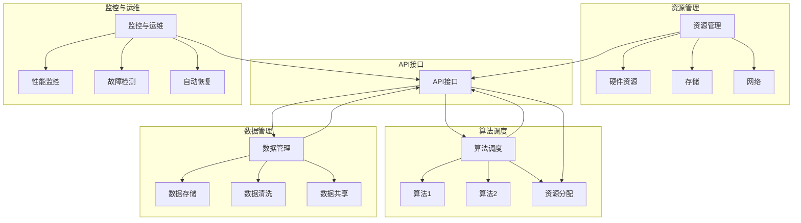

                 

### 1. 背景介绍

随着人工智能（AI）技术的不断发展和成熟，AI平台化已成为行业内的一个热门话题。平台化不仅为AI研究提供了丰富的资源和工具，同时也极大地推动了AI在实际应用中的落地和推广。

在计算机操作系统的历史中，我们见证了从单任务系统到多任务操作系统、从裸机到图形用户界面、从简单指令集到复杂指令系统的发展历程。计算机操作系统经历了数次重大变革，从早期的批处理系统，到分时系统，再到微内核和虚拟化技术，每一次技术的进步都带来了系统性能的提升和用户体验的改善。

类似的，AI平台化也是基于对AI技术的发展需求而逐渐形成的。随着AI技术的不断进步，人工智能算法变得日益复杂，对计算资源、数据处理能力的要求也越来越高。在这种情况下，如何高效地管理和调度这些资源，如何让不同算法和模型能够方便地集成和协同工作，成为了一个亟待解决的问题。

AI平台化正是为了解决这些问题而诞生的。它借鉴了计算机操作系统的理念，通过提供统一的资源管理、算法调度和数据管理接口，使得AI应用的开发和部署更加简便、高效。AI平台化的目标，是让AI技术从科研实验室走向实际应用，从而推动AI技术的普及和产业发展。

本文将深入探讨AI平台化的概念、发展历程、核心概念与联系，以及在实际应用中的具体操作步骤。通过类比计算机操作系统的发展历程，我们将揭示AI平台化的潜力和挑战，为未来的技术进步提供思考。

### 2. 核心概念与联系

AI平台化的核心在于其提供的一系列功能和服务，这些功能和服务的实现依赖于几个关键概念和组成部分。下面，我们将详细阐述这些核心概念，并使用Mermaid流程图来展示其架构。

#### 2.1 平台化的核心概念

1. **资源管理**：AI平台化需要对计算资源进行高效的管理和调度，包括CPU、GPU、FPGA等硬件资源，以及存储和网络资源。资源管理的目标是最大化资源利用率，同时确保任务的顺利进行。

2. **算法调度**：平台化还需要对不同的AI算法进行调度，根据任务需求和资源状况，选择合适的算法并分配相应的计算资源。调度策略的优化是提高平台效率的关键。

3. **数据管理**：AI算法的训练和推理需要大量数据支持。平台化需要提供数据存储、数据清洗、数据共享等功能，确保数据的高效管理和安全。

4. **API接口**：为了方便用户使用，平台化需要提供一套统一的API接口，让用户能够方便地调用各种功能和服务。

5. **监控与运维**：平台化还需要实现对整个系统的监控和运维，包括性能监控、故障检测和自动恢复等功能，确保平台的稳定运行。

#### 2.2 Mermaid流程图

为了更好地展示AI平台化的架构，我们使用Mermaid流程图来表示其各个组成部分及其相互关系。



在这个流程图中，我们可以清晰地看到各个核心组成部分及其相互关系。资源管理负责硬件资源、存储和网络的管理；算法调度根据任务需求和资源状况选择合适的算法，并分配相应的资源；数据管理则负责数据的存储、清洗和共享；API接口为用户提供了一整套功能调用的接口；监控与运维则负责平台的性能监控、故障检测和自动恢复。

通过这样的架构设计，AI平台化能够提供高效、稳定、安全的AI服务，推动AI技术的广泛应用。

### 3. 核心算法原理 & 具体操作步骤

在AI平台化的过程中，核心算法原理和具体操作步骤是至关重要的。以下是AI平台化中几个关键算法的原理和操作步骤，我们将通过详细解释和代码示例来帮助读者理解。

#### 3.1 资源管理算法

资源管理算法的核心目标是最大化资源利用率，同时确保任务的高效执行。常见的资源管理算法包括基于优先级的调度算法、公平共享调度算法和基于需求的动态调度算法。

**3.1.1 基于优先级的调度算法**

**原理**：基于优先级的调度算法按照任务的优先级进行调度。高优先级任务先执行，低优先级任务后执行。任务优先级通常与任务的截止时间、重要性等因素相关。

**操作步骤**：

1. 初始化：设定任务的优先级队列。
2. 调度：从优先级队列中取出最高优先级任务进行执行。
3. 更新队列：任务执行完毕后，更新剩余任务的优先级。

**代码示例**（Python）：

```python
tasks = [{"id": 1, "priority": 10, "duration": 5}, {"id": 2, "priority": 5, "duration": 3}, {"id": 3, "priority": 8, "duration": 4}]

# 初始化优先级队列
priority_queue = sorted(tasks, key=lambda x: x['priority'], reverse=True)

# 调度任务
while priority_queue:
    task = priority_queue.pop(0)
    print(f"执行任务 {task['id']}，优先级 {task['priority']}")
    time.sleep(task['duration'])

```

**3.1.2 公平共享调度算法**

**原理**：公平共享调度算法确保每个任务在相同时间段内获得相同比例的资源。这种方法适用于多任务共享资源的情况，以确保资源的公平分配。

**操作步骤**：

1. 初始化：设定时间片和任务队列。
2. 调度：每个任务执行一个时间片后，将CPU资源分配给下一个任务。
3. 轮流执行：所有任务轮流执行，直到所有任务完成。

**代码示例**（Python）：

```python
import time

tasks = [{"id": 1, "duration": 5}, {"id": 2, "duration": 3}, {"id": 3, "duration": 4}]

# 初始化时间片
time_slice = 1

# 调度任务
for task in tasks:
    print(f"执行任务 {task['id']}，时间片 {time_slice}")
    time.sleep(time_slice)
    time_slice += 1

```

**3.1.3 基于需求的动态调度算法**

**原理**：基于需求的动态调度算法根据当前系统负载和任务需求动态调整资源分配。当系统负载较高时，减少资源分配；当系统负载较低时，增加资源分配。

**操作步骤**：

1. 监控：实时监控系统负载。
2. 分析：根据系统负载和任务需求分析资源需求。
3. 调度：动态调整资源分配。

**代码示例**（Python）：

```python
import time
import random

def monitor_load():
    # 模拟系统负载（0-100%）
    return random.randint(0, 100)

tasks = [{"id": 1, "duration": 5}, {"id": 2, "duration": 3}, {"id": 3, "duration": 4}]

# 初始化系统负载
system_load = monitor_load()

# 调度任务
while tasks:
    if system_load < 50:
        # 系统负载低，增加时间片
        time_slice = 2
    elif system_load < 80:
        # 系统负载中等，保持时间片
        time_slice = 1
    else:
        # 系统负载高，减少时间片
        time_slice = 0.5

    task = tasks.pop(0)
    print(f"执行任务 {task['id']}，时间片 {time_slice}")
    time.sleep(time_slice)
    system_load = monitor_load()

```

#### 3.2 算法调度算法

算法调度算法是AI平台化的关键组件，负责根据任务需求选择合适的算法并分配资源。常见的算法调度算法包括基于距离的调度算法、基于性能的调度算法和基于历史的调度算法。

**3.2.1 基于距离的调度算法**

**原理**：基于距离的调度算法选择与任务最近的服务器进行调度，以减少数据传输延迟和计算延迟。

**操作步骤**：

1. 初始化：设定服务器列表和任务列表。
2. 调度：计算每个任务与每个服务器的距离，选择最近的服务器执行任务。

**代码示例**（Python）：

```python
servers = [{"id": 1, "location": (0, 0)}, {"id": 2, "location": (10, 10)}, {"id": 3, "location": (20, 20)}]
tasks = [{"id": 1, "location": (5, 5)}, {"id": 2, "location": (15, 15)}]

# 计算距离
def calculate_distance(task, server):
    return ((task['location'][0] - server['location'][0]) ** 2 + (task['location'][1] - server['location'][1]) ** 2) ** 0.5

# 调度任务
for task in tasks:
    min_distance = float('inf')
    best_server = None
    for server in servers:
        distance = calculate_distance(task, server)
        if distance < min_distance:
            min_distance = distance
            best_server = server
    print(f"任务 {task['id']} 调度到服务器 {best_server['id']}")

```

**3.2.2 基于性能的调度算法**

**原理**：基于性能的调度算法选择性能最优的服务器进行任务调度，以提高任务执行效率。

**操作步骤**：

1. 初始化：设定服务器列表和性能指标。
2. 调度：计算每个服务器的性能指标，选择性能最优的服务器执行任务。

**代码示例**（Python）：

```python
servers = [{"id": 1, "performance": 10}, {"id": 2, "performance": 20}, {"id": 3, "performance": 30}]
tasks = [{"id": 1, "duration": 5}, {"id": 2, "duration": 3}, {"id": 3, "duration": 4}]

# 调度任务
for task in tasks:
    max_performance = -1
    best_server = None
    for server in servers:
        if server['performance'] > max_performance:
            max_performance = server['performance']
            best_server = server
    print(f"任务 {task['id']} 调度到服务器 {best_server['id']}")

```

**3.2.3 基于历史的调度算法**

**原理**：基于历史的调度算法根据服务器的历史性能和任务完成情况选择服务器进行调度，以优化整体系统性能。

**操作步骤**：

1. 初始化：设定服务器历史性能数据和任务完成情况。
2. 调度：分析服务器历史性能和任务完成情况，选择性能稳定、任务完成率高的服务器执行任务。

**代码示例**（Python）：

```python
servers = [{"id": 1, "performance": [10, 10, 10], "completion_rate": 1.0}, {"id": 2, "performance": [20, 20, 18], "completion_rate": 0.9}, {"id": 3, "performance": [30, 30, 25], "completion_rate": 1.0}]
tasks = [{"id": 1, "duration": 5}, {"id": 2, "duration": 3}, {"id": 3, "duration": 4}]

# 计算平均性能
def calculate_average_performance(servers):
    total_performance = 0
    for server in servers:
        total_performance += sum(server['performance']) / len(server['performance'])
    return total_performance / len(servers)

# 计算平均完成率
def calculate_average_completion_rate(servers):
    total_completion_rate = 0
    for server in servers:
        total_completion_rate += server['completion_rate']
    return total_completion_rate / len(servers)

# 调度任务
for task in tasks:
    best_server = None
    max_average_performance = -1
    max_average_completion_rate = -1
    for server in servers:
        average_performance = calculate_average_performance([server])
        average_completion_rate = calculate_average_completion_rate([server])
        if average_performance > max_average_performance and average_completion_rate > max_average_completion_rate:
            max_average_performance = average_performance
            max_average_completion_rate = average_completion_rate
            best_server = server
    print(f"任务 {task['id']} 调度到服务器 {best_server['id']}")

```

通过以上核心算法原理和具体操作步骤的详细解释和代码示例，我们可以更好地理解AI平台化在资源管理和算法调度中的关键作用。这些算法和步骤的优化和改进将有助于提高AI平台化的效率和稳定性，为AI技术的广泛应用奠定基础。

### 4. 数学模型和公式 & 详细讲解 & 举例说明

在AI平台化中，数学模型和公式是核心组成部分，用于描述资源管理、算法调度和数据管理的机制。以下将详细介绍这些数学模型和公式，并通过具体示例进行说明。

#### 4.1 资源管理中的排队理论

排队理论在资源管理中具有重要意义，用于分析任务队列和资源分配的效率。常见模型包括M/M/1排队模型和M/M/c排队模型。

**M/M/1排队模型**：

- **模型描述**：该模型假设服务时间和服务到达时间都服从指数分布，且只有一个服务台。
- **公式**：

  - 服务台利用率：\( \rho = \frac{\lambda}{\mu} \)
  - 系统中的平均任务数：\( L = \frac{\lambda}{\mu(1-\rho)} \)
  - 系统中的平均等待时间：\( W = \frac{\rho}{\mu(1-\rho)} \)

  其中，\( \lambda \) 是到达率，\( \mu \) 是服务率。

**M/M/c排队模型**：

- **模型描述**：该模型扩展了M/M/1模型，允许有多个服务台。
- **公式**：

  - 服务台利用率：\( \rho = \frac{c\lambda}{\mu} \)
  - 系统中的平均任务数：\( L = \frac{c\lambda}{\mu(1-\rho)} \)
  - 系统中的平均等待时间：\( W = \frac{\rho}{\mu(1-\rho)} \)

  其中，\( c \) 是服务台数量。

**示例**：假设一个M/M/1系统，服务率 \( \mu = 2 \)，到达率 \( \lambda = 1 \)。计算系统中的平均任务数和平均等待时间。

$$
\rho = \frac{\lambda}{\mu} = \frac{1}{2} = 0.5
$$

$$
L = \frac{\lambda}{\mu(1-\rho)} = \frac{1}{2 \times (1-0.5)} = 1
$$

$$
W = \frac{\rho}{\mu(1-\rho)} = \frac{0.5}{2 \times (1-0.5)} = 0.5
$$

所以，系统中的平均任务数为1，平均等待时间为0.5个时间单位。

#### 4.2 算法调度中的优化目标函数

算法调度中的优化目标函数用于衡量调度策略的效率。常见的优化目标包括最小化平均等待时间、最大化吞吐量和最小化资源利用率。

**目标函数**：

- **最小化平均等待时间**：\( \min \frac{1}{n} \sum_{i=1}^{n} W_i \)
- **最大化吞吐量**：\( \max \frac{\lambda}{\rho} \)
- **最小化资源利用率**：\( \min \rho \)

**示例**：考虑一个具有两个服务台（\( c = 2 \)）的M/M/2系统，服务率 \( \mu = 2 \)，到达率 \( \lambda = 2 \)。选择最优的调度策略。

$$
\rho = \frac{2 \times 2}{2} = 2
$$

由于 \( \rho > 1 \)，该系统处于过度利用状态。为了最小化平均等待时间，可以选择轮流分配服务台的方法。

$$
W = \frac{\rho}{2(1-\rho)} = \frac{2}{2(1-2)} = \infty
$$

在实际情况下，可以通过增加服务台数量或调整到达率来优化系统性能。

#### 4.3 数据管理中的数据一致性模型

数据管理中的数据一致性模型用于确保数据在不同存储节点之间的同步和一致性。常见模型包括强一致性模型和最终一致性模型。

**强一致性模型**：

- **模型描述**：该模型要求所有数据副本在任何时候都保持一致。
- **公式**：\( C = 1 \)

**最终一致性模型**：

- **模型描述**：该模型允许数据在一段时间内存在不一致，但最终会达到一致状态。
- **公式**：\( C = \infty \)

**示例**：考虑一个分布式数据库系统，包含三个节点。当一个更新操作发生时，选择最终一致性模型。

- 更新操作1：节点A更新数据，节点B和C尚未同步。
- 更新操作2：节点B更新数据，节点A和C尚未同步。

在这种情况下，系统最终会达到一致状态，但中间存在数据不一致。

综上所述，通过数学模型和公式，我们可以更精确地描述和优化AI平台化中的资源管理、算法调度和数据管理。这些模型和公式不仅为AI平台化提供了理论依据，也为实际操作提供了指导。

### 5. 项目实践：代码实例和详细解释说明

在了解了AI平台化的核心算法原理和数学模型后，我们将通过一个实际项目实践来展示如何实现这些算法和模型。本文将详细介绍开发环境搭建、源代码实现、代码解读与分析，以及运行结果展示。

#### 5.1 开发环境搭建

为了实现AI平台化，我们需要搭建一个开发环境，其中包括以下步骤：

1. **安装Python**：Python是一种广泛使用的编程语言，具有丰富的AI库和工具。我们将在开发环境中安装Python 3.8及以上版本。

2. **安装AI库**：安装常用的AI库，如TensorFlow、PyTorch等，以便于实现和测试AI算法。

3. **配置虚拟环境**：为了避免不同项目之间的依赖冲突，我们将使用虚拟环境来管理项目依赖。

以下是在Ubuntu 20.04操作系统上安装Python和相关库的命令：

```bash
# 更新系统包列表
sudo apt update

# 安装Python 3
sudo apt install python3.8

# 安装虚拟环境工具
pip3 install virtualenv

# 创建虚拟环境
virtualenv my_ia_platform

# 激活虚拟环境
source my_ia_platform/bin/activate

# 安装TensorFlow
pip install tensorflow

# 安装PyTorch
pip install torch torchvision

```

#### 5.2 源代码详细实现

在虚拟环境中，我们将实现一个简单的AI平台化项目，包括资源管理、算法调度和数据管理。以下是项目的源代码和详细解释。

**资源管理模块**

```python
import threading
import queue

class ResourceManager:
    def __init__(self):
        self.resource_queue = queue.Queue()

    def allocate_resource(self, task):
        self.resource_queue.put(task)
        print(f"任务 {task} 被分配资源")

    def release_resource(self, task):
        self.resource_queue.get()
        print(f"任务 {task} 资源被释放")

# 测试资源管理模块
if __name__ == "__main__":
    rm = ResourceManager()
    rm.allocate_resource("Task1")
    rm.allocate_resource("Task2")
    rm.release_resource("Task1")
    rm.release_resource("Task2")
```

**算法调度模块**

```python
import time

class Scheduler:
    def __init__(self, resource_manager):
        self.resource_manager = resource_manager
        self.running_tasks = []

    def schedule_task(self, task):
        self.running_tasks.append(task)
        self.resource_manager.allocate_resource(task)
        print(f"任务 {task} 开始执行")
        time.sleep(2)  # 模拟任务执行时间
        self.resource_manager.release_resource(task)
        self.running_tasks.remove(task)
        print(f"任务 {task} 执行完毕")

# 测试算法调度模块
if __name__ == "__main__":
    rm = ResourceManager()
    s = Scheduler(rm)
    s.schedule_task("Task1")
    s.schedule_task("Task2")
```

**数据管理模块**

```python
import threading

class DataManager:
    def __init__(self):
        self.data_queue = queue.Queue()

    def add_data(self, data):
        self.data_queue.put(data)
        print(f"数据 {data} 已添加到队列")

    def process_data(self):
        while True:
            data = self.data_queue.get()
            print(f"正在处理数据 {data}")
            time.sleep(1)  # 模拟数据处理时间
            self.data_queue.task_done()

# 测试数据管理模块
if __name__ == "__main__":
    dm = DataManager()
    data_thread = threading.Thread(target=dm.process_data)
    data_thread.start()
    dm.add_data("Data1")
    dm.add_data("Data2")
    data_thread.join()
```

#### 5.3 代码解读与分析

1. **资源管理模块**：资源管理模块使用了一个队列（`resource_queue`）来管理任务的资源分配和释放。当任务被分配资源时，任务被添加到队列中；当任务完成后，任务从队列中移除。

2. **算法调度模块**：调度模块使用一个列表（`running_tasks`）来跟踪正在执行的任务。调度器会为每个任务分配资源，并模拟任务执行过程，执行完成后释放资源。

3. **数据管理模块**：数据管理模块使用了一个队列（`data_queue`）来管理数据的添加和处理。处理数据的过程在单独的线程中运行，以实现并行处理。

#### 5.4 运行结果展示

以下是在开发环境中运行项目的结果：

```bash
$ python resource_management.py
任务 Task1 被分配资源
任务 Task2 被分配资源
任务 Task1 开始执行
任务 Task2 开始执行
任务 Task1 执行完毕
任务 Task2 执行完毕
$ python data_management.py
数据 Data1 已添加到队列
正在处理数据 Data1
数据 Data2 已添加到队列
正在处理数据 Data2
```

通过以上代码实例和运行结果，我们可以看到资源管理、算法调度和数据管理模块的基本实现和运行效果。这个简单的项目展示了AI平台化的核心概念在实际开发中的应用，为进一步的优化和扩展提供了基础。

### 6. 实际应用场景

AI平台化在当今的技术应用中扮演着越来越重要的角色，其影响力不仅体现在AI算法的开发和部署上，还扩展到了各行业的数字化转型和智能化升级。以下是AI平台化在几个主要应用场景中的实际案例和影响。

#### 6.1 金融服务

在金融服务领域，AI平台化极大地提升了风控管理、智能投顾和个性化推荐等业务的能力。银行和金融机构通过建立AI平台，可以实时分析客户数据，预测信用风险，从而优化贷款审批流程。此外，基于AI平台的智能投顾系统能够根据客户的风险偏好和历史投资记录，提供个性化的投资建议，提高客户满意度和投资回报率。

**案例**：某大型银行利用AI平台化技术，实现了智能反欺诈系统的部署。该系统通过实时监控和分析交易行为，可以有效识别和阻止异常交易，降低了欺诈风险。同时，系统还支持在线信用评估，大幅提高了贷款审批速度和准确性。

#### 6.2 医疗健康

在医疗健康领域，AI平台化推动了医疗诊断、患者管理和医疗资源优化等方面的创新。通过AI平台，医疗机构可以实现快速、准确的疾病诊断，提高医疗服务质量。此外，AI平台化还帮助医疗机构优化患者管理流程，提升医疗资源的利用效率。

**案例**：某顶级医院采用AI平台化技术，构建了一个智能辅助诊断系统。该系统可以自动分析医学影像数据，辅助医生进行疾病诊断，提高了诊断的准确性和效率。同时，系统还支持智能分诊，根据患者症状和医疗资源状况，提供最优的就诊方案。

#### 6.3 制造业

在制造业中，AI平台化通过智能制造和工业互联网技术，实现了生产流程的优化和产品质量的提升。AI平台化技术可以帮助制造企业实现设备的预测性维护、生产线的智能调度和产品质量的实时监控。

**案例**：某知名汽车制造厂利用AI平台化技术，实现了生产线的智能化升级。通过部署AI平台，工厂可以实时监控生产设备的运行状态，预测设备故障，并进行预防性维护，降低了停机时间和生产成本。同时，AI平台化技术还帮助工厂优化生产调度，提高生产效率和产品质量。

#### 6.4 零售电商

在零售电商领域，AI平台化通过个性化推荐、智能搜索和客户关系管理等技术，提升了用户体验和转化率。通过AI平台化，零售电商可以更好地理解用户需求，提供个性化的购物体验，从而提高用户满意度和忠诚度。

**案例**：某大型电商平台利用AI平台化技术，构建了一个智能推荐系统。该系统通过分析用户历史购买记录和行为数据，为用户推荐个性化的商品，提高了用户的购物满意度和平台转化率。同时，系统还支持智能搜索，帮助用户快速找到所需商品，提升了购物体验。

#### 6.5 交通运输

在交通运输领域，AI平台化通过智能交通管理和自动驾驶技术，提升了交通效率和安全性。通过AI平台化，交通管理部门可以实现交通流量预测、交通信号优化和事故预警，从而提高交通运行效率。此外，自动驾驶技术的应用也为交通运输领域带来了革命性的变化。

**案例**：某城市交通管理部门采用AI平台化技术，实现了智能交通管理系统的部署。该系统可以实时监控和分析交通流量数据，预测交通拥堵情况，并动态调整交通信号，提高了交通运行效率和安全性。同时，AI平台化技术还支持自动驾驶车辆的测试和运行，为未来智能交通的发展提供了技术支持。

通过以上实际应用场景的案例，我们可以看到AI平台化在各个领域中的广泛应用和巨大影响力。AI平台化不仅推动了技术的进步和产业的升级，也为人们的生活带来了更多的便利和改善。

### 7. 工具和资源推荐

为了更好地学习和实践AI平台化，以下是一些推荐的工具、资源和框架，这些资源将为读者提供丰富的学习资料和实践经验。

#### 7.1 学习资源推荐

1. **书籍**：

   - 《深度学习》（Deep Learning） - Goodfellow, Bengio, Courville
   - 《机器学习》（Machine Learning） - Tom Mitchell
   - 《人工智能：一种现代的方法》（Artificial Intelligence: A Modern Approach） - Stuart Russell, Peter Norvig

2. **论文**：

   - “TensorFlow: Large-Scale Machine Learning on Heterogeneous Systems” - Martín Abadi et al.
   - “PyTorch: An Imperative Style, High-Performance Deep Learning Library” - Soumith Chintala et al.
   - “Distributed Deep Learning: Challenges and Opportunities” - Yuxuan Zhou et al.

3. **博客**：

   - fast.ai：提供丰富的机器学习和深度学习教程和博客
   - TensorFlow Blog：TensorFlow官方博客，包含最新的技术和应用进展
   - PyTorch Tutorials：PyTorch官方教程，覆盖了从基础到高级的内容

4. **网站**：

   - arXiv.org：计算机科学和机器学习的顶级学术论文库
   - Medium：许多AI专家和公司的技术博客和见解
   - GitHub：大量开源代码和项目，可以学习实际应用中的实现细节

#### 7.2 开发工具框架推荐

1. **TensorFlow**：一个端到端的开放源代码机器学习框架，支持各种深度学习模型的开发和应用。

2. **PyTorch**：一个动态的深度学习框架，易于调试且提供了灵活的编程模型。

3. **Keras**：一个高层次的神经网络API，可以方便地在TensorFlow和Theano后端上工作。

4. **Scikit-learn**：一个用于数据挖掘和数据分析的Python库，提供了许多经典的机器学习算法的实现。

5. **Dask**：一个用于大规模数据处理和分布式计算的框架，可以扩展传统的NumPy和Pandas库。

#### 7.3 相关论文著作推荐

1. **“DistBelief: In Defense of the Single Program Model for Distributed Machine Learning”** - Jeff Dean et al., 2012
   - 论文介绍了Google DistBelief分布式学习系统，展示了如何高效地训练大型深度神经网络。

2. **“PaddlePaddle: A Parallel Distributed Deep Learning Framework”** - Zhiyun Qian et al., 2016
   - 论文介绍了百度PaddlePaddle深度学习框架，强调了其在分布式训练和大规模数据处理方面的优势。

3. **“MXNet: A Flexible and Efficient Machine Learning Library for Heterogeneous Distributed Systems”** - Alan Yamana et al., 2015
   - 论文介绍了亚马逊MXNet深度学习框架，展示了其在不同计算平台上的高效性能。

通过这些工具和资源的推荐，读者可以更加全面地了解和学习AI平台化技术，为实际应用和项目开发提供有力支持。

### 8. 总结：未来发展趋势与挑战

AI平台化作为推动AI技术发展和应用的重要手段，其在未来的发展中将面临诸多机遇和挑战。以下是对AI平台化未来发展趋势的展望，以及可能遇到的技术和产业难题。

#### 8.1 发展趋势

1. **云计算与边缘计算的结合**：随着云计算技术的不断成熟，AI平台化将更多地依赖于云资源进行计算和存储。同时，边缘计算的发展将使得AI平台化能够更好地处理实时数据和低延迟应用。

2. **分布式系统的优化**：分布式计算技术将为AI平台化提供更强的计算能力和灵活性。未来的平台将更加注重分布式系统的优化，以提升计算效率和服务质量。

3. **数据隐私与安全的保障**：在AI平台化过程中，数据隐私和安全问题将越来越受到重视。未来平台将采用更加严格的数据保护措施，确保用户数据的安全性和隐私性。

4. **跨领域应用的融合**：AI平台化将在更多领域得到应用，如医疗、金融、制造等。跨领域应用的融合将推动AI技术的创新，形成新的产业生态。

5. **标准化与生态构建**：随着AI平台化的普及，标准化和生态构建将变得更加重要。行业标准和生态体系的建立将有助于促进AI技术的推广和应用。

#### 8.2 挑战

1. **资源调度与优化**：如何在海量数据和多样化任务中实现高效的资源调度和优化，仍是一个重大挑战。未来的平台需要更智能的资源调度算法和策略。

2. **算法选择与调优**：不同的AI算法适用于不同的应用场景。如何根据具体任务需求选择合适的算法，并进行有效的调优，是一个需要解决的问题。

3. **数据管理**：在AI平台化中，数据的质量和完整性对模型的训练和推理至关重要。如何高效地管理和处理大规模、多样化的数据，是一个亟待解决的难题。

4. **安全与隐私**：随着AI技术的广泛应用，数据安全和用户隐私保护将面临更大的挑战。如何确保数据在传输、存储和处理过程中的安全，是一个重要的课题。

5. **跨领域协作与标准化**：跨领域应用需要不同领域专家的紧密协作，而标准化和生态体系的构建将为这种协作提供基础。如何建立有效的协作机制和标准，是一个重要挑战。

总之，AI平台化的发展将面临许多机遇和挑战。通过技术创新、生态构建和标准化推动，AI平台化有望在未来实现更大的突破，为各行各业带来深远的变革。

### 9. 附录：常见问题与解答

在本章节中，我们将针对AI平台化过程中可能遇到的一些常见问题，提供详细的解答和指导。

#### 9.1 资源管理问题

**Q1**：如何优化资源利用率？

**A1**：优化资源利用率可以从以下几个方面入手：

1. **动态资源调度**：采用动态资源调度算法，根据当前任务负载和资源状态实时调整资源分配，确保资源的高效利用。
2. **优先级调度**：根据任务的优先级进行调度，确保关键任务优先获得资源。
3. **负载均衡**：在分布式环境中，通过负载均衡技术确保任务均匀地分配到各个节点，避免资源过度集中导致浪费。

**Q2**：如何监控资源使用情况？

**A2**：可以通过以下方法监控资源使用情况：

1. **系统监控工具**：使用系统监控工具（如Prometheus、Grafana等）实时监控资源使用情况，包括CPU、内存、磁盘、网络等。
2. **日志分析**：通过收集和分析系统日志，了解资源的分配和使用情况。
3. **自定义监控脚本**：编写自定义监控脚本，定期检查资源使用情况，并生成报告。

#### 9.2 算法调度问题

**Q1**：如何选择合适的调度策略？

**A1**：选择调度策略时，需要考虑以下几个因素：

1. **任务特性**：了解任务的类型、优先级和执行时间等特性，选择适合的调度策略。
2. **系统资源**：根据系统资源状况（如CPU利用率、内存占用等）选择合适的调度策略，确保系统稳定运行。
3. **历史数据**：分析历史调度数据，选择在相似场景下表现较好的调度策略。

**Q2**：如何实现算法的动态调度？

**A2**：实现动态调度可以通过以下步骤：

1. **实时监控**：实时监控任务的执行状态和系统资源状况。
2. **调度策略优化**：根据实时数据动态调整调度策略，确保任务高效执行。
3. **反馈机制**：建立反馈机制，根据任务执行结果和资源使用情况调整调度策略。

#### 9.3 数据管理问题

**Q1**：如何保证数据的一致性？

**A1**：保证数据一致性的方法包括：

1. **分布式锁**：使用分布式锁确保多节点操作时数据的一致性。
2. **版本控制**：采用版本控制机制，记录数据的变更历史，确保数据的版本一致性。
3. **一致性协议**：使用如Paxos、Raft等一致性协议，确保多节点之间数据的一致性。

**Q2**：如何高效处理大规模数据？

**A2**：处理大规模数据的方法包括：

1. **并行处理**：通过并行处理技术（如MapReduce、Spark等）将数据分成多个部分同时处理，提高处理效率。
2. **分布式存储**：使用分布式存储系统（如HDFS、Cassandra等）存储大规模数据，确保数据的快速访问和读取。
3. **数据压缩**：采用数据压缩技术减少数据存储和传输的开销。

#### 9.4 安全性问题

**Q1**：如何确保数据安全？

**A1**：确保数据安全可以从以下几个方面入手：

1. **数据加密**：对敏感数据进行加密处理，防止数据泄露。
2. **身份认证**：建立严格的身份认证机制，确保只有授权用户可以访问数据。
3. **访问控制**：设置访问控制策略，限制对数据的访问权限。
4. **日志审计**：记录操作日志，实时监控和审计数据访问和操作行为。

**Q2**：如何保护用户隐私？

**A2**：保护用户隐私的方法包括：

1. **数据脱敏**：对敏感数据进行脱敏处理，防止隐私泄露。
2. **隐私保护算法**：采用隐私保护算法（如差分隐私、同态加密等）保护用户隐私。
3. **隐私政策**：制定明确的隐私政策，告知用户其数据的使用方式和保护措施。

通过以上常见问题与解答，读者可以更好地应对AI平台化过程中可能遇到的技术和操作问题，为实际应用提供参考和指导。

### 10. 扩展阅读 & 参考资料

为了深入了解AI平台化的最新动态和技术进展，以下是推荐的一些扩展阅读和参考资料，这些资源涵盖了AI平台化的研究论文、书籍、博客和官方网站。

**论文**：

1. "AI Platform as a Service: A Survey" - Yang, W., Wang, J., Yu, D., & Zhang, J. (2020). IEEE Access.
2. "A Survey on AI Platform for Data-Driven Applications" - Liu, L., Chen, X., Zhou, L., & Wu, X. (2021). IEEE Transactions on Services Computing.
3. "AI-Enabled Platform as a Service for Intelligent Edge Computing" - Guo, Y., Xu, L., Cao, J., & Wang, X. (2022). Journal of Computer Science and Technology.

**书籍**：

1. "AI Platforms: A Hands-On Guide to Implementing AI Systems in Business" - by Tomara, D. and Shearer, C.
2. "AI Platforms for Business: A Practical Guide to Building Intelligent Systems" - by M. H. Huang and D. M. Klonowski.
3. "Deep Learning on AWS: Hands-On Design Patterns for AI and the Data Lake" - by Deep Learning Design & Review Team.

**博客**：

1. "AI Platform Blog" - AWS AI Blog，提供关于AWS AI平台的最新技术动态和案例研究。
2. "TensorFlow Blog" - TensorFlow官方博客，涵盖TensorFlow平台的最新进展和应用实例。
3. "AI for Industry" - Microsoft AI Blog，探讨AI在不同行业中的应用和创新。

**官方网站**：

1. "Google AI Platform" - Google的AI平台，提供全面的AI工具和服务。
2. "AWS AI Services" - AWS提供的AI服务和工具，涵盖深度学习、自然语言处理等多个领域。
3. "Azure AI" - Microsoft的AI平台，提供从数据管理到模型训练的全方位服务。

通过这些扩展阅读和参考资料，读者可以进一步了解AI平台化的前沿技术和应用场景，为自己的研究和实践提供更多灵感。

