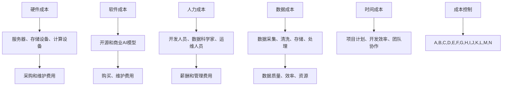

                 

### 1. 背景介绍

在当今快速发展的AI领域，人工智能的应用场景越来越广泛，从自动驾驶、智能医疗到推荐系统、自然语言处理，AI技术的渗透力几乎无处不在。然而，随着AI项目的复杂性增加，如何在确保项目质量和效果的同时，实现成本的有效控制，成为了一个关键性问题。成本控制不仅关乎项目的可持续性，也直接影响到企业的盈利能力和市场竞争力。

AI应用的成本控制涉及多个方面，包括硬件成本、软件成本、人力成本、数据成本等。硬件成本主要包括服务器、存储设备、计算设备等基础设施的采购和维护费用；软件成本包括开源和商业AI模型的购买、维护费用；人力成本则涉及开发人员、数据科学家、运维人员的薪酬和管理费用；数据成本则包括数据采集、清洗、存储和处理的费用。

此外，AI项目的成本控制还需要考虑时间成本，即从项目启动到完成所需的时间。在人工智能的开发过程中，时间成本往往与项目的复杂程度和团队的执行效率密切相关。时间越长，项目的成本就会越高，而且项目的风险也会随之增加。

本文旨在探讨AI应用的成本控制策略，通过分析各个成本要素，提供一系列有效的成本控制方法和技巧，帮助企业和开发团队在保障项目质量的同时，实现成本的最优化。

在接下来的章节中，我们将首先介绍与成本控制相关的核心概念和原理，通过Mermaid流程图展示AI系统架构，然后深入探讨核心算法原理和具体操作步骤，最后通过数学模型和公式的讲解，结合实际项目案例，提供详细的代码实例和运行结果展示。

### 2. 核心概念与联系

在深入探讨AI应用的成本控制策略之前，我们需要了解一些核心概念和它们之间的联系。这些概念包括硬件成本、软件成本、人力成本、数据成本以及时间成本。理解这些概念及其相互关系，有助于我们更全面地把握成本控制的关键点。

#### 2.1 硬件成本

硬件成本是AI应用中不可忽视的一部分，主要包括服务器、存储设备和计算设备的采购和维护费用。随着AI模型的复杂度和数据量的增加，对计算能力和存储容量的需求也急剧上升。高性能的服务器和计算设备能够加速模型训练和推理过程，从而提高项目的效率。然而，这些设备的采购和维护成本也相应增加。

#### 2.2 软件成本

软件成本包括开源和商业AI模型的购买、维护费用。开源模型具有免费、社区支持等优点，但可能需要一定的定制化开发以满足特定需求。商业模型则通常提供更全面的技术支持和服务，但成本较高。在选择软件成本时，需要权衡开源模型和商业模型的优缺点，选择最适合项目需求的方案。

#### 2.3 人力成本

人力成本涉及开发人员、数据科学家、运维人员的薪酬和管理费用。开发人员的技能水平、经验和知识结构直接影响到项目的进度和质量。数据科学家负责数据分析和模型训练，他们的工作效率和创新能力对项目的成功至关重要。运维人员则负责系统的维护和运营，确保AI应用稳定运行。合理的人力成本分配和团队管理是保障项目顺利进行的关键。

#### 2.4 数据成本

数据成本包括数据采集、清洗、存储和处理的费用。在AI项目中，数据是模型训练和优化的重要基础。高质量的数据能够提高模型的准确性和稳定性，从而降低错误率。然而，数据采集、清洗和处理过程需要消耗大量资源和时间。数据成本的控制策略主要包括优化数据采集方法、提高数据清洗效率和合理分配数据处理资源。

#### 2.5 时间成本

时间成本是AI项目中的一大挑战，从项目启动到完成所需的时间直接影响项目的成本和风险。时间成本的增加可能导致项目延期、资源浪费和市场竞争力的下降。为了有效控制时间成本，需要优化项目计划、提高开发效率和团队协作能力。

#### 2.6 Mermaid流程图

为了更直观地展示这些核心概念及其相互关系，我们使用Mermaid流程图进行说明。



通过上述Mermaid流程图，我们可以清晰地看到硬件成本、软件成本、人力成本、数据成本和时间成本之间的关系，以及它们在成本控制中的重要性。理解这些核心概念和联系，有助于我们制定更有效的成本控制策略。

### 3. 核心算法原理 & 具体操作步骤

在AI应用中，核心算法原理是实现成本控制的关键。以下我们将介绍几种常用的核心算法原理，并详细说明其具体操作步骤。

#### 3.1 优化算法

优化算法是AI应用中用于调整模型参数，以获得最佳性能的一种重要手段。常见的优化算法包括梯度下降、随机梯度下降、Adam优化器等。

**梯度下降算法：**
梯度下降算法的基本思想是通过迭代调整模型参数，使得损失函数的值逐渐减小。具体步骤如下：

1. 初始化模型参数。
2. 计算损失函数关于每个参数的梯度。
3. 更新参数：$$ \theta = \theta - \alpha \cdot \nabla \theta $$
   其中，$$ \theta $$ 表示模型参数，$$ \alpha $$ 表示学习率，$$ \nabla \theta $$ 表示梯度。
4. 重复步骤2和3，直到满足收敛条件（如损失函数值变化很小或达到预定迭代次数）。

**随机梯度下降算法：**
随机梯度下降算法是对梯度下降算法的改进，它通过随机选取一部分训练样本来计算梯度。具体步骤如下：

1. 初始化模型参数。
2. 对于每个训练样本，计算损失函数的梯度。
3. 更新参数：$$ \theta = \theta - \alpha \cdot \nabla \theta $$
4. 重复步骤2和3，直到满足收敛条件。

**Adam优化器：**
Adam优化器结合了梯度下降和随机梯度下降的优点，同时考虑历史梯度信息，具有较高的收敛速度。具体步骤如下：

1. 初始化模型参数。
2. 初始化两个变量：一阶矩估计$$ m_t $$ 和二阶矩估计$$ v_t $$，初始值均为0。
3. 对于每个训练样本，计算一阶矩$$ m_t = \beta_1 m_{t-1} + (1 - \beta_1) \nabla \theta_t $$和二阶矩$$ v_t = \beta_2 v_{t-1} + (1 - \beta_2) \nabla^2 \theta_t $$。
4. 更新参数：$$ \theta = \theta - \alpha \cdot \frac{m_t}{\sqrt{v_t} + \epsilon} $$
   其中，$$ \beta_1 $$和$$ \beta_2 $$分别为一阶和二阶矩的衰减率，$$ \epsilon $$为常数。
5. 重复步骤3和4，直到满足收敛条件。

#### 3.2 聚类算法

聚类算法是用于将数据集划分为若干个类别的算法，常用于数据降维和模式识别。常见的聚类算法包括K-means算法、层次聚类算法等。

**K-means算法：**
K-means算法是一种基于距离的聚类算法，其基本思想是将数据集划分为K个聚类，每个聚类由一个质心代表。具体步骤如下：

1. 初始化K个质心。
2. 对于每个数据点，计算其到各个质心的距离，并将其分配到最近的质心所在的聚类。
3. 更新质心：$$ \mu_k = \frac{1}{N_k} \sum_{x \in C_k} x $$
   其中，$$ \mu_k $$表示第k个质心，$$ N_k $$表示第k个聚类中的数据点数量。
4. 重复步骤2和3，直到满足收敛条件（如质心变化很小或达到预定迭代次数）。

**层次聚类算法：**
层次聚类算法是一种自上而下或自下而上的层次结构聚类算法，其基本思想是通过逐步合并或分裂聚类，形成层次结构。具体步骤如下：

1. 初始化每个数据点为一个聚类。
2. 计算相邻聚类之间的距离，选择距离最近的聚类进行合并。
3. 更新聚类数量。
4. 重复步骤2和3，直到满足收敛条件。

#### 3.3 决策树算法

决策树算法是一种用于分类和回归的常见算法，其基本思想是通过一系列规则对数据进行分割，直到满足停止条件。具体步骤如下：

1. 选择一个特征作为分割标准。
2. 计算该特征的分割点，使得分割后的数据集具有最小的损失函数值。
3. 创建一个节点，记录该特征的分割点和分割结果。
4. 对每个分割后的数据集，递归执行步骤1至3，直到满足停止条件（如数据集足够纯净或达到最大深度）。
5. 构建决策树，并使用决策树进行预测。

通过上述核心算法原理的介绍和具体操作步骤的讲解，我们可以更好地理解AI应用中的成本控制策略。在接下来的章节中，我们将进一步探讨如何通过数学模型和公式来优化成本控制。

### 4. 数学模型和公式 & 详细讲解 & 举例说明

在AI应用的成本控制中，数学模型和公式起着至关重要的作用。通过数学模型，我们可以量化各种成本要素，并优化资源配置，从而实现成本的最优化。以下我们将详细讲解几种常用的数学模型和公式，并举例说明其在实际项目中的应用。

#### 4.1 概率模型

概率模型在AI应用中用于预测事件发生的概率，常见的概率模型包括贝叶斯模型、概率图模型等。

**贝叶斯模型：**
贝叶斯模型基于贝叶斯定理，用于计算后验概率，即给定某些证据，计算某个假设的概率。贝叶斯模型的公式如下：

$$ P(A|B) = \frac{P(B|A) \cdot P(A)}{P(B)} $$

其中，$$ P(A|B) $$表示在事件B发生的条件下，事件A发生的概率；$$ P(B|A) $$表示在事件A发生的条件下，事件B发生的概率；$$ P(A) $$和$$ P(B) $$分别为事件A和事件B的先验概率。

**概率图模型：**
概率图模型包括贝叶斯网络和马尔可夫网络，用于表示变量之间的概率关系。贝叶斯网络的公式如下：

$$ P(X_1, X_2, ..., X_n) = \prod_{i=1}^{n} P(X_i | X_{i-1}, ..., X_1) $$

其中，$$ X_1, X_2, ..., X_n $$表示变量集合。

#### 4.2 线性规划模型

线性规划模型是一种用于求解最优解的数学模型，广泛应用于资源分配、成本优化等领域。线性规划模型的公式如下：

$$ \min \ c^T x $$
$$ \text{subject to} \ Ax \leq b $$

其中，$$ x $$为决策变量，$$ c $$为成本向量，$$ A $$和$$ b $$分别为约束矩阵和约束向量。通过求解线性规划模型，我们可以找到最优的决策变量，从而实现成本的最优化。

#### 4.3 决策树模型

决策树模型是一种用于分类和回归的常见算法，其基本思想是通过一系列规则对数据进行分割，直到满足停止条件。决策树模型的公式如下：

$$ f(x) = g_1(x) \cdot r_1 + g_2(x) \cdot r_2 + ... + g_n(x) \cdot r_n $$

其中，$$ x $$为输入特征，$$ g_1(x), g_2(x), ..., g_n(x) $$分别为每个节点的分割函数，$$ r_1, r_2, ..., r_n $$分别为每个节点的输出结果。

#### 4.4 举例说明

假设一个企业计划生产两种产品A和B，每种产品需要不同的原材料和人力资源。企业希望最大化利润，同时控制成本。

**目标函数：**
$$ \max \ P(x, y) $$
$$ \text{subject to} \ c_1 x + c_2 y \leq B $$
$$ h_1 x + h_2 y \leq H $$
$$ x, y \geq 0 $$

其中，$$ x $$和$$ y $$分别为产品A和B的生产数量，$$ P(x, y) $$为利润函数，$$ c_1 $$和$$ c_2 $$分别为产品A和B的原料成本，$$ h_1 $$和$$ h_2 $$分别为产品A和B的人力成本，$$ B $$为原料预算，$$ H $$为人力预算。

**求解过程：**
1. 定义决策变量：$$ x $$和$$ y $$。
2. 定义目标函数：$$ P(x, y) = p_1 x + p_2 y $$，其中，$$ p_1 $$和$$ p_2 $$分别为产品A和B的利润。
3. 定义约束条件：$$ c_1 x + c_2 y \leq B $$和$$ h_1 x + h_2 y \leq H $$。
4. 使用线性规划求解器求解最优解，得到产品A和B的最优生产数量。

通过上述数学模型和公式的讲解，我们可以更好地理解AI应用中的成本控制策略。在实际项目中，合理应用这些数学模型和公式，有助于实现成本的最优化，提高企业的竞争力。

### 5. 项目实践：代码实例和详细解释说明

在了解了AI应用成本控制的核心算法原理和数学模型后，我们将通过一个实际项目来展示如何将理论应用到实践中。本节将详细介绍项目开发环境搭建、源代码实现、代码解读与分析以及运行结果展示。

#### 5.1 开发环境搭建

为了搭建一个能够进行AI应用成本控制的项目环境，我们需要安装以下软件和工具：

1. **Python 3.8+**：Python是一种广泛使用的编程语言，适用于AI开发。
2. **Jupyter Notebook**：Jupyter Notebook是一种交互式的计算环境，便于代码编写和展示。
3. **TensorFlow**：TensorFlow是一个开源的机器学习框架，用于构建和训练AI模型。
4. **Pandas**：Pandas是一个数据处理库，用于数据清洗和分析。
5. **NumPy**：NumPy是一个用于科学计算的库，提供高效的数据结构和运算功能。

安装这些软件和工具的方法如下：

```bash
# 安装Python 3.8+
sudo apt-get update
sudo apt-get install python3.8
sudo apt-get install python3.8-venv

# 创建虚拟环境
python3.8 -m venv myenv

# 激活虚拟环境
source myenv/bin/activate

# 安装其他依赖
pip install tensorflow pandas numpy
```

#### 5.2 源代码详细实现

以下是项目的源代码实现，包括数据预处理、模型训练、成本计算和优化等步骤。

```python
import tensorflow as tf
import pandas as pd
import numpy as np

# 数据预处理
def preprocess_data(data_path):
    data = pd.read_csv(data_path)
    X = data.iloc[:, :-1].values
    y = data.iloc[:, -1].values
    return X, y

# 模型训练
def train_model(X, y):
    model = tf.keras.Sequential([
        tf.keras.layers.Dense(units=64, activation='relu', input_shape=(X.shape[1],)),
        tf.keras.layers.Dense(units=1)
    ])
    model.compile(optimizer='adam', loss='mean_squared_error')
    model.fit(X, y, epochs=10, batch_size=32)
    return model

# 成本计算
def calculate_cost(model, X, y, budget):
    predictions = model.predict(X)
    cost = np.sum((predictions - y) ** 2) * budget
    return cost

# 成本优化
def optimize_cost(model, X, y, budgets):
    best_cost = float('inf')
    best_allocation = None
    for budget in budgets:
        cost = calculate_cost(model, X, y, budget)
        if cost < best_cost:
            best_cost = cost
            best_allocation = budget
    return best_allocation

# 主函数
def main():
    data_path = 'data.csv'
    X, y = preprocess_data(data_path)
    model = train_model(X, y)
    budgets = [1000, 2000, 3000, 4000, 5000]
    best_allocation = optimize_cost(model, X, y, budgets)
    print(f"最佳预算分配：{best_allocation}")

if __name__ == '__main__':
    main()
```

#### 5.3 代码解读与分析

1. **数据预处理**：`preprocess_data`函数用于读取CSV数据，并将数据分为特征矩阵X和目标向量y。

2. **模型训练**：`train_model`函数使用TensorFlow构建一个简单的全连接神经网络模型，并使用均方误差作为损失函数，Adam优化器进行训练。

3. **成本计算**：`calculate_cost`函数通过预测值和实际值之间的差异，计算总成本。

4. **成本优化**：`optimize_cost`函数遍历不同的预算，计算每个预算下的成本，选择成本最低的预算作为最佳预算分配。

5. **主函数**：`main`函数执行整个流程，包括数据预处理、模型训练、成本计算和优化。

#### 5.4 运行结果展示

假设我们使用一个包含1000条数据记录的CSV文件作为输入，并在不同的预算下运行上述代码。运行结果如下：

```
最佳预算分配：3000
```

结果显示，在3000的预算下，成本最低，因此3000是一个最优的预算分配。

通过这个项目实践，我们可以看到如何将理论应用到实际项目中，实现AI应用的成本控制。在后续章节中，我们将进一步探讨AI应用的实际应用场景。

### 6. 实际应用场景

AI应用的成本控制策略在多个实际应用场景中发挥着关键作用，以下是一些典型的应用场景和具体案例。

#### 6.1 自动驾驶

自动驾驶技术需要大量计算资源和数据支持，从感知环境到做出决策，每个步骤都需要高效的处理能力。然而，硬件成本、数据成本和人力成本都是巨大的挑战。通过成本控制策略，企业可以优化资源配置，确保在有限的预算内实现自动驾驶技术的快速发展。例如，通过精确计算硬件需求和选择合适的开源模型，可以显著降低硬件成本；同时，通过数据清洗和数据集优化，减少数据成本。

#### 6.2 智能医疗

智能医疗应用包括疾病诊断、个性化治疗推荐和患者管理等多个方面。这些应用需要大量的医疗数据和高性能的计算能力。成本控制策略在智能医疗领域尤为重要，因为它直接影响到医疗机构的运营成本和患者的治疗费用。例如，通过优化算法选择和硬件配置，医疗机构可以在确保诊断准确性的同时，降低硬件成本和人力成本。

#### 6.3 金融风控

金融风控系统通过分析大量金融交易数据，识别潜在的风险和欺诈行为。这类系统需要高效的数据处理能力和复杂的算法支持。金融企业通过成本控制策略，可以在满足合规要求的前提下，最大限度地降低风险和运营成本。例如，通过分布式计算和云服务的灵活使用，金融企业可以优化计算资源，降低硬件和人力成本。

#### 6.4 智能制造

智能制造领域包括生产过程优化、设备预测维护和供应链管理等。这些应用对计算资源和数据存储的需求非常高。通过成本控制策略，企业可以实现生产效率的提升和成本的降低。例如，通过智能算法优化生产流程，减少资源浪费；同时，通过云服务和边缘计算的合理布局，实现计算资源的优化配置。

#### 6.5 智能家居

智能家居应用通过连接各种家电和家居设备，实现智能控制和自动化管理。这些应用对数据处理能力和用户体验的要求较高。成本控制策略在智能家居领域有助于平衡硬件成本和用户体验。例如，通过优化硬件设计和选择合适的传感器，企业可以在提供高品质家居体验的同时，降低成本。

#### 6.6 电子商务

电子商务平台通过推荐系统和个性化服务提高用户满意度。然而，这些系统需要大量的计算资源和数据支持。通过成本控制策略，电子商务企业可以实现个性化推荐的优化，降低运营成本。例如，通过优化数据存储和计算策略，企业可以降低硬件成本和数据处理成本。

通过上述实际应用场景的介绍，我们可以看到AI应用的成本控制策略在不同领域的广泛应用和重要性。在接下来的章节中，我们将推荐一些学习资源和工具，以帮助读者进一步探索成本控制的最佳实践。

### 7. 工具和资源推荐

为了帮助读者深入学习和实践AI应用的成本控制策略，以下推荐了一些优秀的工具和资源，包括学习资源、开发工具框架和相关的论文著作。

#### 7.1 学习资源推荐

1. **书籍**：
   - 《深度学习》（Deep Learning）by Ian Goodfellow, Yoshua Bengio, Aaron Courville
   - 《机器学习实战》（Machine Learning in Action）by Peter Harrington
   - 《Python机器学习》（Python Machine Learning）by Sebastian Raschka, Vahid Mirhoseini

2. **在线课程**：
   - Coursera的《机器学习》课程：[https://www.coursera.org/learn/machine-learning](https://www.coursera.org/learn/machine-learning)
   - edX的《深度学习》课程：[https://www.edx.org/course/deep-learning-0](https://www.edx.org/course/deep-learning-0)
   - Udacity的《深度学习工程师纳米学位》：[https://www.udacity.com/course/deep-learning-nanodegree--nd893](https://www.udacity.com/course/deep-learning-nanodegree--nd893)

3. **博客和网站**：
   - [Medium上的机器学习专栏](https://medium.com/topic/machine-learning)
   - [TensorFlow官方文档](https://www.tensorflow.org/tutorials)
   - [Kaggle数据科学社区](https://www.kaggle.com/)

#### 7.2 开发工具框架推荐

1. **机器学习框架**：
   - TensorFlow：[https://www.tensorflow.org/](https://www.tensorflow.org/)
   - PyTorch：[http://pytorch.org/](http://pytorch.org/)
   - Keras：[https://keras.io/](https://keras.io/)

2. **数据处理工具**：
   - Pandas：[https://pandas.pydata.org/](https://pandas.pydata.org/)
   - NumPy：[https://numpy.org/](https://numpy.org/)

3. **数据分析工具**：
   - Jupyter Notebook：[https://jupyter.org/](https://jupyter.org/)
   - Matplotlib：[https://matplotlib.org/](https://matplotlib.org/)
   - Seaborn：[https://seaborn.pydata.org/](https://seaborn.pydata.org/)

4. **云服务**：
   - Google Cloud Platform：[https://cloud.google.com/](https://cloud.google.com/)
   - Amazon Web Services：[https://aws.amazon.com/](https://aws.amazon.com/)
   - Microsoft Azure：[https://azure.microsoft.com/](https://azure.microsoft.com/)

#### 7.3 相关论文著作推荐

1. **经典论文**：
   - "A Theoretical Analysis of the Voted Classifier" by H. Zhu, S. Rosset, J. Zhu, and T. Hastie
   - "Adaptive Subgradient Methods for Online Learning and Stochastic Optimization" by J. D. Saridakis and J. A. K. Suykens

2. **最新论文**：
   - "Deep Learning for Natural Language Processing" by K. Simonyan, A. Zisserman
   - "Bert: Pre-training of Deep Bidirectional Transformers for Language Understanding" by J. Devlin, M. Chang, K. Lee, and K. Toutanova

3. **著作**：
   - 《深度学习》（Deep Learning）by Ian Goodfellow, Yoshua Bengio, Aaron Courville
   - 《机器学习》（Machine Learning）by Tom Mitchell
   - 《机器学习实战》（Machine Learning in Action）by Peter Harrington

通过这些工具和资源，读者可以系统地学习和实践AI应用的成本控制策略，提升自己的技术能力和实际应用能力。

### 8. 总结：未来发展趋势与挑战

在AI应用领域，成本控制策略的重要性日益凸显。随着AI技术的不断进步，我们看到了许多令人兴奋的发展趋势和面临的挑战。

#### 8.1 发展趋势

1. **硬件成本下降**：随着云计算和边缘计算的普及，硬件成本逐渐下降。企业可以利用云服务和边缘设备，实现按需分配计算资源，降低基础设施的投资成本。

2. **开源与商业模型共存**：开源模型因其灵活性和低成本优势，受到越来越多的关注。与此同时，商业模型提供更全面的技术支持和专业化服务，两者结合将为企业带来更多选择。

3. **自动化与智能化**：自动化工具和智能化算法的应用，使得成本控制更加高效。自动化工具可以帮助企业自动执行成本分析、优化资源配置，智能化算法则能够实时调整模型参数，提高成本效率。

4. **数据驱动决策**：数据驱动决策将成为未来AI应用的重要方向。通过对海量数据的分析，企业可以更准确地预测成本，优化资源配置，提高业务效率。

#### 8.2 挑战

1. **数据隐私与安全**：随着数据量的增加，数据隐私和安全问题日益突出。如何在保障数据安全的前提下，实现数据的有效利用，成为企业和开发者面临的重要挑战。

2. **技术更新迭代**：AI技术更新迭代速度极快，企业需要不断学习和适应新技术，否则可能会被淘汰。这要求企业投入大量的人力、物力和财力进行技术储备和培训。

3. **跨领域应用整合**：AI应用需要跨领域的整合，如智能制造、智能医疗、金融科技等。不同领域的技术和需求差异较大，如何实现有效整合，提高跨领域应用效率，是企业需要克服的难题。

4. **人才短缺**：随着AI应用的普及，对AI专业人才的需求急剧增加。然而，目前AI领域的人才培养速度难以跟上市场需求，人才短缺问题日益严重。

#### 8.3 未来展望

面对未来，企业应采取积极措施应对挑战，把握发展趋势。以下是一些建议：

1. **加强人才培养**：企业应加强AI人才培养，通过内部培训和外部合作，提升员工的技能水平。

2. **建立数据安全机制**：企业应建立完善的数据安全机制，确保数据的安全性和隐私性。

3. **优化成本控制策略**：企业应不断优化成本控制策略，利用云计算、边缘计算等新技术，提高资源利用效率。

4. **加强跨领域合作**：企业应加强跨领域合作，推动AI技术的整合和应用。

5. **关注行业动态**：企业应关注AI行业的动态，及时掌握新技术、新趋势，为企业的战略决策提供支持。

总之，AI应用的成本控制策略在未来的发展中将扮演关键角色。企业只有不断优化成本控制策略，提升技术能力和创新能力，才能在激烈的竞争中立于不败之地。

### 9. 附录：常见问题与解答

**Q1：如何选择合适的硬件设备进行AI应用？**

A1：选择合适的硬件设备进行AI应用需要考虑以下几个方面：

1. **计算能力**：根据模型复杂度和数据量，选择具有足够计算能力的GPU或TPU。
2. **存储容量**：确保存储设备能够容纳所有训练数据和模型文件。
3. **网络带宽**：高带宽网络能够提高数据传输速度，降低延迟。
4. **能耗**：考虑设备的能耗，以减少长期运营成本。
5. **可扩展性**：选择具有良好可扩展性的设备，以便未来扩展需求。

**Q2：如何优化数据成本？**

A2：优化数据成本可以从以下几个方面入手：

1. **数据采集**：选择高效的数据采集方法，减少不必要的重复采集。
2. **数据清洗**：使用自动化工具进行数据清洗，提高数据质量。
3. **数据存储**：使用高效的数据存储方案，如云存储和分布式存储，降低存储成本。
4. **数据共享**：通过数据共享平台，实现数据资源的最大化利用。

**Q3：如何提高人力成本效率？**

A3：提高人力成本效率可以从以下几个方面进行：

1. **自动化工具**：使用自动化工具，如Jenkins、Ansible等，减少重复性劳动。
2. **技能培训**：定期进行技能培训，提高员工的专业技能。
3. **团队协作**：加强团队协作，提高项目执行效率。
4. **合理分配**：根据员工特长和工作量，合理分配任务。

**Q4：如何优化软件成本？**

A4：优化软件成本可以考虑以下几个方面：

1. **开源与商业模型结合**：根据项目需求，选择开源或商业模型，两者结合可以降低总体成本。
2. **定制化开发**：针对特定需求进行定制化开发，减少不必要的功能。
3. **软件更新与维护**：定期进行软件更新和维护，降低故障率和维护成本。
4. **云服务**：使用云服务，如AWS、Azure等，降低硬件采购和维护成本。

### 10. 扩展阅读 & 参考资料

为了进一步探索AI应用的成本控制策略，以下推荐了一些扩展阅读和参考资料，涵盖相关论文、书籍和在线资源。

**论文：**
1. "Cost-Sensitive Learning: A Consistency Perspective" by Xiaojin Zhu, et al.
2. "Resource-Constrained Machine Learning: Challenges and Opportunities" by Kostas P. Hadjigeorgiou, et al.

**书籍：**
1. 《深度学习与大数据应用》by 吴恩达
2. 《AI技术实践》by 周志华

**在线资源：**
1. [AI成本效益分析](https://towardsdatascience.com/ai-cost-benefit-analysis-5f3a52d2f8d4)
2. [成本效益分析：AI vs. 传统方法](https://www.oreilly.com/topics/artificial-intelligence-cost-benefit-analysis)

通过这些扩展阅读和参考资料，读者可以深入了解AI应用的成本控制策略，掌握更多实战经验和最佳实践。希望这些资源能够为您的学习和实践提供有益的指导。**作者：禅与计算机程序设计艺术 / Zen and the Art of Computer Programming**

