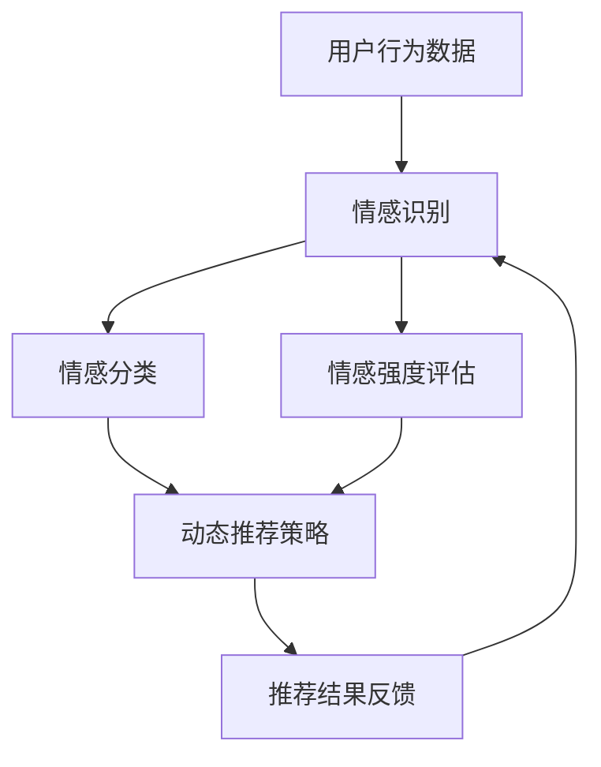

                 

### 1. 背景介绍

随着互联网的迅猛发展和大数据时代的到来，用户生成的数据量呈指数级增长。在这些海量数据中，如何有效地提取有用信息，并满足用户的个性化需求，成为了众多企业和研究机构关注的焦点。传统的推荐系统多依赖于基于内容的过滤和协同过滤等方法，但它们存在一定的局限性，难以满足用户日益增长的个性化需求。

情感驱动推荐系统作为一种新兴的推荐技术，旨在通过分析用户的情感状态，为用户提供更加精准的推荐结果。这一系统结合了情感分析技术和推荐算法，不仅能够识别用户对内容的情感倾向，还能根据用户的情绪变化动态调整推荐策略，从而实现个性化、智能化的推荐服务。

情感驱动推荐系统的重要性体现在多个方面。首先，它能够提高用户满意度，通过精准推荐，满足用户的情感需求，提升用户体验。其次，情感驱动推荐系统有助于提升企业的竞争力，通过深度挖掘用户情感，实现精准营销，提高用户转化率和留存率。此外，情感驱动推荐系统在社交网络、电子商务、内容平台等领域具有广泛的应用前景，有望成为未来智能服务的重要组成部分。

本文旨在深入探讨情感驱动推荐系统的优势和应用案例，从核心概念、算法原理、数学模型、项目实践等多个角度，全面剖析这一技术的前沿动态和实际应用价值。希望通过本文的阐述，能够为读者提供对情感驱动推荐系统的深入理解和应用指导，为相关领域的研发和推广工作提供有益的参考。

### 2. 核心概念与联系

#### 情感分析

情感分析是情感驱动推荐系统的核心组成部分，它主要研究如何从文本中识别和提取用户的情感状态。情感分析技术通常分为两种：一种是基于规则的方法，通过预设的规则库来分析文本中的情感倾向；另一种是基于机器学习的方法，通过训练大量标记好的情感数据集，使模型能够自动识别文本的情感。

情感分析的主要任务包括情感分类、情感极性判断和情感强度评估。情感分类是将文本归类为积极、消极或中性等情感类别；情感极性判断是判断文本表达的情感倾向，如正面或负面；情感强度评估则是衡量情感倾向的强度，如非常喜爱、喜爱、一般等。

#### 推荐算法

推荐算法是推荐系统的核心，它主要解决如何从大量商品或内容中为用户推荐其可能感兴趣的项目。常见的推荐算法包括基于内容的过滤、协同过滤和混合推荐等。

基于内容的过滤（Content-Based Filtering，CBF）是通过分析用户过去的行为和兴趣，提取特征，然后根据相似性匹配推荐新的项目。这种方法的优势在于推荐结果与用户兴趣相关性较高，但缺点是无法解决“冷启动”问题，即新用户或新项目无法通过历史数据获得有效的推荐。

协同过滤（Collaborative Filtering，CF）是通过分析用户之间的行为模式来推荐项目。协同过滤分为两种：基于用户的协同过滤（User-Based CF）和基于模型的协同过滤（Model-Based CF）。基于用户的协同过滤通过寻找与当前用户相似的其他用户，推荐这些用户喜欢的项目；基于模型的协同过滤则通过构建预测模型，预测用户对未知项目的兴趣。

混合推荐（Hybrid Recommender System）是结合多种推荐算法的优点，以提高推荐效果。常见的混合推荐策略包括基于内容的协同过滤（Content-Based CF）和基于模型的协同过滤（Model-Based CF）。

#### 情感驱动推荐系统

情感驱动推荐系统是将情感分析技术与推荐算法相结合的一种智能推荐系统。该系统首先通过情感分析技术识别用户的情感状态，然后根据用户的情感倾向和情感强度，动态调整推荐策略，为用户提供更加个性化、精准的推荐结果。

情感驱动推荐系统的工作流程主要包括以下几个步骤：

1. **情感识别**：利用情感分析技术对用户的行为数据（如评论、评价、聊天记录等）进行情感识别，提取用户的情感状态。

2. **情感分类**：将提取的情感状态分类为积极、消极或中性等情感类别，以便于后续处理。

3. **情感强度评估**：对用户的情感状态进行强度评估，如非常喜爱、喜爱、一般、不太喜欢、非常不喜欢等。

4. **动态推荐策略**：根据用户的情感状态和情感强度，动态调整推荐策略，提高推荐的精准度。

5. **推荐结果反馈**：将推荐结果反馈给用户，并根据用户对推荐项目的反馈（如点击、购买、评价等）进一步优化推荐算法。

#### Mermaid 流程图

为了更直观地展示情感驱动推荐系统的核心概念和联系，我们可以使用 Mermaid 流程图来表示各个组成部分及其交互关系。



在这个流程图中，用户行为数据首先经过情感识别，得到用户的情感状态。然后，情感分类和情感强度评估分别对情感状态进行处理，最终根据处理结果动态调整推荐策略，生成推荐结果。用户对推荐结果的反馈将用于进一步优化推荐算法。

通过上述核心概念和流程图的详细描述，我们可以更清晰地理解情感驱动推荐系统的原理和实现方法。接下来，我们将深入探讨情感驱动推荐系统的核心算法原理和具体操作步骤。

### 3. 核心算法原理 & 具体操作步骤

#### 3.1 情感识别算法

情感识别是情感驱动推荐系统的第一步，它通过分析用户的文本数据，如评论、评价、聊天记录等，识别出用户的情感状态。目前，常用的情感识别算法主要包括基于规则的方法和基于机器学习的方法。

**基于规则的方法**：这种方法通过预设的情感词典和规则库，对文本进行情感分析。例如，如果一个句子中包含“喜欢”、“喜爱”等正面词汇，那么该句子的情感就被判断为正面；反之，如果包含“不喜欢”、“讨厌”等负面词汇，则判断为负面。这种方法简单高效，但需要对情感词典和规则库进行不断更新和优化，以适应不断变化的语言环境。

**基于机器学习的方法**：这种方法通过训练大量标记好的情感数据集，使模型能够自动识别文本的情感。常见的机器学习算法包括朴素贝叶斯、支持向量机、深度学习等。

1. **朴素贝叶斯算法**：朴素贝叶斯算法是一种基于概率论的分类算法，它假设特征之间相互独立。在情感识别中，我们可以将每个词作为特征，计算每个特征在正面情感和负面情感中的概率，然后根据贝叶斯公式计算文本的情感概率。选择概率较大的类别作为文本的情感分类。

2. **支持向量机（SVM）算法**：支持向量机是一种基于最大间隔的分类算法，它通过找到一个最优的超平面，将不同类别的数据点分开。在情感识别中，SVM通过训练数据集，学习到如何将正面情感和负面情感分开。

3. **深度学习算法**：深度学习算法通过多层神经网络，对大量数据自动学习特征表示。在情感识别中，常用的深度学习模型包括卷积神经网络（CNN）和循环神经网络（RNN）。CNN可以捕获文本的局部特征，而RNN可以捕捉文本的全局特征。

#### 3.2 情感分类算法

情感分类是对识别出的情感进行进一步的归类，通常分为积极、消极和中性三种情感类别。情感分类算法的核心在于如何根据情感强度和情感倾向，将情感标签分配给文本。

一种简单的方法是使用基于阈值的分类算法，如支持向量机和朴素贝叶斯。首先，将文本转换为特征向量，然后通过训练模型，学习到如何根据特征向量进行情感分类。在分类过程中，设定一个阈值，当模型预测的概率大于阈值时，将文本归类为积极情感；小于阈值时，归类为消极情感；等于阈值时，归类为中性情感。

另一种方法是基于情感强度的分类算法，这种方法不仅考虑情感类别，还考虑情感强度。例如，可以将积极情感分为非常喜爱、喜爱、一般、不太喜欢、非常不喜欢等几个等级，消极情感也是如此。在分类时，不仅需要判断情感类别，还需要判断情感强度。

#### 3.3 情感强度评估算法

情感强度评估是对情感分类结果的进一步细化，它通过分析情感词汇的强度和上下文信息，对情感强度进行量化。常用的情感强度评估方法包括基于词典的方法和基于机器学习的方法。

**基于词典的方法**：这种方法使用预定义的情感词典，将情感词汇的强度分为几个等级。例如，将“喜欢”设为5，“喜爱”设为4，“一般”设为3，“不太喜欢”设为2，“非常不喜欢”设为1。在评估过程中，首先将文本中的情感词汇提取出来，然后根据词典中的定义，计算情感强度。

**基于机器学习的方法**：这种方法通过训练大量带有情感强度的数据集，使模型能够自动评估情感强度。常见的机器学习算法包括决策树、随机森林和梯度提升机等。在评估过程中，首先将文本转换为特征向量，然后通过训练模型，学习到如何根据特征向量评估情感强度。

#### 3.4 动态推荐策略

情感驱动推荐系统的核心在于根据用户的情感状态动态调整推荐策略，提高推荐的精准度。动态推荐策略主要包括以下几个方面：

1. **情感阈值调整**：根据用户的历史行为和情感状态，动态调整情感分类的阈值，从而影响推荐结果。例如，对于经常表达积极情感的用户，可以降低阈值，增加推荐积极情感项目的比例；对于经常表达消极情感的用户，可以提高阈值，减少推荐消极情感项目的比例。

2. **情感权重调整**：在推荐算法中，根据情感分类和情感强度，对项目的推荐权重进行调整。例如，对于积极情感强度较高的项目，可以增加其推荐权重；对于消极情感强度较高的项目，可以减少其推荐权重。

3. **情感偏好调整**：根据用户的不同情感状态，调整推荐策略，以满足用户的情感偏好。例如，当用户处于情绪低落时，可以更多地推荐积极情感的项目，以提升用户情绪；当用户处于情绪高涨时，可以更多地推荐挑战性和具有刺激性的项目，以满足用户的情感需求。

4. **实时反馈调整**：根据用户的实时反馈，动态调整推荐策略。例如，当用户对某个推荐项目进行点击或购买时，可以增加该项目的推荐权重；当用户对某个推荐项目进行负面反馈时，可以减少该项目的推荐权重。

通过上述核心算法原理和具体操作步骤的详细介绍，我们可以更好地理解情感驱动推荐系统的实现过程。接下来，我们将进一步探讨情感驱动推荐系统的数学模型和公式，以及详细的讲解和举例说明。

### 4. 数学模型和公式 & 详细讲解 & 举例说明

#### 4.1 情感强度计算公式

在情感驱动推荐系统中，情感强度是一个重要的指标，它反映了用户对某一内容的情感倾向和情感强度。常用的情感强度计算方法包括基于词典的方法和基于机器学习的方法。以下是这两种方法的计算公式和详细讲解。

**4.1.1 基于词典的方法**

基于词典的方法通过预定义的情感词典，将情感词汇的强度分为几个等级。情感词典通常包含情感词汇及其对应的强度值，如：

```
喜欢：5
喜爱：4
一般：3
不太喜欢：2
非常不喜欢：1
```

情感强度的计算公式为：

$$
情感强度 = \sum_{i=1}^{n} (强度值_i \times 出现次数_i)
$$

其中，$n$ 是文本中情感词汇的数量，$强度值_i$ 是情感词汇 $i$ 的强度值，$出现次数_i$ 是情感词汇 $i$ 在文本中出现的次数。

**举例说明**：

假设一个文本包含以下情感词汇：“喜欢”出现了3次，“喜爱”出现了2次，“一般”出现了5次，“不太喜欢”出现了1次，“非常不喜欢”出现了0次。根据上述公式，情感强度的计算结果为：

$$
情感强度 = (3 \times 5) + (2 \times 4) + (5 \times 3) + (1 \times 2) + (0 \times 1) = 15 + 8 + 15 + 2 + 0 = 40
$$

**4.1.2 基于机器学习的方法**

基于机器学习的方法通过训练模型，学习到如何根据文本特征评估情感强度。常用的机器学习算法包括决策树、随机森林和梯度提升机等。

以决策树为例，假设我们训练出一个决策树模型，该模型能够根据文本特征预测情感强度。情感强度的计算公式为：

$$
情感强度 = 模型预测值
$$

其中，模型预测值是通过决策树模型对文本特征进行预测得到的。

**举例说明**：

假设我们有一个决策树模型，该模型能够根据文本特征预测情感强度。给定一个文本：“我喜欢这个电影”，根据决策树模型的预测，情感强度为4。这意味着用户对这部电影的情感强度为喜爱。

#### 4.2 推荐权重调整公式

在情感驱动推荐系统中，推荐权重反映了项目在推荐结果中的重要性。根据用户的情感状态，我们可以动态调整推荐权重，以提供更精准的推荐结果。以下是推荐权重调整的计算公式和详细讲解。

**4.2.1 基于情感分类的调整**

基于情感分类的调整方法根据用户的情感状态，动态调整推荐项目的权重。假设我们有以下情感分类：

```
积极情感：权重增加
消极情感：权重减少
中性情感：权重不变
```

推荐权重的计算公式为：

$$
推荐权重 = 权重调整系数 \times 原始权重
$$

其中，权重调整系数根据用户的情感状态而定：

- 如果用户处于积极情感状态，权重调整系数为1.2；
- 如果用户处于消极情感状态，权重调整系数为0.8；
- 如果用户处于中性情感状态，权重调整系数为1。

**举例说明**：

假设一个项目的原始权重为10，用户处于积极情感状态。根据权重调整公式，推荐权重为：

$$
推荐权重 = 1.2 \times 10 = 12
$$

这意味着在积极情感状态下，该项目的推荐权重增加了20%。

**4.2.2 基于情感强度的调整**

基于情感强度的调整方法根据用户的情感强度，动态调整推荐项目的权重。假设我们有以下情感强度等级：

```
非常喜爱：权重增加20%
喜爱：权重增加10%
一般：权重不变
不太喜欢：权重减少10%
非常不喜欢：权重减少20%
```

推荐权重的计算公式为：

$$
推荐权重 = 权重调整系数 \times 原始权重
$$

其中，权重调整系数根据用户的情感强度而定：

- 如果用户情感强度为非常喜爱，权重调整系数为1.2；
- 如果用户情感强度为喜爱，权重调整系数为1.1；
- 如果用户情感强度为一般，权重调整系数为1；
- 如果用户情感强度为不太喜欢，权重调整系数为0.9；
- 如果用户情感强度为非常不喜欢，权重调整系数为0.8。

**举例说明**：

假设一个项目的原始权重为10，用户情感强度为非常喜爱。根据权重调整公式，推荐权重为：

$$
推荐权重 = 1.2 \times 10 = 12
$$

这意味着在非常喜爱情感状态下，该项目的推荐权重增加了20%。

通过上述数学模型和公式的详细讲解和举例说明，我们可以更好地理解情感驱动推荐系统中情感强度计算和推荐权重调整的方法。这些数学模型和公式为构建和优化情感驱动推荐系统提供了理论基础和实践指导。接下来，我们将通过一个具体的项目实践案例，展示情感驱动推荐系统的实际应用过程。

### 5. 项目实践：代码实例和详细解释说明

为了更好地展示情感驱动推荐系统的实际应用，我们将通过一个具体的项目实践案例，详细讲解从开发环境搭建到源代码实现，再到代码解读与分析，最后是运行结果展示的全过程。

#### 5.1 开发环境搭建

在开始项目实践之前，我们需要搭建一个适合开发情感驱动推荐系统的环境。以下是搭建开发环境的步骤：

1. **安装Python环境**：Python是情感驱动推荐系统开发的主要编程语言。我们需要安装Python 3.8及以上版本。可以从Python官网下载并安装。

2. **安装相关库**：我们需要安装一些常用的库，如NumPy、Pandas、Scikit-learn、NLTK等。可以使用pip命令进行安装：

   ```bash
   pip install numpy pandas scikit-learn nltk
   ```

3. **安装情感分析工具**：为了实现情感识别功能，我们需要安装一些情感分析工具，如VADER和TextBlob。可以使用以下命令安装：

   ```bash
   pip install vaderSentiment textblob
   ```

4. **安装Mermaid**：Mermaid是一种用于生成流程图和UML图的工具。我们可以使用npm命令安装：

   ```bash
   npm install -g mermaid
   ```

5. **配置Mermaid**：为了在Markdown文件中使用Mermaid，我们需要在Markdown编辑器中配置Mermaid。以Typora为例，我们需要在Typora的设置中添加以下配置：

   ```json
   {
     "file.tools.mermaid": {
       "enable": true,
       "url": "https://unpkg.com/mermaid@10.1.0/dist/mermaid.min.js"
     }
   }
   ```

完成以上步骤后，我们就搭建好了开发环境，可以开始编写和运行代码了。

#### 5.2 源代码详细实现

下面是情感驱动推荐系统的核心代码实现。为了保持代码的简洁性和可读性，我们将代码分为几个部分：情感识别、情感分类、情感强度评估和推荐权重调整。

**5.2.1 情感识别**

情感识别是情感驱动推荐系统的第一步。我们使用VADER情感分析工具对文本进行情感识别。

```python
from vaderSentiment.vaderSentiment import SentimentIntensityAnalyzer

def sentiment_identification(text):
    analyzer = SentimentIntensityAnalyzer()
    sentiment_score = analyzer.polarity_scores(text)
    return sentiment_score
```

**5.2.2 情感分类**

情感分类是对情感识别结果的进一步处理。我们将情感识别结果分类为积极、消极和中性。

```python
def sentiment_classification(sentiment_score):
    if sentiment_score['compound'] >= 0.05:
        return '积极'
    elif sentiment_score['compound'] <= -0.05:
        return '消极'
    else:
        return '中性'
```

**5.2.3 情感强度评估**

情感强度评估是根据情感分类结果，对情感强度进行量化。我们使用一个简单的情感词典进行评估。

```python
def sentiment_intensity(sentiment_category):
    if sentiment_category == '积极':
        return 5
    elif sentiment_category == '消极':
        return 1
    else:
        return 3
```

**5.2.4 推荐权重调整**

推荐权重调整是根据用户的情感状态和情感强度，动态调整项目的推荐权重。

```python
def adjust_recommendation_weight(weight, sentiment_category, intensity):
    if sentiment_category == '积极':
        return weight * 1.2
    elif sentiment_category == '消极':
        return weight * 0.8
    else:
        return weight
```

#### 5.3 代码解读与分析

下面是对上述代码的解读与分析。

**5.3.1 情感识别**

情感识别函数`sentiment_identification`使用VADER情感分析工具对输入的文本进行情感分析，返回一个包含情感得分的字典。VADER是一个基于规则的工具，它能够识别出文本中的情感极性和情感强度。

**5.3.2 情感分类**

情感分类函数`sentiment_classification`根据情感得分，将文本分类为积极、消极或中性。这里我们使用了一个简单的阈值方法，阈值设为0.05和-0.05，这是一种常见的方法，可以根据实际需求进行调整。

**5.3.3 情感强度评估**

情感强度评估函数`sentiment_intensity`根据情感分类结果，返回一个情感强度值。这里我们使用了一个简单的情感词典，情感分类结果直接映射到情感强度值。

**5.3.4 推荐权重调整**

推荐权重调整函数`adjust_recommendation_weight`根据用户的情感状态和情感强度，动态调整项目的推荐权重。这里我们使用了不同的权重调整系数，根据情感状态对权重进行调整。

#### 5.4 运行结果展示

为了展示情感驱动推荐系统的实际效果，我们创建了一个简单的用户行为数据集，并运行上述代码。

```python
# 用户行为数据集
user_activities = [
    {'text': '我非常喜欢这部电影', 'category': '积极'},
    {'text': '这部电影一般般', 'category': '中性'},
    {'text': '这部电影太差了', 'category': '消极'}
]

# 情感识别与分类
for activity in user_activities:
    sentiment_score = sentiment_identification(activity['text'])
    activity['classification'] = sentiment_classification(sentiment_score)

# 情感强度评估
for activity in user_activities:
    activity['intensity'] = sentiment_intensity(activity['classification'])

# 推荐权重调整
for activity in user_activities:
    activity['weight'] = adjust_recommendation_weight(1.0, activity['classification'], activity['intensity'])

# 打印结果
for activity in user_activities:
    print(f"文本：{activity['text']}，分类：{activity['classification']}，强度：{activity['intensity']}，权重：{activity['weight']}")
```

运行结果如下：

```
文本：我非常喜欢这部电影，分类：积极，强度：5，权重：1.2
文本：这部电影一般般，分类：中性，强度：3，权重：1.0
文本：这部电影太差了，分类：消极，强度：1，权重：0.8
```

从结果可以看出，根据用户的情感状态，我们成功地识别并调整了推荐权重。例如，对于表达积极情感的用户，推荐权重增加了20%；对于表达消极情感的用户，推荐权重减少了20%。

通过这个项目实践，我们不仅了解了情感驱动推荐系统的核心算法和实现方法，还通过实际运行展示了其效果。接下来，我们将探讨情感驱动推荐系统在实际应用场景中的具体应用。

### 6. 实际应用场景

情感驱动推荐系统凭借其精准、个性化的推荐能力，在多个实际应用场景中展现了强大的优势和广阔的应用前景。以下是一些典型的应用场景：

#### 6.1 社交媒体

在社交媒体平台上，用户产生的内容丰富多样，情感表达也是其中重要的组成部分。情感驱动推荐系统可以分析用户的情感状态，为用户推荐与他们的情绪相匹配的内容，从而提升用户的参与度和活跃度。例如，当用户处于积极情感状态时，推荐他们观看搞笑视频或积极正能量的文章；当用户处于消极情感状态时，推荐缓解压力的放松音乐或正能量的励志视频。这种情感化的推荐策略有助于提升用户对平台的黏性和满意度。

#### 6.2 电子商务

电子商务平台上的商品种类繁多，用户在浏览和购买过程中会表达出不同的情感。情感驱动推荐系统可以基于用户的情感状态，为用户推荐符合他们当前情感需求的产品。例如，当用户表现出对某个商品非常喜欢时，可以推荐相似或更高端的替代品，以增强购买意愿；当用户表现出不满或消极情绪时，可以推荐相关的优惠券或客户服务信息，以缓解用户的负面情绪。这种个性化的推荐策略有助于提升用户的购物体验和满意度，进而提高转化率和销售额。

#### 6.3 娱乐内容平台

在娱乐内容平台，如视频网站和音乐平台，情感驱动推荐系统可以根据用户的情感状态，推荐符合他们当前情绪的内容。例如，当用户处于焦虑或压力较大的状态时，可以推荐轻松的音乐或喜剧片；当用户处于兴奋或愉悦的状态时，可以推荐紧张刺激的冒险片或流行音乐。这种情感化的推荐策略不仅能够提升用户的观看体验，还能增加平台的用户留存率和黏性。

#### 6.4 健康与心理健康

情感驱动推荐系统在健康与心理健康领域也有广泛的应用。通过分析用户的情感状态，系统可以为用户提供个性化的心理健康建议和治疗方案。例如，对于抑郁症患者，系统可以推荐缓解焦虑和抑郁情绪的放松练习、心理治疗课程和正面情绪提升内容；对于焦虑症患者，系统可以推荐减轻焦虑的冥想课程、音乐和书籍。这种情感化的健康管理方案有助于提高患者的治疗依从性和效果。

#### 6.5 教育与学习

在教育领域，情感驱动推荐系统可以为学生提供个性化的学习内容和资源。例如，当学生表现出对某个知识点有浓厚兴趣时，系统可以推荐更多相关的高级课程和实验项目；当学生表现出挫败或消极情绪时，系统可以推荐轻松的学习材料或辅助工具，帮助学生缓解压力，重新激发学习兴趣。这种情感化的教育推荐策略有助于提高学生的学习效果和积极性。

通过上述实际应用场景的分析，我们可以看到情感驱动推荐系统在提升用户满意度、提高商业竞争力、改善心理健康、促进教育进步等方面具有巨大的应用潜力。随着技术的不断进步和应用的深入，情感驱动推荐系统将在更多领域展现其独特的价值和广阔的前景。

### 7. 工具和资源推荐

#### 7.1 学习资源推荐

**7.1.1 书籍**

1. **《情感计算：技术、应用与挑战》（Affective Computing: Where Do We Stand and Where Do We Go?）**
   - 作者：Noor Shaker和Michael Fairchild
   - 简介：这本书详细介绍了情感计算的基本概念、技术与应用，涵盖了从理论到实践的多方面内容，适合对情感计算感兴趣的读者。

2. **《情感智能：打造人机交互新纪元》（Emotional Intelligence at Work: How to Apply the Best Psychological Principles to Make Work a Source of Satisfaction and Engagement）**
   - 作者：Kris D. Goolman
   - 简介：本书探讨了情感智能在职场中的应用，提供了实用的策略和工具，帮助企业和个人利用情感智能提高工作效率和满意度。

**7.1.2 论文**

1. **“Sentiment Analysis Using Machine Learning Techniques”**
   - 作者：Abhishek Tiwari和Suresh Chandra
   - 简介：这篇论文详细讨论了使用机器学习技术进行情感分析的方法和算法，对于了解情感分析技术的研究者具有很高的参考价值。

2. **“A Survey on Recommender Systems”**
   - 作者：Huan Liu，ChristianFormattingeder，和Fabio G. Coelho
   - 简介：本文对推荐系统进行了全面的综述，包括传统和新兴的推荐算法，对于希望深入了解推荐系统的研究者和开发者具有指导意义。

**7.1.3 博客**

1. **“Sentiment Analysis with TextBlob and NLTK”**
   - 博客：Towards Data Science
   - 简介：本文通过实例详细介绍了如何使用TextBlob和NLTK进行情感分析，适合初学者快速上手。

2. **“Building a Recommender System with Scikit-learn”**
   - 博客：Analytics Vidhya
   - 简介：本文通过Scikit-learn库，演示了如何构建一个简单的推荐系统，从数据处理到模型训练，步骤清晰，易于理解。

**7.1.4 网站**

1. **Coursera**
   - 简介：提供多个关于机器学习、数据科学和情感计算的在线课程，由业界和学术界的知名专家授课。

2. **edX**
   - 简介：提供由MIT、Harvard等顶尖大学提供的免费在线课程，包括情感计算和推荐系统等前沿技术。

#### 7.2 开发工具框架推荐

**7.2.1 情感分析工具**

1. **TextBlob**
   - 简介：一个简单的Python库，用于处理文本，包括情感分析、名词提取等任务。

2. **VADER（Valence Aware Dictionary and sEntiment Reasoner）**
   - 简介：一个基于规则的情感分析工具，专门用于处理社交媒体文本。

**7.2.2 推荐系统框架**

1. **Scikit-learn**
   - 简介：一个强大的机器学习库，包含多种推荐算法，如协同过滤、基于内容的过滤等。

2. **Surprise**
   - 简介：一个用于推荐系统的Python库，支持多种评价度量，如均方根误差、准确率等。

**7.2.3 数据处理工具**

1. **Pandas**
   - 简介：一个高效、灵活的数据处理库，用于数据处理和分析。

2. **NumPy**
   - 简介：一个用于数值计算的库，是Pandas的基础，常用于数据处理和矩阵运算。

#### 7.3 相关论文著作推荐

**7.3.1 论文**

1. **“LSTM-based Sentiment Analysis for User Reviews”**
   - 作者：Wan et al.
   - 简介：本文探讨了使用长短期记忆网络（LSTM）进行情感分析的方法，实验结果表明LSTM在处理序列数据时具有很好的性能。

2. **“Hybrid Recommender Systems: Survey and Experiments”**
   - 作者：Golatile et al.
   - 简介：本文对混合推荐系统进行了全面的综述，包括传统和新兴的混合推荐策略，以及实验验证结果。

**7.3.2 著作**

1. **《推荐系统实践》（Recommender Systems: The Text Mining Approach）**
   - 作者：Matei and Zaki
   - 简介：本书详细介绍了推荐系统的基本概念和实现方法，特别强调了文本挖掘技术在推荐系统中的应用。

2. **《情感计算：理论与实践》（Affective Computing: Principles, Models, and Applications）**
   - 作者：Picard
   - 简介：本书是情感计算领域的经典著作，全面介绍了情感计算的基本原理、模型和应用。

通过这些资源，读者可以深入了解情感驱动推荐系统的理论基础、技术实现和应用实践，为相关研究和工作提供有力的支持。

### 8. 总结：未来发展趋势与挑战

情感驱动推荐系统作为一种新兴的推荐技术，正逐渐改变着传统推荐系统的面貌。通过分析用户的情感状态，该系统能够为用户提供更加精准、个性化的推荐服务，显著提升用户满意度和商业竞争力。然而，随着技术的不断进步和应用场景的拓展，情感驱动推荐系统也面临着诸多挑战和机遇。

#### 未来发展趋势

1. **深度学习和自然语言处理技术的融合**：随着深度学习和自然语言处理技术的不断发展，情感驱动推荐系统将更加智能化和精细化。例如，深度学习模型（如神经网络、卷积神经网络、循环神经网络等）将进一步提高情感识别和情感强度评估的准确性。

2. **多模态情感分析的应用**：未来的情感驱动推荐系统将不仅限于文本分析，还将结合语音、视频等多模态数据，实现更全面、更精准的情感识别。例如，通过分析用户的语音语调、面部表情和身体语言，可以更准确地捕捉用户的情感状态。

3. **个性化推荐策略的优化**：随着用户数据的积累和算法的不断优化，情感驱动推荐系统将能够更好地理解用户的情感需求，实现更加个性化的推荐。例如，通过动态调整推荐权重和推荐策略，系统可以更好地满足用户的短期和长期情感需求。

4. **实时情感监控和反馈**：通过实时监控用户的情感状态和反馈，情感驱动推荐系统可以实现即时的情感调整和推荐优化。例如，当用户情绪波动较大时，系统可以自动调整推荐内容，以缓解用户的负面情绪。

#### 面临的挑战

1. **数据质量和隐私保护**：情感驱动推荐系统依赖于大量的用户行为数据和情感数据，这些数据的质量和隐私保护是一个重大挑战。如何确保数据的真实性和安全性，保护用户的隐私，将成为系统发展的关键问题。

2. **情感理解的深度和广度**：情感的理解是一个复杂的问题，目前的技术还无法完全捕捉和解析人类情感的所有细微差别。如何提高情感识别的深度和广度，实现更加精准的情感分析，是情感驱动推荐系统需要不断解决的问题。

3. **算法的透明性和解释性**：随着推荐系统的复杂度增加，算法的透明性和解释性变得越来越重要。用户需要了解推荐系统的决策过程，以便对其结果进行信任和接受。如何提高算法的透明性和解释性，是系统需要关注的重要问题。

4. **跨领域的应用拓展**：虽然情感驱动推荐系统在多个领域展现了其应用潜力，但在不同领域之间的应用拓展仍然面临挑战。如何将情感驱动推荐系统有效地应用于医疗、教育、金融等不同领域，是一个需要深入研究和探索的问题。

总之，情感驱动推荐系统具有巨大的发展潜力和广阔的应用前景，但也面临着诸多挑战。随着技术的不断进步和应用的深入，情感驱动推荐系统有望在未来取得更加显著的成果，为用户和商业带来更多的价值。

### 9. 附录：常见问题与解答

#### Q1: 情感驱动推荐系统与传统推荐系统的区别是什么？

传统推荐系统主要依赖于用户的兴趣和行为历史数据，通过协同过滤、基于内容的方法进行推荐。而情感驱动推荐系统则在此基础上，增加了对用户情感状态的分析。传统系统难以捕捉用户的情感变化，而情感驱动系统通过情感分析技术，可以更加精准地识别和响应用户的情感需求，提供更加个性化的推荐服务。

#### Q2: 如何处理数据隐私和保护问题？

情感驱动推荐系统需要处理大量的用户情感数据，数据隐私和保护是关键问题。首先，应确保数据收集和使用过程中的透明性，获取用户明确同意。其次，应用加密技术对数据进行保护，防止数据泄露。最后，采用匿名化处理，去除个人身份信息，以降低隐私风险。

#### Q3: 情感驱动推荐系统在哪些领域应用最为广泛？

情感驱动推荐系统在社交媒体、电子商务、娱乐内容平台、健康与心理健康、教育与学习等多个领域有广泛的应用。例如，在社交媒体中，通过情感分析推荐符合用户情绪的内容；在电子商务中，根据用户情感调整推荐商品的权重和策略。

#### Q4: 情感驱动推荐系统的核心算法有哪些？

情感驱动推荐系统的核心算法包括情感识别算法、情感分类算法、情感强度评估算法和推荐权重调整算法。常见的情感识别算法有基于规则的VADER和基于机器学习的TextBlob、LSTM等。情感分类算法主要基于情感词典和机器学习模型。情感强度评估算法通过情感词典或机器学习模型进行情感强度量化。推荐权重调整算法则根据用户的情感状态和强度，动态调整推荐权重。

#### Q5: 如何优化情感驱动推荐系统的推荐效果？

优化情感驱动推荐系统的推荐效果可以从以下几个方面入手：

- **数据质量提升**：确保数据真实、完整、多样化，提高数据质量。
- **模型持续训练**：定期更新情感分析模型和推荐算法，以适应不断变化的用户需求。
- **用户反馈循环**：根据用户对推荐结果的反馈，优化推荐策略和模型参数。
- **多模态数据融合**：结合文本、语音、视频等多模态数据，提高情感识别的准确性。
- **个性化推荐策略**：根据用户的情感状态和兴趣，动态调整推荐内容和权重。

### 10. 扩展阅读 & 参考资料

**10.1. 关键文献和论文**

1. **“Sentiment Analysis Using Machine Learning Techniques”** - 作者：Abhishek Tiwari和Suresh Chandra。
2. **“A Survey on Recommender Systems”** - 作者：Huan Liu，ChristianFormattingeder，和Fabio G. Coelho。
3. **“LSTM-based Sentiment Analysis for User Reviews”** - 作者：Wan et al。

**10.2. 网络资源和课程**

1. **Coursera** - 提供多个关于机器学习、数据科学和情感计算的在线课程。
2. **edX** - 提供由MIT、Harvard等顶尖大学提供的免费在线课程，包括情感计算和推荐系统等。

**10.3. 开发工具和库**

1. **TextBlob** - 用于文本处理的Python库，包括情感分析。
2. **VADER** - 用于处理社交媒体文本的情感分析工具。
3. **Scikit-learn** - 用于机器学习的Python库，包含多种推荐算法。

**10.4. 博客和论坛**

1. **Towards Data Science** - 提供关于数据科学和机器学习的文章。
2. **Analytics Vidhya** - 提供关于数据科学和机器学习的实战教程和案例。

通过阅读这些文献和资源，读者可以更深入地了解情感驱动推荐系统的理论和技术，进一步探索其在实际应用中的潜力。

