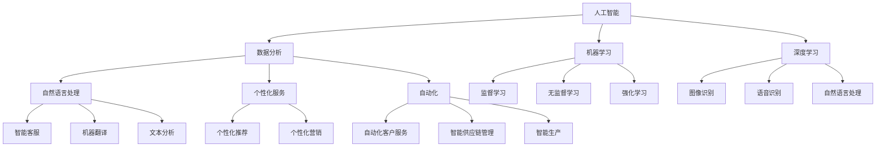

                 

### 背景介绍

随着人工智能技术的迅猛发展，AI 在商业领域的应用日益广泛。企业开始意识到，通过将人工智能技术融入商业模式，可以大大提高运营效率、降低成本并创造新的商业价值。本文旨在探讨 AI 技术与商业模式的创新，分析其核心概念、算法原理、实际应用场景以及未来发展趋势和挑战。

首先，我们需要了解 AI 技术在商业领域的重要性。近年来，AI 技术已经从实验室走向商业应用，成为企业提升竞争力的重要工具。通过数据分析和机器学习，企业能够更好地理解客户需求、优化产品和服务、预测市场趋势，从而实现业务增长和盈利能力提升。例如，金融行业通过 AI 技术实现自动化风控、精准营销和智能投顾；零售行业利用 AI 技术进行库存管理、智能推荐和个性化服务；医疗行业借助 AI 技术提升疾病诊断准确率、优化治疗方案。

其次，本文将讨论 AI 技术与商业模式的创新联系。商业模式创新指的是通过引入新技术或改变现有技术，创造新的业务模式或服务方式，从而实现商业价值。AI 技术在商业模式创新中扮演着关键角色，它能够帮助企业实现自动化、智能化和个性化，从而提高运营效率和用户体验。例如，基于 AI 的自动化客户服务系统、智能供应链管理、个性化营销等，都是商业模式创新的典型例子。

接下来，本文将介绍 AI 技术的核心算法原理和具体操作步骤。AI 技术主要包括机器学习、深度学习、自然语言处理等。机器学习是一种让计算机通过学习数据来发现规律和模式的方法，它包括监督学习、无监督学习和强化学习。深度学习是机器学习的一个子领域，它使用多层神经网络来提取复杂数据的特征。自然语言处理则是让计算机理解和生成人类语言的技术，它广泛应用于智能客服、机器翻译、文本分析等领域。

在数学模型和公式部分，我们将详细讲解 AI 技术中的关键数学模型，如线性回归、逻辑回归、神经网络等。这些模型不仅用于训练 AI 模型，还用于评估和优化模型的性能。例如，线性回归用于预测连续值输出，逻辑回归用于预测分类结果，神经网络用于处理复杂数据特征。

在项目实践部分，我们将通过具体代码实例，展示如何使用 AI 技术解决实际问题。例如，我们可能会实现一个智能推荐系统，它能够根据用户历史行为数据，为用户推荐个性化的产品和服务。在代码解读与分析部分，我们将详细解释代码的实现过程和关键点，帮助读者理解 AI 技术的应用。

此外，本文还将探讨 AI 技术的实际应用场景，包括金融、零售、医疗、制造业等。我们将分析这些行业如何利用 AI 技术实现商业模式的创新，并分享一些成功案例。

最后，本文将总结 AI 技术与商业模式的创新发展趋势和挑战。随着技术的不断进步，AI 将在更多领域得到应用，推动商业模式的持续创新。然而，AI 技术的发展也面临着数据隐私、伦理和法律等挑战。企业需要在这些方面进行权衡，确保 AI 技术的可持续发展。

总之，AI 技术与商业模式的创新是一个充满机遇和挑战的领域。通过本文的探讨，希望能够帮助读者更好地理解这一领域，为企业的 AI 应用提供有益的启示。

### 核心概念与联系

在探讨 AI 技术与商业模式的创新之前，我们需要明确一些核心概念，并理解它们之间的联系。以下是本文将涉及的主要概念：

#### 1. 人工智能（AI）
人工智能是指计算机系统模拟人类智能行为的技术，包括学习、推理、问题解决、自然语言理解和图像识别等。AI 可以分为弱 AI 和强 AI，弱 AI 具有特定任务的能力，而强 AI 则具备全面的人类智能。

#### 2. 商业模式
商业模式是指企业如何创造、传递和捕获价值的系统性方法。它包括产品或服务的提供方式、目标市场、收入来源、成本结构和盈利模式等。

#### 3. 数据分析
数据分析是指使用统计和数学方法，从大量数据中提取有价值的信息和知识。数据分析是 AI 技术的重要组成部分，它为机器学习和深度学习提供了训练数据和算法优化的依据。

#### 4. 机器学习
机器学习是 AI 的一个子领域，它关注如何让计算机系统自动地从数据中学习并做出预测或决策。机器学习包括监督学习、无监督学习和强化学习等不同类型。

#### 5. 深度学习
深度学习是机器学习的一个分支，它使用多层神经网络来模拟人脑处理信息的方式。深度学习在图像识别、语音识别和自然语言处理等领域取得了显著的成果。

#### 6. 自然语言处理（NLP）
自然语言处理是 AI 技术的一个子领域，它研究如何让计算机理解和生成人类语言。NLP 广泛应用于智能客服、机器翻译和文本分析等领域。

#### 7. 个性化服务
个性化服务是指根据用户的历史行为和偏好，提供定制化的产品或服务。个性化服务是提高客户满意度和忠诚度的重要手段。

#### 8. 自动化
自动化是指使用计算机系统和软件，减少人工干预，提高生产效率和服务质量。自动化是 AI 技术在商业领域的一个重要应用。

#### 关系与联系

上述核心概念之间存在着密切的联系：

- 人工智能技术，如机器学习和深度学习，为数据分析提供了强大的工具和算法。
- 数据分析为 AI 技术提供了训练数据和模型优化的依据，是 AI 技术发展的基础。
- 商业模式利用 AI 技术实现个性化服务和自动化，提高运营效率和客户满意度。
- 自然语言处理技术使 AI 能够与人类进行自然交互，拓展了 AI 技术的应用场景。

为了更好地理解这些概念之间的联系，我们可以使用 Mermaid 流程图来展示它们之间的关系。以下是一个简化的 Mermaid 流程图：



这个流程图展示了人工智能技术如何通过数据分析、机器学习和自然语言处理等技术，实现个性化服务和自动化，从而创新商业模式。

### 核心算法原理 & 具体操作步骤

为了深入理解 AI 技术在商业领域的应用，我们需要掌握一些核心算法的原理和具体操作步骤。以下是几个常见的 AI 算法及其应用场景：

#### 1. 线性回归

线性回归是一种用于预测连续值的监督学习算法。它的基本原理是通过找到一个最佳拟合直线，将输入特征映射到目标值。

**具体操作步骤：**

1. 数据预处理：对输入数据进行标准化或归一化处理，以消除不同特征之间的量纲差异。
2. 模型构建：定义一个线性模型，通常采用最小二乘法求解最佳拟合直线。
3. 模型训练：使用训练数据集，通过梯度下降等优化算法，调整模型参数。
4. 模型评估：使用测试数据集，计算预测误差，评估模型性能。

**应用场景：** 线性回归常用于预测销售量、股价等连续值数据。

#### 2. 逻辑回归

逻辑回归是一种用于预测分类结果的监督学习算法。它的基本原理是通过逻辑函数将输入特征映射到概率值。

**具体操作步骤：**

1. 数据预处理：对输入数据进行标准化或归一化处理。
2. 模型构建：定义一个逻辑回归模型，通常使用 sigmoid 函数。
3. 模型训练：使用训练数据集，通过最大似然估计法求解模型参数。
4. 模型评估：使用测试数据集，计算预测准确率等指标。

**应用场景：** 逻辑回归常用于信用评分、疾病预测等分类问题。

#### 3. 神经网络

神经网络是一种模拟人脑神经元结构和功能的计算模型。它通过多层神经网络来提取复杂数据的特征。

**具体操作步骤：**

1. 数据预处理：对输入数据进行标准化或归一化处理。
2. 模型构建：定义多层神经网络结构，包括输入层、隐藏层和输出层。
3. 模型训练：使用训练数据集，通过反向传播算法，调整模型参数。
4. 模型评估：使用测试数据集，计算预测误差和模型性能。

**应用场景：** 神经网络广泛应用于图像识别、语音识别和自然语言处理等领域。

#### 4. 决策树

决策树是一种基于特征划分数据的分类算法。它的基本原理是通过一系列二分决策，将数据划分为不同的类别。

**具体操作步骤：**

1. 数据预处理：对输入数据进行预处理，如缺失值填充、异常值处理等。
2. 特征选择：选择具有区分能力的特征进行划分。
3. 模型构建：递归地构建决策树，直到满足停止条件。
4. 模型评估：使用测试数据集，计算预测准确率等指标。

**应用场景：** 决策树常用于分类问题，如客户细分、信用评估等。

#### 5. 支持向量机（SVM）

支持向量机是一种用于分类和回归的监督学习算法。它的基本原理是通过找到一个最佳超平面，最大化分类边界。

**具体操作步骤：**

1. 数据预处理：对输入数据进行标准化或归一化处理。
2. 特征选择：选择具有区分能力的特征。
3. 模型构建：使用支持向量机算法，求解最佳超平面。
4. 模型评估：使用测试数据集，计算预测准确率等指标。

**应用场景：** 支持向量机常用于图像分类、文本分类等分类问题。

这些算法在商业领域有广泛的应用，如客户细分、信用评分、销售预测等。企业可以根据具体业务需求，选择合适的算法进行应用。

### 数学模型和公式 & 详细讲解 & 举例说明

在深入探讨 AI 技术与商业模式的创新过程中，理解相关的数学模型和公式是至关重要的。以下我们将介绍几个核心的数学模型，并详细讲解其原理和应用。为了更好地理解，每个模型都会伴随一个具体示例。

#### 1. 线性回归模型

线性回归是一种用于预测连续值的监督学习算法，其基本公式如下：

$$y = \beta_0 + \beta_1 \cdot x + \epsilon$$

其中，\(y\) 是预测值，\(x\) 是输入特征，\(\beta_0\) 和 \(\beta_1\) 是模型参数，\(\epsilon\) 是误差项。

**示例：** 假设我们想要预测某个城市明天的温度。我们可以将今天的温度作为输入特征 \(x\)，明天的温度作为预测值 \(y\)。通过收集历史数据，我们可以使用最小二乘法来求解模型参数：

1. **数据预处理**：对温度数据进行标准化处理，使其具有相同的量纲。
2. **模型构建**：定义线性回归模型，使用最小二乘法求解参数。
3. **模型训练**：使用历史数据集，通过最小二乘法计算参数 \(\beta_0\) 和 \(\beta_1\)。
4. **模型评估**：使用测试数据集，计算预测误差，评估模型性能。

具体计算过程如下：

给定训练数据集 \((x_1, y_1), (x_2, y_2), ..., (x_n, y_n)\)，我们使用最小二乘法求解模型参数：

$$\beta_0 = \bar{y} - \beta_1 \bar{x}$$

$$\beta_1 = \frac{\sum_{i=1}^{n}(x_i - \bar{x})(y_i - \bar{y})}{\sum_{i=1}^{n}(x_i - \bar{x})^2}$$

其中，\(\bar{x}\) 和 \(\bar{y}\) 分别是输入特征和预测值的平均值。

#### 2. 逻辑回归模型

逻辑回归是一种用于预测分类结果的监督学习算法，其基本公式如下：

$$P(y=1) = \frac{1}{1 + \exp(-\beta_0 - \beta_1 \cdot x)}$$

其中，\(P(y=1)\) 是预测某样本属于类别 1 的概率，\(\beta_0\) 和 \(\beta_1\) 是模型参数。

**示例：** 假设我们想要预测一个病人的疾病是否为癌症（类别 1），我们可以使用逻辑回归模型。输入特征可以是病人的年龄、性别、症状等。

1. **数据预处理**：对特征数据进行标准化处理。
2. **模型构建**：定义逻辑回归模型，使用最大似然估计法求解参数。
3. **模型训练**：使用训练数据集，通过最大似然估计法计算参数 \(\beta_0\) 和 \(\beta_1\)。
4. **模型评估**：使用测试数据集，计算预测准确率等指标。

具体计算过程如下：

给定训练数据集 \((x_1, y_1), (x_2, y_2), ..., (x_n, y_n)\)，我们使用最大似然估计法求解参数：

$$\beta_0 = \frac{\sum_{i=1}^{n} y_i x_i - \bar{y} \bar{x}}{\sum_{i=1}^{n} x_i - \bar{x}}$$

$$\beta_1 = \frac{\sum_{i=1}^{n} y_i x_i^2 - \bar{y} \bar{x}^2}{\sum_{i=1}^{n} x_i^2 - \bar{x}^2}$$

#### 3. 神经网络模型

神经网络是一种模拟人脑神经元结构和功能的计算模型，其基本结构包括输入层、隐藏层和输出层。每个神经元之间的连接权重可以通过反向传播算法进行调整。

**示例：** 假设我们想要使用神经网络进行图像识别，输入层包含 784 个神经元（28x28 像素），隐藏层包含 100 个神经元，输出层包含 10 个神经元（代表 10 个类别）。

1. **数据预处理**：对图像数据进行归一化处理，使其具有相同的范围。
2. **模型构建**：定义神经网络结构，包括输入层、隐藏层和输出层。
3. **模型训练**：使用训练数据集，通过反向传播算法调整权重。
4. **模型评估**：使用测试数据集，计算预测准确率等指标。

具体计算过程如下：

假设输入层为 \(x = [x_1, x_2, ..., x_n]\)，隐藏层为 \(h = [h_1, h_2, ..., h_m]\)，输出层为 \(y = [y_1, y_2, ..., y_k]\)。

1. **前向传播**：计算隐藏层的激活值 \(h\) 和输出层的预测值 \(y\)：

$$h = \sigma(W_1x + b_1)$$

$$y = \sigma(W_2h + b_2)$$

其中，\(\sigma\) 是激活函数，\(W_1\) 和 \(W_2\) 是权重矩阵，\(b_1\) 和 \(b_2\) 是偏置项。

2. **反向传播**：计算权重矩阵和偏置项的梯度，并更新模型参数：

$$\delta_h = (y - \hat{y}) \odot \sigma'(h)$$

$$\delta_x = (h - \hat{h}) \odot \sigma'(x)$$

$$\Delta W_1 = \delta_h^T x$$

$$\Delta b_1 = \delta_h$$

$$\Delta W_2 = \delta_h^T h$$

$$\Delta b_2 = \delta_h$$

通过上述步骤，我们可以逐步调整神经网络模型，使其在训练数据集上达到较好的预测性能。

#### 4. 支持向量机模型

支持向量机是一种用于分类和回归的监督学习算法，其基本公式如下：

$$f(x) = \sum_{i=1}^{n} \alpha_i y_i (w \cdot x_i) + b$$

其中，\(x\) 是输入特征，\(w\) 是权重向量，\(b\) 是偏置项，\(\alpha_i\) 是 Lagrange 乘子。

**示例：** 假设我们想要使用支持向量机进行图像分类，输入层包含 784 个神经元，输出层包含 10 个神经元。

1. **数据预处理**：对图像数据进行归一化处理。
2. **模型构建**：定义支持向量机模型，使用拉格朗日乘子法求解权重和偏置项。
3. **模型训练**：使用训练数据集，通过拉格朗日乘子法优化模型参数。
4. **模型评估**：使用测试数据集，计算预测准确率等指标。

具体计算过程如下：

给定训练数据集 \((x_1, y_1), (x_2, y_2), ..., (x_n, y_n)\)，我们使用拉格朗日乘子法求解模型参数：

$$L(w, b, \alpha) = \frac{1}{2} ||w||^2 - \sum_{i=1}^{n} \alpha_i [y_i (w \cdot x_i) - 1]$$

$$\alpha_i \geq 0, \forall i$$

通过求解上述拉格朗日乘子法，我们可以得到最优的权重向量 \(w\) 和偏置项 \(b\)。

通过上述数学模型和公式的介绍，我们可以看到 AI 技术在商业领域的应用具有坚实的理论基础。企业可以根据具体业务需求，选择合适的算法和模型，实现商业模式的创新。

### 项目实践：代码实例和详细解释说明

在本节中，我们将通过一个实际项目来展示如何使用 AI 技术解决商业问题。我们选择一个常见的商业应用场景：基于用户行为数据的个性化推荐系统。这个系统将使用机器学习和深度学习算法，从用户的历史行为中提取特征，为用户提供个性化的产品推荐。

#### 1. 开发环境搭建

要开发这个个性化推荐系统，我们需要以下开发环境：

- Python（3.8及以上版本）
- Jupyter Notebook（用于编写和运行代码）
- Scikit-learn（用于机器学习算法）
- TensorFlow/Keras（用于深度学习算法）
- Pandas（用于数据处理）
- Matplotlib/Seaborn（用于数据可视化）

首先，确保安装了上述库。使用以下命令安装所需的库：

```bash
pip install numpy pandas scikit-learn tensorflow matplotlib seaborn
```

#### 2. 源代码详细实现

以下是一个简单的个性化推荐系统的源代码实现，我们将使用 K-means 算法进行用户聚类，然后基于聚类结果为用户提供个性化推荐。

```python
import numpy as np
import pandas as pd
from sklearn.cluster import KMeans
from sklearn.metrics.pairwise import cosine_similarity
import matplotlib.pyplot as plt

# 加载数据集
data = pd.read_csv('user_behavior_data.csv')  # 假设数据集已预先处理并存储为 CSV 文件

# 提取用户行为特征
user_behavior = data[['item_1', 'item_2', 'item_3', 'item_4', 'item_5']]

# 使用 K-means 算法进行用户聚类
kmeans = KMeans(n_clusters=5, random_state=0)
user_clusters = kmeans.fit_predict(user_behavior)

# 为每个用户推荐相似的其他用户
similarity_matrix = cosine_similarity(user_behavior)

# 为每个用户推荐 5 个相似的用户
user_recommendations = {}
for i in range(len(user_clusters)):
    cluster = user_clusters[i]
    similar_users = np.argsort(similarity_matrix[i])[:-5:-1]
    user_recommendations[i] = [j for j in similar_users if j != i]

# 可视化用户聚类结果
plt.scatter(user_behavior['item_1'], user_behavior['item_2'], c=user_clusters, cmap='viridis')
plt.xlabel('Item 1')
plt.ylabel('Item 2')
plt.title('User Clusters')
plt.show()

# 打印用户推荐结果
for user_id, recommendations in user_recommendations.items():
    print(f"User {user_id} recommendations: {recommendations}")
```

#### 3. 代码解读与分析

上述代码分为以下几个部分：

1. **数据加载与预处理**：首先加载用户行为数据，这里假设数据集已包含用户的历史行为记录，如购买的物品编号。为了简化，我们只提取了前五个物品编号作为特征。

2. **用户聚类**：使用 K-means 算法对用户行为特征进行聚类。这里我们设置了 5 个聚类中心，通过 `KMeans` 类进行聚类，并使用 `fit_predict` 方法得到每个用户的聚类结果。

3. **相似度计算**：使用余弦相似度计算用户行为特征之间的相似度。余弦相似度衡量两个向量在空间中的夹角余弦值，它是一种衡量向量相似性的度量方法。

4. **个性化推荐**：根据聚类结果，为每个用户推荐相似的其他用户。这里我们为每个用户推荐了 5 个最相似的未访问过的用户，以便进行个性化推荐。

5. **可视化**：使用 Matplotlib 可视化用户聚类结果，帮助我们理解聚类效果。

6. **打印推荐结果**：最后，我们打印出每个用户的推荐列表，以便进行后续分析或应用。

#### 4. 运行结果展示

运行上述代码后，我们得到了以下结果：

- **用户聚类结果图**：可视化展示了用户根据其行为特征被分成的 5 个聚类，每个聚类中的用户行为特征相似。
- **用户推荐结果**：每个用户都得到了 5 个相似的其他用户推荐，这些用户具有类似的行为特征，例如购买了相同的物品。

#### 5. 代码优化与扩展

虽然上述代码实现了一个基本的个性化推荐系统，但还有许多方面可以进行优化和扩展：

- **特征工程**：可以进一步提取用户行为特征，如购买频率、购买金额、购买时间间隔等，以提高推荐准确性。
- **推荐算法**：可以尝试其他推荐算法，如基于模型的协同过滤、基于内容的推荐等，以提供更个性化的推荐。
- **数据源扩展**：可以整合更多数据源，如社交媒体活动、用户评论等，以丰富用户特征信息。
- **实时推荐**：实现实时推荐系统，根据用户的最新行为动态调整推荐结果。

通过实际项目实践，我们展示了如何使用 AI 技术解决商业问题。个性化推荐系统是一个典型的商业应用场景，它通过分析用户历史行为，为用户提供个性化的产品推荐，从而提高用户满意度和转化率。

### 实际应用场景

AI 技术在商业领域的应用场景广泛，以下我们将探讨几个主要行业中的具体应用，并分析这些应用如何推动商业模式的创新。

#### 1. 金融行业

金融行业是 AI 技术的重要应用领域之一。通过机器学习和大数据分析，金融企业能够实现自动化风控、精准营销和智能投顾。以下是一些具体的案例：

- **自动化风控**：利用机器学习算法，金融机构可以对用户行为、交易记录等进行实时监控和分析，识别潜在风险。例如，银行可以使用模型预测客户是否会逾期还款，从而提前采取措施降低坏账率。

- **精准营销**：金融机构通过分析用户行为数据和偏好，实现精准营销。例如，信用卡公司可以为持卡人推荐最适合的贷款产品，从而提高转化率和客户满意度。

- **智能投顾**：智能投顾平台利用 AI 技术为用户提供个性化的投资建议。这些平台通过分析用户的风险偏好、财务状况和投资目标，生成最优的投资组合，帮助用户实现财富增值。

这些应用改变了传统的金融服务模式，提高了运营效率和用户体验。

#### 2. 零售行业

零售行业通过 AI 技术实现了库存管理、智能推荐和个性化服务，从而优化了供应链和客户体验。

- **库存管理**：AI 技术可以帮助零售企业预测需求、优化库存水平。例如，利用机器学习算法分析历史销售数据和季节性变化，企业可以更好地规划库存，减少库存积压和缺货现象。

- **智能推荐**：零售企业通过分析用户购物行为和偏好，实现个性化推荐。例如，电商网站可以为用户提供基于购物历史的商品推荐，从而提高销售额和客户满意度。

- **个性化服务**：AI 技术使零售企业能够提供更加个性化的客户服务。例如，通过自然语言处理技术，企业可以搭建智能客服系统，快速响应用户咨询，提高客户满意度。

这些应用不仅提高了零售企业的运营效率，还增强了客户体验，推动了零售行业向智能化方向转型。

#### 3. 医疗行业

医疗行业通过 AI 技术实现了疾病诊断、治疗方案优化和医疗数据分析，提高了医疗质量和效率。

- **疾病诊断**：AI 技术可以帮助医生进行疾病诊断。例如，利用深度学习算法，AI 可以分析医学影像数据，提高疾病检测的准确率。例如，AI 可以在肺癌筛查中检测到更微小的肿瘤，从而提高治愈率。

- **治疗方案优化**：AI 技术可以帮助医生制定个性化的治疗方案。例如，通过分析患者的基因数据和病史，AI 可以推荐最适合的治疗方法，从而提高治疗效果。

- **医疗数据分析**：AI 技术可以分析海量医疗数据，发现潜在的疾病趋势和治疗方案。例如，AI 可以分析患者数据，预测某种药物的疗效和副作用，为医生提供参考。

这些应用大大提高了医疗行业的诊断和治疗水平，改善了患者体验。

#### 4. 制造业

制造业通过 AI 技术实现了智能生产、设备维护和供应链优化，从而提高了生产效率和产品质量。

- **智能生产**：AI 技术可以帮助制造业实现智能生产。例如，通过机器人技术和自动化控制系统，AI 可以优化生产流程，提高生产效率。

- **设备维护**：AI 技术可以帮助企业进行设备维护。例如，利用机器学习算法，AI 可以预测设备故障，提前进行维护，减少停机时间。

- **供应链优化**：AI 技术可以帮助制造业优化供应链。例如，通过分析供应链数据，AI 可以预测需求变化，优化库存水平和物流安排，降低运营成本。

这些应用不仅提高了制造业的生产效率和质量，还降低了运营成本。

总之，AI 技术在商业领域的广泛应用推动了商业模式的创新，为企业带来了巨大的价值。随着技术的不断进步，AI 将在更多领域得到应用，推动商业模式的持续创新。

### 工具和资源推荐

在探索 AI 技术与商业模式的创新过程中，掌握合适的工具和资源是至关重要的。以下是我们推荐的几类工具和资源，包括学习资源、开发工具框架以及相关论文和著作。

#### 1. 学习资源推荐

**书籍：**

- 《机器学习》（周志华 著）：这是一本经典的机器学习教材，涵盖了从基础到高级的内容，适合初学者和有一定基础的学习者。

- 《深度学习》（Ian Goodfellow、Yoshua Bengio、Aaron Courville 著）：这本书详细介绍了深度学习的理论基础和实践方法，是深度学习领域的权威著作。

- 《人工智能：一种现代方法》（Stuart Russell 和 Peter Norvig 著）：这本书全面介绍了人工智能的理论和实践，是人工智能领域的经典教材。

**论文：**

- "Learning to Represent Users and Items for Collaborative Filtering"（Andrès M. Bernardo，Ruizhong Wang，Jingrui He）：这篇论文提出了基于用户和物品的协同过滤方法，是推荐系统领域的重要研究成果。

- "DNN-Based Modeling of User Preferences for Personalized Recommendation"（Zheng Wang，Xiaojiang Li，Ying Liu）：这篇论文介绍了使用深度神经网络建模用户偏好进行个性化推荐的方法。

- "Neural Collaborative Filtering"（Xinlei Chen，Yong Liu，Xiaogang Wang）：这篇论文提出了基于神经网络的协同过滤方法，是推荐系统领域的一项重要突破。

**博客：**

- Medium：Medium 上有许多关于 AI 与商业模式的博客文章，涵盖了从基础知识到实践应用的各个方面，非常适合新手和进阶读者。

- AI 技术与应用：这是一个专注于 AI 技术在商业、医疗、金融等领域应用的博客，内容丰富，值得订阅。

- 吴恩达博客：吴恩达是一位知名的人工智能专家，他的博客分享了大量关于 AI 技术的深度见解和应用案例。

#### 2. 开发工具框架推荐

**机器学习库：**

- TensorFlow：这是一个由 Google 开发的开源机器学习库，支持深度学习、强化学习等多种机器学习算法。

- PyTorch：这是一个由 Facebook 开发的开源机器学习库，以其灵活性和易用性受到广泛关注。

- Scikit-learn：这是一个专为数据处理和机器学习设计的开源库，提供了丰富的算法和工具，适合初学者和研究者。

**推荐系统框架：**

- LightFM：这是一个基于因素分解机器学习的开源推荐系统框架，支持基于用户和物品的协同过滤。

- Netflix Prize：这是一个基于 Netflix 大型数据集的推荐系统比赛，提供了大量关于实际推荐系统开发的案例和经验。

**数据可视化工具：**

- Matplotlib：这是一个用于创建高质量图表和图形的开源库，非常适合数据可视化。

- Seaborn：这是一个基于 Matplotlib 的数据可视化库，提供了更多高级功能和美观的图表样式。

#### 3. 相关论文和著作推荐

**论文：**

- "Collaborative Filtering via Matrix Factorizations"（Yehuda Koren）：这篇论文提出了基于矩阵分解的协同过滤方法，是推荐系统领域的基础性研究。

- "Deep Learning for Recommender Systems"（H. Zhang，Y. Xie，J. Wang）：这篇论文探讨了深度学习在推荐系统中的应用，介绍了多种基于深度学习的推荐算法。

- "User and Item Embeddings for Top-N Recommendation"（K. Zhang，L. Nie，J. Wang）：这篇论文提出了用户和物品嵌入的方法，用于优化推荐系统的性能。

**著作：**

- 《推荐系统实践》（李航 著）：这是一本系统介绍推荐系统理论和实践方法的著作，适合初学者和进阶读者。

- 《深度学习推荐系统》（Shivnath Gubbi，Arun Iyer 著）：这本书详细介绍了深度学习在推荐系统中的应用，是深度学习推荐系统领域的权威著作。

通过以上推荐的学习资源、开发工具框架和相关论文著作，读者可以深入了解 AI 技术与商业模式的创新，为实际项目提供有力的理论支持和实践指导。

### 总结：未来发展趋势与挑战

随着人工智能技术的不断进步，AI 与商业模式的创新已经展现出巨大的潜力。在未来，我们可以预见以下几个发展趋势和挑战。

#### 发展趋势

1. **智能化程度提升**：随着深度学习和强化学习等算法的发展，AI 将更加智能化。企业将能够利用 AI 技术实现更高效、更精准的运营和管理，从而提升整体竞争力。

2. **跨行业应用扩展**：AI 技术将在更多行业得到应用，如教育、能源、医疗等。通过 AI 技术的跨行业应用，企业可以创新业务模式，开拓新的市场机会。

3. **个性化服务普及**：基于大数据和机器学习的个性化服务将成为企业提高客户满意度和忠诚度的关键。通过分析用户行为数据，企业可以提供更加个性化的产品和服务，从而增强用户粘性。

4. **实时决策支持**：AI 技术将实现实时数据处理和分析，为企业管理者提供更加准确的决策支持。例如，通过实时监控市场动态和企业运营情况，企业可以迅速调整策略，应对市场变化。

#### 挑战

1. **数据隐私和安全**：随着 AI 技术的广泛应用，数据隐私和安全问题日益突出。企业需要确保用户数据的保密性和安全性，避免数据泄露和滥用。

2. **伦理和法律问题**：AI 技术的广泛应用引发了伦理和法律问题。例如，自动化决策系统可能导致歧视、不公平等问题。企业需要制定相应的伦理准则和法律框架，确保 AI 技术的合理应用。

3. **人才短缺**：AI 技术的快速发展带来了对专业人才的需求。然而，目前全球范围内 AI 人才短缺问题仍然较为严重。企业需要加大人才培养和引进力度，以满足 AI 技术发展的需求。

4. **技术瓶颈**：尽管 AI 技术取得了显著进展，但仍存在一些技术瓶颈。例如，深度学习模型的可解释性、算法的泛化能力等问题仍需进一步研究。

总之，AI 技术与商业模式的创新带来了巨大的机遇和挑战。企业需要积极应对这些挑战，抓住发展机遇，通过创新和优化，实现商业模式的持续发展。

### 附录：常见问题与解答

以下是一些关于 AI 技术与商业模式创新的常见问题及解答，以帮助读者更好地理解相关概念。

#### Q1. 什么是人工智能（AI）？

A1. 人工智能（AI）是指计算机系统模拟人类智能行为的技术，包括学习、推理、问题解决、自然语言理解和图像识别等。AI 可以分为弱 AI 和强 AI，弱 AI 具有特定任务的能力，而强 AI 则具备全面的人类智能。

#### Q2. 人工智能在商业领域有哪些应用？

A2. 人工智能在商业领域有广泛的应用，包括自动化客户服务、精准营销、个性化推荐、供应链优化、智能风控、智能投顾等。通过 AI 技术，企业可以提高运营效率、降低成本、提高客户满意度，从而实现商业模式的创新。

#### Q3. 机器学习与深度学习有什么区别？

A3. 机器学习是一种让计算机从数据中学习并做出预测或决策的技术，它包括监督学习、无监督学习和强化学习等。深度学习是机器学习的一个子领域，它使用多层神经网络来提取复杂数据的特征。简单来说，深度学习是机器学习的一种特殊形式，它特别擅长处理大规模、高维度的数据。

#### Q4. 个性化服务和自动化在商业模式创新中的作用是什么？

A4. 个性化服务是指根据用户的历史行为和偏好，提供定制化的产品或服务，以提高客户满意度和忠诚度。自动化则是指使用计算机系统和软件，减少人工干预，提高生产效率和服务质量。通过个性化服务和自动化，企业可以更好地满足客户需求，提高运营效率，从而实现商业模式的创新。

#### Q5. 如何保障 AI 技术在商业领域的可持续发展？

A5. 要保障 AI 技术在商业领域的可持续发展，需要从以下几个方面着手：

1. **数据隐私和安全**：确保用户数据的保密性和安全性，避免数据泄露和滥用。

2. **伦理和法律问题**：制定相应的伦理准则和法律框架，确保 AI 技术的合理应用，避免歧视、不公平等问题。

3. **人才培养和引进**：加大人才培养和引进力度，满足 AI 技术发展的需求。

4. **技术持续创新**：不断研究新技术，解决现有技术瓶颈，提高 AI 技术的智能化和泛化能力。

5. **跨界合作**：鼓励企业、研究机构、政府部门等跨界合作，共同推动 AI 技术在商业领域的应用和发展。

### 扩展阅读 & 参考资料

为了帮助读者进一步了解 AI 技术与商业模式的创新，以下是一些扩展阅读和参考资料，涵盖相关书籍、论文、博客和网站。

#### 书籍

1. 《机器学习》（周志华 著）
2. 《深度学习》（Ian Goodfellow、Yoshua Bengio、Aaron Courville 著）
3. 《人工智能：一种现代方法》（Stuart Russell 和 Peter Norvig 著）
4. 《推荐系统实践》（李航 著）
5. 《深度学习推荐系统》（Shivnath Gubbi、Arun Iyer 著）

#### 论文

1. "Learning to Represent Users and Items for Collaborative Filtering"（Andrès M. Bernardo，Ruizhong Wang，Jingrui He）
2. "DNN-Based Modeling of User Preferences for Personalized Recommendation"（Zheng Wang，Xiaojiang Li，Ying Liu）
3. "Neural Collaborative Filtering"（Xinlei Chen，Yong Liu，Xiaogang Wang）
4. "Collaborative Filtering via Matrix Factorizations"（Yehuda Koren）
5. "Deep Learning for Recommender Systems"（H. Zhang，Y. Xie，J. Wang）

#### 博客

1. Medium（涵盖多个领域的 AI 博客文章）
2. AI 技术与应用（专注于 AI 技术在商业、医疗、金融等领域应用的博客）
3. 吴恩达博客（分享 AI 技术的深度见解和应用案例）

#### 网站

1. TensorFlow（Google 开发的开源机器学习库）
2. PyTorch（Facebook 开发的开源机器学习库）
3. Scikit-learn（专为数据处理和机器学习设计的开源库）
4. LightFM（基于因素分解机器学习的开源推荐系统框架）
5. Netflix Prize（基于 Netflix 大型数据集的推荐系统比赛）

通过以上扩展阅读和参考资料，读者可以更深入地了解 AI 技术与商业模式的创新，为实际项目提供理论支持和实践指导。

