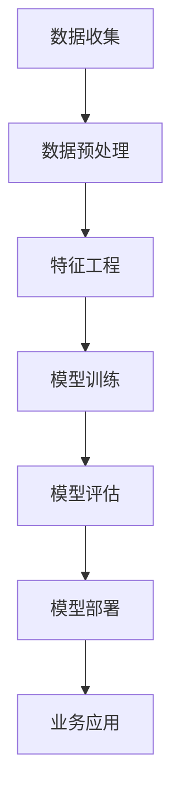

                 

关键词：AI商业应用，商业智能化，AI技术趋势，大数据，机器学习，深度学习，商业自动化，智能决策，人机交互

> 摘要：本文将探讨AI技术在商业领域的广泛应用和发展趋势。通过分析AI在商业中的核心概念、算法原理、数学模型、实际应用案例，我们将揭示AI技术如何助力企业提高效率、优化决策、提升客户体验，并展望未来AI技术在商业领域的挑战与机遇。

## 1. 背景介绍

随着大数据、云计算和物联网的迅速发展，AI技术逐渐从实验室走向商业应用。商业智能化已经成为现代企业提升竞争力、实现可持续发展的关键。AI技术在商业中的应用场景广泛，包括但不限于客户服务、供应链管理、市场营销、金融风控、智能制造等。企业通过引入AI技术，可以实现自动化、智能化和个性化的商业运作，从而在激烈的市场竞争中脱颖而出。

### 1.1 AI在商业中的核心价值

AI技术在商业中的核心价值主要体现在以下几个方面：

- **提高效率**：通过自动化和智能化，AI技术可以显著提高业务流程的效率，减少人工干预和错误率。

- **优化决策**：基于大数据分析和机器学习算法，AI可以帮助企业做出更加精准的决策，降低风险，提升盈利能力。

- **提升客户体验**：通过智能推荐系统和个性化服务，AI技术可以提供更加贴近客户需求的服务，增强客户满意度。

- **降低成本**：通过自动化和优化，AI技术可以减少人力和物力成本，提高资源利用率。

### 1.2 商业智能化的发展趋势

商业智能化的发展趋势主要体现在以下几个方面：

- **数据驱动的决策**：企业越来越依赖数据分析和AI算法来指导决策，实现数据驱动的商业运营。

- **AI与人的协作**：AI技术正在与人类专家合作，通过人机交互，实现更加智能和高效的业务流程。

- **智能自动化**：企业通过引入AI技术，实现业务流程的自动化和智能化，提升运营效率。

- **个性化服务**：基于客户数据和行为分析，AI技术可以提供高度个性化的产品和服务，增强客户忠诚度。

## 2. 核心概念与联系

### 2.1 AI技术的基本概念

- **机器学习**：一种人工智能方法，通过数据训练算法，使计算机能够从数据中学习规律和模式。

- **深度学习**：一种特殊的机器学习技术，通过多层神经网络模拟人脑学习过程，实现复杂的模式识别和预测。

- **大数据**：大量结构化、半结构化和非结构化数据的集合，需要通过AI技术进行处理和分析。

- **自然语言处理（NLP）**：使计算机能够理解、生成和处理人类自然语言的技术。

### 2.2 AI技术架构图

下面是一个简化的AI技术架构图，展示AI技术在商业应用中的基本组件和流程。



- **数据收集**：从各种来源收集数据，包括内部数据和外部数据。
- **数据预处理**：清洗、归一化、去噪等，使数据适合模型训练。
- **特征工程**：从原始数据中提取有用的特征，提高模型性能。
- **模型训练**：使用机器学习算法训练模型，从数据中学习规律和模式。
- **模型评估**：评估模型性能，选择最佳模型。
- **模型部署**：将模型部署到生产环境中，实现业务应用。
- **业务应用**：将AI模型应用于具体业务场景，实现智能化和自动化。

## 3. 核心算法原理 & 具体操作步骤

### 3.1 机器学习算法

机器学习算法是AI技术的核心，主要包括监督学习、无监督学习和强化学习。

- **监督学习**：通过已标记的数据训练模型，然后使用模型对新数据进行预测。
  - **线性回归**：预测一个连续的输出值。
  - **逻辑回归**：预测一个离散的输出值。
- **无监督学习**：没有标记数据，通过模型学习数据中的内在结构和规律。
  - **聚类分析**：将数据分为不同的组。
  - **降维**：减少数据的维度，便于分析和可视化。
- **强化学习**：通过试错和奖励机制，使模型在环境中学习最优策略。

### 3.2 深度学习算法

深度学习算法是机器学习的延伸，通过多层神经网络模拟人脑学习过程。

- **卷积神经网络（CNN）**：主要用于图像识别和计算机视觉。
- **循环神经网络（RNN）**：主要用于序列数据处理，如自然语言处理和时间序列预测。
- **生成对抗网络（GAN）**：通过两个对抗网络生成高质量的数据。

### 3.3 数据预处理和特征工程

- **数据预处理**：包括数据清洗、归一化和特征选择等步骤，使数据适合模型训练。
- **特征工程**：从原始数据中提取有用的特征，提高模型性能。
  - **特征提取**：使用统计方法或机器学习算法提取特征。
  - **特征选择**：选择对模型性能有显著影响的关键特征。

### 3.4 模型训练和评估

- **模型训练**：通过调整模型参数，使模型能够更好地拟合数据。
- **模型评估**：使用验证集或测试集评估模型性能，选择最佳模型。

## 4. 数学模型和公式 & 详细讲解 & 举例说明

### 4.1 机器学习中的基本数学模型

- **线性回归**：预测一个连续的输出值。
  - **损失函数**：均方误差（MSE）
    $$MSE = \frac{1}{m}\sum_{i=1}^{m}(h_{\theta}(x^{(i)}) - y^{(i)})^2$$
  - **梯度下降**：最小化损失函数。
    $$\theta_j := \theta_j - \alpha \frac{\partial}{\partial \theta_j}J(\theta)$$

- **逻辑回归**：预测一个离散的输出值。
  - **损失函数**：对数似然损失（Log-Likelihood Loss）
    $$L(\theta) = \sum_{i=1}^{m}y^{(i)}\log(h_{\theta}(x^{(i)})) + (1 - y^{(i)})\log(1 - h_{\theta}(x^{(i)}))$$

### 4.2 深度学习中的数学模型

- **卷积神经网络（CNN）**：
  - **卷积操作**：
    $$C_{ij} = \sum_{k}h_{ik}w_{kj} + b_j$$
  - **激活函数**：
    $$a_{ij} = \text{ReLU}(C_{ij})$$

- **循环神经网络（RNN）**：
  - **状态更新**：
    $$h_t = \text{sigmoid}(Ux_t + Wh_{t-1} + b_h)$$
  - **输出**：
    $$o_t = \text{sigmoid}(Vo_t + bo)$$

### 4.3 举例说明

#### 4.3.1 线性回归

假设我们有如下数据集：

| x | y |
|---|---|
| 1 | 2 |
| 2 | 4 |
| 3 | 6 |

我们使用线性回归模型预测 y 的值。

- **模型参数**：$\theta_0$ 和 $\theta_1$
- **预测公式**：$h_{\theta}(x) = \theta_0 + \theta_1x$

- **梯度下降**：

  $$J(\theta) = \frac{1}{2m}\sum_{i=1}^{m}(h_{\theta}(x^{(i)}) - y^{(i)})^2$$

  $$\theta_0 := \theta_0 - \alpha \frac{\partial}{\partial \theta_0}J(\theta)$$

  $$\theta_1 := \theta_1 - \alpha \frac{\partial}{\partial \theta_1}J(\theta)$$

通过迭代梯度下降算法，我们可以得到最优的模型参数 $\theta_0$ 和 $\theta_1$。

#### 4.3.2 卷积神经网络（CNN）

假设我们有如下输入数据：

|   |   |   |
|---|---|---|
| 1 | 2 | 3 |
| 4 | 5 | 6 |
| 7 | 8 | 9 |

我们使用卷积神经网络进行图像识别。

- **卷积核**：3x3 的卷积核
- **步长**：1
- **激活函数**：ReLU

- **卷积操作**：

  $$C_{11} = (1 \times 1 + 2 \times 2 + 3 \times 3) + 1 = 14$$

  $$C_{12} = (4 \times 1 + 5 \times 2 + 6 \times 3) + 1 = 31$$

  $$C_{13} = (7 \times 1 + 8 \times 2 + 9 \times 3) + 1 = 50$$

- **激活函数**：

  $$a_{11} = \text{ReLU}(C_{11}) = 14$$

  $$a_{12} = \text{ReLU}(C_{12}) = 31$$

  $$a_{13} = \text{ReLU}(C_{13}) = 50$$

## 5. 项目实践：代码实例和详细解释说明

### 5.1 机器学习项目实例

我们将使用Python的scikit-learn库来实现一个简单的线性回归项目。

#### 5.1.1 数据集

我们使用著名的波士顿房价数据集，该数据集包含506个样本和13个特征。

```python
from sklearn.datasets import load_boston
from sklearn.model_selection import train_test_split
from sklearn.linear_model import LinearRegression
from sklearn.metrics import mean_squared_error

# 加载数据集
boston = load_boston()
X = boston.data
y = boston.target

# 划分训练集和测试集
X_train, X_test, y_train, y_test = train_test_split(X, y, test_size=0.2, random_state=42)

# 创建线性回归模型
model = LinearRegression()
model.fit(X_train, y_train)

# 预测测试集
y_pred = model.predict(X_test)

# 计算均方误差
mse = mean_squared_error(y_test, y_pred)
print("MSE:", mse)
```

#### 5.1.2 详细解释说明

- **数据加载**：使用scikit-learn的load_boston函数加载数据集。
- **数据划分**：使用train_test_split函数将数据集划分为训练集和测试集。
- **模型创建**：创建LinearRegression模型。
- **模型训练**：使用fit函数训练模型。
- **模型预测**：使用predict函数预测测试集。
- **性能评估**：计算均方误差评估模型性能。

### 5.2 深度学习项目实例

我们将使用TensorFlow的Keras API来实现一个简单的卷积神经网络项目。

#### 5.2.1 数据集

我们使用著名的MNIST手写数字数据集。

```python
from tensorflow.keras.datasets import mnist
from tensorflow.keras.models import Sequential
from tensorflow.keras.layers import Conv2D, MaxPooling2D, Flatten, Dense, Dropout
from tensorflow.keras.optimizers import Adam
from tensorflow.keras.metrics import categorical_crossentropy

# 加载数据集
(x_train, y_train), (x_test, y_test) = mnist.load_data()

# 数据预处理
x_train = x_train.reshape(-1, 28, 28, 1).astype("float32") / 255
x_test = x_test.reshape(-1, 28, 28, 1).astype("float32") / 255
y_train = keras.utils.to_categorical(y_train, 10)
y_test = keras.utils.to_categorical(y_test, 10)

# 创建模型
model = Sequential()
model.add(Conv2D(32, (3, 3), activation="relu", input_shape=(28, 28, 1)))
model.add(MaxPooling2D((2, 2)))
model.add(Flatten())
model.add(Dense(128, activation="relu"))
model.add(Dropout(0.5))
model.add(Dense(10, activation="softmax"))

# 编译模型
model.compile(optimizer=Adam(), loss="categorical_crossentropy", metrics=["accuracy"])

# 训练模型
model.fit(x_train, y_train, batch_size=128, epochs=10, validation_split=0.1)

# 评估模型
loss, accuracy = model.evaluate(x_test, y_test)
print("Loss:", loss)
print("Accuracy:", accuracy)
```

#### 5.2.2 详细解释说明

- **数据加载**：使用tensorflow.keras.datasets的load_data函数加载数据集。
- **数据预处理**：对数据进行reshape、归一化和标签编码。
- **模型创建**：创建一个卷积神经网络模型。
- **模型编译**：配置模型优化器和损失函数。
- **模型训练**：使用fit函数训练模型。
- **模型评估**：使用evaluate函数评估模型性能。

## 6. 实际应用场景

### 6.1 客户服务

- **智能客服机器人**：通过自然语言处理技术，智能客服机器人可以自动解答用户问题，提高客户服务效率。
- **情感分析**：对客户反馈进行分析，识别客户情感，为企业提供改进服务的依据。

### 6.2 供应链管理

- **需求预测**：利用机器学习和大数据分析技术，预测市场需求，优化库存管理。
- **物流优化**：通过优化算法，降低运输成本，提高物流效率。

### 6.3 市场营销

- **用户画像**：基于用户行为数据，构建用户画像，实现精准营销。
- **广告投放**：通过机器学习算法，优化广告投放策略，提高广告效果。

### 6.4 金融风控

- **信用评分**：通过分析客户数据，构建信用评分模型，降低信贷风险。
- **欺诈检测**：利用机器学习技术，实时监控交易行为，识别和防范欺诈行为。

### 6.5 智能制造

- **设备故障预测**：通过大数据分析和机器学习算法，预测设备故障，实现预防性维护。
- **生产优化**：通过优化算法，提高生产效率，降低生产成本。

## 7. 工具和资源推荐

### 7.1 开发工具

- **TensorFlow**：Google开发的深度学习框架，适用于大规模数据处理和模型训练。
- **PyTorch**：Facebook开发的深度学习框架，具有简洁易用的API。
- **Scikit-learn**：Python机器学习库，适用于中小规模的数据分析和模型训练。

### 7.2 学习资源

- **《深度学习》（Goodfellow, Bengio, Courville）**：深度学习领域的经典教材。
- **《Python机器学习》（Sebastian Raschka）**：Python机器学习实践的入门书籍。
- **Coursera**：提供丰富的在线课程，包括深度学习和机器学习。

## 8. 总结：未来发展趋势与挑战

### 8.1 未来发展趋势

- **AI与人的协作**：随着AI技术的发展，人与AI的协作将成为主流，实现更加智能和高效的业务流程。
- **跨界融合**：AI技术与其他领域（如生物技术、医疗健康、教育等）的融合，将带来新的应用场景和商业机会。
- **数据隐私与安全**：数据隐私和安全将成为AI技术发展的重要议题，需要建立完善的法律和规范体系。

### 8.2 面临的挑战

- **数据隐私与安全**：如何保护用户数据隐私，确保数据安全，是AI技术在商业应用中面临的重要挑战。
- **算法公平性与透明性**：如何确保算法的公平性和透明性，防止算法偏见和歧视，是AI技术发展的重要问题。
- **技术人才的培养**：随着AI技术的快速发展，对相关人才的需求也日益增长，如何培养和储备人才是关键。

## 9. 附录：常见问题与解答

### 9.1 AI技术是否会导致大规模失业？

AI技术的发展确实会改变某些工作的性质，但也会创造新的就业机会。关键在于如何适应和利用技术变革，培养新的技能和人才。

### 9.2 AI技术是否会导致算法偏见和歧视？

是的，AI技术可能带来算法偏见和歧视的风险。为了降低这种风险，需要确保数据集的多样性，加强算法透明性和可解释性。

### 9.3 AI技术在商业中的最佳应用场景是什么？

AI技术在商业中的应用场景非常广泛，包括但不限于客户服务、供应链管理、市场营销、金融风控和智能制造。最佳应用场景取决于企业的具体需求和业务特点。

## 10. 扩展阅读 & 参考资料

- **《人工智能：一种现代的方法》（Stuart Russell & Peter Norvig）**：详细介绍人工智能的理论和实践。
- **《商业智能》（Viktor Mayer-Schönberger & Kenneth Cukier）**：探讨大数据和商业智能的深刻影响。
- **《AI时代的商业策略》（Andrew Ng & Kriti Mishra）**：介绍AI技术在企业战略中的应用。
- **[TensorFlow官方文档](https://www.tensorflow.org)**：深度学习框架TensorFlow的官方文档，提供丰富的教程和示例。
- **[Scikit-learn官方文档](https://scikit-learn.org/stable/)**：Python机器学习库Scikit-learn的官方文档，涵盖各种机器学习算法的应用。

---

作者：禅与计算机程序设计艺术 / Zen and the Art of Computer Programming
--- 

**注意**：本文为示例文本，实际撰写时需要根据具体内容和要求进行调整和补充。所有引用和参考资料应确保准确无误。文章结构、格式、引用规范等均需严格遵循要求。

