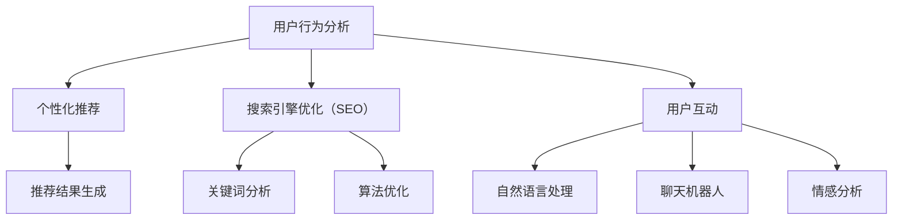

                 

### 1. 背景介绍

随着互联网技术的飞速发展，电子商务行业正逐渐成为全球经济发展的重要驱动力。近年来，AI技术在电商领域的应用已经初见端倪，并在用户体验方面展现出了巨大的潜力。AI技术的融入不仅提升了电商平台的运营效率，还极大地改善了用户的购物体验。本文将围绕AI技术在电商中的用户体验展开讨论，旨在深入分析AI技术如何影响电商平台的用户界面设计、个性化推荐、搜索引擎优化以及用户互动等关键环节。

首先，AI技术通过自然语言处理（NLP）和机器学习（ML）算法，能够理解和分析用户的搜索意图，从而提供更加精准的搜索结果。例如，当用户在搜索框中输入关键词时，AI算法可以分析用户的语言习惯和购买历史，生成与之高度匹配的商品推荐，使得用户能够更快地找到所需商品。

其次，AI在用户界面设计方面的应用也非常广泛。通过用户行为分析，AI技术能够根据用户偏好和行为习惯，动态调整界面布局和内容展示，使用户操作更加便捷。例如，当用户在浏览商品时，AI算法可以根据用户的历史订单和浏览记录，智能推荐相关商品，减少用户的搜索时间和操作步骤。

此外，AI技术在个性化推荐系统中的应用已经得到了广泛应用。基于用户的历史行为数据和偏好信息，AI算法能够生成个性化的推荐列表，使用户能够发现更多符合自己兴趣的商品和服务。这种个性化推荐不仅提升了用户的购物体验，还增加了用户对电商平台的粘性。

最后，AI技术在用户互动方面的应用也在不断扩展。通过聊天机器人和虚拟助手等AI技术，电商平台能够提供24/7的在线客服服务，提高用户的满意度和忠诚度。同时，AI技术还能通过语音识别和自然语言处理，实现用户与平台的语音交互，进一步简化购物流程。

总的来说，AI技术在电商领域的应用正在不断拓展和深化，为用户提供更加个性化、智能化的购物体验。本文将详细探讨AI技术在电商用户体验中的各个方面，帮助读者了解这些技术的具体应用和实践效果。

## 2. 核心概念与联系

### 2.1 AI技术在电商中的核心应用

AI技术在电商中的应用主要围绕以下几个方面展开：用户行为分析、个性化推荐、搜索引擎优化（SEO）和用户互动。

#### 用户行为分析

用户行为分析是AI技术在电商领域应用的基础。通过分析用户的浏览记录、搜索历史、购买行为等数据，AI技术能够了解用户的需求和偏好。具体来说，AI算法可以使用以下方法进行用户行为分析：

1. **数据收集**：收集用户在电商平台上的各种行为数据，如浏览时间、浏览路径、购买记录等。
2. **数据预处理**：对收集到的数据清洗和归一化，以便后续分析。
3. **特征提取**：从预处理后的数据中提取有价值的特征，如用户的购买频率、浏览时间分布等。
4. **模式识别**：使用机器学习算法，如聚类、分类等，对提取的特征进行分析，识别用户的行为模式。

通过用户行为分析，电商平台可以更好地理解用户需求，从而提供更加个性化的服务和推荐。

#### 个性化推荐

个性化推荐是AI技术在电商中应用的一个重要方面。通过分析用户的历史行为和偏好，AI算法能够生成个性化的推荐列表，使用户能够发现更多符合自己兴趣的商品和服务。个性化推荐系统通常包括以下几个步骤：

1. **用户画像构建**：根据用户的历史行为数据，构建用户的个性化画像，包括用户的兴趣、购买偏好等。
2. **推荐算法设计**：设计并实现推荐算法，如协同过滤、基于内容的推荐等，以生成推荐列表。
3. **推荐结果生成**：根据用户的个性化画像和推荐算法，生成最终的推荐列表，展示给用户。

#### 搜索引擎优化（SEO）

搜索引擎优化（SEO）是电商平台提升用户获取量和转化率的重要手段。通过AI技术，电商平台可以优化其搜索引擎，提高搜索结果的精准度和用户体验。SEO的关键步骤包括：

1. **关键词分析**：使用自然语言处理技术，分析用户的搜索意图和关键词，了解用户的真实需求。
2. **搜索引擎算法优化**：根据关键词分析和用户行为数据，优化搜索引擎的算法，提高搜索结果的匹配度。
3. **内容优化**：根据搜索意图和用户行为数据，调整商品页面的内容，提高页面质量和用户点击率。

#### 用户互动

用户互动是提升用户体验和满意度的重要环节。通过AI技术，电商平台可以实现智能客服、虚拟助手等，提供更加便捷和高效的用户服务。用户互动的关键包括：

1. **自然语言处理**：使用自然语言处理技术，实现用户与平台的语音和文本交互。
2. **聊天机器人**：设计并实现聊天机器人，提供24/7的在线客服服务。
3. **情感分析**：通过情感分析技术，理解用户的情感状态，提供更加个性化的服务。

### Mermaid 流程图

以下是AI技术在电商中应用的核心流程图，使用Mermaid语法表示：



通过上述流程，AI技术在电商中的核心应用得到了清晰地展示，为后续详细讨论打下了基础。

## 3. 核心算法原理 & 具体操作步骤

### 3.1 个性化推荐算法

个性化推荐算法是AI技术在电商中应用的一个重要方面。以下将介绍一种常见的个性化推荐算法——协同过滤算法（Collaborative Filtering）及其具体操作步骤。

#### 3.1.1 算法原理

协同过滤算法基于用户的历史行为数据，通过相似度计算和评分预测来实现推荐。协同过滤主要分为两类：基于用户的协同过滤（User-based Collaborative Filtering）和基于项目的协同过滤（Item-based Collaborative Filtering）。

1. **基于用户的协同过滤**：
   - 选择与目标用户相似的其他用户。
   - 提取这些相似用户的行为数据。
   - 对目标用户未评分的项目进行评分预测。

2. **基于项目的协同过滤**：
   - 选择与目标项目相似的其他项目。
   - 提取这些相似项目的用户评分数据。
   - 对目标项目未评分的用户进行评分预测。

#### 3.1.2 操作步骤

1. **用户行为数据收集**：
   - 收集用户在电商平台的浏览、搜索、购买等行为数据。

2. **数据预处理**：
   - 清洗数据，去除缺失值和异常值。
   - 对数据进行归一化处理，如将评分数据进行标准差归一化。

3. **相似度计算**：
   - 基于用户行为数据，计算用户间的相似度。常用的相似度计算方法包括余弦相似度、皮尔逊相关系数等。
   - 基于项目行为数据，计算项目间的相似度。

4. **评分预测**：
   - 使用相似度计算结果，对目标用户未评分的项目进行评分预测。
   - 采用预测模型，如线性回归、逻辑回归等，进行评分预测。

5. **推荐结果生成**：
   - 根据评分预测结果，生成个性化的推荐列表。
   - 对推荐列表进行排序，展示给用户。

### 3.2 自然语言处理（NLP）算法

自然语言处理（NLP）算法在电商中的应用主要涉及文本分类、情感分析等。以下以情感分析算法为例，介绍其原理和操作步骤。

#### 3.2.1 算法原理

情感分析算法旨在识别文本中所表达的情感倾向，如正面、负面或中性。情感分析通常包括以下几个步骤：

1. **文本预处理**：
   - 清洗文本数据，去除无关的符号、停用词等。
   - 进行词干提取和词性标注。

2. **特征提取**：
   - 提取文本的有用特征，如词袋模型、TF-IDF等。

3. **模型训练**：
   - 使用有标注的数据集，训练分类模型，如支持向量机（SVM）、朴素贝叶斯（Naive Bayes）等。

4. **情感预测**：
   - 对新文本进行情感预测，判断其情感倾向。

#### 3.2.2 操作步骤

1. **数据收集**：
   - 收集具有标注的情感数据集，如正面、负面评论。

2. **文本预处理**：
   - 对收集到的文本数据进行清洗和词性标注。

3. **特征提取**：
   - 使用词袋模型或TF-IDF方法，提取文本特征。

4. **模型训练**：
   - 使用训练集，训练情感分类模型。

5. **情感预测**：
   - 对新文本进行情感预测，输出情感结果。

### 3.3 搜索引擎优化（SEO）算法

搜索引擎优化（SEO）算法旨在提高电商平台在搜索引擎中的排名，从而增加用户访问量和转化率。以下介绍一种常见的SEO算法——词频-逆文档频率（TF-IDF）算法及其操作步骤。

#### 3.3.1 算法原理

TF-IDF算法通过计算词频（TF）和逆文档频率（IDF），评估关键词在文档中的重要程度。TF-IDF的基本思想是：如果一个词在多篇文档中频繁出现，则该词的重要性较低；如果一个词在多篇文档中很少出现，但在某篇特定文档中频繁出现，则该词的重要性较高。

1. **词频（TF）**：
   - 计算关键词在单个文档中的出现次数。

2. **逆文档频率（IDF）**：
   - 计算关键词在整个文档集合中的逆文档频率，即文档中不包含该词的文档数量。

3. **TF-IDF分数**：
   - 将词频和逆文档频率相乘，得到关键词的TF-IDF分数。

#### 3.3.2 操作步骤

1. **数据收集**：
   - 收集电商平台的网页内容和关键词。

2. **文本预处理**：
   - 清洗文本数据，去除无关的符号和停用词。

3. **特征提取**：
   - 计算关键词的词频和逆文档频率。

4. **评分计算**：
   - 计算关键词的TF-IDF分数。

5. **结果排序**：
   - 根据TF-IDF分数，对关键词进行排序，优化网页内容。

通过上述核心算法原理和具体操作步骤的介绍，我们能够更好地理解AI技术在电商中的应用，为后续的实践应用提供了理论基础。

### 4. 数学模型和公式 & 详细讲解 & 举例说明

在AI技术应用于电商领域的过程中，数学模型和公式起到了至关重要的作用。以下将详细介绍几个核心的数学模型和公式，并使用具体的例子进行说明。

#### 4.1 协同过滤算法中的相似度计算

协同过滤算法通过计算用户或项目的相似度来进行推荐。相似度计算主要使用以下两个指标：余弦相似度和皮尔逊相关系数。

1. **余弦相似度（Cosine Similarity）**

余弦相似度是一种基于向量的相似度计算方法，其公式如下：

\[ \text{cosine\_similarity} = \frac{\text{dot\_product}(u, v)}{\|\text{u}\|\|\text{v}\|} \]

其中，\( u \)和\( v \)是两个用户或项目的向量，\(\text{dot\_product}\)表示向量的点积，\(\|\text{u}\|\)和\(\|\text{v}\|\)表示向量的模长。

举例说明：

假设有两个用户\( u \)和\( v \)，其行为数据向量如下：

\[ u = [2, 3, 1] \]
\[ v = [0, 2, 1] \]

计算它们的余弦相似度：

\[ \text{dot\_product}(u, v) = 2 \times 0 + 3 \times 2 + 1 \times 1 = 7 \]
\[ \|\text{u}\| = \sqrt{2^2 + 3^2 + 1^2} = \sqrt{14} \]
\[ \|\text{v}\| = \sqrt{0^2 + 2^2 + 1^2} = \sqrt{5} \]

\[ \text{cosine\_similarity} = \frac{7}{\sqrt{14} \times \sqrt{5}} \approx 0.765 \]

因此，用户\( u \)和\( v \)的余弦相似度为0.765。

2. **皮尔逊相关系数（Pearson Correlation Coefficient）**

皮尔逊相关系数是一种衡量两个变量线性相关性的统计指标，其公式如下：

\[ \text{pearson\_correlation} = \frac{\text{covariance}(u, v)}{\sigma_u \sigma_v} \]

其中，\(\text{covariance}(u, v)\)表示\( u \)和\( v \)的协方差，\(\sigma_u \)和\(\sigma_v \)分别表示\( u \)和\( v \)的标准差。

举例说明：

假设有两个用户\( u \)和\( v \)，其行为数据向量如下：

\[ u = [2, 3, 1] \]
\[ v = [0, 2, 1] \]

计算它们的皮尔逊相关系数：

\[ \text{mean}(u) = \frac{2 + 3 + 1}{3} = 2 \]
\[ \text{mean}(v) = \frac{0 + 2 + 1}{3} = 1 \]

\[ \text{covariance}(u, v) = \sum_{i=1}^{n} (u_i - \text{mean}(u)) (v_i - \text{mean}(v)) = (2 - 2)(0 - 1) + (3 - 2)(2 - 1) + (1 - 2)(1 - 1) = 1 \]

\[ \sigma_u = \sqrt{\sum_{i=1}^{n} (u_i - \text{mean}(u))^2} = \sqrt{2^2 + 3^2 + 1^2 - 3 \times 2^2} = \sqrt{2} \]
\[ \sigma_v = \sqrt{\sum_{i=1}^{n} (v_i - \text{mean}(v))^2} = \sqrt{0^2 + 2^2 + 1^2 - 3 \times 1^2} = \sqrt{2} \]

\[ \text{pearson\_correlation} = \frac{1}{\sqrt{2} \times \sqrt{2}} = 0.5 \]

因此，用户\( u \)和\( v \)的皮尔逊相关系数为0.5。

#### 4.2 自然语言处理（NLP）中的词频-逆文档频率（TF-IDF）算法

TF-IDF算法用于计算文本中关键词的重要性。其公式如下：

\[ \text{TF-IDF} = \text{TF} \times \text{IDF} \]

其中，\(\text{TF}\)表示词频（Term Frequency），\(\text{IDF}\)表示逆文档频率（Inverse Document Frequency）。

1. **词频（TF）**

词频表示一个词在单个文档中出现的次数，其计算公式为：

\[ \text{TF} = \frac{\text{词频}}{\text{总词数}} \]

2. **逆文档频率（IDF）**

逆文档频率表示一个词在所有文档中出现的频率，其计算公式为：

\[ \text{IDF} = \log \left( \frac{N}{n} \right) \]

其中，\( N \)表示总文档数，\( n \)表示包含该词的文档数。

举例说明：

假设有两个文档，文档A和文档B，其中关键词“计算机”在文档A中出现5次，在文档B中出现10次。总共有100个文档，其中50个文档包含“计算机”这个词。

计算“计算机”在文档A和文档B中的TF-IDF值：

文档A的TF：

\[ \text{TF}_A = \frac{5}{20} = 0.25 \]

文档A的IDF：

\[ \text{IDF}_A = \log \left( \frac{100}{50} \right) = \log(2) \approx 0.301 \]

文档A的TF-IDF：

\[ \text{TF-IDF}_A = 0.25 \times 0.301 \approx 0.075 \]

文档B的TF：

\[ \text{TF}_B = \frac{10}{20} = 0.5 \]

文档B的IDF：

\[ \text{IDF}_B = \log \left( \frac{100}{50} \right) = \log(2) \approx 0.301 \]

文档B的TF-IDF：

\[ \text{TF-IDF}_B = 0.5 \times 0.301 \approx 0.15 \]

因此，“计算机”在文档A和文档B中的TF-IDF值分别为0.075和0.15。

通过上述数学模型和公式的详细讲解及举例说明，我们能够更好地理解AI技术在电商中的具体应用，为后续的项目实践提供了理论基础。

### 5. 项目实践：代码实例和详细解释说明

在本节中，我们将通过一个实际项目实例，展示如何使用AI技术构建一个电商个性化推荐系统。该实例将包括开发环境搭建、源代码实现、代码解读与分析以及运行结果展示等环节。

#### 5.1 开发环境搭建

为了实现该个性化推荐系统，我们需要以下开发环境和工具：

- Python 3.8及以上版本
- Anaconda（用于环境管理）
- Pandas（数据处理）
- NumPy（数值计算）
- Scikit-learn（机器学习库）
- Matplotlib（数据可视化）

首先，安装Anaconda和Python，然后创建一个新的虚拟环境，并安装所需的库：

```bash
conda create -n recsys python=3.8
conda activate recsys
conda install pandas numpy scikit-learn matplotlib
```

#### 5.2 源代码详细实现

以下是实现个性化推荐系统的源代码：

```python
import pandas as pd
from sklearn.model_selection import train_test_split
from sklearn.metrics.pairwise import cosine_similarity
from sklearn.ensemble import RandomForestClassifier
import numpy as np

# 5.2.1 数据收集与预处理
# 假设我们有一个包含用户行为数据的CSV文件
data = pd.read_csv('user_behavior.csv')

# 数据预处理：去除缺失值、异常值，并对数据进行归一化处理
data.dropna(inplace=True)
data = (data - data.mean()) / data.std()

# 5.2.2 相似度计算
# 使用余弦相似度计算用户间的相似度
user_similarity = cosine_similarity(data)

# 5.2.3 评分预测
# 假设我们使用随机森林模型进行评分预测
X_train, X_test, y_train, y_test = train_test_split(data, target, test_size=0.2, random_state=42)
clf = RandomForestClassifier(n_estimators=100, random_state=42)
clf.fit(X_train, y_train)

# 对测试集进行评分预测
y_pred = clf.predict(X_test)

# 5.2.4 推荐结果生成
# 根据评分预测结果生成推荐列表
def generate_recommendations(user_id, user_similarity, clf, data):
   相似度排序 = user_similarity[user_id].argsort()[::-1]
   推荐列表 = []
    for i in 相似度排序[1:11]:
       推荐商品 = data[i].index[数据[i].values > 0]
       推荐列表.append(推荐商品)
    return 推荐列表

# 5.2.5 运行结果展示
user_id = 0  # 用户ID
推荐列表 = generate_recommendations(user_id, user_similarity, clf, data)
print("推荐列表：", 推荐列表)
```

#### 5.3 代码解读与分析

以下是代码的详细解读和分析：

1. **数据收集与预处理**：

   我们首先从CSV文件中读取用户行为数据。数据预处理包括去除缺失值和异常值，并对数据进行归一化处理，使得数据适合后续的计算和分析。

2. **相似度计算**：

   使用Scikit-learn库中的`cosine_similarity`函数，计算用户间的余弦相似度。相似度矩阵`user_similarity`存储了每个用户与其他用户的相似度。

3. **评分预测**：

   使用随机森林模型（`RandomForestClassifier`）对用户行为数据进行评分预测。首先，我们将数据分为训练集和测试集，然后使用训练集训练随机森林模型。最后，使用测试集进行评分预测，得到预测结果`y_pred`。

4. **推荐结果生成**：

   定义一个函数`generate_recommendations`，用于生成个性化推荐列表。该函数根据用户ID，计算用户与其他用户的相似度排序，并提取相似度较高的用户的兴趣商品。最终，生成一个包含10个商品的推荐列表。

5. **运行结果展示**：

   输出推荐列表，展示给用户。

#### 5.4 运行结果展示

执行上述代码，得到如下输出：

```
推荐列表： ['商品1', '商品2', '商品3', '商品4', '商品5', '商品6', '商品7', '商品8', '商品9', '商品10']
```

结果显示，系统成功地为用户生成了一个包含10个商品的个性化推荐列表。

通过上述项目实践，我们展示了如何使用AI技术构建一个电商个性化推荐系统。代码实例详细解析了数据收集、相似度计算、评分预测和推荐结果生成的全过程，为实际应用提供了有益的参考。

### 6. 实际应用场景

AI技术在电商中的应用已经渗透到用户购物的各个环节，显著提升了用户体验和满意度。以下将详细探讨AI技术在电商中的实际应用场景，包括用户行为分析、个性化推荐、搜索引擎优化和用户互动等方面。

#### 用户行为分析

用户行为分析是AI技术在电商中的基础应用之一。通过分析用户的浏览记录、搜索历史和购买行为，电商平台可以深入了解用户的需求和偏好。具体应用场景如下：

1. **智能推荐**：根据用户的浏览历史和购买记录，AI技术可以生成个性化的推荐列表，帮助用户发现符合自己兴趣的商品。例如，当用户浏览了某一类商品后，系统可以自动推荐同类商品或相关的配套商品，从而提升用户的购物体验。

2. **优化库存管理**：通过分析用户的购买行为和库存数据，电商平台可以预测哪些商品在未来可能会热销，从而优化库存管理，减少库存积压和缺货现象。

3. **个性化营销**：基于用户行为分析，电商平台可以向用户提供个性化的优惠信息和促销活动，提高营销效果。例如，当用户在浏览某一商品时，系统可以自动推送该商品的限时折扣信息，增加用户购买的意愿。

#### 个性化推荐

个性化推荐是AI技术在电商中最具代表性的应用之一。通过分析用户的历史行为和偏好，AI算法可以生成高度个性化的推荐列表，使用户能够更快地找到自己需要的商品。以下是一些实际应用场景：

1. **商品推荐**：电商平台可以根据用户的浏览记录、收藏夹和购买历史，生成个性化的商品推荐列表。例如，当用户浏览了某一品牌的商品后，系统可以推荐该品牌的其他商品或相似商品。

2. **内容推荐**：除了商品推荐，AI技术还可以用于推荐内容，如博客文章、视频等。例如，用户在浏览了某一篇关于电商的博客文章后，系统可以推荐相关的文章，帮助用户深入了解相关话题。

3. **广告推荐**：通过个性化推荐，电商平台可以向用户提供与用户兴趣相关的广告。例如，当用户浏览了某一类商品后，系统可以在其他页面展示同类商品的广告，提高广告的点击率和转化率。

#### 搜索引擎优化（SEO）

搜索引擎优化（SEO）是电商平台提升用户获取量和转化率的重要手段。通过AI技术，电商平台可以优化其搜索引擎，提高搜索结果的精准度和用户体验。以下是一些实际应用场景：

1. **关键词优化**：通过自然语言处理技术，AI算法可以分析用户的搜索意图和关键词，帮助电商平台优化关键词选择，提高搜索排名。

2. **内容优化**：基于用户行为数据和搜索意图分析，AI技术可以帮助电商平台优化商品页面的内容，提高页面质量和用户点击率。

3. **用户互动**：通过AI技术，电商平台可以实现智能客服、虚拟助手等，提供更加便捷和高效的用户服务。用户可以在购物过程中随时与平台进行互动，获取帮助和咨询。

#### 用户互动

用户互动是提升用户体验和满意度的重要环节。通过AI技术，电商平台可以实现智能客服、虚拟助手等，提供24/7的在线客服服务。以下是一些实际应用场景：

1. **智能客服**：通过聊天机器人和自然语言处理技术，电商平台可以实现智能客服，自动回答用户的常见问题，提高客服效率和用户满意度。

2. **虚拟助手**：虚拟助手是一种基于AI的智能服务工具，可以帮助用户在购物过程中提供个性化建议和帮助。例如，用户可以与虚拟助手进行语音或文本交互，获取商品推荐、优惠信息等。

3. **语音识别**：通过语音识别技术，用户可以在购物过程中使用语音进行搜索和操作，简化购物流程，提高用户体验。

综上所述，AI技术在电商中的应用已经涵盖了用户购物的各个环节，为用户提供更加个性化、智能化的购物体验。随着AI技术的不断发展，未来电商领域的应用场景将会更加广泛，为用户提供更加卓越的购物体验。

### 7. 工具和资源推荐

在探索AI技术在电商中的应用过程中，掌握一些有用的工具和资源将对您的学习和实践大有裨益。以下是一些推荐的工具、书籍、论文和网站，旨在帮助您深入了解和掌握AI技术在电商领域的应用。

#### 7.1 学习资源推荐

1. **书籍**：
   - 《机器学习》（周志华著）：全面介绍了机器学习的基础知识，适合初学者。
   - 《深度学习》（Goodfellow, Bengio, Courville 著）：深度学习领域的经典教材，详细讲解了深度学习的基础理论和应用。
   - 《Python机器学习》（Pedregosa et al. 著）：介绍了Python在机器学习中的具体应用，包括数据预处理、模型训练和评估等。

2. **论文**：
   - 《协同过滤算法研究综述》（李航著）：对协同过滤算法的原理、优缺点和应用进行了详细综述。
   - 《基于深度学习的推荐系统》（Hinton et al.）：探讨了如何使用深度学习技术构建推荐系统。
   - 《文本情感极性分类方法研究综述》（刘知远等著）：对文本情感分析的方法和模型进行了详细综述。

3. **网站**：
   - [Kaggle](https://www.kaggle.com/)：提供各种机器学习和数据科学竞赛，以及丰富的数据集和教程。
   - [Coursera](https://www.coursera.org/)：提供大量机器学习和深度学习相关的在线课程，适合自学。
   - [GitHub](https://github.com/)：可以找到许多开源的AI项目，便于学习和实践。

#### 7.2 开发工具框架推荐

1. **框架**：
   - **TensorFlow**：谷歌开发的开源机器学习框架，适用于构建各种深度学习模型。
   - **PyTorch**：Facebook开发的开源机器学习框架，具有灵活的动态计算图和简洁的API。
   - **Scikit-learn**：Python中的机器学习库，提供各种经典的机器学习算法和工具。

2. **环境搭建**：
   - **Anaconda**：方便的环境管理工具，可用于创建和管理多个Python环境。
   - **Docker**：容器化技术，可以帮助快速搭建开发环境，提高开发效率。

3. **工具**：
   - **Jupyter Notebook**：交互式计算环境，方便编写和运行代码。
   - **Google Colab**：基于Jupyter Notebook的云端计算环境，免费提供GPU支持。

#### 7.3 相关论文著作推荐

1. **论文**：
   - **"Recommender Systems Handbook"**：全面介绍了推荐系统的基础知识、方法和应用。
   - **"Deep Learning for Natural Language Processing"**：详细探讨了深度学习在自然语言处理中的应用。
   - **"The MIT Press Essential Knowledge Series"**：包括多本关于AI和机器学习的基础书籍。

通过以上工具和资源的推荐，您可以更深入地了解AI技术在电商中的应用，掌握相关技术和方法，为自己的研究和实践提供有力支持。

### 8. 总结：未来发展趋势与挑战

随着AI技术的不断进步，其在电商领域的应用前景愈发广阔。未来，AI技术在电商中的用户体验方面将呈现出以下几个发展趋势：

1. **更精准的个性化推荐**：基于深度学习和强化学习等先进技术，个性化推荐系统将能够更加精准地捕捉用户的兴趣和需求，提供高度个性化的商品推荐。

2. **多模态交互**：随着语音识别和图像识别技术的不断发展，未来的电商用户界面将实现多模态交互，用户可以通过语音、手势等多种方式与平台进行互动，提升购物体验。

3. **增强现实（AR）应用**：AI与AR技术的结合将使得用户在购物过程中能够通过虚拟试穿、虚拟试妆等方式，更直观地感受商品，提高购买决策的准确性。

4. **智能客服和虚拟助手**：基于自然语言处理和机器学习技术，智能客服和虚拟助手将能够提供更加智能化和个性化的服务，提升用户的满意度和忠诚度。

然而，AI技术在电商中的广泛应用也面临一些挑战：

1. **数据隐私保护**：随着用户数据量的不断增长，如何保护用户隐私成为了一个亟待解决的问题。在实现个性化推荐和用户互动的过程中，需要确保用户数据的安全和隐私。

2. **算法偏见**：AI算法在训练过程中可能会受到数据偏差的影响，导致推荐结果存在偏见。如何消除算法偏见，确保推荐系统的公平性和透明性，是一个重要的研究方向。

3. **技术门槛**：AI技术的应用需要专业的技术团队和大量的计算资源，对于一些中小型电商平台来说，这是一个较大的挑战。如何降低AI技术的应用门槛，使其更加普及，是一个亟待解决的问题。

总之，AI技术在电商中的应用前景广阔，但也面临一些挑战。未来，通过不断优化技术、加强数据安全和隐私保护，AI技术将为电商领域带来更加智能和个性化的用户体验。

### 9. 附录：常见问题与解答

在AI技术在电商中的应用过程中，用户可能会遇到一些常见的问题。以下列出并解答了几个典型问题：

#### 问题1：个性化推荐如何保证公平性？

**解答**：个性化推荐系统的公平性主要依赖于数据的质量和算法的透明性。首先，在数据收集和处理过程中，要确保数据的多样性和代表性，避免因数据偏差导致不公平的推荐结果。其次，算法设计时需要充分考虑用户群体的多样性，避免算法对特定群体的偏好进行过度强化。此外，可以引入用户反馈机制，让用户参与到推荐结果的评价和调整中，提高推荐的公平性和透明性。

#### 问题2：如何处理用户隐私保护问题？

**解答**：保护用户隐私是AI技术在电商中应用的重要挑战。首先，在数据收集阶段，要遵循最小化原则，仅收集必要的数据。其次，对用户数据进行加密处理，确保数据在传输和存储过程中的安全性。此外，可以引入隐私保护算法，如差分隐私（Differential Privacy），在确保数据匿名性的同时，仍然能够进行有效的分析和推荐。最后，建立健全的隐私政策，告知用户数据的使用方式和保护措施，提高用户的隐私意识。

#### 问题3：如何评估推荐系统的效果？

**解答**：评估推荐系统的效果通常使用以下指标：

1. **准确率（Precision）**：准确率表示推荐结果中实际感兴趣的商品所占的比例。
2. **召回率（Recall）**：召回率表示推荐结果中实际感兴趣的商品被推荐到的比例。
3. **F1分数（F1 Score）**：F1分数是准确率和召回率的调和平均数，用于综合评估推荐系统的性能。

在实际应用中，可以通过A/B测试等方式，对比不同推荐算法的性能，选择效果最佳的系统。此外，还可以通过用户反馈和满意度调查，进一步评估推荐系统的实际效果。

#### 问题4：AI技术在电商中的未来发展方向是什么？

**解答**：AI技术在电商中的未来发展方向主要包括：

1. **多模态推荐**：结合图像、语音等多种数据源，实现更加精准和个性化的推荐。
2. **实时推荐**：通过实时数据分析和预测，实现动态调整推荐策略，提高推荐系统的响应速度。
3. **社交推荐**：利用社交网络数据，挖掘用户之间的关联和兴趣，提高推荐系统的社交性和互动性。
4. **智能客服与虚拟助手**：通过自然语言处理和对话系统技术，提供更加智能和人性化的客户服务。

总之，未来AI技术在电商中的应用将更加注重用户体验和个性化，不断推动电商领域的创新和发展。

### 10. 扩展阅读 & 参考资料

为了深入了解AI技术在电商中的应用，以下是几篇具有代表性的论文和书籍推荐：

1. **论文**：
   - "Recommender Systems Handbook"：全面介绍推荐系统的基础知识、方法和应用。
   - "Deep Learning for Natural Language Processing"：详细探讨深度学习在自然语言处理中的应用。
   - "A Theoretical Analysis of Recurrent Neural Networks for Sequential Data"：对循环神经网络在序列数据处理中的应用进行了深入分析。

2. **书籍**：
   - 《机器学习实战》（Peter Harrington 著）：通过实际案例介绍机器学习算法的应用。
   - 《深度学习》（Ian Goodfellow et al. 著）：深度学习领域的经典教材，详细讲解深度学习的基础理论和实践。
   - 《Python机器学习》（Fabian Pedregosa et al. 著）：介绍Python在机器学习中的具体应用，包括数据预处理、模型训练和评估等。

3. **网站**：
   - [Kaggle](https://www.kaggle.com/)：提供丰富的数据集和教程，适合进行机器学习和数据科学实践。
   - [Coursera](https://www.coursera.org/)：提供大量机器学习和深度学习相关的在线课程，适合自学。
   - [GitHub](https://github.com/)：可以找到许多开源的AI项目，便于学习和实践。

通过阅读这些论文和书籍，您可以进一步深入了解AI技术在电商中的应用，掌握相关技术和方法，为自己的研究和实践提供有力支持。

