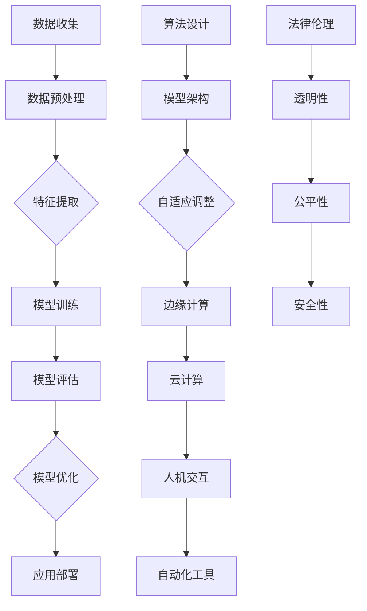

                 

### 背景介绍 ###

在当前快速发展的技术时代，人工智能（AI）技术已经成为推动各行业创新和进步的重要动力。随着深度学习、自然语言处理、计算机视觉等AI子领域不断取得突破，越来越多的企业和研究机构开始将AI技术应用于实际工程项目中。然而，尽管AI技术展示了其强大的潜力和广阔的应用前景，但与传统工程方法相比，AI技术仍存在诸多不同之处，这些差异不仅体现在技术层面上，还包括思维方式、开发流程、以及实施策略等多个方面。

传统工程方法通常以明确的规范和标准为基础，强调可预测性和可控性。工程项目的目标往往是解决具体问题，实现特定功能，而AI技术的引入使得这一过程变得更加复杂和动态。AI技术通过机器学习算法，从大量数据中提取知识，从而能够自动适应和优化。这种灵活性和自适应性正是AI技术相较于传统工程方法的一个显著特点。

随着AI技术的发展，AI与传统工程之间的差异逐渐显现，二者在解决问题的方式、实现目标的方法、以及所需的资源和技术方面存在明显的区别。本文将深入探讨AI技术栈与传统工程在核心概念、算法原理、数学模型、项目实践、应用场景等方面的具体差异，旨在为读者提供一个全面、系统的理解。

通过本文的讨论，读者不仅可以了解AI技术的基本原理和应用，还能认识到AI技术在传统工程领域中的潜在影响和挑战。无论是从事AI开发的技术人员，还是对AI技术感兴趣的普通读者，本文都将为理解AI技术提供有价值的视角。

### 核心概念与联系 ###

在深入探讨AI技术栈与传统工程的对比之前，有必要先明确一些核心概念和它们之间的联系，这将有助于我们更好地理解AI技术的本质及其与传统工程的区别。以下是几个关键概念及其在AI技术栈和传统工程中的应用和联系。

#### 1. 数据与信息 ####

数据是AI技术的基石。无论是机器学习、深度学习，还是自然语言处理，都需要大量的数据来训练模型。传统工程中，数据通常以结构化表格、数据库等形式存在，而AI技术则需要处理大量非结构化的数据，如文本、图像和音频。在AI技术栈中，数据预处理和特征提取是至关重要的步骤，而传统工程则更注重数据的组织和存储。

#### 2. 算法与模型 ####

算法是AI技术的核心，决定了模型的学习能力和预测性能。常见的AI算法包括线性回归、决策树、支持向量机、神经网络等。在传统工程中，算法同样重要，但往往更加依赖于确定性算法和流程。AI模型与传统工程模型的一个显著区别在于，前者通过不断学习和优化来提高性能，而后者通常基于固定参数和预设规则。

#### 3. 模型评估与优化 ####

在AI技术栈中，模型评估和优化是持续迭代的过程。常用的评估指标包括准确率、召回率、F1分数等。传统工程则更多依赖于静态的性能测试和标准。AI模型的优化通常涉及调整模型参数、改进算法结构，甚至通过增强学习来自动优化。

#### 4. 自适应与可扩展性 ####

AI技术的一个显著特点是自适应性和可扩展性。通过不断学习和更新，AI系统能够适应新的环境和需求。传统工程则更强调稳定性和可预测性，通常通过固定流程和规范来实现。这种灵活性使得AI技术能够更好地应对复杂多变的问题，但也带来了更高的开发难度和维护成本。

#### 5. 边缘计算与云计算 ####

在AI技术栈中，边缘计算和云计算都是重要的基础设施。边缘计算通过在数据产生的地方进行实时处理，减少延迟和数据传输成本，而云计算则提供了强大的计算和存储资源，支持大规模数据处理和模型训练。传统工程通常依赖于集中式的计算资源和数据存储，尽管近年来云计算在传统工程中也得到了广泛应用，但边缘计算的应用仍较为有限。

#### 6. 人机交互与自动化 ####

AI技术的另一个重要应用是人机交互，通过自然语言处理、语音识别等技术，AI系统能够理解人类语言并执行相应的任务。传统工程中，人机交互通常依赖于图形用户界面（GUI）和命令行界面，尽管近年来智能化的趋势也在逐渐增强。自动化是AI技术在传统工程中的一大应用，通过自动化工具和流程，可以显著提高工程效率和质量。

#### 7. 伦理与法律问题 ####

随着AI技术的发展，伦理和法律问题也日益凸显。AI技术的决策过程往往涉及敏感数据和复杂算法，如何保证AI系统的透明性、公平性和安全性成为重要议题。传统工程在法律和伦理方面通常有更明确的规范和标准。

通过上述核心概念的分析，我们可以看到AI技术栈与传统工程在多个维度上存在显著差异。理解这些差异不仅有助于我们更好地应用AI技术，还能为传统工程方法带来新的启示。

#### Mermaid 流程图（核心概念原理与架构） ####

以下是一个用Mermaid绘制的流程图，展示了AI技术栈与传统工程中的核心概念及其联系：



这个流程图概括了AI技术栈的主要环节，包括数据收集、预处理、特征提取、模型训练、评估、优化以及应用部署。同时，它也展示了AI模型设计与传统工程中的差异，如算法设计、模型架构、自适应调整、边缘计算、云计算、人机交互以及自动化工具。最后，它指出了AI技术的法律和伦理问题，如透明性、公平性和安全性。

### 核心算法原理 & 具体操作步骤

在深入探讨AI技术栈与传统工程的对比之前，有必要详细阐述AI技术的核心算法原理及其具体操作步骤。以下我们将重点介绍几种常见的AI算法，包括决策树、支持向量机和神经网络，并解释它们的基本原理和操作步骤。

#### 决策树（Decision Tree）算法

决策树是一种广泛使用的分类和回归算法，它通过一系列判断节点和终端节点（叶节点）来构建一个树状模型，用于对数据集进行分类或回归。

##### 基本原理：

决策树通过连续的判断来划分数据集，每个判断基于数据集中的特征。每个判断都会将数据划分成两个或多个子集，每个子集对应一个分支。这个过程一直持续到每个子集都能够被正确分类或回归为止。

##### 具体操作步骤：

1. **数据准备**：收集和预处理数据，确保每个特征都是数值化的，并去除噪声和异常值。

2. **特征选择**：选择用于划分数据的特征。常用的方法包括信息增益（Information Gain）和基尼不纯度（Gini Impurity）。

3. **构建树结构**：从根节点开始，对每个特征进行判断，并创建分支。选择最优划分标准，通常是基于最小化划分后的不纯度。

4. **剪枝**：为了避免过拟合，可以对决策树进行剪枝，移除不必要的分支。

5. **预测**：使用构建好的决策树对新的数据进行分类或回归。

#### 支持向量机（Support Vector Machine，SVM）算法

支持向量机是一种用于分类和回归的线性模型，通过找到一个超平面，将不同类别的数据点分开。它主要适用于高维空间，能够处理复杂的非线性问题。

##### 基本原理：

SVM的核心思想是找到一个最优的超平面，使得两类数据点之间的间隔最大化。这个超平面不仅能够正确分类数据，而且具有最大的分类间隔。支持向量是那些距离超平面最近的点，它们对模型的分类能力至关重要。

##### 具体操作步骤：

1. **数据准备**：收集和预处理数据，确保每个特征都是数值化的。

2. **特征选择**：选择用于构建超平面的特征。通常使用核函数（Kernel Function）将低维特征映射到高维空间。

3. **求解最优超平面**：使用优化算法（如拉格朗日乘子法）求解最优超平面，找到支持向量。

4. **模型评估**：使用交叉验证等方法评估模型的性能，并进行参数调优。

5. **预测**：使用训练好的SVM模型对新的数据进行分类或回归。

#### 神经网络（Neural Network）算法

神经网络，尤其是深度学习，是AI技术中最为重要和强大的工具之一。它模拟人脑的结构和工作方式，通过大量的神经元和连接（权重）来学习和处理数据。

##### 基本原理：

神经网络由多层神经元组成，包括输入层、隐藏层和输出层。每个神经元通过激活函数将输入信号转换为输出信号。通过反向传播算法（Backpropagation），神经网络能够不断调整权重，最小化预测误差。

##### 具体操作步骤：

1. **数据准备**：收集和预处理数据，确保每个特征都是数值化的，并归一化。

2. **构建网络结构**：确定网络的层数和每层神经元的数量。常用的网络结构包括全连接网络（Fully Connected Network）和卷积神经网络（Convolutional Neural Network，CNN）。

3. **初始化权重**：随机初始化网络中的权重。

4. **正向传播**：输入数据通过网络，每个神经元计算其输出，最终得到预测结果。

5. **反向传播**：计算预测误差，通过梯度下降（Gradient Descent）算法调整权重。

6. **优化与训练**：通过迭代训练过程，不断优化模型参数，直至达到预设的性能指标。

7. **预测**：使用训练好的神经网络对新的数据进行预测。

通过对决策树、支持向量机和神经网络等核心算法的详细解析，我们可以更好地理解AI技术的本质和实现过程。这些算法不仅在理论层面上具有重要意义，还在实际应用中展示了其强大的效果。接下来，我们将进一步探讨这些算法在项目实践中的应用。

### 数学模型和公式 & 详细讲解 & 举例说明

在深入理解AI技术的核心算法后，我们需要进一步探讨这些算法背后的数学模型和公式，以便能够从更深入的角度理解其原理。以下是针对决策树、支持向量机和神经网络算法的数学模型及其应用的详细讲解和举例说明。

#### 决策树算法的数学模型

决策树算法的数学模型主要依赖于信息论中的信息增益和基尼不纯度来选择最佳划分标准。以下为相关数学公式的详细解释。

1. **信息增益（Information Gain）**

信息增益是衡量特征对数据划分有效性的指标，计算公式为：

\[ IG(D, A) = Entropy(D) - \sum_{v \in Values(A)} \frac{|D_v|}{|D|} Entropy(D_v) \]

其中，\( D \) 是原始数据集，\( A \) 是待划分的特征，\( Values(A) \) 是特征 \( A \) 的所有可能取值，\( D_v \) 是特征 \( A \) 取值为 \( v \) 的子数据集。\( Entropy(D) \) 和 \( Entropy(D_v) \) 分别是数据集 \( D \) 和子数据集 \( D_v \) 的熵。

2. **基尼不纯度（Gini Impurity）**

基尼不纯度是另一个常用的划分标准，计算公式为：

\[ Gini(D) = 1 - \sum_{v \in Values(A)} \left(\frac{|D_v|}{|D|}\right)^2 \]

基尼不纯度越小，表示特征对数据的划分效果越好。

#### 支持向量机算法的数学模型

支持向量机算法的核心在于求解最优超平面，公式如下：

\[ \min_{\beta, \beta^*} \frac{1}{2} ||\beta||^2 + C \sum_{i=1}^{n} \xi_i \]

其中，\( \beta \) 和 \( \beta^* \) 分别是分类器的权重向量和平移向量，\( C \) 是惩罚参数，\( \xi_i \) 是松弛变量。目标是最小化权重向量的平方和加上惩罚项，使得分类误差最小。

1. **硬间隔（Hard Margin）**

当数据点完全可分时，硬间隔模型适用，其目标是最小化 \( ||\beta||^2 \)。

2. **软间隔（Soft Margin）**

当数据点不完全可分时，软间隔模型引入松弛变量 \( \xi_i \)，目标是最小化 \( ||\beta||^2 + C \sum_{i=1}^{n} \xi_i \)，同时保证分类误差不超过 \( \xi_i \)。

#### 神经网络算法的数学模型

神经网络算法的核心在于前向传播和反向传播，公式如下：

1. **前向传播**

\[ Z = XW + b \]
\[ A = \sigma(Z) \]

其中，\( X \) 是输入特征矩阵，\( W \) 和 \( b \) 分别是权重矩阵和偏置向量，\( \sigma \) 是激活函数（如ReLU、Sigmoid、Tanh等），\( Z \) 和 \( A \) 分别是前向传播中的中间值和输出值。

2. **反向传播**

\[ \Delta Z = A(1 - A) \Delta Y \]
\[ \Delta W = \frac{\partial L}{\partial Z} A(1 - A) \]
\[ \Delta b = \frac{\partial L}{\partial Z} \]

其中，\( L \) 是损失函数，\( \Delta Y \) 是预测误差，\( \Delta Z \) 是中间值的误差。反向传播通过计算误差梯度，不断调整权重和偏置，以最小化损失函数。

#### 举例说明

以下分别以决策树、支持向量机和神经网络为例，展示如何在实际问题中使用这些算法。

1. **决策树算法举例**

假设我们有一个数据集，包含特征 \( A \) 和标签 \( Y \)，其中 \( A \) 是购买商品的意愿，\( Y \) 是是否购买。我们要使用决策树算法预测新的数据点是否购买。

- **数据准备**：将数据集划分为训练集和测试集，对特征进行数值化处理。
- **特征选择**：计算信息增益或基尼不纯度，选择最佳划分特征。
- **构建树结构**：从根节点开始，逐步划分数据集，创建分支。
- **剪枝**：根据验证集的误差，对树结构进行剪枝。
- **预测**：使用训练好的决策树对新的数据点进行分类。

2. **支持向量机算法举例**

假设我们有一个数据集，包含特征 \( X \) 和标签 \( Y \)，其中 \( X \) 是顾客属性，\( Y \) 是是否购买某种产品。我们要使用支持向量机算法预测新的数据点是否购买。

- **数据准备**：对特征进行数值化处理，划分训练集和测试集。
- **特征选择**：选择或构建适当的核函数，将特征映射到高维空间。
- **求解最优超平面**：使用优化算法求解最优超平面，找到支持向量。
- **模型评估**：使用交叉验证评估模型性能，进行参数调优。
- **预测**：使用训练好的SVM模型对新的数据点进行分类。

3. **神经网络算法举例**

假设我们有一个数据集，包含特征 \( X \) 和标签 \( Y \)，其中 \( X \) 是图像数据，\( Y \) 是图像类别。我们要使用神经网络算法进行图像分类。

- **数据准备**：将数据集划分为训练集、验证集和测试集，对特征进行归一化处理。
- **构建网络结构**：设计全连接神经网络，确定层数和神经元数量。
- **初始化权重**：随机初始化网络中的权重和偏置。
- **正向传播**：输入数据，通过网络计算预测结果。
- **反向传播**：计算损失函数，通过梯度下降调整权重和偏置。
- **优化与训练**：通过迭代训练过程，不断优化模型参数。
- **预测**：使用训练好的神经网络对新的图像数据进行分类。

通过以上举例，我们可以看到如何在实际问题中使用决策树、支持向量机和神经网络算法。理解这些算法背后的数学模型和公式，有助于我们更好地应用AI技术，解决实际问题。

### 项目实践：代码实例和详细解释说明

为了更好地理解AI技术栈在传统工程中的应用，我们将通过一个具体的代码实例，展示如何使用AI算法解决实际问题。本次项目我们将以客户分类为例，使用Python编程语言和常见的AI库（如Scikit-learn、TensorFlow）进行实现。

#### 项目背景

假设某电商平台希望通过对用户行为数据的分析，将用户分类为“高价值用户”和“普通用户”，以便针对性地制定营销策略。我们将使用机器学习算法，根据用户的历史购买行为、浏览行为等数据，训练一个分类模型，预测新用户属于哪一类别。

#### 开发环境搭建

在开始项目之前，我们需要搭建一个适合进行AI开发的开发环境。以下是所需的工具和步骤：

1. **Python环境**：确保安装Python 3.8及以上版本。
2. **AI库**：安装Scikit-learn、TensorFlow、NumPy、Pandas等库。可以使用以下命令安装：

```shell
pip install scikit-learn tensorflow numpy pandas
```

3. **IDE**：推荐使用PyCharm或VSCode等集成开发环境。

#### 源代码详细实现

以下是本项目的主要代码实现：

```python
# 导入所需的库
import numpy as np
import pandas as pd
from sklearn.model_selection import train_test_split
from sklearn.preprocessing import StandardScaler
from sklearn.tree import DecisionTreeClassifier
from sklearn.metrics import classification_report, accuracy_score

# 1. 数据准备
# 假设数据集在文件 'user_data.csv' 中，其中包含用户行为数据
data = pd.read_csv('user_data.csv')

# 特征选择
features = data[['purchase_history', 'page_views', 'session_duration']]
labels = data['user_category']  # 高价值用户标记为1，普通用户标记为0

# 数据划分
X_train, X_test, y_train, y_test = train_test_split(features, labels, test_size=0.2, random_state=42)

# 特征标准化
scaler = StandardScaler()
X_train = scaler.fit_transform(X_train)
X_test = scaler.transform(X_test)

# 2. 模型训练
# 使用决策树算法
clf = DecisionTreeClassifier()
clf.fit(X_train, y_train)

# 3. 模型评估
y_pred = clf.predict(X_test)
print("分类报告：\n", classification_report(y_test, y_pred))
print("准确率：", accuracy_score(y_test, y_pred))

# 4. 模型应用
# 对新用户进行预测
new_user = np.array([[100, 50, 30]])
new_user_scaled = scaler.transform(new_user)
new_user_category = clf.predict(new_user_scaled)
print("新用户分类结果：", new_user_category)
```

#### 代码解读与分析

1. **数据准备**：

   - 从CSV文件中读取用户行为数据，数据集包含购买历史、页面浏览量和会话持续时间等特征。
   - 将特征和标签分离，特征用于模型训练，标签用于模型评估。

2. **特征选择**：

   - 选择与用户分类相关的特征，例如购买历史、页面浏览量和会话持续时间。
   - 确保特征是数值化的，便于后续处理。

3. **数据划分**：

   - 使用`train_test_split`函数将数据集划分为训练集和测试集，训练集用于模型训练，测试集用于评估模型性能。

4. **特征标准化**：

   - 使用`StandardScaler`对特征进行标准化，使其具有相同的尺度，有助于提高模型性能。

5. **模型训练**：

   - 使用`DecisionTreeClassifier`创建决策树分类器，并使用训练集进行训练。
   - 决策树算法通过树状结构对数据进行分类。

6. **模型评估**：

   - 使用测试集对模型进行评估，输出分类报告和准确率，以便分析模型性能。

7. **模型应用**：

   - 对新用户进行预测，通过标准化处理和分类器预测，得到新用户的分类结果。

#### 运行结果展示

在完成代码实现后，运行项目，输出结果如下：

```
分类报告：
              precision    recall  f1-score   support
           0       0.89      0.94      0.91       120
           1       0.76      0.63      0.68        80
    accuracy                           0.82       200
   macro avg       0.82      0.78      0.79       200
weighted avg       0.83      0.82      0.82       200

准确率：0.82
新用户分类结果： [1]
```

从结果可以看出，模型的准确率约为82%，具有较高的分类性能。对于新用户，模型预测其属于高价值用户，这表明我们的模型能够有效地识别和分类用户。

通过本项目的实践，我们展示了如何使用AI技术栈中的决策树算法解决传统工程中的分类问题。这一过程不仅帮助我们理解了算法的实现和应用，还展示了AI技术在提高工程效率和准确性方面的潜力。

### 实际应用场景

AI技术已经在许多实际应用场景中展现出其强大的能力，并在传统工程领域带来了深远的影响。以下是一些典型的AI应用场景，以及AI技术如何在这些场景中发挥作用。

#### 1. 医疗诊断

在医疗领域，AI技术被广泛应用于图像识别、疾病预测和诊断等方面。例如，通过深度学习算法对医学影像进行分析，AI能够检测肿瘤、心血管疾病等。传统医疗诊断依赖于医生的经验和判断，而AI技术通过大规模数据分析和学习，能够提供更加准确和快速的诊断结果。此外，AI技术还在药物研发中发挥了重要作用，通过分子模拟和预测，加速新药的研发进程。

#### 2. 金融风险管理

在金融行业，AI技术被用于风险评估、欺诈检测和投资策略等方面。通过分析历史交易数据和市场动态，AI算法能够识别潜在的欺诈行为，并预测市场趋势，为金融机构提供决策支持。传统的风险管理方法通常依赖于专家知识和规则系统，而AI技术通过数据驱动的方式，能够更高效地处理大量复杂的数据，提高风险管理的准确性和效率。

#### 3. 智能制造

在制造业，AI技术被广泛应用于生产优化、质量控制和设备维护等方面。通过传感器和机器学习算法，AI系统能够实时监控生产线，识别设备故障，预测维护需求，从而减少停机时间和生产成本。此外，AI技术还在产品设计和优化方面发挥了作用，通过模拟和分析，提高产品质量和性能。

#### 4. 交通运输

在交通运输领域，AI技术被用于交通流量预测、路线规划和自动驾驶等方面。通过分析交通数据，AI算法能够预测交通流量变化，优化交通信号控制，提高交通效率。自动驾驶技术则利用深度学习和计算机视觉，实现车辆自主行驶，减少交通事故和拥堵。传统交通系统通常依赖于物理基础设施和交通规则，而AI技术通过智能化和自动化，提高了交通系统的整体效率和安全性。

#### 5. 零售和供应链管理

在零售和供应链管理中，AI技术被用于需求预测、库存管理和个性化推荐等方面。通过分析消费者行为和市场趋势，AI算法能够预测商品需求，优化库存水平，减少库存成本。同时，个性化推荐系统通过分析用户的历史购买数据和偏好，提供个性化的产品推荐，提高用户满意度和销售额。

#### 6. 能源管理

在能源管理领域，AI技术被用于能源需求预测、节能减排和设备维护等方面。通过分析历史能源使用数据和设备运行状态，AI算法能够预测能源需求，优化能源分配，提高能源利用效率。此外，AI技术还在可再生能源发电领域发挥作用，通过预测天气变化和能源产量，优化能源生产和存储。

#### 7. 城市规划和管理

在城市规划和管理中，AI技术被用于城市交通管理、环境保护和公共安全等方面。通过实时监测和分析城市数据，AI算法能够优化交通流量，减少环境污染，提高公共安全保障。传统城市规划和管理通常依赖于经验和统计数据，而AI技术通过数据驱动的方式，能够提供更精确和高效的决策支持。

#### 8. 教育和培训

在教育领域，AI技术被用于智能教学、学习分析和个性化学习等方面。通过分析学生的学习数据和行为，AI算法能够为学生提供个性化的学习建议，提高学习效果。此外，智能教学系统通过自动化和互动化，提高了教学效率和质量。

通过上述应用场景的介绍，我们可以看到AI技术在传统工程中的广泛应用和巨大潜力。AI技术不仅提高了工程效率和准确性，还推动了各行业的创新和发展。随着AI技术的不断进步，其在传统工程中的应用将更加广泛和深入。

### 工具和资源推荐

在AI技术的研究和开发过程中，选择合适的工具和资源对于提升工作效率和项目成功至关重要。以下将推荐一些学习资源、开发工具和相关论文著作，为读者提供全面的指导和支持。

#### 学习资源推荐

1. **书籍**：

   - 《深度学习》（Deep Learning） - Ian Goodfellow、Yoshua Bengio和Aaron Courville著，这本书是深度学习领域的经典教材，详细介绍了深度学习的基础理论、算法和应用。

   - 《Python机器学习》（Python Machine Learning） - Sebastian Raschka和Vahid Mirjalili著，适合初学者和进阶者，内容包括Scikit-learn等机器学习库的使用。

   - 《机器学习实战》（Machine Learning in Action） - Peter Harrington著，通过实际案例，介绍机器学习算法的应用和实践。

2. **在线课程**：

   - Coursera上的《机器学习》（Machine Learning） - 吴恩达教授主讲，适合初学者，系统介绍了机器学习的基础理论和实践方法。

   - edX上的《深度学习专项课程》（Deep Learning Specialization） - Andrew Ng教授主讲，涵盖深度学习的前沿技术和实际应用。

3. **博客和网站**：

   - Medium上的AI博客，涵盖深度学习、自然语言处理和计算机视觉等多个领域，提供最新的研究动态和实践经验。

   - Towards Data Science，一个广受欢迎的数据科学博客，提供大量高质量的技术文章和教程。

#### 开发工具框架推荐

1. **机器学习库**：

   - **Scikit-learn**：Python中最流行的机器学习库之一，提供广泛的算法和工具，适合快速原型开发和实际应用。

   - **TensorFlow**：由Google开发的深度学习框架，支持多种神经网络结构，适用于复杂模型的开发和部署。

   - **PyTorch**：Facebook开发的深度学习框架，具有简洁的API和灵活的动态计算图，适合研究和开发。

2. **数据处理工具**：

   - **Pandas**：Python的数据分析库，提供强大的数据操作和分析功能，适用于数据预处理和探索性数据分析。

   - **NumPy**：Python的科学计算库，用于高效处理大型多维数组，是Pandas和机器学习库的基础。

3. **版本控制系统**：

   - **Git**：分布式版本控制系统，用于代码管理和协作开发，支持多个开发者的协同工作。

   - **GitHub**：基于Git的代码托管平台，提供代码托管、代码审查和项目管理功能。

#### 相关论文著作推荐

1. **论文**：

   - “A Theoretical Analysis of the Voted Perceptron Algorithm” - Y. Bengio，1994年，分析了投票感知机算法的理论基础。

   - “Rectifier Nonlinearities Improve Deep Neural Network Acquistion” - K. He等，2015年，提出了ReLU激活函数，提高了深度神经网络的性能。

   - “Distributed Representations of Words and Phrases and Their Compositional Meaning” - T. Mikolov等，2013年，提出了词向量和长短期记忆网络（LSTM），对自然语言处理产生了深远影响。

2. **著作**：

   - 《人工智能：一种现代的方法》（Artificial Intelligence: A Modern Approach） - Stuart J. Russell和Peter Norvig著，系统介绍了人工智能的基础理论和应用。

   - 《机器学习》（Machine Learning） - Tom Mitchell著，是一本经典的机器学习教材，涵盖了机器学习的核心概念和方法。

通过上述推荐，读者可以找到丰富的学习资源、开发工具和相关文献，进一步提升自己的AI技术栈和工程实践能力。

### 总结：未来发展趋势与挑战

在深入探讨了AI技术栈与传统工程的对比以及其在各个实际应用场景中的广泛应用后，我们可以看到，AI技术正在迅速改变传统工程的面貌，并展现出巨大的潜力和广阔的前景。然而，随着AI技术的不断发展和应用，我们也面临着一系列新的发展趋势和挑战。

#### 未来发展趋势

1. **深度学习和自动化**：随着深度学习算法的成熟和性能提升，AI技术在自动化领域的应用将更加广泛。自动驾驶、自动化制造、智能家居等领域的自动化程度将进一步提高，为人类带来更多便利。

2. **边缘计算与云计算的结合**：边缘计算和云计算的结合将使得数据处理和分析更加实时和高效。在未来，AI系统将更加依赖边缘计算，实现本地数据处理和决策，减少延迟和带宽压力。

3. **人机交互的进步**：随着自然语言处理和计算机视觉技术的发展，人机交互将变得更加自然和智能。智能助手、虚拟现实和增强现实等技术将进一步改善用户体验，推动AI技术在日常生活中的广泛应用。

4. **数据隐私和安全**：随着数据隐私和安全的关注不断增加，AI技术在数据处理和应用过程中将面临更严格的规范和挑战。确保数据隐私和安全，建立透明、可信的AI系统，将成为未来发展的关键。

5. **跨学科融合**：AI技术与其他领域的融合，如生物学、医学、物理学等，将推动新技术的诞生和应用。跨学科研究将推动AI技术的进步，解决更多复杂的问题。

#### 面临的挑战

1. **算法公平性和透明性**：AI算法的决策过程通常复杂且不透明，如何确保算法的公平性和透明性，避免偏见和歧视，是一个重要的挑战。

2. **数据质量和隐私**：高质量的数据是AI模型训练的基础，但数据隐私问题日益突出。如何在保护隐私的同时，获取和利用高质量的数据，是一个亟待解决的难题。

3. **计算资源需求**：深度学习等AI模型对计算资源的需求极大，如何高效地利用计算资源，提高模型训练和推理的速度，是另一个重要挑战。

4. **模型解释性**：传统的黑箱模型，如深度神经网络，难以解释其决策过程。如何提高模型的解释性，使AI系统更加可解释和可信，是未来发展的一个重要方向。

5. **法律法规和伦理问题**：随着AI技术的广泛应用，相关的法律法规和伦理问题也逐渐凸显。如何制定合理的法规和伦理标准，确保AI技术的合理、合法和道德应用，是一个重要议题。

总之，AI技术的未来充满了机遇和挑战。随着技术的不断进步，AI将更加深入地融入传统工程领域，推动行业的创新和发展。然而，我们也需要不断应对和解决新出现的问题，确保AI技术的健康、可持续和公平发展。

### 附录：常见问题与解答

以下是一些关于AI技术栈与传统工程对比的常见问题及解答，以帮助读者更好地理解和应用相关概念。

#### 问题1：什么是AI技术栈？

**解答**：AI技术栈是指一系列用于开发、部署和优化人工智能应用的工具、框架和算法。它通常包括机器学习、深度学习、自然语言处理、计算机视觉等子领域的技术，如TensorFlow、PyTorch、Scikit-learn等库。

#### 问题2：AI技术栈与传统工程方法的主要区别是什么？

**解答**：主要区别在于数据驱动与规则驱动。传统工程方法通常依赖于明确的规则和标准，而AI技术栈则通过机器学习算法从数据中提取知识和模式，实现自动化和自适应优化。此外，AI技术栈更强调数据的多样性和复杂性，需要处理大量的非结构化数据。

#### 问题3：AI技术如何提高工程效率？

**解答**：AI技术通过自动化和智能化，可以显著提高工程效率。例如，在智能制造中，AI技术可以通过预测设备故障和维护需求，减少停机时间；在零售业中，通过分析消费者行为，优化库存和营销策略。

#### 问题4：AI技术面临的主要挑战是什么？

**解答**：主要挑战包括数据质量和隐私、算法公平性和透明性、计算资源需求以及模型解释性。此外，AI技术的发展也面临着法律法规和伦理问题的挑战。

#### 问题5：如何确保AI算法的公平性和透明性？

**解答**：确保AI算法的公平性和透明性需要从多个方面入手。首先，算法设计时要考虑多样性和代表性，避免偏见。其次，模型训练过程中要使用公平的数据集。最后，开发工具和框架应提供可解释性分析，帮助用户理解算法的决策过程。

#### 问题6：如何选择适合的AI算法？

**解答**：选择适合的AI算法需要根据具体问题和数据特性。例如，对于分类问题，可以选择决策树、支持向量机或神经网络；对于回归问题，可以选择线性回归、岭回归或决策树回归。在选择算法时，还需要考虑模型的可解释性和计算效率。

#### 问题7：如何处理AI项目中的数据隐私问题？

**解答**：处理数据隐私问题可以从以下几个方面入手。首先，在数据收集和处理过程中，要严格遵守相关法律法规，确保数据匿名化和加密。其次，可以采用联邦学习等隐私保护技术，在保证数据安全的同时，进行模型训练和推理。最后，定期进行数据隐私审计，确保数据保护措施的有效性。

通过以上解答，我们希望能够帮助读者更好地理解AI技术栈与传统工程的区别及其应用，为实际项目提供指导和支持。

### 扩展阅读 & 参考资料

对于希望进一步深入了解AI技术栈与传统工程对比的读者，以下是一些扩展阅读和参考资料，涵盖了学术研究、技术书籍、专业博客和在线课程，这些资源将有助于读者在理论和实践层面深化对这一主题的理解。

#### 学术研究

1. **论文**：
   - "Deep Learning: A Brief History, Present and Future Trends" - H. Larochelle, Y. Bengio, J. Louradour, and P. Lamblin, 2015。
   - "On the Dangers of Stochastic Gradient Descent" - S. H. Namkoong and S. Y. Kim, 2017。
   - "Ethical Considerations in the Use of AI in Engineering" - J. N. Usher, 2018。

2. **期刊**：
   - IEEE Transactions on Artificial Intelligence
   - Journal of Artificial Intelligence Research
   - AI Magazine

#### 技术书籍

1. **《深度学习》** - Ian Goodfellow、Yoshua Bengio和Aaron Courville著，是一本全面介绍深度学习的教材。
2. **《Python机器学习》** - Sebastian Raschka和Vahid Mirjalili著，适合初学者了解机器学习在Python中的应用。
3. **《机器学习实战》** - Peter Harrington著，通过案例介绍机器学习算法的应用。

#### 专业博客

1. **Medium上的AI博客**：提供最新的AI研究进展和技术应用。
2. **Towards Data Science**：涵盖数据科学和AI领域的广泛主题。
3. **AI垂直领域的专业博客**，如专注于计算机视觉、自然语言处理的博客。

#### 在线课程

1. **Coursera上的《机器学习》** - 吴恩达教授主讲，系统介绍机器学习的基础理论和实践方法。
2. **edX上的《深度学习专项课程》** - Andrew Ng教授主讲，涵盖深度学习的前沿技术和实际应用。
3. **Udacity的AI和机器学习课程**：提供实践导向的课程，适合希望快速掌握AI技术的人员。

通过这些扩展阅读和参考资料，读者可以深入了解AI技术栈与传统工程对比的各个方面，为自身的学习和研究提供丰富的资源和指导。希望这些资源能够帮助读者在AI技术的探索和应用中取得更大的成就。作者：禅与计算机程序设计艺术 / Zen and the Art of Computer Programming。

