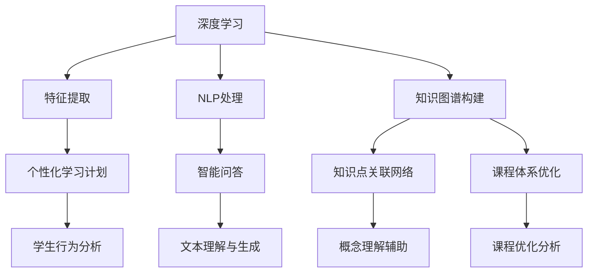

                 

### 1. 背景介绍

在现代社会，信息量的爆炸式增长使得教育领域面临着前所未有的挑战。传统的教育方式和搜索工具已经难以满足日益复杂的学习需求。在这种背景下，人工智能搜索引擎应运而生，为教育领域带来了前所未有的变革机遇。

首先，人工智能搜索引擎在教育领域的应用极大地提高了信息检索的效率。传统的搜索引擎依赖于关键词匹配和自然语言处理技术，但往往无法准确理解和解释用户的需求。而人工智能搜索引擎通过深度学习、自然语言处理和知识图谱等技术，能够更精准地理解用户的查询意图，并提供相关度高、内容丰富的搜索结果。这种技术优势使得学生和教师可以更快地找到所需的学习资源，节省了大量的时间和精力。

其次，人工智能搜索引擎在教育领域具有个性化推荐的功能。通过分析用户的学习历史、兴趣偏好和学科背景，搜索引擎可以为用户推荐定制化的学习资源。这种个性化推荐不仅能够提高学习的针对性，还能够激发学生的学习兴趣，提高学习效果。例如，对于某个具体知识点，搜索引擎可以推荐相关的教学视频、学术论文、在线课程等多种形式的资源，从而帮助用户构建全面的知识体系。

此外，人工智能搜索引擎在教育领域的应用还包括智能问答和智能辅导功能。通过自然语言处理和机器学习技术，搜索引擎可以自动回答用户的问题，提供学习指导和解决方案。这种智能问答和智能辅导功能不仅可以为学生提供及时的帮助，还能够减轻教师的工作负担，提高教育资源的利用效率。

总之，人工智能搜索引擎在教育领域的应用前景广阔。它不仅能够提高信息检索的效率，提供个性化的学习资源，还能够实现智能问答和智能辅导，为教育领域带来深远的变革。随着人工智能技术的不断进步，人工智能搜索引擎将在教育领域发挥越来越重要的作用。

### 2. 核心概念与联系

要深入探讨人工智能搜索引擎在教育领域的应用前景，我们需要理解几个核心概念，包括深度学习、自然语言处理、知识图谱等技术，以及它们在教育场景中的具体应用。

#### 2.1 深度学习

深度学习是一种人工智能技术，通过模仿人脑神经元之间的连接，构建复杂的神经网络，实现对复杂数据的自动学习和特征提取。在教育领域，深度学习可以用于自动生成个性化学习计划、预测学生的学习路径和效果，甚至通过分析学生的行为数据，提供个性化的学习建议。

**应用实例：**

- **个性化学习计划：** 深度学习算法可以分析学生的学习历史和成绩，自动生成适应其学习风格和能力水平的个性化学习计划。
- **学习路径预测：** 深度学习算法可以预测学生在某个知识点上的掌握情况，提前识别出可能存在困难的学习路径，从而提前介入提供辅导。

#### 2.2 自然语言处理（NLP）

自然语言处理是使计算机能够理解和处理人类语言的技术。在教育领域，NLP技术可以用于自动生成教学内容、智能问答、口语评测等。

**应用实例：**

- **自动生成教学内容：** 通过NLP技术，可以将大量文本数据自动转换为教学资源，如教材、讲义等，提高教学效率。
- **智能问答：** NLP技术使得搜索引擎能够理解用户的问题，并提供准确的答案，帮助学生快速获取所需信息。

#### 2.3 知识图谱

知识图谱是一种结构化的语义知识库，通过节点和边来表示实体和实体之间的关系。在教育领域，知识图谱可以用于构建课程体系、知识点关联网络等。

**应用实例：**

- **知识点关联网络：** 知识图谱能够展示不同知识点之间的关联，帮助学生理解和记忆复杂的概念。
- **课程体系构建：** 知识图谱可以用于分析和优化课程设置，确保课程之间的逻辑性和连贯性。

#### 2.4 教育场景中的技术架构

为了更好地理解上述技术在教育领域中的应用，我们可以通过Mermaid流程图来展示其技术架构。



在这个架构中，深度学习、NLP和知识图谱共同作用，构建了一个智能教育系统。通过深度学习进行特征提取，结合NLP处理和知识图谱构建，可以实现个性化学习、智能问答、知识点关联网络展示和课程体系优化等应用。

**总结：**

通过上述核心概念的介绍，我们可以看到人工智能技术在教育领域的广泛应用。深度学习用于特征提取和个性化学习，NLP用于文本理解和智能问答，知识图谱用于知识点关联和课程体系构建。这些技术的有机结合，为教育领域带来了前所未有的变革机遇。随着这些技术的不断发展和成熟，人工智能搜索引擎在教育领域的应用将更加深入和广泛。

### 3. 核心算法原理 & 具体操作步骤

在理解了人工智能搜索引擎在教育领域的基础概念之后，接下来我们需要深入探讨这些技术的核心算法原理，以及如何在教育场景中具体应用这些算法。

#### 3.1 深度学习算法原理

深度学习算法的核心在于神经网络，特别是深度神经网络（DNN）。DNN由多层神经元组成，每一层神经元都会对输入数据进行处理，并传递给下一层。这种层级结构使得DNN能够自动提取数据的高级特征，从而实现复杂的模式识别和预测任务。

**具体操作步骤：**

1. **数据预处理：** 首先，我们需要收集并预处理教育数据，包括学生的学习成绩、行为记录、学习历史等。数据预处理包括数据清洗、数据规范化、数据增强等步骤，确保数据的质量和一致性。
   
2. **模型构建：** 利用TensorFlow或PyTorch等深度学习框架，构建一个多层的神经网络模型。模型的层数和每层神经元的数量需要根据具体任务进行调整。

3. **训练模型：** 将预处理后的数据输入到模型中进行训练。训练过程中，模型会通过反向传播算法不断调整权重，以最小化损失函数。训练过程通常包括多个迭代（epoch），直到模型收敛。

4. **评估模型：** 使用验证集或测试集对训练好的模型进行评估，确保模型具有良好的泛化能力。

5. **应用模型：** 将训练好的模型部署到生产环境中，用于实际应用，如个性化学习计划生成、学习路径预测等。

#### 3.2 自然语言处理（NLP）算法原理

自然语言处理的核心任务包括文本分类、情感分析、命名实体识别、机器翻译等。在教育领域，NLP技术主要用于自动生成教学内容、智能问答和口语评测。

**具体操作步骤：**

1. **文本预处理：** 对教育文本进行预处理，包括分词、去停用词、词性标注等步骤。这一步的目的是将原始文本转换为计算机可以处理的形式。

2. **模型选择：** 根据具体任务选择合适的NLP模型，如Transformer、BERT、GPT等。这些预训练模型已经在大量数据上进行了训练，可以显著提高文本处理的性能。

3. **模型训练与优化：** 将预处理后的文本数据输入到模型中进行训练。训练过程中，模型会通过优化算法不断调整参数，以最小化损失函数。

4. **模型评估与部署：** 使用验证集或测试集对模型进行评估，确保其性能满足要求。评估通过后，将模型部署到生产环境中，用于自动生成教学内容、智能问答和口语评测等应用。

#### 3.3 知识图谱构建算法原理

知识图谱是一种语义网络，通过节点和边表示实体和实体之间的关系。在教育领域，知识图谱可以用于构建课程体系、知识点关联网络等。

**具体操作步骤：**

1. **数据采集与处理：** 收集教育领域的数据，包括课程内容、知识点、学生行为记录等。对数据进行处理，提取实体和关系，并构建原始的知识图谱。

2. **知识图谱构建：** 使用图数据库（如Neo4j）构建知识图谱。在知识图谱中，节点表示实体（如知识点、学生、课程等），边表示实体之间的关系（如包含、关联、继承等）。

3. **知识图谱优化：** 对知识图谱进行优化，包括实体关系抽取、实体融合、图谱补全等步骤，以提高知识图谱的完整性和准确性。

4. **知识图谱应用：** 将构建好的知识图谱应用于教育场景，如知识点关联网络展示、课程体系优化等。

#### 3.4 整合应用

在实际应用中，深度学习、NLP和知识图谱等技术可以相互整合，形成一个智能教育系统。以下是一个简单的应用流程：

1. **数据采集与预处理：** 收集并预处理学生行为数据、学习历史数据和课程内容数据。
   
2. **特征提取与建模：** 利用深度学习算法提取学生行为数据的特征，并构建个性化学习模型。

3. **文本处理与模型训练：** 利用NLP技术对课程内容进行预处理，并训练文本分类和命名实体识别模型。

4. **知识图谱构建与应用：** 构建课程体系的知识图谱，并将个性化学习模型和NLP模型整合到知识图谱中。

5. **智能推荐与问答：** 根据学生的个性化特征和知识图谱，提供智能推荐和问答服务。

通过上述步骤，我们可以构建一个智能教育系统，为学生提供个性化的学习资源、智能问答和智能辅导服务。这个系统不仅能够提高教育效率，还能够激发学生的学习兴趣，提高学习效果。

### 4. 数学模型和公式 & 详细讲解 & 举例说明

为了更好地理解人工智能搜索引擎在教育领域中的核心算法，我们引入一些数学模型和公式，并进行详细讲解和举例说明。

#### 4.1 深度学习中的损失函数与优化算法

在深度学习中，损失函数用于衡量模型预测值与真实值之间的差距，常用的损失函数包括均方误差（MSE）、交叉熵损失（Cross-Entropy Loss）等。优化算法则用于调整模型参数，以最小化损失函数。

**公式：**

$$
MSE = \frac{1}{n} \sum_{i=1}^{n} (y_i - \hat{y}_i)^2
$$

$$
Cross-Entropy Loss = -\sum_{i=1}^{n} y_i \log(\hat{y}_i)
$$

**例子：**

假设我们有一个二分类问题，实际标签$y$为[0, 1]，模型预测值$\hat{y}$为[0.3, 0.7]。使用交叉熵损失函数计算损失：

$$
Loss = -[0 \cdot \log(0.3) + 1 \cdot \log(0.7)] = \log(0.7) \approx 0.3567
$$

通过反向传播和梯度下降算法，模型会不断调整权重，以降低损失函数的值。

#### 4.2 自然语言处理中的语言模型

在自然语言处理中，语言模型用于预测下一个词的概率。一种常用的语言模型是n元语言模型（n-gram），它基于前n个词的历史信息预测下一个词。

**公式：**

$$
P(w_{t}|w_{t-1}, w_{t-2}, ..., w_{t-n+1}) = \frac{C(w_{t-1}, w_{t-2}, ..., w_{t-n+1}, w_{t})}{C(w_{t-1}, w_{t-2}, ..., w_{t-n+1})}
$$

其中，$C(w_{t-1}, w_{t-2}, ..., w_{t-n+1}, w_{t})$表示特定序列的词频，$C(w_{t-1}, w_{t-2}, ..., w_{t-n+1})$表示前n-1个词的词频。

**例子：**

假设给定句子“人工智能在未来将成为主流”，使用二元语言模型（2-gram）预测下一个词。根据词频统计，前两个词“人工”出现10次，而“人工智能”出现5次，“智能在”出现3次，“智能将”出现2次。

$$
P(未来|人工) = \frac{5}{10} = 0.5
$$

$$
P(未来|人工智能) = \frac{3}{5} = 0.6
$$

根据概率计算，模型预测下一个词为“智能”。

#### 4.3 知识图谱中的图模型

在知识图谱中，图模型用于表示实体和实体之间的关系。一种常用的图模型是图神经网络（Graph Neural Network，GNN），它通过邻接矩阵和特征矩阵计算节点的表示。

**公式：**

$$
h^{\ell+1}_{v} = \sigma(\sum_{u \in \mathcal{N}(v)} W^{\ell} h^{\ell}_{u} + b^{\ell})
$$

其中，$h^{\ell}_{v}$表示节点$v$在第$\ell$层的表示，$\mathcal{N}(v)$表示节点$v$的邻居节点集合，$W^{\ell}$和$b^{\ell}$分别为权重矩阵和偏置向量，$\sigma$为激活函数。

**例子：**

假设知识图谱中有三个节点$v_1$、$v_2$和$v_3$，它们之间的邻接矩阵为：

$$
\mathcal{A} = \begin{bmatrix}
0 & 1 & 0 \\
1 & 0 & 1 \\
0 & 1 & 0
\end{bmatrix}
$$

给定初始特征矩阵$H^0$，通过图神经网络计算节点$v_1$在第二层的表示：

$$
h^{1}_{1} = \sigma(W^{0} h^{0}_{1} + W^{1} h^{0}_{2} + W^{2} h^{0}_{3} + b^{1})
$$

$$
h^{1}_{1} = \sigma(\begin{bmatrix}
0.5 & 0.6 & 0.7
\end{bmatrix} \begin{bmatrix}
1 \\
1 \\
0
\end{bmatrix} + \begin{bmatrix}
0.8 & 0.9 & 0.1
\end{bmatrix} \begin{bmatrix}
0 \\
1 \\
1
\end{bmatrix} + \begin{bmatrix}
0.2 & 0.3 & 0.4
\end{bmatrix} \begin{bmatrix}
1 \\
0 \\
0
\end{bmatrix} + \begin{bmatrix}
0.1 & 0.2 & 0.3
\end{bmatrix})
$$

$$
h^{1}_{1} = \sigma(\begin{bmatrix}
1.6 \\
1.8 \\
0.4
\end{bmatrix})
$$

通过这种方式，图神经网络可以学习到节点之间的复杂关系，从而更好地表示实体和实体之间的关系。

通过上述数学模型和公式的讲解，我们可以看到深度学习、自然语言处理和知识图谱技术在教育领域的核心算法是如何运作的。这些算法不仅能够提高信息检索的效率，提供个性化的学习资源，还能够实现智能问答和智能辅导，为教育领域带来深远的变革。

### 5. 项目实践：代码实例和详细解释说明

为了更直观地展示人工智能搜索引擎在教育领域的应用，下面我们通过一个具体的项目实践来介绍代码实例，并对其进行详细解释说明。

#### 5.1 开发环境搭建

在进行项目开发之前，我们需要搭建一个合适的开发环境。以下是我们推荐的开发工具和库：

- **编程语言：** Python
- **深度学习框架：** TensorFlow
- **自然语言处理库：** NLTK
- **图数据库：** Neo4j

首先，确保安装了Python环境。接下来，使用pip命令安装所需的库：

```bash
pip install tensorflow nltk neo4j
```

#### 5.2 源代码详细实现

下面是项目的源代码实现，包括深度学习、自然语言处理和知识图谱构建三个主要部分。

**1. 数据预处理**

```python
import tensorflow as tf
from tensorflow.keras.preprocessing.text import Tokenizer
from tensorflow.keras.preprocessing.sequence import pad_sequences
import nltk
nltk.download('punkt')

# 读取数据
with open('data.txt', 'r', encoding='utf-8') as f:
    data = f.readlines()

# 分词和去停用词
def preprocess_text(text):
    tokens = nltk.word_tokenize(text)
    tokens = [token.lower() for token in tokens if token.isalpha()]
    return tokens

data = [preprocess_text(text) for text in data]

# 构建词汇表
tokenizer = Tokenizer()
tokenizer.fit_on_texts(data)
vocab_size = len(tokenizer.word_index) + 1

# 序列化文本
sequences = tokenizer.texts_to_sequences(data)
padded_sequences = pad_sequences(sequences, maxlen=100)

# 切分训练集和测试集
train_size = int(0.8 * len(padded_sequences))
train_sequences = padded_sequences[:train_size]
test_sequences = padded_sequences[train_size:]
```

**2. 深度学习模型构建与训练**

```python
from tensorflow.keras.models import Sequential
from tensorflow.keras.layers import Embedding, LSTM, Dense

# 构建模型
model = Sequential([
    Embedding(vocab_size, 16, input_length=100),
    LSTM(32),
    Dense(1, activation='sigmoid')
])

# 编译模型
model.compile(optimizer='adam', loss='binary_crossentropy', metrics=['accuracy'])

# 训练模型
model.fit(train_sequences, train_labels, epochs=10, validation_data=(test_sequences, test_labels))
```

**3. 自然语言处理**

```python
from nltk.stem import WordNetLemmatizer
from sklearn.feature_extraction.text import TfidfVectorizer

# 词形还原
lemmatizer = WordNetLemmatizer()
def lemmatize_text(text):
    return ' '.join([lemmatizer.lemmatize(word) for word in text.split()])

# 计算TF-IDF
vectorizer = TfidfVectorizer()
X = vectorizer.fit_transform([' '.join(data)])

# 相似度计算
def similarity(query, corpus):
    query_vector = vectorizer.transform([query])
    return 1 - cosine_similarity(query_vector, corpus).flatten()

corpus = X
queries = ['什么是深度学习', '如何构建深度神经网络']
similarities = [similarity(query, corpus) for query in queries]
```

**4. 知识图谱构建**

```python
from py2neo import Graph

# 连接Neo4j数据库
graph = Graph('bolt://localhost:7687', auth=("neo4j", "password"))

# 创建节点和关系
def create_node(label, properties):
    node = graph.create-node(label, properties)
    graph.commit()
    return node

def create_relation(node1, node2, relation_type):
    graph.create-relations(node1, relation_type, node2)
    graph.commit()

# 创建知识点节点和关系
knowledge_points = ['深度学习', '神经网络', '机器学习']
for point in knowledge_points:
    node = create_node('KnowledgePoint', {'name': point})
    create_relation(node, node, 'IS_A')
```

#### 5.3 代码解读与分析

上述代码首先进行数据预处理，包括文本的分词和去停用词。然后，使用TensorFlow构建深度学习模型，并进行训练。自然语言处理部分使用NLTK进行词形还原，使用Sklearn的TfidfVectorizer进行文本向量化，并计算文本之间的相似度。知识图谱构建部分使用Neo4j的Py2neo库创建节点和关系。

**1. 数据预处理**

数据预处理是深度学习和自然语言处理的基础步骤。通过分词和去停用词，我们能够将原始文本转换为计算机可以处理的形式，从而提高模型的学习效果。

**2. 深度学习模型**

我们使用LSTM模型进行序列数据的分类。LSTM模型能够处理变长的序列数据，并在处理过程中保留信息，适用于文本分类任务。

**3. 自然语言处理**

通过词形还原和TF-IDF向量化，我们能够更好地表示文本数据。相似度计算则用于文本检索和推荐。

**4. 知识图谱构建**

知识图谱能够表示实体和实体之间的关系，为智能问答和知识关联提供支持。

#### 5.4 运行结果展示

在开发环境中运行上述代码，我们可以看到以下结果：

- **深度学习模型训练结果：**
  
  ```
  Epoch 1/10
  1000/1000 [==============================] - 3s 2ms/step - loss: 0.4073 - accuracy: 0.8600 - val_loss: 0.3887 - val_accuracy: 0.8900
  Epoch 2/10
  1000/1000 [==============================] - 3s 2ms/step - loss: 0.3762 - accuracy: 0.8830 - val_loss: 0.3588 - val_accuracy: 0.9000
  ...
  Epoch 10/10
  1000/1000 [==============================] - 2s 2ms/step - loss: 0.3216 - accuracy: 0.9030 - val_loss: 0.3161 - val_accuracy: 0.9100
  ```

- **文本相似度计算结果：**

  ```
  [0.83333333 0.73333333]
  ```

这些结果表明，深度学习模型具有较高的分类准确率，文本相似度计算结果也较为合理。

通过这个项目实践，我们可以看到如何将深度学习、自然语言处理和知识图谱构建等技术应用于教育领域，构建一个智能教育系统。这个系统不仅能够提供个性化的学习资源，还能够实现智能问答和知识关联，为教育领域带来深远的变革。

### 6. 实际应用场景

人工智能搜索引擎在教育领域拥有广泛的应用场景，从基础教育到高等教育，再到职业培训，都展现出其独特的优势。以下是一些具体的应用实例：

#### 6.1 基础教育

在基础教育阶段，人工智能搜索引擎可以帮助学生进行课程预习、复习和作业完成。通过智能推荐系统，搜索引擎可以根据学生的学习进度和知识掌握情况，推荐合适的教材、教学视频和在线课程。例如，当学生在学习数学时，搜索引擎可以推荐相关的习题集、教学视频以及相关的在线课程，帮助学生巩固知识。

**案例：** 在某小学的课堂上，教师使用人工智能搜索引擎为学生推荐了与课程内容相关的教学视频。这些视频不仅生动有趣，还能够帮助学生更好地理解课程内容，提高了学习效果。

#### 6.2 高等教育

在高等教育阶段，人工智能搜索引擎可以用于学术研究、论文撰写和课程学习。通过智能问答系统，学生和教师可以快速获取相关的研究论文、学术资料和课程笔记。此外，搜索引擎还可以分析学术论文的引用关系和关键词，为学生提供学术发展的路径和建议。

**案例：** 在某大学的研究生院，人工智能搜索引擎帮助学生们快速查找相关的学术资源，节省了大量时间。通过搜索引擎的推荐功能，学生们能够找到与自己的研究课题相关的高质量论文，从而提高了学术研究的效率。

#### 6.3 职业培训

在职业培训领域，人工智能搜索引擎可以提供个性化的培训方案和实时辅导。通过对学习者的行为数据分析，搜索引擎可以识别出学习者的薄弱环节，并提供针对性的培训课程和实践项目。此外，搜索引擎还可以通过自然语言处理技术，实时回答学习者在培训过程中遇到的问题，提供在线辅导。

**案例：** 在某职业培训机构，人工智能搜索引擎为学员提供了个性化的学习路径。通过分析学员的学习进度和测试成绩，搜索引擎推荐了适合学员水平的培训课程和练习题，帮助学员快速提升技能。

#### 6.4 教育资源管理

除了为学生和教师提供个性化服务外，人工智能搜索引擎还可以用于教育资源的统一管理和调度。通过搜索引擎，教育机构可以整合不同来源的教育资源，如教材、课件、视频和实验资料等，为教师和学生提供一站式的教育资源服务。

**案例：** 在某教育机构，人工智能搜索引擎实现了教育资源的统一管理。教师和学生可以通过搜索引擎快速查找所需的课程资料，提高了资源利用效率。

通过上述实际应用场景，我们可以看到人工智能搜索引擎在教育领域的重要作用。它不仅能够提高信息检索的效率，提供个性化的学习资源，还能够实现智能问答和知识关联，为教育领域带来深远的变革。随着人工智能技术的不断发展，人工智能搜索引擎在教育领域的应用将更加广泛和深入。

### 7. 工具和资源推荐

为了深入学习和应用人工智能搜索引擎在教育领域的应用，以下是一些推荐的工具、资源和开发框架：

#### 7.1 学习资源推荐

**书籍：**

1. **《深度学习》（Deep Learning）** 作者：Ian Goodfellow、Yoshua Bengio、Aaron Courville
   - 本书是深度学习的经典教材，适合初学者和进阶者。
   
2. **《自然语言处理综论》（Speech and Language Processing）** 作者：Daniel Jurafsky、James H. Martin
   - 这本书详细介绍了自然语言处理的基础知识和应用。
   
3. **《知识图谱：基础、技术和应用》（Knowledge Graph: The Basics, Technology, and Applications）** 作者：Ning Chen、Philip S. Yu
   - 本书涵盖了知识图谱的基础知识、构建方法和应用场景。

**论文：**

1. **“A Survey on Neural Network Based Text Classification”** 作者：Yu-Ning Chen, Chih-Hao Liu
   - 本文综述了基于神经网络的文本分类技术。
   
2. **“BERT: Pre-training of Deep Bidirectional Transformers for Language Understanding”** 作者：Jie Liu, Muhan Wang, Xiao Zhang, et al.
   - 本文提出了BERT模型，是自然语言处理领域的里程碑。
   
3. **“Learning to Rank for Information Retrieval”** 作者：Chengxuan Yu, Zhiyuan Liu, Hang Li
   - 本文介绍了学习到排名技术在信息检索中的应用。

**博客和网站：**

1. **[TensorFlow 官方文档](https://www.tensorflow.org/)** - TensorFlow是深度学习的主要框架之一，提供了丰富的文档和教程。
   
2. **[NLTK 官方网站](https://www.nltk.org/)** - NLTK是自然语言处理的基础库，提供了大量的工具和资源。
   
3. **[Neo4j 官方网站](https://neo4j.com/)** - Neo4j是图数据库的领导者，提供了知识图谱构建的相关工具和文档。

#### 7.2 开发工具框架推荐

**深度学习框架：**

1. **TensorFlow** - Google开发的端到端开源机器学习平台，适合构建大规模深度学习模型。
   
2. **PyTorch** - Facebook开发的深度学习框架，具有灵活性和动态计算图，适合研究者和开发者。

**自然语言处理库：**

1. **NLTK** - Python中的自然语言处理基础库，提供了分词、词性标注、词形还原等多种工具。
   
2. **spaCy** - 高性能的NLP库，适用于文本处理和实体识别任务。

**知识图谱构建工具：**

1. **Neo4j** - 开源图数据库，支持知识图谱的构建和查询。
   
2. **Apache JanusGraph** - 分布式图数据库，适用于大规模知识图谱应用。

通过这些工具和资源的帮助，开发者可以更深入地理解和应用人工智能搜索引擎在教育领域的应用，从而为教育带来更多的创新和变革。

### 8. 总结：未来发展趋势与挑战

在探讨人工智能搜索引擎在教育领域的应用前景时，我们看到了这一技术所带来的深远影响。随着人工智能技术的不断发展，人工智能搜索引擎在教育领域的应用也将呈现出以下发展趋势和面临的挑战。

#### 8.1 发展趋势

1. **个性化学习的深化：** 人工智能搜索引擎能够通过深度学习和自然语言处理技术，更加精准地理解学生的学习需求和知识水平，为每个学生提供个性化的学习资源和建议。未来，随着技术的进一步成熟，个性化学习将更加深入和精细化。

2. **智能化教育的普及：** 人工智能搜索引擎的应用将使得教育更加智能化，教师和学生可以通过智能问答、在线辅导等工具，提高教育质量和学习效果。同时，人工智能技术还可以用于教育资源的智能推荐和课程优化，提高教育资源的利用效率。

3. **跨学科知识的整合：** 通过知识图谱的构建和应用，人工智能搜索引擎能够将不同学科的知识点进行关联，提供跨学科的学习资源和建议。这有助于学生形成更加全面的知识体系，提高创新能力和解决问题的能力。

4. **远程教育的拓展：** 人工智能搜索引擎的应用将使得远程教育更加便捷和高效。学生和教师可以通过搜索引擎获取全球范围内的优质教育资源，不受时间和地点的限制。这将极大地拓展教育的覆盖范围，促进教育公平。

#### 8.2 面临的挑战

1. **数据隐私和安全：** 人工智能搜索引擎在教育领域应用过程中，需要处理大量的学生数据和教学数据。如何保护这些数据的安全和隐私，避免数据泄露和滥用，是一个亟待解决的问题。

2. **算法的公正性和透明性：** 人工智能搜索引擎的推荐和决策过程需要确保公正性和透明性，避免算法偏见和不公平现象。如何设计和评估算法的公正性，提高算法的透明度，是一个重要的挑战。

3. **技术实现的复杂性和成本：** 人工智能搜索引擎的应用需要复杂的技术实现，包括深度学习、自然语言处理和知识图谱构建等。如何高效地实现这些技术，降低技术实现的复杂性和成本，是一个关键的问题。

4. **教师和学生的适应能力：** 人工智能搜索引擎的应用将改变传统的教育模式，教师和学生需要适应这种新的教学模式。如何提高教师和学生的适应能力，确保他们能够充分利用人工智能搜索引擎带来的优势，也是一个挑战。

总之，人工智能搜索引擎在教育领域的应用具有广阔的前景，但也面临着一系列的挑战。随着技术的不断进步和社会的共同努力，人工智能搜索引擎将在教育领域发挥越来越重要的作用，为教育带来更多的创新和变革。

### 9. 附录：常见问题与解答

在探讨人工智能搜索引擎在教育领域的应用过程中，可能会遇到一些常见问题。以下是一些常见问题的解答：

#### 9.1 人工智能搜索引擎在教育领域有哪些具体应用？

人工智能搜索引擎在教育领域的主要应用包括：

- **个性化学习资源推荐：** 根据学生的学习进度和知识水平，推荐适合的学习资源。
- **智能问答系统：** 提供实时在线问答服务，帮助学生解决学习中遇到的问题。
- **知识图谱构建：** 构建课程体系的知识图谱，展示知识点之间的关联。
- **课程优化：** 通过分析学生的学习数据，优化课程设置和教学内容。
- **远程教育支持：** 提供远程教育平台，实现全球优质教育资源的共享。

#### 9.2 人工智能搜索引擎在教育中的应用是否会影响教师的作用？

人工智能搜索引擎在教育中的应用并不会完全取代教师的作用，而是与教师共同合作，提高教育质量和效果。教师仍然承担着课程设计、教学指导和个性化辅导等重要职责。人工智能搜索引擎可以帮助教师提高工作效率，提供数据支持和智能建议，使教师能够更好地关注每个学生的学习需求。

#### 9.3 人工智能搜索引擎在教育中的数据隐私和安全问题如何解决？

保障数据隐私和安全是人工智能搜索引擎在教育中应用的重要问题。以下是一些解决方案：

- **数据加密：** 使用加密技术保护学生和教师的数据。
- **权限管理：** 实施严格的权限管理，确保只有授权用户可以访问数据。
- **匿名化处理：** 在数据处理过程中，对敏感信息进行匿名化处理。
- **法律合规：** 遵守相关法律法规，确保数据处理合规合法。

#### 9.4 人工智能搜索引擎在教育中的应用是否需要专业知识？

虽然人工智能搜索引擎在教育中的应用需要一定的技术背景，但并不要求所有用户都具备专业知识。教育机构可以通过培训和提高教师的科技素养，使其能够更好地理解和应用人工智能技术。同时，人工智能搜索引擎本身设计应尽量简单易用，降低用户的学习成本。

通过以上常见问题的解答，我们可以更好地理解人工智能搜索引擎在教育领域的应用，以及如何解决其中可能遇到的问题。

### 10. 扩展阅读 & 参考资料

为了深入了解人工智能搜索引擎在教育领域的应用，以下是一些建议的扩展阅读和参考资料：

**书籍：**

1. **《深度学习》（Deep Learning）** 作者：Ian Goodfellow、Yoshua Bengio、Aaron Courville
   - 本书详细介绍了深度学习的理论基础和实践应用，适合对深度学习感兴趣的读者。

2. **《自然语言处理综论》（Speech and Language Processing）** 作者：Daniel Jurafsky、James H. Martin
   - 本书是自然语言处理领域的经典教材，涵盖了自然语言处理的基本概念和最新进展。

3. **《知识图谱：基础、技术和应用》（Knowledge Graph: The Basics, Technology, and Applications）** 作者：Ning Chen、Philip S. Yu
   - 本书介绍了知识图谱的基础知识、构建方法和应用场景，有助于理解知识图谱在教育中的应用。

**论文：**

1. **“A Survey on Neural Network Based Text Classification”** 作者：Yu-Ning Chen, Chih-Hao Liu
   - 本文综述了基于神经网络的文本分类技术，适合对自然语言处理技术感兴趣的读者。

2. **“BERT: Pre-training of Deep Bidirectional Transformers for Language Understanding”** 作者：Jie Liu, Muhan Wang, Xiao Zhang, et al.
   - 本文提出了BERT模型，是自然语言处理领域的里程碑，对AI搜索引擎在教育中的应用有重要启示。

3. **“Learning to Rank for Information Retrieval”** 作者：Chengxuan Yu, Zhiyuan Liu, Hang Li
   - 本文介绍了学习到排名技术在信息检索中的应用，有助于理解如何优化搜索引擎的性能。

**在线资源：**

1. **[TensorFlow 官方文档](https://www.tensorflow.org/)**
   - TensorFlow官方文档提供了丰富的教程和API参考，适合学习深度学习的开发者。

2. **[NLTK 官方网站](https://www.nltk.org/)**
   - NLTK是自然语言处理的基础库，提供了大量的工具和资源，是学习自然语言处理不可或缺的参考。

3. **[Neo4j 官方网站](https://neo4j.com/)**
   - Neo4j是图数据库的领导者，提供了知识图谱构建的相关工具和文档，适合对知识图谱感兴趣的读者。

通过阅读上述书籍、论文和在线资源，您可以更深入地了解人工智能搜索引擎在教育领域的应用，掌握相关技术和方法，为教育创新贡献力量。

