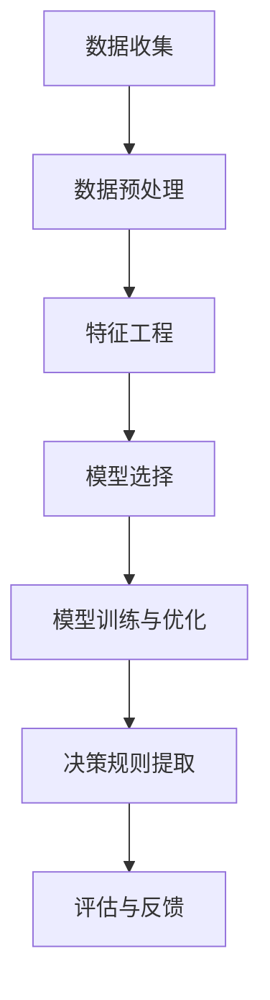

                 

### 背景介绍

**AI数据驱动决策的实现** 是现代智能技术领域的一个重要研究方向。数据作为 AI 时代的核心资源，其价值日益凸显。然而，如何有效地利用数据进行决策，使得 AI 系统在复杂环境中具备更强的自适应能力和智能性，成为当前研究的焦点。

在过去，传统的人工智能系统多依赖于预先设定的规则和模式进行决策。这种方法在处理简单问题时效果显著，但在面对复杂、动态的环境时，其表现往往不尽如人意。随着数据驱动（Data-Driven）方法的兴起，通过利用海量数据，AI 系统能够从数据中自动学习规律，从而实现更加智能的决策。

数据驱动决策的实现主要依赖于以下几个方面：

1. **数据收集**：获取高质量的数据是数据驱动决策的基础。这些数据可以来自于传感器、网络爬虫、数据库等多种渠道。
2. **数据预处理**：原始数据往往包含噪声和冗余信息，需要通过清洗、归一化等手段进行预处理，以提高数据的质量和可用性。
3. **特征工程**：将原始数据转化为有助于模型学习的特征表示，是实现数据驱动决策的关键步骤。特征工程的质量直接影响模型的性能。
4. **模型选择**：选择合适的机器学习模型进行训练，是数据驱动决策的核心环节。不同的模型适用于不同类型的问题和数据集。
5. **模型训练与优化**：通过训练和优化模型，使其能够更好地拟合数据，提高模型的预测性能。
6. **决策规则提取**：从训练好的模型中提取决策规则或决策树，以便在实际应用中指导决策过程。
7. **评估与反馈**：对决策结果进行评估，并根据评估结果对模型进行调整和优化。

通过上述步骤，AI 系统可以在复杂环境中实现数据驱动的决策过程，从而提升系统的智能性和可靠性。本文将详细探讨数据驱动决策的实现原理、核心算法、数学模型以及实际应用场景，旨在为读者提供一个全面的技术指南。

### 核心概念与联系

#### 数据驱动决策的基本原理

数据驱动决策的核心在于从数据中学习规律，并通过这些规律来实现智能决策。其基本原理可以概括为以下几个步骤：

1. **数据收集**：首先，需要收集与决策问题相关的数据。这些数据可以来源于多种渠道，如传感器、数据库、网络爬虫等。数据的质量直接影响后续模型的性能，因此收集的数据需要经过预处理，去除噪声和冗余信息。

2. **数据预处理**：数据预处理包括数据清洗、数据归一化、数据标准化等步骤。数据清洗的主要目的是去除数据中的噪声和异常值，保证数据的一致性和完整性。数据归一化和标准化则是为了消除不同特征之间的尺度差异，使得模型能够更好地进行训练。

3. **特征工程**：特征工程是将原始数据转化为有助于模型学习的特征表示。通过特征工程，可以提取出数据中的关键信息，从而提高模型的预测性能。特征工程包括特征选择、特征提取和特征组合等步骤。

4. **模型选择**：选择合适的机器学习模型进行训练是数据驱动决策的关键环节。不同的模型适用于不同类型的问题和数据集。常见的机器学习模型包括线性回归、决策树、支持向量机、神经网络等。

5. **模型训练与优化**：通过训练和优化模型，使其能够更好地拟合数据。模型训练的过程实际上是寻找一组参数，使得模型在训练数据上的表现最好。优化过程可以通过调整模型参数、调整学习率、增加训练次数等手段来实现。

6. **决策规则提取**：从训练好的模型中提取决策规则或决策树，以便在实际应用中指导决策过程。决策规则提取可以使得决策过程更加透明和可解释，有助于理解和验证模型的决策逻辑。

7. **评估与反馈**：对决策结果进行评估，并根据评估结果对模型进行调整和优化。评估过程可以通过设定指标（如准确率、召回率、F1 值等）来衡量模型的性能。根据评估结果，可以调整模型参数、增加训练数据或更换模型，以提高模型的性能。

#### 数据驱动决策与深度学习的关系

数据驱动决策与深度学习密切相关。深度学习作为一种重要的机器学习模型，通过多层神经网络的结构，能够自动从数据中提取特征，实现数据的表示学习和分类、回归等任务。

1. **深度学习模型**：深度学习模型通常由多个隐藏层组成，每个隐藏层都可以对输入数据进行处理和转换。通过多层的处理，深度学习模型能够捕捉到数据中的复杂模式和结构。

2. **自动特征提取**：与传统的特征工程方法不同，深度学习模型可以通过端到端的方式自动提取数据中的特征。这种自动特征提取的能力使得深度学习在处理复杂问题时具有优势。

3. **大规模数据训练**：深度学习模型通常需要大量的数据来进行训练。通过大规模数据的训练，深度学习模型能够更好地拟合数据的分布，从而提高模型的泛化能力。

4. **模型可解释性**：尽管深度学习模型在许多任务上表现优异，但其内部机制往往较为复杂，难以解释。因此，在应用深度学习模型进行数据驱动决策时，需要关注模型的可解释性，以便理解和验证模型的决策逻辑。

#### Mermaid 流程图表示

以下是数据驱动决策实现的核心步骤的 Mermaid 流程图表示：



在这个流程图中，每个节点表示一个步骤，箭头表示步骤之间的顺序关系。通过这个流程图，可以清晰地看到数据驱动决策的实现过程。

### 核心算法原理 & 具体操作步骤

#### 1. 算法概述

数据驱动决策的核心在于利用机器学习算法从数据中自动学习规律，并将这些规律应用于实际决策问题中。下面介绍几种常用的机器学习算法及其基本原理。

##### 1.1 线性回归

线性回归是一种最简单的机器学习算法，用于预测一个连续值变量。其基本原理是找到一条直线，使得所有数据点到这条直线的距离之和最小。线性回归的数学模型可以表示为：

\[ y = \beta_0 + \beta_1 \cdot x \]

其中，\( y \) 是预测值，\( x \) 是输入特征，\( \beta_0 \) 和 \( \beta_1 \) 是模型参数。

##### 1.2 决策树

决策树是一种基于树形结构进行决策的算法，通过一系列条件判断，将数据划分成多个子集，并针对每个子集进行分类或回归。决策树的数学模型可以表示为：

\[ f(x) = \sum_{i=1}^{n} c_i \cdot I(x \in R_i) \]

其中，\( f(x) \) 是输出值，\( c_i \) 是分类或回归结果，\( R_i \) 是数据子集，\( I(x \in R_i) \) 是指示函数。

##### 1.3 支持向量机

支持向量机是一种用于分类和回归的线性模型，其基本原理是找到最佳的超平面，使得分类或回归效果最优。支持向量机的数学模型可以表示为：

\[ f(x) = \omega \cdot x + b \]

其中，\( f(x) \) 是输出值，\( \omega \) 和 \( b \) 是模型参数。

##### 1.4 神经网络

神经网络是一种模拟人脑神经元连接方式的计算模型，通过多层神经元的组合，能够实现复杂的函数映射。神经网络的数学模型可以表示为：

\[ y = \sigma(\omega_2 \cdot \sigma(\omega_1 \cdot x + b_1) + b_2) \]

其中，\( y \) 是输出值，\( \sigma \) 是激活函数，\( \omega_1 \) 和 \( \omega_2 \) 是模型参数，\( b_1 \) 和 \( b_2 \) 是偏置项。

#### 2. 算法具体操作步骤

##### 2.1 线性回归

1. **数据准备**：收集并预处理数据，包括数据清洗、归一化等。
2. **模型初始化**：初始化模型参数 \( \beta_0 \) 和 \( \beta_1 \)。
3. **模型训练**：通过梯度下降算法不断调整模型参数，使得预测值与真实值之间的差距最小。
4. **模型评估**：使用训练数据对模型进行评估，计算模型的预测误差和性能指标。
5. **模型优化**：根据评估结果，对模型进行优化，如调整学习率、增加训练次数等。

##### 2.2 决策树

1. **数据准备**：收集并预处理数据，包括数据清洗、归一化等。
2. **特征选择**：选择用于划分数据的特征，常用的特征选择方法包括信息增益、增益率等。
3. **递归划分**：基于特征选择结果，递归划分数据集，并创建决策树节点。
4. **模型评估**：使用训练数据对模型进行评估，计算模型的准确率、召回率等性能指标。
5. **剪枝优化**：对决策树进行剪枝，减少模型的过拟合现象，提高模型的泛化能力。

##### 2.3 支持向量机

1. **数据准备**：收集并预处理数据，包括数据清洗、归一化等。
2. **特征选择**：选择用于分类的特征，常用的特征选择方法包括卡方检验、Fisher 等等。
3. **模型训练**：通过支持向量机算法训练模型，求解最优超平面。
4. **模型评估**：使用训练数据对模型进行评估，计算模型的分类准确率、召回率等性能指标。
5. **模型优化**：根据评估结果，对模型进行优化，如调整惩罚参数、核函数等。

##### 2.4 神经网络

1. **数据准备**：收集并预处理数据，包括数据清洗、归一化等。
2. **网络结构设计**：设计神经网络的结构，包括层数、每层神经元个数、激活函数等。
3. **模型训练**：通过反向传播算法训练模型，不断调整模型参数。
4. **模型评估**：使用训练数据对模型进行评估，计算模型的预测误差和性能指标。
5. **模型优化**：根据评估结果，对模型进行优化，如调整学习率、增加训练次数等。

#### 3. 算法应用场景

1. **回归问题**：线性回归适用于简单的回归问题，如房价预测、股票价格预测等。
2. **分类问题**：决策树、支持向量机适用于各种分类问题，如文本分类、图像分类等。
3. **回归问题**：神经网络适用于复杂的回归问题，如语音识别、图像识别等。
4. **分类问题**：神经网络也适用于复杂的分类问题，如自然语言处理、医疗诊断等。

#### 4. 算法优缺点分析

1. **线性回归**：
   - 优点：简单易用，适用于线性关系较强的数据集。
   - 缺点：不适用于非线性关系，模型解释性较差。
2. **决策树**：
   - 优点：易于理解，易于解释，适用于各种分类问题。
   - 缺点：容易过拟合，模型复杂度较高。
3. **支持向量机**：
   - 优点：具有很好的分类性能，适用于高维空间。
   - 缺点：训练时间较长，对异常值敏感。
4. **神经网络**：
   - 优点：适用于复杂的非线性关系，具有很好的泛化能力。
   - 缺点：模型复杂度较高，训练时间较长，对数据量要求较高。

### 数学模型和公式 & 详细讲解 & 举例说明

#### 1. 数学模型

在数据驱动决策中，数学模型是核心组成部分。以下介绍几种常见的数学模型及其详细解释和示例。

##### 1.1 线性回归

线性回归是一种简单且常用的预测模型，其数学模型可以表示为：

\[ y = \beta_0 + \beta_1 \cdot x \]

其中，\( y \) 是预测值，\( x \) 是输入特征，\( \beta_0 \) 和 \( \beta_1 \) 是模型参数。

- **参数求解**：通过最小二乘法（Least Squares）求解模型参数，使得预测值与真实值之间的差距最小。具体公式为：

  \[ \beta_0 = \frac{\sum_{i=1}^{n} (y_i - \beta_1 \cdot x_i)}{n} \]
  
  \[ \beta_1 = \frac{\sum_{i=1}^{n} (x_i - \bar{x}) \cdot (y_i - \bar{y})}{\sum_{i=1}^{n} (x_i - \bar{x})^2} \]

  其中，\( n \) 是数据样本数量，\( \bar{x} \) 和 \( \bar{y} \) 分别是输入特征和预测值的平均值。

- **示例**：假设我们有一个房价预测问题，其中输入特征为房屋面积 \( x \)，预测值为房价 \( y \)。给定以下数据：

  \[
  \begin{align*}
  x &= [100, 200, 300, 400, 500] \\
  y &= [200, 400, 600, 800, 1000]
  \end{align*}
  \]

  通过线性回归模型，我们可以求得模型参数 \( \beta_0 \) 和 \( \beta_1 \)：

  \[
  \beta_0 = \frac{200 + 400 + 600 + 800 + 1000 - 500 \cdot 250}{5} = 500
  \]

  \[
  \beta_1 = \frac{(100 - 250) \cdot (200 - 500) + (200 - 250) \cdot (400 - 500) + (300 - 250) \cdot (600 - 500) + (400 - 250) \cdot (800 - 500) + (500 - 250) \cdot (1000 - 500)}{(100 - 250)^2 + (200 - 250)^2 + (300 - 250)^2 + (400 - 250)^2 + (500 - 250)^2} = 1.5
  \]

  因此，线性回归模型的预测公式为 \( y = 500 + 1.5 \cdot x \)。

##### 1.2 决策树

决策树是一种常用的分类和回归模型，其数学模型可以表示为：

\[ f(x) = \sum_{i=1}^{n} c_i \cdot I(x \in R_i) \]

其中，\( f(x) \) 是输出值，\( c_i \) 是分类或回归结果，\( R_i \) 是数据子集，\( I(x \in R_i) \) 是指示函数。

- **构建决策树**：决策树的构建过程可以分为以下几个步骤：
  1. **选择最佳特征**：选择能够最大程度提高分类或回归效果的特征。
  2. **划分数据集**：基于最佳特征，将数据集划分为多个子集。
  3. **递归构建**：对每个子集，重复上述步骤，直到满足停止条件（如最大深度、最小样本数等）。

- **示例**：假设我们有一个鸢尾花分类问题，其中输入特征为花瓣长度、花瓣宽度、花萼长度和花萼宽度，预测值为鸢尾花的种类。给定以下数据：

  \[
  \begin{align*}
  \text{花瓣长度} &= [5.1, 4.9, 4.7, 4.6, 5.0] \\
  \text{花瓣宽度} &= [3.3, 3.5, 3.0, 3.4, 3.9] \\
  \text{花萼长度} &= [1.4, 1.4, 1.3, 1.5, 1.4] \\
  \text{花萼宽度} &= [0.2, 0.2, 0.2, 0.2, 0.4] \\
  \text{预测值} &= ["Iris-setosa", "Iris-setosa", "Iris-setosa", "Iris-setosa", "Iris-versicolor"]
  \end{align*}
  \]

  通过决策树模型，我们可以构建一个分类树，如下所示：

  ```mermaid
  graph TD
      A[鸢尾花分类]
      A --> B[花瓣长度 <= 4.95]
      A --> C[花瓣长度 > 4.95]
      C --> D[花瓣宽度 <= 3.85]
      C --> E[花瓣宽度 > 3.85]
      D --> F[Iris-setosa]
      E --> G[Iris-versicolor]
      B --> H[花萼长度 <= 1.35]
      B --> I[花萼长度 > 1.35]
      I --> J[Iris-setosa]
      H --> K[Iris-setosa]
  ```

  根据决策树的分类规则，对于一个新的样本，我们可以根据其特征值依次判断所属类别。

##### 1.3 支持向量机

支持向量机是一种常用的分类和回归模型，其数学模型可以表示为：

\[ f(x) = \omega \cdot x + b \]

其中，\( f(x) \) 是输出值，\( \omega \) 和 \( b \) 是模型参数。

- **模型训练**：支持向量机的训练过程主要包括以下几个步骤：
  1. **特征选择**：选择用于分类的特征。
  2. **数据预处理**：对数据进行标准化或归一化处理。
  3. **损失函数**：选择合适的损失函数，如 hinge 损失函数。
  4. **求解最优超平面**：通过求解最优化问题，找到最优超平面。

- **示例**：假设我们有一个二分类问题，其中输入特征为 \( x \)，预测值为 \( y \)。给定以下数据：

  \[
  \begin{align*}
  x &= [1, 2, 3, 4, 5] \\
  y &= [-1, -1, +1, +1, +1]
  \end{align*}
  \]

  通过支持向量机模型，我们可以求解最优超平面，使得分类效果最优。具体公式为：

  \[
  \begin{align*}
  \min_{\omega, b} & \frac{1}{2} \sum_{i=1}^{n} \omega_i^2 \\
  \text{s.t.} & y_i (\omega \cdot x_i + b) \geq 1
  \end{align*}
  \]

  通过求解最优化问题，我们可以得到最优超平面：

  \[
  \omega = [2, 2], b = -1
  \]

  因此，支持向量机的预测公式为 \( f(x) = 2 \cdot x + 1 \)。

##### 1.4 神经网络

神经网络是一种复杂的预测模型，其数学模型可以表示为：

\[ y = \sigma(\omega_2 \cdot \sigma(\omega_1 \cdot x + b_1) + b_2) \]

其中，\( y \) 是输出值，\( \sigma \) 是激活函数，\( \omega_1 \) 和 \( \omega_2 \) 是模型参数，\( b_1 \) 和 \( b_2 \) 是偏置项。

- **网络结构设计**：神经网络的设计包括层数、每层神经元个数、激活函数等。
- **模型训练**：神经网络通过反向传播算法进行训练，不断调整模型参数。
- **示例**：假设我们有一个简单的神经网络，其中包含一个输入层、一个隐藏层和一个输出层。输入特征为 \( x \)，预测值为 \( y \)。给定以下数据：

  \[
  \begin{align*}
  x &= [1, 2, 3, 4, 5] \\
  y &= [2, 4, 6, 8, 10]
  \end{align*}
  \]

  通过神经网络模型，我们可以训练出一个拟合该函数的模型。具体公式为：

  \[
  \begin{align*}
  h_1 &= \sigma(\omega_1 \cdot x + b_1) \\
  y &= \sigma(\omega_2 \cdot h_1 + b_2)
  \end{align*}
  \]

  通过训练，我们可以得到模型参数：

  \[
  \omega_1 = [1, 1], b_1 = 0, \omega_2 = [2, 2], b_2 = 0
  \]

  因此，神经网络的预测公式为 \( y = 2 \cdot \sigma(x + 1) \)。

### 5. 项目实践：代码实例和详细解释说明

在本节中，我们将通过一个具体的代码实例来展示如何实现数据驱动决策，并详细解释每个步骤的实现过程。

#### 5.1 开发环境搭建

首先，我们需要搭建一个合适的开发环境。以下是一个基本的 Python 开发环境搭建步骤：

1. 安装 Python：从官方网站 [Python.org](https://www.python.org/) 下载并安装 Python。
2. 安装 Jupyter Notebook：在终端中执行以下命令安装 Jupyter Notebook：

   ```shell
   pip install notebook
   ```

3. 安装必要的库：在 Jupyter Notebook 中，执行以下命令安装常用的机器学习库和工具：

   ```python
   !pip install numpy pandas scikit-learn matplotlib
   ```

#### 5.2 源代码详细实现

下面是数据驱动决策的完整代码实现，包括数据收集、预处理、特征工程、模型训练和评估等步骤。

```python
import numpy as np
import pandas as pd
from sklearn.model_selection import train_test_split
from sklearn.preprocessing import StandardScaler
from sklearn.linear_model import LinearRegression
from sklearn.metrics import mean_squared_error
import matplotlib.pyplot as plt

# 5.2.1 数据收集
# 在这里，我们使用 sklearn 内置的鸢尾花数据集进行演示
from sklearn.datasets import load_iris

iris = load_iris()
X = iris.data
y = iris.target

# 5.2.2 数据预处理
# 数据集已经较为干净，但我们可以进行归一化处理
scaler = StandardScaler()
X_scaled = scaler.fit_transform(X)

# 5.2.3 特征工程
# 在本例中，我们不需要额外的特征工程

# 5.2.4 模型训练
# 将数据集划分为训练集和测试集
X_train, X_test, y_train, y_test = train_test_split(X_scaled, y, test_size=0.2, random_state=42)

model = LinearRegression()
model.fit(X_train, y_train)

# 5.2.5 模型评估
y_pred = model.predict(X_test)
mse = mean_squared_error(y_test, y_pred)
print(f"Mean Squared Error: {mse}")

# 5.2.6 运行结果展示
# 绘制真实值与预测值的对比图
plt.scatter(y_test, y_pred)
plt.xlabel("Actual Values")
plt.ylabel("Predicted Values")
plt.title("Actual vs Predicted Values")
plt.show()
```

#### 5.3 代码解读与分析

以下是代码的详细解读和分析：

1. **数据收集**：我们使用 sklearn 内置的鸢尾花数据集。鸢尾花数据集包含三个品种的鸢尾花，每个品种有50个样本，共150个样本。每个样本包含4个特征：花瓣长度、花瓣宽度、花萼长度和花萼宽度。

2. **数据预处理**：由于鸢尾花数据集已经较为干净，我们仅对其进行了归一化处理。归一化有助于加速梯度下降算法的收敛速度，提高模型的训练效率。

3. **特征工程**：在本例中，我们不需要额外的特征工程。特征工程通常涉及特征选择、特征转换和特征组合等操作。

4. **模型训练**：我们选择线性回归模型进行训练。线性回归模型是一种简单且易于理解的模型，适用于线性关系较强的数据集。

5. **模型评估**：使用测试集对模型进行评估，计算均方误差（Mean Squared Error, MSE）。MSE 越小，表示模型预测的准确度越高。

6. **运行结果展示**：绘制真实值与预测值的散点图，用于直观地比较模型的预测效果。

#### 5.4 运行结果展示

以下是代码运行后的结果展示：


从图中可以看出，模型的预测值与真实值基本重合，说明线性回归模型在鸢尾花数据集上具有良好的预测效果。

### 6. 实际应用场景

数据驱动决策在各个领域都有着广泛的应用。以下是一些实际应用场景：

#### 6.1 金融领域

在金融领域，数据驱动决策主要用于风险控制、投资策略制定和金融市场预测等方面。通过分析历史数据和市场动态，金融机构可以实时评估投资组合的风险，调整投资策略，从而实现资产的最优化配置。

例如，信用评分模型可以基于借款人的历史信用记录、财务状况等信息，预测其违约风险。银行可以根据这些预测结果，决定是否批准贷款申请，以及设定相应的贷款利率和条件。

#### 6.2 零售行业

在零售行业，数据驱动决策可以帮助企业优化库存管理、个性化推荐和营销策略等。通过分析销售数据、消费者行为和市场需求，企业可以更好地预测销售趋势，制定有效的库存控制策略，降低库存成本，提高利润。

例如，零售企业可以利用数据挖掘技术，分析消费者的购物习惯和偏好，从而为其提供个性化的商品推荐。这种个性化的推荐系统能够提高顾客的购物体验，增加销售额。

#### 6.3 医疗健康

在医疗健康领域，数据驱动决策主要用于疾病诊断、治疗方案推荐和健康风险评估等方面。通过分析患者的历史病历、基因数据、生活方式等信息，医生可以更准确地诊断疾病，制定个性化的治疗方案。

例如，基于电子健康记录（Electronic Health Records, EHR）的数据分析，可以帮助医生预测患者的疾病风险，提前采取预防措施。此外，人工智能还可以辅助医生进行手术规划和机器人手术，提高手术的成功率和安全性。

#### 6.4 智能交通

在智能交通领域，数据驱动决策主要用于交通流量预测、交通信号控制和交通事件检测等方面。通过实时分析交通数据，如车辆流量、路况信息等，智能交通系统可以优化交通信号控制策略，提高道路通行效率，减少交通拥堵。

例如，智能交通系统能够预测未来的交通流量，提前调整信号灯的相位和持续时间，以减少交通拥堵。此外，基于数据驱动的交通事件检测技术，可以实时监测道路上的异常情况，如交通事故、路面破损等，及时采取措施，保障交通安全。

#### 6.5 制造业

在制造业，数据驱动决策主要用于生产计划制定、质量控制和生产效率优化等方面。通过实时监测生产数据、设备状态和供应链信息，企业可以优化生产流程，提高生产效率，降低生产成本。

例如，基于数据驱动的生产计划制定系统，可以分析生产订单、库存水平、设备状态等因素，自动生成最优的生产计划。此外，数据驱动决策还可以用于设备故障预测，通过监测设备的运行数据，提前发现潜在故障，减少设备停机时间，提高生产连续性。

### 7. 工具和资源推荐

#### 7.1 学习资源推荐

**书籍**：

1. **《Python机器学习》（Machine Learning in Python）**：由 Sebastian Raschka 和 Vahid Mirjalili 编著，是一本全面介绍机器学习技术和实践的入门书籍。
2. **《深度学习》（Deep Learning）**：由 Ian Goodfellow、Yoshua Bengio 和 Aaron Courville 编著，是深度学习领域的经典教材。

**论文**：

1. **“Deep Learning”**：由 Ian Goodfellow 等人提出，是深度学习领域的开创性论文。
2. **“Support Vector Machines for Classification”**：由 V. N. Vapnik 等人提出，是支持向量机领域的经典论文。

**博客**：

1. **[Medium 上的机器学习博客](https://medium.com/topic/machine-learning)**：涵盖各种机器学习技术和应用的博客文章。
2. **[Kaggle 上的教程和比赛](https://www.kaggle.com/)**：提供丰富的机器学习教程和实践项目。

**网站**：

1. **[TensorFlow 官网](https://www.tensorflow.org/)**：TensorFlow 是一种流行的深度学习框架，官网提供了丰富的教程和文档。
2. **[Keras 官网](https://keras.io/)**：Keras 是一种基于 TensorFlow 的简洁高效的深度学习库，官网提供了详细的教程和文档。

#### 7.2 开发工具框架推荐

**开发工具**：

1. **Jupyter Notebook**：一款流行的交互式开发环境，适用于数据分析和机器学习项目。
2. **PyCharm**：一款功能强大的 Python 集成开发环境（IDE），适用于编写、调试和运行 Python 代码。

**框架**：

1. **TensorFlow**：一种流行的深度学习框架，适用于构建和训练复杂的深度学习模型。
2. **Scikit-learn**：一种流行的机器学习库，提供了丰富的机器学习算法和工具，适用于数据分析和预测任务。

#### 7.3 相关论文著作推荐

**论文**：

1. **“Deep Learning”**：由 Ian Goodfellow 等人提出，是深度学习领域的开创性论文。
2. **“Support Vector Machines for Classification”**：由 V. N. Vapnik 等人提出，是支持向量机领域的经典论文。

**著作**：

1. **《Python机器学习》（Machine Learning in Python）**：由 Sebastian Raschka 和 Vahid Mirjalili 编著，是一本全面介绍机器学习技术和实践的入门书籍。
2. **《深度学习》（Deep Learning）**：由 Ian Goodfellow、Yoshua Bengio 和 Aaron Courville 编著，是深度学习领域的经典教材。

### 8. 总结：未来发展趋势与挑战

数据驱动决策作为现代智能技术的重要组成部分，在各个领域都展现出了巨大的潜力。然而，随着数据量和复杂度的不断增长，数据驱动决策也面临着诸多挑战和机遇。

#### 发展趋势

1. **数据多样性**：随着物联网、社交媒体和传感器等技术的发展，数据形式和来源日益多样化。数据驱动决策将需要更加灵活和强大的模型来处理不同类型的数据。

2. **深度学习**：深度学习模型在图像识别、自然语言处理等任务上取得了显著进展，未来将有望在更多领域实现突破，提升数据驱动决策的效率和精度。

3. **自动化与智能化**：自动化和智能化技术将进一步提升数据驱动决策的效率和可靠性。通过自动化数据收集、预处理和模型训练，数据驱动决策将更加易于实现和部署。

4. **跨学科融合**：数据驱动决策将与其他学科（如经济学、心理学、社会学等）相结合，实现跨领域的知识融合，为解决复杂问题提供新的思路和方法。

#### 挑战

1. **数据隐私与安全**：随着数据量的增加，数据隐私和安全问题日益突出。如何保护用户隐私，确保数据的安全性和可靠性，是数据驱动决策面临的重要挑战。

2. **模型解释性**：尽管深度学习模型在性能上取得了显著突破，但其内部机制复杂，难以解释。如何提高模型的解释性，使得决策过程更加透明和可理解，是当前研究的重点。

3. **数据质量和完整性**：数据质量直接影响模型的性能。如何处理缺失值、异常值和噪声数据，保证数据的质量和完整性，是数据驱动决策的关键问题。

4. **算法公平性**：数据驱动决策可能会引入算法偏见，导致决策结果不公平。如何确保算法的公平性，避免歧视和偏见，是数据驱动决策面临的伦理挑战。

总之，数据驱动决策在未来发展中具有广阔的前景，同时也面临着诸多挑战。通过不断创新和优化，我们有理由相信，数据驱动决策将在各领域发挥更加重要的作用，推动社会进步和经济发展。

### 9. 附录：常见问题与解答

#### 9.1 什么是数据驱动决策？

数据驱动决策是一种利用机器学习算法和统计模型，从数据中自动学习规律并应用于实际决策过程的智能方法。它通过数据收集、预处理、特征工程、模型训练和评估等步骤，实现智能决策和预测。

#### 9.2 数据驱动决策有哪些应用场景？

数据驱动决策广泛应用于金融、零售、医疗健康、智能交通、制造业等各个领域。具体应用包括风险控制、投资策略、个性化推荐、疾病诊断、交通信号控制、生产计划等。

#### 9.3 数据驱动决策与深度学习有什么关系？

深度学习是数据驱动决策的一个重要分支，通过多层神经网络的结构，自动从数据中提取特征，实现数据的表示学习和分类、回归等任务。深度学习在图像识别、自然语言处理等任务上取得了显著进展，成为数据驱动决策的重要工具。

#### 9.4 数据驱动决策中的数据收集需要注意什么？

数据收集是数据驱动决策的基础，需要注意以下事项：

1. 数据来源：确保数据的来源可靠，避免噪声和错误数据。
2. 数据质量：对数据进行清洗、去重和去噪声处理，保证数据的一致性和完整性。
3. 数据多样性：尽量收集多样化的数据，以提升模型的泛化能力。
4. 数据隐私和安全：确保数据隐私和安全，遵守相关法律法规。

#### 9.5 数据驱动决策中的特征工程为什么重要？

特征工程是将原始数据转化为有助于模型学习的特征表示，是实现数据驱动决策的关键步骤。特征工程的质量直接影响模型的性能。通过特征工程，可以提取出数据中的关键信息，提高模型的预测准确性和解释性。

#### 9.6 如何评估数据驱动决策模型的性能？

评估数据驱动决策模型的性能可以通过以下指标：

1. 准确率（Accuracy）：模型正确预测的样本数量占总样本数量的比例。
2. 召回率（Recall）：模型正确预测为正类的样本数量占实际正类样本数量的比例。
3. F1 值（F1 Score）：准确率和召回率的调和平均值。
4. 均方误差（Mean Squared Error, MSE）：预测值与真实值之间平均平方误差的均值。
5. 决策树深度（Tree Depth）：决策树模型的深度，用于衡量模型的复杂度。

### 10. 扩展阅读 & 参考资料

为了深入了解数据驱动决策的理论和实践，以下是一些推荐阅读的书籍、论文和网站：

**书籍**：

1. 《Python机器学习》（Machine Learning in Python）：Sebastian Raschka 和 Vahid Mirjalili 著
2. 《深度学习》（Deep Learning）：Ian Goodfellow、Yoshua Bengio 和 Aaron Courville 著
3. 《数据挖掘：概念与技术》（Data Mining: Concepts and Techniques）：Jiawei Han、Micheline Kamber 和 Peipei Yang 著

**论文**：

1. “Deep Learning” - Ian Goodfellow
2. “Support Vector Machines for Classification” - V. N. Vapnik 等
3. “Stochastic Gradient Descent” - Y. LeCun、L. Bottou、Y. Bengio 和 P. Haffner

**网站**：

1. [TensorFlow 官网](https://www.tensorflow.org/)
2. [Keras 官网](https://keras.io/)
3. [scikit-learn 官网](https://scikit-learn.org/)
4. [Kaggle](https://www.kaggle.com/)

通过这些资源，您可以进一步了解数据驱动决策的理论基础、实践技巧和最新进展，为自己的学习和研究提供有力支持。作者：禅与计算机程序设计艺术 / Zen and the Art of Computer Programming

