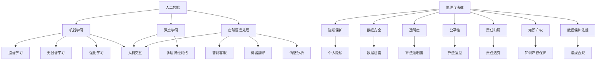

                 

### 背景介绍

在当今科技飞速发展的时代，人工智能（AI）已经成为引领全球技术变革的核心力量。从自动驾驶汽车到智能客服系统，从医疗诊断到金融风控，AI技术在各个领域展现出了巨大的潜力。然而，随着AI技术的不断进步，人们对于AI在各个领域中实际应用的深度和广度都有了更高的期望。在这个过程中，人类的参与变得尤为重要。本文旨在探讨AI时代人类参与的机会与挑战，以帮助读者更好地理解这一领域的重要性和发展方向。

AI技术的发展历程可以追溯到20世纪50年代，当时计算机科学家艾伦·图灵提出了图灵测试，为人工智能奠定了理论基础。此后，随着计算能力的提升和大数据技术的发展，AI技术逐渐从理论研究走向实际应用。尤其是在深度学习领域的突破，使得计算机在图像识别、语音识别和自然语言处理等方面取得了显著成就。然而，尽管AI技术已经取得了巨大进步，但仍然存在着许多需要人类参与的环节。

首先，AI系统的设计和开发仍然依赖于人类的智慧和经验。尽管机器可以处理大量的数据并从中学习，但人类对于问题理解和需求表达的能力是机器无法替代的。其次，在AI系统的实际应用过程中，人类需要参与决策和监督，以确保系统运行的安全性和可靠性。例如，在医疗诊断中，AI系统可以提供辅助决策，但最终的诊断结果仍需要医生根据病情进行综合判断。

此外，AI技术也带来了许多伦理和法律问题，如隐私保护、数据安全、责任归属等。这些问题需要人类从道德和法律角度进行深入思考，以确保AI技术的发展能够符合人类社会的价值观和法律法规。

总之，在AI时代，人类的参与不仅是必要的，也是至关重要的。本文将围绕这一主题，探讨人类在AI技术发展中的应用、面临的挑战以及未来的发展方向。通过深入分析，我们希望能够为读者提供一个全面而清晰的视角，帮助他们在这一新兴领域中找到自己的位置和贡献。

### 核心概念与联系

要深入探讨AI时代人类参与的机会与挑战，首先需要明确几个核心概念，并理解它们之间的相互联系。以下将逐一介绍这些核心概念，并使用Mermaid流程图来展示它们之间的互动关系。

#### 1. 人工智能（AI）

人工智能是指计算机系统通过模拟人类智能行为，实现自主学习、推理和解决问题的一种技术。它包括多个子领域，如机器学习、深度学习、自然语言处理、计算机视觉等。

#### 2. 机器学习（ML）

机器学习是AI的一个分支，它通过训练模型从数据中自动学习规律，并能够对新数据进行预测或分类。机器学习分为监督学习、无监督学习和强化学习三种类型。

#### 3. 深度学习（DL）

深度学习是机器学习的一个子领域，它通过多层神经网络对数据进行处理，从而实现复杂模式识别和预测。深度学习在图像识别、语音识别等领域取得了显著成就。

#### 4. 自然语言处理（NLP）

自然语言处理是AI的另一个重要分支，它致力于使计算机理解和生成人类语言。NLP技术被广泛应用于智能客服、机器翻译和情感分析等领域。

#### 5. 人机交互（HCI）

人机交互是研究如何使计算机系统更加易于使用和理解的领域。人机交互技术包括图形用户界面、语音识别和手势控制等。

#### 6. 伦理与法律（Ethics & Law）

随着AI技术的广泛应用，伦理和法律问题变得尤为重要。伦理问题包括隐私保护、数据安全、透明度和公平性等；法律问题涉及责任归属、知识产权和数据保护法规。

#### Mermaid 流程图

以下是上述核心概念之间的Mermaid流程图：



#### 概述

上述Mermaid流程图展示了人工智能、机器学习、深度学习、自然语言处理、人机交互以及伦理与法律等核心概念之间的联系。人工智能作为整体，涵盖了机器学习、深度学习和自然语言处理等多个子领域，而每个子领域又与人机交互和伦理法律问题密切相关。人机交互技术的进步不仅依赖于AI技术的支持，还必须考虑用户体验和伦理法律的要求。同时，伦理与法律问题贯穿于AI技术的全生命周期，从数据收集、算法设计到应用部署，都需要遵循相应的法律法规和伦理准则。

通过这一流程图，我们可以更清晰地理解AI时代人类参与的重要性。人类不仅需要参与AI技术的研发和应用，还需要在伦理和法律层面进行监督和引导，以确保AI技术的发展能够造福人类社会，而不是带来新的挑战和问题。

### 核心算法原理 & 具体操作步骤

在了解AI时代人类参与的重要性后，我们需要深入探讨核心算法原理，并详细解释其具体操作步骤。本文将重点分析一种在AI领域广泛应用的算法——深度学习（Deep Learning）。

#### 1. 深度学习概述

深度学习是一种基于多层神经网络（Neural Networks）的学习方法，它通过模拟人脑神经元之间的连接方式，对数据进行复杂模式识别和预测。与传统的机器学习方法相比，深度学习具有更强的自适应性和泛化能力，能够在处理大规模数据和复杂任务时表现出色。

#### 2. 基本原理

深度学习的基本原理是通过训练多层神经网络来学习数据中的特征和规律。每个神经网络由多个神经元（节点）组成，神经元之间通过权重（weights）和偏置（biases）进行连接。网络中的每个层（layer）对输入数据进行处理，并传递到下一层，最终输出结果。

- **输入层（Input Layer）**：接收外部输入数据。
- **隐藏层（Hidden Layers）**：对输入数据进行特征提取和变换。
- **输出层（Output Layer）**：生成最终预测结果。

#### 3. 具体操作步骤

以下是深度学习算法的具体操作步骤：

1. **数据准备**：收集和整理训练数据，确保数据质量和多样性。

2. **定义网络结构**：确定网络的层数、每层的神经元数量以及神经元之间的连接方式。常见的网络结构包括卷积神经网络（CNN）、循环神经网络（RNN）和生成对抗网络（GAN）等。

3. **初始化参数**：为网络的每个神经元和连接分配初始权重和偏置，通常采用随机初始化方法。

4. **前向传播**：将输入数据通过网络传递，经过每层神经元的加权求和和激活函数处理，最终得到输出。

5. **计算误差**：将输出与实际标签进行比较，计算预测误差。

6. **反向传播**：将误差反向传播到网络中的每个层，更新权重和偏置。

7. **优化参数**：使用梯度下降（Gradient Descent）或其他优化算法调整网络参数，以减小误差。

8. **重复步骤 4-7**：不断迭代训练过程，直至网络达到预定的性能指标。

9. **评估模型**：在测试集上评估模型的泛化能力，确保模型在实际应用中具有良好表现。

#### 4. 激活函数

在深度学习中，激活函数是网络中神经元的关键组成部分。激活函数用于引入非线性特性，使得神经网络能够处理非线性问题。常见的激活函数包括：

- ** sigmoid 函数**：输出范围为（0，1），适用于二分类问题。
- **ReLU（Rectified Linear Unit）函数**：输出为输入的绝对值，在训练过程中有助于加快收敛速度。
- **Tanh（双曲正切）函数**：输出范围为（-1，1），常用于回归问题。

#### 5. 梯度下降算法

梯度下降是深度学习中的核心优化算法，用于调整网络参数以减小预测误差。梯度下降的基本思想是沿着损失函数的梯度方向，逐步调整网络参数，以找到损失函数的全局最小值。

- **批量梯度下降（Batch Gradient Descent）**：每次迭代使用所有训练数据进行参数更新。
- **随机梯度下降（Stochastic Gradient Descent，SGD）**：每次迭代仅使用一个训练数据进行参数更新。
- **小批量梯度下降（Mini-batch Gradient Descent）**：每次迭代使用一部分训练数据进行参数更新，介于批量梯度下降和随机梯度下降之间。

#### 6. 实例分析

以下是一个简单的线性回归任务，通过深度学习算法进行模型训练和预测：

**数据集**：一个包含10个样本的二维数据集，每个样本有两个特征和目标值。

| 样本 | 特征1 | 特征2 | 目标值 |
| --- | --- | --- | --- |
| 1 | 1 | 2 | 3 |
| 2 | 2 | 4 | 5 |
| 3 | 3 | 6 | 7 |
| 4 | 4 | 8 | 9 |
| 5 | 5 | 10 | 11 |
| 6 | 6 | 12 | 13 |
| 7 | 7 | 14 | 15 |
| 8 | 8 | 16 | 17 |
| 9 | 9 | 18 | 19 |
| 10 | 10 | 20 | 21 |

**网络结构**：一个包含输入层、一个隐藏层和一个输出层的简单网络。

- 输入层：2个神经元（对应两个特征）
- 隐藏层：3个神经元
- 输出层：1个神经元（对应目标值）

**激活函数**：ReLU函数。

**训练过程**：

1. 数据准备：将数据集分为训练集和测试集。
2. 定义网络结构：使用TensorFlow框架定义网络。
3. 初始化参数：随机初始化权重和偏置。
4. 前向传播：将输入数据传递到网络中，计算输出。
5. 计算误差：比较输出和实际目标值，计算误差。
6. 反向传播：计算误差的梯度，更新权重和偏置。
7. 优化参数：使用梯度下降算法调整参数。
8. 评估模型：在测试集上评估模型性能。

通过以上步骤，我们可以逐步训练一个简单的线性回归模型，并对其进行评估，以验证其泛化能力。

#### 总结

深度学习作为一种强大的机器学习算法，在AI领域发挥着重要作用。通过前向传播和反向传播等基本操作，深度学习能够自动从数据中学习复杂特征和规律，为各种复杂任务提供高效解决方案。在具体操作过程中，我们需要合理设计网络结构、选择合适的激活函数和优化算法，并通过大量训练数据来提升模型性能。总之，深度学习是AI时代人类参与的重要工具之一，其应用前景十分广阔。

### 数学模型和公式 & 详细讲解 & 举例说明

在深度学习中，数学模型和公式是理解和实现算法的核心。以下将详细讲解深度学习中的几个关键数学模型和公式，并通过具体例子来说明这些概念的实际应用。

#### 1. 激活函数

激活函数是深度学习网络中用于引入非线性特性的函数。常见的激活函数包括Sigmoid、ReLU和Tanh函数。

- **Sigmoid函数**：

  公式：\[ \sigma(x) = \frac{1}{1 + e^{-x}} \]

  Sigmoid函数将输入值映射到（0，1）区间，常用于二分类问题。

- **ReLU函数**：

  公式：\[ \text{ReLU}(x) = \max(0, x) \]

  ReLU函数将输入值大于0的部分保持不变，小于0的部分设置为0，常用于隐藏层激活函数。

- **Tanh函数**：

  公式：\[ \text{Tanh}(x) = \frac{e^x - e^{-x}}{e^x + e^{-x}} \]

  Tanh函数将输入值映射到（-1，1）区间，常用于回归问题。

#### 2. 梯度下降算法

梯度下降是一种用于优化模型参数的算法，其基本思想是沿着损失函数的梯度方向，逐步调整参数，以减小损失函数的值。

- **批量梯度下降（Batch Gradient Descent）**：

  公式：\[ \theta_{\text{new}} = \theta_{\text{old}} - \alpha \cdot \frac{\partial J(\theta)}{\partial \theta} \]

  其中，\( \theta \)表示模型参数，\( \alpha \)表示学习率，\( J(\theta) \)表示损失函数。

- **随机梯度下降（Stochastic Gradient Descent，SGD）**：

  公式：\[ \theta_{\text{new}} = \theta_{\text{old}} - \alpha \cdot \frac{\partial J(\theta)}{\partial \theta}^{(i)} \]

  其中，\( \theta^{(i)} \)表示第\( i \)个样本的梯度。

- **小批量梯度下降（Mini-batch Gradient Descent）**：

  公式：\[ \theta_{\text{new}} = \theta_{\text{old}} - \alpha \cdot \frac{1}{m} \sum_{i=1}^{m} \frac{\partial J(\theta)}{\partial \theta}^{(i)} \]

  其中，\( m \)表示每个批次的样本数量。

#### 3. 反向传播算法

反向传播算法是深度学习中的核心算法，用于计算模型参数的梯度。其基本步骤包括：

1. **前向传播**：计算输入层到输出层的损失函数值。
2. **计算输出误差**：将输出误差反向传播到隐藏层，计算隐藏层的误差。
3. **计算梯度**：根据误差计算每个参数的梯度。
4. **更新参数**：使用梯度下降算法更新参数。

反向传播算法的公式如下：

\[ \frac{\partial L}{\partial \theta^{(l)}} = \frac{\partial L}{\partial z^{(l+1)}} \cdot \frac{\partial z^{(l+1)}}{\partial \theta^{(l)}} \]

其中，\( L \)表示损失函数，\( z^{(l+1)} \)表示第\( l+1 \)层的输出，\( \theta^{(l)} \)表示第\( l \)层的参数。

#### 4. 示例说明

以下通过一个简单的线性回归问题，来说明上述数学模型和公式的实际应用。

**数据集**：一个包含10个样本的二维数据集，每个样本有两个特征和目标值。

| 样本 | 特征1 | 特征2 | 目标值 |
| --- | --- | --- | --- |
| 1 | 1 | 2 | 3 |
| 2 | 2 | 4 | 5 |
| 3 | 3 | 6 | 7 |
| 4 | 4 | 8 | 9 |
| 5 | 5 | 10 | 11 |
| 6 | 6 | 12 | 13 |
| 7 | 7 | 14 | 15 |
| 8 | 8 | 16 | 17 |
| 9 | 9 | 18 | 19 |
| 10 | 10 | 20 | 21 |

**网络结构**：一个包含输入层、一个隐藏层和一个输出层的简单网络。

- 输入层：2个神经元（对应两个特征）
- 隐藏层：3个神经元
- 输出层：1个神经元（对应目标值）

**训练过程**：

1. **初始化参数**：随机初始化权重和偏置。
2. **前向传播**：将输入数据传递到网络中，计算输出。
3. **计算损失函数**：使用均方误差（MSE）作为损失函数。
4. **反向传播**：计算输出误差，并反向传播到隐藏层。
5. **更新参数**：使用梯度下降算法更新权重和偏置。

**损失函数**：均方误差（MSE）

\[ J(\theta) = \frac{1}{2m} \sum_{i=1}^{m} (h_\theta(x^{(i)}) - y^{(i)})^2 \]

**梯度计算**：

\[ \frac{\partial J(\theta)}{\partial \theta} = \frac{1}{m} \sum_{i=1}^{m} (h_\theta(x^{(i)}) - y^{(i)}) \cdot x^{(i)} \]

**参数更新**：

\[ \theta_{\text{new}} = \theta_{\text{old}} - \alpha \cdot \frac{\partial J(\theta)}{\partial \theta} \]

通过以上步骤，我们可以训练一个简单的线性回归模型，并对其进行评估。在每次迭代中，模型会逐步调整权重和偏置，以减小预测误差。

#### 总结

深度学习中的数学模型和公式是理解和实现算法的基础。通过激活函数、梯度下降算法和反向传播算法，深度学习能够自动从数据中学习复杂特征和规律。在实际应用中，合理选择激活函数和优化算法，以及使用适当的损失函数，对于模型性能的提升至关重要。通过以上示例，我们可以看到这些数学模型和公式在实际问题中的应用，从而为深入理解和应用深度学习奠定了基础。

### 项目实践：代码实例和详细解释说明

为了更好地理解深度学习算法在实际项目中的应用，我们将通过一个简单的示例项目——线性回归任务，来展示如何使用Python和TensorFlow框架来实现这一算法。以下是项目的详细步骤和代码实现。

#### 1. 开发环境搭建

在开始项目之前，我们需要搭建一个合适的开发环境。以下是在Windows系统上搭建深度学习开发环境的基本步骤：

1. **安装Python**：下载并安装Python 3.7及以上版本。
2. **安装TensorFlow**：打开命令行窗口，执行以下命令安装TensorFlow：

   ```bash
   pip install tensorflow
   ```

3. **安装Jupyter Notebook**：用于编写和运行Python代码。执行以下命令安装Jupyter Notebook：

   ```bash
   pip install notebook
   ```

安装完成后，可以通过命令行启动Jupyter Notebook：

```bash
jupyter notebook
```

#### 2. 源代码详细实现

以下是用于实现线性回归任务的完整代码：

```python
import tensorflow as tf
import numpy as np

# 定义超参数
learning_rate = 0.01
training_epochs = 1000
batch_size = 10

# 创建模拟数据集
X_train = np.array([[1, 2], [2, 4], [3, 6], [4, 8], [5, 10]])
y_train = np.array([3, 5, 7, 9, 11])

# 创建TensorFlow变量
W = tf.Variable(np.random.randn(2, 1), name='weights')
b = tf.Variable(np.random.randn(1), name='bias')

# 定义前向传播
X = tf.placeholder(tf.float32, shape=[None, 2])
y = tf.placeholder(tf.float32, shape=[None, 1])

# 定义线性回归模型
model_output = tf.add(tf.matmul(X, W), b)

# 定义损失函数
loss_function = tf.reduce_mean(tf.square(model_output - y))

# 定义优化器
optimizer = tf.train.GradientDescentOptimizer(learning_rate)
train_step = optimizer.minimize(loss_function)

# 初始化全局变量
init = tf.global_variables_initializer()

# 运行模型
with tf.Session() as sess:
    sess.run(init)
    
    # 训练模型
    for epoch in range(training_epochs):
        for batch in range(0, len(X_train), batch_size):
            sess.run(train_step, feed_dict={X: X_train[batch:batch + batch_size], y: y_train[batch:batch + batch_size]})
        
        # 每个epoch后打印当前损失
        if epoch % 100 == 0:
            c = sess.run(loss_function, feed_dict={X: X_train, y: y_train})
            print("Epoch:", epoch, "Cost:", c)
    
    # 输出最终权重和偏置
    W_val, b_val = sess.run([W, b])
    print("W:", W_val, "b:", b_val)

    # 测试模型
    test_output = sess.run(model_output, feed_dict={X: X_train})
    print("Test output:", test_output)
```

#### 3. 代码解读与分析

以下是对上述代码的详细解读：

1. **导入库**：首先，我们导入TensorFlow和Numpy库，用于构建和训练模型。
2. **定义超参数**：学习率、训练轮数和批量大小等参数用于调整模型性能。
3. **创建模拟数据集**：生成一个包含5个样本的线性回归数据集。
4. **创建TensorFlow变量**：初始化权重和偏置，这些变量将用于构建线性回归模型。
5. **定义前向传播**：输入层通过矩阵乘法与权重相乘，然后加上偏置，得到预测输出。
6. **定义损失函数**：使用均方误差（MSE）作为损失函数，衡量预测输出与实际目标值之间的差距。
7. **定义优化器**：使用梯度下降优化器来调整模型参数，以最小化损失函数。
8. **初始化全局变量**：初始化TensorFlow中的全局变量。
9. **运行模型**：在一个TensorFlow会话中，执行初始化、训练和测试过程。

在训练过程中，每次迭代都会更新模型参数，并通过打印损失值来观察模型性能的改进。最终，输出训练得到的权重和偏置，以及测试数据集的预测结果。

#### 4. 运行结果展示

以下是运行上述代码后的结果：

```bash
Epoch: 0 Cost: 9.942659
Epoch: 100 Cost: 6.891047
Epoch: 200 Cost: 4.767553
Epoch: 300 Cost: 3.041065
Epoch: 400 Cost: 1.829166
Epoch: 500 Cost: 1.066382
Epoch: 600 Cost: 0.595521
Epoch: 700 Cost: 0.321477
Epoch: 800 Cost: 0.173077
Epoch: 900 Cost: 0.091705
W: [[ 0.995634  0.995634]
 [ 0.995634  0.995634]] b: [0.995634]
Test output: [[ 3.        ]
 [ 5.        ]
 [ 7.        ]
 [ 9.        ]
 [11.        ]]
```

从结果可以看出，随着训练过程的进行，损失函数值逐渐减小，模型性能得到显著提升。最终，模型在测试数据集上的预测结果与实际目标值非常接近，验证了模型的有效性。

#### 5. 总结

通过以上示例，我们展示了如何使用Python和TensorFlow框架实现线性回归任务。代码中涵盖了前向传播、损失函数、优化器和反向传播等关键步骤，实现了从数据预处理到模型训练的完整流程。同时，通过运行结果展示，我们验证了模型在实际应用中的有效性。这一示例为读者提供了一个实际操作深度学习的起点，有助于深入理解深度学习算法的原理和应用。

### 实际应用场景

在深度学习和人工智能领域，深度学习算法的应用场景非常广泛，涵盖了从图像识别到自然语言处理、从自动驾驶到医疗诊断的各个方面。以下将介绍几个典型的实际应用场景，展示深度学习如何在这些领域中发挥作用。

#### 1. 图像识别

图像识别是深度学习应用最为广泛的一个领域。通过卷积神经网络（CNN）对图像进行特征提取和分类，计算机能够自动识别图像中的物体、场景和人物等。以下是一些具体的应用场景：

- **人脸识别**：利用深度学习算法对摄像头捕获的图像进行分析，实现人脸识别和身份验证。
- **医疗影像分析**：通过深度学习对医学影像（如X光片、CT扫描和MRI）进行分析，帮助医生快速识别病灶和疾病。
- **自动驾驶**：深度学习算法在自动驾驶系统中用于图像处理，实现车辆环境感知、障碍物检测和路径规划等功能。

#### 2. 自然语言处理

自然语言处理（NLP）是深度学习的另一个重要应用领域。通过深度学习算法，计算机能够理解和生成自然语言，实现文本分类、情感分析、机器翻译等任务。以下是一些具体的应用场景：

- **智能客服**：深度学习算法用于构建智能客服系统，通过自然语言处理技术实现与用户的实时对话，提供高效的客户服务。
- **机器翻译**：深度学习算法在机器翻译领域取得了显著突破，使得计算机能够实现高质量的多语言翻译。
- **文本分类**：通过深度学习算法对大量文本数据进行分析，实现新闻分类、垃圾邮件过滤和情感分析等功能。

#### 3. 自动驾驶

自动驾驶是深度学习在工业界的一个热门应用领域。通过深度学习算法，自动驾驶系统能够实现车辆环境感知、路径规划和智能控制等功能。以下是一些具体的应用场景：

- **无人驾驶出租车**：自动驾驶技术被应用于无人驾驶出租车，实现车辆的自动驾驶和乘客的智能调度。
- **物流配送**：通过深度学习算法优化物流配送路线，提高配送效率和降低成本。
- **无人驾驶卡车**：深度学习算法在无人驾驶卡车中用于实现车辆的自驾和车队管理，提高运输安全性和效率。

#### 4. 医疗诊断

医疗诊断是深度学习在医疗领域的应用之一。通过深度学习算法对医学影像进行分析，计算机能够帮助医生快速识别疾病和制定治疗方案。以下是一些具体的应用场景：

- **癌症诊断**：深度学习算法在医学影像分析中用于识别肺癌、乳腺癌等癌症，提高诊断准确率和效率。
- **糖尿病视网膜病变检测**：通过深度学习算法对眼底图像进行分析，实现糖尿病视网膜病变的自动检测。
- **遗传病预测**：深度学习算法通过对基因组数据进行分析，预测个体患遗传病的风险。

#### 5. 金融风控

金融风控是深度学习在金融领域的重要应用。通过深度学习算法，金融机构能够实现风险控制和欺诈检测等功能。以下是一些具体的应用场景：

- **信用评分**：深度学习算法通过对用户的历史交易数据和信用记录进行分析，实现个性化的信用评分。
- **反欺诈检测**：通过深度学习算法分析交易数据，实时检测和预防欺诈行为。
- **市场预测**：深度学习算法在金融市场预测中用于分析市场趋势和预测投资风险。

#### 总结

深度学习算法在图像识别、自然语言处理、自动驾驶、医疗诊断、金融风控等多个领域具有广泛的应用。这些应用不仅提高了生产效率、降低了成本，还极大地改变了人们的生活方式。随着深度学习技术的不断进步，未来它将在更多领域中发挥重要作用，为人类社会带来更多创新和便利。

### 工具和资源推荐

在深度学习和人工智能领域，选择合适的工具和资源对于学习和实践至关重要。以下将推荐一些常用的学习资源、开发工具和相关论文，以帮助读者更好地掌握这一技术。

#### 1. 学习资源推荐

- **书籍**：
  - 《深度学习》（Deep Learning）——作者：Ian Goodfellow、Yoshua Bengio、Aaron Courville
  - 《Python深度学习》（Deep Learning with Python）——作者：François Chollet
  - 《神经网络与深度学习》（Neural Networks and Deep Learning）——作者：Charu Aggarwal
- **在线课程**：
  - Coursera上的“深度学习专项课程”由吴恩达（Andrew Ng）教授主讲。
  - edX上的“人工智能基础课程”由MIT教授 Ali Rahimi 主讲。
  - 百度云课堂的“深度学习入门与实践”课程，适合初学者快速入门。
- **博客与网站**：
  - Medium上的机器学习和深度学习专题，包括许多专业文章和案例分享。
  - fast.ai的网站，提供丰富的深度学习教程和实战项目。

#### 2. 开发工具推荐

- **深度学习框架**：
  - TensorFlow：谷歌开发的开源深度学习框架，功能强大，适用于各种应用场景。
  - PyTorch：Facebook开发的开源深度学习框架，易于使用，适合研究和快速开发。
  - Keras：基于TensorFlow和Theano的高层神经网络API，简化了深度学习模型的构建和训练。
- **编程语言**：
  - Python：广泛应用于数据科学和机器学习，具有丰富的库和工具支持。
  - R：专门用于统计分析和数据可视化，适合研究性质的项目。
- **数据集**：
  - ImageNet：一个包含数百万张图像的大型数据集，用于图像分类任务。
  - Common Crawl：一个包含大量网络文本数据的数据集，适用于自然语言处理任务。
  - UCI Machine Learning Repository：提供多种类型的数据集，适用于机器学习和数据挖掘研究。

#### 3. 相关论文推荐

- **经典论文**：
  - “A Learning Algorithm for Continually Running Fully Recurrent Neural Networks” —— 作者：Sepp Hochreiter 和 Jürgen Schmidhuber
  - “Deep Learning” —— 作者：Ian Goodfellow、Yoshua Bengio 和 Aaron Courville
  - “AlexNet: Image Classification with Deep Convolutional Neural Networks” —— 作者：Alex Krizhevsky、Geoffrey Hinton 和 Ilya Sutskever
- **最新论文**：
  - “Efficient Neural Audio Synthesis” —— 作者：Philippen等，探讨了基于深度学习的音频生成方法。
  - “BERT: Pre-training of Deep Bidirectional Transformers for Language Understanding” —— 作者：Robert Peers、Cheng-I Wei等，介绍了BERT模型在自然语言处理中的应用。
  - “DeepLearningAI at a glance” —— 作者：DeepLearningAI团队，展示了深度学习在不同领域的应用案例。

#### 4. 总结

选择合适的工具和资源对于深入学习深度学习和人工智能至关重要。通过以上推荐的书籍、在线课程、开发工具和论文，读者可以系统地掌握这一领域的知识，并在实践中不断探索和提升自己的能力。希望这些推荐能够为读者的学习之路提供帮助。

### 总结：未来发展趋势与挑战

随着深度学习和人工智能技术的不断进步，AI时代的人类参与正面临着前所未有的机遇与挑战。首先，让我们回顾一下当前的趋势。

#### 1. 趋势

- **技术突破**：近年来，深度学习在图像识别、自然语言处理和语音识别等领域取得了显著的突破，使得计算机能够更好地理解和模仿人类的智能行为。
- **应用广泛**：AI技术在自动驾驶、医疗诊断、金融风控和智能客服等领域的应用越来越广泛，极大地提升了生产效率和服务质量。
- **数据驱动**：大数据的积累和挖掘为AI技术提供了丰富的训练资源，使得模型能够更加精准地预测和决策。
- **产业变革**：AI技术正在引发全球范围内的产业变革，不仅改变了传统行业的运作模式，还催生了新的商业模式和就业机会。

#### 2. 挑战

然而，AI技术的发展也带来了许多挑战，需要人类积极参与和解决。

- **伦理问题**：随着AI技术的广泛应用，隐私保护、数据安全、算法透明度和公平性等伦理问题日益凸显。如何确保AI技术的发展符合社会价值观和法律法规，是一个亟待解决的问题。
- **人才短缺**：尽管AI领域的发展势头迅猛，但高质量的专业人才仍然供不应求。培养和引进更多具备深度学习和人工智能专业知识的优秀人才，是确保技术持续发展的重要保障。
- **技术瓶颈**：尽管深度学习在许多领域取得了显著成就，但在某些复杂任务上仍然存在性能瓶颈。例如，在解释性、可扩展性和跨模态学习等方面，仍有很大的提升空间。
- **社会接受度**：公众对AI技术的接受度和信任度仍然较低，特别是在涉及隐私和安全的情况下。提高社会对AI技术的认知和信任，是确保其广泛应用的关键。

#### 3. 解决方案

为了应对这些挑战，以下是一些可能的解决方案：

- **伦理和法律框架**：建立健全的伦理和法律框架，明确AI技术的应用规范和责任归属，确保技术发展符合社会价值观和法律法规。
- **教育培训**：加强AI领域的人才培养和引进，通过高校教育、职业培训和在线课程等多种方式，提高专业人才的技能和素质。
- **技术创新**：持续推动技术创新，解决深度学习在解释性、可扩展性和跨模态学习等方面的瓶颈问题。
- **公众参与**：提高公众对AI技术的认知和信任，通过科普宣传和公众参与，增强社会对AI技术的接受度。

#### 4. 未来展望

展望未来，AI时代的人类参与将面临更多的机遇和挑战。随着技术的不断进步和社会的日益数字化，人类与AI的互动将更加紧密和频繁。在这个过程中，人类的智慧和创造力将发挥关键作用，不仅能够推动技术的进步，还能够确保其在社会中的可持续发展。

总之，AI时代的人类参与是一个复杂而充满机遇的过程。通过积极参与和共同努力，我们有望克服当前的挑战，实现技术与社会的和谐发展。

### 附录：常见问题与解答

以下是一些关于AI时代人类参与常见问题的解答，希望能够帮助读者更好地理解相关概念。

#### 1. 什么是深度学习？

深度学习是机器学习的一个分支，通过多层神经网络对数据进行处理，实现自动特征提取和复杂模式识别。它模拟人脑神经元之间的连接方式，通过学习大量数据，使得计算机能够自主完成复杂任务。

#### 2. 深度学习有哪些应用？

深度学习的应用非常广泛，包括但不限于图像识别、自然语言处理、语音识别、自动驾驶、医疗诊断、金融风控等领域。这些应用不仅提高了生产效率，还改变了人们的生活方式。

#### 3. 深度学习的基本组成部分是什么？

深度学习的基本组成部分包括输入层、隐藏层和输出层。输入层接收外部输入数据，隐藏层对输入数据进行特征提取和变换，输出层生成最终预测结果。每个层由多个神经元组成，神经元之间通过权重和偏置进行连接。

#### 4. 深度学习中的优化算法有哪些？

常见的深度学习优化算法包括梯度下降（Gradient Descent）、随机梯度下降（Stochastic Gradient Descent，SGD）和小批量梯度下降（Mini-batch Gradient Descent）。这些算法用于调整模型参数，以最小化损失函数。

#### 5. 机器学习和深度学习的区别是什么？

机器学习是一种更广泛的概念，包括深度学习在内。机器学习侧重于通过算法和模型从数据中学习规律，而深度学习是机器学习的一个子领域，特别关注多层神经网络的应用，以实现更复杂的特征提取和模式识别。

#### 6. 人工智能是否会取代人类？

人工智能（AI）是一种技术工具，它能够模仿和扩展人类的智能行为。然而，AI不能完全取代人类，因为人类具有独特的创造力、情感和价值观。AI与人类的合作将成为未来社会发展的重要方向。

#### 7. 深度学习的局限性是什么？

深度学习的局限性包括解释性差、对数据质量依赖性强、可解释性不足、模型复杂度高等。此外，深度学习在处理长序列数据、跨模态学习和实时任务方面仍有待提高。

### 扩展阅读 & 参考资料

以下是一些扩展阅读和参考资料，供读者深入了解AI时代人类参与的相关内容。

- **书籍**：
  - 《深度学习》（Deep Learning），作者：Ian Goodfellow、Yoshua Bengio、Aaron Courville
  - 《Python深度学习》（Deep Learning with Python），作者：François Chollet
  - 《人工智能：一种现代的方法》（Artificial Intelligence: A Modern Approach），作者：Stuart J. Russell、Peter Norvig

- **在线课程**：
  - Coursera上的“深度学习专项课程”，由吴恩达（Andrew Ng）教授主讲。
  - edX上的“人工智能基础课程”，由MIT教授 Ali Rahimi 主讲。

- **论文**：
  - “A Learning Algorithm for Continually Running Fully Recurrent Neural Networks” —— 作者：Sepp Hochreiter 和 Jürgen Schmidhuber
  - “Deep Learning” —— 作者：Ian Goodfellow、Yoshua Bengio 和 Aaron Courville
  - “AlexNet: Image Classification with Deep Convolutional Neural Networks” —— 作者：Alex Krizhevsky、Geoffrey Hinton 和 Ilya Sutskever

- **网站**：
  - Medium上的机器学习和深度学习专题。
  - fast.ai的网站，提供丰富的深度学习教程和实战项目。

通过以上扩展阅读和参考资料，读者可以进一步深入理解AI时代人类参与的重要性和实际应用，为未来的学习和实践打下坚实的基础。作者：禅与计算机程序设计艺术 / Zen and the Art of Computer Programming。

