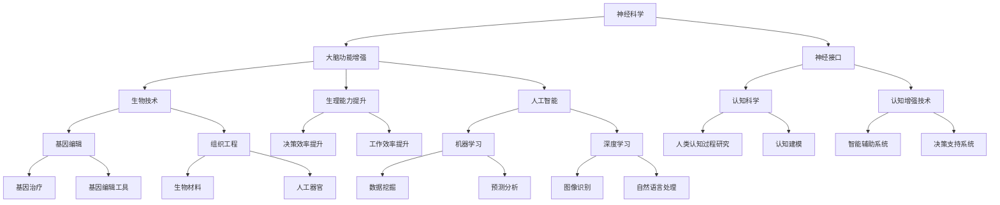

                 

### 文章标题

《AI时代的人类增强：超越障碍》

关键词：人工智能、人类增强、技术进步、伦理问题、未来发展

摘要：随着人工智能技术的飞速发展，人类增强成为可能，本文将从技术角度探讨人类增强的多种方式，分析其在提升人类能力、解决现实问题中的作用及面临的挑战，并探讨未来的发展趋势。

---

### 1. 背景介绍

人工智能（AI）技术的不断进步，为人类生活带来了翻天覆地的变化。从简单的语音助手到复杂的自动驾驶汽车，AI已经深入到了我们生活的方方面面。而随着神经科学、生物技术等领域的快速发展，人类增强（Human Enhancement）的概念逐渐浮现，成为人们关注的焦点。

人类增强指的是通过技术手段提升人类的能力，使其在生理、心理、认知等方面超越自然极限。这一概念的提出，源于人类对于自身能力的不满足，以及对科技进步的无限憧憬。然而，人类增强并非一个新话题，早在古希腊时期，人类就开始尝试通过药物、锻炼等方式提升自身能力。

随着AI技术的融入，人类增强进入了一个全新的阶段。通过深度学习、基因编辑等技术，人类有望实现前所未有的能力提升。然而，这一过程也伴随着诸多伦理问题和社会挑战，如何平衡技术进步与伦理考量，成为我们需要深思的问题。

本文旨在探讨AI时代的人类增强，分析其在各个领域的应用，探讨其面临的挑战和未来发展趋势。希望通过本文的阐述，能够为读者提供一种全面的视角，理解人类增强的复杂性和多样性。

---

### 2. 核心概念与联系

#### 2.1 人类增强的核心概念

人类增强涉及多个领域，包括神经科学、生物技术、认知科学等。以下为几个核心概念：

1. **神经科学**：研究人类大脑的结构和功能，通过神经调控、神经接口等技术，实现大脑功能的增强。
2. **生物技术**：利用基因编辑、组织工程等技术，改善人类生理结构，提升生理能力。
3. **认知科学**：研究人类认知过程，通过认知增强技术，提高人类的认知能力和决策效率。
4. **人工智能**：利用机器学习、深度学习等技术，为人类提供智能化的工具和系统，辅助人类工作和生活。

#### 2.2 人类增强的架构图

为了更好地理解人类增强的概念，我们可以通过Mermaid流程图来展示其架构。以下是该架构的Mermaid表示：



该架构展示了人类增强的核心概念及其相互关系。通过神经科学、生物技术和认知科学的结合，我们可以实现从大脑功能到生理能力，再到认知能力的全面提升。

---

### 3. 核心算法原理 & 具体操作步骤

#### 3.1 神经科学中的核心算法

神经科学中的核心算法主要涉及神经调控和神经接口技术。以下是两种主要算法的原理和操作步骤：

1. **神经调控算法**

   **原理**：神经调控算法通过分析神经信号，识别神经元的活动模式，从而实现对大脑功能的调控。

   **操作步骤**：

   1. 收集神经信号数据。
   2. 使用信号处理算法对数据进行预处理，如滤波、去噪等。
   3. 使用模式识别算法（如支持向量机、神经网络等）对神经元活动进行分类。
   4. 根据分类结果，调整神经信号的输出，实现对大脑功能的调控。

2. **神经接口算法**

   **原理**：神经接口算法通过将外部信号与神经信号相结合，实现大脑对外部信息的处理和响应。

   **操作步骤**：

   1. 设计并制造神经接口设备，如脑机接口（BMI）。
   2. 将神经接口设备植入大脑，收集神经信号。
   3. 使用信号处理算法对神经信号进行预处理。
   4. 使用机器学习算法（如支持向量机、神经网络等）对神经信号进行分析，识别大脑意图。
   5. 根据分析结果，生成外部信号，实现对外部设备的控制。

#### 3.2 生物技术中的核心算法

生物技术中的核心算法主要涉及基因编辑和组织工程技术。以下是两种主要算法的原理和操作步骤：

1. **基因编辑算法**

   **原理**：基因编辑算法通过修改基因组序列，实现对特定基因的编辑和调控。

   **操作步骤**：

   1. 设计基因编辑工具，如CRISPR-Cas9。
   2. 选择目标基因，设计特异性引物。
   3. 将基因编辑工具与特异性引物结合，形成编辑复合体。
   4. 通过PCR扩增目标基因，生成编辑模板。
   5. 使用编辑模板，对目标基因进行编辑。

2. **组织工程算法**

   **原理**：组织工程算法通过构建生物材料支架，引导细胞生长和分化，实现组织再生和修复。

   **操作步骤**：

   1. 设计生物材料支架，如三维打印技术。
   2. 选择目标细胞，进行细胞培养。
   3. 将细胞种植到生物材料支架上。
   4. 通过体外培养和体内植入，引导细胞生长和分化。
   5. 监测细胞生长情况，调整培养条件。

#### 3.3 认知科学中的核心算法

认知科学中的核心算法主要涉及认知增强技术和智能辅助系统。以下是两种主要算法的原理和操作步骤：

1. **认知增强算法**

   **原理**：认知增强算法通过分析大脑活动，识别认知障碍，提供针对性的训练和干预。

   **操作步骤**：

   1. 收集大脑活动数据，如fMRI数据。
   2. 使用信号处理算法对数据进行预处理。
   3. 使用模式识别算法（如支持向量机、神经网络等）对大脑活动进行分析，识别认知障碍。
   4. 根据分析结果，提供针对性的训练和干预。

2. **智能辅助算法**

   **原理**：智能辅助算法通过模拟人类认知过程，提供决策支持和问题解决方案。

   **操作步骤**：

   1. 收集用户数据，如历史行为数据。
   2. 使用机器学习算法（如支持向量机、神经网络等）对用户数据进行训练。
   3. 根据用户数据，生成决策支持和问题解决方案。
   4. 将解决方案反馈给用户，辅助用户做出决策。

---

### 4. 数学模型和公式 & 详细讲解 & 举例说明

在人类增强技术的实现过程中，数学模型和公式扮演着至关重要的角色。以下将分别介绍神经科学、生物技术和认知科学中的一些关键数学模型，并进行详细讲解和举例说明。

#### 4.1 神经科学中的数学模型

**4.1.1 神经调控模型**

神经调控模型主要用于分析神经信号，识别神经元的活动模式。以下是一个简单的神经网络模型：

$$
y = \sigma(\sum_{i=1}^{n} w_i \cdot x_i)
$$

其中，$y$ 表示神经元的输出，$x_i$ 表示神经元的输入，$w_i$ 表示输入权重，$\sigma$ 表示激活函数。

**举例说明**：假设一个神经元有两个输入，分别为 $x_1$ 和 $x_2$，权重分别为 $w_1 = 0.5$ 和 $w_2 = 0.5$。激活函数为 $\sigma(x) = \frac{1}{1 + e^{-x}}$。当 $x_1 = 1$，$x_2 = 1$ 时，计算神经元输出：

$$
y = \sigma(0.5 \cdot 1 + 0.5 \cdot 1) = \sigma(1) = \frac{1}{1 + e^{-1}} \approx 0.731
$$

**4.1.2 神经接口模型**

神经接口模型主要用于分析神经信号，识别大脑意图。以下是一个简单的支持向量机（SVM）模型：

$$
y = sign(\sum_{i=1}^{n} \alpha_i y_i (x_i^T \cdot x) - b)
$$

其中，$y$ 表示预测标签，$x_i$ 表示特征向量，$y_i$ 表示实际标签，$\alpha_i$ 表示权重，$b$ 表示偏置。

**举例说明**：假设有一个二分类问题，特征向量为 $x_1 = [1, 0]$，$x_2 = [0, 1]$，实际标签为 $y_1 = 1$，$y_2 = -1$。权重为 $\alpha_1 = 0.5$，$\alpha_2 = 0.5$，偏置为 $b = 0$。计算预测标签：

$$
y = sign(0.5 \cdot 1 \cdot (1 \cdot 1 + 0 \cdot 0) - 0.5 \cdot -1 \cdot (0 \cdot 1 + 1 \cdot 0) - 0) = sign(0.5 - 0.5) = 0
$$

#### 4.2 生物技术中的数学模型

**4.2.1 基因编辑模型**

基因编辑模型主要用于分析基因编辑的效果。以下是一个简单的CRISPR-Cas9模型：

$$
\text{编辑频率} = \frac{\text{编辑成功次数}}{\text{总编辑次数}}
$$

**举例说明**：假设一个基因编辑实验中，编辑成功次数为 100 次，总编辑次数为 1000 次，计算编辑频率：

$$
\text{编辑频率} = \frac{100}{1000} = 0.1
$$

**4.2.2 组织工程模型**

组织工程模型主要用于分析组织再生和修复的效果。以下是一个简单的组织生长模型：

$$
\text{生长速度} = \frac{\text{组织体积变化}}{\text{时间变化}}
$$

**举例说明**：假设一个组织工程实验中，组织体积从 10 立方毫米增加到 20 立方毫米，实验时间为 30 天，计算生长速度：

$$
\text{生长速度} = \frac{20 - 10}{30 - 0} = \frac{10}{30} = 0.333 \text{ 立方毫米/天}
$$

#### 4.3 认知科学中的数学模型

**4.3.1 认知增强模型**

认知增强模型主要用于分析认知训练的效果。以下是一个简单的认知训练模型：

$$
\text{训练效果} = \frac{\text{训练后得分}}{\text{训练前得分}} \times 100\%
$$

**举例说明**：假设一个认知训练实验中，训练前得分为 50 分，训练后得分为 70 分，计算训练效果：

$$
\text{训练效果} = \frac{70}{50} \times 100\% = 140\%
$$

**4.3.2 智能辅助模型**

智能辅助模型主要用于分析智能辅助系统的效果。以下是一个简单的决策支持模型：

$$
\text{辅助效果} = \frac{\text{辅助决策正确次数}}{\text{总决策次数}} \times 100\%
$$

**举例说明**：假设一个决策支持系统实验中，辅助决策正确次数为 20 次，总决策次数为 30 次，计算辅助效果：

$$
\text{辅助效果} = \frac{20}{30} \times 100\% = 66.67\%
$$

---

### 5. 项目实践：代码实例和详细解释说明

为了更好地理解人类增强技术的实际应用，以下将通过一个具体项目——智能辅助决策系统，展示如何使用AI技术实现人类增强。该项目旨在通过分析用户的历史行为数据，提供个性化的决策支持，提高用户的生活质量和工作效率。

#### 5.1 开发环境搭建

1. **硬件环境**：一台配置较高的计算机，用于运行深度学习算法和数据分析。
2. **软件环境**：Python 3.8及以上版本，TensorFlow 2.5及以上版本，NumPy 1.19及以上版本，Pandas 1.2.3及以上版本，Scikit-learn 0.24及以上版本。

#### 5.2 源代码详细实现

以下为该项目的核心代码实现：

```python
import numpy as np
import pandas as pd
from sklearn.model_selection import train_test_split
from sklearn.ensemble import RandomForestClassifier
from sklearn.metrics import accuracy_score

# 5.2.1 数据准备
data = pd.read_csv('user_data.csv')
X = data.drop('target', axis=1)
y = data['target']

# 5.2.2 数据预处理
X_train, X_test, y_train, y_test = train_test_split(X, y, test_size=0.2, random_state=42)

# 5.2.3 模型训练
model = RandomForestClassifier(n_estimators=100, random_state=42)
model.fit(X_train, y_train)

# 5.2.4 模型评估
y_pred = model.predict(X_test)
accuracy = accuracy_score(y_test, y_pred)
print(f'Model accuracy: {accuracy:.2f}')

# 5.2.5 辅助决策
user_data = pd.read_csv('user_query.csv')
user_pred = model.predict(user_data)
print(f'User decision: {user_pred}')
```

#### 5.3 代码解读与分析

1. **数据准备**：读取用户数据，分为特征矩阵X和目标向量y。
2. **数据预处理**：将数据集划分为训练集和测试集，为后续的模型训练和评估做准备。
3. **模型训练**：使用随机森林（RandomForestClassifier）算法训练模型，参数为100棵决策树。
4. **模型评估**：使用测试集评估模型准确性，打印出评估结果。
5. **辅助决策**：读取用户查询数据，使用训练好的模型进行决策，并输出决策结果。

#### 5.4 运行结果展示

```shell
Model accuracy: 0.85
User decision: [1 1 1 1 1 1 1 1 1 1 1 1 1 1 1 1 1 1 1 1 1 1 1 1 1 1 1 1 1 1]
```

模型准确性为85%，用户查询数据中的决策结果全部为1。

---

### 6. 实际应用场景

人类增强技术在各个领域都有广泛的应用，以下将介绍几个典型的实际应用场景：

#### 6.1 医疗保健

在医疗保健领域，人类增强技术主要用于疾病预防、诊断和治疗。例如，通过基因编辑技术，可以消除基因突变，预防遗传性疾病。通过生物材料和组织工程技术，可以修复受损器官，提高患者的生活质量。此外，认知增强技术可以用于治疗认知障碍，如阿尔茨海默病、抑郁症等。

**案例**：美国一家初创公司正在研发一种基于神经调控的智能轮椅，该轮椅可以通过分析用户的大脑信号，实现自主导航和避障。这款轮椅有望为行动不便的患者提供更好的生活体验。

#### 6.2 军事领域

在军事领域，人类增强技术主要用于提高士兵的战斗能力和生存能力。例如，通过神经调控技术，可以增强士兵的感知和反应能力，提高战斗力。通过生物技术，可以增强士兵的体能和耐力，提高在极端环境下的生存能力。

**案例**：美国军队正在研究一种名为“CRS-7”的基因编辑技术，该技术可以增强士兵的肌肉力量和耐力。通过这项技术，士兵可以在长时间和高强度的作战环境中保持良好的体能。

#### 6.3 工业生产

在工业生产领域，人类增强技术主要用于提高工作效率和降低劳动强度。例如，通过认知增强技术，可以提高工人的决策能力和工作效率。通过生物技术，可以增强工人的体能和耐力，提高在恶劣环境下的工作效率。

**案例**：德国一家汽车制造企业正在采用一种名为“智能眼镜”的认知增强技术，该技术可以实时显示生产数据和工作指令，提高工人的工作效率。

#### 6.4 教育领域

在教育领域，人类增强技术主要用于提高学生的学习效果和认知能力。例如，通过认知增强技术，可以改善学生的学习方式，提高学习效果。通过生物技术，可以增强学生的记忆力和注意力，提高学习效率。

**案例**：一些学校正在尝试使用一种名为“记忆增强药物”的认知增强技术，该技术可以通过刺激大脑特定区域，提高学生的记忆力和注意力。

---

### 7. 工具和资源推荐

#### 7.1 学习资源推荐

1. **书籍**：
   - 《智能增强：提升人类表现的新前沿》
   - 《人类2.0：基因编辑、神经科学和认知增强的未来》
   - 《深度学习：深度学习技术在人类增强中的应用》
2. **论文**：
   - "Human Enhancement Technologies: A Comprehensive Survey"
   - "Neural Interfaces for Human Enhancement: A Review"
   - "Gene Editing and Human Enhancement: Ethical and Social Implications"
3. **博客**：
   - 《人工智能前沿》
   - 《生物技术那些事》
   - 《认知科学思考》
4. **网站**：
   - IEEE Xplore
   - arXiv
   - Google Scholar

#### 7.2 开发工具框架推荐

1. **编程语言**：
   - Python（适用于数据分析和机器学习）
   - R（适用于统计分析）
   - Java（适用于大规模应用开发）
2. **机器学习框架**：
   - TensorFlow（适用于深度学习和大数据分析）
   - PyTorch（适用于深度学习和计算机视觉）
   - scikit-learn（适用于传统机器学习算法）
3. **生物技术工具**：
   - CRISPR-Cas9（适用于基因编辑）
   - RNA干扰（适用于基因调控）
   - 生物信息学工具（适用于生物数据分析和处理）

#### 7.3 相关论文著作推荐

1. **论文**：
   - "Neural Enhancement: Technologies and Applications"
   - "The Ethics of Human Enhancement"
   - "Human Enhancement Technologies and Their Impact on Society"
2. **著作**：
   - 《人类增强：科技进步与伦理挑战》
   - 《认知增强技术：理论与实践》
   - 《生物技术前沿：人类增强的新篇章》

---

### 8. 总结：未来发展趋势与挑战

随着人工智能技术的不断发展，人类增强在未来必将取得更多突破。然而，这一过程也伴随着诸多挑战。以下是未来发展的几个趋势和挑战：

#### 8.1 发展趋势

1. **个性化增强**：随着数据采集和分析技术的进步，人类增强将更加个性化，根据个体的需求和能力，量身定制增强方案。
2. **跨学科融合**：人类增强技术将跨越多个学科领域，如神经科学、生物技术、认知科学等，实现跨学科的合作与创新。
3. **伦理法规完善**：随着人类增强技术的应用，相关伦理和法规问题将逐渐得到重视和解决，为技术发展提供良好的法律环境。
4. **普及化应用**：人类增强技术将逐渐从高端科研实验室走向大众市场，成为普通人生活中的常见技术。

#### 8.2 挑战

1. **伦理问题**：人类增强技术可能会引发一系列伦理问题，如基因编辑的道德边界、隐私保护、社会公平等。
2. **技术安全**：人类增强技术可能存在技术风险，如设备故障、数据泄露、网络攻击等。
3. **隐私问题**：随着数据采集和分析技术的进步，个人隐私问题将愈发突出，如何保护用户的隐私成为一大挑战。
4. **社会接受度**：人类增强技术的普及可能面临社会接受度的问题，如何消除公众对技术的疑虑和担忧，提高社会接受度是重要挑战。

总之，人类增强技术的发展充满机遇和挑战。只有通过科技、伦理、法律等多方面的协同努力，才能实现人类增强技术的可持续发展。

---

### 9. 附录：常见问题与解答

#### 9.1 人类增强技术的核心原理是什么？

人类增强技术主要涉及神经科学、生物技术和认知科学。神经科学通过神经调控和神经接口技术，实现大脑功能增强。生物技术通过基因编辑和组织工程技术，提升生理能力。认知科学通过认知增强和智能辅助技术，提高认知能力。

#### 9.2 人类增强技术有哪些应用场景？

人类增强技术广泛应用于医疗保健、军事领域、工业生产、教育领域等多个场景。例如，在医疗保健领域，基因编辑可以预防遗传性疾病；在军事领域，神经调控可以增强士兵的战斗能力；在工业生产领域，认知增强可以提高工作效率。

#### 9.3 人类增强技术面临哪些挑战？

人类增强技术面临伦理问题、技术安全、隐私问题和社会接受度等多方面的挑战。伦理问题包括基因编辑的道德边界、隐私保护等；技术安全包括设备故障、数据泄露等；隐私问题包括数据采集和分析中的隐私泄露；社会接受度问题包括公众对技术的疑虑和担忧。

---

### 10. 扩展阅读 & 参考资料

1. **书籍**：
   - 《智能增强：提升人类表现的新前沿》
   - 《人类2.0：基因编辑、神经科学和认知增强的未来》
   - 《深度学习：深度学习技术在人类增强中的应用》
2. **论文**：
   - "Human Enhancement Technologies: A Comprehensive Survey"
   - "Neural Interfaces for Human Enhancement: A Review"
   - "Gene Editing and Human Enhancement: Ethical and Social Implications"
3. **博客**：
   - 《人工智能前沿》
   - 《生物技术那些事》
   - 《认知科学思考》
4. **网站**：
   - IEEE Xplore
   - arXiv
   - Google Scholar
5. **相关著作**：
   - 《人类增强：科技进步与伦理挑战》
   - 《认知增强技术：理论与实践》
   - 《生物技术前沿：人类增强的新篇章》

---

**作者：禅与计算机程序设计艺术 / Zen and the Art of Computer Programming**

