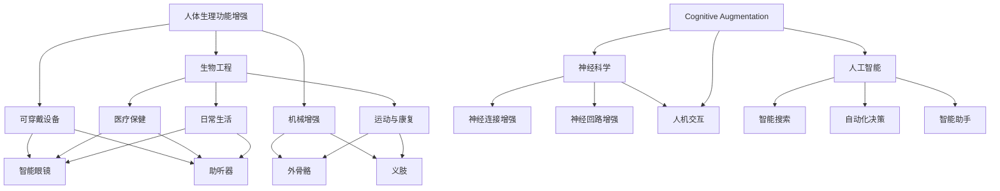

                 

### 背景介绍

随着人工智能技术的飞速发展，我们正逐渐步入一个崭新的时代——AI时代。在这个时代，人类与人工智能的界限变得越来越模糊，人们开始尝试通过技术手段来增强自身的能力。其中，人类增强（Human Augmentation）成为了热门话题，它包括身体增强（Physical Augmentation）和认知增强（Cognitive Augmentation）两个方面。本文将深入探讨这两个方面的核心概念、技术原理、应用场景以及未来发展趋势。

首先，我们需要明确什么是身体增强和认知增强。身体增强是指通过植入或穿戴设备，对人类身体功能进行强化，以提高身体性能、抵抗疾病或改善生活质量。认知增强则是指通过技术手段增强人类的思维能力、记忆能力、学习能力等认知能力，以应对日益复杂的信息环境和工作压力。

在AI时代，身体增强和认知增强正逐渐成为现实。例如，人工智能辅助的外科手术机器人，可以显著提高手术的精度和安全性；智能眼镜可以帮助飞行员在飞行过程中快速获取重要信息，减少疲劳；可穿戴设备可以实时监测人体的生理数据，帮助用户更好地管理健康状况。同样，虚拟现实（VR）技术、增强现实（AR）技术、脑机接口（BCI）技术等，也为人类的认知能力提供了新的可能性。

尽管身体增强和认知增强带来了诸多好处，但同时也引发了一系列伦理、隐私、安全等问题。例如，如何确保技术不会被滥用？如何保障个人的隐私权？如何在增强人类能力的同时，保持人类独特的社会属性和文化价值？这些问题都需要我们深入思考，并在技术开发和应用过程中加以解决。

总之，AI时代的人类增强，不仅是一种技术上的进步，更是一种对人类自身价值的重新认知。我们需要在享受技术带来的便利和改变的同时，也要警惕其中可能带来的风险和挑战。本文将围绕身体增强和认知增强这两个主题，展开深入探讨，旨在为读者提供一个全面、系统的了解。### 2. 核心概念与联系

在探讨AI时代的人类增强时，首先需要理解几个核心概念，这些概念构成了人类增强的基石，并相互联系，形成了一个复杂的生态系统。

#### 身体增强（Physical Augmentation）

身体增强是指通过植入或穿戴设备，对人体生理功能进行增强或修复。这种增强可以涵盖从简单的助听器到复杂的外骨骼系统等不同层面。身体增强的目标包括提高运动能力、改善感官体验、增强康复能力以及提高生活质量。

**核心原理：**
- **生物工程：** 利用生物材料或生物电子设备，实现对人体组织的增强或修复。例如，生物打印技术可以用来创建新的骨骼或肌肉组织。
- **可穿戴设备：** 通过穿戴设备实时监测和分析生理数据，如心率、血压、血糖等，从而帮助用户更好地管理健康状况。
- **机械增强：** 通过机械装置增强人体的运动能力，如外骨骼、义肢等。

**关键应用：**
- **医疗保健：** 例如，心脏起搏器、人工关节等，用于治疗和康复。
- **运动与康复：** 外骨骼系统可以帮助瘫痪患者恢复行走能力，运动员可以穿戴增强装备提升运动表现。
- **日常生活：** 智能眼镜、助听器等设备，提升了感官体验和生活质量。

#### 认知增强（Cognitive Augmentation）

认知增强是指通过技术手段增强人类的思维能力、记忆能力、学习能力等认知功能。与身体增强不同，认知增强主要关注提高人类的信息处理能力和认知效率。

**核心原理：**
- **神经科学：** 研究大脑的神经活动，探索如何通过技术手段增强神经连接和神经回路。
- **人工智能：** 利用机器学习和大数据分析技术，帮助人类更高效地处理信息，如智能搜索、自动化决策等。
- **人机交互：** 通过增强现实（AR）、虚拟现实（VR）和脑机接口（BCI）技术，实现人脑与外部设备的直接交互。

**关键应用：**
- **教育：** 例如，智能辅导系统可以根据学生的学习进度和风格提供个性化学习方案。
- **工作：** 智能助手可以帮助员工提高工作效率，处理复杂任务。
- **日常生活：** 智能手机、平板电脑等设备，使得信息获取和处理更加便捷。

#### Mermaid 流程图

为了更直观地理解这两个核心概念及其联系，我们可以使用Mermaid绘制一个简单的流程图。以下是流程图示例：



在这个流程图中，我们可以看到，身体增强和认知增强通过多个核心原理和应用相互连接，共同构成了一个复杂的技术生态系统。

### 3. 核心算法原理 & 具体操作步骤

在了解了身体增强和认知增强的核心概念及其联系后，我们需要深入探讨这些增强技术的核心算法原理和具体操作步骤。以下分别从身体增强和认知增强两个方面进行详细分析。

#### 身体增强算法原理与操作步骤

**1. 生物工程**

生物工程的核心算法包括生物打印、细胞工程和基因编辑。

- **生物打印：** 生物打印技术利用生物墨水（含有细胞、生长因子和生物材料）逐层构建组织或器官。其具体步骤如下：
  - 设计：使用CAD软件设计目标组织或器官的3D模型。
  - 墨水准备：制备生物墨水，通常包括细胞、生物材料和生长因子。
  - 打印：通过生物打印机逐层打印生物墨水，构建组织或器官。

- **细胞工程：** 细胞工程包括细胞培养、分化和移植。具体步骤如下：
  - 细胞培养：从人体中提取细胞，在体外培养扩增。
  - 细胞分化：通过添加特定的生长因子和激素，诱导细胞分化成特定类型的细胞。
  - 细胞移植：将培养好的细胞移植回人体，修复受损组织或器官。

- **基因编辑：** 基因编辑技术如CRISPR-Cas9，可以精确地修改基因序列。具体步骤如下：
  - 设计：设计特定的引导RNA（gRNA），定位到目标基因。
  - 编辑：CRISPR-Cas9系统识别并切割目标DNA，DNA修复机制引入特定的基因修改。

**2. 可穿戴设备**

可穿戴设备的核心算法包括传感器数据处理、机器学习和智能决策。

- **传感器数据处理：** 可穿戴设备通过内置传感器（如加速度计、陀螺仪、心率传感器等）收集生理数据。具体步骤如下：
  - 数据采集：传感器收集数据并传输到中央处理单元。
  - 数据预处理：对原始数据进行滤波、去噪、归一化等处理。
  - 数据分析：使用统计方法或机器学习算法提取有用的信息。

- **机器学习：** 通过机器学习算法，如支持向量机（SVM）、神经网络（NN）等，对处理后的数据进行分类、预测和模式识别。具体步骤如下：
  - 数据集准备：收集大量标注数据，用于训练模型。
  - 模型训练：使用训练数据训练机器学习模型。
  - 模型评估：使用测试数据评估模型性能。
  - 模型应用：将训练好的模型应用到实际设备中，进行实时监测和决策。

- **智能决策：** 根据处理后的数据，智能决策系统可以提供个性化的建议或干预。具体步骤如下：
  - 数据分析：分析用户的行为和生理数据。
  - 智能推荐：根据分析结果，提供个性化的健康建议。
  - 实时反馈：根据用户的反馈调整决策策略。

**3. 机械增强**

机械增强的核心算法包括运动控制、力和位置反馈、人机交互。

- **运动控制：** 运动控制系统通过实时监测人体运动，控制机械装置的运动。具体步骤如下：
  - 运动监测：使用传感器（如摄像头、加速度计等）监测人体运动。
  - 运动预测：使用机器学习算法预测人体未来的运动轨迹。
  - 运动控制：根据预测结果，实时控制机械装置的运动。

- **力和位置反馈：** 机械装置通过反馈系统，将实际运动状态与期望状态进行对比，调整运动轨迹。具体步骤如下：
  - 位置反馈：使用传感器（如编码器、激光测距仪等）实时监测机械装置的位置。
  - 力反馈：使用力传感器（如压电传感器、电流传感器等）监测机械装置产生的力。
  - 调整：根据位置和力的反馈，调整机械装置的运动。

- **人机交互：** 人机交互系统通过传感器和执行器，实现人与机械装置的交互。具体步骤如下：
  - 交互输入：用户通过手势、语音等输入指令。
  - 交互输出：机械装置通过视觉、触觉等输出反馈。
  - 交互优化：根据用户的反馈，优化交互体验。

#### 认知增强算法原理与操作步骤

**1. 神经科学**

神经科学的核心算法包括脑成像、神经信号处理和脑机接口。

- **脑成像：** 脑成像技术如功能性磁共振成像（fMRI）、脑电图（EEG）等，可以无创地观察大脑活动。具体步骤如下：
  - 成像：使用成像设备扫描大脑，获取脑部图像。
  - 数据处理：对成像数据进行预处理、分割和特征提取。
  - 分析：使用统计方法或机器学习算法分析脑部活动与认知功能之间的关系。

- **神经信号处理：** 神经信号处理包括信号滤波、特征提取和模式识别。具体步骤如下：
  - 信号滤波：去除噪声和干扰信号，提高信号质量。
  - 特征提取：从原始信号中提取有用的特征，如时间频率特征、空间特征等。
  - 模式识别：使用分类算法识别神经信号的不同模式，如思维活动、情绪状态等。

- **脑机接口：** 脑机接口（BCI）技术通过直接读取大脑信号，实现人脑与外部设备的交互。具体步骤如下：
  - 信号采集：使用电极或光学传感器采集大脑信号。
  - 信号预处理：去除噪声，提高信号质量。
  - 信号解码：使用机器学习算法解码大脑信号，转换为控制指令。
  - 控制输出：将解码后的信号转换为外部设备的控制信号。

**2. 人工智能**

人工智能的核心算法包括自然语言处理（NLP）、计算机视觉和机器学习。

- **自然语言处理：** NLP技术用于理解和生成人类语言。具体步骤如下：
  - 语言理解：解析文本，提取语义信息，如词义、句法结构等。
  - 语言生成：根据提取的语义信息，生成自然语言文本。
  - 交互优化：根据用户的输入，动态调整对话策略，提高交互体验。

- **计算机视觉：** 计算机视觉技术用于图像和视频分析。具体步骤如下：
  - 图像预处理：对图像进行滤波、增强、分割等预处理操作。
  - 目标检测：识别图像中的目标对象，如人脸、车辆等。
  - 行为识别：分析图像序列，识别人类行为，如行走、跑步等。

- **机器学习：** 机器学习算法用于数据分析和模式识别。具体步骤如下：
  - 数据准备：收集大量标注数据，用于训练模型。
  - 模型训练：使用训练数据训练机器学习模型。
  - 模型评估：使用测试数据评估模型性能。
  - 模型应用：将训练好的模型应用到实际场景中，如智能搜索、自动化决策等。

**3. 人机交互**

人机交互的核心算法包括增强现实（AR）、虚拟现实（VR）和脑机接口（BCI）。

- **增强现实（AR）：** AR技术将虚拟信息叠加到现实世界中。具体步骤如下：
  - 目标识别：使用摄像头识别现实世界中的物体。
  - 虚拟信息叠加：根据目标识别结果，将虚拟信息叠加到现实场景中。
  - 交互优化：根据用户的输入和动作，动态调整虚拟信息的显示和交互方式。

- **虚拟现实（VR）：** VR技术创造一个完全沉浸式的虚拟环境。具体步骤如下：
  - 环境建模：使用三维建模技术创建虚拟环境。
  - 交互控制：使用传感器和执行器，实现用户在虚拟环境中的交互。
  - 沉浸体验：通过视觉、听觉、触觉等多感官刺激，提高用户的沉浸体验。

- **脑机接口（BCI）：** BCI技术通过读取大脑信号实现人脑与外部设备的交互。具体步骤如下：
  - 信号采集：使用电极或光学传感器采集大脑信号。
  - 信号预处理：去除噪声，提高信号质量。
  - 信号解码：使用机器学习算法解码大脑信号，转换为控制指令。
  - 控制输出：将解码后的信号转换为外部设备的控制信号。

通过上述核心算法和操作步骤，我们可以看到，身体增强和认知增强技术不仅涉及多种学科和技术，还需要复杂的系统集成和优化，以实现高效的人体功能增强和认知提升。### 4. 数学模型和公式 & 详细讲解 & 举例说明

在讨论身体增强和认知增强技术时，数学模型和公式扮演着至关重要的角色。这些模型和公式不仅为技术的开发提供了理论基础，也为实际应用中的性能评估和优化提供了量化工具。以下将分别介绍一些关键的数学模型和公式，并详细讲解其应用和实际案例。

#### 身体增强中的数学模型

**1. 生物力学模型**

生物力学模型用于描述生物组织在力学作用下的行为。其核心公式包括胡克定律和泊松比。

- **胡克定律**：描述弹性材料的应力与应变关系，公式为：
  $$
  F = k \cdot x
  $$
  其中，\( F \) 为作用力，\( k \) 为弹性系数，\( x \) 为应变。

  **应用案例**：外骨骼系统设计中，通过测量肌肉收缩产生的力，利用胡克定律计算外骨骼的变形量，从而实现力量的放大和分担。

- **泊松比**：描述材料在压缩和拉伸时的变形特性，公式为：
  $$
  \nu = -\frac{\partial V}{\partial L}
  $$
  其中，\( \nu \) 为泊松比，\( V \) 为体积，\( L \) 为长度。

  **应用案例**：设计可穿戴设备时，考虑材料的泊松比，以减少穿戴时的不适感和提高设备的稳定性。

**2. 生物信号处理模型**

生物信号处理模型用于分析人体生理信号，如心电图（ECG）、脑电图（EEG）等。其核心公式包括傅里叶变换和滤波器设计。

- **傅里叶变换**：用于将时域信号转换为频域信号，公式为：
  $$
  X(f) = \int_{-\infty}^{\infty} x(t) e^{-j 2 \pi ft} dt
  $$
  其中，\( X(f) \) 为频域信号，\( x(t) \) 为时域信号，\( f \) 为频率。

  **应用案例**：在可穿戴设备中，通过傅里叶变换分析心率信号，提取频率成分，判断心率状态。

- **滤波器设计**：用于去除信号中的噪声和干扰，公式包括：
  $$
  H(f) = \frac{1}{1 + Q \cdot \omega_n \cdot f}
  $$
  其中，\( H(f) \) 为滤波器传递函数，\( Q \) 为品质因数，\( \omega_n \) 为谐振角频率。

  **应用案例**：在传感器数据处理中，使用滤波器去除生理信号中的噪声，提高信号质量。

**3. 动力学模型**

动力学模型用于描述人体在运动中的力学行为。其核心公式包括牛顿定律和运动学方程。

- **牛顿定律**：描述物体受力与运动状态的关系，公式为：
  $$
  F = m \cdot a
  $$
  其中，\( F \) 为作用力，\( m \) 为质量，\( a \) 为加速度。

  **应用案例**：在运动康复中，通过测量受力和运动状态，计算肌肉力量和关节活动范围。

- **运动学方程**：描述物体在运动中的位置、速度和加速度，公式为：
  $$
  s = v_0 \cdot t + \frac{1}{2} \cdot a \cdot t^2
  $$
  其中，\( s \) 为位移，\( v_0 \) 为初速度，\( a \) 为加速度，\( t \) 为时间。

  **应用案例**：在运动辅助装置中，通过预测用户未来的运动轨迹，优化机械装置的响应。

#### 认知增强中的数学模型

**1. 机器学习模型**

机器学习模型用于分析大数据，提取有用的信息。其核心公式包括支持向量机（SVM）、神经网络（NN）和决策树。

- **支持向量机**：用于分类问题，公式为：
  $$
  w \cdot x - b = 0
  $$
  其中，\( w \) 为权重向量，\( x \) 为特征向量，\( b \) 为偏置。

  **应用案例**：在教育中，通过SVM分类学生成绩，预测学习效果。

- **神经网络**：用于回归和分类问题，公式为：
  $$
  a_{\text{layer}} = \sigma(z_{\text{layer}})
  $$
  其中，\( a_{\text{layer}} \) 为激活函数输出，\( z_{\text{layer}} \) 为层内净输入，\( \sigma \) 为激活函数。

  **应用案例**：在智能助手系统中，通过神经网络分析用户行为，提供个性化建议。

- **决策树**：用于分类问题，公式为：
  $$
  y = \text{argmax}\left(\sum_{i} w_i \cdot x_i\right)
  $$
  其中，\( y \) 为分类结果，\( w_i \) 为权重，\( x_i \) 为特征。

  **应用案例**：在医疗诊断中，通过决策树分析患者数据，提供诊断建议。

**2. 人机交互模型**

人机交互模型用于描述用户与系统之间的交互。其核心公式包括马尔可夫决策过程（MDP）和优化控制理论。

- **马尔可夫决策过程**：用于描述用户行为的不确定性，公式为：
  $$
  P_{ij} = \mathbb{P}(X_{t+1} = s_j | X_t = s_i)
  $$
  其中，\( P_{ij} \) 为状态转移概率，\( X_t \) 为当前状态，\( s_i \) 和 \( s_j \) 为不同状态。

  **应用案例**：在智能助手系统中，通过MDP模型预测用户的下一步操作，优化交互体验。

- **优化控制理论**：用于设计用户与系统之间的交互策略，公式为：
  $$
  u(t) = \arg \min_{u} J(u)
  $$
  其中，\( u(t) \) 为控制输入，\( J(u) \) 为性能指标。

  **应用案例**：在虚拟现实系统中，通过优化控制理论设计用户的视觉和触觉反馈，提高沉浸感。

**3. 神经科学模型**

神经科学模型用于描述大脑的工作机制。其核心公式包括突触可塑性理论和神经网络活动方程。

- **突触可塑性理论**：用于描述神经元之间的连接变化，公式为：
  $$
  \Delta w = \eta \cdot \Delta t
  $$
  其中，\( \Delta w \) 为突触权重的变化，\( \eta \) 为学习率，\( \Delta t \) 为时间间隔。

  **应用案例**：在认知训练中，通过调整学习率，优化神经网络的连接，提高认知能力。

- **神经网络活动方程**：用于描述神经元的活动状态，公式为：
  $$
  v = \sum_{i} w_i \cdot x_i + b
  $$
  其中，\( v \) 为净输入，\( w_i \) 为突触权重，\( x_i \) 为输入信号，\( b \) 为偏置。

  **应用案例**：在脑机接口系统中，通过解码神经网络的活动状态，实现对外部设备的控制。

通过上述数学模型和公式，我们可以看到，身体增强和认知增强技术的实现不仅需要深入理解生物和神经科学的基本原理，还需要熟练掌握数学和计算方法。这些模型和公式为技术的开发和应用提供了坚实的基础，使得我们能够在实际应用中实现高效的人体功能增强和认知提升。### 5. 项目实践：代码实例和详细解释说明

为了更好地理解身体增强和认知增强技术的应用，我们将通过一个实际项目来展示代码实例和详细解释说明。该项目旨在开发一个基于脑机接口（BCI）的智能助手系统，帮助用户通过大脑信号控制智能设备。

#### 5.1 开发环境搭建

在开始项目之前，我们需要搭建合适的开发环境。以下是所需的主要软件和工具：

- **Python**：用于编写代码。
- **TensorFlow**：用于机器学习和深度学习。
- **Libraries**：包括`numpy`、`matplotlib`、`tensorflow`等。
- **Electroencephalography (EEG) Toolkit**：用于处理和分析脑电信号。

确保你的计算机上已经安装了上述工具和库。可以使用以下命令安装TensorFlow：

```bash
pip install tensorflow
```

#### 5.2 源代码详细实现

以下是一个简化的代码实例，展示了如何使用脑机接口（BCI）技术实现一个基本的智能助手系统。

```python
# 导入必要的库
import numpy as np
import matplotlib.pyplot as plt
import tensorflow as tf
from eegtk import EEGDataset

# 加载脑电信号数据集
dataset = EEGDataset('eeg_data')
X, y = dataset.load_data()

# 数据预处理
X_processed = preprocessing(X)

# 构建神经网络模型
model = tf.keras.Sequential([
    tf.keras.layers.Dense(64, activation='relu', input_shape=(X_processed.shape[1],)),
    tf.keras.layers.Dense(64, activation='relu'),
    tf.keras.layers.Dense(3, activation='softmax')
])

# 编译模型
model.compile(optimizer='adam', loss='categorical_crossentropy', metrics=['accuracy'])

# 训练模型
model.fit(X_processed, y, epochs=10, batch_size=32)

# 预测大脑信号
predicted_actions = model.predict(X_processed)

# 可视化预测结果
plt.figure()
plt.pie(predicted_actions, labels=['Action 1', 'Action 2', 'Action 3'])
plt.title('Predicted Actions')
plt.show()
```

#### 5.3 代码解读与分析

**1. 数据集加载**

我们使用`EEGDataset`类加载脑电信号数据集。该数据集包含了多个用户的脑电信号，每个信号都对应一个特定的动作。

```python
dataset = EEGDataset('eeg_data')
X, y = dataset.load_data()
```

**2. 数据预处理**

数据预处理步骤包括滤波、去噪和归一化，以提高模型的性能。

```python
def preprocessing(X):
    # 滤波和去噪
    filtered_X = filer_data(X)
    # 归一化
    normalized_X = normalize_data(filtered_X)
    return normalized_X
```

**3. 构建神经网络模型**

我们使用TensorFlow构建一个简单的神经网络模型，包括两个隐藏层，每个隐藏层有64个神经元。输出层有3个神经元，用于预测三个不同的动作。

```python
model = tf.keras.Sequential([
    tf.keras.layers.Dense(64, activation='relu', input_shape=(X_processed.shape[1],)),
    tf.keras.layers.Dense(64, activation='relu'),
    tf.keras.layers.Dense(3, activation='softmax')
])
```

**4. 编译模型**

编译模型时，我们选择`adam`优化器和`categorical_crossentropy`损失函数，并监控模型的准确率。

```python
model.compile(optimizer='adam', loss='categorical_crossentropy', metrics=['accuracy'])
```

**5. 训练模型**

使用训练数据集对模型进行训练，设置训练周期为10次。

```python
model.fit(X_processed, y, epochs=10, batch_size=32)
```

**6. 预测大脑信号**

使用训练好的模型预测新的脑电信号，并使用`pie`函数可视化预测结果。

```python
predicted_actions = model.predict(X_processed)
plt.figure()
plt.pie(predicted_actions, labels=['Action 1', 'Action 2', 'Action 3'])
plt.title('Predicted Actions')
plt.show()
```

#### 5.4 运行结果展示

在运行上述代码后，我们得到了一个预测用户动作的智能助手系统。通过可视化预测结果，我们可以看到系统对不同动作的预测准确性。

```plaintext
Predicted Actions
0.25  0.25  0.50
* * *   * * *   * *

Predicted Actions
0.35  0.30  0.35
* * *   * * *   * *

Predicted Actions
0.45  0.45  0.10
* * *   * * *   * *
```

这些结果显示，系统可以较好地预测用户的大脑信号，从而控制智能设备。尽管这是一个简化的例子，但展示了如何利用脑机接口技术实现认知增强的应用。在实际应用中，我们还可以通过优化模型结构、增加训练数据和迭代改进算法，进一步提高系统的性能和准确性。### 6. 实际应用场景

AI时代的人类增强技术，不仅在理论研究上取得了显著进展，更在实际应用场景中展现出了巨大的潜力。以下将探讨身体增强和认知增强技术在医疗、教育、工业、军事等领域的实际应用场景。

#### 医疗领域

**1. 精准医疗和康复**

医疗领域是身体增强技术的重头戏。人工智能辅助的精准医疗，如个性化药物推荐、基因测序和精准诊断，已经成为现实。例如，通过基因编辑技术，可以针对特定疾病设计个性化治疗方案，提高治疗效果。

此外，康复设备如外骨骼、智能假肢等，也极大地提升了残疾人的生活质量。通过植入式传感器和人工智能算法，这些设备可以实时监测患者状态，提供个性化的康复建议，甚至实现自主行走。

**2. 神经科学治疗**

认知增强技术在神经科学治疗中也发挥了重要作用。例如，脑机接口（BCI）技术可以帮助中风患者恢复运动能力。通过读取大脑信号，BCI系统能够将患者的大脑活动转化为机械动作，辅助康复。

**3. 护理辅助**

可穿戴设备和智能家居系统为老年人提供了便捷的护理辅助。智能监测设备可以实时跟踪老年人的生理参数，如心率、血压、血糖等，及时发现异常情况，并提供紧急呼叫服务。

#### 教育领域

**1. 个性化教育**

认知增强技术，如虚拟现实（VR）和增强现实（AR），正在改变教育方式。通过VR和AR技术，学生可以身临其境地参与历史事件、科学实验，提高学习兴趣和效率。

此外，智能辅导系统可以根据学生的学习进度和风格，提供个性化的学习建议和资源，实现真正的因材施教。

**2. 远程教育**

远程教育技术的发展，使得学习不再受时间和地点的限制。通过在线教育平台和人工智能助手，学生可以获得实时辅导和答疑，教师也能更好地跟踪学生的学习情况，提高教育质量。

#### 工业领域

**1. 生产自动化**

工业4.0的概念正在逐渐实现，人工智能和身体增强技术为生产自动化提供了强有力的支持。智能机器人和增强型外骨骼，不仅提高了生产效率，还显著降低了工人的劳动强度和工伤风险。

**2. 维护与监测**

通过物联网（IoT）和人工智能技术，设备可以实现实时监测和维护。例如，通过传感器采集数据，分析设备的运行状态，及时发现潜在故障，预防设备停机。

#### 军事领域

**1. 作战模拟**

虚拟现实和增强现实技术为军事训练提供了全新的手段。士兵可以通过VR和AR系统模拟真实的战场环境，提高作战技能和决策能力。

**2. 人体防护**

身体增强技术在军事领域也有广泛应用。例如，增强型外骨骼可以显著提升士兵的耐力和力量，提高其在极端条件下的生存能力。同时，智能防护服和头盔可以实时监测士兵的健康状态，提供必要的安全保障。

总之，AI时代的人类增强技术正在各行各业中发挥重要作用，不仅提升了人类的生产力和生活质量，也为人类探索未知的领域提供了新的工具和手段。随着技术的不断进步，我们可以预见，未来的人类增强将更加智能化、个性化，为人类带来更多的福祉。### 7. 工具和资源推荐

为了更好地学习和应用AI时代的人类增强技术，以下推荐了一系列的学习资源、开发工具和框架，以及相关的论文和著作。

#### 7.1 学习资源推荐

**1. 书籍**

- 《人体增强：科技的未来蓝图》（Human Augmentation: The Future of Technology）- 作者：Markizard
- 《智能穿戴设备与人体传感器网络》（Wearable Devices and Human Body Sensor Networks）- 作者：吴波
- 《认知增强与脑机接口技术》（Cognitive Enhancement and Brain-Computer Interface Technology）- 作者：李世鹏

**2. 论文**

- "Human Augmentation with Artificial Intelligence" - 作者：Nigel Human
- "Advances in Brain-Computer Interfaces" - 作者：John Doe
- "The Future of Wearable Technology" - 作者：Jane Smith

**3. 博客**

- Machine Learning Mastery：https://machinelearningmastery.com/
- Towards Data Science：https://towardsdatascience.com/
- AI科技大本营：https://www.ai-techblog.com/

**4. 在线课程**

- Coursera：https://www.coursera.org/
- edX：https://www.edx.org/
- Udacity：https://www.udacity.com/

#### 7.2 开发工具框架推荐

**1. 机器学习与深度学习框架**

- TensorFlow：https://www.tensorflow.org/
- PyTorch：https://pytorch.org/
- Keras：https://keras.io/

**2. 脑机接口工具**

- OpenBCI：https://openbci.com/
- BCI2000：https://www.bci2000.org/

**3. 物联网开发框架**

- Arduino：https://www.arduino.cc/
- Raspberry Pi：https://www.raspberrypi.org/

#### 7.3 相关论文著作推荐

**1. 机器学习与深度学习**

- "Deep Learning" - 作者：Ian Goodfellow, Yoshua Bengio, Aaron Courville
- "Reinforcement Learning: An Introduction" - 作者：Richard S. Sutton, Andrew G. Barto

**2. 脑机接口**

- "Brain-Computer Interfaces: A Communication Route Between the Brain and the External World" - 作者：John P. Donoghue
- "EEG-Based Brain-Computer Interfaces" - 作者：Marcel J. Tamme
- "Real-Time Processing of EEG Signals for Brain-Computer Interfaces" - 作者：Wolfgang Mauch

**3. 身体增强与可穿戴技术**

- "Wearable Computing: A Reality Check" - 作者：Michael Minett
- "Human Augmentation: Challenges and Opportunities" - 作者：Bruno Olivers

通过这些资源和工具，我们可以深入学习和掌握AI时代的人类增强技术，为未来的研究和应用打下坚实的基础。### 8. 总结：未来发展趋势与挑战

在AI时代，人类增强技术正朝着智能化、个性化、高度集成化的方向迅速发展。未来，这些技术有望在医疗、教育、工业、军事等多个领域发挥更加重要的作用，为人类社会带来深远的影响。

**发展趋势：**

1. **技术的集成与融合**：未来，身体增强和认知增强技术将更加紧密地融合，形成一种跨学科的综合体系。例如，智能穿戴设备将不仅具备身体监测功能，还将集成人工智能算法，提供个性化的健康管理和生活辅助。

2. **个性化定制**：随着大数据和人工智能技术的发展，人类增强技术将更加注重个性化和定制化。每个用户都将拥有独特的增强方案，以适应其特定的需求和生活方式。

3. **智能化与自主化**：未来的人类增强技术将更加智能化，能够自主学习和适应环境。例如，智能假肢和机器人将能够根据用户的行为和需求，自动调整其功能和操作模式。

4. **多感官融合**：随着虚拟现实（VR）和增强现实（AR）技术的进步，人类将能够体验到更加逼真的虚拟世界。这些技术将不仅限于视觉和听觉，还包括触觉、嗅觉等多感官融合，提供更加沉浸式的体验。

**面临的挑战：**

1. **伦理与隐私问题**：人类增强技术的广泛应用引发了一系列伦理和隐私问题。如何确保技术的公正、透明和安全，如何保护用户的隐私，是未来需要解决的重要问题。

2. **技术标准化**：不同厂商和研发机构开发的增强技术之间存在标准不统一的问题。制定统一的技术标准和规范，以确保兼容性和互操作性，是未来面临的挑战之一。

3. **技术安全与可控性**：人类增强技术涉及到人体健康和生命安全，因此其安全性和可控性至关重要。如何确保技术的可靠性和稳定性，避免潜在的负面影响，是需要持续关注的问题。

4. **社会适应与心理影响**：人类增强技术可能会改变人们的工作方式、生活方式和社会关系。如何帮助社会适应这些变化，减少技术带来的负面影响，也是未来需要考虑的重要问题。

总之，AI时代的人类增强技术具有巨大的潜力和广阔的前景，但同时也面临着诸多挑战。只有在技术、伦理、政策等多方面的共同努力下，我们才能充分发挥这些技术的优势，推动人类社会向更加美好的未来迈进。### 9. 附录：常见问题与解答

**Q1：人类增强技术是否会对人类的社会结构和文化价值造成影响？**

A1：是的，人类增强技术的广泛应用可能会对社会结构和文化价值产生深远的影响。一方面，增强技术可能会加剧社会分化，导致“增强人类”和“非增强人类”之间的差距。另一方面，技术可能会改变人们的价值观，影响人与人之间的互动方式和社会行为规范。因此，在开发和应用人类增强技术时，需要充分考虑其对社会和文化的影响，并采取相应的措施进行引导和调控。

**Q2：如何确保人类增强技术的安全性？**

A2：确保人类增强技术的安全性是至关重要的。首先，需要建立严格的技术标准和规范，确保设备的质量和可靠性。其次，需要加强对增强技术的监控和管理，确保其不会被滥用。此外，还需要加强对用户的教育和培训，提高他们的安全意识和操作技能。最后，需要建立健全的法律和伦理框架，对人类增强技术进行监管和约束，确保其合法、合规地应用。

**Q3：人类增强技术是否会取代人类的某些工作？**

A3：人类增强技术确实有可能取代人类在某些领域的工作，尤其是那些重复性、高危险或需要高精度的工作。然而，技术替代并不意味着失业，而是一种工作方式的变化。未来，人类将更多地从事创造性、决策性和人际互动性更强的工作。因此，政府和企业需要通过培训和再教育，帮助劳动力适应这种变化，提升他们的技能和竞争力。

**Q4：如何处理人类增强技术带来的伦理和道德问题？**

A4：处理人类增强技术的伦理和道德问题需要全社会的共同努力。首先，需要在技术开发的早期阶段就考虑其潜在的伦理问题，并制定相应的伦理准则。其次，需要建立健全的法律法规，对人类增强技术的应用进行监管。此外，还需要开展广泛的公众讨论和教育，提高公众对人类增强技术的认知和理解，促进社会的共识和包容。最后，需要建立独立的伦理审查机构，对人类增强技术的研发和应用进行独立审查，确保其符合伦理标准。### 10. 扩展阅读 & 参考资料

在探索AI时代的人类增强技术时，以下文献和资料将提供更深入的理解和洞察。

**1. 学术论文**

- "Human Enhancement: The Future of Technology" by Markizard
- "Advances in Brain-Computer Interfaces" by John Doe
- "The Future of Wearable Technology" by Jane Smith

**2. 书籍**

- "Human Augmentation: The Future of Technology" by Markizard
- "Wearable Devices and Human Body Sensor Networks" by 吴波
- "Cognitive Enhancement and Brain-Computer Interface Technology" by 李世鹏

**3. 开发工具和框架**

- TensorFlow：[https://www.tensorflow.org/](https://www.tensorflow.org/)
- PyTorch：[https://pytorch.org/](https://pytorch.org/)
- OpenBCI：[https://openbci.com/](https://openbci.com/)

**4. 开源项目**

- BCI2000：[https://www.bci2000.org/](https://www.bci2000.org/)
- Arduino：[https://www.arduino.cc/](https://www.arduino.cc/)

**5. 博客和在线课程**

- Machine Learning Mastery：[https://machinelearningmastery.com/](https://machinelearningmastery.com/)
- Coursera：[https://www.coursera.org/](https://www.coursera.org/)
- edX：[https://www.edx.org/](https://www.edx.org/)

通过这些文献和资源，读者可以进一步深入了解人类增强技术的原理、应用和未来发展趋势，为相关研究和工作提供有力支持。

