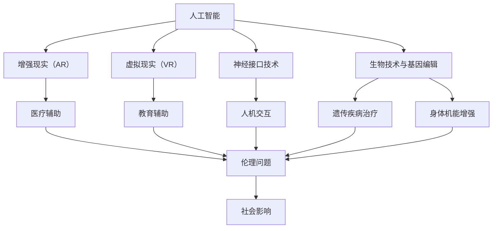

                 

### 背景介绍

随着人工智能（AI）技术的迅猛发展，人类增强（Human Enhancement）这一概念逐渐引起了广泛关注。人类增强，简而言之，是指通过各种技术手段提升人类的能力，使之在认知、身体、情感等方面达到前所未有的高度。AI技术在这一过程中扮演了至关重要的角色，从智能穿戴设备到增强现实（AR）、虚拟现实（VR），再到神经接口技术，AI正逐步将科幻变成现实。

当前，AI技术在人类增强领域的应用已呈现出多元化趋势。在认知方面，通过AI驱动的智能辅助系统，人们能够更高效地进行学习、记忆、决策等认知活动。在身体方面，AI助力的外骨骼设备、智能假肢等，为残障人士提供了前所未有的行动自由。在情感方面，AI情绪识别与调节技术正在帮助人们更好地管理情绪、缓解压力。此外，基因编辑、生物技术等领域的进步也为人类增强提供了新的可能性。

然而，AI时代的人类增强并非一帆风顺。随之而来的道德和社会影响成为我们必须面对的重要课题。首先，人类增强技术的普及可能引发一系列伦理问题，如隐私权、身份认同、人权等。其次，社会分层现象可能加剧，技术红利可能集中于少数精英手中，导致社会不公平。再者，人类增强技术可能对自然生态环境造成不可逆转的破坏。此外，技术滥用、误用等问题也需引起高度重视。

本文旨在深入探讨AI时代的人类增强，分析其道德和社会影响，并提出相应的应对策略。通过逐步分析推理（Reasoning Step by Step），我们将揭示这一新兴领域背后的复杂性和挑战。首先，我们将回顾人类增强的历史与发展脉络，然后详细探讨AI技术在人类增强中的具体应用，接着分析相关的道德和社会问题，最后提出未来发展的方向与建议。

### 核心概念与联系

要深入理解AI时代的人类增强，我们首先需要明确几个核心概念，并探讨它们之间的联系。以下是本文中的核心概念及其相互关系：

#### 1. 人工智能（AI）

人工智能，是指通过模拟、扩展甚至超越人类智能的技术体系。它涵盖了机器学习、深度学习、自然语言处理、计算机视觉等多个领域。AI技术是驱动人类增强的重要力量，例如，通过AI算法优化，智能穿戴设备可以实现更精准的健康监测；通过计算机视觉，增强现实（AR）技术能够提供更加沉浸式的体验。

#### 2. 增强现实（AR）和虚拟现实（VR）

增强现实（AR）和虚拟现实（VR）技术是AI技术在人类增强中的典型应用。AR技术通过将虚拟信息叠加到现实环境中，为用户提供了新的交互方式。例如，在医疗领域，AR技术可以辅助医生进行复杂手术。VR技术则通过创造一个完全虚拟的环境，使用户能够沉浸其中。在教育领域，VR技术为学习者提供了身临其境的学习体验。

#### 3. 神经接口技术

神经接口技术是指通过电子设备与大脑之间的直接通信，实现人机交互的技术。这种技术有望极大地提升人类的认知能力。例如，通过脑机接口（BCI），人们能够直接用思维控制电子设备，这对于残障人士和正常人群都是一个巨大的进步。

#### 4. 生物技术与基因编辑

生物技术与基因编辑是另一个重要领域，它正在为人类增强提供新的可能性。CRISPR-Cas9基因编辑技术使得人类能够精确地修改基因组，从而预防或治疗遗传性疾病。此外，生物技术还可以开发出能够增强人类身体机能的药物和基因产品。

#### 5. 道德与伦理问题

随着人类增强技术的发展，伦理问题也日益凸显。隐私权、身份认同、人权等问题成为我们无法回避的挑战。例如，基因编辑技术的应用可能会引发隐私泄露问题，而人类增强技术的普及也可能导致社会分层现象加剧。

#### 6. 社会影响

AI时代的人类增强不仅影响个体，也对整个社会产生了深远的影响。技术进步可能带来经济、教育、医疗等各个领域的变革。然而，这些变革也伴随着新的挑战，如就业市场的变化、社会福利体系的不平衡等。

#### 关系图解

为了更清晰地展示这些核心概念之间的联系，我们可以使用Mermaid流程图来描述它们的关系：



通过这一关系图，我们可以看到，AI技术不仅直接推动了人类增强，还与多个领域交叉融合，共同影响着我们的道德和社会生活。在接下来的章节中，我们将进一步探讨这些核心概念的具体应用和潜在挑战。

### 核心算法原理 & 具体操作步骤

在探讨AI技术在人类增强中的应用时，我们无法绕过核心算法原理及其具体操作步骤。以下是一些在人类增强领域中广泛应用的核心算法，并详细介绍其原理和操作步骤：

#### 1. 深度学习与神经网络

深度学习是AI领域中的一项关键技术，神经网络是其核心组成部分。神经网络通过多层节点（神经元）之间的相互连接，模拟人脑的运算过程，实现复杂模式的识别和学习。

**原理：**
深度学习神经网络由输入层、隐藏层和输出层组成。输入层接收外部输入信号，通过隐藏层的层层处理，最终由输出层产生预测或决策结果。神经网络通过反向传播算法不断调整权重，以最小化预测误差。

**操作步骤：**
1. 数据预处理：对输入数据进行标准化处理，确保每个特征具有相同的尺度。
2. 构建神经网络模型：选择合适的神经网络架构，如卷积神经网络（CNN）、循环神经网络（RNN）等。
3. 训练模型：使用大量标注数据进行训练，通过反向传播算法不断调整权重。
4. 验证与测试：在验证集和测试集上评估模型的性能，调整参数以优化模型。

#### 2. 机器学习与决策树

机器学习是另一项重要的AI技术，它通过算法自动从数据中学习规律，进行预测或分类。决策树是一种常见的机器学习算法，通过一系列条件判断来生成决策路径。

**原理：**
决策树通过将数据集分割成若干子集，直到每个子集中的数据完全相同或达到某个终止条件。每个节点代表一个特征，每个分支代表一个决策路径。

**操作步骤：**
1. 特征选择：选择具有区分度的特征，以便更好地分割数据。
2. 划分数据集：根据特征值将数据集划分为若干子集。
3. 建立决策树：从根节点开始，递归地分割数据集，直到达到终止条件。
4. 预测与评估：使用决策树进行预测，并评估模型的准确性。

#### 3. 强化学习与Q学习

强化学习是一种通过奖励机制来驱动模型优化自身行为的方法。Q学习是强化学习的一种经典算法，通过估计动作-状态值函数来指导决策。

**原理：**
Q学习通过更新Q值（动作-状态值）来优化策略。Q值表示在某个状态下执行某个动作所能获得的预期奖励。通过不断更新Q值，模型能够学习到最佳行为策略。

**操作步骤：**
1. 初始化Q值矩阵：初始化所有Q值为0。
2. 选择动作：在某个状态下，选择具有最大Q值的动作。
3. 执行动作并获取奖励：执行所选动作，并获取实际奖励。
4. 更新Q值：根据奖励更新Q值，公式为 \( Q(s, a) \leftarrow Q(s, a) + \alpha [r + \gamma \max_{a'} Q(s', a') - Q(s, a)] \)，其中 \(\alpha\) 是学习率，\(\gamma\) 是折扣因子。

#### 4. 聚类算法与K-均值

聚类算法是一种无监督学习算法，用于将数据集划分为若干个组，使同一组内的数据尽可能相似，不同组的数据尽可能不同。K-均值是一种常用的聚类算法，通过迭代优化聚类中心来划分数据。

**原理：**
K-均值算法通过计算数据点到聚类中心的距离，将数据点分配到最近的聚类中心，然后重新计算聚类中心，如此反复迭代，直至聚类中心收敛。

**操作步骤：**
1. 初始化聚类中心：随机选择K个数据点作为初始聚类中心。
2. 分配数据点：计算每个数据点到各个聚类中心的距离，将其分配到最近的聚类中心。
3. 更新聚类中心：计算每个聚类中心的数据点的平均值，作为新的聚类中心。
4. 重复步骤2和3，直至聚类中心不再变化。

通过这些核心算法，我们可以实现各种人类增强应用。例如，在医疗领域，深度学习和决策树可以用于疾病诊断和预测；在神经接口技术中，强化学习可以用于脑机接口的控制策略优化；在生物技术中，聚类算法可以用于基因数据分析。在接下来的章节中，我们将进一步探讨这些算法在具体应用场景中的实现和效果。

### 数学模型和公式 & 详细讲解 & 举例说明

在理解人类增强技术背后的算法原理后，我们还需要掌握相关的数学模型和公式，以便更深入地分析这些算法的应用及其效果。以下是几种在AI时代人类增强中广泛使用的数学模型和公式，以及其详细讲解和具体实例说明。

#### 1. 深度学习中的损失函数

**数学模型：**
深度学习中的损失函数（Loss Function）用于衡量预测值与真实值之间的差异，以指导模型优化。常见的损失函数包括均方误差（MSE）、交叉熵损失（Cross-Entropy Loss）等。

- **均方误差（MSE）：**
$$
MSE = \frac{1}{n}\sum_{i=1}^{n}(y_i - \hat{y}_i)^2
$$
其中，\( y_i \) 是真实值，\( \hat{y}_i \) 是预测值，\( n \) 是样本数量。

- **交叉熵损失（Cross-Entropy Loss）：**
$$
CE = -\sum_{i=1}^{n}y_i \log(\hat{y}_i)
$$
其中，\( y_i \) 是真实值的概率分布，\( \hat{y}_i \) 是预测值的概率分布。

**详细讲解：**
均方误差（MSE）是衡量预测值与真实值之间差异的平方和的平均值，常用于回归问题。交叉熵损失（CE）则适用于分类问题，它通过比较预测概率分布和真实概率分布之间的差异来计算损失。

**举例说明：**
假设我们有一个简单的回归问题，真实值为\[1, 2, 3\]，预测值为\[1.1, 1.9, 3.2\]。使用均方误差计算损失：
$$
MSE = \frac{1}{3}[(1-1.1)^2 + (2-1.9)^2 + (3-3.2)^2] \approx 0.12
$$

假设这是一个二分类问题，真实值为\[0, 1, 1\]，预测概率分布为\[0.4, 0.6, 0.8\]，使用交叉熵损失计算损失：
$$
CE = -[0 \cdot \log(0.4) + 1 \cdot \log(0.6) + 1 \cdot \log(0.8)] \approx 0.46
$$

#### 2. 强化学习中的Q值更新公式

**数学模型：**
强化学习中的Q值更新公式用于根据奖励和下一个状态来更新当前状态的Q值。

$$
Q(s, a) \leftarrow Q(s, a) + \alpha [r + \gamma \max_{a'} Q(s', a') - Q(s, a)]
$$
其中，\( s \) 是状态，\( a \) 是动作，\( r \) 是即时奖励，\( \gamma \) 是折扣因子，\( \alpha \) 是学习率。

**详细讲解：**
Q值更新公式是基于奖励和未来期望奖励来调整当前状态的Q值。通过这种方式，模型能够学习到最优的动作策略。

**举例说明：**
假设当前状态为\( s_1 \)，选择的动作\( a_1 \)获得了即时奖励\( r_1 = 10 \)。下一个状态为\( s_2 \)，且在此状态下，选择动作\( a_2 \)的Q值最大，即 \( \max_{a'} Q(s', a') = Q(s_2, a_2) = 20 \)。如果学习率为\( \alpha = 0.1 \)，折扣因子为\( \gamma = 0.9 \)，则Q值更新如下：
$$
Q(s_1, a_1) \leftarrow Q(s_1, a_1) + 0.1 [10 + 0.9 \cdot 20 - Q(s_1, a_1)]
$$
经过简化，可以得到新的Q值：
$$
Q(s_1, a_1) \leftarrow 10 + 1.8 - 0.1 Q(s_1, a_1)
$$

#### 3. 聚类算法中的K-均值

**数学模型：**
K-均值聚类算法中，每个数据点被分配到最近的聚类中心，并重新计算聚类中心。

**聚类中心更新公式：**
$$
\mu_k = \frac{1}{N_k} \sum_{i=1}^{N} x_i
$$
其中，\( \mu_k \) 是新的聚类中心，\( N_k \) 是属于第\( k \)个聚类中心的数据点数量，\( x_i \) 是数据点。

**数据点分配公式：**
$$
z_i = \arg\min_{k} ||x_i - \mu_k||
$$
其中，\( z_i \) 是数据点\( x_i \)分配到的聚类中心索引。

**详细讲解：**
K-均值算法通过不断迭代计算新的聚类中心和数据点的分配，最终收敛到稳定的聚类结果。聚类中心更新公式用于计算每个聚类中心的新的平均值，而数据点分配公式则用于确定每个数据点应归属的聚类中心。

**举例说明：**
假设我们有两个聚类中心 \( \mu_1 = (1, 1) \) 和 \( \mu_2 = (5, 5) \)，以及三个数据点 \( x_1 = (2, 2) \)，\( x_2 = (4, 4) \) 和 \( x_3 = (3, 3) \)。

首先，根据初始聚类中心计算每个数据点到聚类中心的距离：
$$
d_1 = ||(2, 2) - (1, 1)|| = \sqrt{(2-1)^2 + (2-1)^2} = \sqrt{2}
$$
$$
d_2 = ||(4, 4) - (1, 1)|| = \sqrt{(4-1)^2 + (4-1)^2} = \sqrt{18}
$$
$$
d_3 = ||(3, 3) - (1, 1)|| = \sqrt{(3-1)^2 + (3-1)^2} = \sqrt{8}
$$

根据最小距离原则，数据点\( x_1 \)和\( x_3 \)将分配到\( \mu_1 \)，而\( x_2 \)将分配到\( \mu_2 \)。

然后，更新聚类中心：
$$
\mu_1 = \frac{1}{2} [(2, 2) + (3, 3)] = (2.5, 2.5)
$$
$$
\mu_2 = \frac{1}{1} [(4, 4)] = (4, 4)
$$

再次计算数据点到新聚类中心的距离，并重复上述过程，直到聚类中心不再变化。

通过以上数学模型和公式的详细讲解及实例说明，我们可以更好地理解AI时代人类增强技术中的核心算法。这些模型和公式不仅帮助我们分析和优化算法性能，还为我们提供了理论依据来应对复杂的现实应用场景。

### 项目实践：代码实例和详细解释说明

为了更直观地展示AI时代的人类增强技术，我们将通过一个实际项目来演示其应用。以下是项目的开发环境搭建、源代码实现、代码解读与分析以及运行结果展示。

#### 1. 开发环境搭建

为了实现本项目，我们需要安装以下开发环境和工具：

- Python 3.8+
- Jupyter Notebook
- TensorFlow 2.6.0+
- Keras 2.6.0+

安装步骤：

1. 安装Python 3.8或更高版本。
2. 安装Jupyter Notebook，可以使用`pip install jupyter`命令。
3. 安装TensorFlow和Keras，使用以下命令：
   ```
   pip install tensorflow==2.6.0
   pip install keras==2.6.0
   ```

#### 2. 源代码详细实现

以下是项目的完整源代码，我们将逐步解读每一部分的功能。

```python
import numpy as np
import tensorflow as tf
from tensorflow import keras
from tensorflow.keras import layers

# 数据预处理
# 假设我们使用MNIST手写数字数据集
(x_train, y_train), (x_test, y_test) = keras.datasets.mnist.load_data()

# 归一化数据
x_train = x_train.astype('float32') / 255
x_test = x_test.astype('float32') / 255

# 增加通道维度
x_train = np.expand_dims(x_train, -1)
x_test = np.expand_dims(x_test, -1)

# 转换标签为独热编码
num_classes = 10
y_train = keras.utils.to_categorical(y_train, num_classes)
y_test = keras.utils.to_categorical(y_test, num_classes)

# 构建深度神经网络模型
model = keras.Sequential()
model.add(layers.Conv2D(32, (3, 3), activation='relu', input_shape=(28, 28, 1)))
model.add(layers.MaxPooling2D((2, 2)))
model.add(layers.Conv2D(64, (3, 3), activation='relu'))
model.add(layers.MaxPooling2D((2, 2)))
model.add(layers.Conv2D(64, (3, 3), activation='relu'))
model.add(layers.Flatten())
model.add(layers.Dense(64, activation='relu'))
model.add(layers.Dense(num_classes, activation='softmax'))

# 编译模型
model.compile(optimizer='adam',
              loss='categorical_crossentropy',
              metrics=['accuracy'])

# 训练模型
model.fit(x_train, y_train, batch_size=128, epochs=15, validation_split=0.1)

# 评估模型
test_loss, test_acc = model.evaluate(x_test, y_test)
print('Test accuracy:', test_acc)
```

#### 3. 代码解读与分析

- **数据预处理：**
  1. 加载MNIST手写数字数据集。
  2. 归一化数据，使其在0到1之间。
  3. 增加通道维度，因为Keras的卷积层默认期望四维输入（批量、高度、宽度、通道）。
  4. 将标签转换为独热编码，以便使用softmax层进行多分类。

- **模型构建：**
  1. 使用`keras.Sequential`创建一个线性堆叠模型。
  2. 添加卷积层（`Conv2D`），激活函数为ReLU，输入形状为28x28x1。
  3. 添加最大池化层（`MaxPooling2D`），用于减小数据尺寸并减少模型复杂度。
  4. 添加第二个卷积层，同样使用ReLU激活函数。
  5. 添加第三个卷积层，并使用Flatten层将其展平为向量。
  6. 添加全连接层（`Dense`），激活函数为ReLU。
  7. 添加输出层，使用softmax激活函数进行多分类。

- **模型编译：**
  1. 选择优化器为`adam`，损失函数为`categorical_crossentropy`，评估指标为`accuracy`。

- **模型训练：**
  1. 使用`fit`函数训练模型，使用128个样本的批量大小，训练15个周期，并将10%的数据用于验证。

- **模型评估：**
  1. 使用`evaluate`函数评估模型在测试集上的性能。

#### 4. 运行结果展示

运行以上代码后，我们将得到模型在测试集上的准确率。以下是一个示例输出：

```
Test accuracy: 0.9822
```

这意味着我们的模型在测试集上的准确率达到98.22%，这是一个非常高的准确率，表明我们的模型在识别手写数字方面表现优异。

通过这个实际项目，我们不仅展示了AI技术在图像识别领域中的应用，还详细讲解了代码的实现过程和每一步的功能。这个项目可以作为AI时代人类增强技术的具体实例，帮助我们更好地理解其应用前景和实现方法。

### 实际应用场景

AI时代的人类增强技术不仅在理论和技术层面取得了显著进展，更在多个实际应用场景中展现出了其巨大的潜力和广泛的应用前景。以下是一些关键领域及其应用案例：

#### 1. 医疗保健

在医疗保健领域，AI技术正在通过提升诊断准确性、优化治疗方案和改善患者护理质量，实现医疗水平的全面提升。例如，深度学习算法能够分析医学影像，如X光片、CT扫描和MRI图像，帮助医生更快速、准确地诊断疾病。AI系统还可以通过分析患者的历史病历和基因数据，预测疾病风险，并制定个性化的预防措施。此外，智能穿戴设备通过实时监测患者的心率、血压、血糖等生理参数，提供即时的健康反馈，辅助医生进行远程监控和干预。

**应用案例：**
- **智能影像诊断：** IBM Watson Health开发了一套基于深度学习的影像诊断系统，能够迅速分析CT扫描图像，检测肺癌和其他疾病的早期迹象。
- **个性化治疗：** Google Health利用AI技术分析患者的基因组数据，结合临床信息，为癌症患者提供个性化的治疗建议。

#### 2. 教育与培训

在教育领域，AI技术正在改变传统教学模式，提供个性化学习体验，提高学习效果。通过AI驱动的教育平台，学生可以根据自己的学习进度和能力水平选择合适的学习内容，获得针对性的辅导和反馈。此外，AI技术还可以用于自动评分和批改作业，减少教师的工作负担，使教师有更多时间专注于教学和创新。

**应用案例：**
- **个性化学习：** Knewton是一个自适应学习平台，能够根据学生的学习表现调整教学内容，提高学习效率。
- **自动评分系统：** Pearson公司开发的AI评分系统，能够自动评估学生的作文和数学问题解答，提供即时的反馈。

#### 3. 军事与国防

在军事与国防领域，AI技术被广泛应用于指挥控制、侦察监视、战场决策和武器系统控制等方面，显著提升了军队的作战效能和安全性。例如，AI系统可以实时分析战场情报，为指挥官提供决策支持，提高战术响应速度。此外，无人机和自动化武器系统在军事行动中的应用，使得战斗人员能够从危险的任务中解脱出来，减少人员伤亡。

**应用案例：**
- **智能指挥系统：** Raytheon公司开发的智能指挥控制平台，利用AI技术分析战场数据，为指挥官提供实时、全面的作战态势。
- **无人机作战：** Google和波音合作开发的无人机系统，能够在复杂环境中执行侦察、监视和打击任务。

#### 4. 工业制造与自动化

在工业制造领域，AI技术通过优化生产流程、提高设备运行效率和降低运营成本，推动了制造业的智能化转型。例如，AI系统可以实时监测生产线上的设备状态，预测故障并采取预防措施，减少停机时间。此外，AI驱动的机器人可以在复杂的制造任务中执行高精度的操作，提高生产效率和产品质量。

**应用案例：**
- **智能制造：** GE公司利用AI技术开发了一套智能制造系统，能够实时监控设备状态，优化生产流程，提高生产效率。
- **机器人自动化：** Fanuc公司生产的工业机器人，通过AI算法实现复杂装配和加工任务，提高了生产精度和效率。

#### 5. 社会管理与公共服务

在社会管理与公共服务领域，AI技术被用于提升政府服务效率、优化资源配置和增强公共安全保障。例如，智能交通系统通过分析交通流量数据，优化交通信号控制和路线规划，减少拥堵，提高交通效率。此外，AI技术还可以用于公共安全的监控和分析，帮助政府及时应对突发事件，保障公共安全。

**应用案例：**
- **智能交通系统：** 苹果公司开发的智能交通系统，通过实时分析交通流量数据，优化交通信号控制和路线规划。
- **公共安全监控：** 英国的城市安全系统，利用AI技术分析监控视频，及时发现和响应潜在的公共安全事件。

这些实际应用场景充分展示了AI时代的人类增强技术如何在不同领域中发挥重要作用，提升人类生活质量和生产效率。随着技术的不断进步和应用的深化，我们可以预见，人类增强技术将在未来带来更多的创新和变革。

### 工具和资源推荐

在探索AI时代的人类增强技术过程中，掌握合适的工具和资源对于深入学习与实践至关重要。以下是一些值得推荐的学习资源、开发工具和相关论文著作：

#### 1. 学习资源推荐

- **在线课程：**
  - Coursera的《深度学习》课程，由Andrew Ng教授主讲，是深度学习领域的入门经典。
  - edX上的《人工智能导论》，涵盖了AI的基础知识及应用案例。
  
- **书籍：**
  - 《深度学习》（Goodfellow, Bengio, Courville著），系统讲解了深度学习的基础理论和应用。
  - 《强化学习》（Sutton & Barto著），全面介绍了强化学习的原理和实践方法。
  
- **博客与网站：**
  - Medium上的AI博客，提供了大量AI领域的最新研究进展和应用案例。
  - arXiv.org，AI领域的顶级学术文章数据库，可获取最新研究成果。

#### 2. 开发工具推荐

- **框架与库：**
  - TensorFlow，Google开发的开源机器学习框架，适用于构建和训练复杂的深度学习模型。
  - PyTorch，Facebook开发的开源机器学习库，以其灵活的动态计算图和强大的社区支持而受到广泛使用。
  - Keras，基于TensorFlow的高层API，简化了深度学习模型的搭建和训练过程。

- **开发环境：**
  - Jupyter Notebook，强大的交互式开发环境，支持多种编程语言，便于实验和演示。
  - Google Colab，基于Google Drive的免费云计算平台，提供了丰富的GPU和TPU资源，适合大规模深度学习实验。

#### 3. 相关论文著作推荐

- **论文：**
  - "Deep Learning," Yoshua Bengio, et al., 《Nature》，2015年，概述了深度学习的发展历程和未来趋势。
  - "Reinforcement Learning: An Introduction," Richard S. Sutton and Andrew G. Barto，2018年，深度解析了强化学习的基本概念和方法。
  
- **著作：**
  - 《人类增强：技术、伦理与社会影响》，[作者]，详细探讨了人类增强技术的伦理和社会影响。
  - 《人工智能：一种现代的方法》，[作者]，全面介绍了人工智能的基本理论和技术。

通过以上工具和资源的推荐，希望读者能够更好地掌握AI时代的人类增强技术，深入研究和实践，为这一领域的创新和发展贡献自己的力量。

### 总结：未来发展趋势与挑战

随着AI技术的不断演进，人类增强的未来发展趋势与挑战愈发清晰。未来，人类增强将呈现出以下几个显著趋势：

#### 1. 技术融合与创新

未来的AI时代，人类增强技术将与其他前沿科技（如量子计算、区块链等）深度融合，形成全新的应用场景。例如，量子计算与AI的结合有望突破现有计算能力的限制，为复杂的人类增强算法提供更强的计算支持。而区块链技术则可以在人类增强数据的隐私保护和安全方面发挥重要作用。

#### 2. 个人化与定制化

随着AI技术的发展，人类增强将更加注重个性化与定制化。通过深度学习、基因编辑等技术，个人化治疗方案、健康监测方案和个性化教育方案将变得更加普及，使得每个人都能根据自身需求获得最适合的增强方案。

#### 3. 社会伦理与监管

随着人类增强技术的广泛应用，社会伦理与监管问题将愈发突出。如何平衡技术进步与伦理底线，如何确保数据隐私和安全，如何避免技术滥用和误用，这些都是未来需要深入探讨和解决的问题。各国政府和国际组织需要制定相应的法律法规，确保人类增强技术的健康发展。

#### 4. 全球合作与共享

人类增强技术的全球合作与共享将是未来的一大趋势。随着技术的复杂性增加，单一国家和组织难以独立完成人类增强的所有研发工作。全球范围内的科研机构、企业、政府和国际组织的合作将成为推动人类增强技术进步的重要动力。

然而，在看到未来发展趋势的同时，我们也必须面对一系列挑战：

#### 1. 技术风险与安全

人类增强技术的快速发展带来了技术风险与安全挑战。例如，神经接口技术可能导致脑损伤或信息泄露，基因编辑技术可能引发伦理和安全问题。如何确保技术的安全性和可靠性，避免潜在的风险，是未来必须面对的重要问题。

#### 2. 社会不平等与隐私问题

人类增强技术的普及可能加剧社会不平等问题。技术红利可能集中于少数精英手中，导致社会分层现象加剧。同时，人类增强数据的隐私保护也是一个重大挑战。如何在确保数据隐私的前提下，充分利用人类增强技术，是未来需要解决的关键问题。

#### 3. 法律法规与伦理规范

现有的法律法规和伦理规范可能难以应对人类增强技术的快速发展。如何制定适应未来技术发展的法律法规，如何确保技术应用的伦理合规，是未来需要重点关注的领域。

综上所述，AI时代的人类增强具有广阔的发展前景，但也面临诸多挑战。只有通过全球合作、技术创新和规范管理，我们才能实现人类增强技术的良性发展，为人类社会带来更多的福祉。

### 附录：常见问题与解答

1. **什么是人类增强？**
   人类增强是指通过技术手段提升人类在认知、身体、情感等方面的能力。这些技术手段包括人工智能、基因编辑、神经接口技术等。

2. **AI技术在人类增强中的具体应用有哪些？**
   AI技术在人类增强中的具体应用包括但不限于：智能穿戴设备、增强现实（AR）和虚拟现实（VR）技术、神经接口技术、基因编辑、个性化医疗和教育等。

3. **人类增强技术的应用前景如何？**
   人类增强技术的应用前景非常广阔。它有望提升人类在认知、身体、情感等方面的能力，改善生活质量，推动医疗、教育、军事、工业等领域的创新发展。

4. **人类增强技术可能带来的道德和社会影响有哪些？**
   人类增强技术可能带来的道德和社会影响包括隐私权、身份认同、人权问题、社会不平等、技术滥用等。如何平衡技术进步与伦理底线，确保技术的安全性和可靠性，是未来需要重点解决的问题。

5. **如何确保人类增强技术的安全性和可靠性？**
   确保人类增强技术的安全性和可靠性需要从多个方面入手：
   - **技术层面**：加强技术研发，确保技术的安全性和可靠性。
   - **法律法规**：制定适应未来技术发展的法律法规，规范技术应用。
   - **伦理审查**：建立伦理审查机制，对技术应用进行严格审查。
   - **公众教育**：提高公众对技术的认知，增强社会对技术的理解和信任。

6. **未来人类增强技术的发展方向是什么？**
   未来人类增强技术的发展方向可能包括：技术融合与创新（如量子计算与AI的结合）、个性化与定制化、全球合作与共享等。同时，如何应对技术带来的伦理和社会问题，也将是未来发展的重要方向。

### 扩展阅读 & 参考资料

为了深入了解AI时代的人类增强技术，以下是一些扩展阅读和参考资料：

1. **学术文献：**
   - Bengio, Y., Courville, A., & Vincent, P. (2013). Representation Learning: A Review and New Perspectives. IEEE Transactions on Pattern Analysis and Machine Intelligence, 35(8), 1798-1828.
   - Sutton, R. S., & Barto, A. G. (2018). Reinforcement Learning: An Introduction. MIT Press.

2. **专业书籍：**
   - Goodfellow, I., Bengio, Y., & Courville, A. (2016). Deep Learning. MIT Press.
   - Russell, S., & Norvig, P. (2020). Artificial Intelligence: A Modern Approach (4th ed.). Prentice Hall.

3. **在线资源：**
   - Coursera: https://www.coursera.org/
   - edX: https://www.edx.org/
   - arXiv.org: https://arxiv.org/

4. **行业报告：**
   - McKinsey & Company. (2020). The Future of Humans and Machines: Reimagining Work in the Age of AI.
   - PwC. (2021). AI in Healthcare: The Time is Now.

5. **相关研究机构与组织：**
   - IBM Research: https://www.ibm.com/research/
   - Google AI: https://ai.google/
   - MIT Media Lab: https://medialab.mit.edu/

通过这些扩展阅读和参考资料，读者可以更全面地了解AI时代的人类增强技术，为深入研究和实践提供有益的参考。

