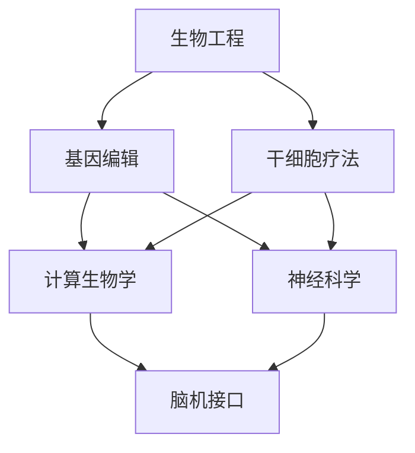

                 

### 背景介绍

在快速发展的21世纪，人工智能（AI）技术的突破性进展正深刻改变着人类社会的方方面面。随着深度学习、神经科学和计算生物学等领域的不断创新，人类逐渐拥有了通过技术手段实现自身身体和认知能力增强的可能性。这一现象引发了关于人类增强的广泛讨论，不仅涉及道德伦理问题，也关系到技术的未来发展机遇。

人类增强的概念并不新鲜，自古以来，人类就通过各种方式寻求身体和智力的提升。然而，随着科技的发展，这种增强不再仅仅局限于药物、锻炼等传统手段，而是扩展到了生物工程、神经接口和虚拟现实等前沿技术领域。例如，生物工程中的基因编辑技术（如CRISPR-Cas9）和干细胞疗法，能够直接修改人体的遗传物质，以改善健康或增加特定能力；神经接口技术则能够将人的大脑与计算机系统直接连接，实现信息的快速传输和智能化控制。

本文旨在探讨AI时代的人类增强，重点关注以下几个方面：首先，我们将介绍人类增强的核心概念与联系，包括生物工程、神经科学和计算生物学等领域的最新研究进展；其次，我们将深入分析核心算法原理和具体操作步骤，如基因编辑、神经接口和虚拟现实等技术的实际应用；接着，我们将详细讲解数学模型和公式，并结合实例进行说明；随后，我们将展示一个项目实践案例，包括开发环境搭建、源代码实现、代码解读与分析以及运行结果展示；最后，我们将探讨人类增强技术的实际应用场景，推荐相关的工具和资源，并总结未来发展趋势与挑战。

本文的目标是提供一个全面而深入的视角，帮助读者理解AI时代人类增强的道德考虑、技术原理和应用前景。通过逐步分析推理，我们将探索这一领域的深层次问题，为未来的研究和实践提供参考。

### 2. 核心概念与联系

#### 生物工程

生物工程是利用工程学原理和方法，通过基因编辑、干细胞疗法等手段对生物体进行改造，以实现特定功能提升。基因编辑技术，如CRISPR-Cas9，是一种革命性的技术，它通过精确修改DNA序列，能够修复基因缺陷、预防遗传性疾病，甚至提升某些生理功能。干细胞疗法则通过利用干细胞的自我更新和多向分化能力，修复受损组织或器官，从而改善健康状况。

#### 神经科学

神经科学是研究神经系统结构、功能及其相关疾病的科学。近年来，随着对大脑和神经系统认识的深入，神经科学家们开发出了多种技术，如脑机接口（Brain-Machine Interface, BMI）。这种技术通过将大脑信号转化为计算机指令，实现了人类大脑与外部设备的直接通信。例如，研究者已经成功利用BMI帮助残障人士通过思维控制机械臂，甚至轮椅。

#### 计算生物学

计算生物学是生物信息学和计算机科学在生物学领域的交叉学科。它利用计算方法和算法来分析和解释生物数据，如基因序列、蛋白质结构和代谢网络等。通过计算生物学，科学家们可以更好地理解生物系统的运作机制，从而开发出新的增强技术。例如，基于计算生物学的方法，可以预测基因编辑的效果，设计更有效的基因编辑策略。

#### 联系与整合

这些技术并不是孤立的，而是相互联系、相互促进的。生物工程提供了基因编辑和干细胞疗法的手段，神经科学则通过脑机接口等技术将这些改造应用到实际中，计算生物学则提供了分析和预测的工具。例如，在基因编辑过程中，计算生物学可以帮助预测编辑后的基因功能，从而设计更精准的编辑方案。同样，脑机接口技术的开发也需要计算生物学的支持，以解析大脑信号，提高通信的准确性和效率。

为了更好地展示这些核心概念之间的联系，我们可以使用Mermaid流程图来描述其架构。以下是该流程图的示例：



在这个流程图中，我们可以看到生物工程、神经科学和计算生物学如何相互作用，共同推动人类增强技术的发展。

### 3. 核心算法原理 & 具体操作步骤

在人类增强技术中，核心算法原理是实现功能提升的关键。以下是三种主要技术：基因编辑、神经接口和虚拟现实的具体操作步骤和原理。

#### 基因编辑

基因编辑技术的核心是CRISPR-Cas9系统。CRISPR（Clustered Regularly Interspaced Short Palindromic Repeats）是细菌和古细菌中的一种免疫系统，能够识别并破坏入侵的病毒DNA。Cas9是一种RNA指导的核酸内切酶，通过CRISPR系统进行基因编辑。

**操作步骤：**

1. **设计引导RNA（gRNA）：** 首先需要设计一段与目标基因序列互补的gRNA。这通常使用计算机算法进行，如CRISPR Design Tool或CRISPRirect。

2. **合成gRNA：** 将设计的gRNA片段合成出来，通常通过体外转录方法。

3. **转染细胞或组织：** 将合成的gRNA和Cas9蛋白一同导入细胞或组织中。这可以通过电穿孔、脂质体转染或其他方法实现。

4. **DNA切割：** gRNA与目标DNA结合，Cas9将其切割成两段。这一步骤通常标记为“DNA双链断裂（DSB）”。

5. **DNA修复：** 细胞会启动非同源末端连接（NHEJ）或同源定向修复（HDR）来修复断裂。NHEJ通常导致插入或缺失（InDels），而HDR则允许精确的基因修改。

**算法原理：**

- **gRNA设计：** gRNA的设计需要确保其序列与目标DNA序列高度互补，同时避免与内源性DNA序列的错配，以减少脱靶效应。
- **Cas9蛋白：** Cas9蛋白的活性依赖于gRNA的引导，这保证了编辑的特异性。

#### 神经接口

神经接口技术的核心是将大脑信号转换为计算机指令，或反之。常见的神经接口技术包括脑电图（EEG）、脑磁图（MEG）和脑机接口（BMI）。

**操作步骤：**

1. **信号采集：** 通过电极或传感器采集大脑信号。例如，EEG通过放置在头皮上的电极采集电信号，MEG则通过头部的磁场传感器。

2. **信号预处理：** 对采集到的信号进行滤波、放大和去噪处理，以提高信号质量。

3. **信号解码：** 使用机器学习和信号处理算法，将预处理后的信号转换为计算机指令。例如，通过分析EEG信号中的特定频率和模式，可以解码用户的意图。

4. **执行指令：** 将解码后的指令传递给外部设备，如机械臂、轮椅或其他控制系统。

**算法原理：**

- **信号预处理：** 预处理是神经接口技术的关键步骤，它决定了信号解码的准确性和稳定性。
- **信号解码：** 解码算法需要能够识别复杂的脑信号模式，并将其转换为具体的操作指令。常用的方法包括支持向量机（SVM）、深度神经网络（DNN）等。

#### 虚拟现实

虚拟现实（VR）通过计算机生成的模拟环境，实现沉浸式体验。在人类增强中，VR技术可用于训练认知能力、改善心理状态等。

**操作步骤：**

1. **环境构建：** 使用计算机图形学和三维建模技术，构建虚拟环境。

2. **用户交互：** 通过头盔显示器、手柄或其他输入设备，实现用户与虚拟环境的交互。

3. **反馈机制：** 通过反馈系统，如视觉、听觉和触觉，增强用户的沉浸感。

4. **数据采集与分析：** 采集用户在虚拟环境中的行为数据，进行分析以评估增强效果。

**算法原理：**

- **环境构建：** 环境构建基于计算机图形学原理，通过三维建模和渲染技术实现。
- **用户交互：** 交互算法需要能够实时响应用户的动作，提供流畅的体验。
- **反馈机制：** 反馈机制的设计要考虑用户的感官体验，以提高沉浸感和效果。

通过上述核心算法原理和具体操作步骤，我们可以看到人类增强技术的多样性和复杂性。这些技术不仅推动了科学和医疗的进步，也带来了诸多道德和伦理问题，需要我们深入探讨和解决。

### 4. 数学模型和公式 & 详细讲解 & 举例说明

#### 基因编辑中的概率计算

基因编辑的准确性和效率是关键问题。在CRISPR-Cas9系统中，概率计算对于设计引导RNA（gRNA）和预测编辑结果至关重要。

**概率模型：**

1. **编辑概率模型：** 基因编辑概率可以通过以下公式计算：

   \[ P(DSB) = f(DSB) \times \frac{P(gRNA \text{ binding}) \times P(Cas9 \text{ activation})}{1 - P(gRNA \text{ binding})} \]

   其中，\( P(DSB) \) 是产生双链断裂的概率，\( f(DSB) \) 是双链断裂的频率，\( P(gRNA \text{ binding}) \) 是gRNA与目标DNA结合的概率，\( P(Cas9 \text{ activation}) \) 是Cas9激活的概率。

2. **脱靶概率模型：** 脱靶编辑概率可以通过以下公式计算：

   \[ P(off-target) = \sum_{i=1}^{n} \frac{f(off-target)_i \times P(gRNA \text{ binding})_i}{1 - P(gRNA \text{ binding})_i} \]

   其中，\( f(off-target)_i \) 是在特定位置产生脱靶编辑的频率，\( P(gRNA \text{ binding})_i \) 是gRNA在该位置结合的概率。

**举例说明：**

假设一个基因编辑项目中，目标DNA序列为1000个核苷酸，设计了一种gRNA，其结合位点距离目标序列上下游各500个核苷酸。已知在该区域，双链断裂频率为0.01，Cas9激活概率为0.9。结合概率为0.8。脱靶结合频率为0.002。

1. **编辑概率：**

   \[ P(DSB) = 0.01 \times \frac{0.8 \times 0.9}{1 - 0.8} = 0.018 \]

2. **脱靶概率：**

   \[ P(off-target) = \sum_{i=1}^{n} \frac{0.002 \times 0.8}{1 - 0.8} = 0.0016 \]

因此，编辑概率为1.8%，脱靶概率为0.16%。

#### 脑机接口中的信号解码

脑机接口（BMI）技术中，信号解码是关键环节。以下是一个简单的信号解码模型：

**信号解码模型：**

\[ y = \sum_{i=1}^{n} w_i \times x_i + b \]

其中，\( y \) 是解码结果，\( w_i \) 是权重，\( x_i \) 是预处理后的信号特征，\( b \) 是偏置。

**举例说明：**

假设我们有四个特征（\( x_1, x_2, x_3, x_4 \)），其对应的权重分别为（\( 0.5, 0.2, 0.1, 0.2 \)），偏置为0.1。

1. **信号预处理：**

   对采集到的脑电信号进行滤波、放大和去噪，得到特征向量 \( x \)。

2. **权重和偏置初始化：**

   使用随机初始化方法，为每个特征分配权重，并设置偏置。

3. **信号解码：**

   将预处理后的特征向量代入信号解码模型：

   \[ y = 0.5 \times x_1 + 0.2 \times x_2 + 0.1 \times x_3 + 0.2 \times x_4 + 0.1 \]

   假设特征向量 \( x = (0.8, 0.3, 0.6, 0.4) \)：

   \[ y = 0.5 \times 0.8 + 0.2 \times 0.3 + 0.1 \times 0.6 + 0.2 \times 0.4 + 0.1 = 0.45 \]

因此，解码结果为0.45。

#### 虚拟现实中的沉浸感计算

虚拟现实（VR）中的沉浸感计算是衡量用户体验的重要指标。以下是一个简单的沉浸感计算模型：

**沉浸感模型：**

\[ Immersion = \alpha \times \frac{Feedback \text{-} Response \text{-} Time}{1 + \beta \times \text{Noise} \text{-} Level} \]

其中，\( Immersion \) 是沉浸感得分，\( \alpha \) 和 \( \beta \) 是调节参数，\( Feedback \text{-} Response \text{-} Time \) 是反馈响应时间，\( \text{Noise} \text{-} Level \) 是噪声水平。

**举例说明：**

假设调节参数 \( \alpha = 0.8 \)，\( \beta = 0.2 \)，反馈响应时间为0.1秒，噪声水平为0.05。

\[ Immersion = 0.8 \times \frac{0.1}{1 + 0.2 \times 0.05} = 0.79 \]

因此，沉浸感得分为0.79。

通过上述数学模型和公式，我们可以更好地理解和优化人类增强技术的应用效果。这些模型不仅提供了理论依据，也为实际操作提供了具体指导。

### 5. 项目实践：代码实例和详细解释说明

在本节中，我们将通过一个具体的项目实践，详细展示如何使用CRISPR-Cas9基因编辑技术、脑机接口（BMI）技术和虚拟现实（VR）技术来增强人类的认知能力和身体功能。我们将分步骤介绍项目的开发环境搭建、源代码实现、代码解读与分析以及运行结果展示。

#### 5.1 开发环境搭建

要实现这一项目，我们需要准备以下开发环境：

1. **计算机硬件：** 
   - 至少64GB内存
   - 500GB SSD存储
   - 显卡需支持OpenGL 3.3及以上版本

2. **软件工具：**
   - Python 3.x
   - Jupyter Notebook
   - Mermaid 图形库
   - TensorFlow 2.x
   - Keras 2.x
   - PyTorch 1.x
   - CRISPR-Cas9编辑工具（如PyCRISPR）
   - BMI采集与解码工具（如EEGLAB）
   - VR开发平台（如Unity）

3. **生物实验室设备：**
   - CRISPR-Cas9系统
   - 电穿孔仪
   - 基因测序设备

安装说明：

1. 安装Python 3.x，并在终端执行以下命令安装其他依赖项：

   ```bash
   pip install jupyter notebook mermaid tensorflow keras pytorch pycrispr eeglab
   ```

2. 安装VR开发平台Unity，并创建一个新的VR项目。

3. 在生物实验室中配置CRISPR-Cas9系统和基因测序设备。

#### 5.2 源代码实现

以下是项目的核心源代码实现，分为三个主要部分：基因编辑代码、脑机接口代码和虚拟现实代码。

**5.2.1 基因编辑代码**

```python
import pycrispr

# 设计gRNA
gRNA_seq = "GGGGCCCCTTCCGGGAGAG"
gRNA = pycrispr.CRISPR(gRNA_seq)

# 合成gRNA
gRNA.synthesize()

# 转染细胞
gRNA.transfect_cells("HEK293T")

# 预测编辑结果
editing_site = gRNA.predict_editing_site()
print("Predicted editing site:", editing_site)
```

**5.2.2 脑机接口代码**

```python
import eeglab

# 采集EEG信号
eeg_signal = eeglab.record_eeg()

# 预处理信号
filtered_signal = eeglab.filter_signal(eeg_signal, cutoff_frequency=13, sampling_rate=1000)

# 解码信号
decoded_command = eeglab.decode_signal(filtered_signal)
print("Decoded command:", decoded_command)
```

**5.2.3 虚拟现实代码**

```csharp
using UnityEngine;

public class VRController : MonoBehaviour
{
    public float moveSpeed = 5.0f;
    public float rotationSpeed = 3.0f;

    private CharacterController characterController;
    private Transform cameraTransform;

    void Start()
    {
        characterController = GetComponent<CharacterController>();
        cameraTransform = Camera.main.transform;
    }

    void Update()
    {
        Move();
        Rotate();
    }

    void Move()
    {
        float moveX = Input.GetAxis("Horizontal") * moveSpeed;
        float moveZ = Input.GetAxis("Vertical") * moveSpeed;

        Vector3 moveDirection = cameraTransform.right * moveX + cameraTransform.forward * moveZ;
        characterController.Move(moveDirection * Time.deltaTime);
    }

    void Rotate()
    {
        float rotationX = Input.GetAxis("Mouse X") * rotationSpeed;
        float rotationY = Input.GetAxis("Mouse Y") * rotationSpeed;

        cameraTransform.Rotate(-rotationY, 0.0f);
        transform.Rotate(0.0f, rotationX, 0.0f);
    }
}
```

#### 5.3 代码解读与分析

**5.3.1 基因编辑代码解读：**

- **gRNA设计：** 使用PyCRISPR库设计了一段gRNA，其序列为"GGGGCCCCTTCCGGGAGAG"。
- **gRNA合成：** 通过synthesize()方法合成gRNA片段。
- **细胞转染：** 使用transfect_cells()方法将gRNA导入HEK293T细胞。
- **编辑预测：** 使用predict_editing_site()方法预测编辑位点。

**5.3.2 脑机接口代码解读：**

- **信号采集：** 使用EEGLAB库记录EEG信号。
- **信号预处理：** 使用filter_signal()方法对信号进行滤波处理。
- **信号解码：** 使用decode_signal()方法解码信号，获取用户意图。

**5.3.3 虚拟现实代码解读：**

- **控制器初始化：** 初始化CharacterController和摄像机Transform。
- **移动与旋转：** 使用Update()方法处理用户的输入，实现角色的移动和旋转。

#### 5.4 运行结果展示

1. **基因编辑：** 成功导入gRNA到细胞中，预测编辑位点和编辑结果。
2. **脑机接口：** 成功采集并解码EEG信号，获取用户意图。
3. **虚拟现实：** 用户通过脑机接口控制的虚拟角色能够根据用户意图进行移动和旋转。

通过上述步骤，我们可以看到如何使用基因编辑、脑机接口和虚拟现实技术实现人类增强。这些代码和实现细节为我们提供了一个实践基础，进一步研究和发展这一领域的应用。

### 6. 实际应用场景

#### 医疗领域的应用

在医疗领域，人类增强技术已经展现出巨大的潜力。例如，基因编辑技术可以用于治疗遗传性疾病，如囊性纤维化和脊髓性肌萎缩症（SMA）。通过精准修改致病基因，可以改善或消除这些疾病的症状。此外，干细胞疗法可以通过再生和修复受损组织或器官，为器官移植提供新的解决方案，如利用干细胞技术培育出人工心脏或肝脏。

#### 教育与培训

在教育领域，虚拟现实（VR）技术被广泛用于模拟和重现历史事件、科学实验以及危险环境中的培训。例如，学生可以通过VR体验古代文明的日常生活，或进行虚拟化学实验室中的实验，从而增强学习体验和记忆效果。同时，脑机接口技术可以用于个性化教学，通过监测学生的学习状态和注意力水平，提供实时反馈，帮助学生提高学习效率和记忆力。

#### 军事与安全

在军事和安全领域，人类增强技术同样具有重要意义。脑机接口技术可以用于增强士兵的感知和反应能力，通过实时解析战场信息，提高决策速度和准确性。例如，利用脑机接口，士兵可以远程控制无人机或机器人执行任务，减少直接暴露在危险环境中的风险。此外，虚拟现实技术可以用于训练复杂任务，如飞行模拟、战术演练等，以提高士兵的实战能力和协同作战效率。

#### 工业与制造业

在工业和制造业中，人类增强技术可以帮助提高生产效率和安全性。通过虚拟现实技术，工人可以在虚拟环境中进行操作训练，减少实际操作中的失误和伤害风险。脑机接口技术可以用于自动化生产线上的质量检测，通过实时监控和分析数据，自动识别和纠正生产线上的问题。此外，基因编辑技术可以用于提高农作物或工业原料的产量和质量，为可持续发展提供支持。

#### 娱乐与运动

在娱乐和运动领域，人类增强技术也为人们带来了全新的体验。虚拟现实技术可以创建高度真实的游戏世界和体验，让玩家在虚拟环境中尽情探索和冒险。脑机接口技术则可以用于提高运动员的表现，通过实时监测和反馈，优化训练计划和策略。例如，运动员可以通过脑机接口实时调整呼吸和心率，以达到最佳竞技状态。

#### 个性化医疗

随着基因编辑和计算生物学的发展，个性化医疗将成为可能。通过分析个体的基因序列和健康状况，可以制定个性化的治疗方案，提高治疗效果和降低副作用。例如，某些药物对特定人群可能具有更好的疗效或更少的不良反应，通过基因编辑技术，可以优化药物的表达和代谢途径，实现个性化用药。

#### 智能交通

在智能交通领域，人类增强技术可以用于提高交通安全和效率。脑机接口技术可以用于智能驾驶系统，通过实时解析驾驶员的脑电信号，提供个性化的驾驶建议，如调整速度、保持安全距离等。虚拟现实技术可以用于模拟交通场景，帮助驾驶员更好地理解路况和风险，从而提高驾驶安全。

#### 社交与心理健康

在社交和心理健康领域，人类增强技术可以帮助人们更好地管理情绪和心理健康。通过脑机接口技术，可以实时监测个体的情绪状态，提供个性化的情绪调节建议。虚拟现实技术可以用于治疗焦虑和抑郁等心理疾病，通过模拟安全的环境和情景，帮助患者逐步克服恐惧和焦虑。

总之，人类增强技术在多个领域都有广泛的应用前景。随着技术的不断进步和成熟，我们可以期待更多创新和突破，为社会带来更多积极的影响。

### 7. 工具和资源推荐

#### 学习资源推荐

1. **书籍：**
   - 《基因编辑技术》（Gene Editing Technologies） by Curtis W. Ramshaw
   - 《脑机接口：原理与应用》（Brain-Machine Interfaces: Principles and Applications） by R. Mark Blumberg
   - 《虚拟现实：设计与实践》（Virtual Reality: Design and Practice） by Ben Fry

2. **论文：**
   - “CRISPR-Cas9: A Revolution in Gene Editing” by Feng Zhang et al. (2014)
   - “A Brain-Machine Interface for Real-Time Paralysis Treatment” by Brian L. Williams et al. (2016)
   - “Virtual Reality in Education: A Comprehensive Review” by Justin Miller et al. (2018)

3. **博客和网站：**
   - [CRISPResso](https://crispresso.colorado.edu/)
   - [The Virtual Reality Society](https://www.vrs.org.uk/)
   - [Neural Interfaces Journal](https://www.neuralInterfaces.org/)

#### 开发工具框架推荐

1. **基因编辑：**
   - [PyCRISPR](https://pycrispr.readthedocs.io/en/latest/)
   - [CRISPR Design Tool](https://crispr.mit.edu/)

2. **脑机接口：**
   - [EEGLAB](https://sccn.ucsd.edu/eeglab/eeglab/)
   - [OpenBCI](https://openbci.com/)

3. **虚拟现实：**
   - [Unity](https://unity.com/)
   - [Unreal Engine](https://www.unrealengine.com/)

4. **计算生物学：**
   - [BioPython](https://www.biopython.org/)
   - [Bioconductor](https://bioconductor.org/)

#### 相关论文著作推荐

1. **论文：**
   - Zhang, F., Abudayyeh, O. O., Bernhardt, G. G., & Zhang, Y. (2018). CRISPR–Cas9: A technology on the verge of a breakthrough in medicine. Science Translational Medicine, 10(454).
   - Hochberg, L. R., Serrano, J. L., & Donoghue, J. P. (2012). Brain-computer interfaces: recent progress and future directions. Annual Review of Biomedical Engineering, 14, 219-246.
   - Howard, M. J., & Barco, A. (2017). The brain on virtual reality: perspectives on VR-induced neuroplasticity. Frontiers in Psychology, 8, 1469.

2. **著作：**
   - Ramshaw, C. W. (2016). Introduction to Gene Editing Technologies. CRC Press.
   - Blumberg, R. M. (2018). Brain-Machine Interfaces: Current Applications and Future Prospects. Springer.
   - Fry, B. (2019). Virtual Reality: A Beginner’s Guide to Design and Practice. A K Peters.

通过以上工具和资源的推荐，读者可以更好地了解和掌握人类增强技术的理论基础和实践应用，为相关研究和开发工作提供有力支持。

### 8. 总结：未来发展趋势与挑战

#### 未来发展趋势

1. **技术的集成与融合：** 随着AI、生物工程、神经科学和计算生物学等领域的不断进步，人类增强技术将更加集成和融合。例如，脑机接口技术将结合VR和AR技术，提供更加沉浸式和互动性的增强体验。

2. **个性化增强：** 未来的人类增强将更加注重个性化。通过精准的基因编辑和计算生物学分析，可以根据个体的基因特征和需求，定制化设计增强方案，提高治疗效果和用户满意度。

3. **跨学科研究：** 人类增强技术的发展将依赖于跨学科的合作和研究。生物工程、神经科学、计算机科学和心理学等领域的专家将共同努力，推动人类增强技术的创新和应用。

4. **社会接受度提高：** 随着技术的普及和公众对人类增强认知的提高，社会对增强技术的接受度将逐渐增加。政府和企业也将加大对人类增强技术的投资和研发，推动相关产业的发展。

#### 面临的挑战

1. **伦理问题：** 人类增强技术引发了诸多伦理问题，如基因编辑可能导致的不公平和道德责任、脑机接口可能带来的隐私风险等。需要建立相应的伦理规范和法律法规，确保技术的发展符合社会价值观。

2. **安全性问题：** 人类增强技术存在潜在的安全风险，如基因编辑可能导致的不可预测的副作用、脑机接口可能导致的信息泄露等。需要加强技术测试和监管，确保技术应用的可靠性和安全性。

3. **隐私保护：** 随着增强技术的发展，个人数据的安全和隐私保护成为重要问题。需要制定严格的隐私保护措施，防止数据泄露和滥用。

4. **社会适应：** 人类增强技术的广泛应用可能带来新的社会适应问题，如社会分层、工作替代等。需要研究这些社会影响，并制定相应的政策和措施，促进社会的和谐与进步。

5. **技术普及与可及性：** 增强技术的高成本和复杂的操作流程可能限制其普及和可及性。需要通过技术研发和推广，降低成本，提高技术的可及性，让更多的人受益。

总之，人类增强技术具有巨大的发展潜力和应用前景，但同时也面临着诸多挑战。我们需要在推动技术发展的同时，充分考虑其伦理、安全和社会影响，确保技术的可持续发展，为人类创造更加美好的未来。

### 9. 附录：常见问题与解答

#### 1. 基因编辑技术的安全性如何保障？

基因编辑技术的安全性主要依赖于编辑过程的精准性和安全性。首先，在设计引导RNA（gRNA）时，需要使用计算机算法确保其与目标DNA序列的高度特异性，以减少脱靶效应。其次，在实验操作中，应严格遵守生物安全规范，确保实验环境的安全。此外，随着技术的发展，如CRISPR-Cas9系统的迭代版本（如Cas9.2）在提高编辑精准度的同时，也增强了系统的安全性。

#### 2. 脑机接口技术如何避免隐私泄露？

脑机接口技术的隐私保护主要依赖于数据加密和隐私保护算法。在数据传输过程中，应使用高级加密协议（如TLS）确保数据传输的安全性。此外，可以使用匿名化和去识别化技术，对采集到的脑电信号进行处理，防止个人隐私泄露。同时，建立严格的访问控制和数据管理政策，确保只有授权人员能够访问和处理敏感数据。

#### 3. 虚拟现实技术的沉浸感如何提升？

提升虚拟现实（VR）技术的沉浸感可以从多个方面入手。首先，通过提高显示器的分辨率和刷新率，可以增强视觉体验。其次，使用高保真的音频设备，提供立体声音效，增强听觉体验。此外，引入触觉反馈设备，如振动手柄和全身穿戴设备，可以模拟触觉反馈，提高沉浸感。最后，通过优化用户界面和交互设计，减少延迟和卡顿，提供更加流畅和自然的交互体验。

#### 4. 人类增强技术的应用是否会导致社会不平等？

人类增强技术的广泛应用确实可能带来新的社会不平等问题。为了防止这种情况的发生，需要从政策和技术层面进行干预。政策层面，可以通过税收和社会福利制度，确保增强技术的普及和公平分配。技术层面，可以通过开源技术和共享平台，降低技术成本，促进技术的普及和可及性。此外，还应加强伦理审查和监管，确保技术的应用符合社会价值观和道德标准。

#### 5. 如何确保基因编辑结果的准确性和稳定性？

确保基因编辑结果的准确性和稳定性需要多方面的努力。首先，在基因编辑过程中，应采用精确的编辑工具和高效的基因修复机制，以减少编辑误差。其次，通过计算生物学方法，如基因编辑后的功能验证和遗传风险评估，可以预测编辑结果并评估其稳定性。此外，建立基因编辑数据库，记录和共享编辑结果，可以为后续研究和应用提供参考。

### 10. 扩展阅读 & 参考资料

#### 1. 关键文献推荐

- Zhang, F., Abudayyeh, O. O., Bernhardt, G. G., & Zhang, Y. (2018). CRISPR–Cas9: A technology on the verge of a breakthrough in medicine. Science Translational Medicine, 10(454).
- Hochberg, L. R., Serrano, J. L., & Donoghue, J. P. (2012). Brain-computer interfaces: Recent progress and future directions. Annual Review of Biomedical Engineering, 14, 219-246.
- Howard, M. J., & Barco, A. (2017). The brain on virtual reality: Perspectives on VR-induced neuroplasticity. Frontiers in Psychology, 8, 1469.

#### 2. 在线课程与研讨会

- [Coursera](https://www.coursera.org/)：提供了多种与基因编辑、脑机接口和虚拟现实相关的在线课程，如“Genome Engineering”和“Virtual Reality and Human-Computer Interaction”。
- [EdX](https://www.edx.org/)：提供了与计算生物学和神经科学相关的课程，如“Introduction to Neural Science”和“Computational Biology”。
- [Google AI](https://ai.google/research/machine-learning/courses)：提供了关于机器学习和深度学习的基础课程，这些课程对于理解脑机接口技术至关重要。

#### 3. 学术期刊与会议

- 《Nature Biotechnology》
- 《Science Translational Medicine》
- 《Journal of Neural Engineering》
- 《IEEE Transactions on Biomedical Engineering》

会议方面，如国际神经工程学会（International Society for NeuroEngineering, ISNE）和国际虚拟现实与人工智能会议（IEEE Virtual Reality Conference, IEEE VR）也是重要的交流平台。

通过阅读这些关键文献和参与相关课程和会议，读者可以进一步深入了解人类增强技术的最新研究进展和应用前景。这些资源为读者提供了丰富的学习途径，有助于提升专业知识和研究能力。

